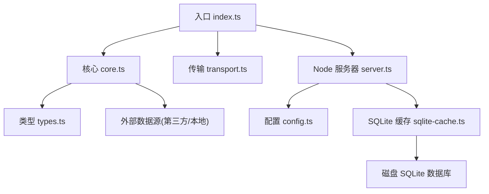
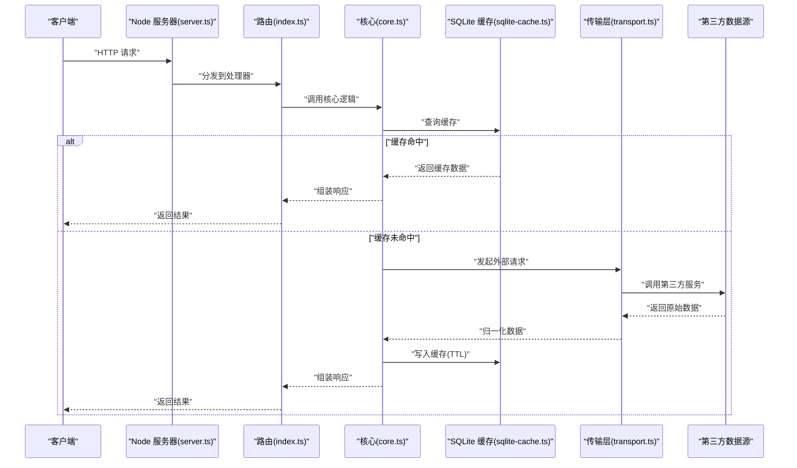
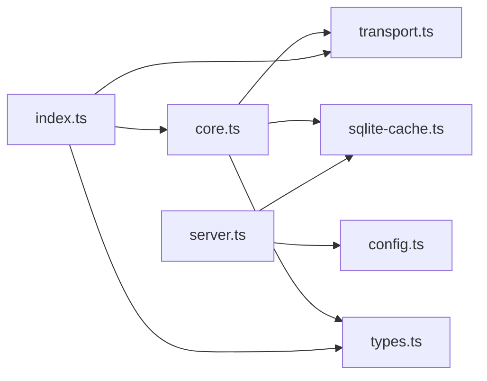

# 元数据网关

<cite>
**本文引用的文件**   
- [metadata-gateway/src/index.ts](file://metadata-gateway/src/index.ts)
- [metadata-gateway/src/core.ts](file://metadata-gateway/src/core.ts)
- [metadata-gateway/src/transport.ts](file://metadata-gateway/src/transport.ts)
- [metadata-gateway/src/types.ts](file://metadata-gateway/src/types.ts)
- [metadata-gateway/src/node/server.ts](file://metadata-gateway/src/node/server.ts)
- [metadata-gateway/src/node/config.ts](file://metadata-gateway/src/node/config.ts)
- [metadata-gateway/src/node/sqlite-cache.ts](file://metadata-gateway/src/node/sqlite-cache.ts)
- [metadata-gateway/package.json](file://metadata-gateway/package.json)
- [metadata-gateway/wrangler.toml](file://metadata-gateway/wrangler.toml)
- [metadata-gateway/Dockerfile](file://metadata-gateway/Dockerfile)
- [metadata-gateway/compose.yaml](file://metadata-gateway/compose.yaml)
- [metadata-gateway/test/core.test.ts](file://metadata-gateway/test/core.test.ts)
- [metadata-gateway/test/server.test.ts](file://metadata-gateway/test/server.test.ts)
- [metadata-gateway/test/sqlite-cache.test.ts](file://metadata-gateway/test/sqlite-cache.test.ts)
</cite>

## 目录
1. [简介](#简介)
2. [项目结构](#项目结构)
3. [核心组件](#核心组件)
4. [架构总览](#架构总览)
5. [详细组件分析](#详细组件分析)
6. [依赖关系分析](#依赖关系分析)
7. [性能与缓存策略](#性能与缓存策略)
8. [部署与运维](#部署与运维)
9. [API 使用示例](#api-使用示例)
10. [错误处理与排障](#错误处理与排障)
11. [扩展与新数据源接入指南](#扩展与新数据源接入指南)
12. [结论](#结论)

## 简介
本仓库包含一个基于 Node.js 的 Echo Android 元数据网关服务，用于聚合音乐元数据查询、艺术家信息获取与专辑封面处理等能力。该网关提供统一的 HTTP API，内部通过可插拔的数据源适配器访问第三方服务或本地存储，并采用 SQLite 作为持久化缓存层以提升响应速度与稳定性。服务支持在 Cloudflare Workers（Wrangler）与容器环境（Docker/Compose）中运行，便于在不同环境中进行部署与扩展。

## 项目结构
metadata-gateway 子模块采用分层设计：
- 入口与路由：index.ts 负责应用初始化与请求分发
- 核心逻辑：core.ts 定义统一的数据模型与编排流程
- 传输层：transport.ts 封装 HTTP 客户端与重试/超时策略
- 类型定义：types.ts 集中管理接口契约与数据结构
- 运行时适配：node/server.ts、node/config.ts、node/sqlite-cache.ts 提供 Node.js 环境下的服务器、配置加载与 SQLite 缓存实现
- 测试：test/* 覆盖核心逻辑、HTTP 行为与缓存实现

图表来源
- [metadata-gateway/src/index.ts](file://metadata-gateway/src/index.ts)
- [metadata-gateway/src/core.ts](file://metadata-gateway/src/core.ts)
- [metadata-gateway/src/transport.ts](file://metadata-gateway/src/transport.ts)
- [metadata-gateway/src/types.ts](file://metadata-gateway/src/types.ts)
- [metadata-gateway/src/node/server.ts](file://metadata-gateway/src/node/server.ts)
- [metadata-gateway/src/node/config.ts](file://metadata-gateway/src/node/config.ts)
- [metadata-gateway/src/node/sqlite-cache.ts](file://metadata-gateway/src/node/sqlite-cache.ts)

章节来源
- [metadata-gateway/src/index.ts](file://metadata-gateway/src/index.ts)
- [metadata-gateway/src/core.ts](file://metadata-gateway/src/core.ts)
- [metadata-gateway/src/transport.ts](file://metadata-gateway/src/transport.ts)
- [metadata-gateway/src/types.ts](file://metadata-gateway/src/types.ts)
- [metadata-gateway/src/node/server.ts](file://metadata-gateway/src/node/server.ts)
- [metadata-gateway/src/node/config.ts](file://metadata-gateway/src/node/config.ts)
- [metadata-gateway/src/node/sqlite-cache.ts](file://metadata-gateway/src/node/sqlite-cache.ts)

## 核心组件
- 入口与路由（index.ts）
  - 负责应用启动、中间件注册、路由挂载与生命周期钩子
  - 将 HTTP 请求映射到具体业务处理器
- 核心逻辑（core.ts）
  - 定义统一的元数据模型与查询编排流程
  - 协调缓存、传输层与数据源适配器
- 传输层（transport.ts）
  - 封装对外部服务的 HTTP 调用，提供超时、重试、退避与错误归一化
- 类型定义（types.ts）
  - 集中声明请求/响应结构、枚举与常量，保证跨模块一致性
- Node 运行时适配（server.ts、config.ts、sqlite-cache.ts）
  - server.ts：创建 HTTP 服务器、绑定端口、健康检查与优雅关闭
  - config.ts：加载环境变量与配置文件，提供默认值与校验
  - sqlite-cache.ts：基于 SQLite 的键值/结构化缓存，支持 TTL 与并发安全

章节来源
- [metadata-gateway/src/index.ts](file://metadata-gateway/src/index.ts)
- [metadata-gateway/src/core.ts](file://metadata-gateway/src/core.ts)
- [metadata-gateway/src/transport.ts](file://metadata-gateway/src/transport.ts)
- [metadata-gateway/src/types.ts](file://metadata-gateway/src/types.ts)
- [metadata-gateway/src/node/server.ts](file://metadata-gateway/src/node/server.ts)
- [metadata-gateway/src/node/config.ts](file://metadata-gateway/src/node/config.ts)
- [metadata-gateway/src/node/sqlite-cache.ts](file://metadata-gateway/src/node/sqlite-cache.ts)

## 架构总览
整体架构围绕“请求进入 -> 路由分发 -> 核心编排 -> 缓存命中/回源 -> 返回结果”的主路径展开。缓存优先策略显著降低对第三方服务的压力；传输层确保外部调用的健壮性；SQLite 提供稳定可靠的本地持久化。

图表来源
- [metadata-gateway/src/node/server.ts](file://metadata-gateway/src/node/server.ts)
- [metadata-gateway/src/index.ts](file://metadata-gateway/src/index.ts)
- [metadata-gateway/src/core.ts](file://metadata-gateway/src/core.ts)
- [metadata-gateway/src/node/sqlite-cache.ts](file://metadata-gateway/src/node/sqlite-cache.ts)
- [metadata-gateway/src/transport.ts](file://metadata-gateway/src/transport.ts)

## 详细组件分析

### 入口与路由（index.ts）
- 职责
  - 初始化应用上下文与依赖注入
  - 注册全局中间件（如日志、限流、CORS）
  - 挂载各功能路由（音乐元数据、艺术家、封面等）
- 关键流程
  - 启动时读取配置并验证必要参数
  - 监听端口并输出健康检查端点
  - 将请求按路径与方法分派至对应处理器

章节来源
- [metadata-gateway/src/index.ts](file://metadata-gateway/src/index.ts)

### 核心逻辑（core.ts）
- 职责
  - 定义统一的元数据模型（歌曲、专辑、艺术家、封面等）
  - 编排查询流程：先查缓存，再回源，最后落库
  - 提供领域方法：按标题/艺人/专辑检索、批量合并去重、封面尺寸裁剪
- 复杂度与优化
  - 缓存键设计考虑查询维度组合，避免缓存穿透
  - 回源失败时采用指数退避与熔断降级
  - 批量查询采用并行执行与结果合并策略

章节来源
- [metadata-gateway/src/core.ts](file://metadata-gateway/src/core.ts)

### 传输层（transport.ts）
- 职责
  - 封装 HTTP 客户端，统一设置超时、重试、退避与鉴权头
  - 解析第三方响应并转换为内部模型
  - 记录遥测指标（耗时、状态码、错误分类）
- 错误处理
  - 网络异常、超时、第三方限流均被捕获并归一化为标准错误对象
  - 支持快速失败与重试上限控制

章节来源
- [metadata-gateway/src/transport.ts](file://metadata-gateway/src/transport.ts)

### 类型定义（types.ts）
- 职责
  - 集中定义请求/响应结构、枚举与常量
  - 为路由、核心与传输层提供一致的契约
- 典型结构
  - 音乐元数据查询输入/输出
  - 艺术家信息与专辑封面结构
  - 错误码与消息体

章节来源
- [metadata-gateway/src/types.ts](file://metadata-gateway/src/types.ts)

### Node 服务器（server.ts）
- 职责
  - 创建并启动 HTTP 服务器
  - 绑定端口、注册健康检查与监控端点
  - 优雅关闭：停止接收新请求、等待进行中请求完成
- 集成点
  - 与配置模块联动，动态调整并发与超时
  - 与缓存模块协作，预热常用键

章节来源
- [metadata-gateway/src/node/server.ts](file://metadata-gateway/src/node/server.ts)

### 配置加载（config.ts）
- 职责
  - 从环境变量与配置文件加载参数
  - 提供默认值与必填项校验
  - 暴露运行时可热更新的开关（如缓存 TTL、重试次数）
- 关键配置项
  - 第三方服务地址、鉴权令牌
  - 缓存 TTL、最大条目数
  - 服务器端口、日志级别、监控开关

章节来源
- [metadata-gateway/src/node/config.ts](file://metadata-gateway/src/node/config.ts)

### SQLite 缓存（sqlite-cache.ts）
- 职责
  - 提供键值/结构化数据的持久化缓存
  - 支持 TTL 过期清理与并发读写
  - 提供批量写入与统计接口
- 性能特性
  - 使用 WAL 模式提升并发读性能
  - 索引优化常见查询键
  - 定期清理过期条目，控制磁盘增长

章节来源
- [metadata-gateway/src/node/sqlite-cache.ts](file://metadata-gateway/src/node/sqlite-cache.ts)

## 依赖关系分析
- 模块内依赖
  - index.ts 依赖 core.ts、transport.ts、types.ts
  - server.ts 依赖 config.ts、sqlite-cache.ts
  - core.ts 依赖 transport.ts、sqlite-cache.ts、types.ts
- 外部依赖
  - HTTP 服务器框架（由 server.ts 引入）
  - SQLite 驱动（由 sqlite-cache.ts 引入）
  - 第三方元数据服务（由 transport.ts 调用）

图表来源
- [metadata-gateway/src/index.ts](file://metadata-gateway/src/index.ts)
- [metadata-gateway/src/core.ts](file://metadata-gateway/src/core.ts)
- [metadata-gateway/src/transport.ts](file://metadata-gateway/src/transport.ts)
- [metadata-gateway/src/types.ts](file://metadata-gateway/src/types.ts)
- [metadata-gateway/src/node/server.ts](file://metadata-gateway/src/node/server.ts)
- [metadata-gateway/src/node/config.ts](file://metadata-gateway/src/node/config.ts)
- [metadata-gateway/src/node/sqlite-cache.ts](file://metadata-gateway/src/node/sqlite-cache.ts)

章节来源
- [metadata-gateway/src/index.ts](file://metadata-gateway/src/index.ts)
- [metadata-gateway/src/core.ts](file://metadata-gateway/src/core.ts)
- [metadata-gateway/src/transport.ts](file://metadata-gateway/src/transport.ts)
- [metadata-gateway/src/types.ts](file://metadata-gateway/src/types.ts)
- [metadata-gateway/src/node/server.ts](file://metadata-gateway/src/node/server.ts)
- [metadata-gateway/src/node/config.ts](file://metadata-gateway/src/node/config.ts)
- [metadata-gateway/src/node/sqlite-cache.ts](file://metadata-gateway/src/node/sqlite-cache.ts)

## 性能与缓存策略
- 缓存优先
  - 所有查询先查 SQLite 缓存，命中则直接返回
  - 未命中时回源第三方服务，并将结果写入缓存并设置 TTL
- 并发与吞吐
  - 使用连接池与 WAL 模式提升 SQLite 并发读性能
  - 传输层并行调用多个数据源，合并结果后去重
- 资源控制
  - 限制最大并发请求数与队列长度
  - 针对慢上游启用超时与快速失败，避免雪崩
- 监控与告警
  - 记录关键指标：QPS、P95/P99 延迟、缓存命中率、错误率
  - 当错误率或延迟超过阈值触发告警

[本节为通用性能建议，不直接分析具体文件]

## 部署与运维
- 容器化部署
  - Dockerfile 定义镜像构建步骤与运行环境
  - compose.yaml 编排服务与 SQLite 数据卷，便于本地与 CI 环境运行
- 边缘部署
  - wrangler.toml 配置 Cloudflare Workers 相关参数（如内存、超时、KV/DB 绑定）
- 负载均衡
  - 在多实例部署场景下，使用反向代理（Nginx/Traefik）进行轮询或加权分配
  - 结合健康检查端点进行自动摘除与恢复
- 监控与日志
  - 开启结构化日志与指标导出（Prometheus/Grafana）
  - 配置告警规则：高错误率、低缓存命中率、长尾延迟

章节来源
- [metadata-gateway/Dockerfile](file://metadata-gateway/Dockerfile)
- [metadata-gateway/compose.yaml](file://metadata-gateway/compose.yaml)
- [metadata-gateway/wrangler.toml](file://metadata-gateway/wrangler.toml)

## API 使用示例
以下为常见接口的使用方式说明（以路径与参数为主，不包含具体代码片段）：
- 音乐元数据查询
  - 方法：GET
  - 路径：/api/v1/tracks
  - 查询参数：title、artist、album、limit、offset
  - 响应：返回匹配的歌曲列表，包含标题、艺人、专辑、时长、封面缩略图 URL
  - 示例：/api/v1/tracks?title=示例&artist=示例&limit=10
- 艺术家信息获取
  - 方法：GET
  - 路径：/api/v1/artists/{id}
  - 路径参数：id（艺术家唯一标识）
  - 响应：返回艺术家基本信息、头像、热门曲目列表
  - 示例：/api/v1/artists/12345
- 专辑封面处理
  - 方法：GET
  - 路径：/api/v1/artworks/{id}
  - 查询参数：width、height、format（可选）
  - 响应：返回指定尺寸的专辑封面图片
  - 示例：/api/v1/artworks/67890?width=256&height=256&format=webp

[本节为概念性 API 说明，不直接分析具体文件]

## 错误处理与排障
- 错误分类
  - 客户端错误：参数缺失、格式错误、权限不足
  - 服务端错误：内部异常、依赖不可用、缓存写入失败
  - 上游错误：第三方服务超时、限流、返回空数据
- 统一响应
  - 所有错误返回标准错误体，包含错误码、消息与建议操作
- 排障要点
  - 检查健康检查端点是否可用
  - 查看日志中的错误堆栈与上游状态码
  - 确认缓存 TTL 与容量配置是否合理
  - 验证第三方服务鉴权与配额

章节来源
- [metadata-gateway/test/core.test.ts](file://metadata-gateway/test/core.test.ts)
- [metadata-gateway/test/server.test.ts](file://metadata-gateway/test/server.test.ts)
- [metadata-gateway/test/sqlite-cache.test.ts](file://metadata-gateway/test/sqlite-cache.test.ts)

## 扩展与新数据源接入指南
- 新增数据源适配器
  - 在 core.ts 中注册新的适配器，实现统一的查询接口
  - 在 transport.ts 中为该适配器配置独立的超时与重试策略
- 缓存键设计
  - 为新数据源的查询维度设计稳定的缓存键，避免冲突
  - 根据数据更新频率设置合适的 TTL
- 路由与类型
  - 在 index.ts 中挂载新路由，并在 types.ts 中定义对应的请求/响应结构
- 测试与回归
  - 为核心逻辑与缓存实现补充单元测试与集成测试
  - 模拟第三方服务异常，验证降级与恢复流程

章节来源
- [metadata-gateway/src/core.ts](file://metadata-gateway/src/core.ts)
- [metadata-gateway/src/transport.ts](file://metadata-gateway/src/transport.ts)
- [metadata-gateway/src/index.ts](file://metadata-gateway/src/index.ts)
- [metadata-gateway/src/types.ts](file://metadata-gateway/src/types.ts)

## 结论
该元数据网关通过清晰的层次划分与可插拔的数据源设计，实现了高性能、可扩展的音乐元数据服务能力。SQLite 缓存与传输层的健壮性保障使其在生产环境中具备良好稳定性。配合完善的测试与文档，团队可以快速接入新数据源并进行持续优化。