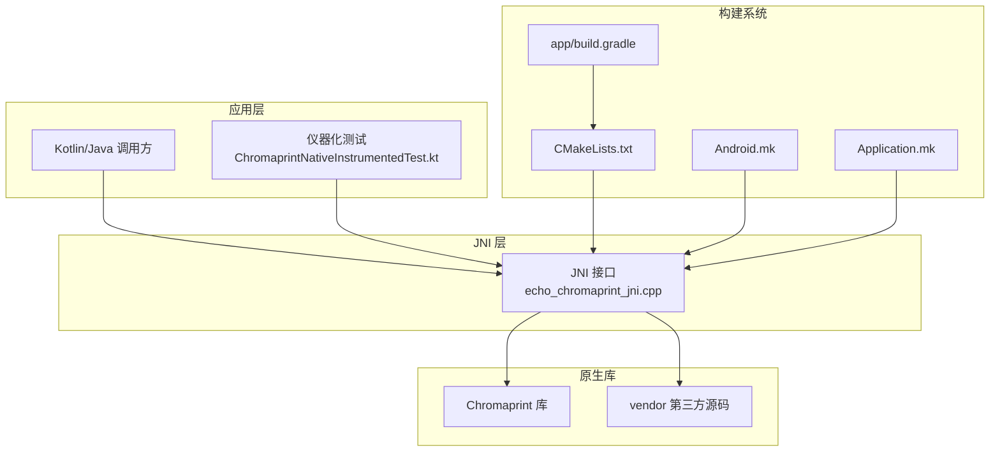
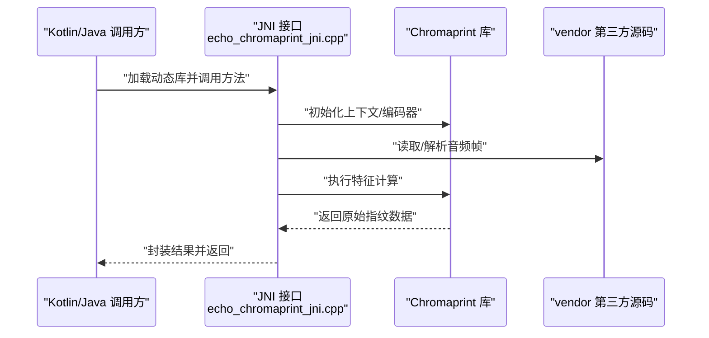
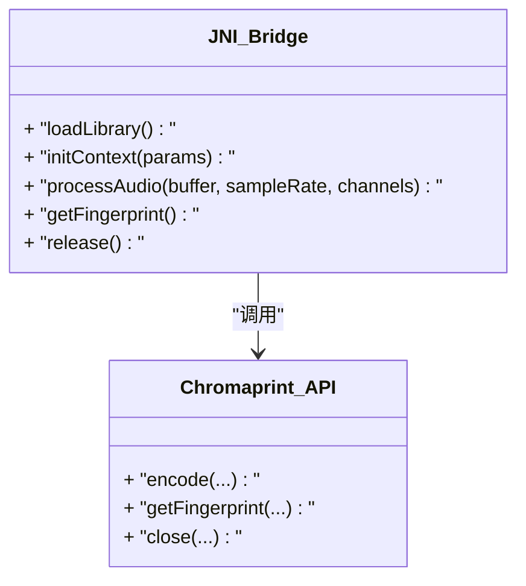
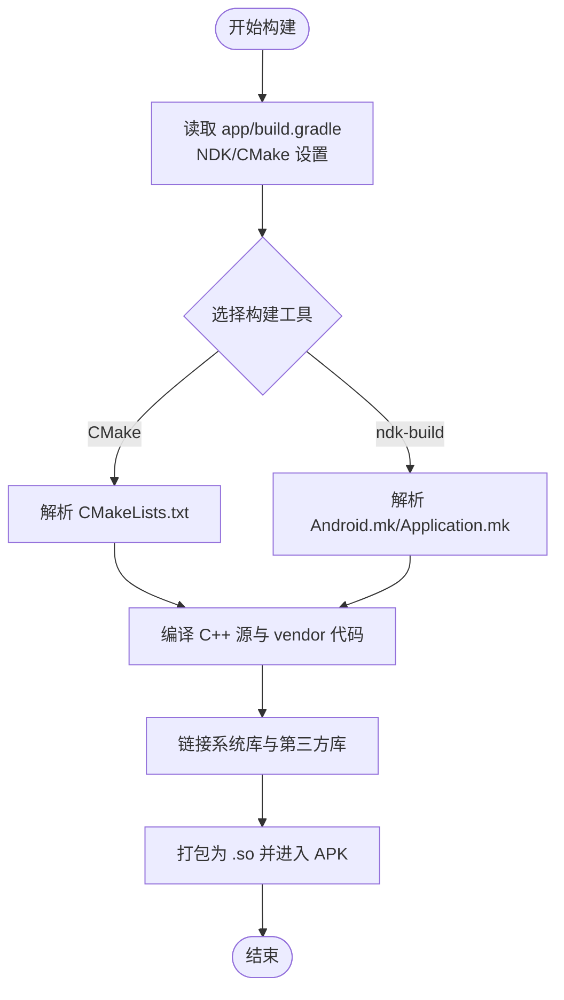
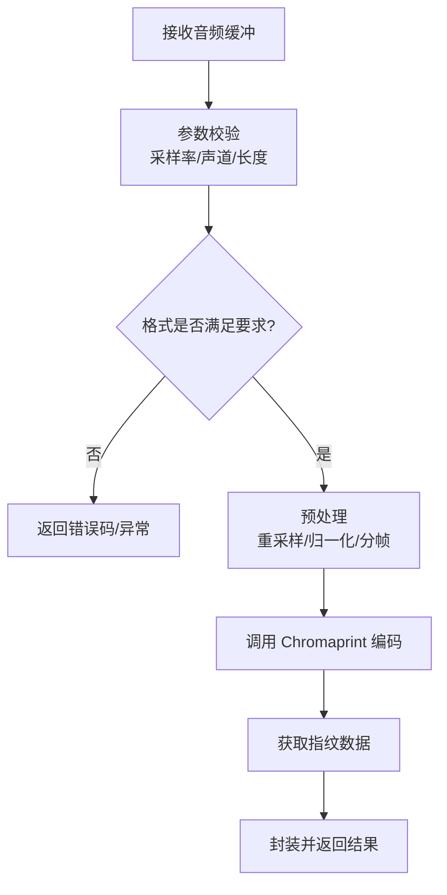
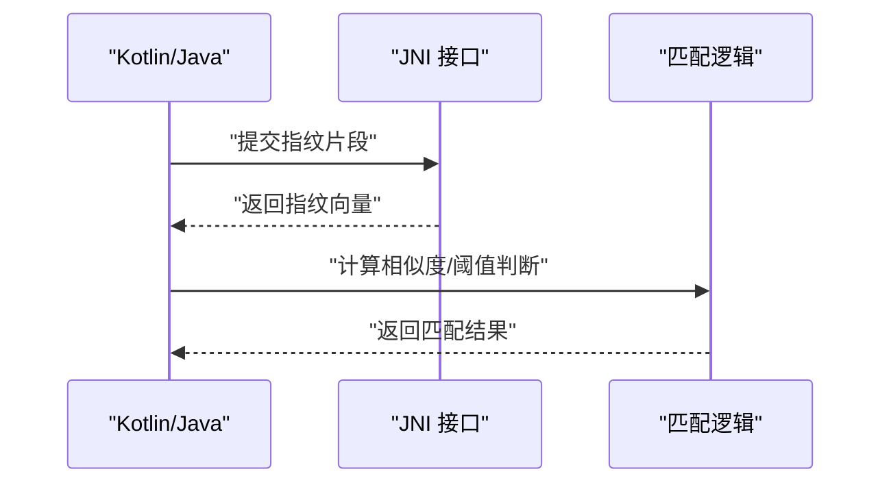
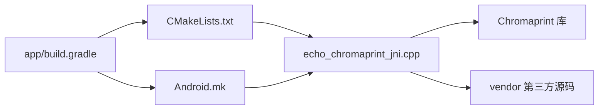

# 原生功能集成

<cite>
**本文引用的文件**   
- [echo_chromaprint_jni.cpp](file://app/src/main/cpp/echo_chromaprint_jni.cpp)
- [CMakeLists.txt](file://app/src/main/cpp/CMakeLists.txt)
- [Android.mk](file://app/src/main/cpp/Android.mk)
- [Application.mk](file://app/src/main/cpp/Application.mk)
- [ChromaprintNativeInstrumentedTest.kt](file://app/src/androidTest/java/app/yukine/fingerprint/ChromaprintNativeInstrumentedTest.kt)
- [build.gradle](file://app/build.gradle)
</cite>

## 目录
1. [简介](#简介)
2. [项目结构](#项目结构)
3. [核心组件](#核心组件)
4. [架构总览](#架构总览)
5. [详细组件分析](#详细组件分析)
6. [依赖关系分析](#依赖关系分析)
7. [性能考虑](#性能考虑)
8. [故障排除指南](#故障排除指南)
9. [结论](#结论)
10. [附录](#附录)

## 简介
本技术文档聚焦于 Echo Android 应用中的原生音频指纹识别能力，围绕 Chromaprint 库的集成、JNI 桥接、C++ 实现与 Kotlin/Java 交互进行系统化说明。文档涵盖：
- JNI 层设计与 C++ 实现要点
- 音频分析与指纹生成流程
- 匹配策略与上层调用方式
- 内存管理、异常处理与线程模型
- 构建配置、调试方法与性能分析
- 扩展指南与常见问题排查

## 项目结构
与原生音频指纹相关的关键位置如下：
- app/src/main/cpp：包含 JNI 入口、CMake/NDK 构建脚本与第三方源码目录
- app/src/androidTest/java/app/yukine/fingerprint：针对原生指纹能力的仪器化测试
- app/build.gradle：模块级构建配置（含 NDK/CMake 集成）

图表来源
- [echo_chromaprint_jni.cpp](file://app/src/main/cpp/echo_chromaprint_jni.cpp)
- [CMakeLists.txt](file://app/src/main/cpp/CMakeLists.txt)
- [Android.mk](file://app/src/main/cpp/Android.mk)
- [Application.mk](file://app/src/main/cpp/Application.mk)
- [ChromaprintNativeInstrumentedTest.kt](file://app/src/androidTest/java/app/yukine/fingerprint/ChromaprintNativeInstrumentedTest.kt)
- [build.gradle](file://app/build.gradle)

章节来源
- [echo_chromaprint_jni.cpp](file://app/src/main/cpp/echo_chromaprint_jni.cpp)
- [CMakeLists.txt](file://app/src/main/cpp/CMakeLists.txt)
- [Android.mk](file://app/src/main/cpp/Android.mk)
- [Application.mk](file://app/src/main/cpp/Application.mk)
- [ChromaprintNativeInstrumentedTest.kt](file://app/src/androidTest/java/app/yukine/fingerprint/ChromaprintNativeInstrumentedTest.kt)
- [build.gradle](file://app/build.gradle)

## 核心组件
- JNI 桥接层：负责在 Java/Kotlin 与 C++ 之间传递音频数据、参数与结果，并处理异常与资源释放。
- Chromaprint 集成：封装音频预处理、特征提取与指纹序列化/反序列化的关键路径。
- 构建系统：通过 CMake 或 ndk-build 将 vendor 源码与系统库链接为 .so，供运行时加载。
- 测试与验证：仪器化测试覆盖端到端的数据流与边界条件。

章节来源
- [echo_chromaprint_jni.cpp](file://app/src/main/cpp/echo_chromaprint_jni.cpp)
- [CMakeLists.txt](file://app/src/main/cpp/CMakeLists.txt)
- [Android.mk](file://app/src/main/cpp/Android.mk)
- [Application.mk](file://app/src/main/cpp/Application.mk)
- [ChromaprintNativeInstrumentedTest.kt](file://app/src/androidTest/java/app/yukine/fingerprint/ChromaprintNativeInstrumentedTest.kt)
- [build.gradle](file://app/build.gradle)

## 架构总览
下图展示从 Kotlin/Java 到原生层的调用链路与数据流向。

图表来源
- [echo_chromaprint_jni.cpp](file://app/src/main/cpp/echo_chromaprint_jni.cpp)
- [CMakeLists.txt](file://app/src/main/cpp/CMakeLists.txt)
- [Android.mk](file://app/src/main/cpp/Android.mk)
- [Application.mk](file://app/src/main/cpp/Application.mk)

## 详细组件分析

### JNI 桥接层（C++）
职责与要点：
- 暴露稳定的 native 方法签名，接收字节数组/缓冲区、采样率、声道数等参数。
- 对输入数据进行校验（长度、格式），必要时做重采样与归一化。
- 调用 Chromaprint API 完成特征提取，并将结果以紧凑格式返回给上层。
- 管理对象生命周期，确保错误路径下释放所有分配的资源。
- 抛出可被上层捕获的异常信息，避免崩溃。

图表来源
- [echo_chromaprint_jni.cpp](file://app/src/main/cpp/echo_chromaprint_jni.cpp)

章节来源
- [echo_chromaprint_jni.cpp](file://app/src/main/cpp/echo_chromaprint_jni.cpp)

### 构建系统与链接（CMake/ndk-build）
- CMakeLists.txt：定义目标库、源文件集合、包含路径与链接选项；可选择性启用优化开关。
- Android.mk/Application.mk：用于 ndk-build 场景下的 ABI、工具链与编译标志配置。
- app/build.gradle：声明使用 NDK/CMake，指定 targetSdk/minSdk、ABI 过滤与打包策略。

图表来源
- [CMakeLists.txt](file://app/src/main/cpp/CMakeLists.txt)
- [Android.mk](file://app/src/main/cpp/Android.mk)
- [Application.mk](file://app/src/main/cpp/Application.mk)
- [build.gradle](file://app/build.gradle)

章节来源
- [CMakeLists.txt](file://app/src/main/cpp/CMakeLists.txt)
- [Android.mk](file://app/src/main/cpp/Android.mk)
- [Application.mk](file://app/src/main/cpp/Application.mk)
- [build.gradle](file://app/build.gradle)

### 音频分析与指纹生成流程
整体流程包括：
- 输入校验与预处理（采样率、声道、位深）
- 可选的重采样与分帧
- 调用 Chromaprint 进行频谱分析与特征编码
- 输出指纹数据（二进制/文本）供后续匹配使用

图表来源
- [echo_chromaprint_jni.cpp](file://app/src/main/cpp/echo_chromaprint_jni.cpp)

章节来源
- [echo_chromaprint_jni.cpp](file://app/src/main/cpp/echo_chromaprint_jni.cpp)

### 匹配策略与上层集成
- 指纹比较：通常基于汉明距离或余弦相似度，结合阈值判定是否匹配。
- 批量匹配：对候选集进行并行扫描，按得分排序后取 Top-N。
- 缓存与索引：对常用指纹建立倒排索引或哈希表，提升检索效率。
- 与播放链路集成：在后台任务中异步计算指纹，避免阻塞 UI 线程。

图表来源
- [ChromaprintNativeInstrumentedTest.kt](file://app/src/androidTest/java/app/yukine/fingerprint/ChromaprintNativeInstrumentedTest.kt)

章节来源
- [ChromaprintNativeInstrumentedTest.kt](file://app/src/androidTest/java/app/yukine/fingerprint/ChromaprintNativeInstrumentedTest.kt)

## 依赖关系分析
- 直接依赖：JNI 层依赖 Chromaprint 库与 vendor 源码；构建系统依赖 Gradle/NDK/CMake。
- 间接依赖：系统音频解码器、平台库（如 libm、liblog）。
- 耦合与内聚：JNI 作为稳定边界，内部实现变更不影响上层；构建配置集中管理，便于多 ABI 适配。

图表来源
- [build.gradle](file://app/build.gradle)
- [CMakeLists.txt](file://app/src/main/cpp/CMakeLists.txt)
- [Android.mk](file://app/src/main/cpp/Android.mk)
- [echo_chromaprint_jni.cpp](file://app/src/main/cpp/echo_chromaprint_jni.cpp)

章节来源
- [build.gradle](file://app/build.gradle)
- [CMakeLists.txt](file://app/src/main/cpp/CMakeLists.txt)
- [Android.mk](file://app/src/main/cpp/Android.mk)
- [echo_chromaprint_jni.cpp](file://app/src/main/cpp/echo_chromaprint_jni.cpp)

## 性能考虑
- 线程模型：在独立工作线程执行重型计算，避免主线程卡顿。
- 内存复用：重用缓冲区与上下文对象，减少频繁分配/释放。
- 批处理：合并小段音频为较大批次以降低调用开销。
- 精度与速度权衡：调整 Chromaprint 参数（如窗口大小、步长）平衡质量与耗时。
- 构建优化：开启编译器优化（如 -O2/-O3）、裁剪不必要的符号与日志。

[本节为通用指导，不直接分析具体文件]

## 故障排除指南
- 动态库加载失败：检查 ABI 过滤、库名与路径、minSdk/targetSdk 兼容性。
- 崩溃与异常：定位 JNI 抛出的异常类型与堆栈，确认输入参数合法性。
- 内存泄漏：使用 LeakCanary/AS Profiler 跟踪对象生命周期，确保 release/close 成对调用。
- 构建问题：核对 CMake/ndk-build 变量、NDK 版本与工具链一致性。
- 性能退化：对比不同参数组合的耗时与内存占用，回归基线指标。

章节来源
- [ChromaprintNativeInstrumentedTest.kt](file://app/src/androidTest/java/app/yukine/fingerprint/ChromaprintNativeInstrumentedTest.kt)
- [CMakeLists.txt](file://app/src/main/cpp/CMakeLists.txt)
- [Android.mk](file://app/src/main/cpp/Android.mk)
- [Application.mk](file://app/src/main/cpp/Application.mk)
- [build.gradle](file://app/build.gradle)

## 结论
通过将 Chromaprint 集成至 JNI 层，Echo Android 实现了高效、可扩展的音频指纹识别能力。清晰的 JNI 边界、完善的构建配置与测试用例保障了稳定性与可维护性。建议在生产环境中持续监控性能指标，并结合业务需求调优参数与匹配策略。

[本节为总结性内容，不直接分析具体文件]

## 附录

### 构建与调试清单
- 构建
  - 使用 Gradle 触发 NDK/CMake 构建，指定 ABI 过滤以减少包体。
  - 若使用 ndk-build，确保 Application.mk 与 Android.mk 一致。
- 调试
  - 使用 logcat 查看原生日志；在 JNI 层添加必要断言与错误码。
  - 借助 AS Profiler 观察 CPU/内存热点。
- 测试
  - 运行仪器化测试覆盖典型与边界用例。
  - 引入基准测试评估不同参数下的性能变化。

章节来源
- [CMakeLists.txt](file://app/src/main/cpp/CMakeLists.txt)
- [Android.mk](file://app/src/main/cpp/Android.mk)
- [Application.mk](file://app/src/main/cpp/Application.mk)
- [build.gradle](file://app/build.gradle)
- [ChromaprintNativeInstrumentedTest.kt](file://app/src/androidTest/java/app/yukine/fingerprint/ChromaprintNativeInstrumentedTest.kt)