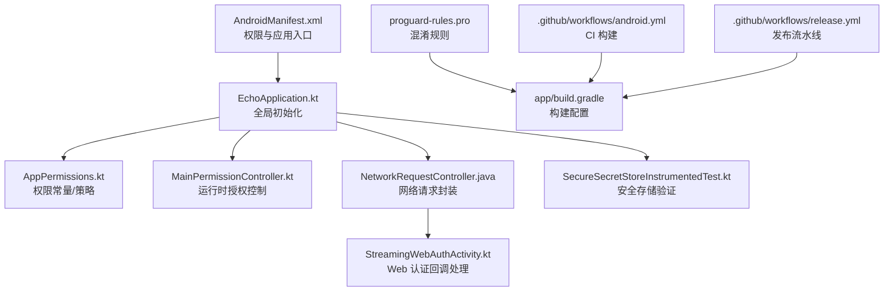
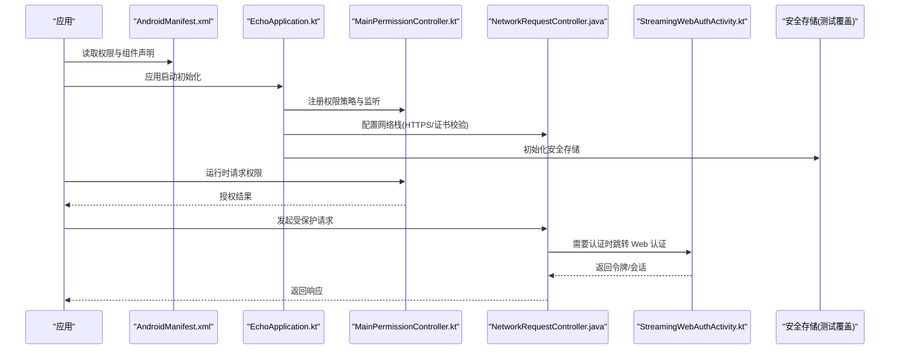
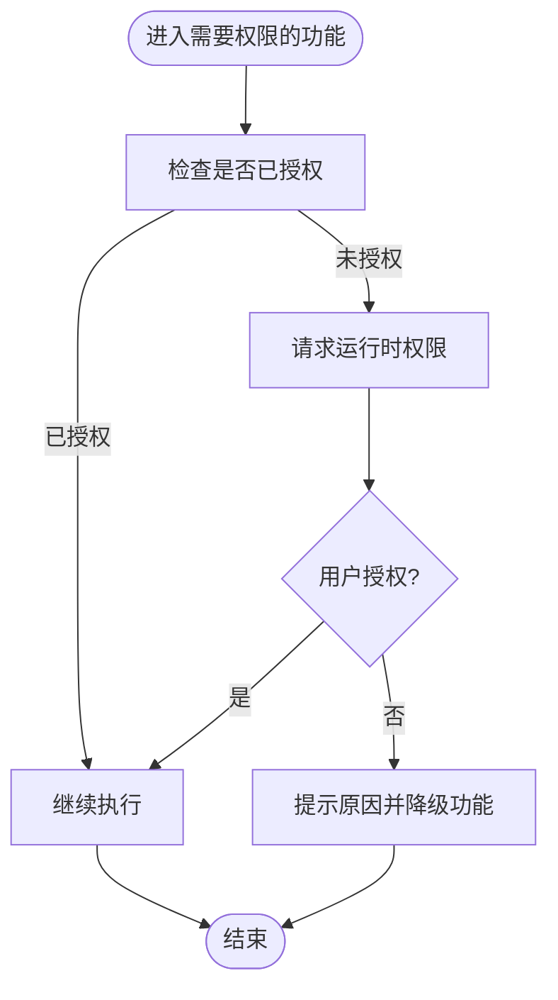
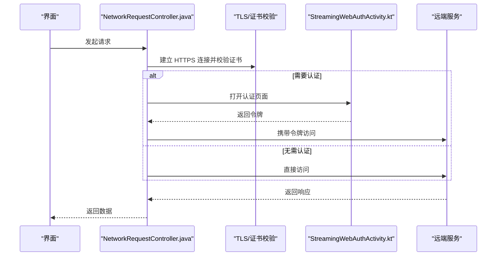
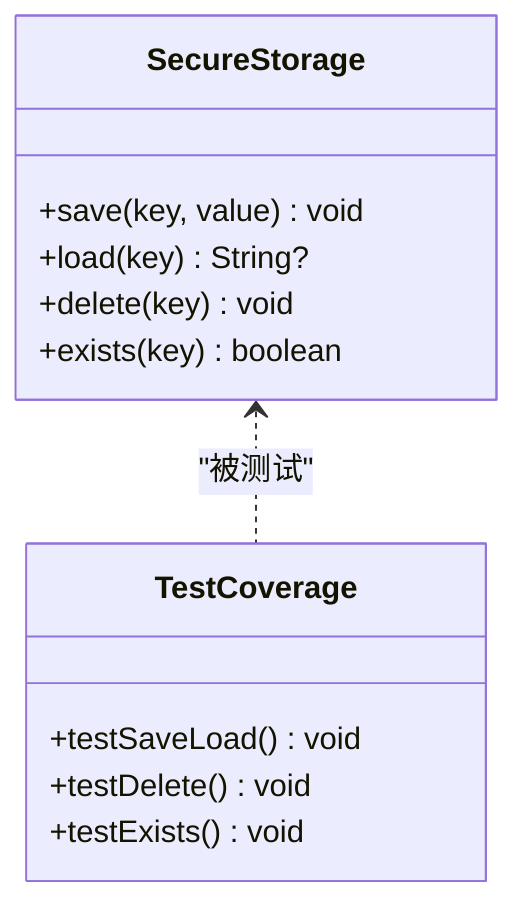
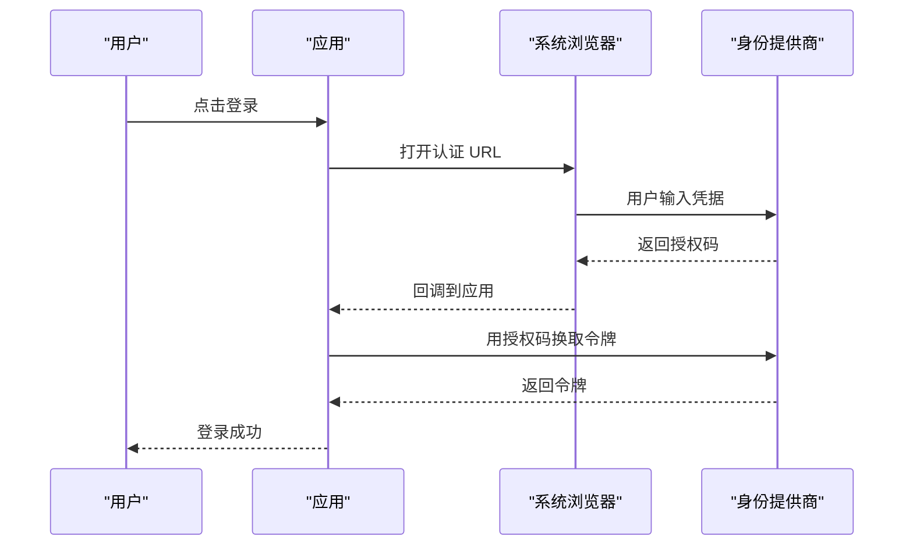
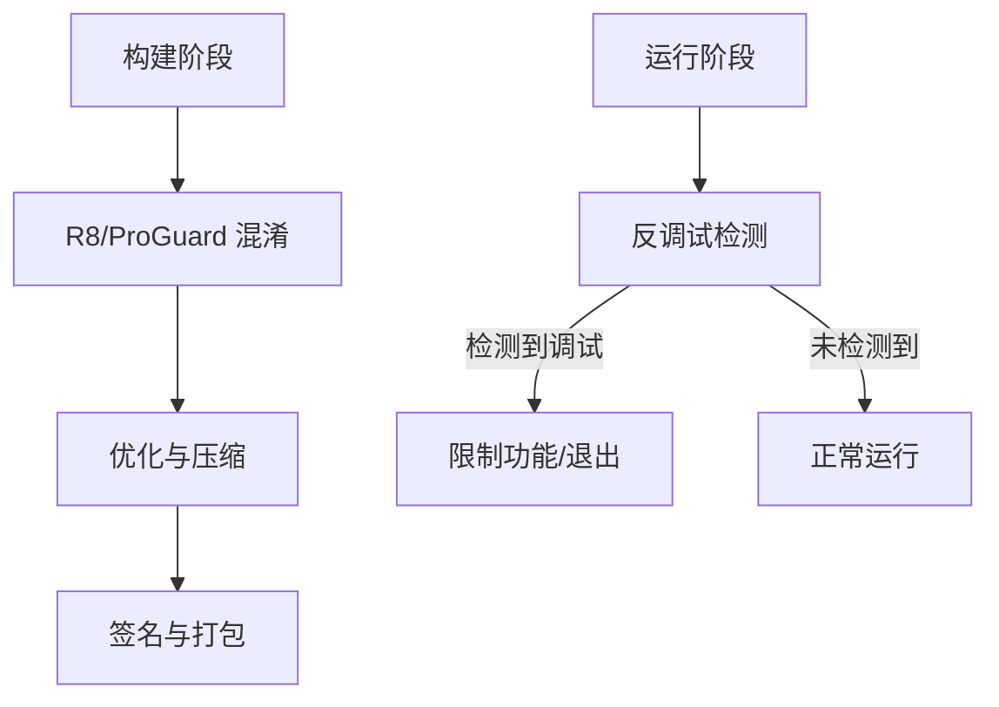
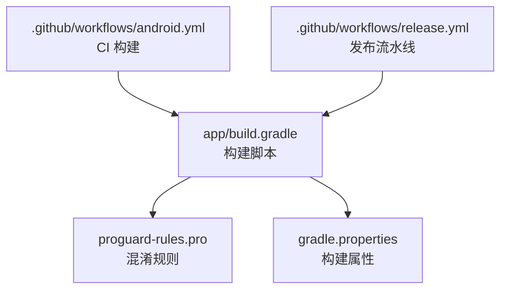

# 安全考虑

<cite>
**本文引用的文件**   
- [AndroidManifest.xml](file://app/src/main/AndroidManifest.xml)
- [EchoApplication.kt](file://app/src/main/java/app/yukine/EchoApplication.kt)
- [AppPermissions.kt](file://app/src/main/java/app/yukine/AppPermissions.kt)
- [MainPermissionController.kt](file://app/src/main/java/app/yukine/MainPermissionController.kt)
- [SecureSecretStoreInstrumentedTest.kt](file://app/src/androidTest/java/app/yukine/security/SecureSecretStoreInstrumentedTest.kt)
- [NetworkRequestController.java](file://app/src/main/java/app/yukine/NetworkRequestController.java)
- [StreamingWebAuthActivity.kt](file://app/src/main/java/app/yukine/StreamingWebAuthActivity.kt)
- [proguard-rules.pro](file://app/proguard-rules.pro)
- [build.gradle](file://app/build.gradle)
- [gradle.properties](file://gradle.properties)
- [android.yml](file://.github/workflows/android.yml)
- [release.yml](file://.github/workflows/release.yml)
</cite>

## 目录
1. [简介](#简介)
2. [项目结构](#项目结构)
3. [核心组件](#核心组件)
4. [架构总览](#架构总览)
5. [详细组件分析](#详细组件分析)
6. [依赖分析](#依赖分析)
7. [性能与安全权衡](#性能与安全权衡)
8. [故障排查指南](#故障排查指南)
9. [结论](#结论)
10. [附录](#附录)

## 简介
本文件为 Echo Android 应用的安全文档，聚焦数据安全策略、网络安全配置、权限最小化原则、敏感信息存储与加密解密实现、HTTPS 配置、用户隐私保护与数据收集合规、第三方服务安全、代码混淆与反调试措施、安全漏洞防护、安全审计方法与最佳实践。内容基于仓库现有源码与构建配置进行梳理，并给出可操作的改进建议与图示说明。

## 项目结构
从安全视角看，关键位置包括：
- 应用清单与全局初始化：AndroidManifest.xml、EchoApplication.kt
- 权限声明与运行时授权：AppPermissions.kt、MainPermissionController.kt
- 网络请求与认证流程：NetworkRequestController.java、StreamingWebAuthActivity.kt
- 安全存储测试用例（体现安全能力边界）：SecureSecretStoreInstrumentedTest.kt
- 混淆与构建加固：proguard-rules.pro、app/build.gradle、gradle.properties
- CI/CD 流水线中的安全相关步骤：.github/workflows/android.yml、release.yml

**图表来源**
- [AndroidManifest.xml](file://app/src/main/AndroidManifest.xml)
- [EchoApplication.kt](file://app/src/main/java/app/yukine/EchoApplication.kt)
- [AppPermissions.kt](file://app/src/main/java/app/yukine/AppPermissions.kt)
- [MainPermissionController.kt](file://app/src/main/java/app/yukine/MainPermissionController.kt)
- [NetworkRequestController.java](file://app/src/main/java/app/yukine/NetworkRequestController.java)
- [StreamingWebAuthActivity.kt](file://app/src/main/java/app/yukine/StreamingWebAuthActivity.kt)
- [SecureSecretStoreInstrumentedTest.kt](file://app/src/androidTest/java/app/yukine/security/SecureSecretStoreInstrumentedTest.kt)
- [proguard-rules.pro](file://app/proguard-rules.pro)
- [build.gradle](file://app/build.gradle)
- [android.yml](file://.github/workflows/android.yml)
- [release.yml](file://.github/workflows/release.yml)

**章节来源**
- [AndroidManifest.xml](file://app/src/main/AndroidManifest.xml)
- [EchoApplication.kt](file://app/src/main/java/app/yukine/EchoApplication.kt)
- [AppPermissions.kt](file://app/src/main/java/app/yukine/AppPermissions.kt)
- [MainPermissionController.kt](file://app/src/main/java/app/yukine/MainPermissionController.kt)
- [NetworkRequestController.java](file://app/src/main/java/app/yukine/NetworkRequestController.java)
- [StreamingWebAuthActivity.kt](file://app/src/main/java/app/yukine/StreamingWebAuthActivity.kt)
- [SecureSecretStoreInstrumentedTest.kt](file://app/src/androidTest/java/app/yukine/security/SecureSecretStoreInstrumentedTest.kt)
- [proguard-rules.pro](file://app/proguard-rules.pro)
- [build.gradle](file://app/build.gradle)
- [gradle.properties](file://gradle.properties)
- [android.yml](file://.github/workflows/android.yml)
- [release.yml](file://.github/workflows/release.yml)

## 核心组件
- 应用入口与全局初始化：负责初始化日志、崩溃上报、网络栈、安全存储等基础能力。需确保不启用调试选项、禁用不安全配置、仅加载必要功能。
- 权限管理：集中定义所需权限与运行时授权流程，遵循最小权限原则，按需申请、动态拒绝处理。
- 网络层：统一封装 HTTP 客户端，强制 HTTPS、证书校验、超时与重试策略、敏感头过滤。
- Web 认证：通过浏览器或 WebView 完成 OAuth 登录，避免在应用内硬编码凭据，正确处理回调与令牌生命周期。
- 安全存储：使用系统级安全存储机制保存密钥与敏感数据，结合测试用例验证可用性。
- 混淆与构建：启用 ProGuard/R8 混淆、资源压缩、签名与完整性校验；在 CI 中固化安全构建参数。

**章节来源**
- [EchoApplication.kt](file://app/src/main/java/app/yukine/EchoApplication.kt)
- [AppPermissions.kt](file://app/src/main/java/app/yukine/AppPermissions.kt)
- [MainPermissionController.kt](file://app/src/main/java/app/yukine/MainPermissionController.kt)
- [NetworkRequestController.java](file://app/src/main/java/app/yukine/NetworkRequestController.java)
- [StreamingWebAuthActivity.kt](file://app/src/main/java/app/yukine/StreamingWebAuthActivity.kt)
- [SecureSecretStoreInstrumentedTest.kt](file://app/src/androidTest/java/app/yukine/security/SecureSecretStoreInstrumentedTest.kt)
- [proguard-rules.pro](file://app/proguard-rules.pro)
- [build.gradle](file://app/build.gradle)
- [gradle.properties](file://gradle.properties)

## 架构总览
下图展示安全相关的关键交互路径：应用启动后初始化安全策略，权限控制器协调运行时授权，网络层统一处理 HTTPS 与认证，Web 认证活动负责外部身份提供商的交互，安全存储用于持久化敏感信息。

**图表来源**
- [AndroidManifest.xml](file://app/src/main/AndroidManifest.xml)
- [EchoApplication.kt](file://app/src/main/java/app/yukine/EchoApplication.kt)
- [MainPermissionController.kt](file://app/src/main/java/app/yukine/MainPermissionController.kt)
- [NetworkRequestController.java](file://app/src/main/java/app/yukine/NetworkRequestController.java)
- [StreamingWebAuthActivity.kt](file://app/src/main/java/app/yukine/StreamingWebAuthActivity.kt)
- [SecureSecretStoreInstrumentedTest.kt](file://app/src/androidTest/java/app/yukine/security/SecureSecretStoreInstrumentedTest.kt)

## 详细组件分析

### 权限最小化与运行时授权
- 权限声明与策略：在清单文件中声明最小必要权限，并在运行时通过权限控制器动态申请。对危险权限提供明确的用户提示与拒绝后的降级体验。
- 权限常量与映射：集中维护权限名称与用途，便于审计与变更。
- 授权结果处理：根据授权结果决定是否继续执行敏感操作，避免越权访问。

**图表来源**
- [AppPermissions.kt](file://app/src/main/java/app/yukine/AppPermissions.kt)
- [MainPermissionController.kt](file://app/src/main/java/app/yukine/MainPermissionController.kt)

**章节来源**
- [AppPermissions.kt](file://app/src/main/java/app/yukine/AppPermissions.kt)
- [MainPermissionController.kt](file://app/src/main/java/app/yukine/MainPermissionController.kt)

### 网络安全与 HTTPS 配置
- 统一网络层：所有网络请求通过统一的控制器发起，强制 HTTPS、启用证书校验、设置合理的超时与重试策略。
- 敏感头与日志：避免在日志中输出敏感信息，必要时对请求体与响应体进行脱敏。
- 认证集成：当需要身份认证时，跳转到 Web 认证活动，避免在应用内直接处理密码。

**图表来源**
- [NetworkRequestController.java](file://app/src/main/java/app/yukine/NetworkRequestController.java)
- [StreamingWebAuthActivity.kt](file://app/src/main/java/app/yukine/StreamingWebAuthActivity.kt)

**章节来源**
- [NetworkRequestController.java](file://app/src/main/java/app/yukine/NetworkRequestController.java)
- [StreamingWebAuthActivity.kt](file://app/src/main/java/app/yukine/StreamingWebAuthActivity.kt)

### 敏感信息存储与加密解密
- 安全存储：使用系统提供的安全存储机制保存密钥与敏感数据，避免明文落盘。
- 测试覆盖：通过仪器化测试验证安全存储的可用性与正确性，确保在不同设备与版本上行为一致。
- 密钥管理：避免在代码或资源中硬编码密钥，优先使用运行时生成或外部注入。

**图表来源**
- [SecureSecretStoreInstrumentedTest.kt](file://app/src/androidTest/java/app/yukine/security/SecureSecretStoreInstrumentedTest.kt)

**章节来源**
- [SecureSecretStoreInstrumentedTest.kt](file://app/src/androidTest/java/app/yukine/security/SecureSecretStoreInstrumentedTest.kt)

### 用户隐私保护与数据收集合规
- 数据最小化：仅收集实现功能所必需的数据，并提供关闭或导出选项。
- 透明告知：在首次使用时以清晰方式告知数据收集范围与用途。
- 本地优先：尽可能在本地处理敏感数据，减少上传风险。
- 第三方服务：对第三方 SDK 进行白名单管理与最小权限接入，定期评估其隐私政策与安全风险。

[本节为通用指导，不直接分析具体文件]

### 第三方服务安全
- 认证与令牌：通过标准 OAuth 流程获取令牌，避免在应用内存储用户密码。
- 回调安全：严格校验回调来源与参数，防止重放与注入攻击。
- 会话管理：合理设置令牌有效期与刷新策略，及时清理过期会话。

**图表来源**
- [StreamingWebAuthActivity.kt](file://app/src/main/java/app/yukine/StreamingWebAuthActivity.kt)

**章节来源**
- [StreamingWebAuthActivity.kt](file://app/src/main/java/app/yukine/StreamingWebAuthActivity.kt)

### 代码混淆与反调试
- 混淆与压缩：启用 ProGuard/R8 混淆与资源压缩，移除无用代码与调试信息。
- 构建参数：在 gradle.properties 中固化安全构建参数，如禁用调试符号、开启优化。
- 反调试：在运行期检测调试器附加、模拟器环境异常等，必要时限制功能或退出。

**图表来源**
- [proguard-rules.pro](file://app/proguard-rules.pro)
- [build.gradle](file://app/build.gradle)
- [gradle.properties](file://gradle.properties)

**章节来源**
- [proguard-rules.pro](file://app/proguard-rules.pro)
- [build.gradle](file://app/build.gradle)
- [gradle.properties](file://gradle.properties)

### 安全漏洞防护
- 输入校验：对所有外部输入进行类型、长度、格式校验，防止注入与越界。
- 输出编码：在 UI 渲染与日志输出时对敏感信息进行脱敏。
- 组件暴露：谨慎暴露 Activity、Service、BroadcastReceiver，避免被其他应用滥用。
- 文件与存储：避免将敏感数据写入外部存储，必要时使用沙箱或安全存储。

[本节为通用指导，不直接分析具体文件]

### 安全审计方法
- 静态分析：使用 Lint、Detekt、Semgrep 等工具扫描潜在安全问题。
- 动态分析：在调试与测试环境中启用网络抓包、内存dump、反调试检测。
- 依赖审计：定期检查第三方库的 CVE 与更新状态，及时升级。
- 渗透测试：模拟真实攻击场景，验证权限绕过、中间人攻击、令牌泄露等风险。

[本节为通用指导，不直接分析具体文件]

### 安全最佳实践指南
- 默认安全：默认启用 HTTPS、证书校验、最小权限。
- 分层防御：在 UI、业务、网络、存储各层实施安全检查。
- 持续监控：记录安全事件与异常，建立告警与回滚机制。
- 培训与流程：团队定期进行安全培训，纳入代码评审与发布门禁。

[本节为通用指导，不直接分析具体文件]

## 依赖分析
构建与发布流水线中的安全相关依赖与步骤如下：

**图表来源**
- [android.yml](file://.github/workflows/android.yml)
- [release.yml](file://.github/workflows/release.yml)
- [build.gradle](file://app/build.gradle)
- [proguard-rules.pro](file://app/proguard-rules.pro)
- [gradle.properties](file://gradle.properties)

**章节来源**
- [android.yml](file://.github/workflows/android.yml)
- [release.yml](file://.github/workflows/release.yml)
- [build.gradle](file://app/build.gradle)
- [proguard-rules.pro](file://app/proguard-rules.pro)
- [gradle.properties](file://gradle.properties)

## 性能与安全权衡
- 混淆与优化：提升安全性同时可能影响启动时间与内存占用，需平衡混淆强度与性能指标。
- 网络校验：严格的证书校验与双向认证会增加握手开销，应结合缓存与连接池优化。
- 安全存储：硬件-backed 密钥存储更安全但存在兼容性问题，需做好降级策略与测试覆盖。

[本节为通用指导，不直接分析具体文件]

## 故障排查指南
- 权限问题：检查运行时授权流程与用户反馈，确认权限声明与实际使用一致。
- 网络错误：查看证书链与域名匹配情况，确认代理与防火墙策略。
- 认证失败：核对回调地址、状态码与令牌有效期，避免跨域与时间同步问题。
- 存储异常：验证安全存储的可用性，检查设备锁屏与生物识别状态。

[本节为通用指导，不直接分析具体文件]

## 结论
Echo Android 应用在权限管理、网络通信、认证流程、安全存储与构建加固方面具备基本的安全能力。建议进一步强化输入输出校验、第三方服务治理、反调试与运行时检测，并将安全审计与最佳实践纳入日常开发与发布流程，持续提升整体安全水位。

[本节为总结，不直接分析具体文件]

## 附录
- 术语表
  - HTTPS：超文本传输安全协议，提供加密传输与服务器身份校验。
  - OAuth：开放授权框架，允许用户授权第三方应用有限访问其资源。
  - ProGuard/R8：代码混淆与优化工具，降低逆向工程风险。
  - 安全存储：利用系统硬件或可信执行环境保护敏感数据的存储机制。

[本节为补充信息，不直接分析具体文件]