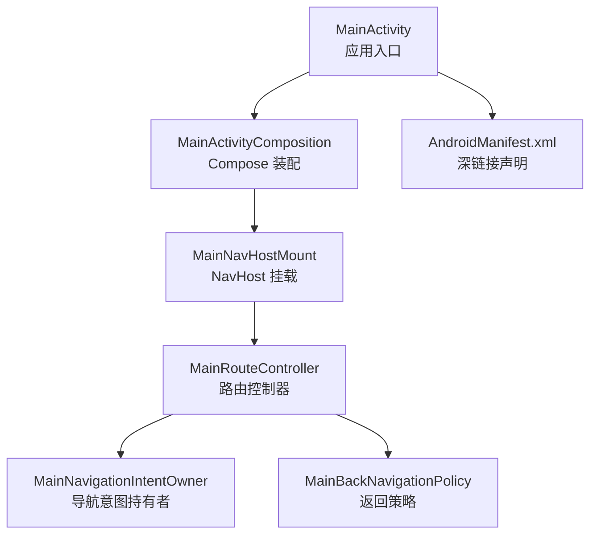
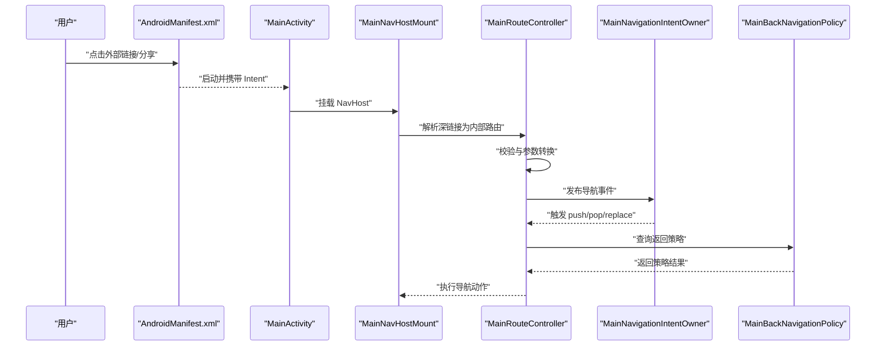
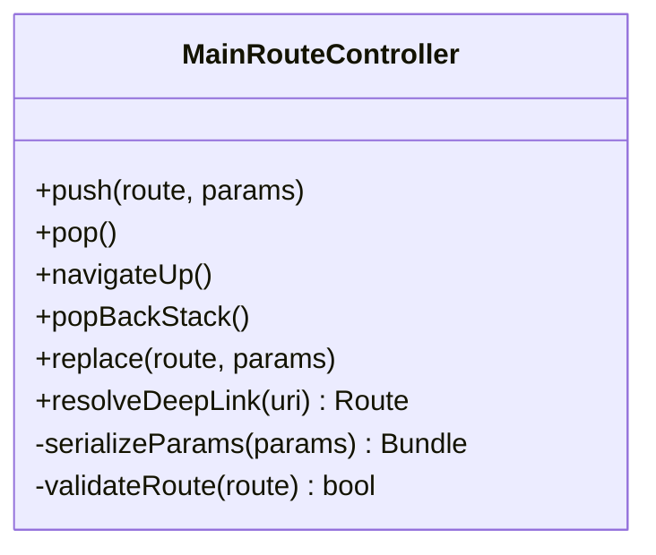
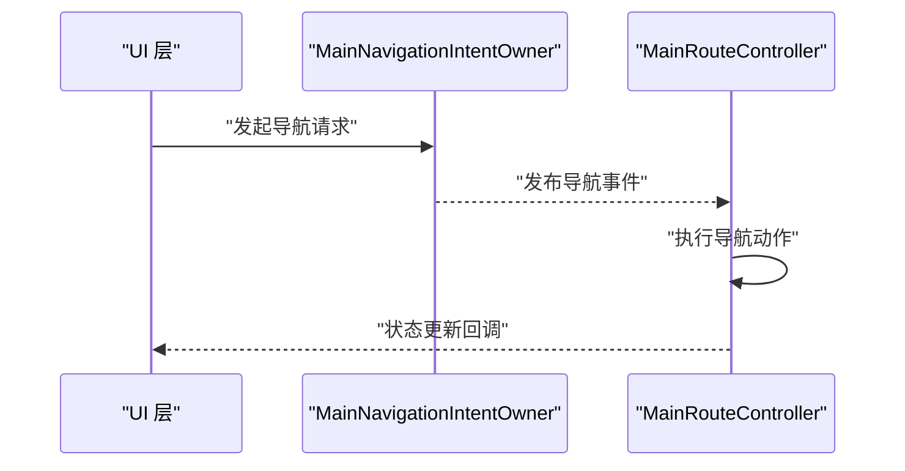
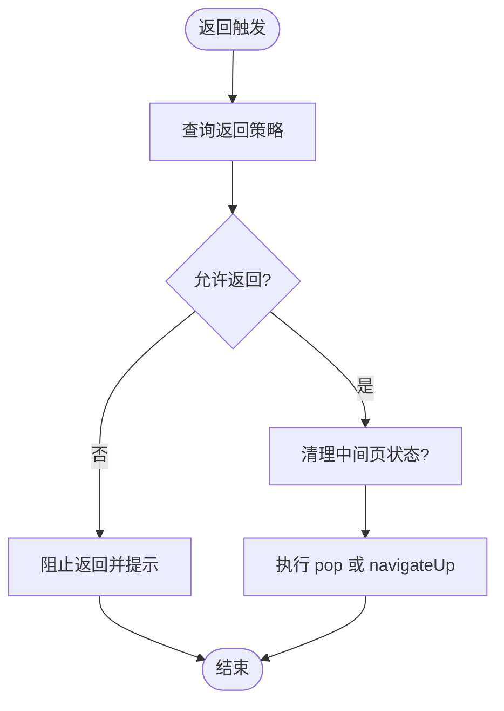
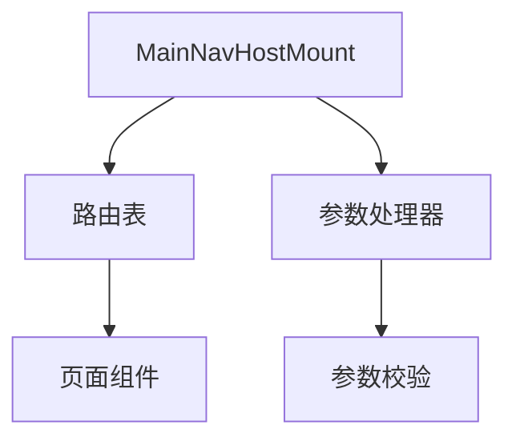
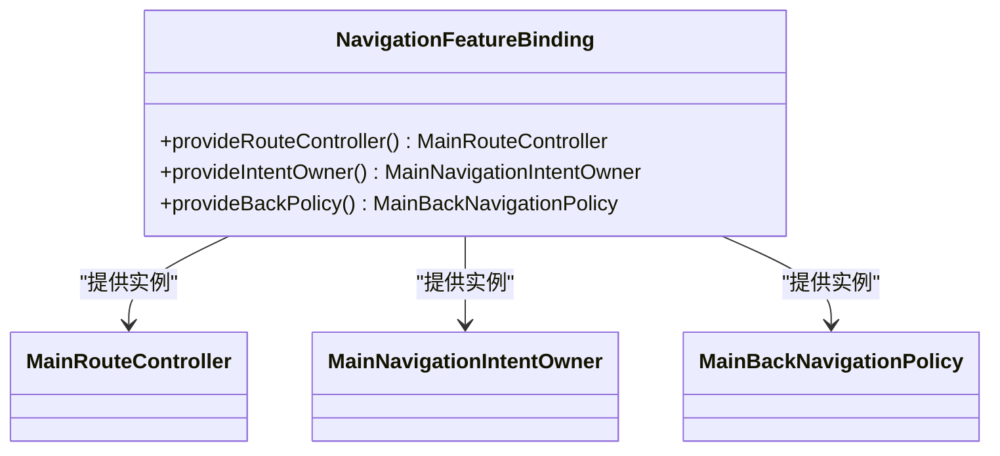
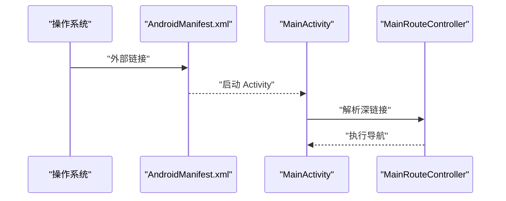
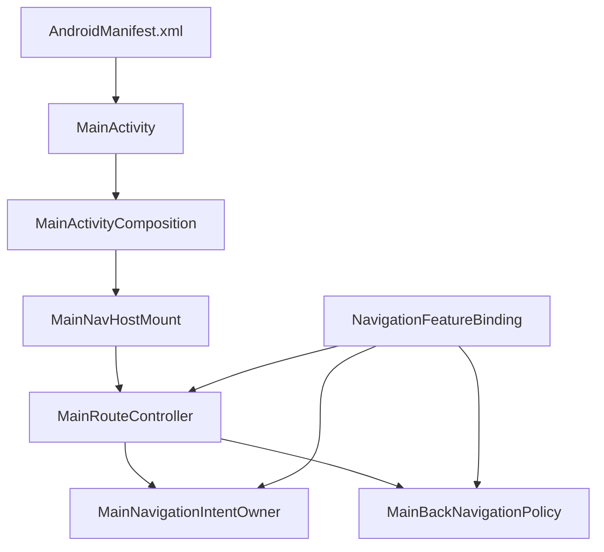

# 导航系统

<cite>
**本文引用的文件**   
- [MainActivity.kt](file://app/src/main/java/app/yukine/MainActivity.kt)
- [MainActivityComposition.kt](file://app/src/main/java/app/yukine/MainActivityComposition.kt)
- [MainNavHostMount.kt](file://app/src/main/java/app/yukine/MainNavHostMount.kt)
- [MainRouteController.kt](file://app/src/main/java/app/yukine/MainRouteController.kt)
- [MainNavigationIntentOwner.kt](file://app/src/main/java/app/yukine/MainNavigationIntentOwner.kt)
- [MainBackNavigationPolicy.kt](file://app/src/main/java/app/yukine/MainBackNavigationPolicy.kt)
- [NavigationFeatureBinding.kt](file://app/src/main/java/app/yukine/NavigationFeatureBinding.kt)
- [AndroidManifest.xml](file://app/src/main/AndroidManifest.xml)
</cite>

## 目录
1. [简介](#简介)
2. [项目结构](#项目结构)
3. [核心组件](#核心组件)
4. [架构总览](#架构总览)
5. [详细组件分析](#详细组件分析)
6. [依赖关系分析](#依赖关系分析)
7. [性能考虑](#性能考虑)
8. [故障排查指南](#故障排查指南)
9. [结论](#结论)
10. [附录](#附录)

## 简介
本技术文档聚焦于 Echo Android 应用中的导航子系统，围绕基于 Navigation Compose 的路由设计、页面跳转逻辑与参数传递机制展开。文档覆盖主导航图结构、深链接支持、返回栈管理、导航状态管理、路由守卫与权限检查集成、导航性能优化、动画过渡配置以及无障碍导航支持。同时提供扩展指南与调试方法，帮助开发者快速理解并高效维护导航体系。

## 项目结构
导航相关代码主要位于 app 模块的 main 源集中，采用“入口 Activity + Compose 宿主 + 路由控制器 + 意图所有者 + 返回策略”的分层组织方式：
- MainActivity：应用入口，负责生命周期与导航宿主的挂载。
- MainActivityComposition：Compose 树装配，包含 NavHost 与主题等。
- MainNavHostMount：导航宿主挂载点，统一处理 NavHost 初始化与参数注入。
- MainRouteController：路由控制器，封装导航动作（push/pop/replace）、参数序列化与深链接解析。
- MainNavigationIntentOwner：导航意图持有者，对外暴露导航事件，供 UI 层消费。
- MainBackNavigationPolicy：返回栈策略，决定返回行为与拦截条件。
- NavigationFeatureBinding：特性绑定，将导航能力以 DI 或接口形式注入到各功能模块。
- AndroidManifest.xml：声明入口 Activity 与深链接 IntentFilter。

图表来源
- [MainActivity.kt:1-200](file://app/src/main/java/app/yukine/MainActivity.kt#L1-L200)
- [MainActivityComposition.kt:1-200](file://app/src/main/java/app/yukine/MainActivityComposition.kt#L1-L200)
- [MainNavHostMount.kt:1-200](file://app/src/main/java/app/yukine/MainNavHostMount.kt#L1-L200)
- [MainRouteController.kt:1-200](file://app/src/main/java/app/yukine/MainRouteController.kt#L1-L200)
- [MainNavigationIntentOwner.kt:1-200](file://app/src/main/java/app/yukine/MainNavigationIntentOwner.kt#L1-L200)
- [MainBackNavigationPolicy.kt:1-200](file://app/src/main/java/app/yukine/MainBackNavigationPolicy.kt#L1-L200)
- [AndroidManifest.xml:1-200](file://app/src/main/AndroidManifest.xml#L1-L200)

章节来源
- [MainActivity.kt:1-200](file://app/src/main/java/app/yukine/MainActivity.kt#L1-L200)
- [MainActivityComposition.kt:1-200](file://app/src/main/java/app/yukine/MainActivityComposition.kt#L1-L200)
- [MainNavHostMount.kt:1-200](file://app/src/main/java/app/yukine/MainNavHostMount.kt#L1-L200)
- [MainRouteController.kt:1-200](file://app/src/main/java/app/yukine/MainRouteController.kt#L1-L200)
- [MainNavigationIntentOwner.kt:1-200](file://app/src/main/java/app/yukine/MainNavigationIntentOwner.kt#L1-L200)
- [MainBackNavigationPolicy.kt:1-200](file://app/src/main/java/app/yukine/MainBackNavigationPolicy.kt#L1-L200)
- [AndroidManifest.xml:1-200](file://app/src/main/AndroidManifest.xml#L1-L200)

## 核心组件
- 路由控制器（MainRouteController）
  - 职责：封装所有导航动作（push、pop、navigateUp、popBackStack、replace），统一管理参数序列化与反序列化，提供深链接解析入口。
  - 关键点：避免在 UI 层直接操作 NavController；通过控制器进行集中式路由决策，便于测试与扩展。
- 导航意图持有者（MainNavigationIntentOwner）
  - 职责：作为导航事件的发布者，UI 层订阅其事件流，触发路由控制器的导航动作。
  - 关键点：解耦 UI 与导航实现，支持多入口（按钮、菜单、系统返回、深链接）。
- 返回策略（MainBackNavigationPolicy）
  - 职责：定义返回栈的行为规则，如是否允许返回、是否需要前置校验（登录、权限）、是否清理中间页。
  - 关键点：与系统返回键、手势返回、Activity 生命周期联动。
- 导航宿主挂载（MainNavHostMount）
  - 职责：创建并挂载 NavHost，注册路由表，注入导航参数与上下文。
  - 关键点：集中管理路由映射与参数类型，确保类型安全与可维护性。
- 特性绑定（NavigationFeatureBinding）
  - 职责：将导航能力以接口或 DI 形式暴露给其他功能模块，屏蔽底层实现细节。
  - 关键点：提高模块内聚与低耦合，便于单元测试与替换实现。

章节来源
- [MainRouteController.kt:1-200](file://app/src/main/java/app/yukine/MainRouteController.kt#L1-L200)
- [MainNavigationIntentOwner.kt:1-200](file://app/src/main/java/app/yukine/MainNavigationIntentOwner.kt#L1-L200)
- [MainBackNavigationPolicy.kt:1-200](file://app/src/main/java/app/yukine/MainBackNavigationPolicy.kt#L1-L200)
- [MainNavHostMount.kt:1-200](file://app/src/main/java/app/yukine/MainNavHostMount.kt#L1-L200)
- [NavigationFeatureBinding.kt:1-200](file://app/src/main/java/app/yukine/NavigationFeatureBinding.kt#L1-L200)

## 架构总览
导航架构遵循“声明式路由 + 命令式控制器”的组合模式：
- 声明式：通过 NavHost 与路由表描述页面结构与参数契约。
- 命令式：通过 MainRouteController 执行导航动作，保证跨模块一致性与可测试性。
- 深链接：由 AndroidManifest 声明 IntentFilter，交由 MainRouteController 解析并转换为内部路由。
- 返回栈：由 MainBackNavigationPolicy 统一管控，结合系统返回与自定义策略。

图表来源
- [AndroidManifest.xml:1-200](file://app/src/main/AndroidManifest.xml#L1-L200)
- [MainActivity.kt:1-200](file://app/src/main/java/app/yukine/MainActivity.kt#L1-L200)
- [MainNavHostMount.kt:1-200](file://app/src/main/java/app/yukine/MainNavHostMount.kt#L1-L200)
- [MainRouteController.kt:1-200](file://app/src/main/java/app/yukine/MainRouteController.kt#L1-L200)
- [MainNavigationIntentOwner.kt:1-200](file://app/src/main/java/app/yukine/MainNavigationIntentOwner.kt#L1-L200)
- [MainBackNavigationPolicy.kt:1-200](file://app/src/main/java/app/yukine/MainBackNavigationPolicy.kt#L1-L200)

## 详细组件分析

### 路由控制器（MainRouteController）
- 设计要点
  - 集中式导航 API：提供 push、pop、navigateUp、popBackStack、replace 等方法，隐藏 NavController 细节。
  - 参数序列化：对复杂对象使用可序列化的数据载体，避免在 URL 中拼接不安全信息。
  - 深链接解析：将外部 URI 转换为内部路由名与参数，统一进入导航流程。
  - 错误处理：对非法路由或缺失参数进行回退或提示。
- 复杂度分析
  - 时间复杂度：路由查找 O(1)（哈希表），参数解析 O(n)（n 为参数数量）。
  - 空间复杂度：O(k)，k 为当前路由栈深度。
- 优化建议
  - 预编译路由常量，减少字符串匹配开销。
  - 批量导航时合并多次调用，降低重绘次数。

图表来源
- [MainRouteController.kt:1-200](file://app/src/main/java/app/yukine/MainRouteController.kt#L1-L200)

章节来源
- [MainRouteController.kt:1-200](file://app/src/main/java/app/yukine/MainRouteController.kt#L1-L200)

### 导航意图持有者（MainNavigationIntentOwner）
- 设计要点
  - 事件驱动：UI 层订阅导航事件，触发控制器动作。
  - 多入口聚合：整合按钮点击、菜单选择、系统返回、深链接等多种来源。
  - 幂等性：重复事件不会导致重复导航。
- 交互流程
  - UI 发出导航请求 → 持有者发布事件 → 控制器执行导航 → 更新状态。

图表来源
- [MainNavigationIntentOwner.kt:1-200](file://app/src/main/java/app/yukine/MainNavigationIntentOwner.kt#L1-L200)
- [MainRouteController.kt:1-200](file://app/src/main/java/app/yukine/MainRouteController.kt#L1-L200)

章节来源
- [MainNavigationIntentOwner.kt:1-200](file://app/src/main/java/app/yukine/MainNavigationIntentOwner.kt#L1-L200)

### 返回策略（MainBackNavigationPolicy）
- 设计要点
  - 规则化：将返回逻辑抽象为策略函数，支持按路由动态判断。
  - 前置校验：在返回前检查登录态、权限、未保存更改等。
  - 清理策略：根据业务需要决定是否清理中间页或保留状态。
- 流程图

图表来源
- [MainBackNavigationPolicy.kt:1-200](file://app/src/main/java/app/yukine/MainBackNavigationPolicy.kt#L1-L200)

章节来源
- [MainBackNavigationPolicy.kt:1-200](file://app/src/main/java/app/yukine/MainBackNavigationPolicy.kt#L1-L200)

### 导航宿主挂载（MainNavHostMount）
- 设计要点
  - 集中挂载：在 Activity 或 Fragment 中统一创建 NavHost，避免分散初始化。
  - 路由注册：集中声明路由与目标页面，便于维护与审计。
  - 参数注入：为每个路由提供参数读取与校验。
- 架构图

图表来源
- [MainNavHostMount.kt:1-200](file://app/src/main/java/app/yukine/MainNavHostMount.kt#L1-L200)

章节来源
- [MainNavHostMount.kt:1-200](file://app/src/main/java/app/yukine/MainNavHostMount.kt#L1-L200)

### 特性绑定（NavigationFeatureBinding）
- 设计要点
  - 接口抽象：将导航能力以接口形式暴露，便于替换与测试。
  - DI 集成：通过依赖注入框架将控制器与持有者注入到各模块。
  - 模块化：各功能模块仅依赖接口，不感知具体实现。

图表来源
- [NavigationFeatureBinding.kt:1-200](file://app/src/main/java/app/yukine/NavigationFeatureBinding.kt#L1-L200)

章节来源
- [NavigationFeatureBinding.kt:1-200](file://app/src/main/java/app/yukine/NavigationFeatureBinding.kt#L1-L200)

### 深链接支持与返回栈管理
- 深链接
  - 在 AndroidManifest 中声明入口 Activity 与 IntentFilter，匹配外部 URI。
  - 启动后由 MainRouteController 解析 URI 为内部路由，统一进入导航流程。
- 返回栈
  - 通过 MainBackNavigationPolicy 控制返回行为，支持条件拦截与状态清理。
  - 与系统返回键、手势返回、Activity 生命周期联动，确保一致性。

图表来源
- [AndroidManifest.xml:1-200](file://app/src/main/AndroidManifest.xml#L1-L200)
- [MainActivity.kt:1-200](file://app/src/main/java/app/yukine/MainActivity.kt#L1-L200)
- [MainRouteController.kt:1-200](file://app/src/main/java/app/yukine/MainRouteController.kt#L1-L200)

章节来源
- [AndroidManifest.xml:1-200](file://app/src/main/AndroidManifest.xml#L1-L200)
- [MainActivity.kt:1-200](file://app/src/main/java/app/yukine/MainActivity.kt#L1-L200)
- [MainRouteController.kt:1-200](file://app/src/main/java/app/yukine/MainRouteController.kt#L1-L200)

## 依赖关系分析
- 组件耦合
  - MainActivity 依赖 MainActivityComposition 与 MainNavHostMount。
  - MainNavHostMount 依赖 MainRouteController 与路由表。
  - MainRouteController 依赖 MainNavigationIntentOwner 与 MainBackNavigationPolicy。
  - NavigationFeatureBinding 提供上述组件实例，供模块注入。
- 外部依赖
  - AndroidManifest 声明深链接入口。
  - Navigation Compose 提供 NavHost 与路由能力。

图表来源
- [MainActivity.kt:1-200](file://app/src/main/java/app/yukine/MainActivity.kt#L1-L200)
- [MainActivityComposition.kt:1-200](file://app/src/main/java/app/yukine/MainActivityComposition.kt#L1-L200)
- [MainNavHostMount.kt:1-200](file://app/src/main/java/app/yukine/MainNavHostMount.kt#L1-L200)
- [MainRouteController.kt:1-200](file://app/src/main/java/app/yukine/MainRouteController.kt#L1-L200)
- [MainNavigationIntentOwner.kt:1-200](file://app/src/main/java/app/yukine/MainNavigationIntentOwner.kt#L1-L200)
- [MainBackNavigationPolicy.kt:1-200](file://app/src/main/java/app/yukine/MainBackNavigationPolicy.kt#L1-L200)
- [NavigationFeatureBinding.kt:1-200](file://app/src/main/java/app/yukine/NavigationFeatureBinding.kt#L1-L200)
- [AndroidManifest.xml:1-200](file://app/src/main/AndroidManifest.xml#L1-L200)

章节来源
- [MainActivity.kt:1-200](file://app/src/main/java/app/yukine/MainActivity.kt#L1-L200)
- [MainActivityComposition.kt:1-200](file://app/src/main/java/app/yukine/MainActivityComposition.kt#L1-L200)
- [MainNavHostMount.kt:1-200](file://app/src/main/java/app/yukine/MainNavHostMount.kt#L1-L200)
- [MainRouteController.kt:1-200](file://app/src/main/java/app/yukine/MainRouteController.kt#L1-L200)
- [MainNavigationIntentOwner.kt:1-200](file://app/src/main/java/app/yukine/MainNavigationIntentOwner.kt#L1-L200)
- [MainBackNavigationPolicy.kt:1-200](file://app/src/main/java/app/yukine/MainBackNavigationPolicy.kt#L1-L200)
- [NavigationFeatureBinding.kt:1-200](file://app/src/main/java/app/yukine/NavigationFeatureBinding.kt#L1-L200)
- [AndroidManifest.xml:1-200](file://app/src/main/AndroidManifest.xml#L1-L200)

## 性能考虑
- 路由查找优化
  - 使用常量与哈希表存储路由映射，避免运行时字符串匹配。
- 导航批处理
  - 合并多次导航调用，减少 Compose 重组与重绘。
- 参数序列化
  - 避免大对象序列化，优先使用轻量 ID 或引用，按需加载详情。
- 动画与过渡
  - 合理配置转场动画时长与插值器，避免过度动画影响首帧渲染。
- 懒加载与预取
  - 对非首屏页面采用懒加载，必要时预取关键资源。

[本节为通用指导，无需特定文件来源]

## 故障排查指南
- 常见问题
  - 深链接无法命中：检查 AndroidManifest 的 IntentFilter 与 URI 匹配规则。
  - 参数丢失或类型错误：确认路由参数序列化与反序列化逻辑一致。
  - 返回栈异常：审查返回策略与 popBackStack 的使用场景。
  - 权限拦截失败：确认权限检查前置条件与提示文案。
- 调试方法
  - 打印导航事件日志，记录每次 push/pop/replace 的调用栈。
  - 使用 Compose 调试工具观察重组与路由变化。
  - 模拟深链接输入，验证解析与路由映射。

章节来源
- [MainRouteController.kt:1-200](file://app/src/main/java/app/yukine/MainRouteController.kt#L1-L200)
- [MainBackNavigationPolicy.kt:1-200](file://app/src/main/java/app/yukine/MainBackNavigationPolicy.kt#L1-L200)
- [AndroidManifest.xml:1-200](file://app/src/main/AndroidManifest.xml#L1-L200)

## 结论
Echo Android 导航系统通过“声明式路由 + 命令式控制器”的架构，实现了清晰的路由管理、灵活的深链接支持与可控的返回栈行为。借助 MainRouteController、MainNavigationIntentOwner 与 MainBackNavigationPolicy 的协作，系统在可维护性、可扩展性与可测试性方面表现良好。配合性能优化与调试手段，可有效提升用户体验与开发效率。

[本节为总结，无需特定文件来源]

## 附录
- 扩展指南
  - 新增路由：在路由表中注册新路由与参数契约，并在 MainNavHostMount 中声明目标页面。
  - 新增深链接：在 AndroidManifest 中添加 IntentFilter，并在 MainRouteController 中实现解析逻辑。
  - 新增返回策略：在 MainBackNavigationPolicy 中增加规则函数，按路由或业务条件返回策略结果。
- 最佳实践
  - 保持路由命名规范与参数类型安全。
  - 将导航动作集中在控制器中，避免在 UI 层直接操作 NavController。
  - 对敏感路由实施权限检查与前置校验。

[本节为概念性内容，无需特定文件来源]