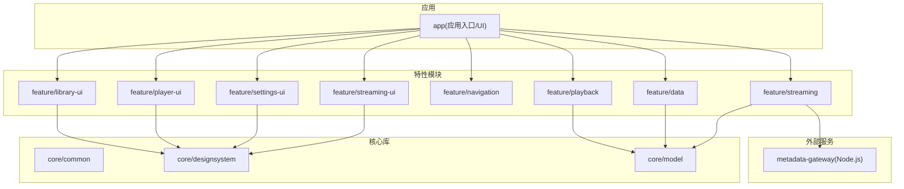
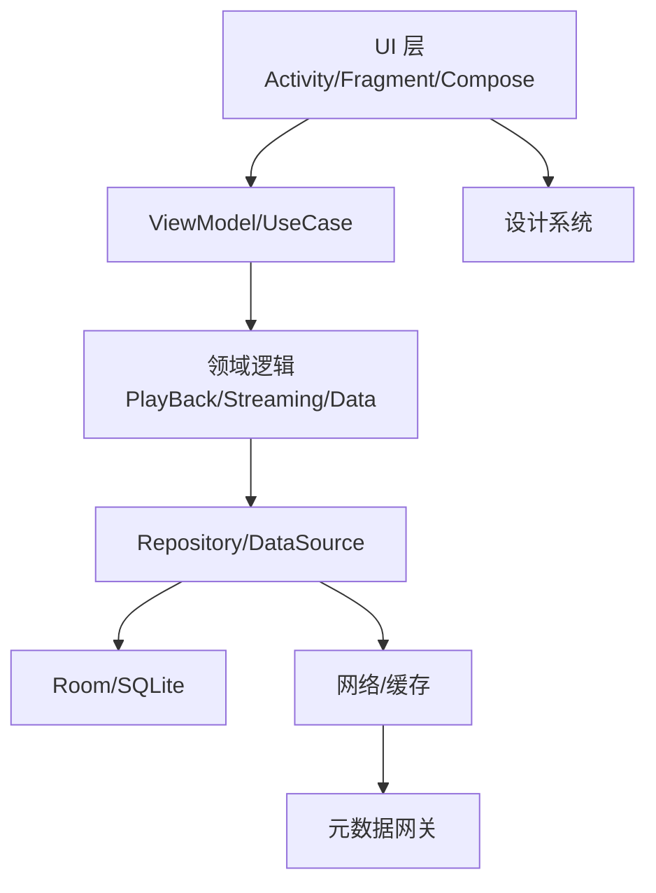
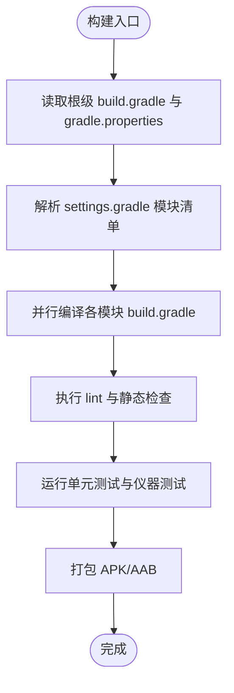
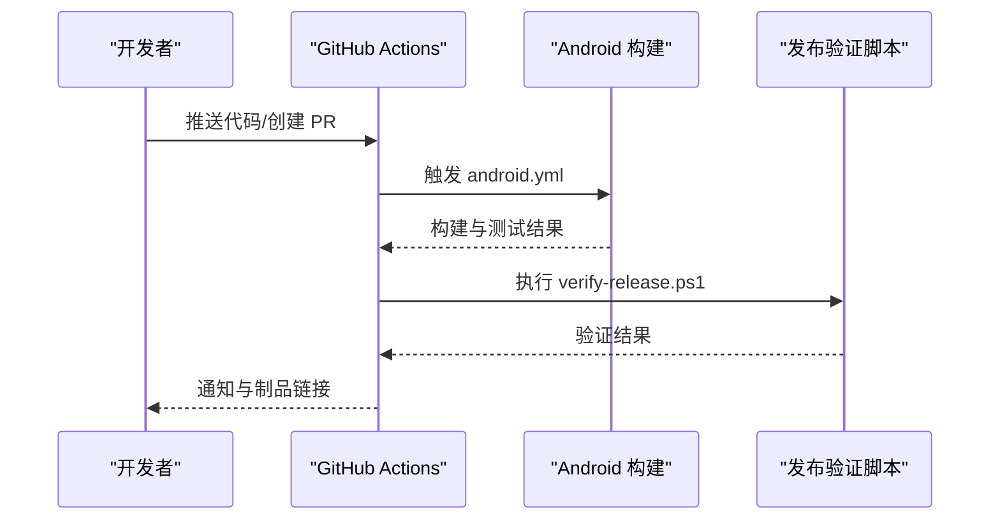
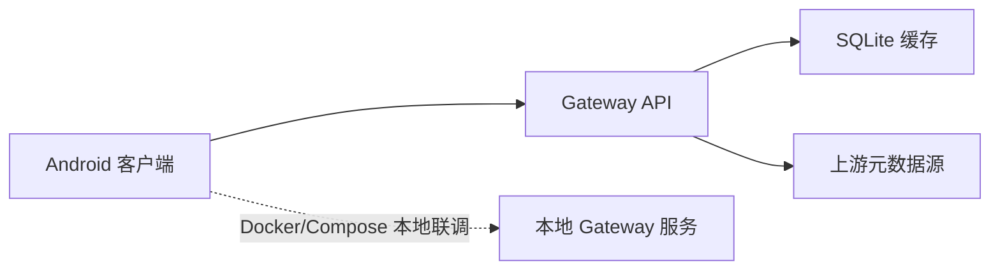
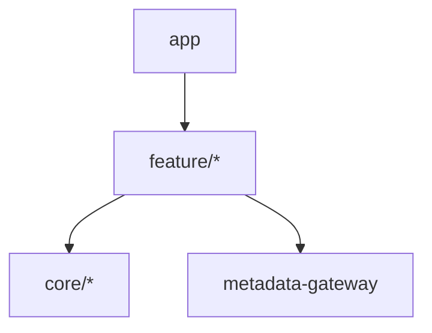

# 开发指南

<cite>
**本文引用的文件**   
- [README.md](file://README.md)
- [.editorconfig](file://.editorconfig)
- [build.gradle](file://build.gradle)
- [settings.gradle](file://settings.gradle)
- [gradle.properties](file://gradle.properties)
- [app/build.gradle](file://app/build.gradle)
- [core/common/build.gradle](file://core/common/build.gradle)
- [core/designsystem/build.gradle](file://core/designsystem/build.gradle)
- [core/model/build.gradle](file://core/model/build.gradle)
- [feature/data/build.gradle](file://feature/data/build.gradle)
- [feature/library-ui/build.gradle](file://feature/library-ui/build.gradle)
- [feature/navigation/build.gradle](file://feature/navigation/build.gradle)
- [feature/playback/build.gradle](file://feature/playback/build.gradle)
- [feature/player-ui/build.gradle](file://feature/player-ui/build.gradle)
- [feature/settings-ui/build.gradle](file://feature/settings-ui/build.gradle)
- [feature/streaming/build.gradle](file://feature/streaming/build.gradle)
- [feature/streaming-ui/build.gradle](file://feature/streaming-ui/build.gradle)
- [metadata-gateway/package.json](file://metadata-gateway/package.json)
- [metadata-gateway/Dockerfile](file://metadata-gateway/Dockerfile)
- [metadata-gateway/compose.yaml](file://metadata-gateway/compose.yaml)
- [.github/workflows/android.yml](file://.github/workflows/android.yml)
- [.github/workflows/release.yml](file://.github/workflows/release.yml)
- [scripts/verify-release.ps1](file://scripts/verify-release.ps1)
- [scripts/p0-stability-gate.ps1](file://scripts/p0-stability-gate.ps1)
- [scripts/playback-stability-smoke.ps1](file://scripts/playback-stability-smoke.ps1)
- [app/lint-baseline.xml](file://app/lint-baseline.xml)
- [app/proguard-rules.pro](file://app/proguard-rules.pro)
- [docs/ARCHITECTURE.md](file://docs/ARCHITECTURE.md)
- [docs/RELEASE_EXPERIENCE_CHECKLIST.md](file://docs/RELEASE_EXPERIENCE_CHECKLIST.md)
</cite>

## 目录
1. [简介](#简介)
2. [项目结构](#项目结构)
3. [核心组件](#核心组件)
4. [架构总览](#架构总览)
5. [详细组件分析](#详细组件分析)
6. [依赖分析](#依赖分析)
7. [性能与稳定性](#性能与稳定性)
8. [故障排查指南](#故障排查指南)
9. [结论](#结论)
10. [附录](#附录)

## 简介
本指南面向 Echo Android 项目的贡献者与开发者，目标是帮助新成员快速融入团队并高效产出高质量代码。内容涵盖：
- 代码规范、命名约定、注释标准
- Git 工作流、分支管理策略、代码审查流程
- IDE 配置、开发工具推荐、调试技巧
- 新功能开发流程、重构指导原则、文档维护要求
- 贡献者指南、社区参与方式、问题报告模板

在开始之前，建议先阅读仓库根目录的 README 以了解项目背景与总体目标。

章节来源
- [README.md](file://README.md)

## 项目结构
Echo Android 采用多模块架构，按职责分层与领域划分：
- app：应用入口与 UI 组装层，负责 Activity/Fragment、导航、UI 绑定、与 Feature 模块交互
- core：公共能力与基础库
  - common：通用工具、跨模块共享逻辑
  - designsystem：设计系统与主题、样式、可复用 UI 组件
  - model：领域模型与数据契约
- feature：按功能域划分的特性模块
  - data：数据访问、持久化、网络与同步
  - library-ui：本地音乐库相关 UI
  - navigation：导航路由与页面跳转
  - playback：播放控制与状态机
  - player-ui：播放器界面
  - settings-ui：设置界面
  - streaming：在线流媒体接入与缓存
  - streaming-ui：流媒体相关界面
- metadata-gateway：元数据网关（Node.js），提供本地/云端元数据服务
- scripts：构建与发布脚本
- docs：架构与设计文档

图表来源
- [settings.gradle](file://settings.gradle)
- [app/build.gradle](file://app/build.gradle)
- [core/common/build.gradle](file://core/common/build.gradle)
- [core/designsystem/build.gradle](file://core/designsystem/build.gradle)
- [core/model/build.gradle](file://core/model/build.gradle)
- [feature/data/build.gradle](file://feature/data/build.gradle)
- [feature/library-ui/build.gradle](file://feature/library-ui/build.gradle)
- [feature/navigation/build.gradle](file://feature/navigation/build.gradle)
- [feature/playback/build.gradle](file://feature/playback/build.gradle)
- [feature/player-ui/build.gradle](file://feature/player-ui/build.gradle)
- [feature/settings-ui/build.gradle](file://feature/settings-ui/build.gradle)
- [feature/streaming/build.gradle](file://feature/streaming/build.gradle)
- [feature/streaming-ui/build.gradle](file://feature/streaming-ui/build.gradle)

章节来源
- [settings.gradle](file://settings.gradle)
- [build.gradle](file://build.gradle)
- [app/build.gradle](file://app/build.gradle)
- [core/common/build.gradle](file://core/common/build.gradle)
- [core/designsystem/build.gradle](file://core/designsystem/build.gradle)
- [core/model/build.gradle](file://core/model/build.gradle)
- [feature/data/build.gradle](file://feature/data/build.gradle)
- [feature/library-ui/build.gradle](file://feature/library-ui/build.gradle)
- [feature/navigation/build.gradle](file://feature/navigation/build.gradle)
- [feature/playback/build.gradle](file://feature/playback/build.gradle)
- [feature/player-ui/build.gradle](file://feature/player-ui/build.gradle)
- [feature/settings-ui/build.gradle](file://feature/settings-ui/build.gradle)
- [feature/streaming/build.gradle](file://feature/streaming/build.gradle)
- [feature/streaming-ui/build.gradle](file://feature/streaming-ui/build.gradle)

## 核心组件
- 应用入口与装配
  - 应用初始化、依赖注入、全局配置与运行时开关位于应用模块中，负责将各特性模块组合为完整体验。
- 设计系统
  - 统一的主题、颜色、字体、控件与布局约束，确保一致的用户体验与可维护性。
- 数据层
  - 统一的数据库版本迁移、缓存策略、网络请求封装与错误处理；支持本地与远端数据源聚合。
- 播放核心
  - 播放状态机、队列管理、音频会话生命周期、设备适配与异常恢复。
- 流媒体
  - 认证、Cookie 管理、播放质量策略、缓存与断点续播。
- 元数据网关
  - Node.js 服务，提供元数据检索、缓存与代理能力，供 Android 端调用。

章节来源
- [docs/ARCHITECTURE.md](file://docs/ARCHITECTURE.md)
- [app/build.gradle](file://app/build.gradle)
- [feature/data/build.gradle](file://feature/data/build.gradle)
- [feature/playback/build.gradle](file://feature/playback/build.gradle)
- [feature/streaming/build.gradle](file://feature/streaming/build.gradle)
- [metadata-gateway/package.json](file://metadata-gateway/package.json)

## 架构总览
整体遵循“应用壳 + 特性模块 + 核心库”的分层架构，结合 MVVM 与模块化边界，降低耦合度，提升可测试性与可演进性。

图表来源
- [docs/ARCHITECTURE.md](file://docs/ARCHITECTURE.md)
- [feature/data/build.gradle](file://feature/data/build.gradle)
- [feature/playback/build.gradle](file://feature/playback/build.gradle)
- [feature/streaming/build.gradle](file://feature/streaming/build.gradle)
- [metadata-gateway/package.json](file://metadata-gateway/package.json)

## 详细组件分析

### 构建与依赖管理
- Gradle 版本与插件通过根级 build.gradle 与 gradle.properties 集中管理
- 模块依赖通过 settings.gradle 声明，各模块 build.gradle 定义自身依赖
- 使用 libs.versions.toml 统一管理第三方库版本（若存在）

图表来源
- [build.gradle](file://build.gradle)
- [settings.gradle](file://settings.gradle)
- [gradle.properties](file://gradle.properties)
- [app/build.gradle](file://app/build.gradle)

章节来源
- [build.gradle](file://build.gradle)
- [settings.gradle](file://settings.gradle)
- [gradle.properties](file://gradle.properties)
- [app/build.gradle](file://app/build.gradle)

### 代码风格与编辑器配置
- 使用 .editorconfig 统一缩进、编码、行尾等基础格式
- 配合 Android Studio 内置格式化与导入排序规则
- 建议在提交前启用 pre-commit 钩子或 CI 校验

章节来源
- [.editorconfig](file://.editorconfig)

### 静态分析与混淆
- 使用 lint-baseline.xml 收敛历史告警，新增代码需保持零新增告警
- proguard-rules.pro 用于生产混淆与优化，按需调整

章节来源
- [app/lint-baseline.xml](file://app/lint-baseline.xml)
- [app/proguard-rules.pro](file://app/proguard-rules.pro)

### 持续集成与发布
- GitHub Actions 流水线包含 Android 构建与发布任务
- 发布脚本用于验证产物与签名信息

图表来源
- [.github/workflows/android.yml](file://.github/workflows/android.yml)
- [.github/workflows/release.yml](file://.github/workflows/release.yml)
- [scripts/verify-release.ps1](file://scripts/verify-release.ps1)

章节来源
- [.github/workflows/android.yml](file://.github/workflows/android.yml)
- [.github/workflows/release.yml](file://.github/workflows/release.yml)
- [scripts/verify-release.ps1](file://scripts/verify-release.ps1)

### 元数据网关（Node.js）
- 提供元数据查询、缓存与代理服务
- 支持 Docker 容器化部署与 Compose 编排

图表来源
- [metadata-gateway/package.json](file://metadata-gateway/package.json)
- [metadata-gateway/Dockerfile](file://metadata-gateway/Dockerfile)
- [metadata-gateway/compose.yaml](file://metadata-gateway/compose.yaml)

章节来源
- [metadata-gateway/package.json](file://metadata-gateway/package.json)
- [metadata-gateway/Dockerfile](file://metadata-gateway/Dockerfile)
- [metadata-gateway/compose.yaml](file://metadata-gateway/compose.yaml)

## 依赖分析
- 模块内聚与耦合
  - UI 模块依赖 designsystem 与 model，避免直接访问数据层
  - data 与 streaming 模块依赖 model，屏蔽底层实现细节
- 外部依赖
  - metadata-gateway 作为独立服务，通过 HTTP/本地端口与 Android 通信
- 潜在风险
  - 注意循环依赖与跨层直连，优先通过接口与 UseCase 解耦

图表来源
- [settings.gradle](file://settings.gradle)
- [app/build.gradle](file://app/build.gradle)
- [feature/*/build.gradle](file://feature/data/build.gradle)
- [metadata-gateway/package.json](file://metadata-gateway/package.json)

章节来源
- [settings.gradle](file://settings.gradle)
- [app/build.gradle](file://app/build.gradle)
- [feature/data/build.gradle](file://feature/data/build.gradle)
- [feature/playback/build.gradle](file://feature/playback/build.gradle)
- [feature/streaming/build.gradle](file://feature/streaming/build.gradle)
- [metadata-gateway/package.json](file://metadata-gateway/package.json)

## 性能与稳定性
- 构建性能
  - 合理使用增量编译与并行构建，避免全量重编
- 运行时性能
  - 减少主线程阻塞，合理调度后台任务
  - 图片与资源按需加载，利用设计系统缓存策略
- 稳定性保障
  - 使用 p0-stability-gate.ps1 与 playback-stability-smoke.ps1 进行关键路径回归
  - 关注播放链路稳定性矩阵与回放用例覆盖

章节来源
- [scripts/p0-stability-gate.ps1](file://scripts/p0-stability-gate.ps1)
- [scripts/playback-stability-smoke.ps1](file://scripts/playback-stability-smoke.ps1)

## 故障排查指南
- 构建失败
  - 检查 Gradle 版本与 JDK 环境，确认依赖是否可用
  - 查看 CI 日志定位具体模块与任务
- 运行时崩溃
  - 使用 ProGuard 映射还原堆栈
  - 开启详细日志与崩溃上报，复现步骤与设备信息记录
- 网络与元数据
  - 确认 gateway 服务启动与端口可达
  - 检查鉴权与 Cookie 状态

章节来源
- [app/proguard-rules.pro](file://app/proguard-rules.pro)
- [metadata-gateway/compose.yaml](file://metadata-gateway/compose.yaml)

## 结论
通过清晰的模块化边界、统一的构建与 CI 流程、完善的静态检查与稳定性脚本，Echo Android 项目在可维护性与交付效率上具备良好基础。遵循本指南的规范与工作流，有助于新成员快速上手并持续产出高质量变更。

## 附录

### 代码规范与命名约定
- Kotlin/Java
  - 类名使用大驼峰，方法与属性使用小驼峰
  - 常量使用全大写加下划线
  - 包名全小写，按模块与领域划分
- 资源与布局
  - 资源 ID 使用下划线分隔的小写命名
  - 布局与字符串资源按功能域分组
- 注释标准
  - 公共 API 与方法需提供清晰说明
  - 复杂业务逻辑增加上下文与决策依据

章节来源
- [.editorconfig](file://.editorconfig)

### Git 工作流与分支策略
- 分支命名
  - feature/xxx、bugfix/xxx、hotfix/xxx、release/xxx
- 提交流程
  - 小步提交、原子化变更、描述清晰
- 合并策略
  - 通过 Pull Request 合并，至少一名 reviewer 批准
- 标签与版本
  - 使用语义化版本号，发布前执行发布检查清单

章节来源
- [.github/workflows/release.yml](file://.github/workflows/release.yml)
- [docs/RELEASE_EXPERIENCE_CHECKLIST.md](file://docs/RELEASE_EXPERIENCE_CHECKLIST.md)

### 代码审查流程
- 审查要点
  - 正确性、可读性、性能、安全性、可测试性
- 自动化检查
  - 静态分析、单元测试、集成测试、构建成功
- 反馈与迭代
  - 评论明确、可操作，作者及时响应与修复

章节来源
- [.github/workflows/android.yml](file://.github/workflows/android.yml)

### IDE 配置与开发工具
- Android Studio
  - 启用 EditorConfig、Lint、Kotlin 检查
  - 安装插件：Kotlin、Compose、Docker（本地联调 gateway）
- 本地服务
  - 使用 Compose 启动 metadata-gateway 进行联调
- 调试技巧
  - 使用 Logcat 过滤模块与 Tag
  - 针对播放与网络场景添加埋点与快照

章节来源
- [metadata-gateway/compose.yaml](file://metadata-gateway/compose.yaml)
- [app/lint-baseline.xml](file://app/lint-baseline.xml)

### 新功能开发流程
- 需求澄清与方案设计
- 创建 feature 分支并拆分任务
- 编写单测与集成测试
- 提交 PR 并等待 CI 与评审
- 合并后更新文档与变更记录

章节来源
- [.github/workflows/android.yml](file://.github/workflows/android.yml)
- [docs/ARCHITECTURE.md](file://docs/ARCHITECTURE.md)

### 重构指导原则
- 保持向后兼容，逐步替换旧实现
- 抽取公共逻辑到 core 或 feature 内部
- 完善测试覆盖，确保行为不变
- 控制单次变更范围，便于回滚

章节来源
- [docs/ARCHITECTURE.md](file://docs/ARCHITECTURE.md)

### 文档维护要求
- 架构与变更文档置于 docs 目录
- 每次重大变更更新对应文档
- 保持示例与截图与当前版本一致

章节来源
- [docs/ARCHITECTURE.md](file://docs/ARCHITECTURE.md)
- [docs/RELEASE_EXPERIENCE_CHECKLIST.md](file://docs/RELEASE_EXPERIENCE_CHECKLIST.md)

### 贡献者指南与社区参与
- 首次贡献
  - Fork 仓库、创建分支、提交 PR
- 行为准则
  - 尊重他人、理性讨论、聚焦问题
- 沟通渠道
  - Issue 与 PR 讨论区

章节来源
- [README.md](file://README.md)

### 问题报告模板
- 标题：简明扼要描述问题
- 环境：设备型号、系统版本、App 版本
- 复现步骤：详细步骤与期望/实际结果
- 日志：Logcat、Crash 堆栈、网络请求
- 附件：截图、录屏、配置文件

章节来源
- [README.md](file://README.md)