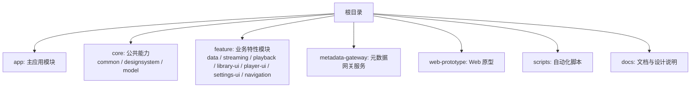
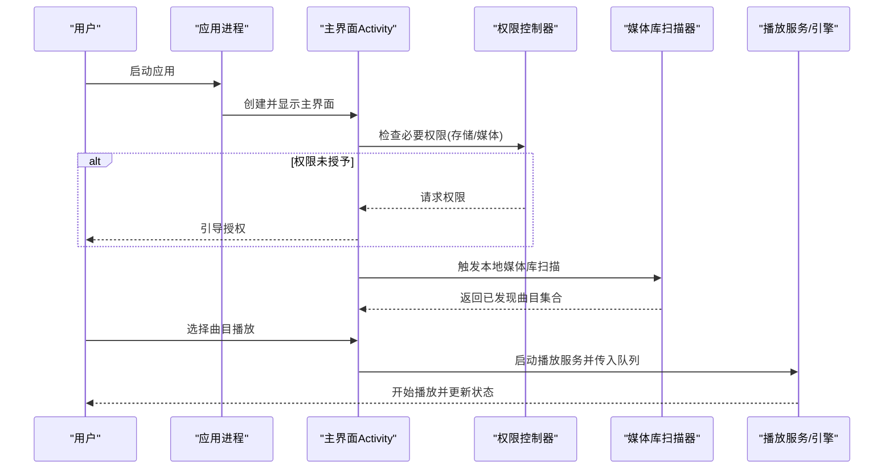
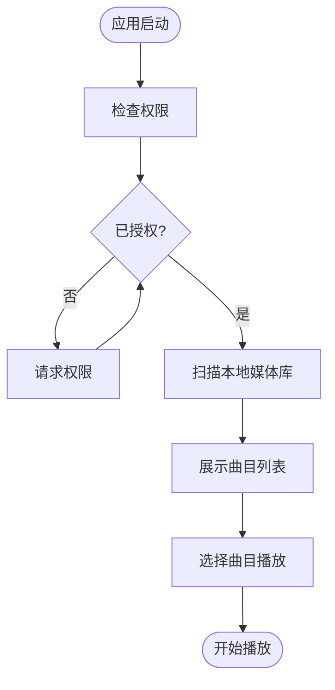
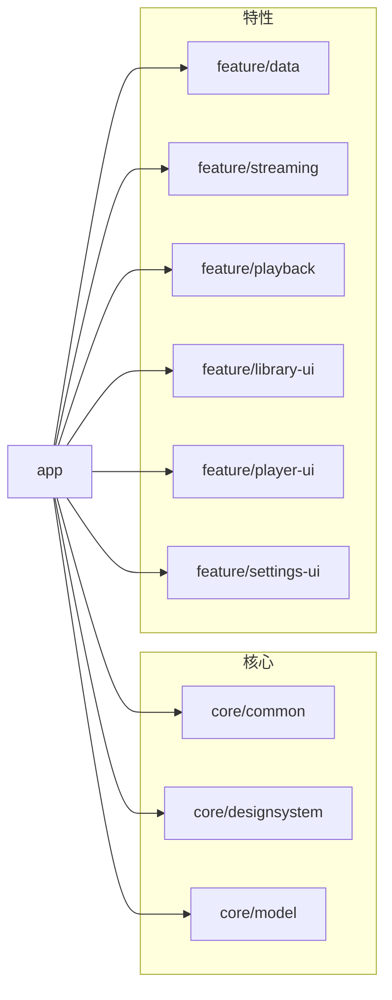

# 快速开始

<cite>
**本文引用的文件**   
- [README.md](file://README.md)
- [build.gradle](file://build.gradle)
- [settings.gradle](file://settings.gradle)
- [gradle.properties](file://gradle.properties)
- [gradle/libs.versions.toml](file://gradle/libs.versions.toml)
- [app/build.gradle](file://app/build.gradle)
- [app/src/main/AndroidManifest.xml](file://app/src/main/AndroidManifest.xml)
- [app/src/main/java/app/yukine/EchoApplication.kt](file://app/src/main/java/app/yukine/EchoApplication.kt)
- [app/src/main/java/app/yukine/MainActivity.kt](file://app/src/main/java/app/yukine/MainActivity.kt)
- [app/src/main/java/app/yukine/AppPermissions.kt](file://app/src/main/java/app/yukine/AppPermissions.kt)
- [feature/data/build.gradle](file://feature/data/build.gradle)
- [feature/streaming/build.gradle](file://feature/streaming/build.gradle)
- [feature/playback/build.gradle](file://feature/playback/build.gradle)
- [feature/library-ui/build.gradle](file://feature/library-ui/build.gradle)
- [feature/player-ui/build.gradle](file://feature/player-ui/build.gradle)
- [feature/settings-ui/build.gradle](file://feature/settings-ui/build.gradle)
- [core/common/build.gradle](file://core/common/build.gradle)
- [core/designsystem/build.gradle](file://core/designsystem/build.gradle)
- [core/model/build.gradle](file://core/model/build.gradle)
</cite>

## 目录
1. [简介](#简介)
2. [项目结构](#项目结构)
3. [核心组件](#核心组件)
4. [架构总览](#架构总览)
5. [详细组件分析](#详细组件分析)
6. [依赖分析](#依赖分析)
7. [性能考虑](#性能考虑)
8. [故障排查指南](#故障排查指南)
9. [结论](#结论)
10. [附录](#附录)

## 简介
本指南面向首次接触 Echo Android 应用的开发者与用户，目标是帮助你在最短时间内完成环境搭建、构建并运行应用，体验音乐库扫描与基础播放功能。内容涵盖：
- 开发环境与工具链要求（Android Studio、Gradle、SDK）
- 克隆与构建步骤（含常见错误处理）
- 在模拟器或真机上运行
- 首次启动后的权限申请、音乐库扫描与基础播放操作
- 常见问题定位与解决思路

## 项目结构
Echo Android 采用多模块工程组织方式，顶层包含 app 主模块以及 core、feature 等子模块；同时提供 metadata-gateway 与 web-prototype 等辅助工程。

**图表来源** 
- [settings.gradle](file://settings.gradle)
- [build.gradle](file://build.gradle)

**章节来源**
- [settings.gradle](file://settings.gradle)
- [build.gradle](file://build.gradle)

## 核心组件
- 应用入口与初始化
  - 应用进程入口位于应用层，负责全局初始化与依赖注入准备。
  - 主界面 Activity 作为导航宿主，承载各功能页面。
- 权限与存储访问
  - 应用声明了必要的系统权限与存储访问策略，用于读取本地媒体与外部存储。
- 模块化职责
  - core 模块提供通用模型、设计系统与公共工具。
  - feature 模块按领域拆分：数据访问、流媒体、播放引擎、UI 组件与设置页等。
  - app 模块聚合所有依赖，装配运行时行为。

**章节来源**
- [app/src/main/java/app/yukine/EchoApplication.kt](file://app/src/main/java/app/yukine/EchoApplication.kt)
- [app/src/main/java/app/yukine/MainActivity.kt](file://app/src/main/java/app/yukine/MainActivity.kt)
- [app/src/main/AndroidManifest.xml](file://app/src/main/AndroidManifest.xml)
- [app/src/main/java/app/yukine/AppPermissions.kt](file://app/src/main/java/app/yukine/AppPermissions.kt)
- [core/common/build.gradle](file://core/common/build.gradle)
- [core/designsystem/build.gradle](file://core/designsystem/build.gradle)
- [core/model/build.gradle](file://core/model/build.gradle)
- [feature/data/build.gradle](file://feature/data/build.gradle)
- [feature/streaming/build.gradle](file://feature/streaming/build.gradle)
- [feature/playback/build.gradle](file://feature/playback/build.gradle)
- [feature/library-ui/build.gradle](file://feature/library-ui/build.gradle)
- [feature/player-ui/build.gradle](file://feature/player-ui/build.gradle)
- [feature/settings-ui/build.gradle](file://feature/settings-ui/build.gradle)

## 架构总览
下图展示了从应用启动到首次播放的关键流程，包括权限检查、媒体库扫描与播放器启动。

**图表来源** 
- [app/src/main/java/app/yukine/MainActivity.kt](file://app/src/main/java/app/yukine/MainActivity.kt)
- [app/src/main/java/app/yukine/AppPermissions.kt](file://app/src/main/java/app/yukine/AppPermissions.kt)
- [app/src/main/AndroidManifest.xml](file://app/src/main/AndroidManifest.xml)

## 详细组件分析

### 环境搭建与构建
- 安装 Android Studio（推荐最新稳定版）
- 配置 JDK（与 Gradle 版本匹配）
- 安装 Android SDK 与平台版本（参考 gradle/libs.versions.toml 中的 compileSdk/targetSdk/minSdk）
- 同步 Gradle 与下载依赖（首次构建可能耗时）
- 构建 APK
  - 使用命令行：./gradlew assembleDebug 或 ./gradlew assembleRelease
  - 或在 Android Studio 中点击 Build -> Build Bundle(s)/APK(s)
- 运行到设备
  - 连接模拟器或真机，选择 Run 'app' 或使用 ./gradlew installDebug

注意：
- 若出现 Gradle 版本不匹配，请根据 gradle/wrapper/gradle-wrapper.properties 指定的版本进行升级或降级。
- 若出现 Kotlin/AGP 版本冲突，请检查 gradle/libs.versions.toml 与模块 build.gradle 的版本对齐。

**章节来源**
- [gradle/libs.versions.toml](file://gradle/libs.versions.toml)
- [gradle.properties](file://gradle.properties)
- [build.gradle](file://build.gradle)
- [app/build.gradle](file://app/build.gradle)

### 首次启动与基本操作
- 权限申请
  - 应用会在首次进入时检测并请求必要的存储/媒体访问权限，以扫描本地音乐文件。
- 媒体库扫描
  - 授权后自动扫描本地媒体，生成可播放的曲目列表。
- 基础播放
  - 在“我的音乐”或“最近播放”中选择任意曲目即可开始播放；支持暂停、下一首、进度拖动等基础控制。

**图表来源** 
- [app/src/main/java/app/yukine/AppPermissions.kt](file://app/src/main/java/app/yukine/AppPermissions.kt)
- [app/src/main/java/app/yukine/MainActivity.kt](file://app/src/main/java/app/yukine/MainActivity.kt)

**章节来源**
- [app/src/main/java/app/yukine/AppPermissions.kt](file://app/src/main/java/app/yukine/AppPermissions.kt)
- [app/src/main/java/app/yukine/MainActivity.kt](file://app/src/main/java/app/yukine/MainActivity.kt)
- [app/src/main/AndroidManifest.xml](file://app/src/main/AndroidManifest.xml)

## 依赖分析
- 模块依赖关系
  - app 依赖 core 与 feature 各模块
  - feature 内部按领域解耦，如 data 提供数据访问，playback 提供播放能力，library-ui/player-ui 提供 UI 组件
- 版本管理
  - 统一通过 gradle/libs.versions.toml 管理 AGP、Kotlin、Compose、第三方库版本
- 外部依赖
  - 网络、数据库、音频解码、媒体扫描等依赖由对应模块引入

**图表来源** 
- [settings.gradle](file://settings.gradle)
- [build.gradle](file://build.gradle)
- [app/build.gradle](file://app/build.gradle)
- [feature/data/build.gradle](file://feature/data/build.gradle)
- [feature/streaming/build.gradle](file://feature/streaming/build.gradle)
- [feature/playback/build.gradle](file://feature/playback/build.gradle)
- [feature/library-ui/build.gradle](file://feature/library-ui/build.gradle)
- [feature/player-ui/build.gradle](file://feature/player-ui/build.gradle)
- [feature/settings-ui/build.gradle](file://feature/settings-ui/build.gradle)
- [core/common/build.gradle](file://core/common/build.gradle)
- [core/designsystem/build.gradle](file://core/designsystem/build.gradle)
- [core/model/build.gradle](file://core/model/build.gradle)

**章节来源**
- [settings.gradle](file://settings.gradle)
- [build.gradle](file://build.gradle)
- [app/build.gradle](file://app/build.gradle)
- [gradle/libs.versions.toml](file://gradle/libs.versions.toml)

## 性能考虑
- 首次媒体库扫描可能较慢，建议在 Wi-Fi 环境下且设备电量充足时进行
- 大曲库场景建议开启增量扫描与缓存策略（如已实现）
- 避免在主线程执行重 IO 任务，确保 UI 流畅
- 合理设置播放缓冲与码率策略，平衡音质与卡顿

## 故障排查指南
- 无法同步或构建失败
  - 检查 Gradle 版本是否与 wrapper 一致
  - 清理缓存并重建：./gradlew clean && ./gradlew build
  - 确认 JDK 版本与 AGP/Kotlin 兼容
- 权限相关错误
  - 确认已在清单文件中声明必要权限并在运行时授权
  - 在设备上手动授予“文件和媒体”或“存储”权限
- 找不到本地音乐
  - 确认扫描路径包含目标目录
  - 检查文件系统访问权限是否生效
- 播放异常
  - 检查音频格式是否受支持
  - 查看播放日志与崩溃堆栈，定位解码或服务连接问题

**章节来源**
- [app/src/main/AndroidManifest.xml](file://app/src/main/AndroidManifest.xml)
- [app/src/main/java/app/yukine/AppPermissions.kt](file://app/src/main/java/app/yukine/AppPermissions.kt)
- [app/build.gradle](file://app/build.gradle)
- [gradle/libs.versions.toml](file://gradle/libs.versions.toml)

## 结论
通过以上步骤，你可以在本地成功构建并运行 Echo Android 应用，完成权限授权、媒体库扫描与基础播放体验。若遇到环境问题，优先核对 Gradle、JDK、SDK 版本一致性，再结合日志与权限设置逐步定位。

## 附录
- 常用命令
  - 清理并构建：./gradlew clean assembleDebug
  - 安装到设备：./gradlew installDebug
  - 查看依赖树：./gradlew :app:dependencies
- 参考文档
  - 项目 README 与架构文档位于 docs 目录，可作为深入理解代码结构与演进路线的补充材料