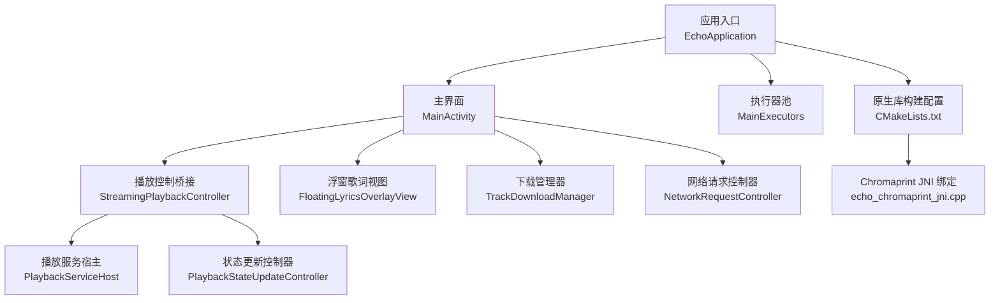
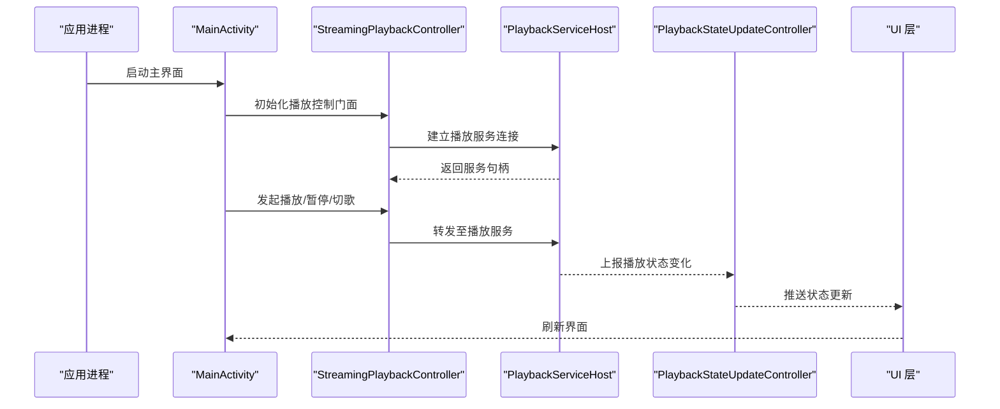
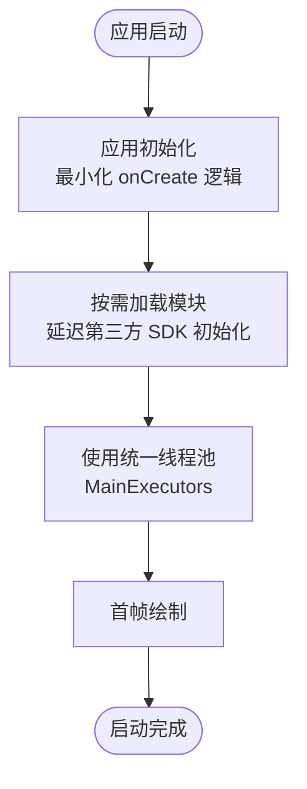
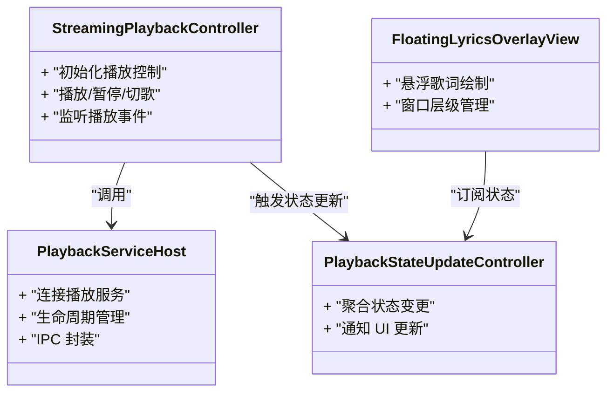
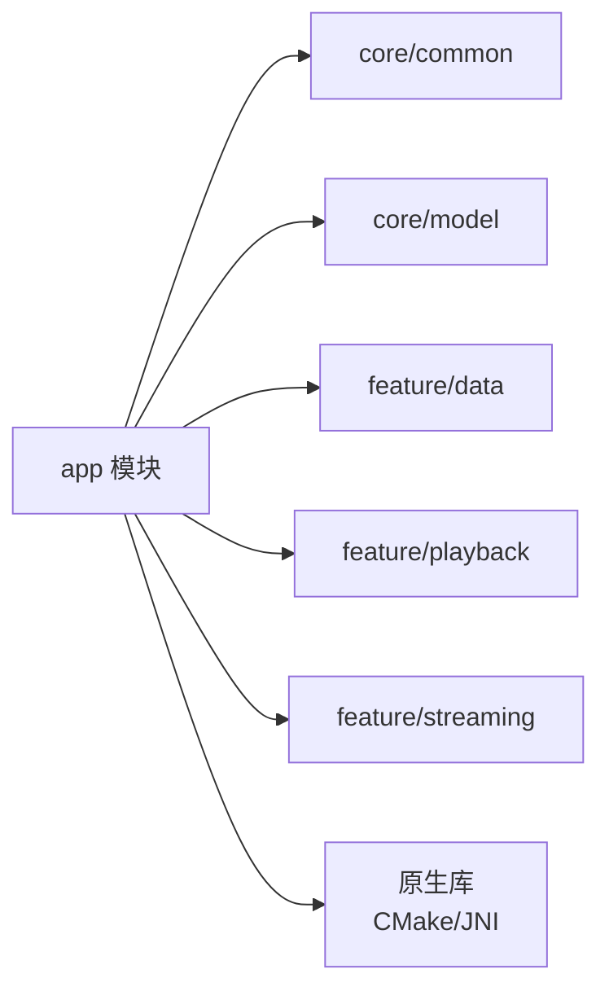

# 性能优化

<cite>
**本文引用的文件**   
- [EchoApplication.kt](file://app/src/main/java/app/yukine/EchoApplication.kt)
- [MainActivity.kt](file://app/src/main/java/app/yukine/MainActivity.kt)
- [MainExecutors.kt](file://app/src/main/java/app/yukine/MainExecutors.kt)
- [StreamingPlaybackController.kt](file://app/src/main/java/app/yukine/StreamingPlaybackController.kt)
- [PlaybackServiceHost.kt](file://app/src/main/java/app/yukine/MainPlaybackServiceHost.kt)
- [PlaybackStateUpdateController.kt](file://app/src/main/java/app/yukine/PlaybackStateUpdateController.kt)
- [FloatingLyricsOverlayView.kt](file://app/src/main/java/app/yukine/FloatingLyricsOverlayView.kt)
- [TrackDownloadManager.kt](file://app/src/main/java/app/yukine/TrackDownloadManager.kt)
- [NetworkRequestController.java](file://app/src/main/java/app/yukine/NetworkRequestController.java)
- [RoomRepositoriesInstrumentedTest.java](file://app/src/androidTest/java/app/yukine/data/RoomRepositoriesInstrumentedTest.java)
- [build.gradle](file://app/build.gradle)
- [proguard-rules.pro](file://app/proguard-rules.pro)
- [AndroidManifest.xml](file://app/src/main/AndroidManifest.xml)
- [CMakeLists.txt](file://app/src/main/cpp/CMakeLists.txt)
- [echo_chromaprint_jni.cpp](file://app/src/main/cpp/echo_chromaprint_jni.cpp)
- [playback-stability-smoke.ps1](file://scripts/playback-stability-smoke.ps1)
</cite>

## 目录
1. [简介](#简介)
2. [项目结构](#项目结构)
3. [核心组件](#核心组件)
4. [架构总览](#架构总览)
5. [详细组件分析](#详细组件分析)
6. [依赖分析](#依赖分析)
7. [性能考虑](#性能考虑)
8. [故障排查指南](#故障排查指南)
9. [结论](#结论)
10. [附录](#附录)

## 简介
本指南面向 Echo Android 应用的性能优化，覆盖内存、启动速度、网络、数据库、播放与音频处理、UI 渲染等关键领域；并提供监控指标采集、瓶颈分析方法、内存泄漏检测、ANR 与 CPU 分析实践以及常见问题解决方案。文档结合仓库中的实际模块与入口点，给出可落地的优化建议与验证路径。

## 项目结构
本项目采用多模块分层组织：
- app：应用装配层，包含 Application、Activity、服务宿主、任务调度、播放控制桥接、下载管理、网络请求控制器、JNI 原生集成等
- core/common、core/model、core/designsystem：通用能力与 UI 设计系统
- feature/*：按特性划分的业务模块（数据、导航、播放、播放器 UI、设置 UI、流媒体与流媒体 UI）
- metadata-gateway：元数据网关（Node.js），用于加速本地开发体验
- scripts：稳定性与发布脚本

图示来源
- [EchoApplication.kt](file://app/src/main/java/app/yukine/EchoApplication.kt)
- [MainActivity.kt](file://app/src/main/java/app/yukine/MainActivity.kt)
- [MainExecutors.kt](file://app/src/main/java/app/yukine/MainExecutors.kt)
- [StreamingPlaybackController.kt](file://app/src/main/java/app/yukine/StreamingPlaybackController.kt)
- [MainPlaybackServiceHost.kt](file://app/src/main/java/app/yukine/MainPlaybackServiceHost.kt)
- [PlaybackStateUpdateController.kt](file://app/src/main/java/app/yukine/PlaybackStateUpdateController.kt)
- [FloatingLyricsOverlayView.kt](file://app/src/main/java/app/yukine/FloatingLyricsOverlayView.kt)
- [TrackDownloadManager.kt](file://app/src/main/java/app/yukine/TrackDownloadManager.kt)
- [NetworkRequestController.java](file://app/src/main/java/app/yukine/NetworkRequestController.java)
- [CMakeLists.txt](file://app/src/main/cpp/CMakeLists.txt)
- [echo_chromaprint_jni.cpp](file://app/src/main/cpp/echo_chromaprint_jni.cpp)

章节来源
- [EchoApplication.kt](file://app/src/main/java/app/yukine/EchoApplication.kt)
- [MainActivity.kt](file://app/src/main/java/app/yukine/MainActivity.kt)
- [AndroidManifest.xml](file://app/src/main/AndroidManifest.xml)

## 核心组件
- 应用初始化与线程模型
  - Application 负责全局初始化与第三方 SDK 接入，应尽量避免在 onCreate 中做耗时操作
  - MainExecutors 集中管理线程池，统一 IO、CPU、后台任务调度，避免散乱创建线程导致上下文切换与锁竞争
- 播放与控制链路
  - StreamingPlaybackController 作为播放控制门面，协调播放服务宿主与状态更新控制器
  - PlaybackServiceHost 封装播放服务的连接与生命周期
  - PlaybackStateUpdateController 聚合播放状态变更并驱动 UI 刷新
- UI 与浮窗
  - FloatingLyricsOverlayView 提供悬浮歌词视图，需关注绘制开销与窗口层级管理
- 下载与网络
  - TrackDownloadManager 管理批量下载任务，需关注并发度、重试与缓存策略
  - NetworkRequestController 统一网络请求入口，便于实施限流、超时与重试策略
- 原生与指纹识别
  - CMakeLists.txt 与 echo_chromaprint_jni.cpp 集成 Chromaprint 进行音频指纹计算，注意 JNI 调用成本与内存拷贝

章节来源
- [MainExecutors.kt](file://app/src/main/java/app/yukine/MainExecutors.kt)
- [StreamingPlaybackController.kt](file://app/src/main/java/app/yukine/StreamingPlaybackController.kt)
- [MainPlaybackServiceHost.kt](file://app/src/main/java/app/yukine/MainPlaybackServiceHost.kt)
- [PlaybackStateUpdateController.kt](file://app/src/main/java/app/yukine/PlaybackStateUpdateController.kt)
- [FloatingLyricsOverlayView.kt](file://app/src/main/java/app/yukine/FloatingLyricsOverlayView.kt)
- [TrackDownloadManager.kt](file://app/src/main/java/app/yukine/TrackDownloadManager.kt)
- [NetworkRequestController.java](file://app/src/main/java/app/yukine/NetworkRequestController.java)
- [CMakeLists.txt](file://app/src/main/cpp/CMakeLists.txt)
- [echo_chromaprint_jni.cpp](file://app/src/main/cpp/echo_chromaprint_jni.cpp)

## 架构总览
下图展示从应用启动到播放控制的关键路径，以及 UI 与后台任务的交互关系。

图示来源
- [MainActivity.kt](file://app/src/main/java/app/yukine/MainActivity.kt)
- [StreamingPlaybackController.kt](file://app/src/main/java/app/yukine/StreamingPlaybackController.kt)
- [MainPlaybackServiceHost.kt](file://app/src/main/java/app/yukine/MainPlaybackServiceHost.kt)
- [PlaybackStateUpdateController.kt](file://app/src/main/java/app/yukine/PlaybackStateUpdateController.kt)

## 详细组件分析

### 启动阶段优化
- 目标
  - 缩短冷启动时间，减少首帧绘制延迟，降低主线程阻塞风险
- 关键动作
  - 将非必要的初始化推迟到按需加载或后台线程
  - 使用 MainExecutors 的专用线程池执行 IO 密集型任务
  - 在 Application.onCreate 中仅保留必要的全局初始化
- 验证方法
  - 使用 Android Studio Profiler 的 Startup 面板测量冷/热启动耗时
  - 通过 Traceview/Systrace 定位主线程卡顿

章节来源
- [EchoApplication.kt](file://app/src/main/java/app/yukine/EchoApplication.kt)
- [MainActivity.kt](file://app/src/main/java/app/yukine/MainActivity.kt)
- [MainExecutors.kt](file://app/src/main/java/app/yukine/MainExecutors.kt)

### 内存优化策略
- 对象生命周期与引用
  - 避免在长生命周期对象中持有 Activity/View 引用，防止泄漏
  - 对图片等资源使用合适的采样率与缓存策略
- 线程与协程
  - 使用统一的线程池，避免频繁创建销毁线程
  - 在 ViewModel 或作用域内取消长时间运行的任务
- 诊断工具
  - LeakCanary 检测内存泄漏
  - Memory Profiler 观察堆快照与分配热点
- 代码级参考
  - 检查浮窗视图与播放控制器的生命周期绑定
  - 确保下载任务在合适的作用域内取消与清理

章节来源
- [FloatingLyricsOverlayView.kt](file://app/src/main/java/app/yukine/FloatingLyricsOverlayView.kt)
- [StreamingPlaybackController.kt](file://app/src/main/java/app/yukine/StreamingPlaybackController.kt)
- [TrackDownloadManager.kt](file://app/src/main/java/app/yukine/TrackDownloadManager.kt)

### 启动速度优化
- 清单与进程
  - 合理声明 Service 与 Provider，避免不必要的自启动
  - 使用 applicationIdSuffix 区分调试与发布版本，启用差异化初始化
- 资源与构建
  - 开启 R8/ProGuard 混淆与压缩
  - 使用增量编译与并行构建
- 参考配置
  - build.gradle 中启用优化选项
  - proguard-rules.pro 中排除必要反射类

章节来源
- [AndroidManifest.xml](file://app/src/main/AndroidManifest.xml)
- [build.gradle](file://app/build.gradle)
- [proguard-rules.pro](file://app/proguard-rules.pro)

### 网络请求优化
- 统一入口与策略
  - 通过 NetworkRequestController 集中实现超时、重试、退避与错误码处理
  - 为不同场景配置不同的并发度与队列大小
- 缓存与去重
  - 对静态资源与列表接口启用磁盘/内存缓存
  - 基于 URL 或参数哈希去重，避免重复请求
- 监控与降级
  - 记录成功率、时延分位与失败原因
  - 在网络不可用时提供降级策略与提示

章节来源
- [NetworkRequestController.java](file://app/src/main/java/app/yukine/NetworkRequestController.java)

### 数据库查询优化
- Room 与索引
  - 为高频查询字段添加索引，避免全表扫描
  - 使用分页与只读查询，减少大结果集传输
- 事务与批量写入
  - 合并多次写入为单次事务，降低同步开销
- 测试与回归
  - 使用 InstrumentedTest 验证复杂查询性能与一致性

章节来源
- [RoomRepositoriesInstrumentedTest.java](file://app/src/androidTest/java/app/yukine/data/RoomRepositoriesInstrumentedTest.java)

### 播放性能调优与音频处理优化
- 播放链路
  - StreamingPlaybackController 作为门面，屏蔽底层差异，减少 UI 侧复杂度
  - PlaybackServiceHost 管理播放服务连接，避免跨进程通信抖动
- 状态更新
  - PlaybackStateUpdateController 聚合状态变更，减少 UI 频繁刷新
- 原生指纹识别
  - CMakeLists.txt 与 echo_chromaprint_jni.cpp 集成 Chromaprint，注意 JNI 调用与缓冲区复用
- 浮窗歌词
  - FloatingLyricsOverlayView 应避免在 onDraw 中进行重型计算，必要时使用离屏缓冲

图示来源
- [StreamingPlaybackController.kt](file://app/src/main/java/app/yukine/StreamingPlaybackController.kt)
- [MainPlaybackServiceHost.kt](file://app/src/main/java/app/yukine/MainPlaybackServiceHost.kt)
- [PlaybackStateUpdateController.kt](file://app/src/main/java/app/yukine/PlaybackStateUpdateController.kt)
- [FloatingLyricsOverlayView.kt](file://app/src/main/java/app/yukine/FloatingLyricsOverlayView.kt)

章节来源
- [StreamingPlaybackController.kt](file://app/src/main/java/app/yukine/StreamingPlaybackController.kt)
- [MainPlaybackServiceHost.kt](file://app/src/main/java/app/yukine/MainPlaybackServiceHost.kt)
- [PlaybackStateUpdateController.kt](file://app/src/main/java/app/yukine/PlaybackStateUpdateController.kt)
- [FloatingLyricsOverlayView.kt](file://app/src/main/java/app/yukine/FloatingLyricsOverlayView.kt)
- [CMakeLists.txt](file://app/src/main/cpp/CMakeLists.txt)
- [echo_chromaprint_jni.cpp](file://app/src/main/cpp/echo_chromaprint_jni.cpp)

### UI 渲染优化
- 列表与布局
  - 使用 RecyclerView 与 DiffUtil 减少重绘
  - 避免过深布局层级，使用 ConstraintLayout 扁平化
- 动画与过渡
  - 减少过度绘制，关闭不必要的阴影与模糊
- 浮窗与窗口
  - 控制浮窗层级与尺寸，避免频繁重建

章节来源
- [FloatingLyricsOverlayView.kt](file://app/src/main/java/app/yukine/FloatingLyricsOverlayView.kt)

## 依赖分析
- 模块耦合
  - app 层依赖 feature 与 core 模块，提供装配与编排
  - playback 与 streaming 模块解耦播放与流媒体细节
- 外部依赖
  - 原生库通过 CMake 集成，JNI 调用需注意内存与异常边界
- 构建与优化
  - ProGuard/R8 减少包体与提升运行效率
  - 并行构建与增量编译缩短构建时间

图示来源
- [CMakeLists.txt](file://app/src/main/cpp/CMakeLists.txt)
- [build.gradle](file://app/build.gradle)

章节来源
- [build.gradle](file://app/build.gradle)
- [proguard-rules.pro](file://app/proguard-rules.pro)
- [CMakeLists.txt](file://app/src/main/cpp/CMakeLists.txt)

## 性能考虑
- 内存
  - 使用对象池与复用机制，减少 GC 压力
  - 图片与音频解码使用合适的格式与采样率
- 启动
  - 延迟初始化非必要模块，拆分初始化步骤
- 网络
  - 合理设置超时与重试次数，避免雪崩
  - 使用连接池与 HTTP/2 提升吞吐
- 数据库
  - 合理使用索引与分页，避免大事务
- 播放与音频
  - 减少 JNI 调用频率，批量处理数据
  - 使用硬件解码与低延迟模式
- UI
  - 减少主线程工作，使用异步渲染与离屏缓冲

[本节为通用指导，不直接分析具体文件]

## 故障排查指南
- 内存泄漏检测
  - 使用 LeakCanary 捕获泄漏栈，定位持有 Activity/View 的长生命周期对象
  - 检查浮窗视图与服务连接的释放时机
- ANR 分析
  - 收集 ANR trace，定位主线程阻塞点
  - 审查下载与网络请求是否在主线程执行
- CPU 性能分析
  - 使用 CPU Profiler 与 Systrace 分析热点函数与锁竞争
  - 针对指纹识别与音频处理路径进行专项分析
- 稳定性验证
  - 使用脚本进行播放稳定性冒烟测试，覆盖常见场景

章节来源
- [FloatingLyricsOverlayView.kt](file://app/src/main/java/app/yukine/FloatingLyricsOverlayView.kt)
- [TrackDownloadManager.kt](file://app/src/main/java/app/yukine/TrackDownloadManager.kt)
- [playback-stability-smoke.ps1](file://scripts/playback-stability-smoke.ps1)

## 结论
通过对应用启动、内存、网络、数据库、播放与音频、UI 渲染的系统性优化，并结合监控与诊断工具，可以显著提升 Echo Android 应用的流畅性与稳定性。建议在持续集成中加入性能基线检查，定期回归关键路径，确保优化效果长期有效。

[本节为总结，不直接分析具体文件]

## 附录
- 常用工具
  - Android Studio Profiler（CPU/Memory/Network/Startup）
  - LeakCanary（内存泄漏）
  - Systrace/Perfetto（系统级追踪）
- 最佳实践清单
  - 统一线程池与任务调度
  - 延迟初始化与按需加载
  - 网络请求限流与重试
  - 数据库索引与分页
  - 原生调用批量化与内存复用
  - UI 扁平化与离屏缓冲

[本节为补充信息，不直接分析具体文件]