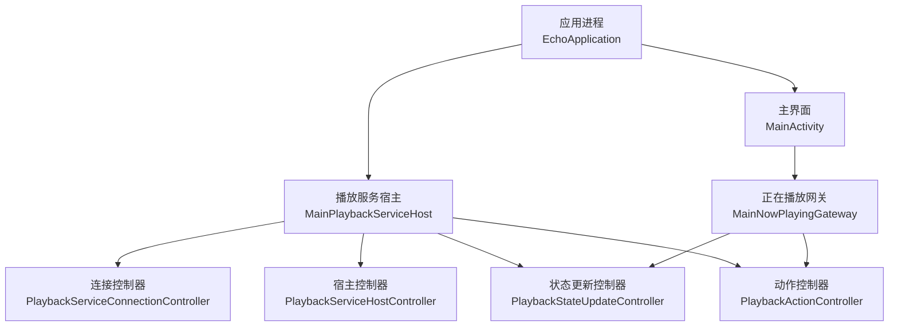
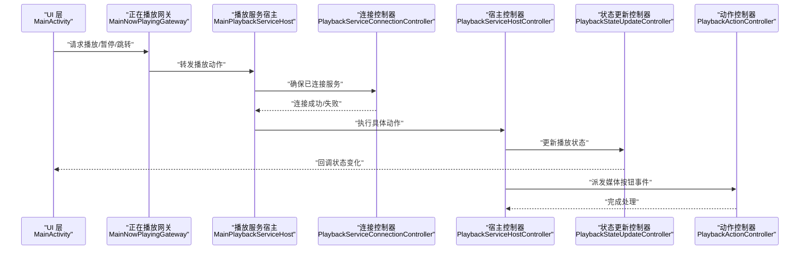
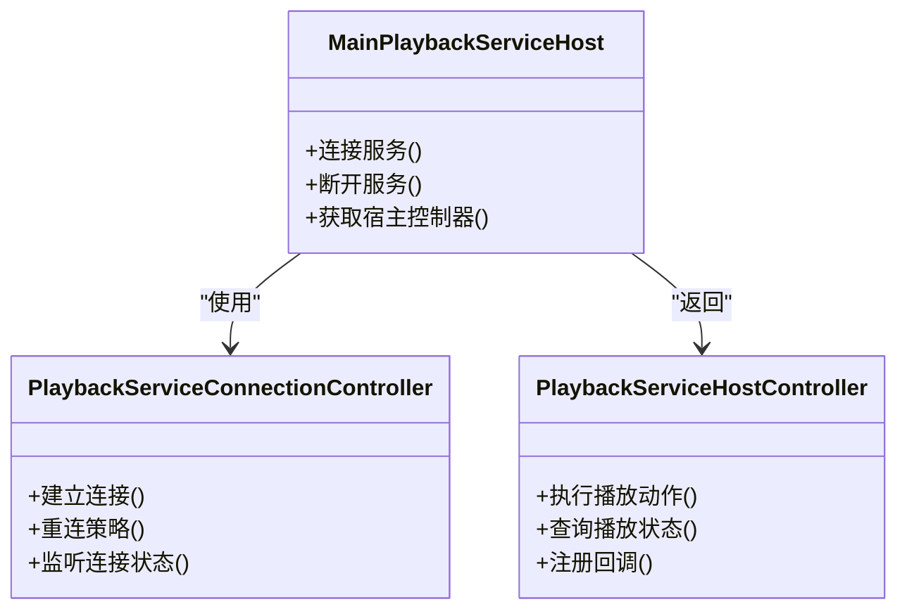
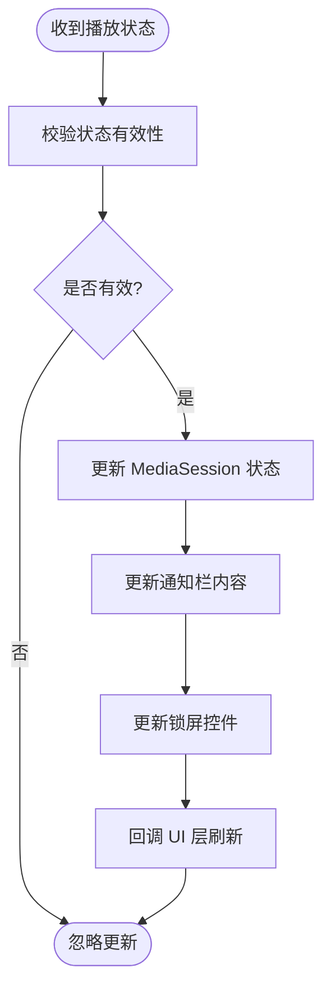
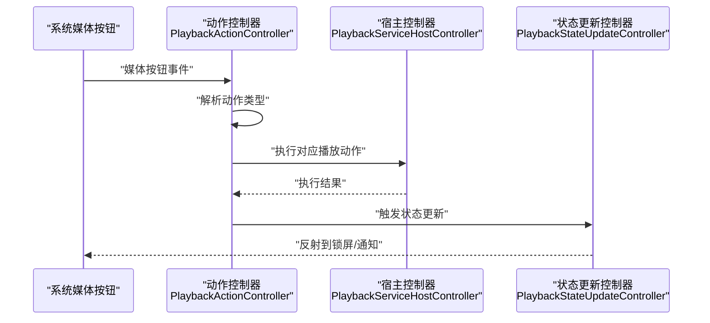
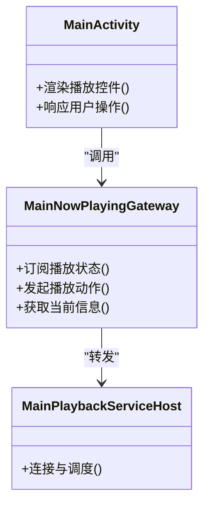
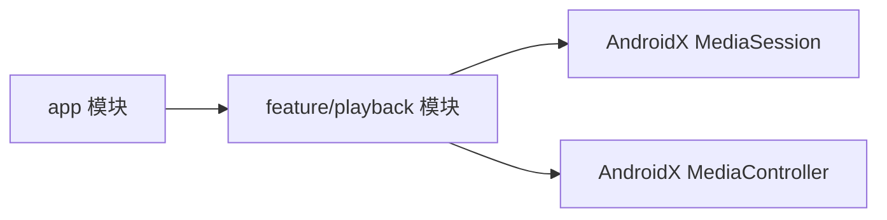

# 媒体会话集成

<cite>
**本文引用的文件**   
- [EchoApplication.kt](file://app/src/main/java/app/yukine/EchoApplication.kt)
- [MainActivity.kt](file://app/src/main/java/app/yukine/MainActivity.kt)
- [MainPlaybackServiceHost.kt](file://app/src/main/java/app/yukine/MainPlaybackServiceHost.kt)
- [PlaybackServiceConnectionController.kt](file://app/src/main/java/app/yukine/PlaybackServiceConnectionController.kt)
- [PlaybackServiceHostController.kt](file://app/src/main/java/app/yukine/PlaybackServiceHostController.kt)
- [PlaybackStateUpdateController.kt](file://app/src/main/java/app/yukine/PlaybackStateUpdateController.kt)
- [PlaybackActionController.kt](file://app/src/main/java/app/yukine/PlaybackActionController.kt)
- [MainNowPlayingGateway.kt](file://app/src/main/java/app/yukine/MainNowPlayingGateway.kt)
- [PlaybackUiModule.kt](file://app/src/main/java/app/yukine/PlaybackUiModule.kt)
- [playback/build.gradle](file://feature/playback/build.gradle)
- [AndroidManifest.xml](file://app/src/main/AndroidManifest.xml)
</cite>

## 目录
1. [简介](#简介)
2. [项目结构](#项目结构)
3. [核心组件](#核心组件)
4. [架构总览](#架构总览)
5. [详细组件分析](#详细组件分析)
6. [依赖分析](#依赖分析)
7. [性能考虑](#性能考虑)
8. [故障排除指南](#故障排除指南)
9. [结论](#结论)
10. [附录](#附录)

## 简介
本技术文档聚焦于 Echo Android 应用中的媒体会话（MediaSession）集成，覆盖以下关键主题：
- MediaSession 的初始化与配置
- 媒体元数据管理与更新
- 远程控制接口与媒体按钮事件处理
- 锁屏控制与通知栏交互
- 媒体路由管理、音频焦点处理与设备切换支持
- 安全性与权限管理、兼容性处理
- 调试方法与常见问题排查

文档以代码级分析为基础，结合架构图与时序图，帮助开发者快速理解并扩展媒体会话能力。

## 项目结构
本项目采用多模块架构，播放与媒体会话相关逻辑主要分布在 app 层与 feature/playback 模块中。与媒体会话相关的入口与控制器包括：
- 应用启动与全局初始化
- 播放服务宿主与连接控制
- 播放状态更新与动作分发
- UI 与播放桥接网关

图表来源
- [EchoApplication.kt](file://app/src/main/java/app/yukine/EchoApplication.kt)
- [MainActivity.kt](file://app/src/main/java/app/yukine/MainActivity.kt)
- [MainPlaybackServiceHost.kt](file://app/src/main/java/app/yukine/MainPlaybackServiceHost.kt)
- [PlaybackServiceConnectionController.kt](file://app/src/main/java/app/yukine/PlaybackServiceConnectionController.kt)
- [PlaybackServiceHostController.kt](file://app/src/main/java/app/yukine/PlaybackServiceHostController.kt)
- [PlaybackStateUpdateController.kt](file://app/src/main/java/app/yukine/PlaybackStateUpdateController.kt)
- [PlaybackActionController.kt](file://app/src/main/java/app/yukine/PlaybackActionController.kt)
- [MainNowPlayingGateway.kt](file://app/src/main/java/app/yukine/MainNowPlayingGateway.kt)

章节来源
- [EchoApplication.kt](file://app/src/main/java/app/yukine/EchoApplication.kt)
- [MainActivity.kt](file://app/src/main/java/app/yukine/MainActivity.kt)
- [MainPlaybackServiceHost.kt](file://app/src/main/java/app/yukine/MainPlaybackServiceHost.kt)
- [PlaybackServiceConnectionController.kt](file://app/src/main/java/app/yukine/PlaybackServiceConnectionController.kt)
- [PlaybackServiceHostController.kt](file://app/src/main/java/app/yukine/PlaybackServiceHostController.kt)
- [PlaybackStateUpdateController.kt](file://app/src/main/java/app/yukine/PlaybackStateUpdateController.kt)
- [PlaybackActionController.kt](file://app/src/main/java/app/yukine/PlaybackActionController.kt)
- [MainNowPlayingGateway.kt](file://app/src/main/java/app/yukine/MainNowPlayingGateway.kt)

## 核心组件
- 播放服务宿主（MainPlaybackServiceHost）：负责绑定/解绑播放服务、持有与服务端通信的句柄，是媒体会话生命周期管理的中心。
- 连接控制器（PlaybackServiceConnectionController）：封装与服务连接的建立、重连、断开等策略。
- 宿主控制器（PlaybackServiceHostController）：提供上层调用抽象，屏蔽底层服务差异。
- 状态更新控制器（PlaybackStateUpdateController）：将播放状态同步到 MediaSession、通知栏与锁屏。
- 动作控制器（PlaybackActionController）：接收来自系统或外部源的媒体动作（如播放/暂停、下一首），转发至播放引擎。
- 正在播放网关（MainNowPlayingGateway）：UI 与播放层的桥接，统一暴露“正在播放”相关能力。

章节来源
- [MainPlaybackServiceHost.kt](file://app/src/main/java/app/yukine/MainPlaybackServiceHost.kt)
- [PlaybackServiceConnectionController.kt](file://app/src/main/java/app/yukine/PlaybackServiceConnectionController.kt)
- [PlaybackServiceHostController.kt](file://app/src/main/java/app/yukine/PlaybackServiceHostController.kt)
- [PlaybackStateUpdateController.kt](file://app/src/main/java/app/yukine/PlaybackStateUpdateController.kt)
- [PlaybackActionController.kt](file://app/src/main/java/app/yukine/PlaybackActionController.kt)
- [MainNowPlayingGateway.kt](file://app/src/main/java/app/yukine/MainNowPlayingGateway.kt)

## 架构总览
下图展示了从 UI 到播放服务的端到端流程，以及媒体会话在其中的角色。

图表来源
- [MainActivity.kt](file://app/src/main/java/app/yukine/MainActivity.kt)
- [MainNowPlayingGateway.kt](file://app/src/main/java/app/yukine/MainNowPlayingGateway.kt)
- [MainPlaybackServiceHost.kt](file://app/src/main/java/app/yukine/MainPlaybackServiceHost.kt)
- [PlaybackServiceConnectionController.kt](file://app/src/main/java/app/yukine/PlaybackServiceConnectionController.kt)
- [PlaybackServiceHostController.kt](file://app/src/main/java/app/yukine/PlaybackServiceHostController.kt)
- [PlaybackStateUpdateController.kt](file://app/src/main/java/app/yukine/PlaybackStateUpdateController.kt)
- [PlaybackActionController.kt](file://app/src/main/java/app/yukine/PlaybackActionController.kt)

## 详细组件分析

### 组件一：播放服务宿主与连接控制
职责与要点
- 负责在应用进程内与播放服务建立连接，维护连接状态与重试策略。
- 对外暴露统一的宿主接口，供 UI 与业务层调用。
- 在服务生命周期变化时，协调状态更新与动作派发。

图表来源
- [MainPlaybackServiceHost.kt](file://app/src/main/java/app/yukine/MainPlaybackServiceHost.kt)
- [PlaybackServiceConnectionController.kt](file://app/src/main/java/app/yukine/PlaybackServiceConnectionController.kt)
- [PlaybackServiceHostController.kt](file://app/src/main/java/app/yukine/PlaybackServiceHostController.kt)

章节来源
- [MainPlaybackServiceHost.kt](file://app/src/main/java/app/yukine/MainPlaybackServiceHost.kt)
- [PlaybackServiceConnectionController.kt](file://app/src/main/java/app/yukine/PlaybackServiceConnectionController.kt)
- [PlaybackServiceHostController.kt](file://app/src/main/java/app/yukine/PlaybackServiceHostController.kt)

### 组件二：状态更新与媒体会话同步
职责与要点
- 将播放状态（当前曲目、进度、播放模式等）同步到 MediaSession、通知栏与锁屏控件。
- 保证状态变更的幂等性与一致性，避免重复更新导致闪烁或卡顿。
- 与 UI 层保持双向同步，确保用户操作即时反馈。

图表来源
- [PlaybackStateUpdateController.kt](file://app/src/main/java/app/yukine/PlaybackStateUpdateController.kt)
- [MainNowPlayingGateway.kt](file://app/src/main/java/app/yukine/MainNowPlayingGateway.kt)

章节来源
- [PlaybackStateUpdateController.kt](file://app/src/main/java/app/yukine/PlaybackStateUpdateController.kt)
- [MainNowPlayingGateway.kt](file://app/src/main/java/app/yukine/MainNowPlayingGateway.kt)

### 组件三：动作控制器与媒体按钮事件
职责与要点
- 接收系统媒体按钮事件（如耳机线控、蓝牙遥控器、锁屏按键）。
- 将事件映射为播放动作（播放/暂停、上一首/下一首、跳转、搜索等）。
- 与宿主控制器协作，确保动作在正确的上下文执行。

图表来源
- [PlaybackActionController.kt](file://app/src/main/java/app/yukine/PlaybackActionController.kt)
- [PlaybackServiceHostController.kt](file://app/src/main/java/app/yukine/PlaybackServiceHostController.kt)
- [PlaybackStateUpdateController.kt](file://app/src/main/java/app/yukine/PlaybackStateUpdateController.kt)

章节来源
- [PlaybackActionController.kt](file://app/src/main/java/app/yukine/PlaybackActionController.kt)
- [PlaybackServiceHostController.kt](file://app/src/main/java/app/yukine/PlaybackServiceHostController.kt)
- [PlaybackStateUpdateController.kt](file://app/src/main/java/app/yukine/PlaybackStateUpdateController.kt)

### 组件四：UI 与播放桥接（正在播放网关）
职责与要点
- 为 UI 提供统一的“正在播放”能力访问点。
- 聚合播放状态订阅与动作发起，简化 UI 侧复杂度。
- 与播放服务宿主协同，确保跨进程调用的稳定性。

图表来源
- [MainNowPlayingGateway.kt](file://app/src/main/java/app/yukine/MainNowPlayingGateway.kt)
- [MainActivity.kt](file://app/src/main/java/app/yukine/MainActivity.kt)
- [MainPlaybackServiceHost.kt](file://app/src/main/java/app/yukine/MainPlaybackServiceHost.kt)

章节来源
- [MainNowPlayingGateway.kt](file://app/src/main/java/app/yukine/MainNowPlayingGateway.kt)
- [MainActivity.kt](file://app/src/main/java/app/yukine/MainActivity.kt)
- [MainPlaybackServiceHost.kt](file://app/src/main/java/app/yukine/MainPlaybackServiceHost.kt)

## 依赖分析
- 模块依赖
  - app 模块依赖 feature/playback 模块，用于承载播放与媒体会话相关能力。
  - 构建脚本中声明了必要的 AndroidX 媒体库依赖（如 media-session、media-controller 等）。

图表来源
- [playback/build.gradle](file://feature/playback/build.gradle)

章节来源
- [playback/build.gradle](file://feature/playback/build.gradle)

## 性能考虑
- 状态更新节流：对频繁的状态变更进行合并与节流，避免过度刷新 UI 与通知。
- 连接重试退避：连接失败时使用指数退避策略，降低系统资源消耗。
- 元数据批量更新：在曲目切换时合并元数据更新，减少 IPC 开销。
- 异步处理：所有耗时操作（网络、磁盘 IO）应在后台线程执行，避免阻塞主线程。

[本节为通用指导，不直接分析具体文件]

## 故障排除指南
- 无法连接播放服务
  - 检查服务是否在清单文件中正确声明与启动。
  - 确认连接控制器是否正确处理断连与重连。
- 媒体按钮无效
  - 验证动作控制器是否正确解析系统事件。
  - 检查宿主控制器是否将动作转发到播放引擎。
- 通知/锁屏未更新
  - 确认状态更新控制器是否被触发且参数完整。
  - 检查权限与前台服务状态是否符合要求。
- 音频焦点冲突
  - 确认焦点申请与释放时机是否正确。
  - 在多应用场景下测试抢占与恢复行为。

章节来源
- [AndroidManifest.xml](file://app/src/main/AndroidManifest.xml)
- [PlaybackServiceConnectionController.kt](file://app/src/main/java/app/yukine/PlaybackServiceConnectionController.kt)
- [PlaybackActionController.kt](file://app/src/main/java/app/yukine/PlaybackActionController.kt)
- [PlaybackStateUpdateController.kt](file://app/src/main/java/app/yukine/PlaybackStateUpdateController.kt)

## 结论
通过分层设计与清晰的职责划分，Echo Android 的媒体会话集成实现了从 UI 到播放服务的全链路可控。状态更新、动作派发与连接管理均具备可扩展性与健壮性。建议在后续迭代中持续优化状态同步的性能与错误恢复机制，并完善安全与兼容性策略。

[本节为总结性内容，不直接分析具体文件]

## 附录
- 初始化与配置建议
  - 在应用启动阶段完成必要的媒体会话初始化与权限检查。
  - 为不同 Android 版本准备兼容路径，确保 API 降级可用。
- 安全与权限
  - 仅授予必要权限，遵循最小权限原则。
  - 对敏感元数据与令牌进行安全存储与传输。
- 兼容性处理
  - 针对旧版本系统提供回退方案，确保基础功能可用。
  - 对不同厂商 ROM 的行为差异进行测试与适配。

[本节为通用指导，不直接分析具体文件]