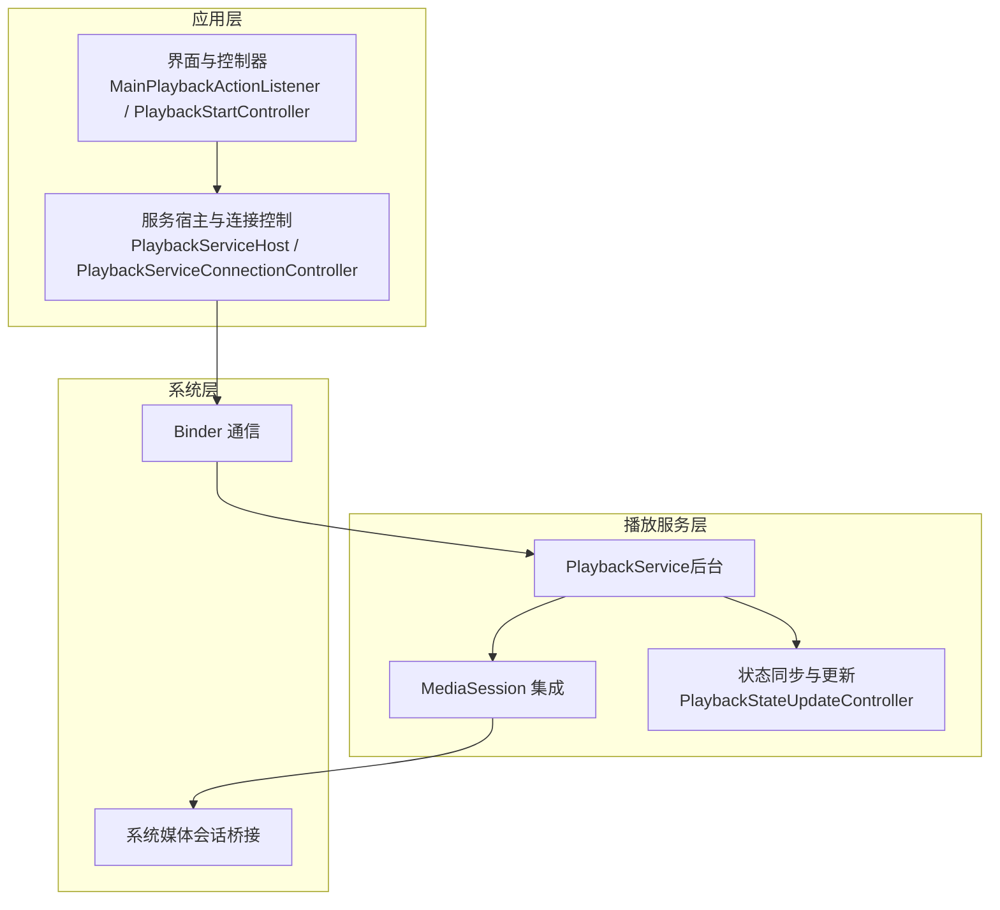
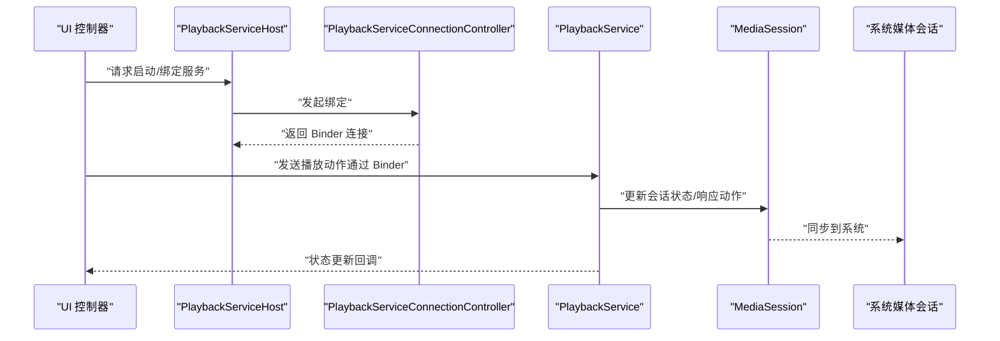
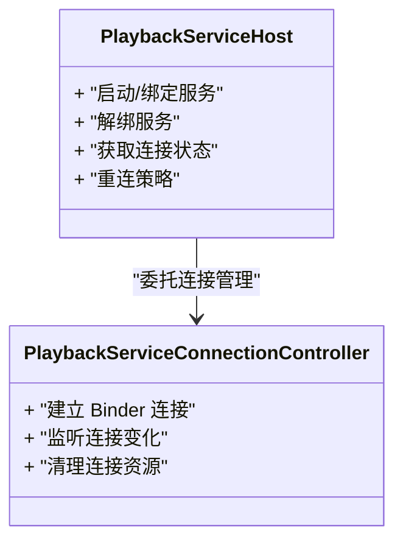
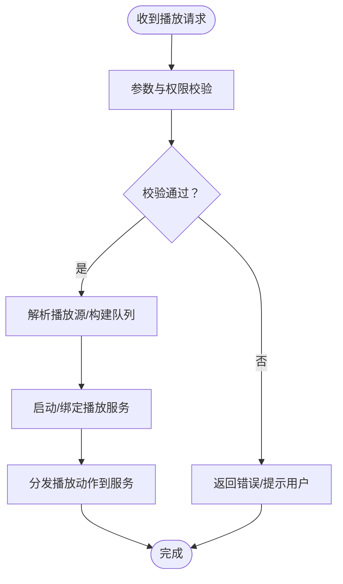
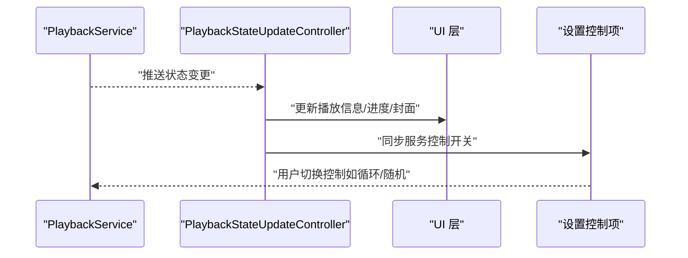
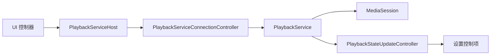

# 播放服务架构

<cite>
**本文引用的文件**   
- [AndroidManifest.xml](file://app/src/main/AndroidManifest.xml)
- [EchoApplication.kt](file://app/src/main/java/app/yukine/EchoApplication.kt)
- [PlaybackServiceHost.kt](file://app/src/main/java/app/yukine/MainPlaybackServiceHost.kt)
- [PlaybackServiceConnectionController.kt](file://app/src/main/java/app/yukine/PlaybackServiceConnectionController.kt)
- [PlaybackServiceHostController.kt](file://app/src/main/java/app/yukine/PlaybackServiceHostController.kt)
- [PlaybackStateUpdateController.kt](file://app/src/main/java/app/yukine/PlaybackStateUpdateController.kt)
- [NowPlayingPlaybackGatewayAdapter.kt](file://app/src/main/java/app/yukine/NowPlayingPlaybackGatewayAdapter.kt)
- [MainPlaybackActionListener.kt](file://app/src/main/java/app/yukine/MainPlaybackActionListener.kt)
- [PlaybackStartController.kt](file://app/src/main/java/app/yukine/PlaybackStartController.kt)
- [PlaybackServiceStarter.kt](file://app/src/main/java/app/yukine/NowPlayingPlaybackServiceStarter.kt)
- [PlaybackServiceControlsAdapter.kt](file://app/src/main/java/app/yukine/SettingsPlaybackServiceControlsAdapter.kt)
- [FloatingLyricsService.kt](file://app/src/main/java/app/yukine/FloatingLyricsService.kt)
- [LiveLyricsNotificationService.kt](file://app/src/main/java/app/yukine/LiveLyricsNotificationService.kt)
- [build.gradle](file://app/build.gradle)
- [ARCHITECTURE.md](file://docs/ARCHITECTURE.md)
- [PLAYBACK_SERVICE_STABILITY_MATRIX.md](file://docs/PLAYBACK_SERVICE_STABILITY_MATRIX.md)
</cite>

## 目录
1. [简介](#简介)
2. [项目结构](#项目结构)
3. [核心组件](#核心组件)
4. [架构总览](#架构总览)
5. [详细组件分析](#详细组件分析)
6. [依赖关系分析](#依赖关系分析)
7. [性能与内存优化](#性能与内存优化)
8. [故障排查指南](#故障排查指南)
9. [结论](#结论)
10. [附录](#附录)

## 简介
本技术文档围绕 Echo Android 播放服务的整体架构展开，重点覆盖以下方面：
- PlaybackService 后台服务的生命周期管理、进程隔离机制以及与系统媒体会话的集成方式
- 播放服务的启动流程、资源管理与内存优化策略
- 服务间通信机制、Binder 接口设计与跨进程状态同步
- 错误处理、崩溃恢复与性能监控等高级特性
- 扩展点与自定义指南，帮助开发者在现有架构上安全地扩展功能

## 项目结构
从模块划分看，播放相关能力集中在 app 主模块与 feature/playback 模块中。UI 层通过一系列控制器与适配器与后台播放服务交互；系统媒体会话由播放服务统一维护，确保锁屏、通知栏、车载等多端一致体验。

图表来源
- [AndroidManifest.xml](file://app/src/main/AndroidManifest.xml)
- [PlaybackServiceHost.kt](file://app/src/main/java/app/yukine/MainPlaybackServiceHost.kt)
- [PlaybackServiceConnectionController.kt](file://app/src/main/java/app/yukine/PlaybackServiceConnectionController.kt)
- [PlaybackStateUpdateController.kt](file://app/src/main/java/app/yukine/PlaybackStateUpdateController.kt)

章节来源
- [AndroidManifest.xml](file://app/src/main/AndroidManifest.xml)
- [EchoApplication.kt](file://app/src/main/java/app/yukine/EchoApplication.kt)
- [ARCHITECTURE.md](file://docs/ARCHITECTURE.md)

## 核心组件
- 服务宿主与连接控制
  - 负责绑定/解绑播放服务、处理连接生命周期、重连策略与异常恢复
- 播放动作监听器
  - 将 UI 层的播放操作转换为对服务的调用，并转发到媒体会话或内部队列
- 播放开始控制器
  - 协调播放源解析、队列构建与服务启动
- 状态更新控制器
  - 接收来自服务的状态变更事件，驱动 UI 刷新与外部子系统同步
- 通知与浮窗歌词服务
  - 作为前台服务或独立服务，提供稳定的播放展示与交互入口

章节来源
- [PlaybackServiceHost.kt](file://app/src/main/java/app/yukine/MainPlaybackServiceHost.kt)
- [PlaybackServiceConnectionController.kt](file://app/src/main/java/app/yukine/PlaybackServiceConnectionController.kt)
- [MainPlaybackActionListener.kt](file://app/src/main/java/app/yukine/MainPlaybackActionListener.kt)
- [PlaybackStartController.kt](file://app/src/main/java/app/yukine/PlaybackStartController.kt)
- [PlaybackStateUpdateController.kt](file://app/src/main/java/app/yukine/PlaybackStateUpdateController.kt)
- [FloatingLyricsService.kt](file://app/src/main/java/app/yukine/FloatingLyricsService.kt)
- [LiveLyricsNotificationService.kt](file://app/src/main/java/app/yukine/LiveLyricsNotificationService.kt)

## 架构总览
播放服务采用“前台服务 + 媒体会话”的标准模式，UI 通过宿主与连接控制器间接访问服务，避免直接耦合。关键交互包括：
- 启动与绑定：由播放器入口触发服务启动，随后建立 Binder 连接
- 动作分发：UI 动作经监听器路由至服务，再由服务写入媒体会话
- 状态回传：服务通过回调/观察者将状态推送给 UI 与外部子系统
- 系统集成：媒体会话与系统通知、锁屏控件、车载平台对接

图表来源
- [PlaybackServiceHost.kt](file://app/src/main/java/app/yukine/MainPlaybackServiceHost.kt)
- [PlaybackServiceConnectionController.kt](file://app/src/main/java/app/yukine/PlaybackServiceConnectionController.kt)
- [MainPlaybackActionListener.kt](file://app/src/main/java/app/yukine/MainPlaybackActionListener.kt)
- [PlaybackStateUpdateController.kt](file://app/src/main/java/app/yukine/PlaybackStateUpdateController.kt)

## 详细组件分析

### 服务宿主与连接控制
- 职责
  - 封装服务的启动、绑定、解绑与重连逻辑
  - 管理连接生命周期，处理服务意外销毁后的恢复
  - 暴露统一的连接状态供上层消费
- 关键点
  - 使用前台服务保证播放稳定性
  - 连接失败时具备退避重试与降级策略
  - 与系统媒体会话保持同步，避免状态不一致

图表来源
- [PlaybackServiceHost.kt](file://app/src/main/java/app/yukine/MainPlaybackServiceHost.kt)
- [PlaybackServiceConnectionController.kt](file://app/src/main/java/app/yukine/PlaybackServiceConnectionController.kt)

章节来源
- [PlaybackServiceHost.kt](file://app/src/main/java/app/yukine/MainPlaybackServiceHost.kt)
- [PlaybackServiceConnectionController.kt](file://app/src/main/java/app/yukine/PlaybackServiceConnectionController.kt)

### 播放动作监听器与开始控制器
- 职责
  - 将 UI 的播放意图转化为服务可识别的动作
  - 协调播放源解析、队列准备与服务启动
- 关键点
  - 动作幂等性设计，防止重复触发
  - 与队列/播放源模块解耦，便于替换实现
  - 启动前进行必要校验（权限、网络、资源可用性）

图表来源
- [MainPlaybackActionListener.kt](file://app/src/main/java/app/yukine/MainPlaybackActionListener.kt)
- [PlaybackStartController.kt](file://app/src/main/java/app/yukine/PlaybackStartController.kt)

章节来源
- [MainPlaybackActionListener.kt](file://app/src/main/java/app/yukine/MainPlaybackActionListener.kt)
- [PlaybackStartController.kt](file://app/src/main/java/app/yukine/PlaybackStartController.kt)

### 状态更新控制器与通知适配
- 职责
  - 订阅服务状态变更，驱动 UI 刷新与外部子系统同步
  - 与设置页中的服务控制项联动，提供运行时开关
- 关键点
  - 状态去抖与批量更新，降低 UI 压力
  - 与媒体会话状态保持一致，避免多端显示差异

图表来源
- [PlaybackStateUpdateController.kt](file://app/src/main/java/app/yukine/PlaybackStateUpdateController.kt)
- [SettingsPlaybackServiceControlsAdapter.kt](file://app/src/main/java/app/yukine/SettingsPlaybackServiceControlsAdapter.kt)

章节来源
- [PlaybackStateUpdateController.kt](file://app/src/main/java/app/yukine/PlaybackStateUpdateController.kt)
- [SettingsPlaybackServiceControlsAdapter.kt](file://app/src/main/java/app/yukine/SettingsPlaybackServiceControlsAdapter.kt)

### 通知与浮窗歌词服务
- 职责
  - 提供前台通知与浮窗歌词展示，增强用户体验
  - 与播放服务协同，确保状态一致与交互可达
- 关键点
  - 前台服务优先级保障，避免被系统回收
  - 与媒体会话联动，支持锁屏与车载交互

章节来源
- [FloatingLyricsService.kt](file://app/src/main/java/app/yukine/FloatingLyricsService.kt)
- [LiveLyricsNotificationService.kt](file://app/src/main/java/app/yukine/LiveLyricsNotificationService.kt)

### 播放服务启动器与网关适配
- 职责
  - 集中化启动播放服务，屏蔽底层细节
  - 为“正在播放”页面提供网关适配，统一访问入口
- 关键点
  - 启动前检查服务是否已运行，避免重复创建
  - 与媒体会话桥接，确保系统级控制可用

章节来源
- [NowPlayingPlaybackServiceStarter.kt](file://app/src/main/java/app/yukine/NowPlayingPlaybackServiceStarter.kt)
- [NowPlayingPlaybackGatewayAdapter.kt](file://app/src/main/java/app/yukine/NowPlayingPlaybackGatewayAdapter.kt)

## 依赖关系分析
- 模块内依赖
  - UI 层通过宿主与连接控制器访问服务，避免直接耦合
  - 状态更新控制器与设置控制项形成双向联动
- 系统依赖
  - 前台服务与媒体会话为系统级能力，需声明相应权限与组件
- 潜在风险
  - 连接超时与重连风暴需有保护策略
  - 状态同步需考虑线程安全与一致性

图表来源
- [PlaybackServiceHost.kt](file://app/src/main/java/app/yukine/MainPlaybackServiceHost.kt)
- [PlaybackServiceConnectionController.kt](file://app/src/main/java/app/yukine/PlaybackServiceConnectionController.kt)
- [PlaybackStateUpdateController.kt](file://app/src/main/java/app/yukine/PlaybackStateUpdateController.kt)
- [SettingsPlaybackServiceControlsAdapter.kt](file://app/src/main/java/app/yukine/SettingsPlaybackServiceControlsAdapter.kt)

章节来源
- [build.gradle](file://app/build.gradle)
- [ARCHITECTURE.md](file://docs/ARCHITECTURE.md)

## 性能与内存优化
- 前台服务与媒体会话
  - 前台服务提升存活率，媒体会话减少额外状态维护成本
- 连接与状态同步
  - 连接池与退避重试避免频繁重建
  - 状态去抖与批量更新降低 UI 刷新开销
- 资源管理
  - 按需加载封面与歌词，避免大对象常驻内存
  - 合理释放音频解码器与缓存资源，防止泄漏
- 监控与诊断
  - 记录关键路径耗时与异常堆栈，辅助定位问题
  - 结合系统日志与自定义埋点，持续优化

[本节为通用指导，不直接分析具体文件]

## 故障排查指南
- 常见问题
  - 服务无法启动或频繁重启：检查前台服务声明与权限配置
  - 媒体会话无响应：确认会话初始化与动作回调注册
  - 状态不同步：核对状态更新链路是否与 UI 正确绑定
- 定位方法
  - 查看服务连接日志与重连次数
  - 抓取媒体会话状态快照与最近动作序列
  - 对比设置控制项与服务实际状态
- 恢复策略
  - 自动重连与降级播放
  - 用户引导重新授权或切换网络

章节来源
- [PLAYBACK_SERVICE_STABILITY_MATRIX.md](file://docs/PLAYBACK_SERVICE_STABILITY_MATRIX.md)

## 结论
Echo Android 播放服务以“前台服务 + 媒体会话”为核心，配合宿主与连接控制器实现稳定可靠的后台播放能力。通过清晰的状态同步与系统级集成，确保了在多端场景下的一致体验。建议在后续迭代中持续完善连接保护、状态一致性校验与性能监控，进一步提升稳定性与可维护性。

[本节为总结性内容，不直接分析具体文件]

## 附录
- 扩展点建议
  - 自定义播放源接入：通过播放开始控制器提供的接口注入新源
  - 自定义媒体会话行为：在服务层扩展会话回调与动作处理
  - 自定义通知与浮窗：基于现有服务组合新的前台展示方案
- 参考文档
  - 架构总览与演进计划参见架构文档
  - 稳定性矩阵与回归测试用例参见稳定性文档

章节来源
- [ARCHITECTURE.md](file://docs/ARCHITECTURE.md)
- [PLAYBACK_SERVICE_STABILITY_MATRIX.md](file://docs/PLAYBACK_SERVICE_STABILITY_MATRIX.md)