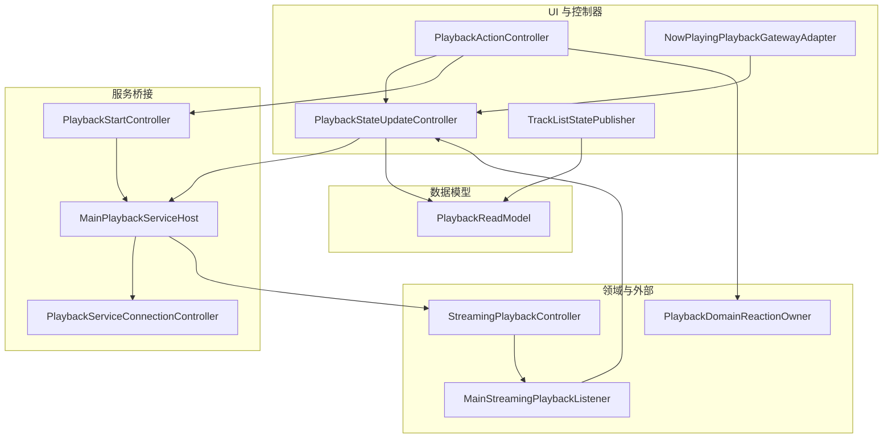
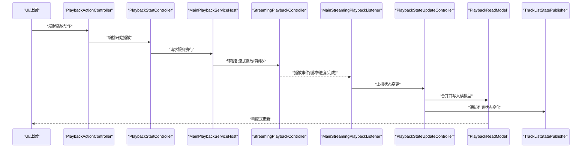
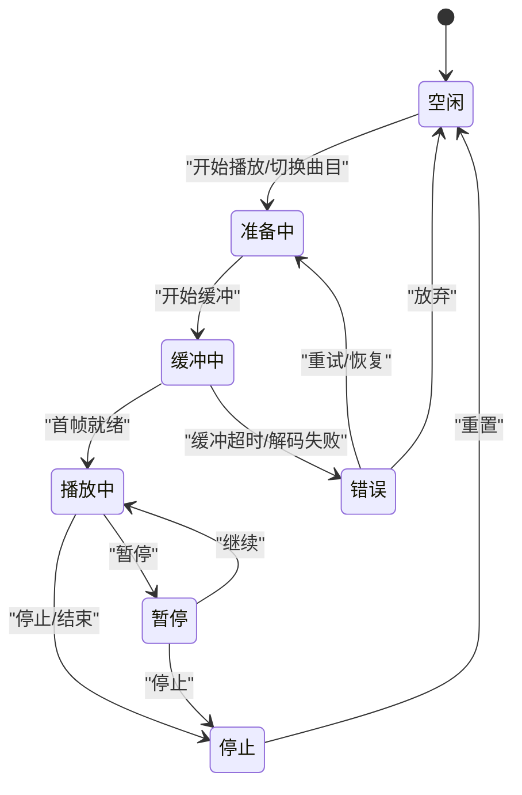
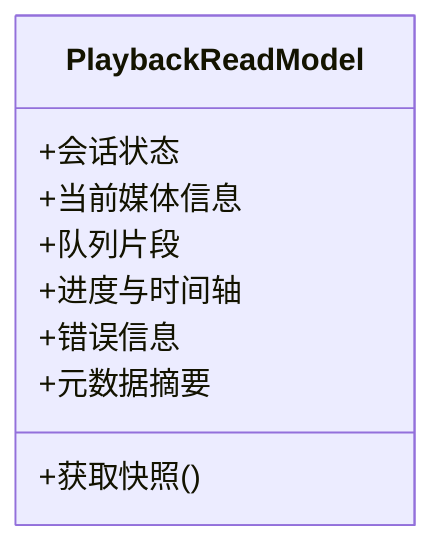
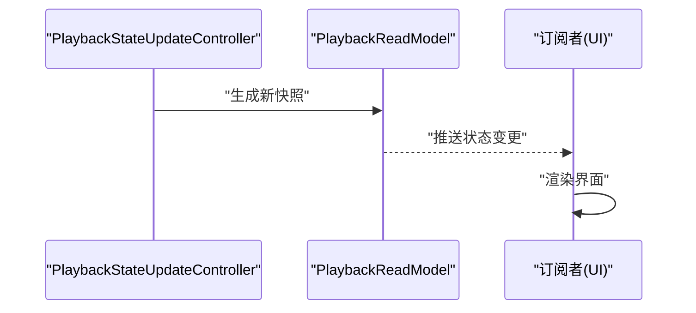
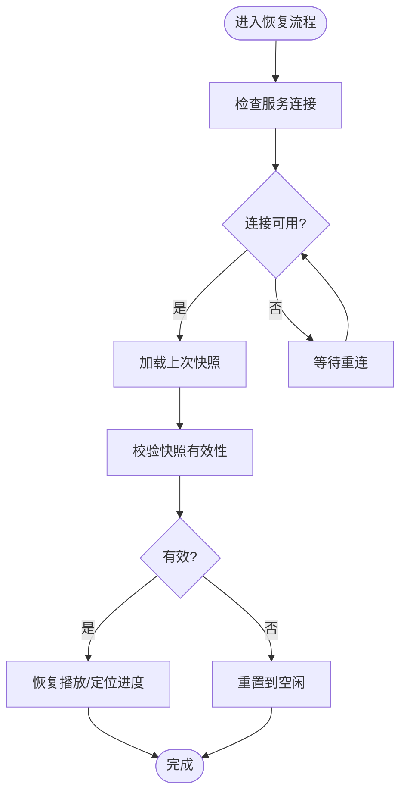
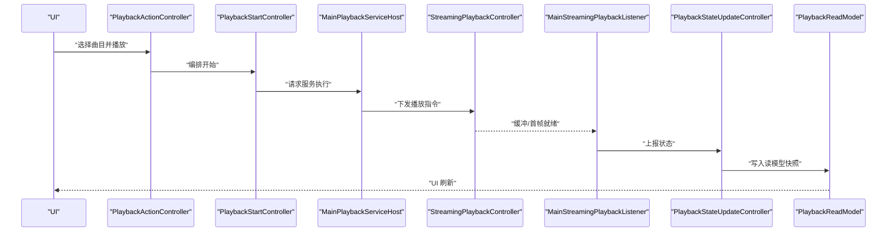
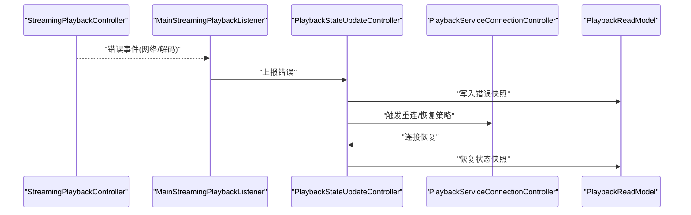
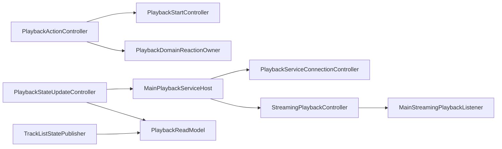

# 播放状态管理

<cite>
**本文引用的文件**   
- [PlaybackReadModel.kt](file://app/src/main/java/app/yukine/playback/PlaybackReadModel.kt)
- [PlaybackStateUpdateController.kt](file://app/src/main/java/app/yukine/PlaybackStateUpdateController.kt)
- [PlaybackActionController.kt](file://app/src/main/java/app/yukine/PlaybackActionController.kt)
- [MainPlaybackServiceHost.kt](file://app/src/main/java/app/yukine/MainPlaybackServiceHost.kt)
- [PlaybackServiceConnectionController.kt](file://app/src/main/java/app/yukine/PlaybackServiceConnectionController.kt)
- [PlaybackStartController.kt](file://app/src/main/java/app/yukine/PlaybackStartController.kt)
- [PlaybackDomainReactionOwner.kt](file://app/src/main/java/app/yukine/PlaybackDomainReactionOwner.kt)
- [TrackListStatePublisher.kt](file://app/src/main/java/app/yukine/TrackListStatePublisher.kt)
- [StreamingPlaybackController.kt](file://app/src/main/java/app/yukine/StreamingPlaybackController.kt)
- [NowPlayingPlaybackGatewayAdapter.kt](file://app/src/main/java/app/yukine/NowPlayingPlaybackGatewayAdapter.kt)
- [MainStreamingPlaybackListener.kt](file://app/src/main/java/app/yukine/MainStreamingPlaybackListener.kt)
- [PlaybackViewModelTest.kt](file://app/src/test/java/app/yukine/playback/PlaybackViewModelTest.kt)
- [PlaybackStateUpdateControllerTest.kt](file://app/src/test/java/app/yukine/PlaybackStateUpdateControllerTest.kt)
- [PlaybackReadModelStateListenerTest.kt](file://app/src/test/java/app/yukine/PlaybackReadModelStateListenerTest.kt)
</cite>

## 目录
1. [简介](#简介)
2. [项目结构](#项目结构)
3. [核心组件](#核心组件)
4. [架构总览](#架构总览)
5. [详细组件分析](#详细组件分析)
6. [依赖关系分析](#依赖关系分析)
7. [性能与并发](#性能与并发)
8. [故障排查指南](#故障排查指南)
9. [结论](#结论)
10. [附录](#附录)

## 简介
本技术文档围绕 Echo Android 的播放状态管理系统，系统性阐述以下主题：
- 播放状态的层次结构与转换规则
- 状态持久化机制、快照与恢复策略
- PlaybackReadModel 数据模型设计
- 状态发布订阅模式与响应式更新
- 播放生命周期、状态快照与恢复流程
- 性能优化、内存泄漏防护与并发安全保证
- 最佳实践与调试技巧

## 项目结构
播放状态管理涉及应用层控制器、服务桥接、领域反应与 UI 发布订阅等模块。关键位置如下：
- app/src/main/java/app/yukine/playback: 播放读模型与测试
- app/src/main/java/app/yukine: 播放控制、服务连接、启动、领域反应、流式监听等
- app/src/test/java/app/yukine/playback: 播放相关单元测试

图表来源
- [PlaybackActionController.kt](file://app/src/main/java/app/yukine/PlaybackActionController.kt)
- [PlaybackStateUpdateController.kt](file://app/src/main/java/app/yukine/PlaybackStateUpdateController.kt)
- [MainPlaybackServiceHost.kt](file://app/src/main/java/app/yukine/MainPlaybackServiceHost.kt)
- [PlaybackServiceConnectionController.kt](file://app/src/main/java/app/yukine/PlaybackServiceConnectionController.kt)
- [PlaybackStartController.kt](file://app/src/main/java/app/yukine/PlaybackStartController.kt)
- [PlaybackDomainReactionOwner.kt](file://app/src/main/java/app/yukine/PlaybackDomainReactionOwner.kt)
- [StreamingPlaybackController.kt](file://app/src/main/java/app/yukine/StreamingPlaybackController.kt)
- [MainStreamingPlaybackListener.kt](file://app/src/main/java/app/yukine/MainStreamingPlaybackListener.kt)
- [PlaybackReadModel.kt](file://app/src/main/java/app/yukine/playback/PlaybackReadModel.kt)
- [TrackListStatePublisher.kt](file://app/src/main/java/app/yukine/TrackListStatePublisher.kt)
- [NowPlayingPlaybackGatewayAdapter.kt](file://app/src/main/java/app/yukine/NowPlayingPlaybackGatewayAdapter.kt)

章节来源
- [PlaybackReadModel.kt](file://app/src/main/java/app/yukine/playback/PlaybackReadModel.kt)
- [PlaybackStateUpdateController.kt](file://app/src/main/java/app/yukine/PlaybackStateUpdateController.kt)
- [PlaybackActionController.kt](file://app/src/main/java/app/yukine/PlaybackActionController.kt)
- [MainPlaybackServiceHost.kt](file://app/src/main/java/app/yukine/MainPlaybackServiceHost.kt)
- [PlaybackServiceConnectionController.kt](file://app/src/main/java/app/yukine/PlaybackServiceConnectionController.kt)
- [PlaybackStartController.kt](file://app/src/main/java/app/yukine/PlaybackStartController.kt)
- [PlaybackDomainReactionOwner.kt](file://app/src/main/java/app/yukine/PlaybackDomainReactionOwner.kt)
- [StreamingPlaybackController.kt](file://app/src/main/java/app/yukine/StreamingPlaybackController.kt)
- [MainStreamingPlaybackListener.kt](file://app/src/main/java/app/yukine/MainStreamingPlaybackListener.kt)
- [TrackListStatePublisher.kt](file://app/src/main/java/app/yukine/TrackListStatePublisher.kt)
- [NowPlayingPlaybackGatewayAdapter.kt](file://app/src/main/java/app/yukine/NowPlayingPlaybackGatewayAdapter.kt)

## 核心组件
- PlaybackReadModel: 播放读模型，承载当前播放态、队列、媒体信息、进度、错误等只读视图数据，供 UI 消费。
- PlaybackStateUpdateController: 统一的状态更新协调器，聚合来自服务回调、业务动作与外部事件的状态变更，并驱动读模型更新。
- PlaybackActionController: 面向上层（如 UI）的播放动作入口，将用户操作转换为领域动作与服务调用。
- MainPlaybackServiceHost: 与后台播放服务的桥接层，负责连接、绑定、转发命令与事件。
- PlaybackServiceConnectionController: 管理服务连接生命周期，处理重连、断线恢复。
- PlaybackStartController: 封装“开始播放”的编排逻辑，包括源解析、预加载、首帧就绪等。
- PlaybackDomainReactionOwner: 对领域事件做出反应（如队列变更、收藏同步），触发状态更新。
- StreamingPlaybackController / MainStreamingPlaybackListener: 流式播放控制器与监听器，负责网络播放的生命周期与事件上报。
- TrackListStatePublisher: 曲目列表状态发布者，向订阅者推送列表变化。
- NowPlayingPlaybackGatewayAdapter: 将“正在播放”网关适配为播放状态更新接口。

章节来源
- [PlaybackReadModel.kt](file://app/src/main/java/app/yukine/playback/PlaybackReadModel.kt)
- [PlaybackStateUpdateController.kt](file://app/src/main/java/app/yukine/PlaybackStateUpdateController.kt)
- [PlaybackActionController.kt](file://app/src/main/java/app/yukine/PlaybackActionController.kt)
- [MainPlaybackServiceHost.kt](file://app/src/main/java/app/yukine/MainPlaybackServiceHost.kt)
- [PlaybackServiceConnectionController.kt](file://app/src/main/java/app/yukine/PlaybackServiceConnectionController.kt)
- [PlaybackStartController.kt](file://app/src/main/java/app/yukine/PlaybackStartController.kt)
- [PlaybackDomainReactionOwner.kt](file://app/src/main/java/app/yukine/PlaybackDomainReactionOwner.kt)
- [StreamingPlaybackController.kt](file://app/src/main/java/app/yukine/StreamingPlaybackController.kt)
- [MainStreamingPlaybackListener.kt](file://app/src/main/java/app/yukine/MainStreamingPlaybackListener.kt)
- [TrackListStatePublisher.kt](file://app/src/main/java/app/yukine/TrackListStatePublisher.kt)
- [NowPlayingPlaybackGatewayAdapter.kt](file://app/src/main/java/app/yukine/NowPlayingPlaybackGatewayAdapter.kt)

## 架构总览
播放状态管理的整体流程遵循“动作 -> 控制器 -> 服务桥接 -> 播放器/流控 -> 事件回调 -> 状态更新 -> 读模型 -> 订阅者”的闭环。

图表来源
- [PlaybackActionController.kt](file://app/src/main/java/app/yukine/PlaybackActionController.kt)
- [PlaybackStartController.kt](file://app/src/main/java/app/yukine/PlaybackStartController.kt)
- [MainPlaybackServiceHost.kt](file://app/src/main/java/app/yukine/MainPlaybackServiceHost.kt)
- [StreamingPlaybackController.kt](file://app/src/main/java/app/yukine/StreamingPlaybackController.kt)
- [MainStreamingPlaybackListener.kt](file://app/src/main/java/app/yukine/MainStreamingPlaybackListener.kt)
- [PlaybackStateUpdateController.kt](file://app/src/main/java/app/yukine/PlaybackStateUpdateController.kt)
- [PlaybackReadModel.kt](file://app/src/main/java/app/yukine/playback/PlaybackReadModel.kt)
- [TrackListStatePublisher.kt](file://app/src/main/java/app/yukine/TrackListStatePublisher.kt)

## 详细组件分析

### 播放状态层次结构与转换规则
- 层次结构
  - 会话级状态：是否已绑定服务、是否处于可播放阶段
  - 播放级状态：空闲、准备中、缓冲中、播放中、暂停、停止、错误
  - 资源级状态：源解析成功/失败、解码器初始化、首帧就绪
  - 队列级状态：当前索引、前后项、循环/随机模式
- 转换规则
  - 从“空闲”进入“准备中”，随后可能进入“缓冲中”，再进入“播放中”或“错误”
  - “播放中”可转入“暂停”，也可因异常进入“错误”；“错误”经重试或恢复后回到“准备中”或“空闲”
  - 队列切换时，先置“准备中”，再按新源重复上述流程
- 边界条件
  - 服务断线：进入“错误”，等待重连；重连成功后尝试恢复
  - 资源不可用：记录错误码，提供降级策略（如切低码率或提示）

章节来源
- [PlaybackStateUpdateController.kt](file://app/src/main/java/app/yukine/PlaybackStateUpdateController.kt)
- [PlaybackReadModel.kt](file://app/src/main/java/app/yukine/playback/PlaybackReadModel.kt)

#### 状态机图

图表来源
- [PlaybackStateUpdateController.kt](file://app/src/main/java/app/yukine/PlaybackStateUpdateController.kt)
- [PlaybackReadModel.kt](file://app/src/main/java/app/yukine/playback/PlaybackReadModel.kt)

### PlaybackReadModel 数据模型设计
- 职责
  - 作为只读视图模型，聚合播放会话、当前媒体、队列、进度、错误、元数据等
  - 对外暴露稳定的读取接口，避免直接修改内部状态
- 设计要点
  - 不可变快照：每次状态更新生成新的快照对象，便于比较与响应式更新
  - 字段最小化：仅包含 UI 所需的最小集合，降低序列化与传输成本
  - 幂等合并：相同状态多次更新不会产生多余刷新
- 典型字段类别
  - 播放状态枚举、当前轨道标识、队列片段、进度时间轴、错误信息、元数据摘要

章节来源
- [PlaybackReadModel.kt](file://app/src/main/java/app/yukine/playback/PlaybackReadModel.kt)

#### 类图

图表来源
- [PlaybackReadModel.kt](file://app/src/main/java/app/yukine/playback/PlaybackReadModel.kt)

### 状态发布订阅模式与响应式更新
- 发布者
  - PlaybackStateUpdateController：汇聚多源事件，计算新状态并产出读模型快照
  - TrackListStatePublisher：专门发布曲目列表状态变化
- 订阅者
  - UI 层通过响应式流观察读模型快照，实现细粒度刷新
- 特性
  - 背压与节流：在高频事件（如进度）场景下合并更新，减少 UI 抖动
  - 去抖与批处理：将短时间内多个状态变更合并为一次快照

章节来源
- [PlaybackStateUpdateController.kt](file://app/src/main/java/app/yukine/PlaybackStateUpdateController.kt)
- [TrackListStatePublisher.kt](file://app/src/main/java/app/yukine/TrackListStatePublisher.kt)

#### 序列图（发布订阅）

图表来源
- [PlaybackStateUpdateController.kt](file://app/src/main/java/app/yukine/PlaybackStateUpdateController.kt)
- [PlaybackReadModel.kt](file://app/src/main/java/app/yukine/playback/PlaybackReadModel.kt)

### 播放生命周期与状态快照/恢复
- 生命周期
  - 启动：动作入口 -> 开始控制器 -> 服务桥接 -> 流控 -> 监听回调 -> 状态更新
  - 运行：进度、缓冲、错误等事件持续上报
  - 退出：停止/销毁 -> 释放资源 -> 清理订阅
- 快照机制
  - 每次状态变更产生不可变快照，保存必要上下文（如当前轨道、队列索引、进度）
- 恢复策略
  - 服务断线：记录最后已知状态，重连后根据策略恢复（继续播放/回退到空闲）
  - 进程重启：从持久化快照恢复最近播放点与队列片段

章节来源
- [PlaybackStartController.kt](file://app/src/main/java/app/yukine/PlaybackStartController.kt)
- [MainPlaybackServiceHost.kt](file://app/src/main/java/app/yukine/MainPlaybackServiceHost.kt)
- [PlaybackServiceConnectionController.kt](file://app/src/main/java/app/yukine/PlaybackServiceConnectionController.kt)
- [PlaybackStateUpdateController.kt](file://app/src/main/java/app/yukine/PlaybackStateUpdateController.kt)

#### 流程图（恢复策略）

图表来源
- [PlaybackServiceConnectionController.kt](file://app/src/main/java/app/yukine/PlaybackServiceConnectionController.kt)
- [PlaybackStateUpdateController.kt](file://app/src/main/java/app/yukine/PlaybackStateUpdateController.kt)

### 关键流程时序

#### 开始播放

图表来源
- [PlaybackActionController.kt](file://app/src/main/java/app/yukine/PlaybackActionController.kt)
- [PlaybackStartController.kt](file://app/src/main/java/app/yukine/PlaybackStartController.kt)
- [MainPlaybackServiceHost.kt](file://app/src/main/java/app/yukine/MainPlaybackServiceHost.kt)
- [StreamingPlaybackController.kt](file://app/src/main/java/app/yukine/StreamingPlaybackController.kt)
- [MainStreamingPlaybackListener.kt](file://app/src/main/java/app/yukine/MainStreamingPlaybackListener.kt)
- [PlaybackStateUpdateController.kt](file://app/src/main/java/app/yukine/PlaybackStateUpdateController.kt)
- [PlaybackReadModel.kt](file://app/src/main/java/app/yukine/playback/PlaybackReadModel.kt)

#### 错误处理与重试

图表来源
- [StreamingPlaybackController.kt](file://app/src/main/java/app/yukine/StreamingPlaybackController.kt)
- [MainStreamingPlaybackListener.kt](file://app/src/main/java/app/yukine/MainStreamingPlaybackListener.kt)
- [PlaybackStateUpdateController.kt](file://app/src/main/java/app/yukine/PlaybackStateUpdateController.kt)
- [PlaybackServiceConnectionController.kt](file://app/src/main/java/app/yukine/PlaybackServiceConnectionController.kt)
- [PlaybackReadModel.kt](file://app/src/main/java/app/yukine/playback/PlaybackReadModel.kt)

## 依赖关系分析
- 耦合度
  - PlaybackActionController 与 PlaybackStartController、PlaybackDomainReactionOwner 存在协作关系
  - PlaybackStateUpdateController 集中依赖服务桥接与监听器，承担状态收敛职责
  - MainPlaybackServiceHost 屏蔽底层服务细节，向上提供稳定接口
- 内聚性
  - 各控制器职责清晰：动作编排、状态更新、服务连接、启动流程分离
- 外部依赖
  - 流式播放控制器与监听器对接网络与解码子系统
  - 读模型与发布订阅机制解耦 UI 与业务

图表来源
- [PlaybackActionController.kt](file://app/src/main/java/app/yukine/PlaybackActionController.kt)
- [PlaybackStartController.kt](file://app/src/main/java/app/yukine/PlaybackStartController.kt)
- [PlaybackDomainReactionOwner.kt](file://app/src/main/java/app/yukine/PlaybackDomainReactionOwner.kt)
- [PlaybackStateUpdateController.kt](file://app/src/main/java/app/yukine/PlaybackStateUpdateController.kt)
- [MainPlaybackServiceHost.kt](file://app/src/main/java/app/yukine/MainPlaybackServiceHost.kt)
- [PlaybackServiceConnectionController.kt](file://app/src/main/java/app/yukine/PlaybackServiceConnectionController.kt)
- [StreamingPlaybackController.kt](file://app/src/main/java/app/yukine/StreamingPlaybackController.kt)
- [MainStreamingPlaybackListener.kt](file://app/src/main/java/app/yukine/MainStreamingPlaybackListener.kt)
- [PlaybackReadModel.kt](file://app/src/main/java/app/yukine/playback/PlaybackReadModel.kt)
- [TrackListStatePublisher.kt](file://app/src/main/java/app/yukine/TrackListStatePublisher.kt)

章节来源
- [PlaybackActionController.kt](file://app/src/main/java/app/yukine/PlaybackActionController.kt)
- [PlaybackStateUpdateController.kt](file://app/src/main/java/app/yukine/PlaybackStateUpdateController.kt)
- [MainPlaybackServiceHost.kt](file://app/src/main/java/app/yukine/MainPlaybackServiceHost.kt)
- [PlaybackServiceConnectionController.kt](file://app/src/main/java/app/yukine/PlaybackServiceConnectionController.kt)
- [PlaybackStartController.kt](file://app/src/main/java/app/yukine/PlaybackStartController.kt)
- [PlaybackDomainReactionOwner.kt](file://app/src/main/java/app/yukine/PlaybackDomainReactionOwner.kt)
- [StreamingPlaybackController.kt](file://app/src/main/java/app/yukine/StreamingPlaybackController.kt)
- [MainStreamingPlaybackListener.kt](file://app/src/main/java/app/yukine/MainStreamingPlaybackListener.kt)
- [PlaybackReadModel.kt](file://app/src/main/java/app/yukine/playback/PlaybackReadModel.kt)
- [TrackListStatePublisher.kt](file://app/src/main/java/app/yukine/TrackListStatePublisher.kt)

## 性能与并发
- 性能优化
  - 状态合并与节流：对高频事件（进度、缓冲百分比）进行合并，减少读模型快照数量
  - 快照裁剪：仅保留 UI 必需字段，避免大对象传播
  - 懒加载元数据：按需拉取封面、歌词等大对象，避免阻塞主线程
- 内存泄漏防护
  - 订阅者在页面销毁时及时取消订阅
  - 使用弱引用或作用域限定持有播放控制器实例
  - 避免在静态单例中强引用 Activity/Fragment
- 并发安全保证
  - 状态更新集中在单一协调器，避免多线程竞态
  - 读模型快照不可变，确保观察者线程安全
  - 服务回调与 UI 更新在不同调度器上执行，防止主线程阻塞

[本节为通用指导，不直接分析具体文件]

## 故障排查指南
- 常见问题
  - 无法开始播放：检查动作入口参数、开始控制器编排逻辑、服务连接状态
  - 频繁缓冲：关注流式控制器缓冲阈值、网络质量、首帧就绪事件
  - 状态不同步：确认状态更新协调器是否正确合并事件、读模型快照是否被正确推送
- 定位方法
  - 在服务桥接层打印关键事件（连接、命令、回调）
  - 在状态更新协调器输出状态转换日志
  - 在订阅端记录快照差异，定位冗余更新
- 参考测试用例
  - 播放状态更新控制器行为验证
  - 播放读模型状态监听器行为验证
  - 播放 ViewModel 集成行为验证

章节来源
- [PlaybackStateUpdateControllerTest.kt](file://app/src/test/java/app/yukine/PlaybackStateUpdateControllerTest.kt)
- [PlaybackReadModelStateListenerTest.kt](file://app/src/test/java/app/yukine/PlaybackReadModelStateListenerTest.kt)
- [PlaybackViewModelTest.kt](file://app/src/test/java/app/yukine/playback/PlaybackViewModelTest.kt)

## 结论
Echo Android 的播放状态管理以“集中协调、不可变快照、发布订阅”为核心，实现了清晰的层次结构与可靠的转换规则。通过服务桥接与监听器解耦底层实现，结合快照与恢复策略保障用户体验的连续性。配合性能优化与并发安全措施，系统具备良好的稳定性与可维护性。

## 附录
- 最佳实践
  - 将复杂编排放入开始控制器，保持动作入口简洁
  - 所有状态变更经由状态更新协调器，避免分散写状态
  - 读模型字段最小化，必要时拆分多个读模型
  - 对高频事件实施节流与合并，避免 UI 抖动
- 调试技巧
  - 启用详细日志，记录状态转换与快照差异
  - 使用测试用例覆盖关键路径（开始、错误、恢复）
  - 在关键节点注入桩对象，隔离外部依赖

[本节为通用指导，不直接分析具体文件]