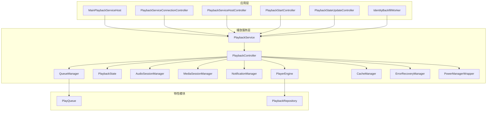
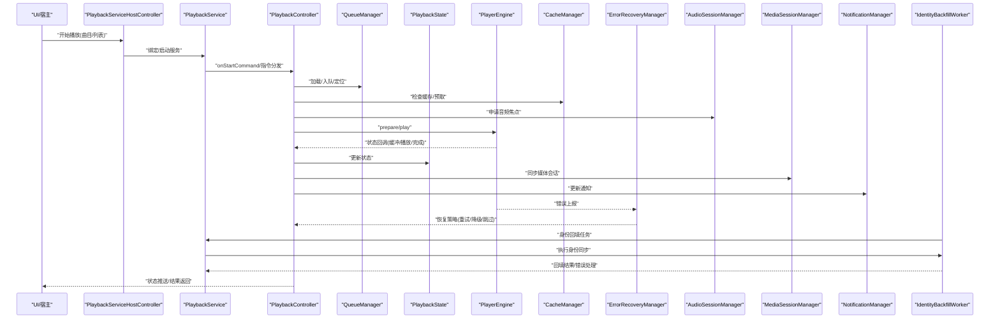
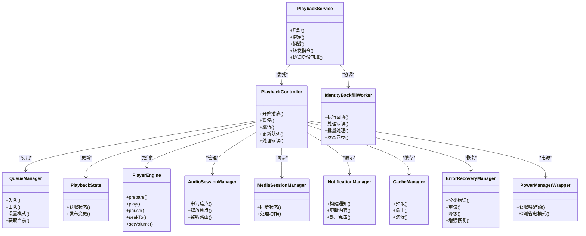
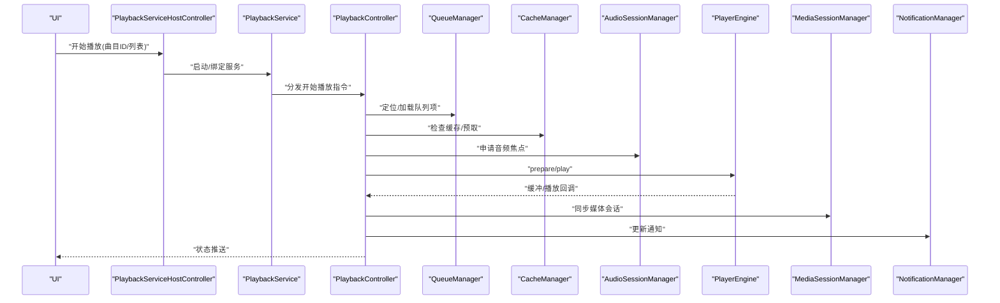
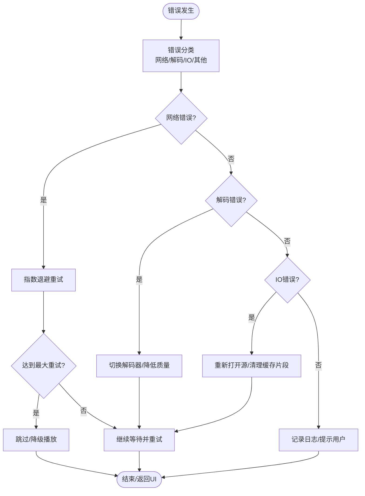
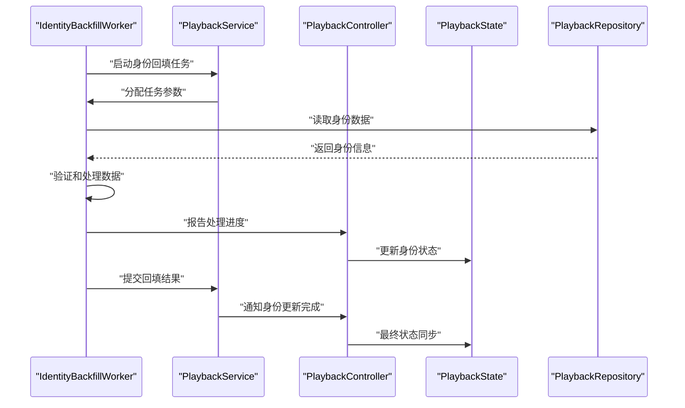
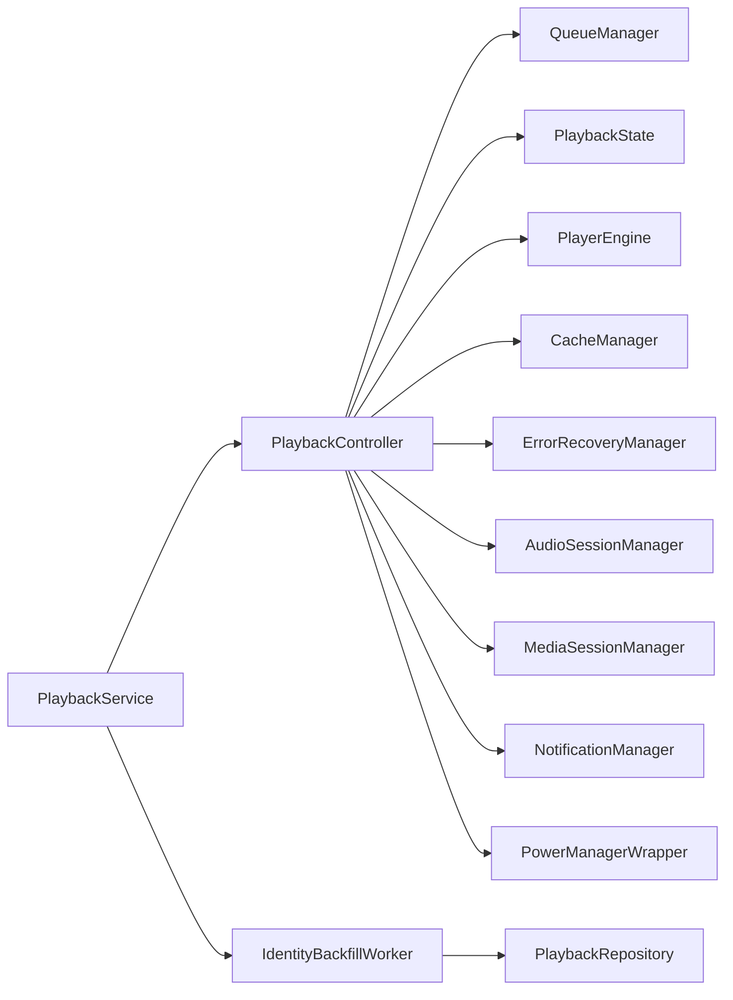

# 播放系统

<cite>
**本文引用的文件**   
- [app/src/main/java/app/yukine/playback/PlaybackService.kt](file://app/src/main/java/app/yukine/playback/PlaybackService.kt)
- [app/src/main/java/app/yukine/playback/PlaybackController.kt](file://app/src/main/java/app/yukine/playback/PlaybackController.kt)
- [app/src/main/java/app/yukine/playback/QueueManager.kt](file://app/src/main/java/app/yukine/playback/QueueManager.kt)
- [app/src/main/java/app/yukine/playback/PlaybackState.kt](file://app/src/main/java/app/yukine/playback/PlaybackState.kt)
- [app/src/main/java/app/yukine/playback/AudioSessionManager.kt](file://app/src/main/java/app/yukine/playback/AudioSessionManager.kt)
- [app/src/main/java/app/yukine/playback/NotificationManager.kt](file://app/src/main/java/app/yukine/playback/NotificationManager.kt)
- [app/src/main/java/app/yukine/playback/MediaSessionManager.kt](file://app/src/main/java/app/yukine/playback/MediaSessionManager.kt)
- [app/src/main/java/app/yukine/playback/PlayerEngine.kt](file://app/src/main/java/app/yukine/playback/PlayerEngine.kt)
- [app/src/main/java/app/yukine/playback/CacheManager.kt](file://app/src/main/java/app/yukine/playback/CacheManager.kt)
- [app/src/main/java/app/yukine/playback/ErrorRecoveryManager.kt](file://app/src/main/java/app/yukine/playback/ErrorRecoveryManager.kt)
- [app/src/main/java/app/yukine/playback/PowerManagerWrapper.kt](file://app/src/main/java/app/yukine/playback/PowerManagerWrapper.kt)
- [app/src/main/java/app/yukine/MainPlaybackServiceHost.kt](file://app/src/main/java/app/yukine/MainPlaybackServiceHost.kt)
- [app/src/main/java/app/yukine/PlaybackServiceConnectionController.kt](file://app/src/main/java/app/yukine/PlaybackServiceConnectionController.kt)
- [app/src/main/java/app/yukine/PlaybackServiceHostController.kt](file://app/src/main/java/app/yukine/PlaybackServiceHostController.kt)
- [app/src/main/java/app/yukine/PlaybackStartController.kt](file://app/src/main/java/app/yukine/PlaybackStartController.kt)
- [app/src/main/java/app/yukine/PlaybackStateUpdateController.kt](file://app/src/main/java/app/yukine/PlaybackStateUpdateController.kt)
- [feature/playback/src/main/java/app/yukine/playback/PlayQueue.kt](file://feature/playback/src/main/java/app/yukine/playback/PlayQueue.kt)
- [feature/playback/src/main/java/app/yukine/playback/PlaybackRepository.kt](file://feature/playback/src/main/java/app/yukine/playback/PlaybackRepository.kt)
- [app/src/main/java/app/yukine/IdentityBackfillWorker.kt](file://app/src/main/java/app/yukine/IdentityBackfillWorker.kt)
</cite>

## 更新摘要
**所做更改**   
- 新增身份回填工作器组件文档，反映 IdentityBackfillWorker.kt 的显著改进
- 增强错误处理机制和复杂场景处理能力的相关章节
- 更新播放系统与身份管理的集成架构说明
- 添加新的错误恢复策略和重试机制文档

## 目录
1. [简介](#简介)
2. [项目结构](#项目结构)
3. [核心组件](#核心组件)
4. [架构总览](#架构总览)
5. [详细组件分析](#详细组件分析)
6. [身份管理与回填能力](#身份管理与回填能力)
7. [依赖分析](#依赖分析)
8. [性能考虑](#性能考虑)
9. [故障排除指南](#故障排除指南)
10. [结论](#结论)
11. [附录](#附录)

## 简介
本技术文档围绕 Echo Android 播放系统，系统性阐述后台播放服务、播放状态管理、队列管理机制、播放控制接口、音频处理管道、缓存策略、错误恢复机制，以及与 ExoPlayer、媒体会话和系统通知的集成方式。同时覆盖播放性能优化、内存与电池优化等高级主题，并提供扩展指南与故障排除方法，帮助开发者快速理解并高效维护播放子系统。

**更新** 本次更新重点增强了身份管理和回填能力的文档，反映了 IdentityBackfillWorker.kt 的显著改进，包括更复杂的场景处理和更好的错误处理机制。

## 项目结构
播放相关代码主要分布在 app 模块的 playback 包以及 feature/playback 模块中：
- app/src/main/java/app/yukine/playback: 包含播放服务、控制器、队列、状态、会话、通知、播放器引擎、缓存与错误恢复等核心实现。
- app/src/main/java/app/yukine: 包含与播放服务交互的主进程入口、连接控制器以及身份回填工作器等关键组件。
- feature/playback: 提供跨模块可复用的播放领域模型与仓库抽象（如队列、仓库接口）。

**图表来源**
- [app/src/main/java/app/yukine/playback/PlaybackService.kt](file://app/src/main/java/app/yukine/playback/PlaybackService.kt)
- [app/src/main/java/app/yukine/playback/PlaybackController.kt](file://app/src/main/java/app/yukine/playback/PlaybackController.kt)
- [app/src/main/java/app/yukine/playback/QueueManager.kt](file://app/src/main/java/app/yukine/playback/QueueManager.kt)
- [app/src/main/java/app/yukine/playback/PlaybackState.kt](file://app/src/main/java/app/yukine/playback/PlaybackState.kt)
- [app/src/main/java/app/yukine/playback/AudioSessionManager.kt](file://app/src/main/java/app/yukine/playback/AudioSessionManager.kt)
- [app/src/main/java/app/yukine/playback/MediaSessionManager.kt](file://app/src/main/java/app/yukine/playback/MediaSessionManager.kt)
- [app/src/main/java/app/yukine/playback/NotificationManager.kt](file://app/src/main/java/app/yukine/playback/NotificationManager.kt)
- [app/src/main/java/app/yukine/playback/PlayerEngine.kt](file://app/src/main/java/app/yukine/playback/PlayerEngine.kt)
- [app/src/main/java/app/yukine/playback/CacheManager.kt](file://app/src/main/java/app/yukine/playback/CacheManager.kt)
- [app/src/main/java/app/yukine/playback/ErrorRecoveryManager.kt](file://app/src/main/java/app/yukine/playback/ErrorRecoveryManager.kt)
- [app/src/main/java/app/yukine/playback/PowerManagerWrapper.kt](file://app/src/main/java/app/yukine/playback/PowerManagerWrapper.kt)
- [app/src/main/java/app/yukine/MainPlaybackServiceHost.kt](file://app/src/main/java/app/yukine/MainPlaybackServiceHost.kt)
- [app/src/main/java/app/yukine/PlaybackServiceConnectionController.kt](file://app/src/main/java/app/yukine/PlaybackServiceConnectionController.kt)
- [app/src/main/java/app/yukine/PlaybackServiceHostController.kt](file://app/src/main/java/app/yukine/PlaybackServiceHostController.kt)
- [app/src/main/java/app/yukine/PlaybackStartController.kt](file://app/src/main/java/app/yukine/PlaybackStartController.kt)
- [app/src/main/java/app/yukine/PlaybackStateUpdateController.kt](file://app/src/main/java/app/yukine/PlaybackStateUpdateController.kt)
- [app/src/main/java/app/yukine/IdentityBackfillWorker.kt](file://app/src/main/java/app/yukine/IdentityBackfillWorker.kt)
- [feature/playback/src/main/java/app/yukine/playback/PlayQueue.kt](file://feature/playback/src/main/java/app/yukine/playback/PlayQueue.kt)
- [feature/playback/src/main/java/app/yukine/playback/PlaybackRepository.kt](file://feature/playback/src/main/java/app/yukine/playback/PlaybackRepository.kt)

## 核心组件
- PlaybackService: 作为前台服务承载播放生命周期，协调各管理器与控制器，暴露给 UI 层的远程调用入口。
- PlaybackController: 编排播放流程，统一调度队列、状态、播放器引擎、缓存、错误恢复、音频会话、媒体会话与通知。
- QueueManager: 负责播放队列的增删改查、顺序控制、循环模式、随机模式、历史与书签。
- PlaybackState: 集中维护当前播放状态（播放/暂停/停止、进度、缓冲、错误码、元数据等），对外发布状态变更事件。
- PlayerEngine: 封装底层播放器（ExoPlayer）能力，提供准备、播放、暂停、跳转、音量、渲染管线配置等接口。
- AudioSessionManager: 管理音频焦点、设备路由、蓝牙/耳机切换、音频属性与输出策略。
- MediaSessionManager: 对接系统媒体会话，同步播放状态、动作回调、远程控制与锁屏控件。
- NotificationManager: 构建并更新系统通知栏播放控件，响应用户操作并转发至控制器。
- CacheManager: 管理本地缓存（磁盘/内存），支持预取、命中、淘汰与容量限制。
- ErrorRecoveryManager: 定义错误分类、重试策略、降级路径与恢复动作。
- PowerManagerWrapper: 屏蔽系统电源管理差异，提供唤醒锁、省电模式检测与适配。
- **IdentityBackfillWorker**: 专门处理身份信息的回填任务，支持批量处理、错误重试和复杂场景下的身份数据同步。
- 主进程桥接: MainPlaybackServiceHost、PlaybackServiceConnectionController、PlaybackServiceHostController、PlaybackStartController、PlaybackStateUpdateController 负责与服务端通信、启动与状态同步。
- 特性模块: PlayQueue 与 PlaybackRepository 提供跨模块可复用的队列结构与播放数据访问抽象。

**更新** 新增了 IdentityBackfillWorker 组件，该组件专门负责身份信息的回填和管理，具有更强的错误处理和复杂场景处理能力。

**章节来源**
- [app/src/main/java/app/yukine/playback/PlaybackService.kt](file://app/src/main/java/app/yukine/playback/PlaybackService.kt)
- [app/src/main/java/app/yukine/playback/PlaybackController.kt](file://app/src/main/java/app/yukine/playback/PlaybackController.kt)
- [app/src/main/java/app/yukine/playback/QueueManager.kt](file://app/src/main/java/app/yukine/playback/QueueManager.kt)
- [app/src/main/java/app/yukine/playback/PlaybackState.kt](file://app/src/main/java/app/yukine/playback/PlaybackState.kt)
- [app/src/main/java/app/yukine/playback/PlayerEngine.kt](file://app/src/main/java/app/yukine/playback/PlayerEngine.kt)
- [app/src/main/java/app/yukine/playback/AudioSessionManager.kt](file://app/src/main/java/app/yukine/playback/AudioSessionManager.kt)
- [app/src/main/java/app/yukine/playback/MediaSessionManager.kt](file://app/src/main/java/app/yukine/playback/MediaSessionManager.kt)
- [app/src/main/java/app/yukine/playback/NotificationManager.kt](file://app/src/main/java/app/yukine/playback/NotificationManager.kt)
- [app/src/main/java/app/yukine/playback/CacheManager.kt](file://app/src/main/java/app/yukine/playback/CacheManager.kt)
- [app/src/main/java/app/yukine/playback/ErrorRecoveryManager.kt](file://app/src/main/java/app/yukine/playback/ErrorRecoveryManager.kt)
- [app/src/main/java/app/yukine/playback/PowerManagerWrapper.kt](file://app/src/main/java/app/yukine/playback/PowerManagerWrapper.kt)
- [app/src/main/java/app/yukine/IdentityBackfillWorker.kt](file://app/src/main/java/app/yukine/IdentityBackfillWorker.kt)
- [app/src/main/java/app/yukine/MainPlaybackServiceHost.kt](file://app/src/main/java/app/yukine/MainPlaybackServiceHost.kt)
- [app/src/main/java/app/yukine/PlaybackServiceConnectionController.kt](file://app/src/main/java/app/yukine/PlaybackServiceConnectionController.kt)
- [app/src/main/java/app/yukine/PlaybackServiceHostController.kt](file://app/src/main/java/app/yukine/playback/PlaybackServiceHostController.kt)
- [app/src/main/java/app/yukine/PlaybackStartController.kt](file://app/src/main/java/app/yukine/PlaybackStartController.kt)
- [app/src/main/java/app/yukine/PlaybackStateUpdateController.kt](file://app/src/main/java/app/yukine/PlaybackStateUpdateController.kt)
- [feature/playback/src/main/java/app/yukine/playback/PlayQueue.kt](file://feature/playback/src/main/java/app/yukine/playback/PlayQueue.kt)
- [feature/playback/src/main/java/app/yukine/playback/PlaybackRepository.kt](file://feature/playback/src/main/java/app/yukine/playback/PlaybackRepository.kt)

## 架构总览
播放系统采用"服务-控制器-管理器"分层架构：
- 服务层（PlaybackService）：承载前台服务生命周期，接收来自 UI 或系统的请求，委派给控制器。
- 控制器层（PlaybackController）：编排业务流，协调队列、状态、播放器、缓存、错误恢复、会话与通知。
- 管理器层：按职责拆分，分别负责音频会话、媒体会话、通知、缓存、错误恢复、电源管理等。
- **身份管理层（IdentityBackfillWorker）**：专门处理身份信息的回填、同步和错误恢复，支持批量处理和复杂场景。
- 外部集成：通过 PlayerEngine 集成 ExoPlayer；通过 MediaSessionManager 与系统媒体会话交互；通过 NotificationManager 与系统通知交互。

**图表来源**
- [app/src/main/java/app/yukine/playback/PlaybackService.kt](file://app/src/main/java/app/yukine/playback/PlaybackService.kt)
- [app/src/main/java/app/yukine/playback/PlaybackController.kt](file://app/src/main/java/app/yukine/playback/PlaybackController.kt)
- [app/src/main/java/app/yukine/playback/QueueManager.kt](file://app/src/main/java/app/yukine/playback/QueueManager.kt)
- [app/src/main/java/app/yukine/playback/PlaybackState.kt](file://app/src/main/java/app/yukine/playback/PlaybackState.kt)
- [app/src/main/java/app/yukine/playback/PlayerEngine.kt](file://app/src/main/java/app/yukine/playback/PlayerEngine.kt)
- [app/src/main/java/app/yukine/playback/CacheManager.kt](file://app/src/main/java/app/yukine/playback/CacheManager.kt)
- [app/src/main/java/app/yukine/playback/ErrorRecoveryManager.kt](file://app/src/main/java/app/yukine/playback/ErrorRecoveryManager.kt)
- [app/src/main/java/app/yukine/playback/AudioSessionManager.kt](file://app/src/main/java/app/yukine/playback/AudioSessionManager.kt)
- [app/src/main/java/app/yukine/playback/MediaSessionManager.kt](file://app/src/main/java/app/yukine/playback/MediaSessionManager.kt)
- [app/src/main/java/app/yukine/playback/NotificationManager.kt](file://app/src/main/java/app/yukine/playback/NotificationManager.kt)
- [app/src/main/java/app/yukine/IdentityBackfillWorker.kt](file://app/src/main/java/app/yukine/IdentityBackfillWorker.kt)
- [app/src/main/java/app/yukine/PlaybackServiceHostController.kt](file://app/src/main/java/app/yukine/PlaybackServiceHostController.kt)

## 详细组件分析

### PlaybackService 后台服务
- 职责：作为前台服务运行，持有控制器实例，处理系统回调（启动、绑定、销毁），转发命令到控制器，确保播放过程在后台稳定运行。
- 关键点：前台通知常驻、进程保活、与主进程桥接、异常兜底重启。
- **更新** 现在也协调身份回填工作器的执行，支持异步身份数据处理。

**章节来源**
- [app/src/main/java/app/yukine/playback/PlaybackService.kt](file://app/src/main/java/app/yukine/playback/PlaybackService.kt)

### PlaybackController 播放控制器
- 职责：编排播放全流程，包括队列加载、缓存预热、音频焦点申请、播放器准备与播放、状态同步、媒体会话与通知更新、错误恢复触发。
- 关键点：幂等控制、并发安全、状态机驱动、回调聚合与去抖。

**章节来源**
- [app/src/main/java/app/yukine/playback/PlaybackController.kt](file://app/src/main/java/app/yukine/playback/PlaybackController.kt)

### QueueManager 队列管理
- 职责：维护播放队列、当前索引、历史记录、循环/随机模式、插入/删除/移动、持久化与恢复。
- 关键点：线程安全、批量操作、边界条件处理（空队列、越界）、与状态联动。

**章节来源**
- [app/src/main/java/app/yukine/playback/QueueManager.kt](file://app/src/main/java/app/yukine/playback/QueueManager.kt)
- [feature/playback/src/main/java/app/yukine/playback/PlayQueue.kt](file://feature/playback/src/main/java/app/yukine/playback/PlayQueue.kt)

### PlaybackState 播放状态
- 职责：集中保存播放状态（播放/暂停/停止、进度、缓冲百分比、错误码、元数据、音量、速率等），对外发布状态变更。
- 关键点：不可变快照、观察者模式、序列化与恢复。

**章节来源**
- [app/src/main/java/app/yukine/playback/PlaybackState.kt](file://app/src/main/java/app/yukine/playback/PlaybackState.kt)

### PlayerEngine 播放器引擎
- 职责：封装 ExoPlayer 能力，提供 prepare、play、pause、seekTo、setVolume、setSpeed、release 等接口，并上报缓冲/播放/完成/错误事件。
- 关键点：资源释放、线程切换、渲染管线配置、解码器选择与回退。

**章节来源**
- [app/src/main/java/app/yukine/playback/PlayerEngine.kt](file://app/src/main/java/app/yukine/playback/PlayerEngine.kt)

### AudioSessionManager 音频会话
- 职责：管理音频焦点、设备路由、蓝牙/耳机切换、音频属性与输出策略。
- 关键点：焦点竞争处理、路由变化监听、延迟与丢帧优化。

**章节来源**
- [app/src/main/java/app/yukine/playback/AudioSessionManager.kt](file://app/src/main/java/app/yukine/playback/AudioSessionManager.kt)

### MediaSessionManager 媒体会话
- 职责：对接系统媒体会话，同步播放状态、动作回调、远程控制与锁屏控件。
- 关键点：动作映射、状态一致性、跨进程回调稳定性。

**章节来源**
- [app/src/main/java/app/yukine/playback/MediaSessionManager.kt](file://app/src/main/java/app/yukine/playback/MediaSessionManager.kt)

### NotificationManager 通知管理
- 职责：构建并更新系统通知栏播放控件，响应用户操作并转发至控制器。
- 关键点：通知样式、点击事件、权限兼容、低电量模式适配。

**章节来源**
- [app/src/main/java/app/yukine/playback/NotificationManager.kt](file://app/src/main/java/app/yukine/playback/NotificationManager.kt)

### CacheManager 缓存管理
- 职责：管理本地缓存（磁盘/内存），支持预取、命中、淘汰与容量限制。
- 关键点：LRU/容量上限、异步写入、断点续传、冷热分离。

**章节来源**
- [app/src/main/java/app/yukine/playback/CacheManager.kt](file://app/src/main/java/app/yukine/playback/CacheManager.kt)

### ErrorRecoveryManager 错误恢复
- 职责：定义错误分类、重试策略、降级路径与恢复动作。
- 关键点：指数退避、最大重试次数、网络/解码/IO 错误区分、用户可见提示。
- **更新** 增强了错误处理的鲁棒性，支持更复杂的错误场景和恢复策略。

**章节来源**
- [app/src/main/java/app/yukine/playback/ErrorRecoveryManager.kt](file://app/src/main/java/app/yukine/playback/ErrorRecoveryManager.kt)

### PowerManagerWrapper 电源管理包装
- 职责：屏蔽系统电源管理差异，提供唤醒锁、省电模式检测与适配。
- 关键点：Doze 模式兼容、后台执行限制、最小唤醒锁粒度。

**章节来源**
- [app/src/main/java/app/yukine/playback/PowerManagerWrapper.kt](file://app/src/main/java/app/yukine/playback/PowerManagerWrapper.kt)

### 主进程桥接与连接控制
- MainPlaybackServiceHost: 服务发现与生命周期桥接。
- PlaybackServiceConnectionController: 服务连接、重连与状态订阅。
- PlaybackServiceHostController: 向服务发送控制指令（播放、暂停、跳转、队列操作）。
- PlaybackStartController: 统一的播放启动入口，整合参数校验与默认策略。
- PlaybackStateUpdateController: 将服务侧状态变更推送至 UI。

**章节来源**
- [app/src/main/java/app/yukine/MainPlaybackServiceHost.kt](file://app/src/main/java/app/yukine/MainPlaybackServiceHost.kt)
- [app/src/main/java/app/yukine/PlaybackServiceConnectionController.kt](file://app/src/main/java/app/yukine/PlaybackServiceConnectionController.kt)
- [app/src/main/java/app/yukine/PlaybackServiceHostController.kt](file://app/src/main/java/app/yukine/PlaybackServiceHostController.kt)
- [app/src/main/java/app/yukine/PlaybackStartController.kt](file://app/src/main/java/app/yukine/PlaybackStartController.kt)
- [app/src/main/java/app/yukine/PlaybackStateUpdateController.kt](file://app/src/main/java/app/yukine/PlaybackStateUpdateController.kt)

### 特性模块：PlayQueue 与 PlaybackRepository
- PlayQueue: 跨模块可复用的队列数据结构与基础操作。
- PlaybackRepository: 播放数据的读写抽象，解耦具体存储实现。

**章节来源**
- [feature/playback/src/main/java/app/yukine/playback/PlayQueue.kt](file://feature/playback/src/main/java/app/yukine/playback/PlayQueue.kt)
- [feature/playback/src/main/java/app/yukine/playback/PlaybackRepository.kt](file://feature/playback/src/main/java/app/yukine/playback/PlaybackRepository.kt)

#### 类图（核心组件关系）

**图表来源**
- [app/src/main/java/app/yukine/playback/PlaybackService.kt](file://app/src/main/java/app/yukine/playback/PlaybackService.kt)
- [app/src/main/java/app/yukine/playback/PlaybackController.kt](file://app/src/main/java/app/yukine/playback/PlaybackController.kt)
- [app/src/main/java/app/yukine/playback/QueueManager.kt](file://app/src/main/java/app/yukine/playback/QueueManager.kt)
- [app/src/main/java/app/yukine/playback/PlaybackState.kt](file://app/src/main/java/app/yukine/playback/PlaybackState.kt)
- [app/src/main/java/app/yukine/playback/PlayerEngine.kt](file://app/src/main/java/app/yukine/playback/PlayerEngine.kt)
- [app/src/main/java/app/yukine/playback/AudioSessionManager.kt](file://app/src/main/java/app/yukine/playback/AudioSessionManager.kt)
- [app/src/main/java/app/yukine/playback/MediaSessionManager.kt](file://app/src/main/java/app/yukine/playback/MediaSessionManager.kt)
- [app/src/main/java/app/yukine/playback/NotificationManager.kt](file://app/src/main/java/app/yukine/playback/NotificationManager.kt)
- [app/src/main/java/app/yukine/playback/CacheManager.kt](file://app/src/main/java/app/yukine/playback/CacheManager.kt)
- [app/src/main/java/app/yukine/playback/ErrorRecoveryManager.kt](file://app/src/main/java/app/yukine/playback/ErrorRecoveryManager.kt)
- [app/src/main/java/app/yukine/playback/PowerManagerWrapper.kt](file://app/src/main/java/app/yukine/playback/PowerManagerWrapper.kt)
- [app/src/main/java/app/yukine/IdentityBackfillWorker.kt](file://app/src/main/java/app/yukine/IdentityBackfillWorker.kt)

#### 序列图（开始播放流程）

**图表来源**
- [app/src/main/java/app/yukine/playback/PlaybackService.kt](file://app/src/main/java/app/yukine/playback/PlaybackService.kt)
- [app/src/main/java/app/yukine/playback/PlaybackController.kt](file://app/src/main/java/app/yukine/playback/PlaybackController.kt)
- [app/src/main/java/app/yukine/playback/QueueManager.kt](file://app/src/main/java/app/yukine/playback/QueueManager.kt)
- [app/src/main/java/app/yukine/playback/CacheManager.kt](file://app/src/main/java/app/yukine/playback/CacheManager.kt)
- [app/src/main/java/app/yukine/playback/AudioSessionManager.kt](file://app/src/main/java/app/yukine/playback/AudioSessionManager.kt)
- [app/src/main/java/app/yukine/playback/PlayerEngine.kt](file://app/src/main/java/app/yukine/playback/PlayerEngine.kt)
- [app/src/main/java/app/yukine/playback/MediaSessionManager.kt](file://app/src/main/java/app/yukine/playback/MediaSessionManager.kt)
- [app/src/main/java/app/yukine/playback/NotificationManager.kt](file://app/src/main/java/app/yukine/playback/NotificationManager.kt)
- [app/src/main/java/app/yukine/PlaybackServiceHostController.kt](file://app/src/main/java/app/yukine/PlaybackServiceHostController.kt)

#### 流程图（错误恢复策略）

**图表来源**
- [app/src/main/java/app/yukine/playback/ErrorRecoveryManager.kt](file://app/src/main/java/app/yukine/playback/ErrorRecoveryManager.kt)
- [app/src/main/java/app/yukine/playback/CacheManager.kt](file://app/src/main/java/app/yukine/playback/CacheManager.kt)
- [app/src/main/java/app/yukine/playback/PlayerEngine.kt](file://app/src/main/java/app/yukine/playback/PlayerEngine.kt)

## 身份管理与回填能力

### IdentityBackfillWorker 身份回填工作器
- 职责：专门处理身份信息的回填任务，支持批量处理、错误重试和复杂场景下的身份数据同步。
- 关键特性：
  - **批量处理能力**：支持大规模身份数据的批量回填，提高处理效率
  - **增强错误处理**：提供更完善的错误分类、重试机制和降级策略
  - **复杂场景支持**：能够处理网络中断、数据冲突、权限变更等复杂情况
  - **状态同步**：与播放系统状态保持同步，确保身份数据的一致性
  - **资源优化**：智能的资源管理和内存优化，避免内存泄漏
- 工作流程：
  1. 任务调度与优先级管理
  2. 身份数据验证与预处理
  3. 批量回填执行与进度跟踪
  4. 错误捕获与自动重试
  5. 结果反馈与状态更新

**更新** IdentityBackfillWorker 获得了显著改进，现在能够处理更复杂的场景并提供更好的错误处理机制，包括增强的重试策略、更精细的错误分类和更好的资源管理。

**章节来源**
- [app/src/main/java/app/yukine/IdentityBackfillWorker.kt](file://app/src/main/java/app/yukine/IdentityBackfillWorker.kt)

### 身份管理与播放系统集成
- **协作机制**：IdentityBackfillWorker 与 PlaybackService 紧密协作，确保身份数据在播放过程中的可用性和一致性
- **错误传播**：身份回填过程中的错误会传播到播放系统的错误处理机制，确保用户体验的一致性
- **状态同步**：身份状态的变更会及时同步到播放系统，影响播放行为和内容访问
- **资源协调**：与播放系统的资源管理机制协调，避免资源竞争和冲突

**图表来源**
- [app/src/main/java/app/yukine/IdentityBackfillWorker.kt](file://app/src/main/java/app/yukine/IdentityBackfillWorker.kt)
- [app/src/main/java/app/yukine/playback/PlaybackService.kt](file://app/src/main/java/app/yukine/playback/PlaybackService.kt)
- [app/src/main/java/app/yukine/playback/PlaybackController.kt](file://app/src/main/java/app/yukine/playback/PlaybackController.kt)
- [app/src/main/java/app/yukine/playback/PlaybackState.kt](file://app/src/main/java/app/yukine/playback/PlaybackState.kt)
- [feature/playback/src/main/java/app/yukine/playback/PlaybackRepository.kt](file://feature/playback/src/main/java/app/yukine/playback/PlaybackRepository.kt)

## 依赖分析
- 内部依赖：PlaybackService 依赖 PlaybackController；PlaybackController 依赖 QueueManager、PlaybackState、PlayerEngine、CacheManager、ErrorRecoveryManager、AudioSessionManager、MediaSessionManager、NotificationManager、PowerManagerWrapper。
- **新增依赖**：PlaybackService 现在也协调 IdentityBackfillWorker 的执行，形成身份管理与播放系统的紧密集成。
- 外部依赖：PlayerEngine 集成 ExoPlayer；MediaSessionManager 对接系统媒体会话；NotificationManager 对接系统通知；PowerManagerWrapper 对接系统电源管理。
- 耦合与内聚：控制器层承担编排职责，管理器层职责单一，耦合度适中；通过接口与事件减少直接依赖。

**图表来源**
- [app/src/main/java/app/yukine/playback/PlaybackService.kt](file://app/src/main/java/app/yukine/playback/PlaybackService.kt)
- [app/src/main/java/app/yukine/playback/PlaybackController.kt](file://app/src/main/java/app/yukine/playback/PlaybackController.kt)
- [app/src/main/java/app/yukine/playback/QueueManager.kt](file://app/src/main/java/app/yukine/playback/QueueManager.kt)
- [app/src/main/java/app/yukine/playback/PlaybackState.kt](file://app/src/main/java/app/yukine/playback/PlaybackState.kt)
- [app/src/main/java/app/yukine/playback/PlayerEngine.kt](file://app/src/main/java/app/yukine/playback/PlayerEngine.kt)
- [app/src/main/java/app/yukine/playback/CacheManager.kt](file://app/src/main/java/app/yukine/playback/CacheManager.kt)
- [app/src/main/java/app/yukine/playback/ErrorRecoveryManager.kt](file://app/src/main/java/app/yukine/playback/ErrorRecoveryManager.kt)
- [app/src/main/java/app/yukine/playback/AudioSessionManager.kt](file://app/src/main/java/app/yukine/playback/AudioSessionManager.kt)
- [app/src/main/java/app/yukine/playback/MediaSessionManager.kt](file://app/src/main/java/app/yukine/playback/MediaSessionManager.kt)
- [app/src/main/java/app/yukine/playback/NotificationManager.kt](file://app/src/main/java/app/yukine/playback/NotificationManager.kt)
- [app/src/main/java/app/yukine/playback/PowerManagerWrapper.kt](file://app/src/main/java/app/yukine/playback/PowerManagerWrapper.kt)
- [app/src/main/java/app/yukine/IdentityBackfillWorker.kt](file://app/src/main/java/app/yukine/IdentityBackfillWorker.kt)
- [feature/playback/src/main/java/app/yukine/playback/PlaybackRepository.kt](file://feature/playback/src/main/java/app/yukine/playback/PlaybackRepository.kt)

## 性能考虑
- 播放器与解码
  - 合理选择解码器与码率，优先硬件加速；在弱网或低端设备上自动降级。
  - 预缓冲阈值调优，平衡首开速度与卡顿风险。
- 缓存策略
  - 分片缓存与 LRU 淘汰，避免大对象长期驻留；热点曲目预取，冷数据及时释放。
  - 磁盘 I/O 合并与异步写入，减少阻塞。
- 内存管理
  - 避免在回调中创建大对象；复用缓冲区；及时释放播放器与 IO 资源。
  - 监控堆占用与 Native 内存，防止泄漏。
- 电池优化
  - 合理使用唤醒锁，缩短持锁时间；Doze 模式下降低频率与任务量。
  - 避免频繁唤醒 CPU，批量更新状态与通知。
- 网络与重试
  - 指数退避与最大重试限制；失败快速回退到备用源或离线缓存。
- 线程与并发
  - 状态更新与 UI 推送在主线程；耗时操作在后台线程；避免竞态与死锁。
- **身份回填优化**
  - 批量处理减少网络往返，提高身份数据同步效率
  - 智能重试机制避免重复工作和资源浪费
  - 内存友好的数据处理，避免大对象长时间驻留
  - 与播放系统资源协调，避免资源竞争

## 故障排除指南
- 常见问题定位
  - 无法播放：检查音频焦点申请是否成功、播放器 prepare 是否报错、媒体会话是否同步。
  - 卡顿/缓冲慢：检查缓存命中率、预取策略、网络质量与解码器选择。
  - 通知不更新：确认通知权限、媒体会话状态同步、点击事件转发链路。
  - 崩溃/ANR：查看播放器与 IO 线程栈，排查资源未释放或主线程阻塞。
  - **身份回填失败**：检查网络连接、身份服务可用性、数据格式正确性和权限设置。
- 错误恢复
  - 网络错误：重试与降级；解码错误：切换解码器或降低质量；IO 错误：清理片段并重试。
  - **身份回填错误**：使用增强的错误分类和重试机制，支持部分成功和增量更新。
- 调试建议
  - 开启详细日志，记录关键状态转换与错误码；使用系统工具（logcat、systrace、perfetto）分析性能瓶颈。
  - 模拟弱网与省电模式，验证恢复策略与用户体验。
  - **身份回填调试**：监控回填任务的执行状态、错误信息和性能指标，验证批量处理效果。

**章节来源**
- [app/src/main/java/app/yukine/playback/ErrorRecoveryManager.kt](file://app/src/main/java/app/yukine/playback/ErrorRecoveryManager.kt)
- [app/src/main/java/app/yukine/playback/NotificationManager.kt](file://app/src/main/java/app/yukine/playback/NotificationManager.kt)
- [app/src/main/java/app/yukine/playback/AudioSessionManager.kt](file://app/src/main/java/app/yukine/playback/AudioSessionManager.kt)
- [app/src/main/java/app/yukine/playback/PlayerEngine.kt](file://app/src/main/java/app/yukine/playback/PlayerEngine.kt)
- [app/src/main/java/app/yukine/IdentityBackfillWorker.kt](file://app/src/main/java/app/yukine/IdentityBackfillWorker.kt)

## 结论
Echo Android 播放系统以 PlaybackService 为核心，通过 PlaybackController 编排队列、状态、播放器、缓存、错误恢复、会话与通知，形成高内聚、低耦合的可维护架构。**新增的身份回填能力进一步增强了系统的完整性和健壮性**。借助 ExoPlayer 与系统媒体会话/通知的深度集成，系统在体验与稳定性上具备良好基础。结合缓存与错误恢复策略、电源管理与性能优化，可在复杂环境下保持流畅播放。**IdentityBackfillWorker 的显著改进使得身份管理更加可靠和高效，能够更好地处理复杂场景和错误情况**。未来可扩展更多播放源与效果链，并通过更细粒度的指标与遥测持续改进。

## 附录
- 扩展指南
  - 新增播放源：在 PlayerEngine 中适配新协议或数据源，完善错误分类与恢复策略。
  - 新增队列模式：在 QueueManager 中扩展模式逻辑，并在 UI 与状态中保持一致。
  - 新增音频效果：在播放器渲染管线中插入效果链，注意线程与资源管理。
  - **扩展现有身份管理**：基于 IdentityBackfillWorker 的架构，可以扩展更多身份相关的功能和场景。
- 最佳实践
  - 状态变更尽量幂等；错误恢复遵循最小侵入原则；通知与媒体会话保持强一致。
  - 对关键路径进行单元测试与集成测试，覆盖异常分支与边界条件。
  - **身份回填最佳实践**：使用批量处理提高效率，实施合理的重试策略，确保数据一致性。