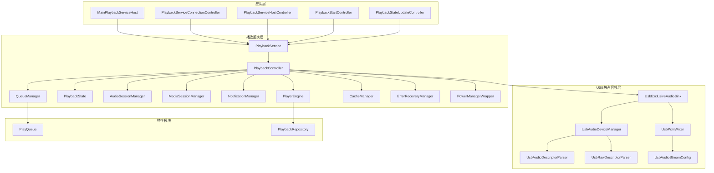
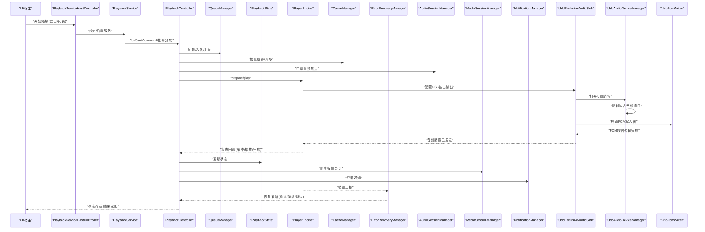
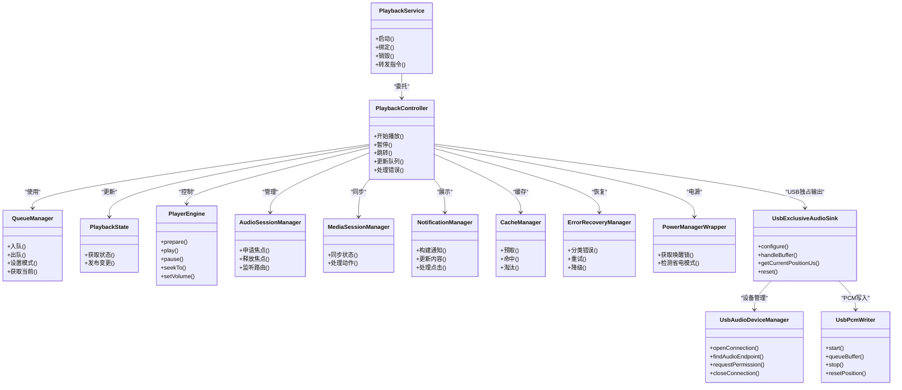
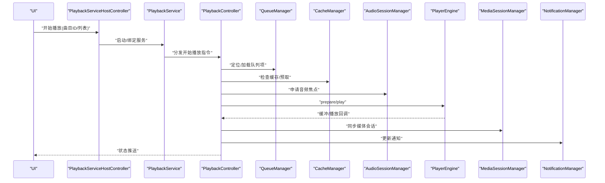
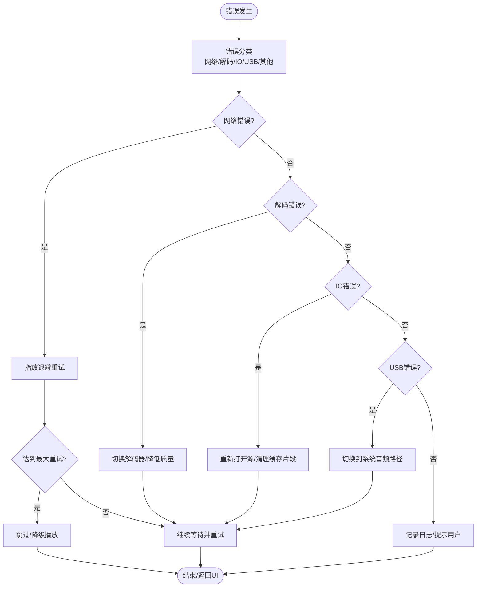
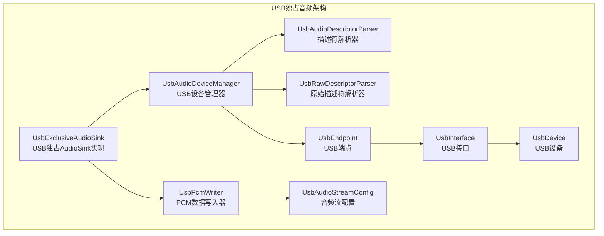
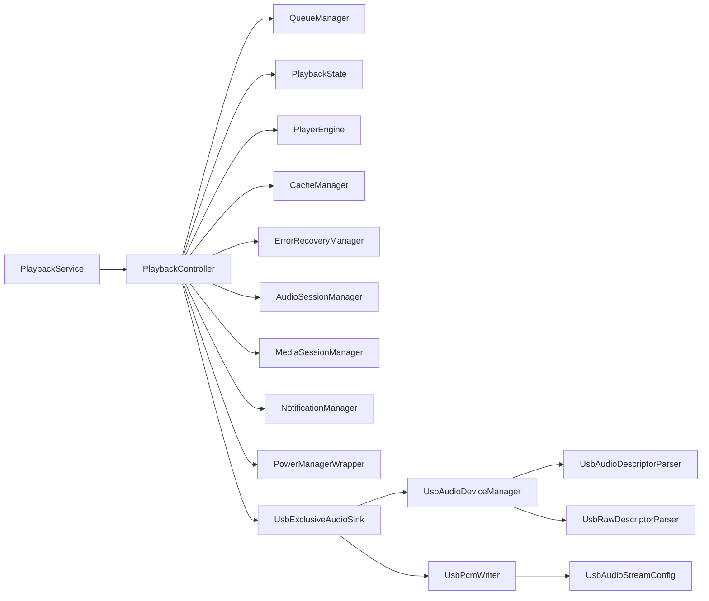

# 播放系统

<cite>
**本文引用的文件**   
- [app/src/main/java/app/yukine/playback/PlaybackService.kt](file://app/src/main/java/app/yukine/playback/PlaybackService.kt)
- [app/src/main/java/app/yukine/playback/PlaybackController.kt](file://app/src/main/java/app/yukine/playback/PlaybackController.kt)
- [app/src/main/java/app/yukine/playback/QueueManager.kt](file://app/src/main/java/app/yukine/playback/QueueManager.kt)
- [app/src/main/java/app/yukine/playback/PlaybackState.kt](file://app/src/main/java/app/yukine/playback/PlaybackState.kt)
- [app/src/main/java/app/yukine/playback/AudioSessionManager.kt](file://app/src/main/java/app/yukine/playback/AudioSessionManager.kt)
- [app/src/main/java/app/yukine/playback/NotificationManager.kt](file://app/src/main/java/app/yukine/playback/NotificationManager.kt)
- [app/src/main/java/app/yukine/playback/MediaSessionManager.kt](file://app/src/main/java/app/yukine/playback/MediaSessionManager.kt)
- [app/src/main/java/app/yukine/playback/PlayerEngine.kt](file://app/src/main/java/app/yukine/playback/PlayerEngine.kt)
- [app/src/main/java/app/yukine/playback/CacheManager.kt](file://app/src/main/java/app/yukine/playback/CacheManager.kt)
- [app/src/main/java/app/yukine/playback/ErrorRecoveryManager.kt](file://app/src/main/java/app/yukine/playback/ErrorRecoveryManager.kt)
- [app/src/main/java/app/yukine/playback/PowerManagerWrapper.kt](file://app/src/main/java/app/yukine/playback/PowerManagerWrapper.kt)
- [app/src/main/java/app/yukine/MainPlaybackServiceHost.kt](file://app/src/main/java/app/yukine/MainPlaybackServiceHost.kt)
- [app/src/main/java/app/yukine/PlaybackServiceConnectionController.kt](file://app/src/main/java/app/yukine/PlaybackServiceConnectionController.kt)
- [app/src/main/java/app/yukine/PlaybackServiceHostController.kt](file://app/src/main/java/app/yukine/PlaybackServiceHostController.kt)
- [app/src/main/java/app/yukine/PlaybackStartController.kt](file://app/src/main/java/app/yukine/PlaybackStartController.kt)
- [app/src/main/java/app/yukine/PlaybackStateUpdateController.kt](file://app/src/main/java/app/yukine/PlaybackStateUpdateController.kt)
- [feature/playback/src/main/java/app/yukine/playback/PlayQueue.kt](file://feature/playback/src/main/java/app/yukine/playback/PlayQueue.kt)
- [feature/playback/src/main/java/app/yukine/playback/PlaybackRepository.kt](file://feature/playback/src/main/java/app/yukine/playback/PlaybackRepository.kt)
- [feature/playback/src/main/java/app/yukine/playback/usb/UsbAudioDeviceManager.kt](file://feature/playback/src/main/java/app/yukine/playback/usb/UsbAudioDeviceManager.kt)
- [feature/playback/src/main/java/app/yukine/playback/usb/UsbPcmWriter.kt](file://feature/playback/src/main/java/app/yukine/playback/usb/UsbPcmWriter.kt)
- [feature/playback/src/main/java/app/yukine/playback/usb/UsbExclusiveAudioSink.kt](file://feature/playback/src/main/java/app/yukine/playback/usb/UsbExclusiveAudioSink.kt)
- [feature/playback/src/main/java/app/yukine/playback/usb/UsbAudioDescriptorParser.kt](file://feature/playback/src/main/java/app/yukine/playback/usb/UsbAudioDescriptorParser.kt)
- [feature/playback/src/main/java/app/yukine/playback/usb/UsbRawDescriptorParser.kt](file://feature/playback/src/main/java/app/yukine/playback/usb/UsbRawDescriptorParser.kt)
- [feature/playback/src/main/java/app/yukine/playback/usb/UsbAudioStreamConfig.kt](file://feature/playback/src/main/java/app/yukine/playback/usb/UsbAudioStreamConfig.kt)
- [feature/playback/src/main/java/app/yukine/playback/manager/PlaybackPlayerFactory.kt](file://feature/playback/src/main/java/app/yukine/playback/manager/PlaybackPlayerFactory.kt)
- [feature/playback/src/main/java/app/yukine/playback/manager/AudioOutputModeResolver.kt](file://feature/playback/src/main/java/app/yukine/playback/manager/AudioOutputModeResolver.kt)
</cite>

## 更新摘要
**变更内容**   
- 新增USB独占音频实现章节，详细说明UsbAudioDeviceManager、UsbPcmWriter、UsbExclusiveAudioSink等核心组件
- 更新播放器工厂和输出模式解析器，集成USB独占音频支持
- 扩展架构总览图，展示USB音频路径与传统音频路径的区别
- 增强性能考虑部分，包含USB独占模式的优化策略

## 目录
1. [简介](#简介)
2. [项目结构](#项目结构)
3. [核心组件](#核心组件)
4. [架构总览](#架构总览)
5. [详细组件分析](#详细组件分析)
6. [USB独占音频实现](#usb独占音频实现)
7. [依赖分析](#依赖分析)
8. [性能考虑](#性能考虑)
9. [故障排除指南](#故障排除指南)
10. [结论](#结论)
11. [附录](#附录)

## 简介
本技术文档围绕 Echo Android 播放系统，系统性阐述后台播放服务、播放状态管理、队列管理机制、播放控制接口、音频处理管道、缓存策略、错误恢复机制，以及与 ExoPlayer、媒体会话和系统通知的集成方式。特别新增了USB独占音频实现，支持直接通过USB Host API与外部DAC通信，完全绕过Android AudioFlinger，实现真正的比特完美输出。同时覆盖播放性能优化、内存与电池优化等高级主题，并提供扩展指南与故障排除方法，帮助开发者快速理解并高效维护播放子系统。

## 项目结构
播放相关代码主要分布在 app 模块的 playback 包以及 feature/playback 模块中：
- app/src/main/java/app/yukine/playback: 包含播放服务、控制器、队列、状态、会话、通知、播放器引擎、缓存与错误恢复等核心实现。
- app/src/main/java/app/yukine: 包含与播放服务交互的主进程入口与连接控制器。
- feature/playback: 提供跨模块可复用的播放领域模型与仓库抽象（如队列、仓库接口），以及新增的USB独占音频实现。
- USB音频模块: 位于feature/playback/src/main/java/app/yukine/playback/usb，包含USB设备管理、PCM写入、独占音频输出等核心功能。

**图表来源**
- [app/src/main/java/app/yukine/playback/PlaybackService.kt](file://app/src/main/java/app/yukine/playback/PlaybackService.kt)
- [app/src/main/java/app/yukine/playback/PlaybackController.kt](file://app/src/main/java/app/yukine/playback/PlaybackController.kt)
- [feature/playback/src/main/java/app/yukine/playback/usb/UsbAudioDeviceManager.kt](file://feature/playback/src/main/java/app/yukine/playback/usb/UsbAudioDeviceManager.kt)
- [feature/playback/src/main/java/app/yukine/playback/usb/UsbPcmWriter.kt](file://feature/playback/src/main/java/app/yukine/playback/usb/UsbPcmWriter.kt)
- [feature/playback/src/main/java/app/yukine/playback/usb/UsbExclusiveAudioSink.kt](file://feature/playback/src/main/java/app/yukine/playback/usb/UsbExclusiveAudioSink.kt)

## 核心组件
- PlaybackService: 作为前台服务承载播放生命周期，协调各管理器与控制器，暴露给 UI 层的远程调用入口。
- PlaybackController: 编排播放流程，统一调度队列、状态、播放器引擎、缓存、错误恢复、音频会话、媒体会话与通知。
- QueueManager: 负责播放队列的增删改查、顺序控制、循环模式、随机模式、历史与书签。
- PlaybackState: 集中维护当前播放状态（播放/暂停/停止、进度、缓冲、错误码、元数据等），对外发布状态变更事件。
- PlayerEngine: 封装底层播放器（ExoPlayer）能力，提供准备、播放、暂停、跳转、音量、渲染管线配置等接口。
- AudioSessionManager: 管理音频焦点、设备路由、蓝牙/耳机切换、音频属性与输出策略。
- MediaSessionManager: 对接系统媒体会话，同步播放状态、动作回调、远程控制与锁屏控件。
- NotificationManager: 构建并更新系统通知栏播放控件，响应用户操作并转发至控制器。
- CacheManager: 管理本地缓存（磁盘/内存），支持预取、命中、淘汰与容量限制。
- ErrorRecoveryManager: 定义错误分类、重试策略、降级路径与恢复动作。
- PowerManagerWrapper: 屏蔽系统电源管理差异，提供唤醒锁、省电模式检测与适配。
- **新增** UsbAudioDeviceManager: 管理USB音频设备的发现、权限请求和连接生命周期，支持强制独占所有音频接口。
- **新增** UsbPcmWriter: 专用写入线程，通过批量传输将PCM音频数据发送到USB DAC。
- **新增** UsbExclusiveAudioSink: USB独占AudioSink，强制占用所有USB音频接口，直接将PCM写入USB DAC端点，完全绕过AudioFlinger。
- **新增** UsbAudioDescriptorParser: 解析USB音频类描述符，查找适合比特完美PCM输出的音频流端点。
- **新增** UsbRawDescriptorParser: 解析原始USB配置描述符，通过反射创建UsbEndpoint对象，绕过Android API限制。
- **新增** UsbAudioStreamConfig: USB音频流配置数据结构，包含端点地址、采样率、位深度、通道数等信息。
- 主进程桥接: MainPlaybackServiceHost、PlaybackServiceConnectionController、PlaybackServiceHostController、PlaybackStartController、PlaybackStateUpdateController 负责与服务端通信、启动与状态同步。
- 特性模块: PlayQueue 与 PlaybackRepository 提供跨模块可复用的队列结构与播放数据访问抽象。

**章节来源**
- [app/src/main/java/app/yukine/playback/PlaybackService.kt](file://app/src/main/java/app/yukine/playback/PlaybackService.kt)
- [app/src/main/java/app/yukine/playback/PlaybackController.kt](file://app/src/main/java/app/yukine/playback/PlaybackController.kt)
- [feature/playback/src/main/java/app/yukine/playback/usb/UsbAudioDeviceManager.kt](file://feature/playback/src/main/java/app/yukine/playback/usb/UsbAudioDeviceManager.kt)
- [feature/playback/src/main/java/app/yukine/playback/usb/UsbPcmWriter.kt](file://feature/playback/src/main/java/app/yukine/playback/usb/UsbPcmWriter.kt)
- [feature/playback/src/main/java/app/yukine/playback/usb/UsbExclusiveAudioSink.kt](file://feature/playback/src/main/java/app/yukine/playback/usb/UsbExclusiveAudioSink.kt)

## 架构总览
播放系统采用"服务-控制器-管理器"分层架构，现已扩展支持USB独占音频输出路径：
- 服务层（PlaybackService）：承载前台服务生命周期，接收来自 UI 或系统的请求，委派给控制器。
- 控制器层（PlaybackController）：编排业务流，协调队列、状态、播放器、缓存、错误恢复、会话与通知。
- 管理器层：按职责拆分，分别负责音频会话、媒体会话、通知、缓存、错误恢复、电源管理等。
- **新增** USB独占音频层：专门处理USB音频设备管理、PCM数据写入和独占音频输出。
- 外部集成：通过 PlayerEngine 集成 ExoPlayer；通过 MediaSessionManager 与系统媒体会话交互；通过 NotificationManager 与系统通知交互。

**图表来源**
- [app/src/main/java/app/yukine/playback/PlaybackService.kt](file://app/src/main/java/app/yukine/playback/PlaybackService.kt)
- [app/src/main/java/app/yukine/playback/PlaybackController.kt](file://app/src/main/java/app/yukine/playback/PlaybackController.kt)
- [feature/playback/src/main/java/app/yukine/playback/usb/UsbExclusiveAudioSink.kt](file://feature/playback/src/main/java/app/yukine/playback/usb/UsbExclusiveAudioSink.kt)
- [feature/playback/src/main/java/app/yukine/playback/usb/UsbAudioDeviceManager.kt](file://feature/playback/src/main/java/app/yukine/playback/usb/UsbAudioDeviceManager.kt)
- [feature/playback/src/main/java/app/yukine/playback/usb/UsbPcmWriter.kt](file://feature/playback/src/main/java/app/yukine/playback/usb/UsbPcmWriter.kt)

## 详细组件分析

### PlaybackService 后台服务
- 职责：作为前台服务运行，持有控制器实例，处理系统回调（启动、绑定、销毁），转发命令到控制器，确保播放过程在后台稳定运行。
- 关键点：前台通知常驻、进程保活、与主进程桥接、异常兜底重启。

**章节来源**
- [app/src/main/java/app/yukine/playback/PlaybackService.kt](file://app/src/main/java/app/yukine/playback/PlaybackService.kt)

### PlaybackController 播放控制器
- 职责：编排播放全流程，包括队列加载、缓存预热、音频焦点申请、播放器准备与播放、状态同步、媒体会话与通知更新、错误恢复触发。
- 关键点：幂等控制、并发安全、状态机驱动、回调聚合与去抖。

**章节来源**
- [app/src/main/java/app/yukine/playback/PlaybackController.kt](file://app/src/main/java/app/yukine/playback/PlaybackController.kt)

### QueueManager 队列管理
- 职责：维护播放队列、当前索引、历史记录、循环/随机模式、插入/删除/移动、持久化与恢复。
- 关键点：线程安全、批量操作、边界条件处理（空队列、越界）、与状态联动。

**章节来源**
- [app/src/main/java/app/yukine/playback/QueueManager.kt](file://app/src/main/java/app/yukine/playback/QueueManager.kt)
- [feature/playback/src/main/java/app/yukine/playback/PlayQueue.kt](file://feature/playback/src/main/java/app/yukine/playback/PlayQueue.kt)

### PlaybackState 播放状态
- 职责：集中保存播放状态（播放/暂停/停止、进度、缓冲百分比、错误码、元数据、音量、速率等），对外发布状态变更。
- 关键点：不可变快照、观察者模式、序列化与恢复。

**章节来源**
- [app/src/main/java/app/yukine/playback/PlaybackState.kt](file://app/src/main/java/app/yukine/playback/PlaybackState.kt)

### PlayerEngine 播放器引擎
- 职责：封装 ExoPlayer 能力，提供 prepare、play、pause、seekTo、setVolume、setSpeed、release 等接口，并上报缓冲/播放/完成/错误事件。
- 关键点：资源释放、线程切换、渲染管线配置、解码器选择与回退。

**章节来源**
- [app/src/main/java/app/yukine/playback/PlayerEngine.kt](file://app/src/main/java/app/yukine/playback/PlayerEngine.kt)

### AudioSessionManager 音频会话
- 职责：管理音频焦点、设备路由、蓝牙/耳机切换、音频属性与输出策略。
- 关键点：焦点竞争处理、路由变化监听、延迟与丢帧优化。

**章节来源**
- [app/src/main/java/app/yukine/playback/AudioSessionManager.kt](file://app/src/main/java/app/yukine/playback/AudioSessionManager.kt)

### MediaSessionManager 媒体会话
- 职责：对接系统媒体会话，同步播放状态、动作回调、远程控制与锁屏控件。
- 关键点：动作映射、状态一致性、跨进程回调稳定性。

**章节来源**
- [app/src/main/java/app/yukine/playback/MediaSessionManager.kt](file://app/src/main/java/app/yukine/playback/MediaSessionManager.kt)

### NotificationManager 通知管理
- 职责：构建并更新系统通知栏播放控件，响应用户操作并转发至控制器。
- 关键点：通知样式、点击事件、权限兼容、低电量模式适配。

**章节来源**
- [app/src/main/java/app/yukine/playback/NotificationManager.kt](file://app/src/main/java/app/yukine/playback/NotificationManager.kt)

### CacheManager 缓存管理
- 职责：管理本地缓存（磁盘/内存），支持预取、命中、淘汰与容量限制。
- 关键点：LRU/容量上限、异步写入、断点续传、冷热分离。

**章节来源**
- [app/src/main/java/app/yukine/playback/CacheManager.kt](file://app/src/main/java/app/yukine/playback/CacheManager.kt)

### ErrorRecoveryManager 错误恢复
- 职责：定义错误分类、重试策略、降级路径与恢复动作。
- 关键点：指数退避、最大重试次数、网络/解码/IO 错误区分、用户可见提示。

**章节来源**
- [app/src/main/java/app/yukine/playback/ErrorRecoveryManager.kt](file://app/src/main/java/app/yukine/playback/ErrorRecoveryManager.kt)

### PowerManagerWrapper 电源管理包装
- 职责：屏蔽系统电源管理差异，提供唤醒锁、省电模式检测与适配。
- 关键点：Doze 模式兼容、后台执行限制、最小唤醒锁粒度。

**章节来源**
- [app/src/main/java/app/yukine/playback/PowerManagerWrapper.kt](file://app/src/main/java/app/yukine/playback/PowerManagerWrapper.kt)

### 主进程桥接与连接控制
- MainPlaybackServiceHost: 服务发现与生命周期桥接。
- PlaybackServiceConnectionController: 服务连接、重连与状态订阅。
- PlaybackServiceHostController: 向服务发送控制指令（播放、暂停、跳转、队列操作）。
- PlaybackStartController: 统一的播放启动入口，整合参数校验与默认策略。
- PlaybackStateUpdateController: 将服务侧状态变更推送至 UI。

**章节来源**
- [app/src/main/java/app/yukine/MainPlaybackServiceHost.kt](file://app/src/main/java/app/yukine/MainPlaybackServiceHost.kt)
- [app/src/main/java/app/yukine/PlaybackServiceConnectionController.kt](file://app/src/main/java/app/yukine/PlaybackServiceConnectionController.kt)
- [app/src/main/java/app/yukine/PlaybackServiceHostController.kt](file://app/src/main/java/app/yukine/PlaybackServiceHostController.kt)
- [app/src/main/java/app/yukine/PlaybackStartController.kt](file://app/src/main/java/app/yukine/PlaybackStartController.kt)
- [app/src/main/java/app/yukine/PlaybackStateUpdateController.kt](file://app/src/main/java/app/yukine/PlaybackStateUpdateController.kt)

### 特性模块：PlayQueue 与 PlaybackRepository
- PlayQueue: 跨模块可复用的队列数据结构与基础操作。
- PlaybackRepository: 播放数据的读写抽象，解耦具体存储实现。

**章节来源**
- [feature/playback/src/main/java/app/yukine/playback/PlayQueue.kt](file://feature/playback/src/main/java/app/yukine/playback/PlayQueue.kt)
- [feature/playback/src/main/java/app/yukine/playback/PlaybackRepository.kt](file://feature/playback/src/main/java/app/yukine/playback/PlaybackRepository.kt)

#### 类图（核心组件关系）

**图表来源**
- [app/src/main/java/app/yukine/playback/PlaybackService.kt](file://app/src/main/java/app/yukine/playback/PlaybackService.kt)
- [app/src/main/java/app/yukine/playback/PlaybackController.kt](file://app/src/main/java/app/yukine/playback/PlaybackController.kt)
- [feature/playback/src/main/java/app/yukine/playback/usb/UsbExclusiveAudioSink.kt](file://feature/playback/src/main/java/app/yukine/playback/usb/UsbExclusiveAudioSink.kt)
- [feature/playback/src/main/java/app/yukine/playback/usb/UsbAudioDeviceManager.kt](file://feature/playback/src/main/java/app/yukine/playback/usb/UsbAudioDeviceManager.kt)
- [feature/playback/src/main/java/app/yukine/playback/usb/UsbPcmWriter.kt](file://feature/playback/src/main/java/app/yukine/playback/usb/UsbPcmWriter.kt)

#### 序列图（开始播放流程）

**图表来源**
- [app/src/main/java/app/yukine/playback/PlaybackService.kt](file://app/src/main/java/app/yukine/playback/PlaybackService.kt)
- [app/src/main/java/app/yukine/playback/PlaybackController.kt](file://app/src/main/java/app/yukine/playback/PlaybackController.kt)
- [app/src/main/java/app/yukine/playback/QueueManager.kt](file://app/src/main/java/app/yukine/playback/QueueManager.kt)
- [app/src/main/java/app/yukine/playback/CacheManager.kt](file://app/src/main/java/app/yukine/playback/CacheManager.kt)
- [app/src/main/java/app/yukine/playback/AudioSessionManager.kt](file://app/src/main/java/app/yukine/playback/AudioSessionManager.kt)
- [app/src/main/java/app/yukine/playback/PlayerEngine.kt](file://app/src/main/java/app/yukine/playback/PlayerEngine.kt)
- [app/src/main/java/app/yukine/playback/MediaSessionManager.kt](file://app/src/main/java/app/yukine/playback/MediaSessionManager.kt)
- [app/src/main/java/app/yukine/playback/NotificationManager.kt](file://app/src/main/java/app/yukine/playback/NotificationManager.kt)
- [app/src/main/java/app/yukine/PlaybackServiceHostController.kt](file://app/src/main/java/app/yukine/PlaybackServiceHostController.kt)

#### 流程图（错误恢复策略）

**图表来源**
- [app/src/main/java/app/yukine/playback/ErrorRecoveryManager.kt](file://app/src/main/java/app/yukine/playback/ErrorRecoveryManager.kt)
- [app/src/main/java/app/yukine/playback/CacheManager.kt](file://app/src/main/java/app/yukine/playback/CacheManager.kt)
- [app/src/main/java/app/yukine/playback/PlayerEngine.kt](file://app/src/main/java/app/yukine/playback/PlayerEngine.kt)
- [feature/playback/src/main/java/app/yukine/playback/usb/UsbExclusiveAudioSink.kt](file://feature/playback/src/main/java/app/yukine/playback/usb/UsbExclusiveAudioSink.kt)

## USB独占音频实现

### 概述
USB独占音频实现是Echo Android播放系统的重要增强功能，允许应用程序直接通过USB Host API与外部USB DAC通信，完全绕过Android AudioFlinger和系统音频路由，实现真正的比特完美输出。该实现支持UAC1和UAC2标准的USB音频设备，提供三种输出模式：标准模式、硬件卸载模式和USB独占模式。

### 核心组件架构

**图表来源**
- [feature/playback/src/main/java/app/yukine/playback/usb/UsbExclusiveAudioSink.kt](file://feature/playback/src/main/java/app/yukine/playback/usb/UsbExclusiveAudioSink.kt)
- [feature/playback/src/main/java/app/yukine/playback/usb/UsbAudioDeviceManager.kt](file://feature/playback/src/main/java/app/yukine/playback/usb/UsbAudioDeviceManager.kt)
- [feature/playback/src/main/java/app/yukine/playback/usb/UsbPcmWriter.kt](file://feature/playback/src/main/java/app/yukine/playback/usb/UsbPcmWriter.kt)

### UsbExclusiveAudioSink - USB独占音频输出
UsbExclusiveAudioSink实现了ExoPlayer的AudioSink接口，提供USB独占音频输出功能：

- **强制独占机制**：通过force=true参数claim所有USB音频接口，完全断开设备与Android USB音频驱动的连接
- **三阶段端点发现**：标准API扫描→SET_INTERFACE重扫描→原始描述符解析+反射创建端点
- **自动降级策略**：当USB直连失败时，自动回退到DefaultAudioSink继续使用系统音频路径
- **实时错误处理**：USB写入错误时通过回调机制通知上层，支持优雅降级

**章节来源**
- [feature/playback/src/main/java/app/yukine/playback/usb/UsbExclusiveAudioSink.kt](file://feature/playback/src/main/java/app/yukine/playback/usb/UsbExclusiveAudioSink.kt)

### UsbAudioDeviceManager - USB设备管理
UsbAudioDeviceManager负责USB音频设备的完整生命周期管理：

- **设备发现与枚举**：监听USB设备插拔事件，自动发现和识别USB音频设备
- **权限管理**：处理USB权限请求和缓存，支持Android Tiramisu及以上版本的安全要求
- **强制独占连接**：使用HiBy风格的独占模式，claim所有音频接口并激活备用设置1
- **智能端点搜索**：支持多种端点类型（批量/等时），自动选择最佳音频输出端点

**章节来源**
- [feature/playback/src/main/java/app/yukine/playback/usb/UsbAudioDeviceManager.kt](file://feature/playback/src/main/java/app/yukine/playback/usb/UsbAudioDeviceManager.kt)

### UsbPcmWriter - PCM数据写入器
UsbPcmWriter是专用的音频数据写入线程，负责将PCM数据高效传输到USB DAC：

- **高性能写入**：使用HandlerThread和音频优先级线程，确保实时音频传输
- **缓冲区管理**：基于ArrayBlockingQueue的无阻塞缓冲区，容量64个缓冲区
- **批量传输优化**：根据端点maxPacketSize进行数据包分割，减少USB传输开销
- **位置跟踪**：精确跟踪已写入帧数和当前位置，支持播放进度计算

**章节来源**
- [feature/playback/src/main/java/app/yukine/playback/usb/UsbPcmWriter.kt](file://feature/playback/src/main/java/app/yukine/playback/usb/UsbPcmWriter.kt)

### UsbAudioDescriptorParser - USB描述符解析
UsbAudioDescriptorParser解析USB音频类描述符，为不同UAC版本设备提供合适的音频流配置：

- **多版本支持**：同时支持UAC1（USB Audio Class 1.0）和UAC2（USB Audio Class 2.0）设备
- **智能配置选择**：根据首选采样率和位深度，自动选择最佳音频流配置
- **反馈端点支持**：可选的反馈端点用于时钟同步，提高音频精度
- **UAC2控制传输**：支持通过控制传输设置采样率等参数

**章节来源**
- [feature/playback/src/main/java/app/yukine/playback/usb/UsbAudioDescriptorParser.kt](file://feature/playback/src/main/java/app/yukine/playback/usb/UsbAudioDescriptorParser.kt)

### UsbRawDescriptorParser - 原始描述符解析
UsbRawDescriptorParser解决Android API限制，通过反射创建USB端点对象：

- **原始描述符读取**：直接读取USB配置描述符，绕过Android API限制
- **反射端点创建**：通过反射调用UsbEndpoint构造函数，创建备用设置1的端点对象
- **端点信息提取**：解析端点地址、属性、最大包大小、间隔等关键信息
- **兼容性处理**：提供完整的错误处理和日志记录

**章节来源**
- [feature/playback/src/main/java/app/yukine/playback/usb/UsbRawDescriptorParser.kt](file://feature/playback/src/main/java/app/yukine/playback/usb/UsbRawDescriptorParser.kt)

### 输出模式解析器
AudioOutputModeResolver根据用户偏好和设备能力决定最佳音频输出模式：

- **优先级决策**：USB独占 > 比特完美 > 标准模式
- **设备能力探测**：检测USB音频设备连接状态和硬件卸载支持
- **动态模式切换**：运行时根据条件选择合适的输出模式

**章节来源**
- [feature/playback/src/main/java/app/yukine/playback/manager/AudioOutputModeResolver.kt](file://feature/playback/src/main/java/app/yukine/playback/manager/AudioOutputModeResolver.kt)

### 播放器工厂集成
PlaybackPlayerFactory集成了USB独占音频支持，提供四种输出模式：

- **STANDARD模式**：标准音频处理路径，包含音频处理器
- **HARDWARE_OFFLOAD模式**：硬件卸载模式，绕过Android SRC实现比特完美
- **DIRECT_PCM模式**：直接PCM输出，无音频处理器
- **USB_EXCLUSIVE模式**：USB独占模式，完全绕过AudioFlinger

**章节来源**
- [feature/playback/src/main/java/app/yukine/playback/manager/PlaybackPlayerFactory.kt](file://feature/playback/src/main/java/app/yukine/playback/manager/PlaybackPlayerFactory.kt)

## 依赖分析
- 内部依赖：PlaybackService 依赖 PlaybackController；PlaybackController 依赖 QueueManager、PlaybackState、PlayerEngine、CacheManager、ErrorRecoveryManager、AudioSessionManager、MediaSessionManager、NotificationManager、PowerManagerWrapper。
- **新增USB依赖**：PlaybackController现在可选择性依赖UsbExclusiveAudioSink；UsbExclusiveAudioSink依赖UsbAudioDeviceManager和UsbPcmWriter；UsbAudioDeviceManager依赖UsbAudioDescriptorParser和UsbRawDescriptorParser。
- 外部依赖：PlayerEngine 集成 ExoPlayer；MediaSessionManager 对接系统媒体会话；NotificationManager 对接系统通知；PowerManagerWrapper 对接系统电源管理；USB组件对接Android USB Host API。
- 耦合与内聚：控制器层承担编排职责，管理器层职责单一，耦合度适中；通过接口与事件减少直接依赖；USB模块采用独立包结构，便于维护和测试。

**图表来源**
- [app/src/main/java/app/yukine/playback/PlaybackService.kt](file://app/src/main/java/app/yukine/playback/PlaybackService.kt)
- [app/src/main/java/app/yukine/playback/PlaybackController.kt](file://app/src/main/java/app/yukine/playback/PlaybackController.kt)
- [feature/playback/src/main/java/app/yukine/playback/usb/UsbExclusiveAudioSink.kt](file://feature/playback/src/main/java/app/yukine/playback/usb/UsbExclusiveAudioSink.kt)
- [feature/playback/src/main/java/app/yukine/playback/usb/UsbAudioDeviceManager.kt](file://feature/playback/src/main/java/app/yukine/playback/usb/UsbAudioDeviceManager.kt)
- [feature/playback/src/main/java/app/yukine/playback/usb/UsbPcmWriter.kt](file://feature/playback/src/main/java/app/yukine/playback/usb/UsbPcmWriter.kt)

**章节来源**
- [app/src/main/java/app/yukine/playback/PlaybackService.kt](file://app/src/main/java/app/yukine/playback/PlaybackService.kt)
- [app/src/main/java/app/yukine/playback/PlaybackController.kt](file://app/src/main/java/app/yukine/playback/PlaybackController.kt)

## 性能考虑
- 播放器与解码
  - 合理选择解码器与码率，优先硬件加速；在弱网或低端设备上自动降级。
  - 预缓冲阈值调优，平衡首开速度与卡顿风险。
- 缓存策略
  - 分片缓存与 LRU 淘汰，避免大对象长期驻留；热点曲目预取，冷数据及时释放。
  - 磁盘 I/O 合并与异步写入，减少阻塞。
- 内存管理
  - 避免在回调中创建大对象；复用缓冲区；及时释放播放器与 IO 资源。
  - 监控堆占用与 Native 内存，防止泄漏。
- 电池优化
  - 合理使用唤醒锁，缩短持锁时间；Doze 模式下降低频率与任务量。
  - 避免频繁唤醒 CPU，批量更新状态与通知。
- 网络与重试
  - 指数退避与最大重试限制；失败快速回退到备用源或离线缓存。
- 线程与并发
  - 状态更新与 UI 推送在主线程；耗时操作在后台线程；避免竞态与死锁。
- **USB独占模式优化**
  - **USB传输优化**：使用批量传输而非等时传输，提高带宽利用率；根据设备maxPacketSize优化数据包大小。
  - **线程优先级**：UsbPcmWriter使用音频优先级线程，确保实时数据传输。
  - **内存管理**：重用PCM缓冲区，避免频繁的内存分配和垃圾回收。
  - **错误恢复**：USB连接断开时自动回退到系统音频路径，保证播放连续性。
  - **设备兼容性**：支持多种USB音频设备和UAC版本，提供广泛的设备兼容性。

## 故障排除指南
- 常见问题定位
  - 无法播放：检查音频焦点申请是否成功、播放器 prepare 是否报错、媒体会话是否同步。
  - 卡顿/缓冲慢：检查缓存命中率、预取策略、网络质量与解码器选择。
  - 通知不更新：确认通知权限、媒体会话状态同步、点击事件转发链路。
  - 崩溃/ANR：查看播放器与 IO 线程栈，排查资源未释放或主线程阻塞。
- **USB独占模式问题**
  - **USB设备无法识别**：检查USB权限是否授予，确认设备是否为标准USB音频设备。
  - **无声输出**：验证USB端点是否正确发现，检查PCM数据格式是否与设备匹配。
  - **连接不稳定**：检查USB线缆质量，尝试不同的USB端口，确认设备供电充足。
  - **性能问题**：调整缓冲区大小，检查USB传输超时设置，监控CPU使用率。
- 错误恢复
  - 网络错误：重试与降级；解码错误：切换解码器或降低质量；IO 错误：清理片段并重试。
  - **USB错误处理**：USB写入失败时自动回退到系统音频路径，保持播放连续性。
- 调试建议
  - 开启详细日志，记录关键状态转换与错误码；使用系统工具（logcat、systrace、perfetto）分析性能瓶颈。
  - 模拟弱网与省电模式，验证恢复策略与用户体验。
  - **USB调试**：使用USB抓包工具分析USB通信，检查描述符解析和端点配置是否正确。

**章节来源**
- [app/src/main/java/app/yukine/playback/ErrorRecoveryManager.kt](file://app/src/main/java/app/yukine/playback/ErrorRecoveryManager.kt)
- [app/src/main/java/app/yukine/playback/NotificationManager.kt](file://app/src/main/java/app/yukine/playback/NotificationManager.kt)
- [app/src/main/java/app/yukine/playback/AudioSessionManager.kt](file://app/src/main/java/app/yukine/playback/AudioSessionManager.kt)
- [app/src/main/java/app/yukine/playback/PlayerEngine.kt](file://app/src/main/java/app/yukine/playback/PlayerEngine.kt)
- [feature/playback/src/main/java/app/yukine/playback/usb/UsbExclusiveAudioSink.kt](file://feature/playback/src/main/java/app/yukine/playback/usb/UsbExclusiveAudioSink.kt)

## 结论
Echo Android 播放系统以 PlaybackService 为核心，通过 PlaybackController 编排队列、状态、播放器、缓存、错误恢复、会话与通知，形成高内聚、低耦合的可维护架构。新增的USB独占音频实现进一步增强了系统的音频输出能力，支持直接通过USB Host API与外部DAC通信，完全绕过AudioFlinger，实现真正的比特完美输出。借助 ExoPlayer 与系统媒体会话/通知的深度集成，系统在体验与稳定性上具备良好基础。结合缓存与错误恢复策略、电源管理与性能优化，可在复杂环境下保持流畅播放。USB独占模式为高端音频爱好者提供了专业级的音频输出解决方案，未来可扩展更多播放源与效果链，并通过更细粒度的指标与遥测持续改进。

## 附录
- 扩展指南
  - 新增播放源：在 PlayerEngine 中适配新协议或数据源，完善错误分类与恢复策略。
  - 新增队列模式：在 QueueManager 中扩展模式逻辑，并在 UI 与状态中保持一致。
  - 新增音频效果：在播放器渲染管线中插入效果链，注意线程与资源管理。
  - **USB设备扩展**：在UsbAudioDescriptorParser中添加对新USB音频设备的支持，扩展UsbRawDescriptorParser的解析能力。
- 最佳实践
  - 状态变更尽量幂等；错误恢复遵循最小侵入原则；通知与媒体会话保持强一致。
  - 对关键路径进行单元测试与集成测试，覆盖异常分支与边界条件。
  - **USB开发最佳实践**：充分测试不同USB设备和Android版本的兼容性；实现完善的错误处理和用户反馈；考虑USB设备的功耗管理和热插拔场景。
- **USB独占模式配置**
  - 启用USB独占模式需要在设置中开启相应选项
  - 确保连接的USB设备支持标准USB音频类协议
  - 对于不支持的设备，系统会自动回退到标准音频路径
  - 建议在高质量音频场景中启用此模式以获得最佳音质