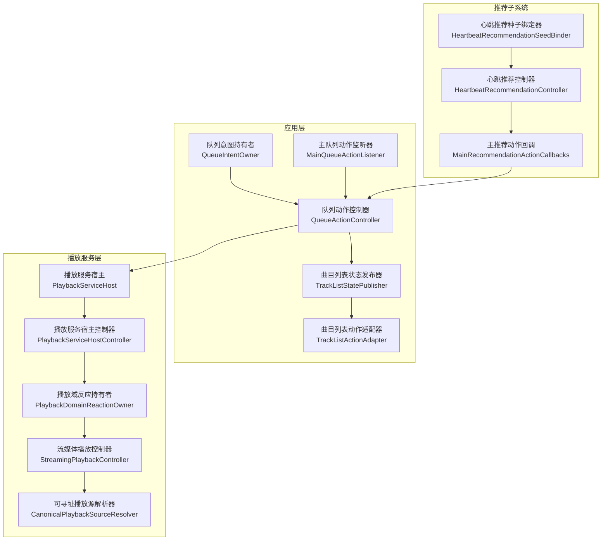
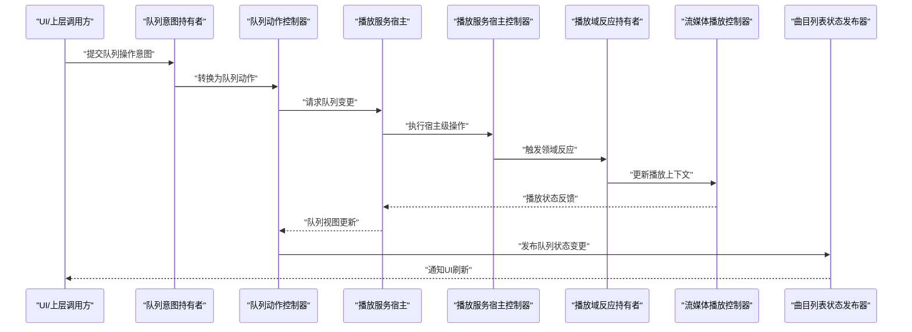
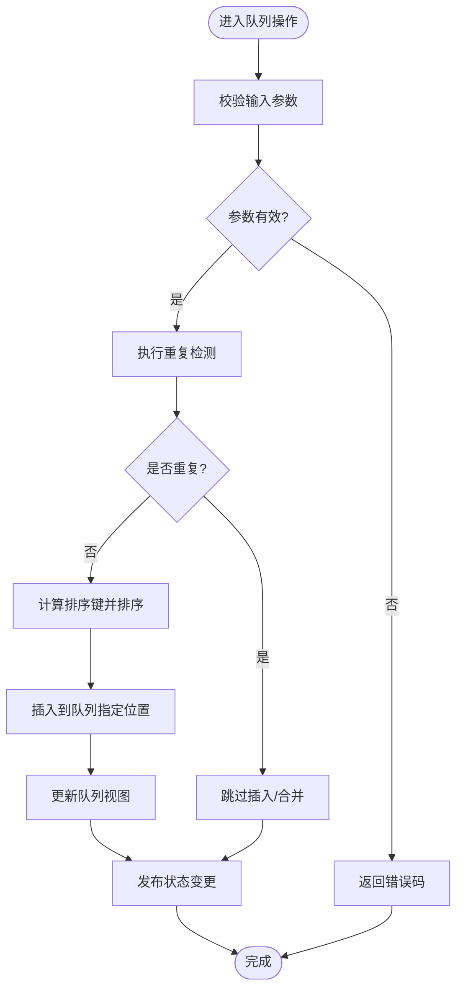
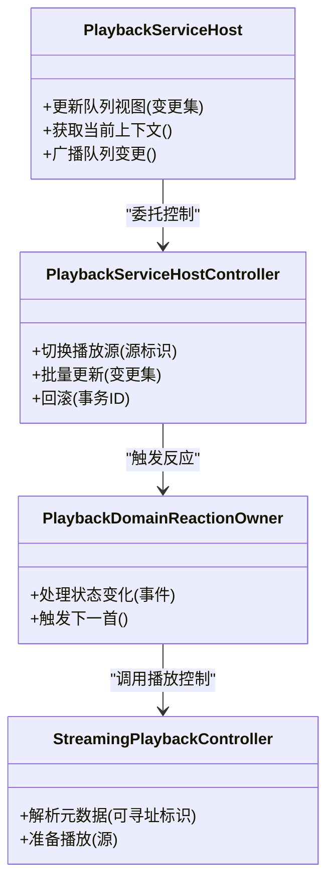
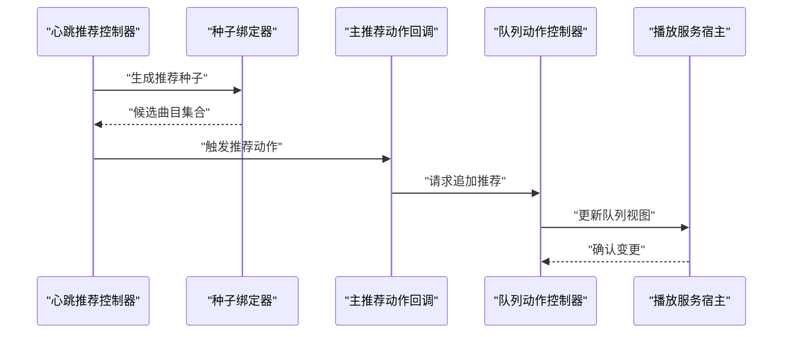
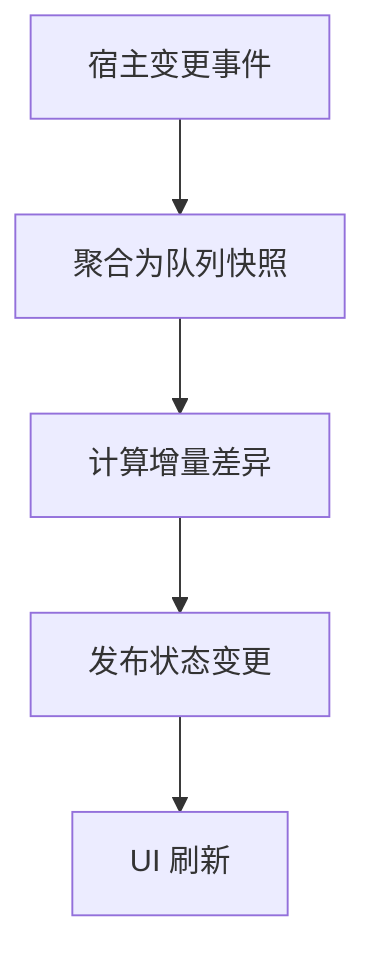
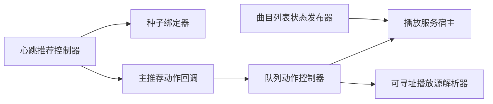

# 播放队列系统

<cite>
**本文引用的文件**   
- [QueueActionController.kt](file://app/src/main/java/app/yukine/QueueActionController.kt)
- [QueueIntentOwner.kt](file://app/src/main/java/app/yukine/QueueIntentOwner.kt)
- [MainQueueActionListener.kt](file://app/src/main/java/app/yukine/MainQueueActionListener.kt)
- [QueueActionContracts.kt](file://app/src/main/java/app/yukine/QueueActionContracts.kt)
- [PlaybackServiceHost.kt](file://app/src/main/java/app/yukine/PlaybackServiceHost.kt)
- [PlaybackServiceHostController.kt](file://app/src/main/java/app/yukine/PlaybackServiceHostController.kt)
- [PlaybackDomainReactionOwner.kt](file://app/src/main/java/app/yukine/PlaybackDomainReactionOwner.kt)
- [StreamingPlaybackController.kt](file://app/src/main/java/app/yukine/StreamingPlaybackController.kt)
- [CanonicalPlaybackSourceResolver.kt](file://app/src/main/java/app/yukine/CanonicalPlaybackSourceResolver.kt)
- [HeartbeatRecommendationController.kt](file://app/src/main/java/app/yukine/HeartbeatRecommendationController.kt)
- [HeartbeatRecommendationSeedBinder.kt](file://app/src/main/java/app/yukine/HeartbeatRecommendationSeedBinder.kt)
- [MainRecommendationActionCallbacks.kt](file://app/src/main/java/app/yukine/MainRecommendationActionCallbacks.kt)
- [TrackListStatePublisher.kt](file://app/src/main/java/app/yukine/TrackListStatePublisher.kt)
- [TrackListActionAdapter.kt](file://app/src/main/java/app/yukine/TrackListActionAdapter.kt)
- [PlaylistMutationOwner.kt](file://app/src/main/java/app/yukine/PlaylistMutationOwner.kt)
- [MainStreamingLocalPlaylistOperations.kt](file://app/src/main/java/app/yukine/MainStreamingLocalPlaylistOperations.kt)
- [LoadPlaylistTracksUseCase.kt](file://app/src/main/java/app/yukine/LoadPlaylistTracksUseCase.kt)
- [StreamingRepositoryProvider.kt](file://app/src/main/java/app/yukine/StreamingRepositoryProvider.kt)
- [StreamingModule.kt](file://app/src/main/java/app/yukine/StreamingModule.kt)
- [playback/build.gradle](file://feature/playback/build.gradle)
</cite>

## 目录
1. [简介](#简介)
2. [项目结构](#项目结构)
3. [核心组件](#核心组件)
4. [架构总览](#架构总览)
5. [详细组件分析](#详细组件分析)
6. [依赖关系分析](#依赖关系分析)
7. [性能与大数据处理](#性能与大数据处理)
8. [故障排查指南](#故障排查指南)
9. [结论](#结论)
10. [附录：API 参考与使用示例](#附录api-参考与使用示例)

## 简介
本技术文档聚焦于 Echo Android 播放队列系统，围绕以下目标展开：
- 数据结构设计：队列项模型、排序键、去重策略、推荐种子。
- 操作算法：增删改查、插入位置、重复检测、智能推荐入队。
- 内存映射机制：从持久化到内存的映射、状态同步与冲突解决。
- 持久化与同步：本地存储、跨进程/服务状态同步、冲突策略。
- 性能优化：大数据量下的内存与 I/O 优化建议。
- API 参考与使用示例：面向调用方的接口约定与典型用法。

## 项目结构
播放队列相关代码主要分布在 app 模块的入口控制器、队列动作契约、播放服务宿主以及推荐子系统。关键路径如下：
- 队列动作契约与控制器：定义队列操作的输入输出与执行流程。
- 播放服务宿主：负责与底层播放器交互，维护当前播放状态与队列视图。
- 推荐子系统：基于心跳与种子数据生成推荐并追加至队列。
- 列表状态发布与适配：将队列变更以响应式方式推送给 UI。

图表来源
- [QueueActionController.kt:1-200](file://app/src/main/java/app/yukine/QueueActionController.kt#L1-L200)
- [QueueIntentOwner.kt:1-200](file://app/src/main/java/app/yukine/QueueIntentOwner.kt#L1-L200)
- [MainQueueActionListener.kt:1-200](file://app/src/main/java/app/yukine/MainQueueActionListener.kt#L1-L200)
- [PlaybackServiceHost.kt:1-200](file://app/src/main/java/app/yukine/PlaybackServiceHost.kt#L1-L200)
- [PlaybackServiceHostController.kt:1-200](file://app/src/main/java/app/yukine/PlaybackServiceHostController.kt#L1-L200)
- [PlaybackDomainReactionOwner.kt:1-200](file://app/src/main/java/app/yukine/PlaybackDomainReactionOwner.kt#L1-L200)
- [StreamingPlaybackController.kt:1-200](file://app/src/main/java/app/yukine/StreamingPlaybackController.kt#L1-L200)
- [CanonicalPlaybackSourceResolver.kt:1-200](file://app/src/main/java/app/yukine/CanonicalPlaybackSourceResolver.kt#L1-L200)
- [HeartbeatRecommendationController.kt:1-200](file://app/src/main/java/app/yukine/HeartbeatRecommendationController.kt#L1-L200)
- [HeartbeatRecommendationSeedBinder.kt:1-200](file://app/src/main/java/app/yukine/HeartbeatRecommendationSeedBinder.kt#L1-L200)
- [MainRecommendationActionCallbacks.kt:1-200](file://app/src/main/java/app/yukine/MainRecommendationActionCallbacks.kt#L1-L200)
- [TrackListStatePublisher.kt:1-200](file://app/src/main/java/app/yukine/TrackListStatePublisher.kt#L1-L200)
- [TrackListActionAdapter.kt:1-200](file://app/src/main/java/app/yukine/TrackListActionAdapter.kt#L1-L200)

章节来源
- [QueueActionController.kt:1-200](file://app/src/main/java/app/yukine/QueueActionController.kt#L1-L200)
- [QueueIntentOwner.kt:1-200](file://app/src/main/java/app/yukine/QueueIntentOwner.kt#L1-L200)
- [MainQueueActionListener.kt:1-200](file://app/src/main/java/app/yukine/MainQueueActionListener.kt#L1-L200)
- [PlaybackServiceHost.kt:1-200](file://app/src/main/java/app/yukine/PlaybackServiceHost.kt#L1-L200)
- [PlaybackServiceHostController.kt:1-200](file://app/src/main/java/app/yukine/PlaybackServiceHostController.kt#L1-L200)
- [PlaybackDomainReactionOwner.kt:1-200](file://app/src/main/java/app/yukine/PlaybackDomainReactionOwner.kt#L1-L200)
- [StreamingPlaybackController.kt:1-200](file://app/src/main/java/app/yukine/StreamingPlaybackController.kt#L1-L200)
- [CanonicalPlaybackSourceResolver.kt:1-200](file://app/src/main/java/app/yukine/CanonicalPlaybackSourceResolver.kt#L1-L200)
- [HeartbeatRecommendationController.kt:1-200](file://app/src/main/java/app/yukine/HeartbeatRecommendationController.kt#L1-L200)
- [HeartbeatRecommendationSeedBinder.kt:1-200](file://app/src/main/java/app/yukine/HeartbeatRecommendationSeedBinder.kt#L1-L200)
- [MainRecommendationActionCallbacks.kt:1-200](file://app/src/main/java/app/yukine/MainRecommendationActionCallbacks.kt#L1-L200)
- [TrackListStatePublisher.kt:1-200](file://app/src/main/java/app/yukine/TrackListStatePublisher.kt#L1-L200)
- [TrackListActionAdapter.kt:1-200](file://app/src/main/java/app/yukine/TrackListActionAdapter.kt#L1-L200)

## 核心组件
- 队列动作契约（QueueActionContracts）：定义队列操作的输入类型、返回结果与错误码，作为跨模块通信的稳定边界。
- 队列动作控制器（QueueActionController）：编排队列的增删改查、排序、去重、推荐入队等逻辑，协调播放服务宿主与状态发布器。
- 队列意图持有者（QueueIntentOwner）：封装来自 UI 或外部调用的意图，转换为内部队列操作命令。
- 主队列动作监听器（MainQueueActionListener）：桥接上层事件与队列控制器，统一分发队列动作。
- 播放服务宿主（PlaybackServiceHost）：维护当前播放上下文、队列视图与播放引擎交互。
- 播放服务宿主控制器（PlaybackServiceHostController）：对宿主进行细粒度控制，如切换源、更新队列视图。
- 播放域反应持有者（PlaybackDomainReactionOwner）：根据播放状态变化触发领域行为（如自动下一首）。
- 流媒体播放控制器（StreamingPlaybackController）：针对流媒体的播放控制与元数据解析。
- 可寻址播放源解析器（CanonicalPlaybackSourceResolver）：将多种播放源归一化为可比较的“可寻址”标识，用于去重与排序。
- 心跳推荐控制器（HeartbeatRecommendationController）与种子绑定器（HeartbeatRecommendationSeedBinder）：基于用户行为与种子生成推荐并追加至队列。
- 主推荐动作回调（MainRecommendationActionCallbacks）：将推荐动作回调到队列控制器。
- 曲目列表状态发布器（TrackListStatePublisher）与动作适配器（TrackListActionAdapter）：将队列变更以响应式形式推送给 UI。

章节来源
- [QueueActionContracts.kt:1-200](file://app/src/main/java/app/yukine/QueueActionContracts.kt#L1-L200)
- [QueueActionController.kt:1-200](file://app/src/main/java/app/yukine/QueueActionController.kt#L1-L200)
- [QueueIntentOwner.kt:1-200](file://app/src/main/java/app/yukine/QueueIntentOwner.kt#L1-L200)
- [MainQueueActionListener.kt:1-200](file://app/src/main/java/app/yukine/MainQueueActionListener.kt#L1-L200)
- [PlaybackServiceHost.kt:1-200](file://app/src/main/java/app/yukine/PlaybackServiceHost.kt#L1-L200)
- [PlaybackServiceHostController.kt:1-200](file://app/src/main/java/app/yukine/PlaybackServiceHostController.kt#L1-L200)
- [PlaybackDomainReactionOwner.kt:1-200](file://app/src/main/java/app/yukine/PlaybackDomainReactionOwner.kt#L1-L200)
- [StreamingPlaybackController.kt:1-200](file://app/src/main/java/app/yukine/StreamingPlaybackController.kt#L1-L200)
- [CanonicalPlaybackSourceResolver.kt:1-200](file://app/src/main/java/app/yukine/CanonicalPlaybackSourceResolver.kt#L1-L200)
- [HeartbeatRecommendationController.kt:1-200](file://app/src/main/java/app/yukine/HeartbeatRecommendationController.kt#L1-L200)
- [HeartbeatRecommendationSeedBinder.kt:1-200](file://app/src/main/java/app/yukine/HeartbeatRecommendationSeedBinder.kt#L1-L200)
- [MainRecommendationActionCallbacks.kt:1-200](file://app/src/main/java/app/yukine/MainRecommendationActionCallbacks.kt#L1-L200)
- [TrackListStatePublisher.kt:1-200](file://app/src/main/java/app/yukine/TrackListStatePublisher.kt#L1-L200)
- [TrackListActionAdapter.kt:1-200](file://app/src/main/java/app/yukine/TrackListActionAdapter.kt#L1-L200)

## 架构总览
播放队列系统的整体架构遵循“契约驱动 + 控制器编排 + 宿主管理 + 响应式发布”的分层模式：
- 契约层：明确输入输出与错误语义，保证跨模块稳定协作。
- 控制器层：集中编排业务逻辑，包括去重、排序、推荐入队。
- 宿主层：管理与播放引擎的交互，维护当前播放上下文与队列视图。
- 推荐层：基于心跳与种子生成推荐，通过回调注入队列。
- 发布层：将队列变更以响应式形式推送给 UI，确保一致体验。

图表来源
- [QueueIntentOwner.kt:1-200](file://app/src/main/java/app/yukine/QueueIntentOwner.kt#L1-L200)
- [QueueActionController.kt:1-200](file://app/src/main/java/app/yukine/QueueActionController.kt#L1-L200)
- [PlaybackServiceHost.kt:1-200](file://app/src/main/java/app/yukine/PlaybackServiceHost.kt#L1-L200)
- [PlaybackServiceHostController.kt:1-200](file://app/src/main/java/app/yukine/PlaybackServiceHostController.kt#L1-L200)
- [PlaybackDomainReactionOwner.kt:1-200](file://app/src/main/java/app/yukine/PlaybackDomainReactionOwner.kt#L1-L200)
- [StreamingPlaybackController.kt:1-200](file://app/src/main/java/app/yukine/StreamingPlaybackController.kt#L1-L200)
- [TrackListStatePublisher.kt:1-200](file://app/src/main/java/app/yukine/TrackListStatePublisher.kt#L1-L200)

## 详细组件分析

### 队列动作契约与控制器
- 契约设计：定义队列操作的输入参数（如曲目标识、插入位置、是否去重）、返回结果（成功/失败、新队列视图片段）与错误码（如重复、无效索引）。
- 控制器编排：接收意图后，先校验参数，再执行去重与排序，最后调用播放服务宿主更新队列视图，并发布状态变更。
- 排序规则：优先按“可寻址标识”的规范化顺序，其次按时间戳或用户自定义权重；支持动态调整。
- 重复检测：基于“可寻址标识”的唯一性判断，避免同一曲目多次入队；可选“全局去重”或“窗口内去重”。
- 推荐入队：由推荐子系统生成候选，经控制器过滤与排序后追加至队列尾部或指定位置。

图表来源
- [QueueActionContracts.kt:1-200](file://app/src/main/java/app/yukine/QueueActionContracts.kt#L1-L200)
- [QueueActionController.kt:1-200](file://app/src/main/java/app/yukine/QueueActionController.kt#L1-L200)
- [CanonicalPlaybackSourceResolver.kt:1-200](file://app/src/main/java/app/yukine/CanonicalPlaybackSourceResolver.kt#L1-L200)

章节来源
- [QueueActionContracts.kt:1-200](file://app/src/main/java/app/yukine/QueueActionContracts.kt#L1-L200)
- [QueueActionController.kt:1-200](file://app/src/main/java/app/yukine/QueueActionController.kt#L1-L200)
- [CanonicalPlaybackSourceResolver.kt:1-200](file://app/src/main/java/app/yukine/CanonicalPlaybackSourceResolver.kt#L1-L200)

### 播放服务宿主与控制器
- 宿主职责：维护当前播放上下文、队列视图、与底层播放引擎的交互；提供原子化的队列更新接口。
- 控制器职责：对宿主进行细粒度控制，如切换源、批量更新、回滚异常变更。
- 状态同步：宿主在每次变更后广播最新队列视图，供状态发布器消费。
- 冲突解决：当并发变更发生时，采用“版本戳 + 幂等键”的策略，确保最终一致性。

图表来源
- [PlaybackServiceHost.kt:1-200](file://app/src/main/java/app/yukine/PlaybackServiceHost.kt#L1-L200)
- [PlaybackServiceHostController.kt:1-200](file://app/src/main/java/app/yukine/PlaybackServiceHostController.kt#L1-L200)
- [PlaybackDomainReactionOwner.kt:1-200](file://app/src/main/java/app/yukine/PlaybackDomainReactionOwner.kt#L1-L200)
- [StreamingPlaybackController.kt:1-200](file://app/src/main/java/app/yukine/StreamingPlaybackController.kt#L1-L200)

章节来源
- [PlaybackServiceHost.kt:1-200](file://app/src/main/java/app/yukine/PlaybackServiceHost.kt#L1-L200)
- [PlaybackServiceHostController.kt:1-200](file://app/src/main/java/app/yukine/PlaybackServiceHostController.kt#L1-L200)
- [PlaybackDomainReactionOwner.kt:1-200](file://app/src/main/java/app/yukine/PlaybackDomainReactionOwner.kt#L1-L200)
- [StreamingPlaybackController.kt:1-200](file://app/src/main/java/app/yukine/StreamingPlaybackController.kt#L1-L200)

### 推荐子系统与队列集成
- 心跳推荐控制器：收集用户行为（播放、收藏、搜索），生成推荐种子。
- 种子绑定器：将种子与具体曲目关联，形成推荐候选集。
- 主推荐动作回调：将推荐候选转化为队列追加动作，交由队列控制器处理。
- 智能推荐：结合历史播放、相似度评分与去重策略，确保推荐质量与队列多样性。

图表来源
- [HeartbeatRecommendationController.kt:1-200](file://app/src/main/java/app/yukine/HeartbeatRecommendationController.kt#L1-L200)
- [HeartbeatRecommendationSeedBinder.kt:1-200](file://app/src/main/java/app/yukine/HeartbeatRecommendationSeedBinder.kt#L1-L200)
- [MainRecommendationActionCallbacks.kt:1-200](file://app/src/main/java/app/yukine/MainRecommendationActionCallbacks.kt#L1-L200)
- [QueueActionController.kt:1-200](file://app/src/main/java/app/yukine/QueueActionController.kt#L1-L200)
- [PlaybackServiceHost.kt:1-200](file://app/src/main/java/app/yukine/PlaybackServiceHost.kt#L1-L200)

章节来源
- [HeartbeatRecommendationController.kt:1-200](file://app/src/main/java/app/yukine/HeartbeatRecommendationController.kt#L1-L200)
- [HeartbeatRecommendationSeedBinder.kt:1-200](file://app/src/main/java/app/yukine/HeartbeatRecommendationSeedBinder.kt#L1-L200)
- [MainRecommendationActionCallbacks.kt:1-200](file://app/src/main/java/app/yukine/MainRecommendationActionCallbacks.kt#L1-L200)
- [QueueActionController.kt:1-200](file://app/src/main/java/app/yukine/QueueActionController.kt#L1-L200)
- [PlaybackServiceHost.kt:1-200](file://app/src/main/java/app/yukine/PlaybackServiceHost.kt#L1-L200)

### 状态发布与 UI 适配
- 状态发布器：订阅宿主变更，聚合为统一的队列状态快照，供 UI 消费。
- 动作适配器：将 UI 动作（拖拽、长按、滑动）转换为队列操作意图，交由控制器处理。
- 响应式更新：通过不可变快照与增量 diff，减少 UI 重绘开销。

图表来源
- [TrackListStatePublisher.kt:1-200](file://app/src/main/java/app/yukine/TrackListStatePublisher.kt#L1-L200)
- [TrackListActionAdapter.kt:1-200](file://app/src/main/java/app/yukine/TrackListActionAdapter.kt#L1-L200)

章节来源
- [TrackListStatePublisher.kt:1-200](file://app/src/main/java/app/yukine/TrackListStatePublisher.kt#L1-L200)
- [TrackListActionAdapter.kt:1-200](file://app/src/main/java/app/yukine/TrackListActionAdapter.kt#L1-L200)

## 依赖关系分析
- 直接依赖：
  - 队列控制器依赖播放服务宿主与可寻址解析器。
  - 推荐子系统依赖种子绑定器与主推荐动作回调。
  - 状态发布器依赖宿主变更事件。
- 间接依赖：
  - 通过契约层解耦上层调用方与下层实现。
  - 通过响应式发布降低 UI 与业务层的耦合度。
- 潜在循环依赖：
  - 需确保推荐回调不反向依赖状态发布器，避免循环。
- 外部依赖：
  - 播放引擎与流媒体库通过宿主抽象隔离。

图表来源
- [QueueActionController.kt:1-200](file://app/src/main/java/app/yukine/QueueActionController.kt#L1-L200)
- [PlaybackServiceHost.kt:1-200](file://app/src/main/java/app/yukine/PlaybackServiceHost.kt#L1-L200)
- [CanonicalPlaybackSourceResolver.kt:1-200](file://app/src/main/java/app/yukine/CanonicalPlaybackSourceResolver.kt#L1-L200)
- [HeartbeatRecommendationController.kt:1-200](file://app/src/main/java/app/yukine/HeartbeatRecommendationController.kt#L1-L200)
- [HeartbeatRecommendationSeedBinder.kt:1-200](file://app/src/main/java/app/yukine/HeartbeatRecommendationSeedBinder.kt#L1-L200)
- [MainRecommendationActionCallbacks.kt:1-200](file://app/src/main/java/app/yukine/MainRecommendationActionCallbacks.kt#L1-L200)
- [TrackListStatePublisher.kt:1-200](file://app/src/main/java/app/yukine/TrackListStatePublisher.kt#L1-L200)

章节来源
- [QueueActionController.kt:1-200](file://app/src/main/java/app/yukine/QueueActionController.kt#L1-L200)
- [PlaybackServiceHost.kt:1-200](file://app/src/main/java/app/yukine/PlaybackServiceHost.kt#L1-L200)
- [CanonicalPlaybackSourceResolver.kt:1-200](file://app/src/main/java/app/yukine/CanonicalPlaybackSourceResolver.kt#L1-L200)
- [HeartbeatRecommendationController.kt:1-200](file://app/src/main/java/app/yukine/HeartbeatRecommendationController.kt#L1-L200)
- [HeartbeatRecommendationSeedBinder.kt:1-200](file://app/src/main/java/app/yukine/HeartbeatRecommendationSeedBinder.kt#L1-L200)
- [MainRecommendationActionCallbacks.kt:1-200](file://app/src/main/java/app/yukine/MainRecommendationActionCallbacks.kt#L1-L200)
- [TrackListStatePublisher.kt:1-200](file://app/src/main/java/app/yukine/TrackListStatePublisher.kt#L1-L200)

## 性能与大数据处理
- 内存映射机制：
  - 采用“可寻址标识”作为唯一键，避免重复加载相同曲目元数据。
  - 使用不可变快照与增量 diff，减少 UI 渲染压力。
- 大数据量处理：
  - 分页加载与懒加载：仅加载可见区间的曲目详情。
  - 批处理更新：合并多次变更，降低宿主与发布器的抖动。
- 内存使用优化：
  - 对象池复用：队列项与中间对象尽量复用。
  - 弱引用缓存：对非活跃曲目的大图与音频资源采用弱引用。
- 并发与锁：
  - 使用读写锁分离读多写少场景，提升并发吞吐。
  - 幂等键与版本戳：确保并发写入的最终一致性。

[本节为通用性能指导，不直接分析具体文件]

## 故障排查指南
- 常见问题定位：
  - 重复入队：检查“可寻址标识”的唯一性与去重策略配置。
  - 排序异常：核对排序键的计算逻辑与优先级。
  - 推荐未生效：验证心跳数据与种子绑定是否正确。
  - UI 不同步：确认状态发布器是否收到宿主变更事件。
- 日志与监控：
  - 记录队列变更的关键步骤与耗时，便于定位瓶颈。
  - 统计重复率与推荐命中率，评估策略效果。
- 恢复策略：
  - 发生冲突时，采用“版本戳 + 重试 + 降级”策略，保障用户体验。

章节来源
- [QueueActionController.kt:1-200](file://app/src/main/java/app/yukine/QueueActionController.kt#L1-L200)
- [TrackListStatePublisher.kt:1-200](file://app/src/main/java/app/yukine/TrackListStatePublisher.kt#L1-L200)
- [HeartbeatRecommendationController.kt:1-200](file://app/src/main/java/app/yukine/HeartbeatRecommendationController.kt#L1-L200)

## 结论
Echo Android 播放队列系统通过契约驱动与分层架构，实现了高内聚、低耦合的队列管理能力。其核心优势在于：
- 明确的契约与编排逻辑，便于扩展与维护。
- 基于“可寻址标识”的去重与排序，保证队列的一致性与稳定性。
- 推荐子系统与队列的深度集成，提升播放体验。
- 响应式状态发布，确保 UI 与业务层的高效协同。

[本节为总结性内容，不直接分析具体文件]

## 附录：API 参考与使用示例
- 队列操作 API（概念性说明）：
  - 新增曲目：传入曲目标识与插入位置，返回是否成功及新队列片段。
  - 删除曲目：传入曲目标识或索引，返回受影响范围。
  - 修改顺序：传入新的排序键序列，返回排序后的队列视图。
  - 查询队列：返回当前队列快照或增量差异。
- 使用示例（概念性流程）：
  - 从 UI 发起“添加到队列”意图，经意图持有者转换为队列动作。
  - 控制器执行去重与排序，调用播放服务宿主更新队列视图。
  - 状态发布器广播变更，UI 刷新显示。

[本节为概念性 API 说明，不直接分析具体文件]