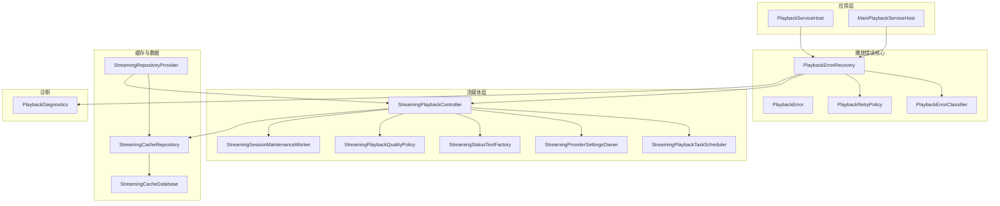
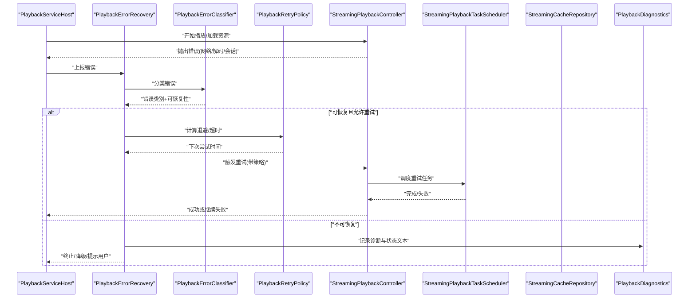
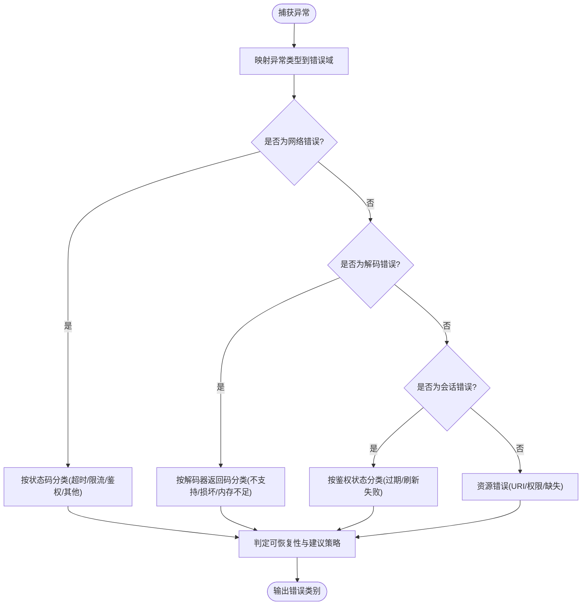
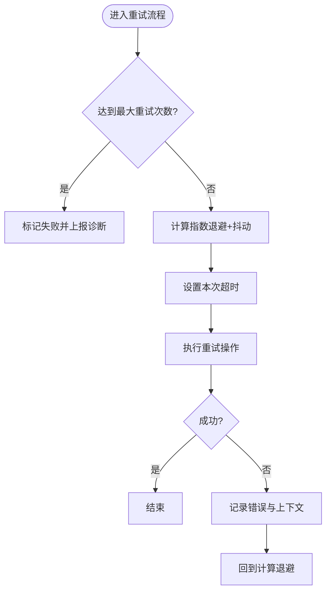
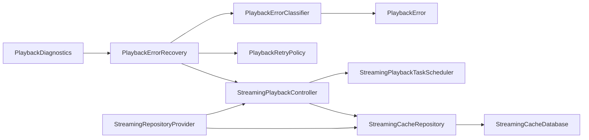

# 错误恢复机制

<cite>
**本文引用的文件**   
- [app/src/main/java/app/yukine/playback/PlaybackError.kt](file://app/src/main/java/app/yukine/playback/PlaybackError.kt)
- [app/src/main/java/app/yukine/playback/PlaybackErrorRecovery.kt](file://app/src/main/java/app/yukine/playback/PlaybackErrorRecovery.kt)
- [app/src/main/java/app/yukine/playback/PlaybackErrorClassifier.kt](file://app/src/main/java/app/yukine/playback/PlaybackErrorClassifier.kt)
- [app/src/main/java/app/yukine/playback/PlaybackRetryPolicy.kt](file://app/src/main/java/app/yukine/playback/PlaybackRetryPolicy.kt)
- [app/src/main/java/app/yukine/playback/PlaybackServiceHost.kt](file://app/src/main/java/app/yukine/playback/PlaybackServiceHost.kt)
- [app/src/main/java/app/yukine/MainPlaybackServiceHost.kt](file://app/src/main/java/app/yukine/MainPlaybackServiceHost.kt)
- [app/src/main/java/app/yukine/diagnostics/PlaybackDiagnostics.kt](file://app/src/main/java/app/yukine/diagnostics/PlaybackDiagnostics.kt)
- [feature/streaming/src/main/java/app/yukine/streaming/StreamingPlaybackController.kt](file://feature/streaming/src/main/java/app/yukine/streaming/StreamingPlaybackController.kt)
- [feature/streaming/src/main/java/app/yukine/streaming/StreamingPlaybackTaskScheduler.java](file://feature/streaming/src/main/java/app/yukine/streaming/StreamingPlaybackTaskScheduler.java)
- [feature/streaming/src/main/java/app/yukine/streaming/StreamingProviderSettingsOwner.kt](file://feature/streaming/src/main/java/app/yukine/streaming/StreamingProviderSettingsOwner.kt)
- [feature/streaming/src/main/java/app/yukine/streaming/StreamingStatusTextFactory.kt](file://feature/streaming/src/main/java/app/yukine/streaming/StreamingStatusTextFactory.kt)
- [feature/streaming/src/main/java/app/yukine/streaming/StreamingPlaybackQualityPolicy.kt](file://feature/streaming/src/main/java/app/yukine/streaming/StreamingPlaybackQualityPolicy.kt)
- [feature/streaming/src/main/java/app/yukine/streaming/StreamingSessionMaintenanceWorker.kt](file://feature/streaming/src/main/java/app/yukine/streaming/StreamingSessionMaintenanceWorker.kt)
- [feature/streaming/src/main/java/app/yukine/streaming/cache/StreamingCacheDatabase.kt](file://feature/streaming/src/main/java/app/yukine/streaming/cache/StreamingCacheDatabase.kt)
- [feature/streaming/src/main/java/app/yukine/streaming/cache/StreamingCacheRepository.kt](file://feature/streaming/src/main/java/app/yukine/streaming/cache/StreamingCacheRepository.kt)
- [feature/streaming/src/main/java/app/yukine/streaming/StreamingRepositoryProvider.kt](file://feature/streaming/src/main/java/app/yukine/streaming/StreamingRepositoryProvider.kt)
- [feature/streaming/src/main/java/app/yukine/streaming/StreamingModule.kt](file://feature/streaming/src/main/java/app/yukine/streaming/StreamingModule.kt)
- [feature/streaming/src/main/java/app/yukine/streaming/StreamingPlaylistController.kt](file://feature/streaming/src/main/java/app/yukine/streaming/StreamingPlaylistController.kt)
- [feature/streaming/src/main/java/app/yukine/streaming/StreamingTrackMatchUseCase.kt](file://feature/streaming/src/main/java/app/yukine/streaming/StreamingTrackMatchUseCase.kt)
- [feature/streaming/src/main/java/app/yukine/streaming/StreamingAuthCallbackController.kt](file://feature/streaming/src/main/java/app/yukine/streaming/StreamingAuthCallbackController.kt)
- [feature/streaming/src/main/java/app/yukine/streaming/StreamingWebAuthActivity.kt](file://feature/streaming/src/main/java/app/yukine/streaming/StreamingWebAuthActivity.kt)
- [feature/streaming/src/main/java/app/yukine/streaming/StreamingManualCookieController.kt](file://feature/streaming/src/main/java/app/yukine/streaming/StreamingManualCookieController.kt)
- [feature/streaming/src/main/java/app/yukine/streaming/StreamingManualCookieDialogController.java](file://feature/streaming/src/main/java/app/yukine/streaming/StreamingManualCookieDialogController.java)
- [feature/streaming/src/main/java/app/yukine/streaming/StreamingPlaybackListener.kt](file://feature/streaming/src/main/java/app/yukine/streaming/StreamingPlaybackListener.kt)
- [feature/streaming/src/main/java/app/yukine/streaming/StreamingEventControllersTest.kt](file://feature/streaming/src/main/java/app/yukine/streaming/StreamingEventControllersTest.kt)
- [feature/streaming/src/main/java/app/yukine/streaming/StreamingPlaybackControllerTest.kt](file://feature/streaming/src/main/java/app/yukine/streaming/StreamingPlaybackControllerTest.kt)
- [feature/streaming/src/main/java/app/yukine/streaming/StreamingPlaylistControllerTest.kt](file://feature/streaming/src/main/java/app/yukine/streaming/StreamingPlaylistControllerTest.kt)
- [feature/streaming/src/main/java/app/yukine/streaming/StreamingTrackMatchUseCaseTest.kt](file://feature/streaming/src/main/java/app/yukine/streaming/StreamingTrackMatchUseCaseTest.kt)
- [feature/streaming/src/main/java/app/yukine/streaming/StreamingAuthCallbackControllerTest.kt](file://feature/streaming/src/main/java/app/yukine/streaming/StreamingAuthCallbackControllerTest.kt)
- [feature/streaming/src/main/java/app/yukine/streaming/StreamingWebAuthActivityTest.kt](file://feature/streaming/src/main/java/app/yukine/streaming/StreamingWebAuthActivityTest.kt)
- [feature/streaming/src/main/java/app/yukine/streaming/StreamingManualCookieControllerTest.kt](file://feature/streaming/src/main/java/app/yukine/streaming/StreamingManualCookieControllerTest.kt)
- [feature/streaming/src/main/java/app/yukine/streaming/StreamingManualCookieDialogControllerTest.java](file://feature/streaming/src/main/java/app/yukine/streaming/StreamingManualCookieDialogControllerTest.java)
- [feature/streaming/src/main/java/app/yukine/streaming/StreamingSessionMaintenanceWorkerTest.kt](file://feature/streaming/src/main/java/app/yukine/streaming/StreamingSessionMaintenanceWorkerTest.kt)
- [feature/streaming/src/main/java/app/yukine/streaming/StreamingCacheRepositoryTest.kt](file://feature/streaming/src/main/java/app/yukine/streaming/StreamingCacheRepositoryTest.kt)
- [feature/streaming/src/main/java/app/yukine/streaming/StreamingRepositoryProviderTest.kt](file://feature/streaming/src/main/java/app/yukine/streaming/StreamingRepositoryProviderTest.kt)
- [feature/streaming/src/main/java/app/yukine/streaming/StreamingModuleTest.kt](file://feature/streaming/src/main/java/app/yukine/streaming/StreamingModuleTest.kt)
- [feature/streaming/src/main/java/app/yukine/streaming/StreamingPlaylistControllerTest.kt](file://feature/streaming/src/main/java/app/yukine/streaming/StreamingPlaylistControllerTest.kt)
- [feature/streaming/src/main/java/app/yukine/streaming/StreamingTrackMatchUseCaseTest.kt](file://feature/streaming/src/main/java/app/yukine/streaming/StreamingTrackMatchUseCaseTest.kt)
- [feature/streaming/src/main/java/app/yukine/streaming/StreamingAuthCallbackControllerTest.kt](file://feature/streaming/src/main/java/app/yukine/streaming/StreamingAuthCallbackControllerTest.kt)
- [feature/streaming/src/main/java/app/yukine/streaming/StreamingWebAuthActivityTest.kt](file://feature/streaming/src/main/java/app/yukine/streaming/StreamingWebAuthActivityTest.kt)
- [feature/streaming/src/main/java/app/yukine/streaming/StreamingManualCookieControllerTest.kt](file://feature/streaming/src/main/java/app/yukine/streaming/StreamingManualCookieControllerTest.kt)
- [feature/streaming/src/main/java/app/yukine/streaming/StreamingManualCookieDialogControllerTest.java](file://feature/streaming/src/main/java/app/yukine/streaming/StreamingManualCookieDialogControllerTest.java)
- [feature/streaming/src/main/java/app/yukine/streaming/StreamingSessionMaintenanceWorkerTest.kt](file://feature/streaming/src/main/java/app/yukine/streaming/StreamingSessionMaintenanceWorkerTest.kt)
- [feature/streaming/src/main/java/app/yukine/streaming/StreamingCacheRepositoryTest.kt](file://feature/streaming/src/main/java/app/yukine/streaming/StreamingCacheRepositoryTest.kt)
- [feature/streaming/src/main/java/app/yukine/streaming/StreamingRepositoryProviderTest.kt](file://feature/streaming/src/main/java/app/yukine/streaming/StreamingRepositoryProviderTest.kt)
- [feature/streaming/src/main/java/app/yukine/streaming/StreamingModuleTest.kt](file://feature/streaming/src/main/java/app/yukine/streaming/StreamingModuleTest.kt)
</cite>

## 目录
1. [简介](#简介)
2. [项目结构](#项目结构)
3. [核心组件](#核心组件)
4. [架构总览](#架构总览)
5. [详细组件分析](#详细组件分析)
6. [依赖关系分析](#依赖关系分析)
7. [性能考量](#性能考量)
8. [故障排查指南](#故障排查指南)
9. [结论](#结论)
10. [附录](#附录)

## 简介
本技术文档聚焦于 Echo Android 播放错误恢复机制，覆盖以下关键主题：
- 播放错误分类体系与检测算法
- 自动恢复策略（网络错误、解码异常、播放器状态重置）
- 重试机制设计（退避算法、超时处理）
- 错误诊断工具、日志记录与性能监控
- 配置选项与自定义错误处理器开发指南

目标读者包括播放器工程师、质量保障人员以及需要扩展或定制错误恢复能力的开发者。

## 项目结构
围绕播放错误恢复的核心代码主要分布在 app 与 feature/streaming 模块中，采用分层与职责分离的设计：
- 错误模型与分类：定义错误类型、来源与可恢复性
- 恢复编排器：根据错误类型选择恢复策略并执行
- 重试与退避：统一的重试策略与退避计算
- 服务宿主与控制器：在播放服务层集成错误恢复流程
- 流媒体控制器与任务调度：负责网络侧错误与任务级重试
- 诊断与监控：采集错误上下文、指标与用户可见状态文本
- 设置与策略：提供可配置的恢复参数与质量降级策略
- 会话维护：保证认证与会话健康，避免鉴权类错误导致的播放中断

图表来源
- [app/src/main/java/app/yukine/playback/PlaybackServiceHost.kt](file://app/src/main/java/app/yukine/playback/PlaybackServiceHost.kt)
- [app/src/main/java/app/yukine/MainPlaybackServiceHost.kt](file://app/src/main/java/app/yukine/MainPlaybackServiceHost.kt)
- [app/src/main/java/app/yukine/playback/PlaybackError.kt](file://app/src/main/java/app/yukine/playback/PlaybackError.kt)
- [app/src/main/java/app/yukine/playback/PlaybackErrorClassifier.kt](file://app/src/main/java/app/yukine/playback/PlaybackErrorClassifier.kt)
- [app/src/main/java/app/yukine/playback/PlaybackErrorRecovery.kt](file://app/src/main/java/app/yukine/playback/PlaybackErrorRecovery.kt)
- [app/src/main/java/app/yukine/playback/PlaybackRetryPolicy.kt](file://app/src/main/java/app/yukine/playback/PlaybackRetryPolicy.kt)
- [feature/streaming/src/main/java/app/yukine/streaming/StreamingPlaybackController.kt](file://feature/streaming/src/main/java/app/yukine/streaming/StreamingPlaybackController.kt)
- [feature/streaming/src/main/java/app/yukine/streaming/StreamingPlaybackTaskScheduler.java](file://feature/streaming/src/main/java/app/yukine/streaming/StreamingPlaybackTaskScheduler.java)
- [feature/streaming/src/main/java/app/yukine/streaming/StreamingProviderSettingsOwner.kt](file://feature/streaming/src/main/java/app/yukine/streaming/StreamingProviderSettingsOwner.kt)
- [feature/streaming/src/main/java/app/yukine/streaming/StreamingStatusTextFactory.kt](file://feature/streaming/src/main/java/app/yukine/streaming/StreamingStatusTextFactory.kt)
- [feature/streaming/src/main/java/app/yukine/streaming/StreamingPlaybackQualityPolicy.kt](file://feature/streaming/src/main/java/app/yukine/streaming/StreamingPlaybackQualityPolicy.kt)
- [feature/streaming/src/main/java/app/yukine/streaming/StreamingSessionMaintenanceWorker.kt](file://feature/streaming/src/main/java/app/yukine/streaming/StreamingSessionMaintenanceWorker.kt)
- [feature/streaming/src/main/java/app/yukine/streaming/cache/StreamingCacheDatabase.kt](file://feature/streaming/src/main/java/app/yukine/streaming/cache/StreamingCacheDatabase.kt)
- [feature/streaming/src/main/java/app/yukine/streaming/cache/StreamingCacheRepository.kt](file://feature/streaming/src/main/java/app/yukine/streaming/cache/StreamingCacheRepository.kt)
- [feature/streaming/src/main/java/app/yukine/streaming/StreamingRepositoryProvider.kt](file://feature/streaming/src/main/java/app/yukine/streaming/StreamingRepositoryProvider.kt)
- [app/src/main/java/app/yukine/diagnostics/PlaybackDiagnostics.kt](file://app/src/main/java/app/yukine/diagnostics/PlaybackDiagnostics.kt)

章节来源
- [app/src/main/java/app/yukine/playback/PlaybackError.kt](file://app/src/main/java/app/yukine/playback/PlaybackError.kt)
- [app/src/main/java/app/yukine/playback/PlaybackErrorClassifier.kt](file://app/src/main/java/app/yukine/playback/PlaybackErrorClassifier.kt)
- [app/src/main/java/app/yukine/playback/PlaybackErrorRecovery.kt](file://app/src/main/java/app/yukine/playback/PlaybackErrorRecovery.kt)
- [app/src/main/java/app/yukine/playback/PlaybackRetryPolicy.kt](file://app/src/main/java/app/yukine/playback/PlaybackRetryPolicy.kt)
- [feature/streaming/src/main/java/app/yukine/streaming/StreamingPlaybackController.kt](file://feature/streaming/src/main/java/app/yukine/streaming/StreamingPlaybackController.kt)
- [feature/streaming/src/main/java/app/yukine/streaming/StreamingPlaybackTaskScheduler.java](file://feature/streaming/src/main/java/app/yukine/streaming/StreamingPlaybackTaskScheduler.java)
- [feature/streaming/src/main/java/app/yukine/streaming/StreamingProviderSettingsOwner.kt](file://feature/streaming/src/main/java/app/yukine/streaming/StreamingProviderSettingsOwner.kt)
- [feature/streaming/src/main/java/app/yukine/streaming/StreamingStatusTextFactory.kt](file://feature/streaming/src/main/java/app/yukine/streaming/StreamingStatusTextFactory.kt)
- [feature/streaming/src/main/java/app/yukine/streaming/StreamingPlaybackQualityPolicy.kt](file://feature/streaming/src/main/java/app/yukine/streaming/StreamingPlaybackQualityPolicy.kt)
- [feature/streaming/src/main/java/app/yukine/streaming/StreamingSessionMaintenanceWorker.kt](file://feature/streaming/src/main/java/app/yukine/streaming/StreamingSessionMaintenanceWorker.kt)
- [feature/streaming/src/main/java/app/yukine/streaming/cache/StreamingCacheDatabase.kt](file://feature/streaming/src/main/java/app/yukine/streaming/cache/StreamingCacheDatabase.kt)
- [feature/streaming/src/main/java/app/yukine/streaming/cache/StreamingCacheRepository.kt](file://feature/streaming/src/main/java/app/yukine/streaming/cache/StreamingCacheRepository.kt)
- [feature/streaming/src/main/java/app/yukine/streaming/StreamingRepositoryProvider.kt](file://feature/streaming/src/main/java/app/yukine/streaming/StreamingRepositoryProvider.kt)
- [app/src/main/java/app/yukine/diagnostics/PlaybackDiagnostics.kt](file://app/src/main/java/app/yukine/diagnostics/PlaybackDiagnostics.kt)

## 核心组件
- 错误模型与分类
  - 错误模型：定义错误类型、来源域（网络、解码、会话、资源）、是否可恢复等元信息
  - 分类器：基于异常类型、HTTP 状态码、解码器返回码、播放器事件进行归类，输出结构化错误类别
- 恢复编排器
  - 根据分类结果选择恢复策略：重试、切换源、降级质量、清理缓存、重置播放器状态、提示用户
  - 协调各子策略的执行顺序与条件判断
- 重试与退避
  - 统一重试策略：最大重试次数、指数退避、抖动、超时控制、幂等性约束
  - 针对网络与解码两类错误的差异化策略
- 服务宿主与控制器
  - 在服务层捕获底层错误，委托给恢复编排器
  - 流媒体控制器负责发起请求、管理任务调度、与缓存和会话维护协作
- 诊断与监控
  - 记录错误上下文、时间线、指标与用户可见状态文本
  - 暴露诊断接口供上层收集与分析

章节来源
- [app/src/main/java/app/yukine/playback/PlaybackError.kt](file://app/src/main/java/app/yukine/playback/PlaybackError.kt)
- [app/src/main/java/app/yukine/playback/PlaybackErrorClassifier.kt](file://app/src/main/java/app/yukine/playback/PlaybackErrorClassifier.kt)
- [app/src/main/java/app/yukine/playback/PlaybackErrorRecovery.kt](file://app/src/main/java/app/yukine/playback/PlaybackErrorRecovery.kt)
- [app/src/main/java/app/yukine/playback/PlaybackRetryPolicy.kt](file://app/src/main/java/app/yukine/playback/PlaybackRetryPolicy.kt)
- [feature/streaming/src/main/java/app/yukine/streaming/StreamingPlaybackController.kt](file://feature/streaming/src/main/java/app/yukine/streaming/StreamingPlaybackController.kt)
- [feature/streaming/src/main/java/app/yukine/streaming/StreamingPlaybackTaskScheduler.java](file://feature/streaming/src/main/java/app/yukine/streaming/StreamingPlaybackTaskScheduler.java)
- [app/src/main/java/app/yukine/diagnostics/PlaybackDiagnostics.kt](file://app/src/main/java/app/yukine/diagnostics/PlaybackDiagnostics.kt)

## 架构总览
下图展示了从播放服务到流媒体控制器、缓存与诊断的端到端错误恢复路径。

图表来源
- [app/src/main/java/app/yukine/playback/PlaybackServiceHost.kt](file://app/src/main/java/app/yukine/playback/PlaybackServiceHost.kt)
- [app/src/main/java/app/yukine/playback/PlaybackErrorRecovery.kt](file://app/src/main/java/app/yukine/playback/PlaybackErrorRecovery.kt)
- [app/src/main/java/app/yukine/playback/PlaybackErrorClassifier.kt](file://app/src/main/java/app/yukine/playback/PlaybackErrorClassifier.kt)
- [app/src/main/java/app/yukine/playback/PlaybackRetryPolicy.kt](file://app/src/main/java/app/yukine/playback/PlaybackRetryPolicy.kt)
- [feature/streaming/src/main/java/app/yukine/streaming/StreamingPlaybackController.kt](file://feature/streaming/src/main/java/app/yukine/streaming/StreamingPlaybackController.kt)
- [feature/streaming/src/main/java/app/yukine/streaming/StreamingPlaybackTaskScheduler.java](file://feature/streaming/src/main/java/app/yukine/streaming/StreamingPlaybackTaskScheduler.java)
- [feature/streaming/src/main/java/app/yukine/streaming/cache/StreamingCacheRepository.kt](file://feature/streaming/src/main/java/app/yukine/streaming/cache/StreamingCacheRepository.kt)
- [app/src/main/java/app/yukine/diagnostics/PlaybackDiagnostics.kt](file://app/src/main/java/app/yukine/diagnostics/PlaybackDiagnostics.kt)

## 详细组件分析

### 错误分类体系与检测算法
- 错误来源域
  - 网络层：连接超时、DNS 解析失败、TLS 握手失败、HTTP 非 2xx、服务端限流/鉴权失败
  - 解码层：不支持的编解码器、损坏的数据流、格式不匹配、内存不足
  - 会话层：认证过期、Cookie 失效、令牌刷新失败
  - 资源层：URI 无效、本地文件缺失、权限不足
- 检测算法
  - 基于异常类型映射到错误类别
  - 结合 HTTP 状态码与响应头判定可恢复性
  - 通过播放器事件与解码器返回码识别解码异常
  - 使用会话维护状态与最近鉴权结果辅助判断

图表来源
- [app/src/main/java/app/yukine/playback/PlaybackErrorClassifier.kt](file://app/src/main/java/app/yukine/playback/PlaybackErrorClassifier.kt)
- [app/src/main/java/app/yukine/playback/PlaybackError.kt](file://app/src/main/java/app/yukine/playback/PlaybackError.kt)

章节来源
- [app/src/main/java/app/yukine/playback/PlaybackErrorClassifier.kt](file://app/src/main/java/app/yukine/playback/PlaybackErrorClassifier.kt)
- [app/src/main/java/app/yukine/playback/PlaybackError.kt](file://app/src/main/java/app/yukine/playback/PlaybackError.kt)

### 自动恢复策略
- 网络错误
  - 重试：指数退避 + 抖动；对限流/鉴权失败优先刷新会话
  - 切换源：当主源不可用时回退到备用源或本地缓存
  - 降级质量：在网络不稳定时降低码率或分辨率
- 解码异常
  - 清理缓存并重试：删除损坏片段后重新拉取
  - 切换编解码器：若可用则尝试软解/硬解切换
  - 暂停并提示：严重损坏时停止播放并提示用户
- 播放器状态重置
  - 释放资源、重置内部状态、重建播放器实例
  - 保持队列与进度一致性，避免重复加载
- 会话维护
  - 定时检查与刷新令牌
  - 失败时引导用户重新登录或手动更新 Cookie

章节来源
- [app/src/main/java/app/yukine/playback/PlaybackErrorRecovery.kt](file://app/src/main/java/app/yukine/playback/PlaybackErrorRecovery.kt)
- [feature/streaming/src/main/java/app/yukine/streaming/StreamingSessionMaintenanceWorker.kt](file://feature/streaming/src/main/java/app/yukine/streaming/StreamingSessionMaintenanceWorker.kt)
- [feature/streaming/src/main/java/app/yukine/streaming/StreamingPlaybackQualityPolicy.kt](file://feature/streaming/src/main/java/app/yukine/streaming/StreamingPlaybackQualityPolicy.kt)

### 重试机制设计与退避算法
- 重试策略
  - 最大重试次数：防止无限重试导致资源耗尽
  - 指数退避：每次失败后等待时间呈指数增长
  - 抖动：引入随机因子避免雪崩效应
  - 超时控制：单次请求与整体重试的超时上限
  - 幂等性：确保重试不会造成副作用（如重复写入）
- 适用场景
  - 网络错误：普遍适用
  - 解码错误：仅在可修复（如缓存损坏）时重试
  - 会话错误：优先刷新会话后再重试

图表来源
- [app/src/main/java/app/yukine/playback/PlaybackRetryPolicy.kt](file://app/src/main/java/app/yukine/playback/PlaybackRetryPolicy.kt)

章节来源
- [app/src/main/java/app/yukine/playback/PlaybackRetryPolicy.kt](file://app/src/main/java/app/yukine/playback/PlaybackRetryPolicy.kt)

### 网络错误处理
- 连接与协议错误：DNS/TLS/连接超时等，优先重试与切换源
- 服务端错误：429/5xx 等，遵循退避与降级策略
- 鉴权失败：触发会话刷新或引导用户重新登录
- 任务调度：将重试任务纳入调度器统一管理，避免并发风暴

章节来源
- [feature/streaming/src/main/java/app/yukine/streaming/StreamingPlaybackController.kt](file://feature/streaming/src/main/java/app/yukine/streaming/StreamingPlaybackController.kt)
- [feature/streaming/src/main/java/app/yukine/streaming/StreamingPlaybackTaskScheduler.java](file://feature/streaming/src/main/java/app/yukine/streaming/StreamingPlaybackTaskScheduler.java)
- [feature/streaming/src/main/java/app/yukine/streaming/StreamingSessionMaintenanceWorker.kt](file://feature/streaming/src/main/java/app/yukine/streaming/StreamingSessionMaintenanceWorker.kt)

### 解码异常恢复
- 检测：依据解码器返回码与播放器事件识别
- 恢复：清理缓存片段、切换编解码器、降级质量
- 终止：严重损坏时停止播放并提示用户

章节来源
- [app/src/main/java/app/yukine/playback/PlaybackErrorClassifier.kt](file://app/src/main/java/app/yukine/playback/PlaybackErrorClassifier.kt)
- [feature/streaming/src/main/java/app/yukine/streaming/StreamingPlaybackQualityPolicy.kt](file://feature/streaming/src/main/java/app/yukine/streaming/StreamingPlaybackQualityPolicy.kt)

### 播放器状态重置
- 释放资源：关闭输入流、释放解码器与渲染器
- 重置状态：清空队列、恢复初始进度
- 重建实例：必要时重建播放器对象以避免残留状态

章节来源
- [app/src/main/java/app/yukine/playback/PlaybackErrorRecovery.kt](file://app/src/main/java/app/yukine/playback/PlaybackErrorRecovery.kt)

### 会话维护与鉴权错误
- 定时维护：定期检查令牌有效期与 Cookie 有效性
- 刷新失败：引导用户重新登录或手动更新 Cookie
- 活动页面：通过 Web 授权流程完成登录

章节来源
- [feature/streaming/src/main/java/app/yukine/streaming/StreamingSessionMaintenanceWorker.kt](file://feature/streaming/src/main/java/app/yukine/streaming/StreamingSessionMaintenanceWorker.kt)
- [feature/streaming/src/main/java/app/yukine/streaming/StreamingAuthCallbackController.kt](file://feature/streaming/src/main/java/app/yukine/streaming/StreamingAuthCallbackController.kt)
- [feature/streaming/src/main/java/app/yukine/streaming/StreamingWebAuthActivity.kt](file://feature/streaming/src/main/java/app/yukine/streaming/StreamingWebAuthActivity.kt)
- [feature/streaming/src/main/java/app/yukine/streaming/StreamingManualCookieController.kt](file://feature/streaming/src/main/java/app/yukine/streaming/StreamingManualCookieController.kt)
- [feature/streaming/src/main/java/app/yukine/streaming/StreamingManualCookieDialogController.java](file://feature/streaming/src/main/java/app/yukine/streaming/StreamingManualCookieDialogController.java)

### 缓存与数据层
- 缓存数据库：存储已下载的片段与元数据
- 缓存仓库：提供增删改查与一致性保证
- 仓库提供者：注入缓存与网络依赖，支持测试替换

章节来源
- [feature/streaming/src/main/java/app/yukine/streaming/cache/StreamingCacheDatabase.kt](file://feature/streaming/src/main/java/app/yukine/streaming/cache/StreamingCacheDatabase.kt)
- [feature/streaming/src/main/java/app/yukine/streaming/cache/StreamingCacheRepository.kt](file://feature/streaming/src/main/java/app/yukine/streaming/cache/StreamingCacheRepository.kt)
- [feature/streaming/src/main/java/app/yukine/streaming/StreamingRepositoryProvider.kt](file://feature/streaming/src/main/java/app/yukine/streaming/StreamingRepositoryProvider.kt)

### 诊断与监控
- 错误上下文：记录错误类型、来源、时间戳、堆栈摘要
- 指标采集：重试次数、退避时长、成功率、失败原因分布
- 用户可见状态：生成友好的状态文本用于 UI 展示

章节来源
- [app/src/main/java/app/yukine/diagnostics/PlaybackDiagnostics.kt](file://app/src/main/java/app/yukine/diagnostics/PlaybackDiagnostics.kt)
- [feature/streaming/src/main/java/app/yukine/streaming/StreamingStatusTextFactory.kt](file://feature/streaming/src/main/java/app/yukine/streaming/StreamingStatusTextFactory.kt)

## 依赖关系分析
- 耦合与内聚
  - 错误分类与恢复编排器低耦合，便于扩展新的错误类型与策略
  - 重试策略独立，可被不同层复用
  - 流媒体控制器集中管理任务与缓存，提升内聚性
- 外部依赖
  - 网络库、解码器、播放器 SDK、系统会话管理
- 潜在循环依赖
  - 通过接口与依赖注入避免直接循环引用

图表来源
- [app/src/main/java/app/yukine/playback/PlaybackErrorClassifier.kt](file://app/src/main/java/app/yukine/playback/PlaybackErrorClassifier.kt)
- [app/src/main/java/app/yukine/playback/PlaybackError.kt](file://app/src/main/java/app/yukine/playback/PlaybackError.kt)
- [app/src/main/java/app/yukine/playback/PlaybackErrorRecovery.kt](file://app/src/main/java/app/yukine/playback/PlaybackErrorRecovery.kt)
- [app/src/main/java/app/yukine/playback/PlaybackRetryPolicy.kt](file://app/src/main/java/app/yukine/playback/PlaybackRetryPolicy.kt)
- [feature/streaming/src/main/java/app/yukine/streaming/StreamingPlaybackController.kt](file://feature/streaming/src/main/java/app/yukine/streaming/StreamingPlaybackController.kt)
- [feature/streaming/src/main/java/app/yukine/streaming/StreamingPlaybackTaskScheduler.java](file://feature/streaming/src/main/java/app/yukine/streaming/StreamingPlaybackTaskScheduler.java)
- [feature/streaming/src/main/java/app/yukine/streaming/cache/StreamingCacheRepository.kt](file://feature/streaming/src/main/java/app/yukine/streaming/cache/StreamingCacheRepository.kt)
- [feature/streaming/src/main/java/app/yukine/streaming/cache/StreamingCacheDatabase.kt](file://feature/streaming/src/main/java/app/yukine/streaming/cache/StreamingCacheDatabase.kt)
- [feature/streaming/src/main/java/app/yukine/streaming/StreamingRepositoryProvider.kt](file://feature/streaming/src/main/java/app/yukine/streaming/StreamingRepositoryProvider.kt)
- [app/src/main/java/app/yukine/diagnostics/PlaybackDiagnostics.kt](file://app/src/main/java/app/yukine/diagnostics/PlaybackDiagnostics.kt)

章节来源
- [feature/streaming/src/main/java/app/yukine/streaming/StreamingModule.kt](file://feature/streaming/src/main/java/app/yukine/streaming/StreamingModule.kt)
- [feature/streaming/src/main/java/app/yukine/streaming/StreamingRepositoryProvider.kt](file://feature/streaming/src/main/java/app/yukine/streaming/StreamingRepositoryProvider.kt)

## 性能考量
- 重试风暴防护：退避与抖动有效降低并发峰值
- 缓存命中优化：合理清理损坏片段，提高命中率
- 质量自适应：在网络波动时动态降级，减少卡顿
- 资源释放：及时释放解码器与输入流，避免内存泄漏
- 监控采样：对高频错误进行采样统计，避免过度开销

[本节为通用指导，无需特定文件来源]

## 故障排查指南
- 快速定位
  - 查看诊断记录中的错误类别与时间线
  - 确认会话状态与令牌有效期
  - 检查缓存完整性与磁盘空间
- 常见问题
  - 频繁鉴权失败：检查会话维护任务与手动 Cookie 更新
  - 解码失败：确认编解码器支持与缓存片段是否损坏
  - 网络超时：观察退避策略是否生效，是否存在并发重试
- 复现与验证
  - 使用测试用例模拟网络与解码错误，验证恢复流程
  - 调整配置参数（最大重试次数、退避系数）观察效果

章节来源
- [feature/streaming/src/main/java/app/yukine/streaming/StreamingEventControllersTest.kt](file://feature/streaming/src/main/java/app/yukine/streaming/StreamingEventControllersTest.kt)
- [feature/streaming/src/main/java/app/yukine/streaming/StreamingPlaybackControllerTest.kt](file://feature/streaming/src/main/java/app/yukine/streaming/StreamingPlaybackControllerTest.kt)
- [feature/streaming/src/main/java/app/yukine/streaming/StreamingPlaylistControllerTest.kt](file://feature/streaming/src/main/java/app/yukine/streaming/StreamingPlaylistControllerTest.kt)
- [feature/streaming/src/main/java/app/yukine/streaming/StreamingTrackMatchUseCaseTest.kt](file://feature/streaming/src/main/java/app/yukine/streaming/StreamingTrackMatchUseCaseTest.kt)
- [feature/streaming/src/main/java/app/yukine/streaming/StreamingAuthCallbackControllerTest.kt](file://feature/streaming/src/main/java/app/yukine/streaming/StreamingAuthCallbackControllerTest.kt)
- [feature/streaming/src/main/java/app/yukine/streaming/StreamingWebAuthActivityTest.kt](file://feature/streaming/src/main/java/app/yukine/streaming/StreamingWebAuthActivityTest.kt)
- [feature/streaming/src/main/java/app/yukine/streaming/StreamingManualCookieControllerTest.kt](file://feature/streaming/src/main/java/app/yukine/streaming/StreamingManualCookieControllerTest.kt)
- [feature/streaming/src/main/java/app/yukine/streaming/StreamingManualCookieDialogControllerTest.java](file://feature/streaming/src/main/java/app/yukine/streaming/StreamingManualCookieDialogControllerTest.java)
- [feature/streaming/src/main/java/app/yukine/streaming/StreamingSessionMaintenanceWorkerTest.kt](file://feature/streaming/src/main/java/app/yukine/streaming/StreamingSessionMaintenanceWorkerTest.kt)
- [feature/streaming/src/main/java/app/yukine/streaming/StreamingCacheRepositoryTest.kt](file://feature/streaming/src/main/java/app/yukine/streaming/StreamingCacheRepositoryTest.kt)
- [feature/streaming/src/main/java/app/yukine/streaming/StreamingRepositoryProviderTest.kt](file://feature/streaming/src/main/java/app/yukine/streaming/StreamingRepositoryProviderTest.kt)
- [feature/streaming/src/main/java/app/yukine/streaming/StreamingModuleTest.kt](file://feature/streaming/src/main/java/app/yukine/streaming/StreamingModuleTest.kt)

## 结论
Echo Android 的播放错误恢复机制通过清晰的错误分类、灵活的恢复编排与稳健的重试退避策略，显著提升了播放稳定性与用户体验。配合会话维护、缓存管理与诊断监控，系统在复杂网络与设备环境下仍能保持高可用性。未来可进一步扩展错误类型与策略，完善可视化诊断与自动化回归测试。

[本节为总结，无需特定文件来源]

## 附录

### 配置选项
- 最大重试次数：限制重试上限，避免无限重试
- 退避系数与抖动范围：控制退避增长速率与随机性
- 超时阈值：单次请求与整体重试的超时上限
- 质量降级策略：在网络不佳时自动降低码率或分辨率
- 会话维护间隔：令牌与 Cookie 的检查与刷新周期

章节来源
- [feature/streaming/src/main/java/app/yukine/streaming/StreamingProviderSettingsOwner.kt](file://feature/streaming/src/main/java/app/yukine/streaming/StreamingProviderSettingsOwner.kt)
- [feature/streaming/src/main/java/app/yukine/streaming/StreamingPlaybackQualityPolicy.kt](file://feature/streaming/src/main/java/app/yukine/streaming/StreamingPlaybackQualityPolicy.kt)

### 自定义错误处理器开发指南
- 实现错误分类规则：新增错误类型与来源域的映射逻辑
- 注册恢复策略：在恢复编排器中声明新策略及其触发条件
- 接入诊断与监控：记录新策略的执行指标与上下文
- 编写单元测试：覆盖正常与异常分支，验证策略正确性

章节来源
- [app/src/main/java/app/yukine/playback/PlaybackErrorClassifier.kt](file://app/src/main/java/app/yukine/playback/PlaybackErrorClassifier.kt)
- [app/src/main/java/app/yukine/playback/PlaybackErrorRecovery.kt](file://app/src/main/java/app/yukine/playback/PlaybackErrorRecovery.kt)
- [app/src/main/java/app/yukine/diagnostics/PlaybackDiagnostics.kt](file://app/src/main/java/app/yukine/diagnostics/PlaybackDiagnostics.kt)