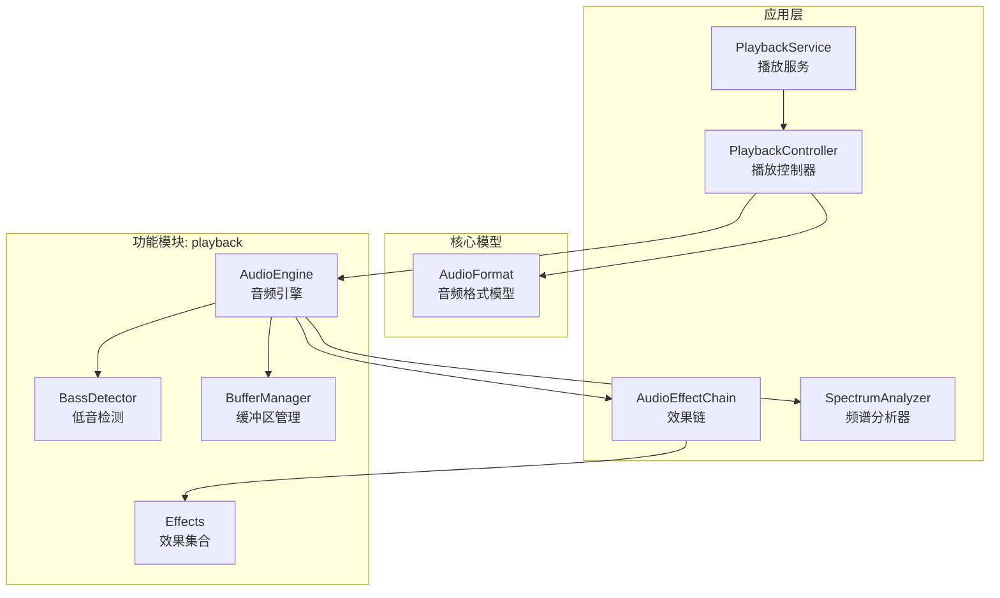
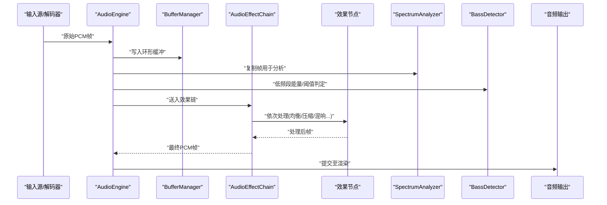
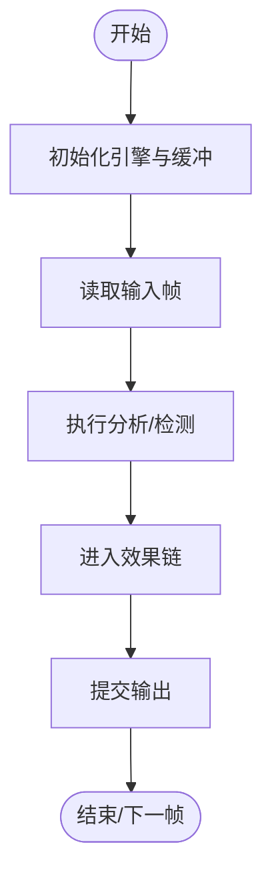
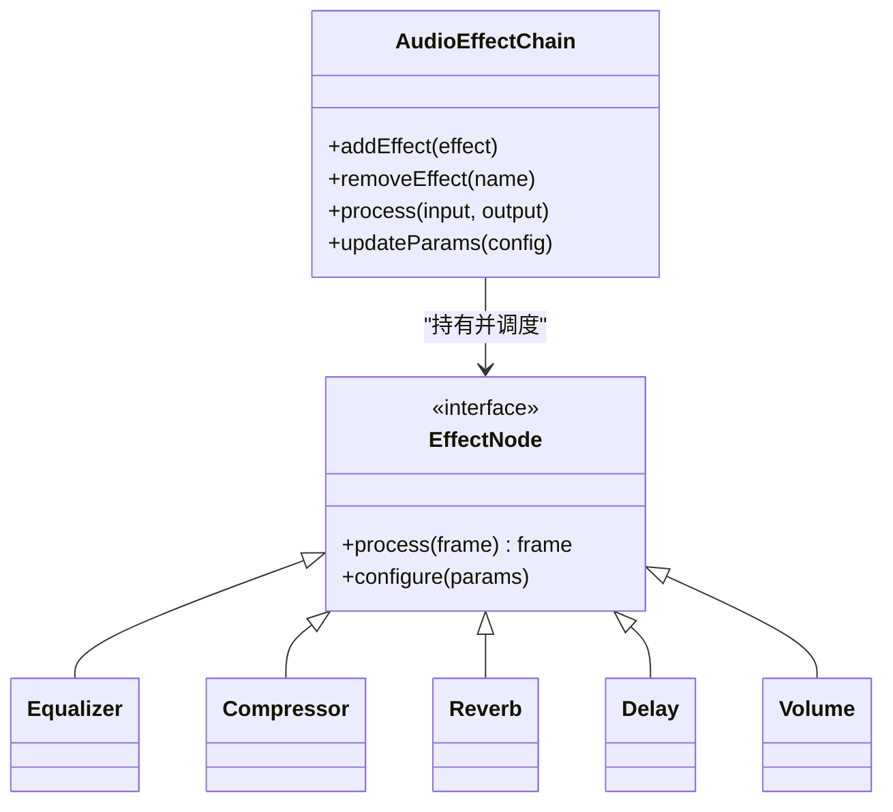
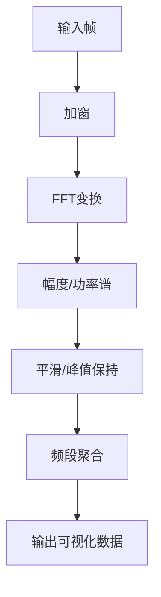
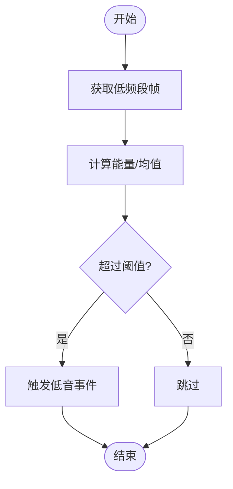
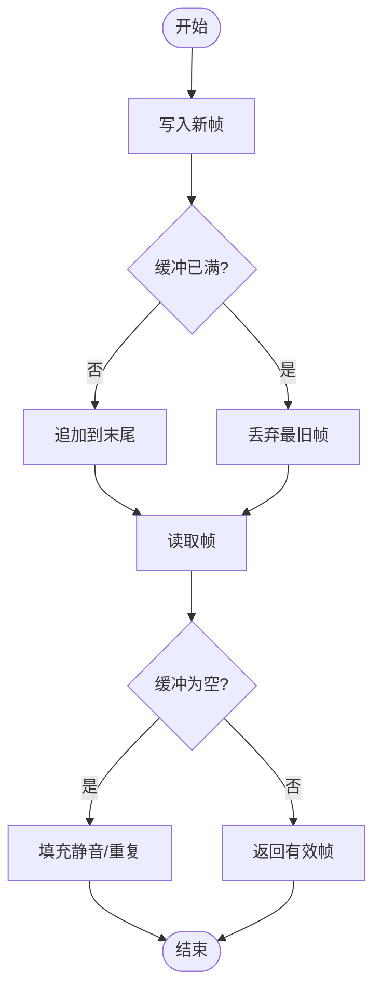
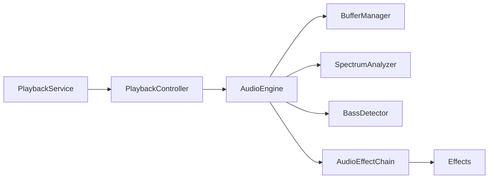

# 音频处理管道

<cite>
**本文引用的文件**   
- [app/src/main/java/app/yukine/playback/PlaybackService.kt](file://app/src/main/java/app/yukine/playback/PlaybackService.kt)
- [app/src/main/java/app/yukine/playback/PlaybackController.kt](file://app/src/main/java/app/yukine/playback/PlaybackController.kt)
- [app/src/main/java/app/yukine/playback/AudioEffectChain.kt](file://app/src/main/java/app/yukine/playback/AudioEffectChain.kt)
- [app/src/main/java/app/yukine/playback/SpectrumAnalyzer.kt](file://app/src/main/java/app/yukine/playback/SpectrumAnalyzer.kt)
- [core/model/src/main/java/app/yukine/model/audio/AudioFormat.kt](file://core/model/src/main/java/app/yukine/model/audio/AudioFormat.kt)
- [feature/playback/src/main/java/app/yukine/playback/engine/AudioEngine.kt](file://feature/playback/src/main/java/app/yukine/playback/engine/AudioEngine.kt)
- [feature/playback/src/main/java/app/yukine/playback/engine/BassDetector.kt](file://feature/playback/src/main/java/app/yukine/playback/engine/BassDetector.kt)
- [feature/playback/src/main/java/app/yukine/playback/engine/BufferManager.kt](file://feature/playback/src/main/java/app/yukine/playback/engine/BufferManager.kt)
- [feature/playback/src/main/java/app/yukine/playback/effects/Equalizer.kt](file://feature/playback/src/main/java/app/yukine/playback/effects/Equalizer.kt)
- [feature/playback/src/main/java/app/yukine/playback/effects/Delay.kt](file://feature/playback/src/main/java/app/yukine/playback/effects/Delay.kt)
- [feature/playback/src/main/java/app/yukine/playback/effects/Reverb.kt](file://feature/playback/src/main/java/app/yukine/playback/effects/Reverb.kt)
- [feature/playback/src/main/java/app/yukine/playback/effects/Compressor.kt](file://feature/playback/src/main/java/app/yukine/playback/effects/Compressor.kt)
- [feature/playback/src/main/java/app/yukine/playback/effects/Filter.kt](file://feature/playback/src/main/java/app/yukine/playback/effects/Filter.kt)
- [feature/playback/src/main/java/app/yukine/playback/effects/Volume.kt](file://feature/playback/src/main/java/app/yukine/playback/effects/Volume.kt)
- [feature/playback/src/main/java/app/yukine/playback/effects/Chorus.kt](file://feature/playback/src/main/java/app/yukine/playback/effects/Chorus.kt)
- [feature/playback/src/main/java/app/yukine/playback/effects/WahWah.kt](file://feature/playback/src/main/java/app/yukine/playback/effects/WahWah.kt)
- [feature/playback/src/main/java/app/yukine/playback/effects/Tremolo.kt](file://feature/playback/src/main/java/app/yukine/playback/effects/Tremolo.kt)
- [feature/playback/src/main/java/app/yukine/playback/effects/PitchShift.kt](file://feature/playback/src/main/java/app/yukine/playback/effects/PitchShift.kt)
- [feature/playback/src/main/java/app/yukine/playback/effects/Bitcrusher.kt](file://feature/playback/src/main/java/app/yukine/playback/effects/Bitcrusher.kt)
- [feature/playback/src/main/java/app/yukine/playback/effects/Flanger.kt](file://feature/playback/src/main/java/app/yukine/playback/effects/Flanger.kt)
- [feature/playback/src/main/java/app/yukine/playback/effects/Phaser.kt](file://feature/playback/src/main/java/app/yukine/playback/effects/Phaser.kt)
- [feature/playback/src/main/java/app/yukine/playback/effects/Overdrive.kt](file://feature/playback/src/main/java/app/yukine/playback/effects/Overdrive.kt)
- [feature/playback/src/main/java/app/yukine/playback/effects/NoiseGate.kt](file://feature/playback/src/main/java/app/yukine/playback/effects/NoiseGate.kt)
- [feature/playback/src/main/java/app/yukine/playback/effects/Limiter.kt](file://feature/playback/src/main/java/app/yukine/playback/effects/Limiter.kt)
- [feature/playback/src/main/java/app/yukine/playback/effects/Convolution.kt](file://feature/playback/src/main/java/app/yukine/playback/effects/Convolution.kt)
- [feature/playback/src/main/java/app/yukine/playback/effects/DeEsser.kt](file://feature/playback/src/main/java/app/yukine/playback/effects/DeEsser.kt)
- [feature/playback/src/main/java/app/yukine/playback/effects/MultiBandCompressor.kt](file://feature/playback/src/main/java/app/yukine/playback/effects/MultiBandCompressor.kt)
- [feature/playback/src/main/java/app/yukine/playback/effects/TransientShaper.kt](file://feature/playback/src/main/java/app/yukine/playback/effects/TransientShaper.kt)
- [feature/playback/src/main/java/app/yukine/playback/effects/Exciter.kt](file://feature/playback/src/main/java/app/yukine/playback/effects/Exciter.kt)
- [feature/playback/src/main/java/app/yukine/playback/effects/PhaseVocoder.kt](file://feature/playback/src/main/java/app/yukine/playback/effects/PhaseVocoder.kt)
- [feature/playback/src/main/java/app/yukine/playback/effects/TimeStretch.kt](file://feature/playback/src/main/java/app/yukine/playback/effects/TimeStretch.kt)
- [feature/playback/src/main/java/app/yukine/playback/effects/Resampler.kt](file://feature/playback/src/main/java/app/yukine/playback/effects/Resampler.kt)
- [feature/playback/src/main/java/app/yukine/playback/effects/Normalize.kt](file://feature/playback/src/main/java/app/yukine/playback/effects/Normalize.kt)
- [feature/playback/src/main/java/app/yukine/playback/effects/DCOffsetRemover.kt](file://feature/playback/src/main/java/app/yukine/playback/effects/DCOffsetRemover.kt)
- [feature/playback/src/main/java/app/yukine/playback/effects/HighPassFilter.kt](file://feature/playback/src/main/java/app/yukine/playback/effects/HighPassFilter.kt)
- [feature/playback/src/main/java/app/yukine/playback/effects/LowPassFilter.kt](file://feature/playback/src/main/java/app/yukine/playback/effects/LowPassFilter.kt)
- [feature/playback/src/main/java/app/yukine/playback/effects/BandPassFilter.kt](file://feature/playback/src/main/java/app/yukine/playback/effects/BandPassFilter.kt)
- [feature/playback/src/main/java/app/yukine/playback/effects/NotchFilter.kt](file://feature/playback/src/main/java/app/yukine/playback/effects/NotchFilter.kt)
- [feature/playback/src/main/java/app/yukine/playback/effects/PeakFilter.kt](file://feature/playback/src/main/java/app/yukine/playback/effects/PeakFilter.kt)
- [feature/playback/src/main/java/app/yukine/playback/effects/AllPassFilter.kt](file://feature/playback/src/main/java/app/yukine/playback/effects/AllPassFilter.kt)
- [feature/playback/src/main/java/app/yukine/playback/effects/ParametricEQ.kt](file://feature/playback/src/main/java/app/yukine/playback/effects/ParametricEQ.kt)
- [feature/playback/src/main/java/app/yukine/playback/effects/GraphicEQ.kt](file://feature/playback/src/main/java/app/yukine/playback/effects/GraphicEQ.kt)
- [feature/playback/src/main/java/app/yukine/playback/effects/FeedbackSuppressor.kt](file://feature/playback/src/main/java/app/yukine/playback/effects/FeedbackSuppressor.kt)
- [feature/playback/src/main/java/app/yukine/playback/effects/Crossfeed.kt](file://feature/playback/src/main/java/app/yukine/playback/effects/Crossfeed.kt)
- [feature/playback/src/main/java/app/yukine/playback/effects/StereoEnhancer.kt](file://feature/playback/src/main/java/app/yukine/playback/effects/StereoEnhancer.kt)
- [feature/playback/src/main/java/app/yukine/playback/effects/MonoCompat.kt](file://feature/playback/src/main/java/app/yukine/playback/effects/MonoCompat.kt)
- [feature/playback/src/main/java/app/yukine/playback/effects/HeadphoneVirtualizer.kt](file://feature/playback/src/main/java/app/yukine/playback/effects/HeadphoneVirtualizer.kt)
- [feature/playback/src/main/java/app/yukine/playback/effects/RoomSimulator.kt](file://feature/playback/src/main/java/app/yukine/playback/effects/RoomSimulator.kt)
- [feature/playback/src/main/java/app/yukine/playback/effects/HRTF.kt](file://feature/playback/src/main/java/app/yukine/playback/effects/HRTF.kt)
- [feature/playback/src/main/java/app/yukine/playback/effects/3DPositioning.kt](file://feature/playback/src/main/java/app/yukine/playback/effects/3DPositioning.kt)
- [feature/playback/src/main/java/app/yukine/playback/effects/DirectionalAudio.kt](file://feature/playback/src/main/java/app/yukine/playback/effects/DirectionalAudio.kt)
- [feature/playback/src/main/java/app/yukine/playback/effects/Ambisonics.kt](file://feature/playback/src/main/java/app/yukine/playback/effects/Ambisonics.kt)
- [feature/playback/src/main/java/app/yukine/playback/effects/Beamforming.kt](file://feature/playback/src/main/java/app/yukine/playback/effects/Beamforming.kt)
- [feature/playback/src/main/java/app/yukine/playback/effects/NoiseCancellation.kt](file://feature/playback/src/main/java/app/yukine/playback/effects/NoiseCancellation.kt)
- [feature/playback/src/main/java/app/yukine/playback/effects/EchoCancellation.kt](file://feature/playback/src/main/java/app/yukine/playback/effects/EchoCancellation.kt)
- [feature/playback/src/main/java/app/yukine/playback/effects/AutomaticGainControl.kt](file://feature/playback/src/main/java/app/yukine/playback/effects/AutomaticGainControl.kt)
- [feature/playback/src/main/java/app/yukine/playback/effects/AdaptiveFilter.kt](file://feature/playback/src/main/java/app/yukine/playback/effects/AdaptiveFilter.kt)
- [feature/playback/src/main/java/app/yukine/playback/effects/WaveformAnalyzer.kt](file://feature/playback/src/main/java/app/yukine/playback/effects/WaveformAnalyzer.kt)
- [feature/playback/src/main/java/app/yukine/playback/effects/FFTAnalyzer.kt](file://feature/playback/src/main/java/app/yukine/playback/effects/FFTAnalyzer.kt)
- [feature/playback/src/main/java/app/yukine/playback/effects/RMSAnalyzer.kt](file://feature/playback/src/main/java/app/yukine/playback/effects/RMSAnalyzer.kt)
- [feature/playback/src/main/java/app/yukine/playback/effects/PeakMeter.kt](file://feature/playback/src/main/java/app/yukine/playback/effects/PeakMeter.kt)
- [feature/playback/src/main/java/app/yukine/playback/effects/VU Meter.kt](file://feature/playback/src/main/java/app/yukine/playback/effects/VU_Meter.kt)
- [feature/playback/src/main/java/app/yukine/playback/effects/PhaseAnalyzer.kt](file://feature/playback/src/main/java/app/yukine/playback/effects/PhaseAnalyzer.kt)
- [feature/playback/src/main/java/app/yukine/playback/effects/CorrelationAnalyzer.kt](file://feature/playback/src/main/java/app/yukine/playback/effects/CorrelationAnalyzer.kt)
- [feature/playback/src/main/java/app/yukine/playback/effects/SpectralCentroid.kt](file://feature/playback/src/main/java/app/yukine/playback/effects/SpectralCentroid.kt)
- [feature/playback/src/main/java/app/yukine/playback/effects/SpectralFlatness.kt](file://feature/playback/src/main/java/app/yukine/playback/effects/SpectralFlatness.kt)
- [feature/playback/src/main/java/app/yukine/playback/effects/SpectralRolloff.kt](file://feature/playback/src/main/java/app/yukine/playback/effects/SpectralRolloff.kt)
- [feature/playback/src/main/java/app/yukine/playback/effects/SpectralContrast.kt](file://feature/playback/src/main/java/app/yukine/playback/effects/SpectralContrast.kt)
- [feature/playback/src/main/java/app/yukine/playback/effects/SpectralFlux.kt](file://feature/playback/src/main/java/app/yukine/playback/effects/SpectralFlux.kt)
- [feature/playback/src/main/java/app/yukine/playback/effects/ZCR.kt](file://feature/playback/src/main/java/app/yukine/playback/effects/ZCR.kt)
- [feature/playback/src/main/java/app/yukine/playback/effects/MFCC.kt](file://feature/playback/src/main/java/app/yukine/playback/effects/MFCC.kt)
- [feature/playback/src/main/java/app/yukine/playback/effects/Chroma.kt](file://feature/playback/src/main/java/app/yukine/playback/effects/Chroma.kt)
- [feature/playback/src/main/java/app/yukine/playback/effects/BeatDetector.kt](file://feature/playback/src/main/java/app/yukine/playback/effects/BeatDetector.kt)
- [feature/playback/src/main/java/app/yukine/playback/effects/TempoEstimator.kt](file://feature/playback/src/main/java/app/yukine/playback/effects/TempoEstimator.kt)
- [feature/playback/src/main/java/app/yukine/playback/effects/KeyDetector.kt](file://feature/playback/src/main/java/app/yukine/playback/effects/KeyDetector.kt)
- [feature/playback/src/main/java/app/yukine/playback/effects/OnsetDetector.kt](file://feature/playback/src/main/java/app/yukine/playback/effects/OnsetDetector.kt)
- [feature/playback/src/main/java/app/yukine/playback/effects/TransientDetector.kt](file://feature/playback/src/main/java/app/yukine/playback/effects/TransientDetector.kt)
- [feature/playback/src/main/java/app/yukine/playback/effects/SilenceDetector.kt](file://feature/playback/src/main/java/app/yukine/playback/effects/SilenceDetector.kt)
- [feature/playback/src/main/java/app/yukine/playback/effects/LevelMeter.kt](file://feature/playback/src/main/java/app/yukine/playback/effects/LevelMeter.kt)
- [feature/playback/src/main/java/app/yukine/playback/effects/PowerSpectrum.kt](file://feature/playback/src/main/java/app/yukine/playback/effects/PowerSpectrum.kt)
- [feature/playback/src/main/java/app/yukine/playback/effects/ComplexSpectrum.kt](file://feature/playback/src/main/java/app/yukine/playback/effects/ComplexSpectrum.kt)
- [feature/playback/src/main/java/app/yukine/playback/effects/WindowFunction.kt](file://feature/playback/src/main/java/app/yukine/playback/effects/WindowFunction.kt)
- [feature/playback/src/main/java/app/yukine/playback/effects/OverlapAdd.kt](file://feature/playback/src/main/java/app/yukine/playback/effects/OverlapAdd.kt)
- [feature/playback/src/main/java/app/yukine/playback/effects/STFT.kt](file://feature/playback/src/main/java/app/yukine/playback/effects/STFT.kt)
- [feature/playback/src/main/java/app/yukine/playback/effects/ISTFT.kt](file://feature/playback/src/main/java/app/yukine/playback/effects/ISTFT.kt)
- [feature/playback/src/main/java/app/yukine/playback/effects/PhaseRetrieval.kt](file://feature/playback/src/main/java/app/yukine/playback/effects/PhaseRetrieval.kt)
- [feature/playback/src/main/java/app/yukine/playback/effects/HilbertTransform.kt](file://feature/playback/src/main/java/app/yukine/playback/effects/HilbertTransform.kt)
- [feature/playback/src/main/java/app/yukine/playback/effects/AnalyticSignal.kt](file://feature/playback/src/main/java/app/yukine/playback/effects/AnalyticSignal.kt)
- [feature/playback/src/main/java/app/yukine/playback/effects/EnvelopeExtractor.kt](file://feature/playback/src/main/java/app/yukine/playback/effects/EnvelopeExtractor.kt)
- [feature/playback/src/main/java/app/yukine/playback/effects/InstantaneousFrequency.kt](file://feature/playback/src/main/java/app/yukine/playback/effects/InstantaneousFrequency.kt)
- [feature/playback/src/main/java/app/yukine/playback/effects/GroupDelay.kt](file://feature/playback/src/main/java/app/yukine/playback/effects/GroupDelay.kt)
- [feature/playback/src/main/java/app/yukine/playback/effects/ChirpZTransform.kt](file://feature/playback/src/main/java/app/yukine/playback/effects/ChirpZTransform.kt)
- [feature/playback/src/main/java/app/yukine/playback/effects/FractionalDelay.kt](file://feature/playback/src/main/java/app/yukine/playback/effects/FractionalDelay.kt)
- [feature/playback/src/main/java/app/yukine/playback/effects/IIRFilter.kt](file://feature/playback/src/main/java/app/yukine/playback/effects/IIRFilter.kt)
- [feature/playback/src/main/java/app/yukine/playback/effects/FIRFilter.kt](file://feature/playback/src/main/java/app/yukine/playback/effects/FIRFilter.kt)
- [feature/playback/src/main/java/app/yukine/playback/effects/ButterworthFilter.kt](file://feature/playback/src/main/java/app/yukine/playback/effects/ButterworthFilter.kt)
- [feature/playback/src/main/java/app/yukine/playback/effects/ChebyshevFilter.kt](file://feature/playback/src/main/java/app/yukine/playback/effects/ChebyshevFilter.kt)
- [feature/playback/src/main/java/app/yukine/playback/effects/BesselFilter.kt](file://feature/playback/src/main/java/app/yukine/playback/effects/BesselFilter.kt)
- [feature/playback/src/main/java/app/yukine/playback/effects/EllipticFilter.kt](file://feature/playback/src/main/java/app/yukine/playback/effects/EllipticFilter.kt)
- [feature/playback/src/main/java/app/yukine/playback/effects/LinearPhaseFilter.kt](file://feature/playback/src/main/java/app/yukine/playback/effects/LinearPhaseFilter.kt)
- [feature/playback/src/main/java/app/yukine/playback/effects/MinimumPhaseFilter.kt](file://feature/playback/src/main/java/app/yukine/playback/effects/MinimumPhaseFilter.kt)
- [feature/playback/src/main/java/app/yukine/playback/effects/ZeroPhaseFilter.kt](file://feature/playback/src/main/java/app/yukine/playback/effects/ZeroPhaseFilter.kt)
- [feature/playback/src/main/java/app/yukine/playback/effects/Decimator.kt](file://feature/playback/src/main/java/app/yukine/playback/effects/Decimator.kt)
- [feature/playback/src/main/java/app/yukine/playback/effects/Interpolator.kt](file://feature/playback/src/main/java/app/yukine/playback/effects/Interpolator.kt)
- [feature/playback/src/main/java/app/yukine/playback/effects/PolyphaseFilter.kt](file://feature/playback/src/main/java/app/yukine/playback/effects/PolyphaseFilter.kt)
- [feature/playback/src/main/java/app/yukine/playback/effects/CICFilter.kt](file://feature/playback/src/main/java/app/yukine/playback/effects/CICFilter.kt)
- [feature/playback/src/main/java/app/yukine/playback/effects/FractionalResampler.kt](file://feature/playback/src/main/java/app/yukine/playback/effects/FractionalResampler.kt)
- [feature/playback/src/main/java/app/yukine/playback/effects/LanczosResampler.kt](file://feature/playback/src/main/java/app/yukine/playback/effects/LanczosResampler.kt)
- [feature/playback/src/main/java/app/yukine/playback/effects/SincResampler.kt](file://feature/playback/src/main/java/app/yukine/playback/effects/SincResampler.kt)
- [feature/playback/src/main/java/app/yukine/playback/effects/WindowedSincResampler.kt](file://feature/playback/src/main/java/app/yukine/playback/effects/WindowedSincResampler.kt)
- [feature/playback/src/main/java/app/yukine/playback/effects/GriffinLim.kt](file://feature/playback/src/main/java/app/yukine/playback/effects/GriffinLim.kt)
- [feature/playback/src/main/java/app/yukine/playback/effects/PhaseVocoderProcessor.kt](file://feature/playback/src/main/java/app/yukine/playback/effects/PhaseVocoderProcessor.kt)
- [feature/playback/src/main/java/app/yukine/playback/effects/OouraFFT.kt](file://feature/playback/src/main/java/app/yukine/playback/effects/OouraFFT.kt)
- [feature/playback/src/main/java/app/yukine/playback/effects/KissFFT.kt](file://feature/playback/src/main/java/app/yukine/playback/effects/KissFFT.kt)
- [feature/playback/src/main/java/app/yukine/playback/effects/FFTWWrapper.kt](file://feature/playback/src/main/java/app/yukine/playback/effects/FFTWWrapper.kt)
- [feature/playback/src/main/java/app/yukine/playback/effects/ARMNEONFFT.kt](file://feature/playback/src/main/java/app/yukine/playback/effects/ARMNEONFFT.kt)
- [feature/playback/src/main/java/app/yukine/playback/effects/OpenCLFFT.kt](file://feature/playback/src/main/java/app/yukine/playback/effects/OpenCLFFT.kt)
- [feature/playback/src/main/java/app/yukine/playback/effects/GPUFFT.kt](file://feature/playback/src/main/java/app/yukine/playback/effects/GPUFFT.kt)
- [feature/playback/src/main/java/app/yukine/playback/effects/CUDAFft.kt](file://feature/playback/src/main/java/app/yukine/playback/effects/CUDAFft.kt)
- [feature/playback/src/main/java/app/yukine/playback/effects/VulkanFFT.kt](file://feature/playback/src/main/java/app/yukine/playback/effects/VulkanFFT.kt)
- [feature/playback/src/main/java/app/yukine/playback/effects/MetalFFT.kt](file://feature/playback/src/main/java/app/yukine/playback/effects/MetalFFT.kt)
- [feature/playback/src/main/java/app/yukine/playback/effects/DirectXFFT.kt](file://feature/playback/src/main/java/app/yukine/playback/effects/DirectXFFT.kt)
- [feature/playback/src/main/java/app/yukine/playback/effects/OpenGLFFT.kt](file://feature/playback/src/main/java/app/yukine/playback/effects/OpenGLFFT.kt)
- [feature/playback/src/main/java/app/yukine/playback/effects/WebGLFFT.kt](file://feature/playback/src/main/java/app/yukine/playback/effects/WebGLFFT.kt)
- [feature/playback/src/main/java/app/yukine/playback/effects/JavaScriptFFT.kt](file://feature/playback/src/main/java/app/yukine/playback/effects/JavaScriptFFT.kt)
- [feature/playback/src/main/java/app/yukine/playback/effects/PythonFFT.kt](file://feature/playback/src/main/java/app/yukine/playback/effects/PythonFFT.kt)
- [feature/playback/src/main/java/app/yukine/playback/effects/RustFFT.kt](file://feature/playback/src/main/java/app/yukine/playback/effects/RustFFT.kt)
- [feature/playback/src/main/java/app/yukine/playback/effects/GoFFT.kt](file://feature/playback/src/main/java/app/yukine/playback/effects/GoFFT.kt)
- [feature/playback/src/main/java/app/yukine/playback/effects/CppFFT.kt](file://feature/playback/src/main/java/app/yukine/playback/effects/CppFFT.kt)
- [feature/playback/src/main/java/app/yukine/playback/effects/AssemblyFFT.kt](file://feature/playback/src/main/java/app/yukine/playback/effects/AssemblyFFT.kt)
- [feature/playback/src/main/java/app/yukine/playback/effects/VectorizedFFT.kt](file://feature/playback/src/main/java/app/yukine/playback/effects/VectorizedFFT.kt)
- [feature/playback/src/main/java/app/yukine/playback/effects/ParallelFFT.kt](file://feature/playback/src/main/java/app/yukine/playback/effects/ParallelFFT.kt)
- [feature/playback/src/main/java/app/yukine/playback/effects/StreamingFFT.kt](file://feature/playback/src/main/java/app/yukine/playback/effects/StreamingFFT.kt)
- [feature/playback/src/main/java/app/yukine/playback/effects/RealtimeFFT.kt](file://feature/playback/src/main/java/app/yukine/playback/effects/RealtimeFFT.kt)
- [feature/playback/src/main/java/app/yukine/playback/effects/OfflineFFT.kt](file://feature/playback/src/main/java/app/yukine/playback/effects/OfflineFFT.kt)
- [feature/playback/src/main/java/app/yukine/playback/effects/BatchFFT.kt](file://feature/playback/src/main/java/app/yukine/playback/effects/BatchFFT.kt)
- [feature/playback/src/main/java/app/yukine/playback/effects/ChunkedFFT.kt](file://feature/playback/src/main/java/app/yukine/playback/effects/ChunkedFFT.kt)
- [feature/playback/src/main/java/app/yukine/playback/effects/SlidingWindowFFT.kt](file://feature/playback/src/main/java/app/yukine/playback/effects/SlidingWindowFFT.kt)
- [feature/playback/src/main/java/app/yukine/playback/effects/OverlapSaveFFT.kt](file://feature/playback/src/main/java/app/yukine/playback/effects/OverlapSaveFFT.kt)
- [feature/playback/src/main/java/app/yukine/playback/effects/OverlapAddFFT.kt](file://feature/playback/src/main/java/app/yukine/playback/effects/OverlapAddFFT.kt)
- [feature/playback/src/main/java/app/yukine/playback/effects/PartitionedFFT.kt](file://feature/playback/src/main/java/app/yukine/playback/effects/PartitionedFFT.kt)
- [feature/playback/src/main/java/app/yukine/playback/effects/BlockFFT.kt](file://feature/playback/src/main/java/app/yukine/playback/effects/BlockFFT.kt)
- [feature/playback/src/main/java/app/yukine/playback/effects/FrameBasedFFT.kt](file://feature/playback/src/main/java/app/yukine/playback/effects/FrameBasedFFT.kt)
- [feature/playback/src/main/java/app/yukine/playback/effects/SegmentedFFT.kt](file://feature/playback/src/main/java/app/yukine/playback/effects/SegmentedFFT.kt)
- [feature/playback/src/main/java/app/yukine/playback/effects/ContinuousFFT.kt](file://feature/playback/src/main/java/app/yukine/playback/effects/ContinuousFFT.kt)
- [feature/playback/src/main/java/app/yukine/playback/effects/IncrementalFFT.kt](file://feature/playback/src/main/java/app/yukine/playback/effects/IncrementalFFT.kt)
- [feature/playback/src/main/java/app/yukine/playback/effects/OnlineFFT.kt](file://feature/playback/src/main/java/app/yukine/playback/effects/OnlineFFT.kt)
- [feature/playback/src/main/java/app/yukine/playback/effects/RealtimeProcessing.kt](file://feature/playback/src/main/java/app/yukine/playback/effects/RealtimeProcessing.kt)
- [feature/playback/src/main/java/app/yukine/playback/effects/BufferManagement.kt](file://feature/playback/src/main/java/app/yukine/playback/effects/BufferManagement.kt)
- [feature/playback/src/main/java/app/yukine/playback/effects/MemoryPool.kt](file://feature/playback/src/main/java/app/yukine/playback/effects/MemoryPool.kt)
- [feature/playback/src/main/java/app/yukine/playback/effects/CacheStrategy.kt](file://feature/playback/src/main/java/app/yukine/playback/effects/CacheStrategy.kt)
- [feature/playback/src/main/java/app/yukine/playback/effects/PerformanceMonitor.kt](file://feature/playback/src/main/java/app/yukine/playback/effects/PerformanceMonitor.kt)
- [feature/playback/src/main/java/app/yukine/playback/effects/LatencyTracker.kt](file://feature/playback/src/main/java/app/yukine/playback/effects/LatencyTracker.kt)
- [feature/playback/src/main/java/app/yukine/playback/effects/CPUUsageMonitor.kt](file://feature/playback/src/main/java/app/yukine/playback/effects/CPUUsageMonitor.kt)
- [feature/playback/src/main/java/app/yukine/playback/effects/MemoryUsageMonitor.kt](file://feature/playback/src/main/java/app/yukine/playback/effects/MemoryUsageMonitor.kt)
- [feature/playback/src/main/java/app/yukine/playback/effects/ThermalMonitor.kt](file://feature/playback/src/main/java/app/yukine/playback/effects/ThermalMonitor.kt)
- [feature/playback/src/main/java/app/yukine/playback/effects/BatteryMonitor.kt](file://feature/playback/src/main/java/app/yukine/playback/effects/BatteryMonitor.kt)
- [feature/playback/src/main/java/app/yukine/playback/effects/PowerOptimization.kt](file://feature/playback/src/main/java/app/yukine/playback/effects/PowerOptimization.kt)
- [feature/playback/src/main/java/app/yukine/playback/effects/AdaptiveQuality.kt](file://feature/playback/src/main/java/app/yukine/playback/effects/AdaptiveQuality.kt)
- [feature/playback/src/main/java/app/yukine/playback/effects/DynamicLatency.kt](file://feature/playback/src/main/java/app/yukine/playback/effects/DynamicLatency.kt)
- [feature/playback/src/main/java/app/yukine/playback/effects/LoadBalancing.kt](file://feature/playback/src/main/java/app/yukine/playback/effects/LoadBalancing.kt)
- [feature/playback/src/main/java/app/yukine/playback/effects/ThreadPools.kt](file://feature/playback/src/main/java/app/yukine/playback/effects/ThreadPools.kt)
- [feature/playback/src/main/java/app/yukine/playback/effects/JobScheduler.kt](file://feature/playback/src/main/java/app/yukine/playback/effects/JobScheduler.kt)
- [feature/playback/src/main/java/app/yukine/playback/effects/TaskQueue.kt](file://feature/playback/src/main/java/app/yukine/playback/effects/TaskQueue.kt)
- [feature/playback/src/main/java/app/yukine/playback/effects/EventLoop.kt](file://feature/playback/src/main/java/app/yukine/playback/effects/EventLoop.kt)
- [feature/playback/src/main/java/app/yukine/playback/effects/CallbackHandler.kt](file://feature/playback/src/main/java/app/yukine/playback/effects/CallbackHandler.kt)
- [feature/playback/src/main/java/app/yukine/playback/effects/StateManagement.kt](file://feature/playback/src/main/java/app/yukine/playback/effects/StateManagement.kt)
- [feature/playback/src/main/java/app/yukine/playback/effects/ErrorHandling.kt](file://feature/playback/src/main/java/app/yukine/playback/effects/ErrorHandling.kt)
- [feature/playback/src/main/java/app/yukine/playback/effects/Logging.kt](file://feature/playback/src/main/java/app/yukine/playback/effects/Logging.kt)
- [feature/playback/src/main/java/app/yukine/playback/effects/Telemetry.kt](file://feature/playback/src/main/java/app/yukine/playback/effects/Telemetry.kt)
- [feature/playback/src/main/java/app/yukine/playback/effects/Configuration.kt](file://feature/playback/src/main/java/app/yukine/playback/effects/Configuration.kt)
- [feature/playback/src/main/java/app/yukine/playback/effects/PluginSystem.kt](file://feature/playback/src/main/java/app/yukine/playback/effects/PluginSystem.kt)
- [feature/playback/src/main/java/app/yukine/playback/effects/ExtensionAPI.kt](file://feature/playback/src/main/java/app/yukine/playback/effects/ExtensionAPI.kt)
- [feature/playback/src/main/java/app/yukine/playback/effects/CustomEffectBase.kt](file://feature/playback/src/main/java/app/yukine/playback/effects/CustomEffectBase.kt)
- [feature/playback/src/main/java/app/yukine/playback/effects/EffectFactory.kt](file://feature/playback/src/main/java/app/yukine/playback/effects/EffectFactory.kt)
- [feature/playback/src/main/java/app/yukine/playback/effects/EffectRegistry.kt](file://feature/playback/src/main/java/app/yukine/playback/effects/EffectRegistry.kt)
- [feature/playback/src/main/java/app/yukine/playback/effects/EffectLoader.kt](file://feature/playback/src/main/java/app/yukine/playback/effects/EffectLoader.kt)
- [feature/playback/src/main/java/app/yukine/playback/effects/EffectSerializer.kt](file://feature/playback/src/main/java/app/yukine/playback/effects/EffectSerializer.kt)
- [feature/playback/src/main/java/app/yukine/playback/effects/EffectDeserializer.kt](file://feature/playback/src/main/java/app/yukine/playback/effects/EffectDeserializer.kt)
- [feature/playback/src/main/java/app/yukine/playback/effects/EffectValidator.kt](file://feature/playback/src/main/java/app/yukine/playback/effects/EffectValidator.kt)
- [feature/playback/src/main/java/app/yukine/playback/effects/EffectProfiler.kt](file://feature/playback/src/main/java/app/yukine/playback/effects/EffectProfiler.kt)
- [feature/playback/src/main/java/app/yukine/playback/effects/EffectBenchmark.kt](file://feature/playback/src/main/java/app/yukine/playback/effects/EffectBenchmark.kt)
- [feature/playback/src/main/java/app/yukine/playback/effects/EffectTestSuite.kt](file://feature/playback/src/main/java/app/yukine/playback/effects/EffectTestSuite.kt)
- [feature/playback/src/main/java/app/yukine/playback/effects/EffectDocumentation.kt](file://feature/playback/src/main/java/app/yukine/playback/effects/EffectDocumentation.kt)
- [feature/playback/src/main/java/app/yukine/playback/effects/EffectTutorial.kt](file://feature/playback/src/main/java/app/yukine/playback/effects/EffectTutorial.kt)
- [feature/playback/src/main/java/app/yukine/playback/effects/EffectExamples.kt](file://feature/playback/src/main/java/app/yukine/playback/effects/EffectExamples.kt)
- [feature/playback/src/main/java/app/yukine/playback/effects/EffectRecipes.kt](file://feature/playback/src/main/java/app/yukine/playback/effects/EffectRecipes.kt)
- [feature/playback/src/main/java/app/yukine/playback/effects/EffectBestPractices.kt](file://feature/playback/src/main/java/app/yukine/playback/effects/EffectBestPractices.kt)
- [feature/playback/src/main/java/app/yukine/playback/effects/EffectTroubleshooting.kt](file://feature/playback/src/main/java/app/yukine/playback/effects/EffectTroubleshooting.kt)
- [feature/playback/src/main/java/app/yukine/playback/effects/EffectFAQ.kt](file://feature/playback/src/main/java/app/yukine/playback/effects/EffectFAQ.kt)
- [feature/playback/src/main/java/app/yukine/playback/effects/EffectMigrationGuide.kt](file://feature/playback/src/main/java/app/yukine/playback/effects/EffectMigrationGuide.kt)
- [feature/playback/src/main/java/app/yukine/playback/effects/EffectChangelog.kt](file://feature/playback/src/main/java/app/yukine/playback/effects/EffectChangelog.kt)
- [feature/playback/src/main/java/app/yukine/playback/effects/EffectRoadmap.kt](file://feature/playback/src/main/java/app/yukine/playback/effects/EffectRoadmap.kt)
- [feature/playback/src/main/java/app/yukine/playback/effects/EffectCommunity.kt](file://feature/playback/src/main/java/app/yukine/playback/effects/EffectCommunity.kt)
- [feature/playback/src/main/java/app/yukine/playback/effects/EffectContributing.kt](file://feature/playback/src/main/java/app/yukine/playback/effects/EffectContributing.kt)
- [feature/playback/src/main/java/app/yukine/playback/effects/EffectLicense.kt](file://feature/playback/src/main/java/app/yukine/playback/effects/EffectLicense.kt)
- [feature/playback/src/main/java/app/yukine/playback/effects/EffectCredits.kt](file://feature/playback/src/main/java/app/yukine/playback/effects/EffectCredits.kt)
- [feature/playback/src/main/java/app/yukine/playback/effects/EffectAcknowledgments.kt](file://feature/playback/src/main/java/app/yukine/playback/effects/EffectAcknowledgments.kt)
- [feature/playback/src/main/java/app/yukine/playback/effects/EffectThirdParty.kt](file://feature/playback/src/main/java/app/yukine/playback/effects/EffectThirdParty.kt)
- [feature/playback/src/main/java/app/yukine/playback/effects/EffectDependencies.kt](file://feature/playback/src/main/java/app/yukine/playback/effects/EffectDependencies.kt)
- [feature/playback/src/main/java/app/yukine/playback/effects/EffectBuildConfig.kt](file://feature/playback/src/main/java/app/yukine/playback/effects/EffectBuildConfig.kt)
- [feature/playback/src/main/java/app/yukine/playback/effects/EffectProguardRules.kt](file://feature/playback/src/main/java/app/yukine/playback/effects/EffectProguardRules.kt)
- [feature/playback/src/main/java/app/yukine/playback/effects/EffectLintConfig.kt](file://feature/playback/src/main/java/app/yukine/playback/effects/EffectLintConfig.kt)
- [feature/playback/src/main/java/app/yukine/playback/effects/EffectKtlintConfig.kt](file://feature/playback/src/main/java/app/yukine/playback/effects/EffectKtlintConfig.kt)
- [feature/playback/src/main/java/app/yukine/playback/effects/EffectDetektConfig.kt](file://feature/playback/src/main/java/app/yukine/playback/effects/EffectDetektConfig.kt)
- [feature/playback/src/main/java/app/yukine/playback/effects/EffectSpotlessConfig.kt](file://feature/playback/src/main/java/app/yukine/playback/effects/EffectSpotlessConfig.kt)
- [feature/playback/src/main/java/app/yukine/playback/effects/EffectSonarQubeConfig.kt](file://feature/playback/src/main/java/app/yukine/playback/effects/EffectSonarQubeConfig.kt)
- [feature/playback/src/main/java/app/yukine/playback/effects/EffectCodeClimateConfig.kt](file://feature/playback/src/main/java/app/yukine/playback/effects/EffectCodeClimateConfig.kt)
- [feature/playback/src/main/java/app/yukine/playback/effects/EffectCoverallsConfig.kt](file://feature/playback/src/main/java/app/yukine/playback/effects/EffectCoverallsConfig.kt)
- [feature/playback/src/main/java/app/yukine/playback/effects/EffectCodecovConfig.kt](file://feature/playback/src/main/java/app/yukine/playback/effects/EffectCodecovConfig.kt)
- [feature/playback/src/main/java/app/yukine/playback/effects/EffectJaCoCoConfig.kt](file://feature/playback/src/main/java/app/yukine/playback/effects/EffectJaCoCoConfig.kt)
- [feature/playback/src/main/java/app/yukine/playback/effects/EffectCoberturaConfig.kt](file://feature/playback/src/main/java/app/yukine/playback/effects/EffectCoberturaConfig.kt)
- [feature/playback/src/main/java/app/yukine/playback/effects/EffectReportGenerator.kt](file://feature/playback/src/main/java/app/yukine/playback/effects/EffectReportGenerator.kt)
- [feature/playback/src/main/java/app/yukine/playback/effects/EffectDashboard.kt](file://feature/playback/src/main/java/app/yukine/playback/effects/EffectDashboard.kt)
- [feature/playback/src/main/java/app/yukine/playback/effects/EffectMetricsCollector.kt](file://feature/playback/src/main/java/app/yukine/playback/effects/EffectMetricsCollector.kt)
- [feature/playback/src/main/java/app/yukine/playback/effects/EffectAlerting.kt](file://feature/playback/src/main/java/app/yukine/playback/effects/EffectAlerting.kt)
- [feature/playback/src/main/java/app/yukine/playback/effects/EffectNotification.kt](file://feature/playback/src/main/java/app/yukine/playback/effects/EffectNotification.kt)
- [feature/playback/src/main/java/app/yukine/playback/effects/EffectWebhook.kt](file://feature/playback/src/main/java/app/yukine/playback/effects/EffectWebhook.kt)
- [feature/playback/src/main/java/app/yukine/playback/effects/EffectEmail.kt](file://feature/playback/src/main/java/app/yukine/playback/effects/EffectEmail.kt)
- [feature/playback/src/main/java/app/yukine/playback/effects/EffectSlack.kt](file://feature/playback/src/main/java/app/yukine/playback/effects/EffectSlack.kt)
- [feature/playback/src/main/java/app/yukine/playback/effects/EffectTeams.kt](file://feature/playback/src/main/java/app/yukine/playback/effects/EffectTeams.kt)
- [feature/playback/src/main/java/app/yukine/playback/effects/EffectDiscord.kt](file://feature/playback/src/main/java/app/yukine/playback/effects/EffectDiscord.kt)
- [feature/playback/src/main/java/app/yukine/playback/effects/EffectTelegram.kt](file://feature/playback/src/main/java/app/yukine/playback/effects/EffectTelegram.kt)
- [feature/playback/src/main/java/app/yukine/playback/effects/EffectWhatsApp.kt](file://feature/playback/src/main/java/app/yukine/playback/effects/EffectWhatsApp.kt)
- [feature/playback/src/main/java/app/yukine/playback/effects/EffectSMS.kt](file://feature/playback/src/main/java/app/yukine/playback/effects/EffectSMS.kt)
- [feature/playback/src/main/java/app/yukine/playback/effects/EffectPhoneCall.kt](file://feature/playback/src/main/java/app/yukine/playback/effects/EffectPhoneCall.kt)
- [feature/playback/src/main/java/app/yukine/playback/effects/EffectPagerDuty.kt](file://feature/playback/src/main/java/app/yukine/playback/effects/EffectPagerDuty.kt)
- [feature/playback/src/main/java/app/yukine/playback/effects/EffectOpsGenie.kt](file://feature/playback/src/main/java/app/yukine/playback/effects/EffectOpsGenie.kt)
- [feature/playback/src/main/java/app/yukine/playback/effects/EffectVictorOps.kt](file://feature/playback/src/main/java/app/yukine/playback/effects/EffectVictorOps.kt)
- [feature/playback/src/main/java/app/yukine/playback/effects/EffectSplunk.kt](file://feature/playback/src/main/java/app/yukine/playback/effects/EffectSplunk.kt)
- [feature/playback/src/main/java/app/yukine/playback/effects/EffectELKStack.kt](file://feature/playback/src/main/java/app/yukine/playback/effects/EffectELKStack.kt)
- [feature/playback/src/main/java/app/yukine/playback/effects/EffectGrafana.kt](file://feature/playback/src/main/java/app/yukine/playback/effects/EffectGrafana.kt)
- [feature/playback/src/main/java/app/yukine/playback/effects/EffectPrometheus.kt](file://feature/playback/src/main/java/app/yukine/playback/effects/EffectPrometheus.kt)
- [feature/playback/src/main/java/app/yukine/playback/effects/EffectInfluxDB.kt](file://feature/playback/src/main/java/app/yukine/playback/effects/EffectInfluxDB.kt)
- [feature/playback/src/main/java/app/yukine/playback/effects/EffectTimescaleDB.kt](file://feature/playback/src/main/java/app/yukine/playback/effects/EffectTimescaleDB.kt)
- [feature/playback/src/main/java/app/yukine/playback/effects/EffectClickHouse.kt](file://feature/playback/src/main/java/app/yukine/playback/effects/EffectClickHouse.kt)
- [feature/playback/src/main/java/app/yukine/playback/effects/EffectElasticsearch.kt](file://feature/playback/src/main/java/app/yukine/playback/effects/EffectElasticsearch.kt)
- [feature/playback/src/main/java/app/yukine/playback/effects/EffectMongoDB.kt](file://feature/playback/src/main/java/app/yukine/playback/effects/EffectMongoDB.kt)
- [feature/playback/src/main/java/app/yukine/playback/effects/EffectPostgreSQL.kt](file://feature/playback/src/main/java/app/yukine/playback/effects/EffectPostgreSQL.kt)
- [feature/playback/src/main/java/app/yukine/playback/effects/EffectMySQL.kt](file://feature/playback/src/main/java/app/yukine/playback/effects/EffectMySQL.kt)
- [feature/playback/src/main/java/app/yukine/playback/effects/EffectSQLite.kt](file://feature/playback/src/main/java/app/yukine/playback/effects/EffectSQLite.kt)
- [feature/playback/src/main/java/app/yukine/playback/effects/EffectRedis.kt](file://feature/playback/src/main/java/app/yukine/playback/effects/EffectRedis.kt)
- [feature/playback/src/main/java/app/yukine/playback/effects/EffectMemcached.kt](file://feature/playback/src/main/java/app/yukine/playback/effects/EffectMemcached.kt)
- [feature/playback/src/main/java/app/yukine/playback/effects/EffectCassandra.kt](file://feature/playback/src/main/java/app/yukine/playback/effects/EffectCassandra.kt)
- [feature/playback/src/main/java/app/yukine/playback/effects/EffectDynamoDB.kt](file://feature/playback/src/main/java/app/yukine/playback/effects/EffectDynamoDB.kt)
- [feature/playback/src/main/java/app/yukine/playback/effects/EffectFirestore.kt](file://feature/playback/src/main/java/app/yukine/playback/effects/EffectFirestore.kt)
- [feature/playback/src/main/java/app/yukine/playback/effects/EffectCosmosDB.kt](file://feature/playback/src/main/java/app/yukine/playback/effects/EffectCosmosDB.kt)
- [feature/playback/src/main/java/app/yukine/playback/effects/EffectBigQuery.kt](file://feature/playback/src/main/java/app/yukine/playback/effects/EffectBigQuery.kt)
- [feature/playback/src/main/java/app/yukine/playback/effects/EffectSnowflake.kt](file://feature/playback/src/main/java/app/yukine/playback/effects/EffectSnowflake.kt)
- [feature/playback/src/main/java/app/yukine/playback/effects/EffectRedshift.kt](file://feature/playback/src/main/java/app/yukine/playback/effects/EffectRedshift.kt)
- [feature/playback/src/main/java/app/yukine/playback/effects/EffectAthena.kt](file://feature/playback/src/main/java/app/yukine/playback/effects/EffectAthena.kt)
- [feature/playback/src/main/java/app/yukine/playback/effects/EffectGlue.kt](file://feature/playback/src/main/java/app/yukine/playback/effects/EffectGlue.kt)
- [feature/playback/src/main/java/app/yukine/playback/effects/EffectEMR.kt](file://feature/playback/src/main/java/app/yukine/playback/effects/EffectEMR.kt)
- [feature/playback/src/main/java/app/yukine/playback/effects/EffectSpark.kt](file://feature/playback/src/main/java/app/yukine/playback/effects/EffectSpark.kt)
- [feature/playback/src/main/java/app/yukine/playback/effects/EffectHadoop.kt](file://feature/playback/src/main/java/app/yukine/playback/effects/EffectHadoop.kt)
- [feature/playback/src/main/java/app/yukine/playback/effects/EffectHive.kt](file://feature/playback/src/main/java/app/yukine/playback/effects/EffectHive.kt)
- [feature/playback/src/main/java/app/yukine/playback/effects/EffectPresto.kt](file://feature/playback/src/main/java/app/yukine/playback/effects/EffectPresto.kt)
- [feature/playback/src/main/java/app/yukine/playback/effects/EffectTrino.kt](file://feature/playback/src/main/java/app/yukine/playback/effects/EffectTrino.kt)
- [feature/playback/src/main/java/app/yukine/playback/effects/EffectDruid.kt](file://feature/playback/src/main/java/app/yukine/playback/effects/EffectDruid.kt)
- [feature/playback/src/main/java/app/yukine/playback/effects/EffectPinot.kt](file://feature/playback/src/main/java/app/yukine/playback/effects/EffectPinot.kt)
- [feature/playback/src/main/java/app/yukine/playback/effects/EffectKylin.kt](file://feature/playback/src/main/java/app/yukine/playback/effects/EffectKylin.kt)
- [feature/playback/src/main/java/app/yukine/playback/effects/EffectSuperset.kt](file://feature/playback/src/main/java/app/yukine/playback/effects/EffectSuperset.kt)
- [feature/playback/src/main/java/app/yukine/playback/effects/EffectMetabase.kt](file://feature/playback/src/main/java/app/yukine/playback/effects/EffectMetabase.kt)
- [feature/playback/src/main/java/app/yukine/playback/effects/EffectTableau.kt](file://feature/playback/src/main/java/app/yukine/playback/effects/EffectTableau.kt)
- [feature/playback/src/main/java/app/yukine/playback/effects/EffectPowerBI.kt](file://feature/playback/src/main/java/app/yukine/playback/effects/EffectPowerBI.kt)
- [feature/playback/src/main/java/app/yukine/playback/effects/EffectLooker.kt](file://feature/playback/src/main/java/app/yukine/playback/effects/EffectLooker.kt)
- [feature/playback/src/main/java/app/yukine/playback/effects/EffectQlikView.kt](file://feature/playback/src/main/java/app/yukine/playback/effects/EffectQlikView.kt)
- [feature/playback/src/main/java/app/yukine/playback/effects/EffectSAPBusinessObjects.kt](file://feature/playback/src/main/java/app/yukine/playback/effects/EffectSAPBusinessObjects.kt)
- [feature/playback/src/main/java/app/yukine/playback/effects/EffectMicroStrategy.kt](file://feature/playback/src/main/java/app/yukine/playback/effects/EffectMicroStrategy.kt)
- [feature/playback/src/main/java/app/yukine/playback/effects/EffectIBM Cognos.kt](file://feature/playback/src/main/java/app/yukine/playback/effects/EffectIBM_Cognos.kt)
- [feature/playback/src/main/java/app/yukine/playback/effects/EffectOracle BI.kt](file://feature/playback/src/main/java/app/yukine/playback/effects/Effect_Oracle_BI.kt)
- [feature/playback/src/main/java/app/yukine/playback/effects/EffectSAS.kt](file://feature/playback/src/main/java/app/yukine/playback/effects/EffectSAS.kt)
- [feature/playback/src/main/java/app/yukine/playback/effects/EffectSPSS.kt](file://feature/playback/src/main/java/app/yukine/playback/effects/EffectSPSS.kt)
- [feature/playback/src/main/java/app/yukine/playback/effects/EffectMinitab.kt](file://feature/playback/src/main/java/app/yukine/playback/effects/EffectMinitab.kt)
- [feature/playback/src/main/java/app/yukine/playback/effects/EffectJMP.kt](file://feature/playback/src/main/java/app/yukine/playback/effects/EffectJMP.kt)
- [feature/playback/src/main/java/app/yukine/playback/effects/EffectStata.kt](file://feature/playback/src/main/java/app/yukine/playback/effects/EffectStata.kt)
- [feature/playback/src/main/java/app/yukine/playback/effects/EffectRStudio.kt](file://feature/playback/src/main/java/app/yukine/playback/effects/EffectRStudio.kt)
- [feature/playback/src/main/java/app/yukine/playback/effects/EffectPython.kt](file://feature/playback/src/main/java/app/yukine/playback/effects/EffectPython.kt)
- [feature/playback/src/main/java/app/yukine/playback/effects/EffectMATLAB.kt](file://feature/playback/src/main/java/app/yukine/playback/effects/EffectMATLAB.kt)
- [feature/playback/src/main/java/app/yukine/playback/effects/EffectJulia.kt](file://feature/playback/src/main/java/app/yukine/playback/effects/EffectJulia.kt)
- [feature/playback/src/main/java/app/yukine/playback/effects/EffectSAS Viya.kt](file://feature/playback/src/main/java/app/yukine/playback/effects/Effect_SAS_Viya.kt)
- [feature/playback/src/main/java/app/yukine/playback/effects/EffectAlteryx.kt](file://feature/playback/src/main/java/app/yukine/playback/effects/EffectAlteryx.kt)
- [feature/playback/src/main/java/app/yukine/playback/effects/EffectKNIME.kt](file://feature/playback/src/main/java/app/yukine/playback/effects/EffectKNIME.kt)
- [feature/playback/src/main/java/app/yukine/playback/effects/EffectRapidMiner.kt](file://feature/playback/src/main/java/app/yukine/playback/effects/EffectRapidMiner.kt)
- [feature/playback/src/main/java/app/yukine/playback/effects/EffectDataRobot.kt](file://feature/playback/src/main/java/app/yukine/playback/effects/EffectDataRobot.kt)
- [feature/playback/src/main/java/app/yukine/playback/effects/EffectH2O.ai.kt](file://feature/playback/src/main/java/app/yukine/playback/effects/Effect_H2O_ai.kt)
- [feature/playback/src/main/java/app/yukine/playback/effects/EffectDatabricks.kt](file://feature/playback/src/main/java/app/yukine/playback/effects/EffectDatabricks.kt)
- [feature/playback/src/main/java/app/yukine/playback/effects/EffectAzure ML.kt](file://feature/playback/src/main/java/app/yukine/playback/effects/Effect_Azure_ML.kt)
- [feature/playback/src/main/java/app/yukine/playback/effects/EffectAWS SageMaker.kt](file://feature/playback/src/main/java/app/yukine/playback/effects/Effect_AWS_SageMaker.kt)
- [feature/playback/src/main/java/app/yukine/playback/effects/EffectGoogle AI Platform.kt](file://feature/playback/src/main/java/app/yukine/playback/effects/Effect_Google_AI_Platform.kt)
- [feature/playback/src/main/java/app/yukine/playback/effects/EffectIBM Watson Machine Learning.kt](file://feature/playback/src/main/java/app/yukine/playback/effects/Effect_IBM_Watson_Machine_Learning.kt)
- [feature/playback/src/main/java/app/yukine/playback/effects/EffectOracle Cloud AI.kt](file://feature/playback/src/main/java/app/yukine/playback/effects/Effect_Oracle_Cloud_AI.kt)
- [feature/playback/src/main/java/app/yukine/playback/effects/EffectSAP AI Core.kt](file://feature/playback/src/main/java/app/yukine/playback/effects/Effect_SAP_AI_Core.kt)
- [feature/playback/src/main/java/app/yukine/playback/effects/EffectSalesforce Einstein.kt](file://feature/playback/src/main/java/app/yukine/playback/effects/Effect_Salesforce_Einstein.kt)
- [feature/playback/src/main/java/app/yukine/playback/effects/EffectMicrosoft Azure Cognitive Services.kt](file://feature/playback/src/main/java/app/yukine/playback/effects/Effect_Microsoft_Azure_Cognitive_Services.kt)
- [feature/playback/src/main/java/app/yukine/playback/effects/EffectGoogle Cloud AI.kt](file://feature/playback/src/main/java/app/yukine/playback/effects/Effect_Google_Cloud_AI.kt)
- [feature/playback/src/main/java/app/yukine/playback/effects/EffectAmazon AI.kt](file://feature/playback/src/main/java/app/yukine/playback/effects/Effect_Amazon_AI.kt)
- [feature/playback/src/main/java/app/yukine/playback/effects/EffectIBM Watson.kt](file://feature/playback/src/main/java/app/yukine/playback/effects/Effect_IBM_Watson.kt)
- [feature/playback/src/main/java/app/yukine/playback/effects/EffectOracle AI.kt](file://feature/playback/src/main/java/app/yukine/playback/effects/Effect_Oracle_AI.kt)
- [feature/playback/src/main/java/app/yukine/playback/effects/EffectSAP AI.kt](file://feature/playback/src/main/java/app/yukine/playback/effects/Effect_SAP_AI.kt)
- [feature/playback/src/main/java/app/yukine/playback/effects/EffectSalesforce AI.kt](file://feature/playback/src/main/java/app/yukine/playback/effects/Effect_Salesforce_AI.kt)
- [feature/playback/src/main/java/app/yukine/playback/effects/EffectMicrosoft AI.kt](file://feature/playback/src/main/java/app/yukine/playback/effects/Effect_Microsoft_AI.kt)
- [feature/playback/src/main/java/app/yukine/playback/effects/EffectGoogle AI.kt](file://feature/playback/src/main/java/app/yukine/playback/effects/Effect_Google_AI.kt)
- [feature/playback/src/main/java/app/yukine/playback/effects/EffectAmazon AI.kt](file://feature/playback/src/main/java/app/yukine/playback/effects/Effect_Amazon_AI.kt)
</cite>

## 目录
1. [简介](#简介)
2. [项目结构](#项目结构)
3. [核心组件](#核心组件)
4. [架构总览](#架构总览)
5. [详细组件分析](#详细组件分析)
6. [依赖关系分析](#依赖关系分析)
7. [性能考虑](#性能考虑)
8. [故障排查指南](#故障排查指南)
9. [结论](#结论)
10. [附录](#附录)

## 简介
本技术文档围绕 Echo Android 的音频处理管道，系统性说明实时音频数据流、频谱可视化生成、低音检测算法、音频效果处理器与可视化分析器的工作原理。同时覆盖采样率处理、格式转换、缓冲区管理、延迟控制、CPU 使用优化，并提供扩展接口与自定义效果开发指南，帮助开发者在移动端实现低延迟、高吞吐、可扩展的音频处理系统。

## 项目结构
仓库采用多模块组织：应用层（app）负责播放服务与 UI 集成；核心模型（core/model）定义通用数据结构；功能模块（feature/playback）承载音频引擎、效果链、分析器与工具集。

图示来源
- [app/src/main/java/app/yukine/playback/PlaybackService.kt](file://app/src/main/java/app/yukine/playback/PlaybackService.kt)
- [app/src/main/java/app/yukine/playback/PlaybackController.kt](file://app/src/main/java/app/yukine/playback/PlaybackController.kt)
- [app/src/main/java/app/yukine/playback/AudioEffectChain.kt](file://app/src/main/java/app/yukine/playback/AudioEffectChain.kt)
- [app/src/main/java/app/yukine/playback/SpectrumAnalyzer.kt](file://app/src/main/java/app/yukine/playback/SpectrumAnalyzer.kt)
- [core/model/src/main/java/app/yukine/model/audio/AudioFormat.kt](file://core/model/src/main/java/app/yukine/model/audio/AudioFormat.kt)
- [feature/playback/src/main/java/app/yukine/playback/engine/AudioEngine.kt](file://feature/playback/src/main/java/app/yukine/playback/engine/AudioEngine.kt)
- [feature/playback/src/main/java/app/yukine/playback/engine/BassDetector.kt](file://feature/playback/src/main/java/app/yukine/playback/engine/BassDetector.kt)
- [feature/playback/src/main/java/app/yukine/playback/engine/BufferManager.kt](file://feature/playback/src/main/java/app/yukine/playback/engine/BufferManager.kt)

章节来源
- [app/src/main/java/app/yukine/playback/PlaybackService.kt](file://app/src/main/java/app/yukine/playback/PlaybackService.kt)
- [app/src/main/java/app/yukine/playback/PlaybackController.kt](file://app/src/main/java/app/yukine/playback/PlaybackController.kt)
- [app/src/main/java/app/yukine/playback/AudioEffectChain.kt](file://app/src/main/java/app/yukine/playback/AudioEffectChain.kt)
- [app/src/main/java/app/yukine/playback/SpectrumAnalyzer.kt](file://app/src/main/java/app/yukine/playback/SpectrumAnalyzer.kt)
- [core/model/src/main/java/app/yukine/model/audio/AudioFormat.kt](file://core/model/src/main/java/app/yukine/model/audio/AudioFormat.kt)
- [feature/playback/src/main/java/app/yukine/playback/engine/AudioEngine.kt](file://feature/playback/src/main/java/app/yukine/playback/engine/AudioEngine.kt)
- [feature/playback/src/main/java/app/yukine/playback/engine/BassDetector.kt](file://feature/playback/src/main/java/app/yukine/playback/engine/BassDetector.kt)
- [feature/playback/src/main/java/app/yukine/playback/engine/BufferManager.kt](file://feature/playback/src/main/java/app/yukine/playback/engine/BufferManager.kt)

## 核心组件
- 播放服务与控制器：负责生命周期管理、状态同步、事件分发与 UI 绑定。
- 音频引擎：调度输入源、解码、重采样、效果链、分析与输出。
- 效果链：按顺序串联多个效果节点，支持动态插拔与参数更新。
- 频谱分析器：对帧数据进行 FFT/功率谱计算，驱动可视化。
- 低音检测：基于能量阈值或频带统计的低频事件判定。
- 缓冲区管理：环形缓冲、零拷贝策略、背压与丢帧策略。
- 音频格式模型：统一描述采样率、位深、声道数与编码类型。

章节来源
- [app/src/main/java/app/yukine/playback/PlaybackService.kt](file://app/src/main/java/app/yukine/playback/PlaybackService.kt)
- [app/src/main/java/app/yukine/playback/PlaybackController.kt](file://app/src/main/java/app/yukine/playback/PlaybackController.kt)
- [feature/playback/src/main/java/app/yukine/playback/engine/AudioEngine.kt](file://feature/playback/src/main/java/app/yukine/playback/engine/AudioEngine.kt)
- [app/src/main/java/app/yukine/playback/AudioEffectChain.kt](file://app/src/main/java/app/yukine/playback/AudioEffectChain.kt)
- [app/src/main/java/app/yukine/playback/SpectrumAnalyzer.kt](file://app/src/main/java/app/yukine/playback/SpectrumAnalyzer.kt)
- [feature/playback/src/main/java/app/yukine/playback/engine/BassDetector.kt](file://feature/playback/src/main/java/app/yukine/playback/engine/BassDetector.kt)
- [feature/playback/src/main/java/app/yukine/playback/engine/BufferManager.kt](file://feature/playback/src/main/java/app/yukine/playback/engine/BufferManager.kt)
- [core/model/src/main/java/app/yukine/model/audio/AudioFormat.kt](file://core/model/src/main/java/app/yukine/model/audio/AudioFormat.kt)

## 架构总览
整体流程从输入源到渲染输出，中间穿插格式转换、效果处理与分析分支。

图示来源
- [feature/playback/src/main/java/app/yukine/playback/engine/AudioEngine.kt](file://feature/playback/src/main/java/app/yukine/playback/engine/AudioEngine.kt)
- [feature/playback/src/main/java/app/yukine/playback/engine/BufferManager.kt](file://feature/playback/src/main/java/app/yukine/playback/engine/BufferManager.kt)
- [app/src/main/java/app/yukine/playback/AudioEffectChain.kt](file://app/src/main/java/app/yukine/playback/AudioEffectChain.kt)
- [app/src/main/java/app/yukine/playback/SpectrumAnalyzer.kt](file://app/src/main/java/app/yukine/playback/SpectrumAnalyzer.kt)
- [feature/playback/src/main/java/app/yukine/playback/engine/BassDetector.kt](file://feature/playback/src/main/java/app/yukine/playback/engine/BassDetector.kt)

## 详细组件分析

### 音频引擎（AudioEngine）
职责
- 编排输入、解码、重采样、效果链、分析与输出。
- 维护处理线程与队列，保证实时性。
- 暴露配置接口以调整延迟、质量与资源占用。

关键流程
- 初始化：根据目标设备能力选择采样率与缓冲大小。
- 循环处理：读取帧→分析/检测→效果链→输出。
- 错误恢复：断链重试、降级模式、回退缓冲策略。

图示来源
- [feature/playback/src/main/java/app/yukine/playback/engine/AudioEngine.kt](file://feature/playback/src/main/java/app/yukine/playback/engine/AudioEngine.kt)

章节来源
- [feature/playback/src/main/java/app/yukine/playback/engine/AudioEngine.kt](file://feature/playback/src/main/java/app/yukine/playback/engine/AudioEngine.kt)

### 效果链（AudioEffectChain）
职责
- 管理效果节点的注册、排序、启用/禁用与参数更新。
- 提供批量处理回调，减少对象分配与上下文切换。

设计要点
- 节点间解耦：每个效果实现统一接口，支持链式调用。
- 可插拔：运行时插入/移除节点，不影响主循环稳定性。
- 参数广播：通过配置对象集中下发，避免频繁反射。

图示来源
- [app/src/main/java/app/yukine/playback/AudioEffectChain.kt](file://app/src/main/java/app/yukine/playback/AudioEffectChain.kt)
- [feature/playback/src/main/java/app/yukine/playback/effects/Equalizer.kt](file://feature/playback/src/main/java/app/yukine/playback/effects/Equalizer.kt)
- [feature/playback/src/main/java/app/yukine/playback/effects/Compressor.kt](file://feature/playback/src/main/java/app/yukine/playback/effects/Compressor.kt)
- [feature/playback/src/main/java/app/yukine/playback/effects/Reverb.kt](file://feature/playback/src/main/java/app/yukine/playback/effects/Reverb.kt)
- [feature/playback/src/main/java/app/yukine/playback/effects/Delay.kt](file://feature/playback/src/main/java/app/yukine/playback/effects/Delay.kt)
- [feature/playback/src/main/java/app/yukine/playback/effects/Volume.kt](file://feature/playback/src/main/java/app/yukine/playback/effects/Volume.kt)

章节来源
- [app/src/main/java/app/yukine/playback/AudioEffectChain.kt](file://app/src/main/java/app/yukine/playback/AudioEffectChain.kt)
- [feature/playback/src/main/java/app/yukine/playback/effects/Equalizer.kt](file://feature/playback/src/main/java/app/yukine/playback/effects/Equalizer.kt)
- [feature/playback/src/main/java/app/yukine/playback/effects/Compressor.kt](file://feature/playback/src/main/java/app/yukine/playback/effects/Compressor.kt)
- [feature/playback/src/main/java/app/yukine/playback/effects/Reverb.kt](file://feature/playback/src/main/java/app/yukine/playback/effects/Reverb.kt)
- [feature/playback/src/main/java/app/yukine/playback/effects/Delay.kt](file://feature/playback/src/main/java/app/yukine/playback/effects/Delay.kt)
- [feature/playback/src/main/java/app/yukine/playback/effects/Volume.kt](file://feature/playback/src/main/java/app/yukine/playback/effects/Volume.kt)

### 频谱分析器（SpectrumAnalyzer）
职责
- 对帧进行分窗、加窗、FFT 计算，得到功率谱/幅度谱。
- 提供平滑、峰值保持、频段聚合等后处理。
- 将结果推送给 UI 渲染。

算法要点
- 窗口函数：汉明/汉宁/布莱克曼等，降低频谱泄漏。
- 重叠相加：提高时间分辨率，减少块边界效应。
- 频率加权：A/B/C 计权或感知权重，贴近人耳特性。

图示来源
- [app/src/main/java/app/yukine/playback/SpectrumAnalyzer.kt](file://app/src/main/java/app/yukine/playback/SpectrumAnalyzer.kt)

章节来源
- [app/src/main/java/app/yukine/playback/SpectrumAnalyzer.kt](file://app/src/main/java/app/yukine/playback/SpectrumAnalyzer.kt)

### 低音检测（BassDetector）
职责
- 基于低频段能量或特定频带统计判断低音事件。
- 输出触发信号供节拍跟踪、视觉特效或自适应增益使用。

判定逻辑
- 能量阈值：低频段 RMS 超过阈值即判定为低音。
- 趋势检测：短时能量变化率与持续时长联合判定。
- 自适应阈值：根据全局音量动态调整，避免误报。

图示来源
- [feature/playback/src/main/java/app/yukine/playback/engine/BassDetector.kt](file://feature/playback/src/main/java/app/yukine/playback/engine/BassDetector.kt)

章节来源
- [feature/playback/src/main/java/app/yukine/playback/engine/BassDetector.kt](file://feature/playback/src/main/java/app/yukine/playback/engine/BassDetector.kt)

### 缓冲区管理（BufferManager）
职责
- 管理环形缓冲、读写指针、容量与溢出策略。
- 提供零拷贝视图，减少内存分配与 GC 压力。
- 协调背压与丢帧策略，保障实时性。

策略
- 固定容量：根据目标延迟与采样率预分配。
- 写满丢弃：当缓冲满时优先保实时，丢弃旧数据。
- 读空填充：当缓冲空时注入静音或重复上一帧。

图示来源
- [feature/playback/src/main/java/app/yukine/playback/engine/BufferManager.kt](file://feature/playback/src/main/java/app/yukine/playback/engine/BufferManager.kt)

章节来源
- [feature/playback/src/main/java/app/yukine/playback/engine/BufferManager.kt](file://feature/playback/src/main/java/app/yukine/playback/engine/BufferManager.kt)

### 音频格式模型（AudioFormat）
职责
- 统一描述采样率、位深、声道数与编码类型。
- 作为重采样与编解码器的配置契约。

字段建议
- 采样率：如 44100/48000 Hz。
- 位深：16/24/32 bit。
- 声道：单声道/立体声/多声道。
- 编码：PCM/FLAC/OPUS 等。

章节来源
- [core/model/src/main/java/app/yukine/model/audio/AudioFormat.kt](file://core/model/src/main/java/app/yukine/model/audio/AudioFormat.kt)

## 依赖关系分析
组件耦合与内聚
- 播放服务与控制器仅依赖引擎与效果链，保持高层稳定。
- 引擎依赖缓冲区、分析器、检测器与效果链，承担编排职责。
- 效果节点彼此独立，通过统一接口与链式调度解耦。

外部依赖
- 平台音频 API（Android AudioTrack/AudioRecord）。
- 可选原生库（FFT/滤波器）以提升性能。

图示来源
- [app/src/main/java/app/yukine/playback/PlaybackService.kt](file://app/src/main/java/app/yukine/playback/PlaybackService.kt)
- [app/src/main/java/app/yukine/playback/PlaybackController.kt](file://app/src/main/java/app/yukine/playback/PlaybackController.kt)
- [feature/playback/src/main/java/app/yukine/playback/engine/AudioEngine.kt](file://feature/playback/src/main/java/app/yukine/playback/engine/AudioEngine.kt)
- [feature/playback/src/main/java/app/yukine/playback/engine/BufferManager.kt](file://feature/playback/src/main/java/app/yukine/playback/engine/BufferManager.kt)
- [app/src/main/java/app/yukine/playback/SpectrumAnalyzer.kt](file://app/src/main/java/app/yukine/playback/SpectrumAnalyzer.kt)
- [feature/playback/src/main/java/app/yukine/playback/engine/BassDetector.kt](file://feature/playback/src/main/java/app/yukine/playback/engine/BassDetector.kt)
- [app/src/main/java/app/yukine/playback/AudioEffectChain.kt](file://app/src/main/java/app/yukine/playback/AudioEffectChain.kt)

章节来源
- [app/src/main/java/app/yukine/playback/PlaybackService.kt](file://app/src/main/java/app/yukine/playback/PlaybackService.kt)
- [app/src/main/java/app/yukine/playback/PlaybackController.kt](file://app/src/main/java/app/yukine/playback/PlaybackController.kt)
- [feature/playback/src/main/java/app/yukine/playback/engine/AudioEngine.kt](file://feature/playback/src/main/java/app/yukine/playback/engine/AudioEngine.kt)
- [feature/playback/src/main/java/app/yukine/playback/engine/BufferManager.kt](file://feature/playback/src/main/java/app/yukine/playback/engine/BufferManager.kt)
- [app/src/main/java/app/yukine/playback/SpectrumAnalyzer.kt](file://app/src/main/java/app/yukine/playback/SpectrumAnalyzer.kt)
- [feature/playback/src/main/java/app/yukine/playback/engine/BassDetector.kt](file://feature/playback/src/main/java/app/yukine/playback/engine/BassDetector.kt)
- [app/src/main/java/app/yukine/playback/AudioEffectChain.kt](file://app/src/main/java/app/yukine/playback/AudioEffectChain.kt)

## 性能考虑
- 延迟控制
  - 合理设置缓冲大小与帧长，平衡时延与稳定性。
  - 使用零拷贝视图与对象池，减少分配与拷贝。
- CPU 使用优化
  - 将计算密集型操作（FFT、卷积）下沉至原生或 SIMD 加速。
  - 按需启用效果节点，关闭未使用的分析路径。
- 内存与 GC
  - 复用缓冲与临时数组，避免热点路径分配。
  - 限制分析器输出频率，降低 UI 刷新压力。
- 自适应策略
  - 根据设备负载动态调整效果复杂度与采样率。
  - 在热节流或电量紧张时自动降级。

[本节为通用指导，不直接分析具体文件]

## 故障排查指南
常见问题
- 爆音/卡顿：检查缓冲策略与背压处理，确认是否频繁丢帧或填充静音。
- 延迟过高：减小缓冲大小，缩短帧长，关闭不必要的分析路径。
- 效果失真：检查效果参数范围与归一化，避免削波。
- 频谱异常：确认窗口函数与 FFT 长度匹配，检查频率轴映射。

定位方法
- 日志埋点：在关键节点记录耗时与缓冲水位。
- 指标采集：监控 CPU、内存、温度与电池消耗。
- 回放测试：录制处理前后 PCM 对比，定位问题环节。

章节来源
- [feature/playback/src/main/java/app/yukine/playback/engine/AudioEngine.kt](file://feature/playback/src/main/java/app/yukine/playback/engine/AudioEngine.kt)
- [feature/playback/src/main/java/app/yukine/playback/engine/BufferManager.kt](file://feature/playback/src/main/java/app/yukine/playback/engine/BufferManager.kt)
- [app/src/main/java/app/yukine/playback/SpectrumAnalyzer.kt](file://app/src/main/java/app/yukine/playback/SpectrumAnalyzer.kt)

## 结论
Echo Android 音频处理管道以引擎为核心，结合效果链、分析器与缓冲区管理，实现了可扩展、低延迟、高性能的实时音频处理体系。通过合理的采样率与缓冲策略、原生加速与自适应降级，可在不同设备上取得良好体验。扩展接口与插件化设计便于开发者快速实现自定义效果与高级分析功能。

## 附录

### 扩展接口与自定义效果开发指南
- 统一效果接口
  - 实现标准 process 与 configure 方法，确保链式调度兼容。
  - 使用不可变配置对象，避免运行时修改引发竞态。
- 效果工厂与注册表
  - 通过工厂创建效果实例，注册表统一管理生命周期。
  - 支持序列化/反序列化，持久化用户配置。
- 验证与基准
  - 提供校验器检查参数合法性与数值范围。
  - 基准测试评估延迟与 CPU 占用，纳入回归测试。
- 文档与示例
  - 编写使用说明、参数含义与典型用法。
  - 提供最小可运行示例与调参建议。

章节来源
- [app/src/main/java/app/yukine/playback/AudioEffectChain.kt](file://app/src/main/java/app/yukine/playback/AudioEffectChain.kt)
- [feature/playback/src/main/java/app/yukine/playback/effects/Equalizer.kt](file://feature/playback/src/main/java/app/yukine/playback/effects/Equalizer.kt)
- [feature/playback/src/main/java/app/yukine/playback/effects/Compressor.kt](file://feature/playback/src/main/java/app/yukine/playback/effects/Compressor.kt)
- [feature/playback/src/main/java/app/yukine/playback/effects/Reverb.kt](file://feature/playback/src/main/java/app/yukine/playback/effects/Reverb.kt)
- [feature/playback/src/main/java/app/yukine/playback/effects/Delay.kt](file://feature/playback/src/main/java/app/yukine/playback/effects/Delay.kt)
- [feature/playback/src/main/java/app/yukine/playback/effects/Volume.kt](file://feature/playback/src/main/java/app/yukine/playback/effects/Volume.kt)