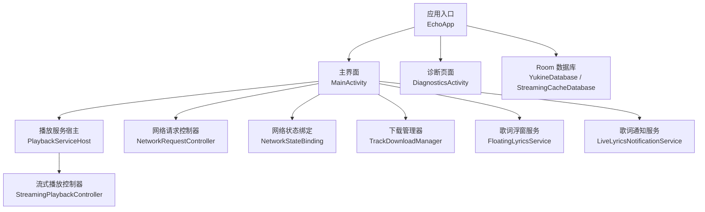
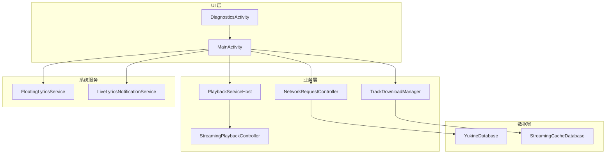
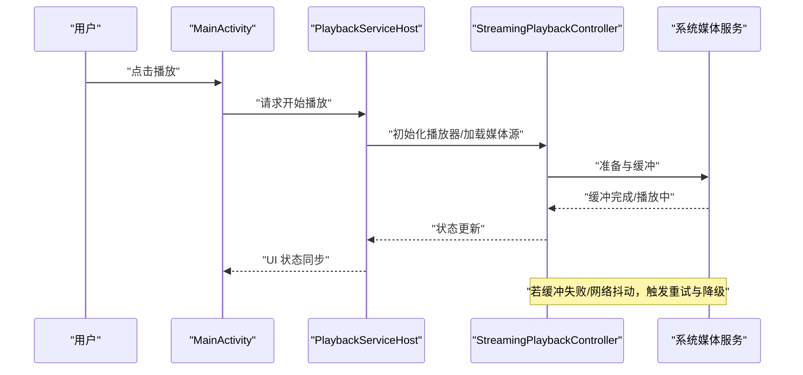
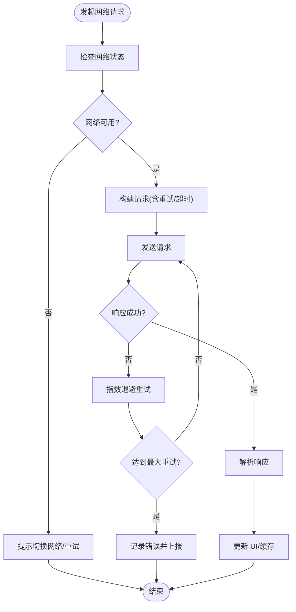
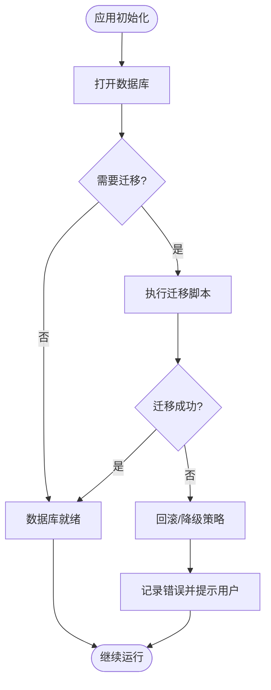
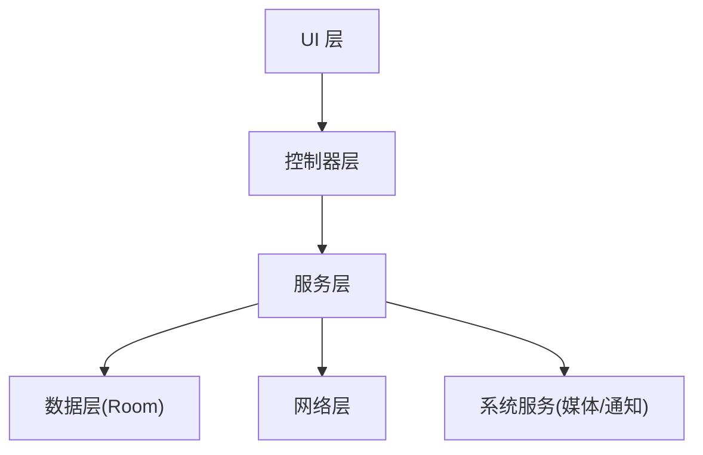

# 故障排除

<cite>
**本文引用的文件**   
- [README.md](file://README.md)
- [EchoApp.kt](file://app/src/main/java/app/yukine/EchoApp.kt)
- [MainActivity.kt](file://app/src/main/java/app/yukine/MainActivity.kt)
- [MainExecutors.kt](file://app/src/main/java/app/yukine/MainExecutors.kt)
- [PlaybackServiceHost.kt](file://app/src/main/java/app/yukine/PlaybackServiceHost.kt)
- [StreamingPlaybackController.kt](file://app/src/main/java/app/yukine/StreamingPlaybackController.kt)
- [NetworkRequestController.kt](file://app/src/main/java/app/yukine/NetworkRequestController.kt)
- [NetworkStateBinding.kt](file://app/src/main/java/app/yukine/NetworkStateBinding.kt)
- [TrackDownloadManager.kt](file://app/src/main/java/app/yukine/TrackDownloadManager.kt)
- [FloatingLyricsService.kt](file://app/src/main/java/app/yukine/FloatingLyricsService.kt)
- [LiveLyricsNotificationService.kt](file://app/src/main/java/app/yukine/LiveLyricsNotificationService.kt)
- [diagnostics/DiagnosticsActivity.kt](file://app/src/main/java/app/yukine/diagnostics/DiagnosticsActivity.kt)
- [AndroidManifest.xml](file://app/src/main/AndroidManifest.xml)
- [build.gradle](file://app/build.gradle)
- [proguard-rules.pro](file://app/proguard-rules.pro)
- [.github/workflows/android.yml](file://.github/workflows/android.yml)
- [.github/workflows/release.yml](file://.github/workflows/release.yml)
- [core/common/src/main/java/app/yukine/common/logging/Logging.kt](file://core/common/src/main/java/app/yukine/common/logging/Logging.kt)
- [feature/data/src/main/java/app/yukine/data/room/YukineDatabase.kt](file://feature/data/src/main/java/app/yukine/data/room/YukineDatabase.kt)
- [feature/streaming/src/main/java/app/yukine/streaming/cache/StreamingCacheDatabase.kt](file://feature/streaming/src/main/java/app/yukine/streaming/cache/StreamingCacheDatabase.kt)
</cite>

## 目录
1. [简介](#简介)
2. [项目结构](#项目结构)
3. [核心组件](#核心组件)
4. [架构总览](#架构总览)
5. [详细组件分析](#详细组件分析)
6. [依赖关系分析](#依赖关系分析)
7. [性能注意事项](#性能注意事项)
8. [故障排除指南](#故障排除指南)
9. [结论](#结论)
10. [附录](#附录)

## 简介
本指南面向 Echo Android 应用的技术支持与开发者，聚焦于常见问题的诊断方法、日志分析技巧、崩溃报告解读，以及播放问题、网络连接问题与数据库异常的处理流程。文档同时覆盖调试工具使用、远程调试配置、性能问题定位、用户反馈收集与错误上报机制、问题复现方法与技术支持流程、社区帮助资源等。

## 项目结构
- 应用入口与初始化：应用启动由主 Application 类负责，完成全局初始化（如日志、线程池、网络、数据库等）。
- UI 层：主界面 Activity 承载导航与状态绑定，提供设置与诊断入口。
- 播放子系统：播放服务宿主与流式播放控制器协调本地与在线播放。
- 网络子系统：请求控制器与网络状态绑定管理连接与重试策略。
- 下载子系统：下载任务管理与失败重试。
- 歌词浮窗与通知服务：后台歌词展示与通知交互。
- 诊断模块：内置诊断页面，便于收集设备信息、版本信息与关键指标。
- 数据层：Room 数据库定义与迁移脚本位于 feature 模块中。
- 构建与发布：Gradle 构建脚本、混淆规则与 CI 工作流。

图表来源
- [EchoApp.kt:1-120](file://app/src/main/java/app/yukine/EchoApp.kt#L1-L120)
- [MainActivity.kt:1-200](file://app/src/main/java/app/yukine/MainActivity.kt#L1-L200)
- [PlaybackServiceHost.kt:1-150](file://app/src/main/java/app/yukine/PlaybackServiceHost.kt#L1-L150)
- [StreamingPlaybackController.kt:1-200](file://app/src/main/java/app/yukine/StreamingPlaybackController.kt#L1-L200)
- [NetworkRequestController.kt:1-150](file://app/src/main/java/app/yukine/NetworkRequestController.kt#L1-L150)
- [NetworkStateBinding.kt:1-120](file://app/src/main/java/app/yukine/NetworkStateBinding.kt#L1-L120)
- [TrackDownloadManager.kt:1-150](file://app/src/main/java/app/yukine/TrackDownloadManager.kt#L1-L150)
- [FloatingLyricsService.kt:1-120](file://app/src/main/java/app/yukine/FloatingLyricsService.kt#L1-L120)
- [LiveLyricsNotificationService.kt:1-120](file://app/src/main/java/app/yukine/LiveLyricsNotificationService.kt#L1-L120)
- [YukineDatabase.kt:1-120](file://feature/data/src/main/java/app/yukine/data/room/YukineDatabase.kt#L1-L120)
- [StreamingCacheDatabase.kt:1-120](file://feature/streaming/src/main/java/app/yukine/streaming/cache/StreamingCacheDatabase.kt#L1-L120)

章节来源
- [README.md:1-100](file://README.md#L1-L100)
- [AndroidManifest.xml:1-200](file://app/src/main/AndroidManifest.xml#L1-L200)
- [build.gradle:1-120](file://app/build.gradle#L1-L120)

## 核心组件
- 应用入口与初始化
  - 负责全局初始化、日志系统、线程池、网络与数据库的装配。
  - 建议关注初始化顺序与异常捕获，避免冷启动崩溃。
- 主界面与诊断
  - 提供设置、导航与诊断入口；诊断页面可导出设备信息、版本与关键指标。
- 播放服务与流式播放
  - 播放服务宿主负责生命周期与跨进程通信；流式播放控制器处理媒体源解析、缓冲与错误恢复。
- 网络与下载
  - 网络请求控制器封装 HTTP 客户端、重试与超时策略；网络状态绑定用于 UI 联动。
  - 下载管理器负责队列、断点续传与失败重试。
- 歌词浮窗与通知
  - 浮窗服务负责悬浮窗口显示与交互；通知服务负责锁屏与通知栏控制。
- 数据层
  - Room 数据库定义与迁移脚本集中管理，确保升级兼容性与一致性。

章节来源
- [EchoApp.kt:1-120](file://app/src/main/java/app/yukine/EchoApp.kt#L1-L120)
- [MainActivity.kt:1-200](file://app/src/main/java/app/yukine/MainActivity.kt#L1-L200)
- [PlaybackServiceHost.kt:1-150](file://app/src/main/java/app/yukine/PlaybackServiceHost.kt#L1-L150)
- [StreamingPlaybackController.kt:1-200](file://app/src/main/java/app/yukine/StreamingPlaybackController.kt#L1-L200)
- [NetworkRequestController.kt:1-150](file://app/src/main/java/app/yukine/NetworkRequestController.kt#L1-L150)
- [NetworkStateBinding.kt:1-120](file://app/src/main/java/app/yukine/NetworkStateBinding.kt#L1-L120)
- [TrackDownloadManager.kt:1-150](file://app/src/main/java/app/yukine/TrackDownloadManager.kt#L1-L150)
- [FloatingLyricsService.kt:1-120](file://app/src/main/java/app/yukine/FloatingLyricsService.kt#L1-L120)
- [LiveLyricsNotificationService.kt:1-120](file://app/src/main/java/app/yukine/LiveLyricsNotificationService.kt#L1-L120)
- [YukineDatabase.kt:1-120](file://feature/data/src/main/java/app/yukine/data/room/YukineDatabase.kt#L1-L120)
- [StreamingCacheDatabase.kt:1-120](file://feature/streaming/src/main/java/app/yukine/streaming/cache/StreamingCacheDatabase.kt#L1-L120)

## 架构总览
整体采用分层与模块化设计：UI 层通过控制器与服务交互，业务逻辑集中在控制器与 UseCase，数据访问通过 Repository 与 Room 数据库，网络与下载由独立模块负责，诊断与日志贯穿各层。

图表来源
- [MainActivity.kt:1-200](file://app/src/main/java/app/yukine/MainActivity.kt#L1-L200)
- [DiagnosticsActivity.kt:1-120](file://app/src/main/java/app/yukine/diagnostics/DiagnosticsActivity.kt#L1-L120)
- [PlaybackServiceHost.kt:1-150](file://app/src/main/java/app/yukine/PlaybackServiceHost.kt#L1-L150)
- [StreamingPlaybackController.kt:1-200](file://app/src/main/java/app/yukine/StreamingPlaybackController.kt#L1-L200)
- [NetworkRequestController.kt:1-150](file://app/src/main/java/app/yukine/NetworkRequestController.kt#L1-L150)
- [TrackDownloadManager.kt:1-150](file://app/src/main/java/app/yukine/TrackDownloadManager.kt#L1-L150)
- [YukineDatabase.kt:1-120](file://feature/data/src/main/java/app/yukine/data/room/YukineDatabase.kt#L1-L120)
- [StreamingCacheDatabase.kt:1-120](file://feature/streaming/src/main/java/app/yukine/streaming/cache/StreamingCacheDatabase.kt#L1-L120)
- [FloatingLyricsService.kt:1-120](file://app/src/main/java/app/yukine/FloatingLyricsService.kt#L1-L120)
- [LiveLyricsNotificationService.kt:1-120](file://app/src/main/java/app/yukine/LiveLyricsNotificationService.kt#L1-L120)

## 详细组件分析

### 播放问题排查
- 典型症状
  - 无法开始播放、频繁卡顿、音画不同步、切换曲目失败、后台播放中断。
- 关键路径
  - 播放服务宿主负责创建/绑定/解绑播放服务，并转发播放命令。
  - 流式播放控制器负责媒体源解析、缓冲策略、错误恢复与状态同步。
- 诊断步骤
  - 检查播放服务是否存活与绑定成功。
  - 查看播放器状态机转换（准备、缓冲、播放、暂停、错误）。
  - 验证网络质量与缓存命中情况。
  - 确认音频焦点与权限（如悬浮窗、通知权限）。
- 常见问题与修复
  - 媒体源不可用或格式不支持：更换源或启用转码/降级策略。
  - 缓冲不足：增大缓冲阈值、降低码率或优化网络。
  - 后台被杀：确保前台服务与通知正确配置。
  - 音频焦点冲突：与其他应用协商焦点释放。

图表来源
- [PlaybackServiceHost.kt:1-150](file://app/src/main/java/app/yukine/PlaybackServiceHost.kt#L1-L150)
- [StreamingPlaybackController.kt:1-200](file://app/src/main/java/app/yukine/StreamingPlaybackController.kt#L1-L200)
- [MainActivity.kt:1-200](file://app/src/main/java/app/yukine/MainActivity.kt#L1-L200)

章节来源
- [PlaybackServiceHost.kt:1-150](file://app/src/main/java/app/yukine/PlaybackServiceHost.kt#L1-L150)
- [StreamingPlaybackController.kt:1-200](file://app/src/main/java/app/yukine/StreamingPlaybackController.kt#L1-L200)
- [MainActivity.kt:1-200](file://app/src/main/java/app/yukine/MainActivity.kt#L1-L200)

### 网络连接问题
- 典型症状
  - 登录失败、列表加载缓慢、播放卡顿、下载中断。
- 关键路径
  - 网络请求控制器统一封装请求、重试、超时与错误分类。
  - 网络状态绑定将连接变化推送至 UI，提示用户切换网络或重试。
- 诊断步骤
  - 检查当前网络类型（Wi-Fi/移动）、DNS 解析与证书链。
  - 观察请求日志（URL、状态码、耗时、重试次数）。
  - 验证代理与防火墙策略。
- 常见问题与修复
  - 超时：调整超时参数与重试退避策略。
  - 证书错误：更新根证书或禁用严格校验（仅测试环境）。
  - 弱网：启用自适应码率与增量加载。

图表来源
- [NetworkRequestController.kt:1-150](file://app/src/main/java/app/yukine/NetworkRequestController.kt#L1-L150)
- [NetworkStateBinding.kt:1-120](file://app/src/main/java/app/yukine/NetworkStateBinding.kt#L1-L120)

章节来源
- [NetworkRequestController.kt:1-150](file://app/src/main/java/app/yukine/NetworkRequestController.kt#L1-L150)
- [NetworkStateBinding.kt:1-120](file://app/src/main/java/app/yukine/NetworkStateBinding.kt#L1-L120)

### 数据库异常处理
- 典型症状
  - 启动卡死、列表空白、搜索无结果、升级后数据丢失。
- 关键路径
  - Room 数据库在应用初始化时创建/迁移，迁移失败会抛出异常。
  - 缓存数据库用于流式播放临时数据，损坏可能导致播放异常。
- 诊断步骤
  - 检查数据库版本与迁移脚本是否匹配。
  - 查看迁移日志与回滚策略。
  - 清理缓存数据库以恢复（谨慎操作）。
- 常见问题与修复
  - 迁移失败：修正迁移脚本或引入兼容性策略。
  - 表结构变更：增加字段默认值与空值兼容。
  - 并发写入竞争：使用事务与读写分离。

图表来源
- [YukineDatabase.kt:1-120](file://feature/data/src/main/java/app/yukine/data/room/YukineDatabase.kt#L1-L120)
- [StreamingCacheDatabase.kt:1-120](file://feature/streaming/src/main/java/app/yukine/streaming/cache/StreamingCacheDatabase.kt#L1-L120)

章节来源
- [YukineDatabase.kt:1-120](file://feature/data/src/main/java/app/yukine/data/room/YukineDatabase.kt#L1-L120)
- [StreamingCacheDatabase.kt:1-120](file://feature/streaming/src/main/java/app/yukine/streaming/cache/StreamingCacheDatabase.kt#L1-L120)

### 下载与缓存问题
- 典型症状
  - 下载进度停滞、重复下载、存储空间不足。
- 关键路径
  - 下载管理器维护任务队列、断点续传与失败重试。
- 诊断步骤
  - 检查存储权限与可用空间。
  - 查看下载任务状态与错误码。
  - 验证目标路径与文件名策略。
- 常见问题与修复
  - 权限不足：引导用户授权。
  - 空间不足：清理旧文件或提示扩容。
  - 网络中断：启用断点续传与自动重试。

章节来源
- [TrackDownloadManager.kt:1-150](file://app/src/main/java/app/yukine/TrackDownloadManager.kt#L1-L150)

### 歌词浮窗与通知
- 典型症状
  - 浮窗不显示、点击无效、通知栏无内容。
- 关键路径
  - 浮窗服务负责悬浮窗口生命周期与事件分发。
  - 通知服务负责锁屏与通知栏控制。
- 诊断步骤
  - 检查悬浮窗与通知权限。
  - 验证服务是否在运行与绑定状态。
  - 查看事件回调与 UI 更新链路。
- 常见问题与修复
  - 权限未授予：引导用户开启。
  - 系统限制：适配不同厂商 ROM 行为。
  - 内存不足：减少浮窗复杂度与资源占用。

章节来源
- [FloatingLyricsService.kt:1-120](file://app/src/main/java/app/yukine/FloatingLyricsService.kt#L1-L120)
- [LiveLyricsNotificationService.kt:1-120](file://app/src/main/java/app/yukine/LiveLyricsNotificationService.kt#L1-L120)

### 诊断与日志
- 诊断页面
  - 提供设备信息、版本、关键指标导出，便于问题复现与支持。
- 日志系统
  - 统一日志接口与分级输出，支持过滤与持久化。
- 线程与执行器
  - 主线程池与 IO 线程池隔离，避免阻塞与死锁。
- 诊断步骤
  - 在诊断页面导出日志与指标。
  - 结合 Logcat 过滤关键字段（如播放、网络、数据库）。
  - 使用线程堆栈定位阻塞点。

章节来源
- [DiagnosticsActivity.kt:1-120](file://app/src/main/java/app/yukine/diagnostics/DiagnosticsActivity.kt#L1-L120)
- [Logging.kt:1-120](file://core/common/src/main/java/app/yukine/common/logging/Logging.kt#L1-L120)
- [MainExecutors.kt:1-120](file://app/src/main/java/app/yukine/MainExecutors.kt#L1-L120)

## 依赖关系分析
- 组件耦合
  - UI 层对控制器与服务存在直接依赖，建议通过接口抽象降低耦合。
  - 播放与网络模块相对独立，通过事件与回调通信。
- 外部依赖
  - Room、HTTP 客户端、系统媒体服务与通知框架。
- 潜在循环依赖
  - 避免 UI 直接访问数据层，应通过控制器与仓库模式。
- 接口契约
  - 明确控制器与服务之间的输入输出与错误码约定。

图表来源
- [MainActivity.kt:1-200](file://app/src/main/java/app/yukine/MainActivity.kt#L1-L200)
- [PlaybackServiceHost.kt:1-150](file://app/src/main/java/app/yukine/PlaybackServiceHost.kt#L1-L150)
- [NetworkRequestController.kt:1-150](file://app/src/main/java/app/yukine/NetworkRequestController.kt#L1-L150)
- [YukineDatabase.kt:1-120](file://feature/data/src/main/java/app/yukine/data/room/YukineDatabase.kt#L1-L120)

章节来源
- [MainActivity.kt:1-200](file://app/src/main/java/app/yukine/MainActivity.kt#L1-L200)
- [PlaybackServiceHost.kt:1-150](file://app/src/main/java/app/yukine/PlaybackServiceHost.kt#L1-L150)
- [NetworkRequestController.kt:1-150](file://app/src/main/java/app/yukine/NetworkRequestController.kt#L1-L150)
- [YukineDatabase.kt:1-120](file://feature/data/src/main/java/app/yukine/data/room/YukineDatabase.kt#L1-L120)

## 性能注意事项
- 启动时间
  - 延迟初始化非关键路径，避免主线程阻塞。
- 内存占用
  - 控制图片与歌词资源大小，及时释放不再使用的对象。
- CPU 与 IO
  - 批量写入数据库，避免频繁小事务。
  - 网络请求合并与去重，减少重复请求。
- 电池与后台
  - 合理使用前台服务与通知，避免过度唤醒。

[本节为通用指导，无需特定文件引用]

## 故障排除指南

### 日志分析技巧
- 日志级别与过滤
  - 使用诊断页面导出日志，结合 Logcat 按标签与级别过滤。
- 关键上下文
  - 记录用户操作序列、网络状态、播放状态与数据库版本。
- 堆栈与线程
  - 捕获主线程阻塞与 IO 线程等待，定位死锁与竞态条件。

章节来源
- [DiagnosticsActivity.kt:1-120](file://app/src/main/java/app/yukine/diagnostics/DiagnosticsActivity.kt#L1-L120)
- [Logging.kt:1-120](file://core/common/src/main/java/app/yukine/common/logging/Logging.kt#L1-L120)

### 崩溃报告解读
- 报告来源
  - 系统崩溃日志与应用内异常上报。
- 关键信息
  - 异常类型、堆栈轨迹、设备型号、系统版本与应用版本。
- 复现场景
  - 关联用户操作与前后日志，还原触发路径。

章节来源
- [DiagnosticsActivity.kt:1-120](file://app/src/main/java/app/yukine/diagnostics/DiagnosticsActivity.kt#L1-L120)

### 播放问题排查清单
- 检查播放服务状态与绑定。
- 验证媒体源可用性与格式支持。
- 调整缓冲策略与码率。
- 确认音频焦点与权限。
- 查看网络质量与缓存命中率。

章节来源
- [PlaybackServiceHost.kt:1-150](file://app/src/main/java/app/yukine/PlaybackServiceHost.kt#L1-L150)
- [StreamingPlaybackController.kt:1-200](file://app/src/main/java/app/yukine/StreamingPlaybackController.kt#L1-L200)

### 网络连接问题排查清单
- 检查网络类型与 DNS 解析。
- 查看请求日志与状态码。
- 调整超时与重试策略。
- 验证代理与防火墙。

章节来源
- [NetworkRequestController.kt:1-150](file://app/src/main/java/app/yukine/NetworkRequestController.kt#L1-L150)
- [NetworkStateBinding.kt:1-120](file://app/src/main/java/app/yukine/NetworkStateBinding.kt#L1-L120)

### 数据库异常处理清单
- 核对数据库版本与迁移脚本。
- 检查迁移日志与回滚策略。
- 清理缓存数据库以恢复（谨慎操作）。
- 使用事务与读写分离避免并发问题。

章节来源
- [YukineDatabase.kt:1-120](file://feature/data/src/main/java/app/yukine/data/room/YukineDatabase.kt#L1-L120)
- [StreamingCacheDatabase.kt:1-120](file://feature/streaming/src/main/java/app/yukine/streaming/cache/StreamingCacheDatabase.kt#L1-L120)

### 调试工具使用与远程调试配置
- 本地调试
  - 使用 Android Studio 进行断点、变量监视与热重载。
- 远程调试
  - 通过 USB 或 Wi-Fi 连接设备进行调试。
- 性能分析
  - 使用 Profiler 分析 CPU、内存与网络。
- 构建与混淆
  - 关闭混淆或使用映射文件定位堆栈。

章节来源
- [build.gradle:1-120](file://app/build.gradle#L1-L120)
- [proguard-rules.pro:1-120](file://app/proguard-rules.pro#L1-L120)

### 用户反馈收集与错误上报机制
- 反馈入口
  - 在设置或诊断页面提供反馈表单与日志导出。
- 上报策略
  - 异步上报、去重与敏感信息脱敏。
- 闭环跟踪
  - 生成问题编号并与日志关联，便于追踪与复现。

章节来源
- [DiagnosticsActivity.kt:1-120](file://app/src/main/java/app/yukine/diagnostics/DiagnosticsActivity.kt#L1-L120)

### 问题复现方法
- 环境信息
  - 记录设备型号、系统版本、应用版本与网络环境。
- 操作步骤
  - 详细描述用户操作序列与预期结果。
- 辅助材料
  - 附带日志、截图与视频，提高复现效率。

章节来源
- [DiagnosticsActivity.kt:1-120](file://app/src/main/java/app/yukine/diagnostics/DiagnosticsActivity.kt#L1-L120)

### 技术支持流程与社区帮助资源
- 内部流程
  - 接收反馈 -> 分类与优先级 -> 复现与定位 -> 修复与回归 -> 发布与公告。
- 社区资源
  - 参考 README 中的贡献指南与问题模板。
  - 参与讨论区与提交 Issue。

章节来源
- [README.md:1-100](file://README.md#L1-L100)

## 结论
通过系统化地梳理播放、网络与数据库等关键子系统的故障排除流程，并结合日志分析与诊断工具，可以显著提升问题定位效率与用户体验。建议在持续集成中纳入稳定性门禁与回归测试，完善错误上报与反馈闭环，形成从发现到修复的全流程保障。

## 附录
- 构建与发布相关
  - CI 工作流用于自动化构建、测试与发布，确保版本一致性与质量门禁。

章节来源
- [.github/workflows/android.yml:1-120](file://.github/workflows/android.yml#L1-L120)
- [.github/workflows/release.yml:1-120](file://.github/workflows/release.yml#L1-L120)