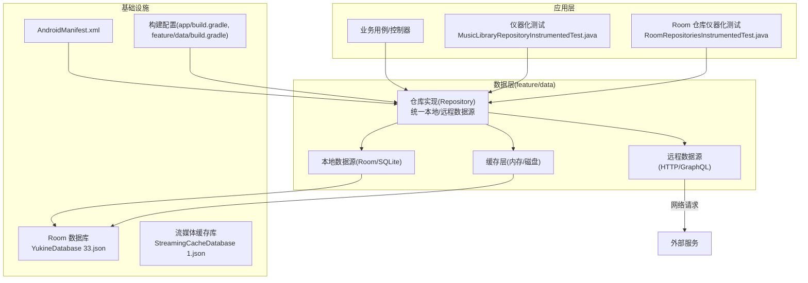
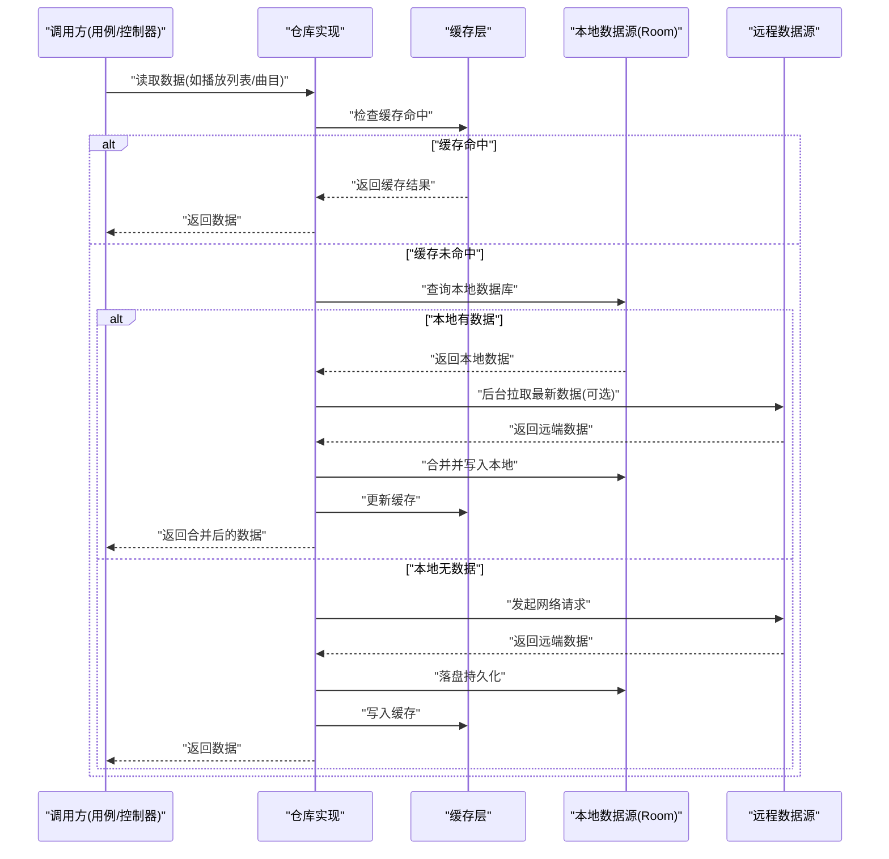
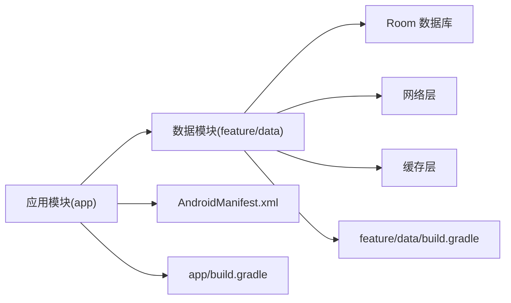

# 仓库模式实现

<cite>
**本文引用的文件**   
- [MusicLibraryRepositoryInstrumentedTest.java](file://app/src/androidTest/java/app/yukine/data/MusicLibraryRepositoryInstrumentedTest.java)
- [RoomRepositoriesInstrumentedTest.java](file://app/src/androidTest/java/app/yukine/data/RoomRepositoriesInstrumentedTest.java)
- [StreamingCacheDatabase.json](file://app/schemas/app.yukine.streaming.cache.StreamingCacheDatabase/1.json)
- [YukineDatabase.json](file://feature/data/schemas/app.yukine.data.room.YukineDatabase/33.json)
- [build.gradle](file://app/build.gradle)
- [build.gradle](file://feature/data/build.gradle)
- [AndroidManifest.xml](file://app/src/main/AndroidManifest.xml)
</cite>

## 目录
1. [简介](#简介)
2. [项目结构](#项目结构)
3. [核心组件](#核心组件)
4. [架构总览](#架构总览)
5. [详细组件分析](#详细组件分析)
6. [依赖关系分析](#依赖关系分析)
7. [性能考量](#性能考量)
8. [故障排查指南](#故障排查指南)
9. [结论](#结论)
10. [附录](#附录)

## 简介
本技术文档围绕 Echo Android 仓库模式（Repository Pattern）在数据层的设计与落地，系统性阐述以下要点：
- 设计理念与职责边界：通过 Repository 抽象统一本地与远程数据源，向上提供一致的数据访问接口。
- 接口设计与类职责划分：定义领域级数据聚合能力，屏蔽底层存储细节。
- 数据抽象层实现：Room 数据库、缓存、网络等数据源的统一接入。
- 数据一致性、错误处理与异步策略：保证跨源数据的一致性、可恢复性与用户体验。
- 缓存集成与扩展指南：如何新增自定义数据源并无缝接入现有仓库体系。

## 项目结构
仓库模式主要位于 feature/data 模块中，配合 app 层的用例与测试进行验证；同时使用 Room 作为本地持久化方案，并通过 schema 文件管理版本演进。

图表来源
- [MusicLibraryRepositoryInstrumentedTest.java](file://app/src/androidTest/java/app/yukine/data/MusicLibraryRepositoryInstrumentedTest.java)
- [RoomRepositoriesInstrumentedTest.java](file://app/src/androidTest/java/app/yukine/data/RoomRepositoriesInstrumentedTest.java)
- [YukineDatabase.json](file://feature/data/schemas/app.yukine.data.room.YukineDatabase/33.json)
- [StreamingCacheDatabase.json](file://app/schemas/app.yukine.streaming.cache.StreamingCacheDatabase/1.json)
- [AndroidManifest.xml](file://app/src/main/AndroidManifest.xml)
- [build.gradle](file://app/build.gradle)
- [build.gradle](file://feature/data/build.gradle)

章节来源
- [MusicLibraryRepositoryInstrumentedTest.java](file://app/src/androidTest/java/app/yukine/data/MusicLibraryRepositoryInstrumentedTest.java)
- [RoomRepositoriesInstrumentedTest.java](file://app/src/androidTest/java/app/yukine/data/RoomRepositoriesInstrumentedTest.java)
- [YukineDatabase.json](file://feature/data/schemas/app.yukine.data.room.YukineDatabase/33.json)
- [StreamingCacheDatabase.json](file://app/schemas/app.yukine.streaming.cache.StreamingCacheDatabase/1.json)
- [AndroidManifest.xml](file://app/src/main/AndroidManifest.xml)
- [build.gradle](file://app/build.gradle)
- [build.gradle](file://feature/data/build.gradle)

## 核心组件
- 仓库接口与实现
  - 面向领域暴露统一的读写与查询方法，屏蔽本地/远程差异。
  - 负责数据聚合、去重、合并与转换，为上层用例提供稳定契约。
- 数据源抽象
  - 本地数据源：基于 Room 的实体映射与 DAO 操作，提供强类型与事务保障。
  - 远程数据源：封装网络请求、鉴权、重试与降级策略。
  - 缓存层：对热点数据进行短期或长期缓存，降低延迟与网络开销。
- 数据一致性
  - 写路径优先更新本地，再触发远端同步；读路径遵循“缓存→本地→远程”的优先级。
  - 冲突解决策略：时间戳、版本号或业务规则决定最终一致性。
- 错误处理
  - 将网络异常、IO 异常、校验失败等统一转换为领域错误模型，便于 UI 展示与重试。
- 异步与并发
  - 使用协程/线程池执行耗时任务，避免阻塞主线程；支持背压与取消。

章节来源
- [MusicLibraryRepositoryInstrumentedTest.java](file://app/src/androidTest/java/app/yukine/data/MusicLibraryRepositoryInstrumentedTest.java)
- [RoomRepositoriesInstrumentedTest.java](file://app/src/androidTest/java/app/yukine/data/RoomRepositoriesInstrumentedTest.java)

## 架构总览
仓库模式在数据层的核心目标是“单一事实来源 + 多源聚合”。下图展示了典型的数据流向与交互。

图表来源
- [MusicLibraryRepositoryInstrumentedTest.java](file://app/src/androidTest/java/app/yukine/data/MusicLibraryRepositoryInstrumentedTest.java)
- [RoomRepositoriesInstrumentedTest.java](file://app/src/androidTest/java/app/yukine/data/RoomRepositoriesInstrumentedTest.java)
- [YukineDatabase.json](file://feature/data/schemas/app.yukine.data.room.YukineDatabase/33.json)
- [StreamingCacheDatabase.json](file://app/schemas/app.yukine.streaming.cache.StreamingCacheDatabase/1.json)

## 详细组件分析

### 仓库接口设计
- 目标
  - 以领域为中心组织接口，而非按存储方式划分。
  - 明确输入输出契约，包含分页、排序、过滤参数与返回状态。
- 关键原则
  - 只暴露必要方法，隐藏内部数据源选择逻辑。
  - 返回值采用不可变数据结构，减少副作用。
  - 错误以领域语义表达，不泄露底层异常栈。

章节来源
- [MusicLibraryRepositoryInstrumentedTest.java](file://app/src/androidTest/java/app/yukine/data/MusicLibraryRepositoryInstrumentedTest.java)
- [RoomRepositoriesInstrumentedTest.java](file://app/src/androidTest/java/app/yukine/data/RoomRepositoriesInstrumentedTest.java)

### 本地数据源（Room）
- 角色
  - 作为权威本地事实来源，承载离线可用性与快速读取。
- 关键点
  - 实体与索引设计需兼顾查询性能与写入成本。
  - 迁移脚本由 schema 驱动，确保升级平滑。
  - 复杂查询尽量下推到 SQL，减少内存压力。

章节来源
- [YukineDatabase.json](file://feature/data/schemas/app.yukine.data.room.YukineDatabase/33.json)
- [RoomRepositoriesInstrumentedTest.java](file://app/src/androidTest/java/app/yukine/data/RoomRepositoriesInstrumentedTest.java)

### 远程数据源
- 角色
  - 获取最新数据、执行写操作、处理鉴权与会话。
- 关键点
  - 统一错误码与重试退避策略。
  - 幂等性设计，避免重复提交导致数据不一致。
  - 大对象分块传输与断点续传（如适用）。

章节来源
- [MusicLibraryRepositoryInstrumentedTest.java](file://app/src/androidTest/java/app/yukine/data/MusicLibraryRepositoryInstrumentedTest.java)

### 缓存层
- 角色
  - 缩短冷启动与首屏加载时延，提升滚动流畅度。
- 关键点
  - 多级缓存：内存 LRU + 磁盘持久化。
  - 失效策略：TTL、主动失效、事件驱动失效。
  - 与本地数据源保持一致性：写后更新缓存，读前检查有效性。

章节来源
- [StreamingCacheDatabase.json](file://app/schemas/app.yukine.streaming.cache.StreamingCacheDatabase/1.json)
- [MusicLibraryRepositoryInstrumentedTest.java](file://app/src/androidTest/java/app/yukine/data/MusicLibraryRepositoryInstrumentedTest.java)

### 数据聚合与一致性
- 聚合流程
  - 合并多个数据源的结果，去重并按业务规则排序。
  - 增量同步：仅拉取变更部分，减少带宽与 CPU 消耗。
- 一致性策略
  - 写路径：先本地后远端，失败回滚或补偿。
  - 读路径：缓存优先，本地次之，远端兜底。
  - 冲突解决：以时间戳/版本号为准，必要时提示用户。

章节来源
- [RoomRepositoriesInstrumentedTest.java](file://app/src/androidTest/java/app/yukine/data/RoomRepositoriesInstrumentedTest.java)
- [MusicLibraryRepositoryInstrumentedTest.java](file://app/src/androidTest/java/app/yukine/data/MusicLibraryRepositoryInstrumentedTest.java)

### 错误处理策略
- 分类
  - 网络错误：超时、鉴权失败、服务端错误。
  - IO 错误：磁盘损坏、权限不足。
  - 业务错误：数据不完整、约束冲突。
- 处理
  - 统一错误模型，携带上下文与可重试标志。
  - 用户可见的错误信息友好化，并提供重试入口。
  - 记录诊断日志，便于线上问题定位。

章节来源
- [MusicLibraryRepositoryInstrumentedTest.java](file://app/src/androidTest/java/app/yukine/data/MusicLibraryRepositoryInstrumentedTest.java)

### 异步操作处理
- 调度
  - 使用协程/线程池执行 I/O 密集任务，避免阻塞主线程。
  - 支持取消与背压，防止资源泄漏。
- 生命周期
  - 与页面/组件生命周期绑定，避免僵尸任务。
  - 后台任务使用 WorkManager 或前台服务（视场景而定）。

章节来源
- [MusicLibraryRepositoryInstrumentedTest.java](file://app/src/androidTest/java/app/yukine/data/MusicLibraryRepositoryInstrumentedTest.java)

### 扩展指南：新增自定义数据源
- 步骤
  - 定义数据源接口与实现，遵循统一契约。
  - 在仓库中注册新数据源，并在聚合逻辑中纳入。
  - 编写单元测试与仪器化测试覆盖关键路径。
  - 更新 schema 与迁移脚本（如涉及持久化）。
- 注意事项
  - 保持幂等与可重试，避免副作用。
  - 控制并发与资源占用，避免影响主线程体验。
  - 做好监控与埋点，评估性能与稳定性。

章节来源
- [RoomRepositoriesInstrumentedTest.java](file://app/src/androidTest/java/app/yukine/data/RoomRepositoriesInstrumentedTest.java)
- [YukineDatabase.json](file://feature/data/schemas/app.yukine.data.room.YukineDatabase/33.json)

## 依赖关系分析
仓库层依赖本地与远程数据源，受构建配置与清单文件约束。

图表来源
- [AndroidManifest.xml](file://app/src/main/AndroidManifest.xml)
- [build.gradle](file://app/build.gradle)
- [build.gradle](file://feature/data/build.gradle)

章节来源
- [AndroidManifest.xml](file://app/src/main/AndroidManifest.xml)
- [build.gradle](file://app/build.gradle)
- [build.gradle](file://feature/data/build.gradle)

## 性能考量
- 查询优化
  - 合理索引与投影字段，避免全表扫描。
  - 分页与懒加载，减少一次性加载量。
- 缓存命中率
  - 热点数据常驻内存，冷数据下沉磁盘。
  - 失效策略与预取结合，平衡一致性与性能。
- 网络优化
  - 连接复用、压缩与批量请求。
  - 指数退避与熔断，保护后端与客户端。
- 内存与 GC
  - 避免大对象频繁创建，复用缓冲区。
  - 及时释放资源，避免内存泄漏。

[本节为通用指导，无需特定文件引用]

## 故障排查指南
- 常见问题
  - 数据不同步：检查写路径顺序与补偿机制。
  - 缓存脏读：确认失效时机与一致性策略。
  - 崩溃与卡顿：关注主线程阻塞与异常堆栈。
- 定位手段
  - 启用调试日志与指标上报。
  - 使用仪器化测试复现问题，逐步缩小范围。
  - 对比 schema 版本与迁移脚本，确认数据完整性。

章节来源
- [MusicLibraryRepositoryInstrumentedTest.java](file://app/src/androidTest/java/app/yukine/data/MusicLibraryRepositoryInstrumentedTest.java)
- [RoomRepositoriesInstrumentedTest.java](file://app/src/androidTest/java/app/yukine/data/RoomRepositoriesInstrumentedTest.java)
- [YukineDatabase.json](file://feature/data/schemas/app.yukine.data.room.YukineDatabase/33.json)

## 结论
仓库模式在 Echo Android 数据层提供了清晰的职责边界与稳定的数据契约。通过统一抽象、缓存集成、一致的异步与错误处理策略，显著提升了可维护性与用户体验。建议在新功能开发中严格遵循上述设计原则，并结合测试与监控持续优化。

[本节为总结性内容，无需特定文件引用]

## 附录
- 术语
  - 仓库：统一数据访问的领域级接口与实现。
  - 数据源：具体数据的提供者，如本地数据库、网络服务等。
  - 缓存：用于加速读取的中间存储层。
- 参考
  - 相关测试用例可作为行为契约与回归保障。
  - Schema 文件用于追踪数据库结构与版本演进。

[本节为补充说明，无需特定文件引用]