# 数据同步机制

<cite>
**本文引用的文件**   
- [EchoApp.kt](file://app/src/main/java/app/yukine/EchoApp.kt)
- [MainExecutors.kt](file://app/src/main/java/app/yukine/MainExecutors.kt)
- [StreamingPlaybackTaskScheduler.java](file://app/src/main/java/app/yukine/StreamingPlaybackTaskScheduler.java)
- [IdentityEnhancementWorker.kt](file://app/src/main/java/app/yukine/IdentityEnhancementWorker.kt)
- [IdentityBackfillWorker.kt](file://app/src/main/java/app/yukine/IdentityBackfillWorker.kt)
- [FavoriteSyncWorker.kt](file://app/src/main/java/app/yukine/FavoriteSyncWorker.kt)
- [KugouPlaylistSyncWorker.kt](file://app/src/main/java/app/yukine/KugouPlaylistSyncWorker.kt)
- [LibraryMultiSourceSync.kt](file://app/src/main/java/app/yukine/LibraryMultiSourceSync.kt)
- [MusicLibraryNetworkOperations.kt](file://app/src/main/java/app/yukine/MusicLibraryNetworkOperations.kt)
- [ChromaprintNativeInstrumentedTest.kt](file://app/src/androidTest/java/app/yukine/fingerprint/ChromaprintNativeInstrumentedTest.kt)
- [CanonicalLibraryDedupInstrumentedTest.kt](file://app/src/androidTest/java/app/yukine/CanonicalLibraryDedupInstrumentedTest.kt)
- [TrackListStatePublisher.kt](file://app/src/main/java/app/yukine/TrackListStatePublisher.kt)
- [StreamingRepositoryProvider.kt](file://app/src/main/java/app/yukine/StreamingRepositoryProvider.kt)
- [core/model/src/main/java/app/yukine/fingerprint/FingerprintEngine.kt](file://core/model/src/main/java/app/yukine/fingerprint/FingerprintEngine.kt)
- [feature/data/src/main/java/app/yukine/data/room/YukineDatabase.kt](file://feature/data/src/main/java/app/yukine/data/room/YukineDatabase.kt)
</cite>

## 目录
1. [简介](#简介)
2. [项目结构](#项目结构)
3. [核心组件](#核心组件)
4. [架构总览](#架构总览)
5. [详细组件分析](#详细组件分析)
6. [依赖关系分析](#依赖关系分析)
7. [性能考虑](#性能考虑)
8. [故障排除指南](#故障排除指南)
9. [结论](#结论)
10. [附录](#附录)

## 简介
本技术文档聚焦 Echo Android 的数据同步机制，围绕以下目标展开：
- 音乐库去重算法与身份识别增强引擎
- 记录关系存储的数据同步策略
- 后台任务调度、增量同步与冲突解决
- 元数据填充、音频指纹匹配与批量处理流程
- 同步状态监控、失败重试与断点续传
- 性能优化策略与故障排除

## 项目结构
本项目采用多模块分层组织，应用层负责 UI 与编排，核心模型与数据层提供领域实体、数据库与网络能力。与数据同步相关的关键位置包括：
- 应用初始化与执行器：用于启动后台任务与调度
- 同步 Worker：实现各类增量/全量同步任务
- 指纹与去重：音频指纹计算与库级去重测试覆盖
- 数据库与仓库：Room 持久化与仓库提供者
- 状态发布：向 UI 暴露同步进度与结果

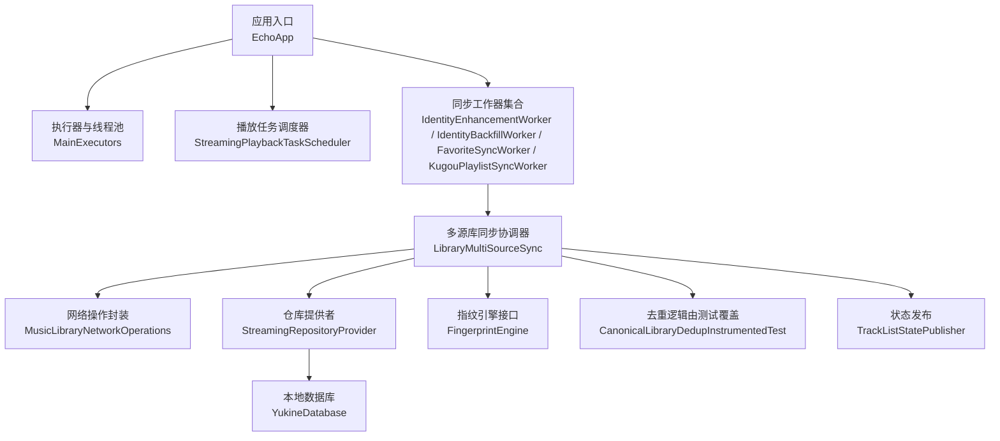

图表来源
- [EchoApp.kt](file://app/src/main/java/app/yukine/EchoApp.kt)
- [MainExecutors.kt](file://app/src/main/java/app/yukine/MainExecutors.kt)
- [StreamingPlaybackTaskScheduler.java](file://app/src/main/java/app/yukine/StreamingPlaybackTaskScheduler.java)
- [IdentityEnhancementWorker.kt](file://app/src/main/java/app/yukine/IdentityEnhancementWorker.kt)
- [IdentityBackfillWorker.kt](file://app/src/main/java/app/yukine/IdentityBackfillWorker.kt)
- [FavoriteSyncWorker.kt](file://app/src/main/java/app/yukine/FavoriteSyncWorker.kt)
- [KugouPlaylistSyncWorker.kt](file://app/src/main/java/app/yukine/KugouPlaylistSyncWorker.kt)
- [LibraryMultiSourceSync.kt](file://app/src/main/java/app/yukine/LibraryMultiSourceSync.kt)
- [MusicLibraryNetworkOperations.kt](file://app/src/main/java/app/yukine/MusicLibraryNetworkOperations.kt)
- [StreamingRepositoryProvider.kt](file://app/src/main/java/app/yukine/StreamingRepositoryProvider.kt)
- [core/model/src/main/java/app/yukine/fingerprint/FingerprintEngine.kt](file://core/model/src/main/java/app/yukine/fingerprint/FingerprintEngine.kt)
- [feature/data/src/main/java/app/yukine/data/room/YukineDatabase.kt](file://feature/data/src/main/java/app/yukine/data/room/YukineDatabase.kt)

章节来源
- [EchoApp.kt](file://app/src/main/java/app/yukine/EchoApp.kt)
- [MainExecutors.kt](file://app/src/main/java/app/yukine/MainExecutors.kt)
- [StreamingPlaybackTaskScheduler.java](file://app/src/main/java/app/yukine/StreamingPlaybackTaskScheduler.java)
- [IdentityEnhancementWorker.kt](file://app/src/main/java/app/yukine/IdentityEnhancementWorker.kt)
- [IdentityBackfillWorker.kt](file://app/src/main/java/app/yukine/IdentityBackfillWorker.kt)
- [FavoriteSyncWorker.kt](file://app/src/main/java/app/yukine/FavoriteSyncWorker.kt)
- [KugouPlaylistSyncWorker.kt](file://app/src/main/java/app/yukine/KugouPlaylistSyncWorker.kt)
- [LibraryMultiSourceSync.kt](file://app/src/main/java/app/yukine/LibraryMultiSourceSync.kt)
- [MusicLibraryNetworkOperations.kt](file://app/src/main/java/app/yukine/MusicLibraryNetworkOperations.kt)
- [StreamingRepositoryProvider.kt](file://app/src/main/java/app/yukine/StreamingRepositoryProvider.kt)
- [core/model/src/main/java/app/yukine/fingerprint/FingerprintEngine.kt](file://core/model/src/main/java/app/yukine/fingerprint/FingerprintEngine.kt)
- [feature/data/src/main/java/app/yukine/data/room/YukineDatabase.kt](file://feature/data/src/main/java/app/yukine/data/room/YukineDatabase.kt)

## 核心组件
- 应用初始化与执行器
  - 负责全局线程池与协程调度器的创建与生命周期管理，为同步任务提供并发控制与资源隔离。
- 同步工作器
  - 身份识别增强：对缺失或弱标识的记录进行补全与增强。
  - 身份回填：基于指纹与规则回填历史记录的关联信息。
  - 收藏同步：跨源收藏数据的增删改合并。
  - 歌单同步：第三方平台歌单到本地的增量同步。
- 多源库同步协调器
  - 统一编排不同来源的增量/全量同步，协调去重、冲突解决与批量写入。
- 网络操作封装
  - 抽象网络请求、分页拉取、错误分类与重试边界。
- 仓库提供者
  - 提供 Room 数据库访问与事务边界，支持批量插入/更新/删除。
- 指纹引擎接口
  - 定义音频指纹生成与比对能力，供去重与身份识别使用。
- 状态发布
  - 将同步进度、成功/失败事件以流式方式推送给 UI。

章节来源
- [MainExecutors.kt](file://app/src/main/java/app/yukine/MainExecutors.kt)
- [IdentityEnhancementWorker.kt](file://app/src/main/java/app/yukine/IdentityEnhancementWorker.kt)
- [IdentityBackfillWorker.kt](file://app/src/main/java/app/yukine/IdentityBackfillWorker.kt)
- [FavoriteSyncWorker.kt](file://app/src/main/java/app/yukine/FavoriteSyncWorker.kt)
- [KugouPlaylistSyncWorker.kt](file://app/src/main/java/app/yukine/KugouPlaylistSyncWorker.kt)
- [LibraryMultiSourceSync.kt](file://app/src/main/java/app/yukine/LibraryMultiSourceSync.kt)
- [MusicLibraryNetworkOperations.kt](file://app/src/main/java/app/yukine/MusicLibraryNetworkOperations.kt)
- [StreamingRepositoryProvider.kt](file://app/src/main/java/app/yukine/StreamingRepositoryProvider.kt)
- [core/model/src/main/java/app/yukine/fingerprint/FingerprintEngine.kt](file://core/model/src/main/java/app/yukine/fingerprint/FingerprintEngine.kt)
- [TrackListStatePublisher.kt](file://app/src/main/java/app/yukine/TrackListStatePublisher.kt)

## 架构总览
整体同步架构遵循“编排-执行-持久化-发布”的分层模式：
- 编排层：工作器与协调器负责任务拆分、顺序与并发度控制。
- 执行层：网络拉取、指纹计算、规则匹配、冲突决策。
- 持久化层：通过仓库提供者与数据库完成批量写入与事务控制。
- 发布层：状态发布器将进度与结果推送到 UI。

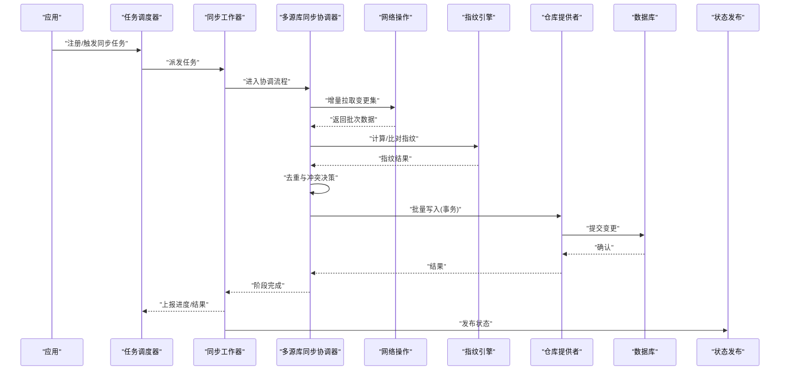

图表来源
- [StreamingPlaybackTaskScheduler.java](file://app/src/main/java/app/yukine/StreamingPlaybackTaskScheduler.java)
- [IdentityEnhancementWorker.kt](file://app/src/main/java/app/yukine/IdentityEnhancementWorker.kt)
- [LibraryMultiSourceSync.kt](file://app/src/main/java/app/yukine/LibraryMultiSourceSync.kt)
- [MusicLibraryNetworkOperations.kt](file://app/src/main/java/app/yukine/MusicLibraryNetworkOperations.kt)
- [core/model/src/main/java/app/yukine/fingerprint/FingerprintEngine.kt](file://core/model/src/main/java/app/yukine/fingerprint/FingerprintEngine.kt)
- [StreamingRepositoryProvider.kt](file://app/src/main/java/app/yukine/StreamingRepositoryProvider.kt)
- [feature/data/src/main/java/app/yukine/data/room/YukineDatabase.kt](file://feature/data/src/main/java/app/yukine/data/room/YukineDatabase.kt)
- [TrackListStatePublisher.kt](file://app/src/main/java/app/yukine/TrackListStatePublisher.kt)

## 详细组件分析

### 音乐库去重算法
- 设计要点
  - 基于指纹与元数据双重校验：优先使用指纹相似度判定同一曲目，辅以标题、艺术家、时长等元数据进行二次确认。
  - 规范化键生成：对标题、艺术家、专辑名等进行大小写与空白归一化，降低误判。
  - 阈值策略：指纹相似度超过阈值视为重复；低于阈值但元数据高度一致时仍可能标记为候选重复，交由人工或更高阶规则裁决。
- 实现路径参考
  - 指纹计算与比对接口位于指纹引擎中，去重逻辑在库同步流程中被调用，并通过集成测试验证正确性。
- 复杂度与优化
  - 时间复杂度：指纹计算 O(N·L)，N 为样本数，L 为帧数；比对可采用分桶+近似最近邻加速。
  - 空间复杂度：指纹缓存与索引占用内存，建议按批次加载与淘汰。
- 流程图

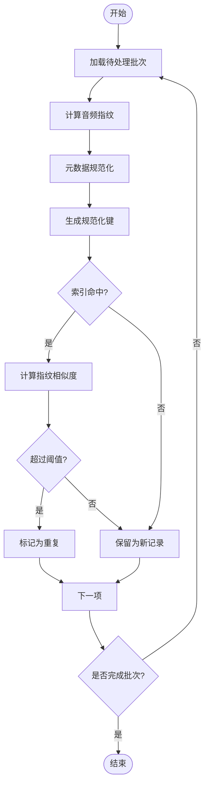

图表来源
- [core/model/src/main/java/app/yukine/fingerprint/FingerprintEngine.kt](file://core/model/src/main/java/app/yukine/fingerprint/FingerprintEngine.kt)
- [CanonicalLibraryDedupInstrumentedTest.kt](file://app/src/androidTest/java/app/yukine/CanonicalLibraryDedupInstrumentedTest.kt)

章节来源
- [core/model/src/main/java/app/yukine/fingerprint/FingerprintEngine.kt](file://core/model/src/main/java/app/yukine/fingerprint/FingerprintEngine.kt)
- [CanonicalLibraryDedupInstrumentedTest.kt](file://app/src/androidTest/java/app/yukine/CanonicalLibraryDedupInstrumentedTest.kt)

### 身份识别增强引擎
- 职责
  - 针对缺失或弱标识的记录，利用指纹、外部元数据与规则进行增强，提升唯一性与可检索性。
- 关键步骤
  - 扫描弱标识记录
  - 提取指纹并查询指纹库
  - 匹配候选并打分排序
  - 选择最优匹配并回填
- 时序图

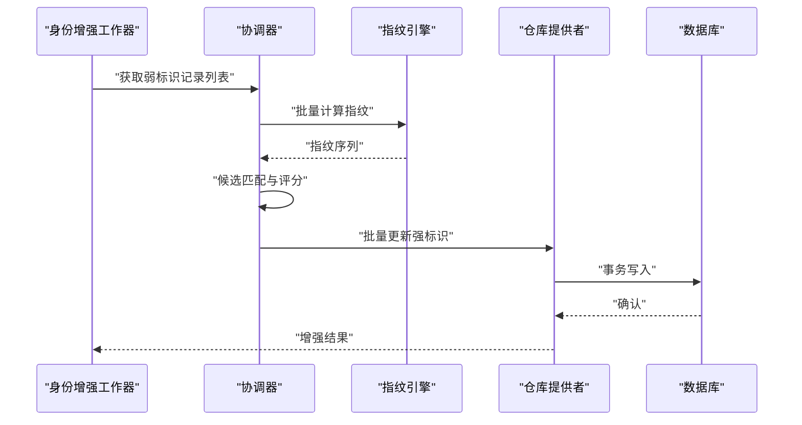

图表来源
- [IdentityEnhancementWorker.kt](file://app/src/main/java/app/yukine/IdentityEnhancementWorker.kt)
- [LibraryMultiSourceSync.kt](file://app/src/main/java/app/yukine/LibraryMultiSourceSync.kt)
- [core/model/src/main/java/app/yukine/fingerprint/FingerprintEngine.kt](file://core/model/src/main/java/app/yukine/fingerprint/FingerprintEngine.kt)
- [StreamingRepositoryProvider.kt](file://app/src/main/java/app/yukine/StreamingRepositoryProvider.kt)
- [feature/data/src/main/java/app/yukine/data/room/YukineDatabase.kt](file://feature/data/src/main/java/app/yukine/data/room/YukineDatabase.kt)

章节来源
- [IdentityEnhancementWorker.kt](file://app/src/main/java/app/yukine/IdentityEnhancementWorker.kt)
- [LibraryMultiSourceSync.kt](file://app/src/main/java/app/yukine/LibraryMultiSourceSync.kt)
- [core/model/src/main/java/app/yukine/fingerprint/FingerprintEngine.kt](file://core/model/src/main/java/app/yukine/fingerprint/FingerprintEngine.kt)
- [StreamingRepositoryProvider.kt](file://app/src/main/java/app/yukine/StreamingRepositoryProvider.kt)
- [feature/data/src/main/java/app/yukine/data/room/YukineDatabase.kt](file://feature/data/src/main/java/app/yukine/data/room/YukineDatabase.kt)

### 记录关系存储的数据同步策略
- 策略概述
  - 以主键/规范化键为锚点，采用 Upsert 语义进行增量同步。
  - 关系表（如收藏、歌单-曲目）采用差异对比后批量落盘，避免全量重建。
  - 事务边界包裹整批写入，保证一致性。
- 流程图

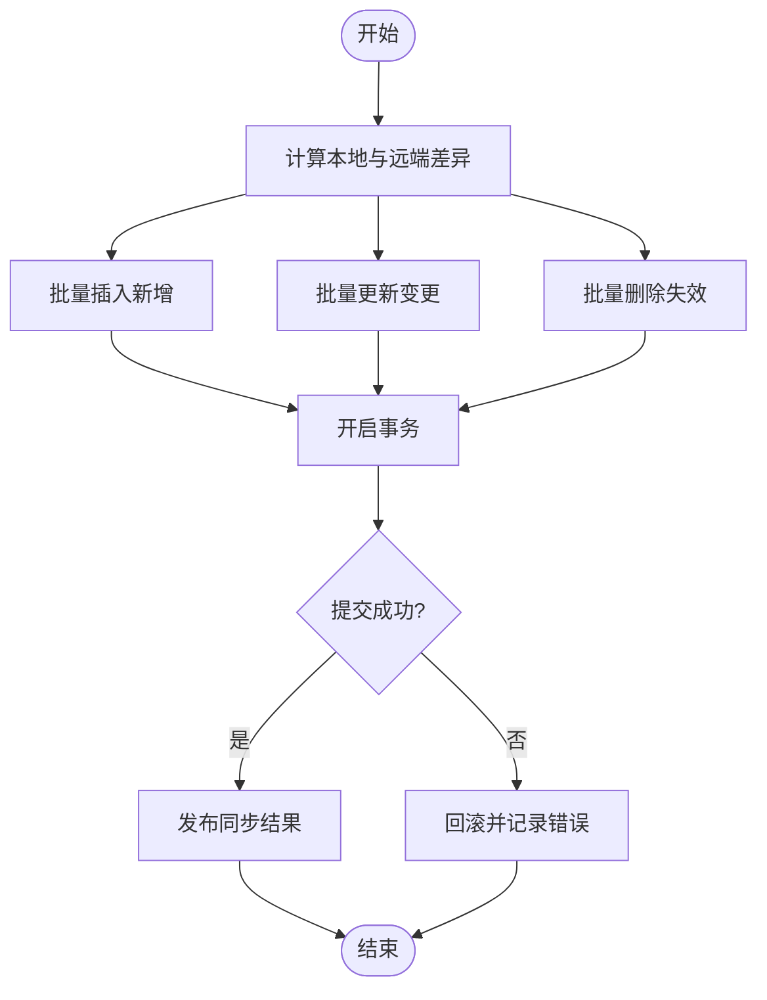

图表来源
- [LibraryMultiSourceSync.kt](file://app/src/main/java/app/yukine/LibraryMultiSourceSync.kt)
- [StreamingRepositoryProvider.kt](file://app/src/main/java/app/yukine/StreamingRepositoryProvider.kt)
- [feature/data/src/main/java/app/yukine/data/room/YukineDatabase.kt](file://feature/data/src/main/java/app/yukine/data/room/YukineDatabase.kt)

章节来源
- [LibraryMultiSourceSync.kt](file://app/src/main/java/app/yukine/LibraryMultiSourceSync.kt)
- [StreamingRepositoryProvider.kt](file://app/src/main/java/app/yukine/StreamingRepositoryProvider.kt)
- [feature/data/src/main/java/app/yukine/data/room/YukineDatabase.kt](file://feature/data/src/main/java/app/yukine/data/room/YukineDatabase.kt)

### 后台任务调度与增量同步
- 调度器
  - 负责任务的注册、周期触发与优先级管理，确保与播放体验互不干扰。
- 增量同步
  - 基于时间戳或游标拉取变更，结合指纹与规范化键进行去重与合并。
- 时序图

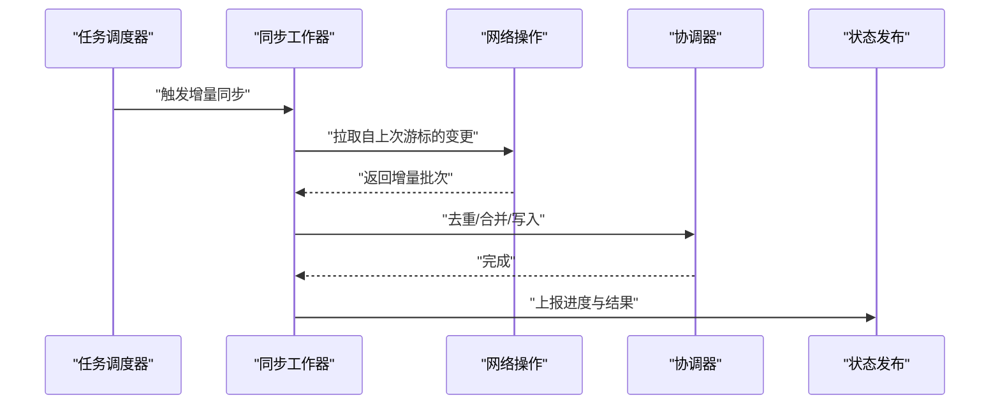

图表来源
- [StreamingPlaybackTaskScheduler.java](file://app/src/main/java/app/yukine/StreamingPlaybackTaskScheduler.java)
- [IdentityEnhancementWorker.kt](file://app/src/main/java/app/yukine/IdentityEnhancementWorker.kt)
- [MusicLibraryNetworkOperations.kt](file://app/src/main/java/app/yukine/MusicLibraryNetworkOperations.kt)
- [LibraryMultiSourceSync.kt](file://app/src/main/java/app/yukine/LibraryMultiSourceSync.kt)
- [TrackListStatePublisher.kt](file://app/src/main/java/app/yukine/TrackListStatePublisher.kt)

章节来源
- [StreamingPlaybackTaskScheduler.java](file://app/src/main/java/app/yukine/StreamingPlaybackTaskScheduler.java)
- [IdentityEnhancementWorker.kt](file://app/src/main/java/app/yukine/IdentityEnhancementWorker.kt)
- [MusicLibraryNetworkOperations.kt](file://app/src/main/java/app/yukine/MusicLibraryNetworkOperations.kt)
- [LibraryMultiSourceSync.kt](file://app/src/main/java/app/yukine/LibraryMultiSourceSync.kt)
- [TrackListStatePublisher.kt](file://app/src/main/java/app/yukine/TrackListStatePublisher.kt)

### 冲突解决机制
- 原则
  - 明确权威源（例如用户设备本地优先或云端优先），并提供可配置策略。
  - 对于字段级冲突，采用“最新修改时间优先”或“非空覆盖空”的策略。
  - 对于关系冲突（如收藏归属），采用幂等合并，避免重复。
- 流程图

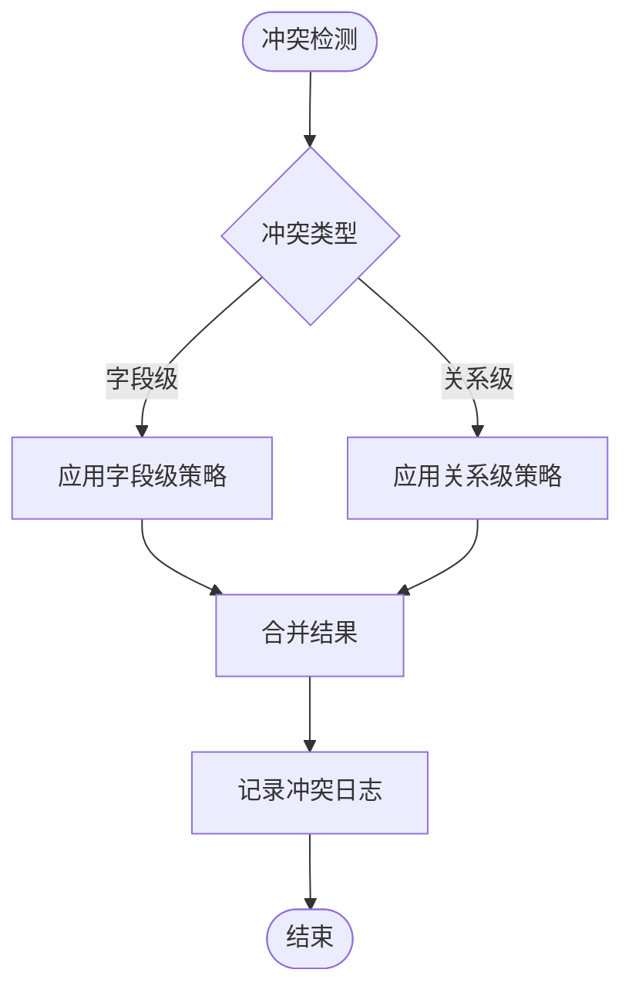

图表来源
- [LibraryMultiSourceSync.kt](file://app/src/main/java/app/yukine/LibraryMultiSourceSync.kt)
- [MusicLibraryNetworkOperations.kt](file://app/src/main/java/app/yukine/MusicLibraryNetworkOperations.kt)

章节来源
- [LibraryMultiSourceSync.kt](file://app/src/main/java/app/yukine/LibraryMultiSourceSync.kt)
- [MusicLibraryNetworkOperations.kt](file://app/src/main/java/app/yukine/MusicLibraryNetworkOperations.kt)

### 元数据填充与音频指纹匹配
- 元数据填充
  - 在网络不可用或远端缺失时，使用本地缓存与默认值填充关键字段，保障展示可用。
- 指纹匹配
  - 对音频片段进行采样与编码，生成指纹向量，与库内指纹进行相似度比较，辅助去重与身份识别。
- 流程图

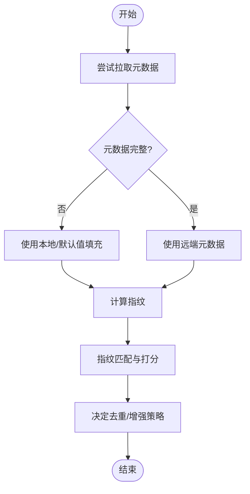

图表来源
- [MusicLibraryNetworkOperations.kt](file://app/src/main/java/app/yukine/MusicLibraryNetworkOperations.kt)
- [core/model/src/main/java/app/yukine/fingerprint/FingerprintEngine.kt](file://core/model/src/main/java/app/yukine/fingerprint/FingerprintEngine.kt)

章节来源
- [MusicLibraryNetworkOperations.kt](file://app/src/main/java/app/yukine/MusicLibraryNetworkOperations.kt)
- [core/model/src/main/java/app/yukine/fingerprint/FingerprintEngine.kt](file://core/model/src/main/java/app/yukine/fingerprint/FingerprintEngine.kt)

### 批量数据处理流程
- 分批策略
  - 按固定大小切分批次，限制单次事务规模，避免内存峰值过大。
- 事务与回滚
  - 每批独立事务，失败则回滚并记录错误，不影响其他批次。
- 流程图

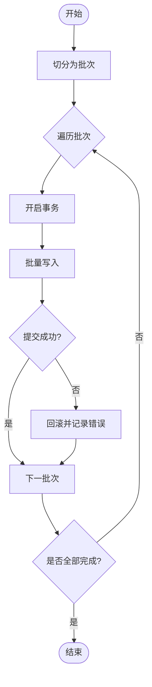

图表来源
- [LibraryMultiSourceSync.kt](file://app/src/main/java/app/yukine/LibraryMultiSourceSync.kt)
- [StreamingRepositoryProvider.kt](file://app/src/main/java/app/yukine/StreamingRepositoryProvider.kt)
- [feature/data/src/main/java/app/yukine/data/room/YukineDatabase.kt](file://feature/data/src/main/java/app/yukine/data/room/YukineDatabase.kt)

章节来源
- [LibraryMultiSourceSync.kt](file://app/src/main/java/app/yukine/LibraryMultiSourceSync.kt)
- [StreamingRepositoryProvider.kt](file://app/src/main/java/app/yukine/StreamingRepositoryProvider.kt)
- [feature/data/src/main/java/app/yukine/data/room/YukineDatabase.kt](file://feature/data/src/main/java/app/yukine/data/room/YukineDatabase.kt)

### 同步状态监控、失败重试与断点续传
- 状态监控
  - 通过状态发布器将各阶段进度与结果推送至 UI，便于用户感知与诊断。
- 失败重试
  - 对网络错误与临时异常实施指数退避重试，区分可重试与不可重试错误。
- 断点续传
  - 记录游标/时间戳，重启后从上次断点继续增量同步，避免重复拉取。
- 时序图

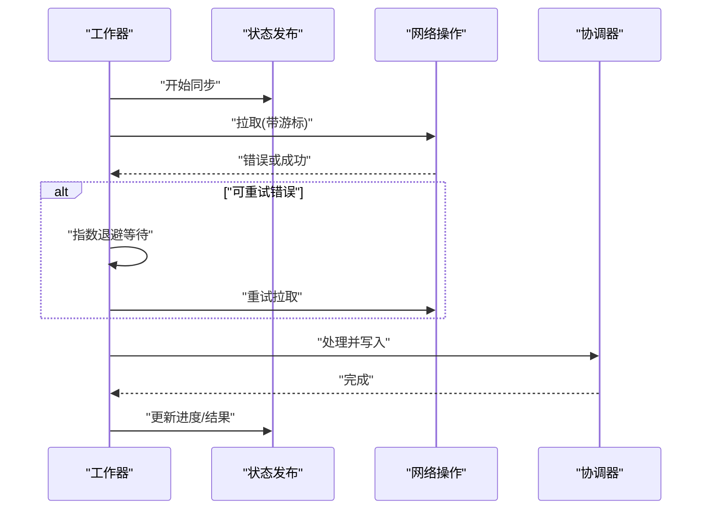

图表来源
- [IdentityEnhancementWorker.kt](file://app/src/main/java/app/yukine/IdentityEnhancementWorker.kt)
- [FavoriteSyncWorker.kt](file://app/src/main/java/app/yukine/FavoriteSyncWorker.kt)
- [KugouPlaylistSyncWorker.kt](file://app/src/main/java/app/yukine/KugouPlaylistSyncWorker.kt)
- [MusicLibraryNetworkOperations.kt](file://app/src/main/java/app/yukine/MusicLibraryNetworkOperations.kt)
- [LibraryMultiSourceSync.kt](file://app/src/main/java/app/yukine/LibraryMultiSourceSync.kt)
- [TrackListStatePublisher.kt](file://app/src/main/java/app/yukine/TrackListStatePublisher.kt)

章节来源
- [IdentityEnhancementWorker.kt](file://app/src/main/java/app/yukine/IdentityEnhancementWorker.kt)
- [FavoriteSyncWorker.kt](file://app/src/main/java/app/yukine/FavoriteSyncWorker.kt)
- [KugouPlaylistSyncWorker.kt](file://app/src/main/java/app/yukine/KugouPlaylistSyncWorker.kt)
- [MusicLibraryNetworkOperations.kt](file://app/src/main/java/app/yukine/MusicLibraryNetworkOperations.kt)
- [LibraryMultiSourceSync.kt](file://app/src/main/java/app/yukine/LibraryMultiSourceSync.kt)
- [TrackListStatePublisher.kt](file://app/src/main/java/app/yukine/TrackListStatePublisher.kt)

## 依赖关系分析
- 组件耦合
  - 工作器依赖协调器与网络操作，协调器依赖指纹引擎与仓库提供者，仓库提供者依赖数据库。
- 外部依赖
  - 指纹原生库通过 JNI 调用，需确保平台兼容性与资源可用性。
- 潜在循环依赖
  - 当前分层清晰，未见直接循环导入；需注意未来扩展时保持单向依赖。

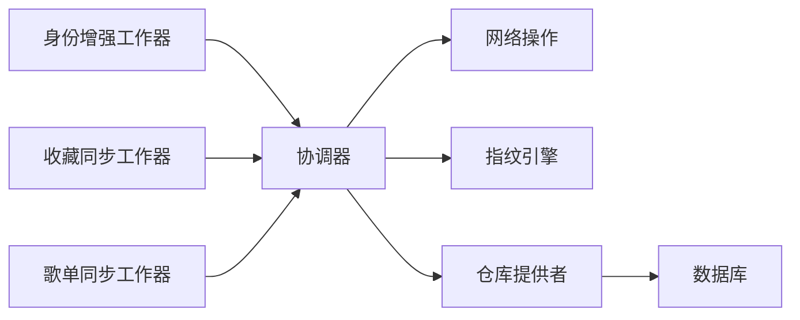

图表来源
- [IdentityEnhancementWorker.kt](file://app/src/main/java/app/yukine/IdentityEnhancementWorker.kt)
- [FavoriteSyncWorker.kt](file://app/src/main/java/app/yukine/FavoriteSyncWorker.kt)
- [KugouPlaylistSyncWorker.kt](file://app/src/main/java/app/yukine/KugouPlaylistSyncWorker.kt)
- [LibraryMultiSourceSync.kt](file://app/src/main/java/app/yukine/LibraryMultiSourceSync.kt)
- [MusicLibraryNetworkOperations.kt](file://app/src/main/java/app/yukine/MusicLibraryNetworkOperations.kt)
- [core/model/src/main/java/app/yukine/fingerprint/FingerprintEngine.kt](file://core/model/src/main/java/app/yukine/fingerprint/FingerprintEngine.kt)
- [StreamingRepositoryProvider.kt](file://app/src/main/java/app/yukine/StreamingRepositoryProvider.kt)
- [feature/data/src/main/java/app/yukine/data/room/YukineDatabase.kt](file://feature/data/src/main/java/app/yukine/data/room/YukineDatabase.kt)

章节来源
- [IdentityEnhancementWorker.kt](file://app/src/main/java/app/yukine/IdentityEnhancementWorker.kt)
- [FavoriteSyncWorker.kt](file://app/src/main/java/app/yukine/FavoriteSyncWorker.kt)
- [KugouPlaylistSyncWorker.kt](file://app/src/main/java/app/yukine/KugouPlaylistSyncWorker.kt)
- [LibraryMultiSourceSync.kt](file://app/src/main/java/app/yukine/LibraryMultiSourceSync.kt)
- [MusicLibraryNetworkOperations.kt](file://app/src/main/java/app/yukine/MusicLibraryNetworkOperations.kt)
- [core/model/src/main/java/app/yukine/fingerprint/FingerprintEngine.kt](file://core/model/src/main/java/app/yukine/fingerprint/FingerprintEngine.kt)
- [StreamingRepositoryProvider.kt](file://app/src/main/java/app/yukine/StreamingRepositoryProvider.kt)
- [feature/data/src/main/java/app/yukine/data/room/YukineDatabase.kt](file://feature/data/src/main/java/app/yukine/data/room/YukineDatabase.kt)

## 性能考虑
- 并发与批处理
  - 合理设置批次大小与并发度，避免 IO 与 CPU 争抢导致抖动。
- 指纹计算优化
  - 使用分块与并行计算，减少单次耗时；对已存在指纹进行缓存与复用。
- 数据库写入优化
  - 使用事务与批量 API，减少锁竞争与磁盘同步次数。
- 网络优化
  - 启用压缩与连接复用，按需拉取字段，减少带宽消耗。
- 内存管理
  - 及时释放大对象引用，避免 OOM；对指纹向量进行惰性加载。

## 故障排除指南
- 常见问题
  - 指纹计算失败：检查原生库加载与权限，确认输入音频格式与采样率。
  - 同步中断：查看游标是否持久化，确认网络错误分类与重试策略。
  - 去重误判：调整指纹相似度阈值与元数据规范化规则，核对测试用例覆盖。
- 定位方法
  - 通过状态发布器观察阶段进度与错误码。
  - 检查协调器日志与事务提交情况。
  - 使用集成测试复现问题，逐步缩小范围。

章节来源
- [ChromaprintNativeInstrumentedTest.kt](file://app/src/androidTest/java/app/yukine/fingerprint/ChromaprintNativeInstrumentedTest.kt)
- [CanonicalLibraryDedupInstrumentedTest.kt](file://app/src/androidTest/java/app/yukine/CanonicalLibraryDedupInstrumentedTest.kt)
- [TrackListStatePublisher.kt](file://app/src/main/java/app/yukine/TrackListStatePublisher.kt)
- [LibraryMultiSourceSync.kt](file://app/src/main/java/app/yukine/LibraryMultiSourceSync.kt)

## 结论
Echo Android 的数据同步机制以“编排-执行-持久化-发布”为核心架构，结合指纹匹配与规范化键实现高效去重与身份识别增强。通过增量同步、事务化批量写入与断点续传，系统在可靠性与性能之间取得平衡。建议在后续迭代中持续优化指纹索引与冲突策略，完善监控与诊断能力，进一步提升大规模库场景下的稳定性与用户体验。

## 附录
- 术语
  - 指纹：音频信号的紧凑特征表示，用于相似性判断。
  - 游标：用于增量同步的位置标记，支持断点续传。
  - 规范化键：经标准化处理的组合键，用于去重与匹配。
- 参考测试
  - 指纹原生能力与库级去重的集成测试可作为行为基线参考。