# 数据层

<cite>
**本文引用的文件**   
- [YukineDatabase.kt](file://feature/data/src/main/java/app/yukine/data/room/YukineDatabase.kt)
- [StreamingCacheDatabase.kt](file://app/schemas/app.yukine.streaming.cache.StreamingCacheDatabase/1.json)
- [MusicLibraryRepository.kt](file://feature/data/src/main/java/app/yukine/data/MusicLibraryRepository.kt)
- [FavoriteSyncPersistence.kt](file://app/src/main/java/app/yukine/FavoriteSyncPersistence.kt)
- [IdentityEnhancementWorker.kt](file://app/src/main/java/app/yukine/IdentityEnhancementWorker.kt)
- [KugouPlaylistSyncWorker.kt](file://app/src/main/java/app/yukine/KugouPlaylistSyncWorker.kt)
- [FavoriteSyncWorker.kt](file://app/src/main/java/app/yukine/FavoriteSyncWorker.kt)
- [BackupRestoreLauncher.kt](file://app/src/main/java/app/yukine/BackupRestoreLauncher.kt)
- [PlayHistoryActionController.kt](file://app/src/main/java/app/yukine/PlayHistoryActionController.kt)
- [DownloadedAudioMetadataWriter.kt](file://app/src/main/java/app/yukine/DownloadedAudioMetadataWriter.kt)
- [ContentResolverLibraryDocumentGateway.kt](file://app/src/main/java/app/yukine/ContentResolverLibraryDocumentGateway.kt)
- [RoomRepositoriesInstrumentedTest.kt](file://app/src/androidTest/java/app/yukine/data/RoomRepositoriesInstrumentedTest.java)
- [MusicLibraryRepositoryInstrumentedTest.kt](file://app/src/androidTest/java/app/yukine/data/MusicLibraryRepositoryInstrumentedTest.java)
</cite>

## 目录
1. [简介](#简介)
2. [项目结构](#项目结构)
3. [核心组件](#核心组件)
4. [架构总览](#架构总览)
5. [详细组件分析](#详细组件分析)
6. [依赖分析](#依赖分析)
7. [性能考虑](#性能考虑)
8. [故障排查指南](#故障排查指南)
9. [结论](#结论)
10. [附录](#附录)

## 简介
本技术文档聚焦 Echo Android 应用的数据层，围绕 Room 数据库设计、实体关系映射、DAO 实现、Repository 模式抽象、数据同步与缓存策略展开。同时覆盖本地音乐库扫描、元数据处理、播放历史存储、数据库迁移方案、备份恢复以及性能优化策略，并提供扩展指南与常见问题解决方案，帮助开发者快速理解并高效维护数据层。

## 项目结构
数据层主要位于 feature/data 模块，包含 Room 数据库定义、实体、DAO 与 Repository；app 模块负责与上层业务集成（如同步 Worker、备份恢复入口、播放历史控制器等）。此外，streaming 子模块拥有独立的缓存数据库 schema，用于流媒体播放的临时数据持久化。

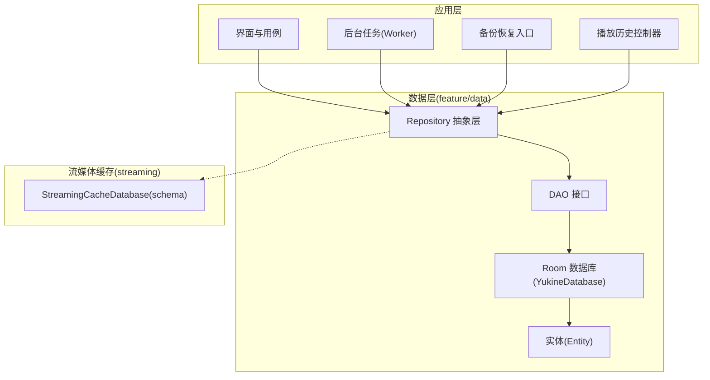

图表来源
- [YukineDatabase.kt](file://feature/data/src/main/java/app/yukine/data/room/YukineDatabase.kt)
- [StreamingCacheDatabase.kt](file://app/schemas/app.yukine.streaming.cache.StreamingCacheDatabase/1.json)

章节来源
- [YukineDatabase.kt](file://feature/data/src/main/java/app/yukine/data/room/YukineDatabase.kt)
- [StreamingCacheDatabase.kt](file://app/schemas/app.yukine.streaming.cache.StreamingCacheDatabase/1.json)

## 核心组件
- 数据库与实体：通过 Room 定义主数据库 YukineDatabase，集中管理所有实体表及其关系映射。
- DAO 层：提供对实体的增删改查与复杂查询能力，支持事务与并发安全。
- Repository 层：封装数据访问细节，向上层暴露领域语义操作，屏蔽底层实现差异。
- 同步与缓存：通过 Worker 与独立缓存数据库完成跨源同步与热点数据缓存。
- 备份恢复：提供用户可控的备份与恢复入口，确保数据安全与可迁移性。
- 播放历史：记录播放行为，支撑推荐与统计功能。

章节来源
- [YukineDatabase.kt](file://feature/data/src/main/java/app/yukine/data/room/YukineDatabase.kt)
- [MusicLibraryRepository.kt](file://feature/data/src/main/java/app/yukine/data/MusicLibraryRepository.kt)
- [StreamingCacheDatabase.kt](file://app/schemas/app.yukine.streaming.cache.StreamingCacheDatabase/1.json)

## 架构总览
数据层采用分层架构：UI/用例调用 Repository，Repository 组合多个 DAO 与外部服务，必要时触发 Worker 进行异步同步或批量处理。Room 作为持久化核心，配合迁移脚本保障版本演进。

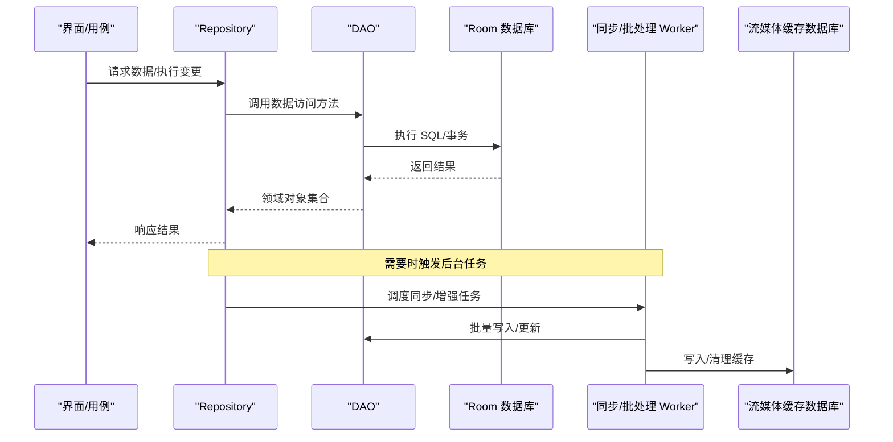

图表来源
- [MusicLibraryRepository.kt](file://feature/data/src/main/java/app/yukine/data/MusicLibraryRepository.kt)
- [IdentityEnhancementWorker.kt](file://app/src/main/java/app/yukine/IdentityEnhancementWorker.kt)
- [KugouPlaylistSyncWorker.kt](file://app/src/main/java/app/yukine/KugouPlaylistSyncWorker.kt)
- [FavoriteSyncWorker.kt](file://app/src/main/java/app/yukine/FavoriteSyncWorker.kt)
- [StreamingCacheDatabase.kt](file://app/schemas/app.yukine.streaming.cache.StreamingCacheDatabase/1.json)

## 详细组件分析

### 数据库设计与实体关系映射
- 主数据库：YukineDatabase 作为 Room 入口，集中声明所有实体与 DAO，并配置迁移策略。
- 实体关系：通过外键与关联注解表达多对一、一对多、多对多关系，确保引用完整性与查询效率。
- 索引与约束：为高频查询字段建立索引，使用唯一约束避免重复数据。

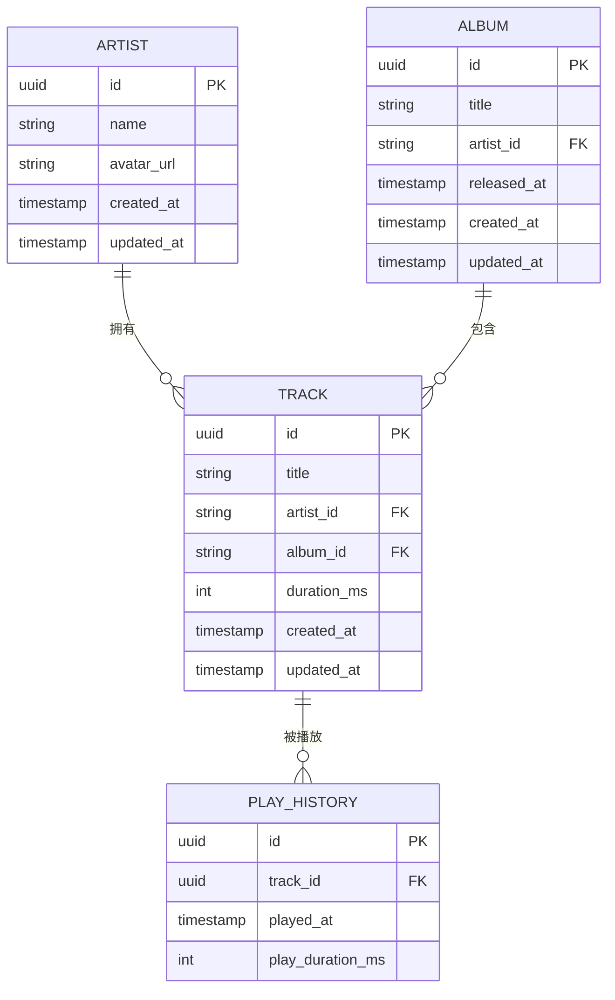

图表来源
- [YukineDatabase.kt](file://feature/data/src/main/java/app/yukine/data/room/YukineDatabase.kt)

章节来源
- [YukineDatabase.kt](file://feature/data/src/main/java/app/yukine/data/room/YukineDatabase.kt)

### 数据访问对象（DAO）实现
- 基础 CRUD：提供插入、更新、删除与按主键查询等方法。
- 复杂查询：支持分页、排序、条件过滤与聚合统计。
- 事务与并发：在批量写入场景使用事务保证一致性，结合协程/线程池提升吞吐。

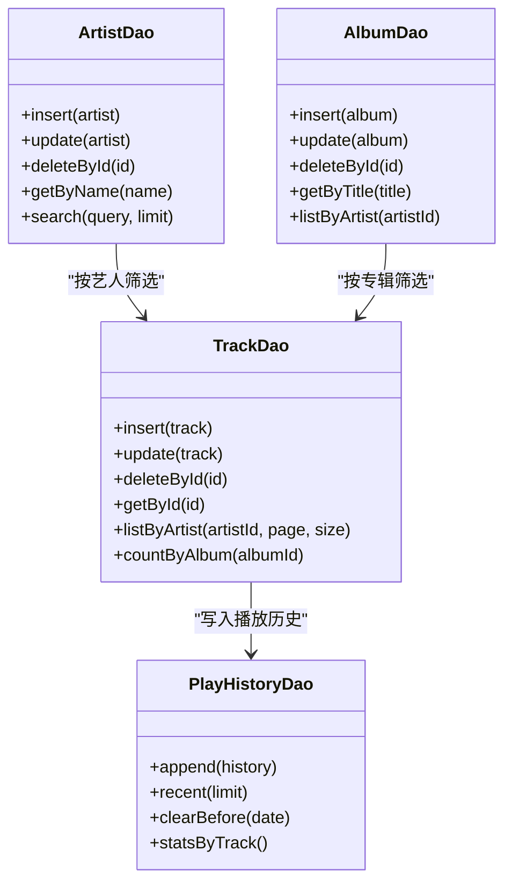

图表来源
- [YukineDatabase.kt](file://feature/data/src/main/java/app/yukine/data/room/YukineDatabase.kt)

章节来源
- [YukineDatabase.kt](file://feature/data/src/main/java/app/yukine/data/room/YukineDatabase.kt)

### Repository 模式的数据抽象层
- 职责边界：Repository 对外暴露领域级 API，对内协调 DAO、网络与缓存。
- 数据一致性：在合并冲突时采用“最近修改优先”或“服务端权威”策略。
- 错误隔离：将底层异常转换为领域错误，便于上层统一处理。

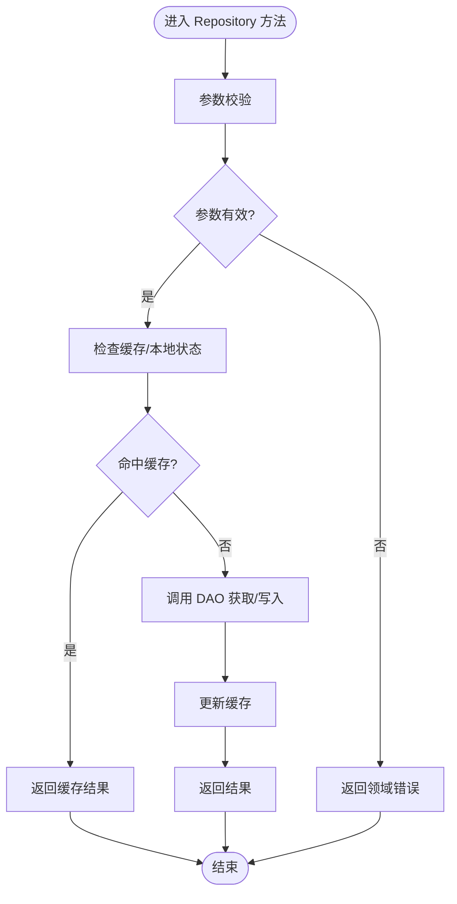

图表来源
- [MusicLibraryRepository.kt](file://feature/data/src/main/java/app/yukine/data/MusicLibraryRepository.kt)

章节来源
- [MusicLibraryRepository.kt](file://feature/data/src/main/java/app/yukine/data/MusicLibraryRepository.kt)

### 数据同步机制
- 收藏同步：通过 FavoriteSyncWorker 定期拉取远端收藏并与本地合并。
- 歌单同步：KugouPlaylistSyncWorker 负责第三方歌单的增量同步与去重。
- 身份增强：IdentityEnhancementWorker 补充缺失的艺术家/专辑信息，提升展示质量。

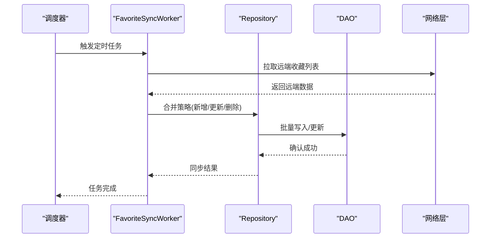

图表来源
- [FavoriteSyncWorker.kt](file://app/src/main/java/app/yukine/FavoriteSyncWorker.kt)
- [KugouPlaylistSyncWorker.kt](file://app/src/main/java/app/yukine/KugouPlaylistSyncWorker.kt)
- [IdentityEnhancementWorker.kt](file://app/src/main/java/app/yukine/IdentityEnhancementWorker.kt)
- [MusicLibraryRepository.kt](file://feature/data/src/main/java/app/yukine/data/MusicLibraryRepository.kt)

章节来源
- [FavoriteSyncWorker.kt](file://app/src/main/java/app/yukine/FavoriteSyncWorker.kt)
- [KugouPlaylistSyncWorker.kt](file://app/src/main/java/app/yukine/KugouPlaylistSyncWorker.kt)
- [IdentityEnhancementWorker.kt](file://app/src/main/java/app/yukine/IdentityEnhancementWorker.kt)
- [MusicLibraryRepository.kt](file://feature/data/src/main/java/app/yukine/data/MusicLibraryRepository.kt)

### 缓存策略
- 流媒体缓存：使用 StreamingCacheDatabase 缓存播放片段、封面缩略图等热点数据，降低网络开销。
- 缓存失效：基于时间戳与容量上限策略清理过期条目。
- 读写路径：先读缓存，未命中再回源并回填缓存。

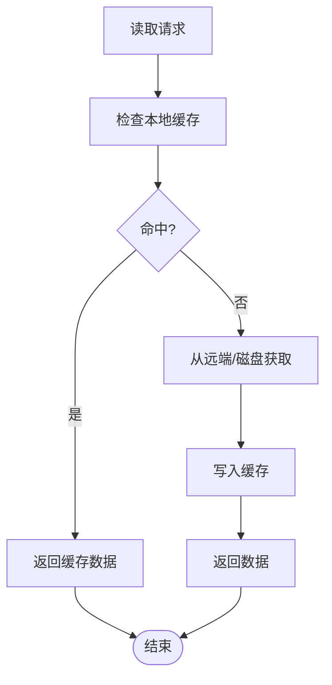

图表来源
- [StreamingCacheDatabase.kt](file://app/schemas/app.yukine.streaming.cache.StreamingCacheDatabase/1.json)

章节来源
- [StreamingCacheDatabase.kt](file://app/schemas/app.yukine.streaming.cache.StreamingCacheDatabase/1.json)

### 本地音乐库扫描与元数据处理
- 扫描入口：通过 ContentResolverLibraryDocumentGateway 扫描系统媒体库，发现音频文件。
- 元数据写入：DownloadedAudioWriter 负责下载后的元数据补写与标签修正。
- 入库流程：扫描结果经 Repository 去重与标准化后写入数据库。

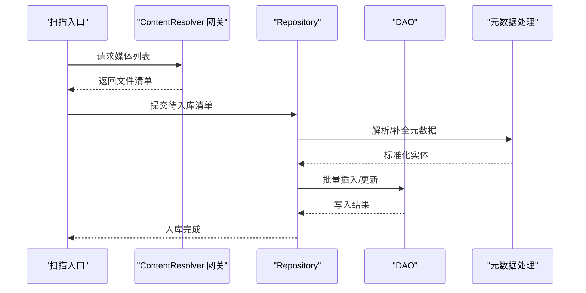

图表来源
- [ContentResolverLibraryDocumentGateway.kt](file://app/src/main/java/app/yukine/ContentResolverLibraryDocumentGateway.kt)
- [DownloadedAudioMetadataWriter.kt](file://app/src/main/java/app/yukine/DownloadedAudioMetadataWriter.kt)
- [MusicLibraryRepository.kt](file://feature/data/src/main/java/app/yukine/data/MusicLibraryRepository.kt)

章节来源
- [ContentResolverLibraryDocumentGateway.kt](file://app/src/main/java/app/yukine/ContentResolverLibraryDocumentGateway.kt)
- [DownloadedAudioMetadataWriter.kt](file://app/src/main/java/app/yukine/DownloadedAudioMetadataWriter.kt)
- [MusicLibraryRepository.kt](file://feature/data/src/main/java/app/yukine/data/MusicLibraryRepository.kt)

### 播放历史存储
- 写入策略：每次播放结束追加一条历史记录，包含曲目 ID、播放时间与时长。
- 查询与统计：支持最近播放列表、按曲目统计播放次数、清理旧数据。
- 与推荐联动：历史数据可作为推荐种子，提升个性化体验。

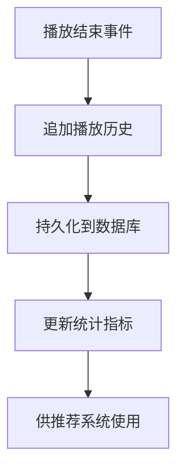

图表来源
- [PlayHistoryActionController.kt](file://app/src/main/java/app/yukine/PlayHistoryActionController.kt)

章节来源
- [PlayHistoryActionController.kt](file://app/src/main/java/app/yukine/PlayHistoryActionController.kt)

### 数据库迁移方案
- 版本管理：YukineDatabase 集中声明版本号与迁移脚本，确保平滑升级。
- 迁移策略：优先增量 DDL 变更，必要时采用重建表+数据回填方式。
- 测试验证：通过集成测试覆盖关键迁移路径，确保数据一致性。

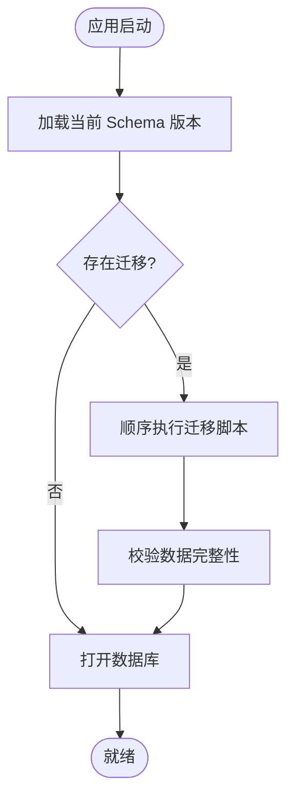

图表来源
- [YukineDatabase.kt](file://feature/data/src/main/java/app/yukine/data/room/YukineDatabase.kt)

章节来源
- [YukineDatabase.kt](file://feature/data/src/main/java/app/yukine/data/room/YukineDatabase.kt)

### 数据备份与恢复
- 备份入口：BackupRestoreLauncher 提供用户触发的备份与恢复流程。
- 备份内容：包括数据库快照与必要元数据，确保可移植性。
- 恢复流程：校验备份完整性后导入至目标数据库，必要时执行兼容转换。

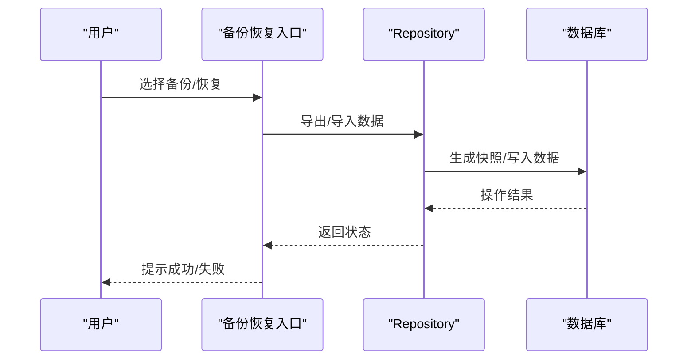

图表来源
- [BackupRestoreLauncher.kt](file://app/src/main/java/app/yukine/BackupRestoreLauncher.kt)

章节来源
- [BackupRestoreLauncher.kt](file://app/src/main/java/app/yukine/BackupRestoreLauncher.kt)

### 数据层的扩展指南
- 新增实体：在数据库声明中注册实体与对应 DAO，并在 Repository 暴露领域方法。
- 新增同步源：实现新的 Worker，复用 Repository 的合并策略与幂等写入。
- 新增缓存项：在缓存数据库中定义新表，调整缓存读写路径与失效策略。
- 迁移实践：编写增量迁移脚本，配套集成测试验证数据一致性。

章节来源
- [YukineDatabase.kt](file://feature/data/src/main/java/app/yukine/data/room/YukineDatabase.kt)
- [MusicLibraryRepository.kt](file://feature/data/src/main/java/app/yukine/data/MusicLibraryRepository.kt)
- [StreamingCacheDatabase.kt](file://app/schemas/app.yukine.streaming.cache.StreamingCacheDatabase/1.json)

### 常见问题解决方案
- 同步冲突：以“最近修改优先”或“服务端权威”策略解决，必要时引入人工确认。
- 扫描遗漏：检查权限与路径白名单，增加重试与日志上报。
- 历史丢失：在播放结束回调中增加兜底写入与补偿任务。
- 迁移失败：回滚到上一稳定版本，定位迁移脚本问题并修复。

章节来源
- [FavoriteSyncWorker.kt](file://app/src/main/java/app/yukine/FavoriteSyncWorker.kt)
- [ContentResolverLibraryDocumentGateway.kt](file://app/src/main/java/app/yukine/ContentResolverLibraryDocumentGateway.kt)
- [PlayHistoryActionController.kt](file://app/src/main/java/app/yukine/PlayHistoryActionController.kt)
- [YukineDatabase.kt](file://feature/data/src/main/java/app/yukine/data/room/YukineDatabase.kt)

## 依赖分析
- 内聚与耦合：Repository 高内聚于领域逻辑，低耦合于 DAO 与外部服务；Worker 仅依赖 Repository 提供的领域 API。
- 直接依赖：Repository 依赖 DAO 与缓存数据库；Worker 依赖 Repository 与网络层。
- 间接依赖：UI 不直接访问 DAO，避免跨层耦合。
- 循环依赖：未发现循环依赖迹象，分层清晰。

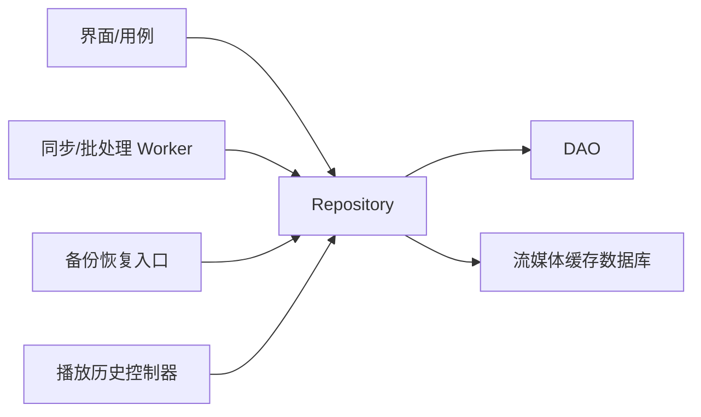

图表来源
- [MusicLibraryRepository.kt](file://feature/data/src/main/java/app/yukine/data/MusicLibraryRepository.kt)
- [StreamingCacheDatabase.kt](file://app/schemas/app.yukine.streaming.cache.StreamingCacheDatabase/1.json)
- [FavoriteSyncWorker.kt](file://app/src/main/java/app/yukine/FavoriteSyncWorker.kt)
- [BackupRestoreLauncher.kt](file://app/src/main/java/app/yukine/BackupRestoreLauncher.kt)
- [PlayHistoryActionController.kt](file://app/src/main/java/app/yukine/PlayHistoryActionController.kt)

章节来源
- [MusicLibraryRepository.kt](file://feature/data/src/main/java/app/yukine/data/MusicLibraryRepository.kt)
- [StreamingCacheDatabase.kt](file://app/schemas/app.yukine.streaming.cache.StreamingCacheDatabase/1.json)
- [FavoriteSyncWorker.kt](file://app/src/main/java/app/yukine/FavoriteSyncWorker.kt)
- [BackupRestoreLauncher.kt](file://app/src/main/java/app/yukine/BackupRestoreLauncher.kt)
- [PlayHistoryActionController.kt](file://app/src/main/java/app/yukine/PlayHistoryActionController.kt)

## 性能考虑
- 批量写入：使用事务与批量插入减少 I/O 次数。
- 索引优化：为常用查询字段建立复合索引，避免全表扫描。
- 分页与懒加载：列表查询采用分页，按需加载详情。
- 缓存命中率：合理设置 TTL 与容量上限，避免内存膨胀。
- 后台任务：Worker 使用合适的调度策略，避免频繁唤醒 CPU。

[本节为通用指导，无需特定文件来源]

## 故障排查指南
- 集成测试：利用 RoomRepositoriesInstrumentedTest 与 MusicLibraryRepositoryInstrumentedTest 验证关键路径。
- 日志与监控：在关键节点输出结构化日志，便于定位问题。
- 回滚策略：迁移失败时自动回滚，保留可恢复状态。
- 数据校验：在备份恢复与同步完成后执行一致性校验。

章节来源
- [RoomRepositoriesInstrumentedTest.kt](file://app/src/androidTest/java/app/yukine/data/RoomRepositoriesInstrumentedTest.java)
- [MusicLibraryRepositoryInstrumentedTest.kt](file://app/src/androidTest/java/app/yukine/data/MusicLibraryRepositoryInstrumentedTest.java)

## 结论
Echo Android 数据层以 Room 为核心，结合 Repository 抽象、Worker 同步与独立缓存数据库，构建了可扩展、高性能且易维护的数据体系。通过完善的迁移、备份恢复与测试保障，数据层能够稳健支撑本地音乐库管理与流媒体播放需求。建议持续优化索引与缓存策略，完善监控与告警，进一步提升用户体验与系统稳定性。

## 附录
- 术语说明：
  - Repository：数据访问抽象层，封装领域语义。
  - DAO：数据访问对象，面向数据库的细粒度操作。
  - Worker：后台任务，负责异步同步与批处理。
  - 迁移：数据库版本升级时的结构变更过程。

[本节为概念性内容，无需特定文件来源]