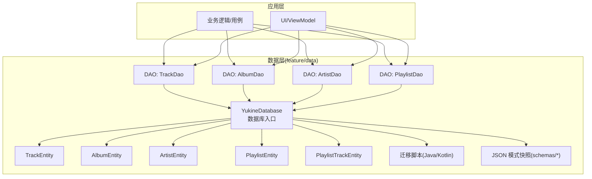
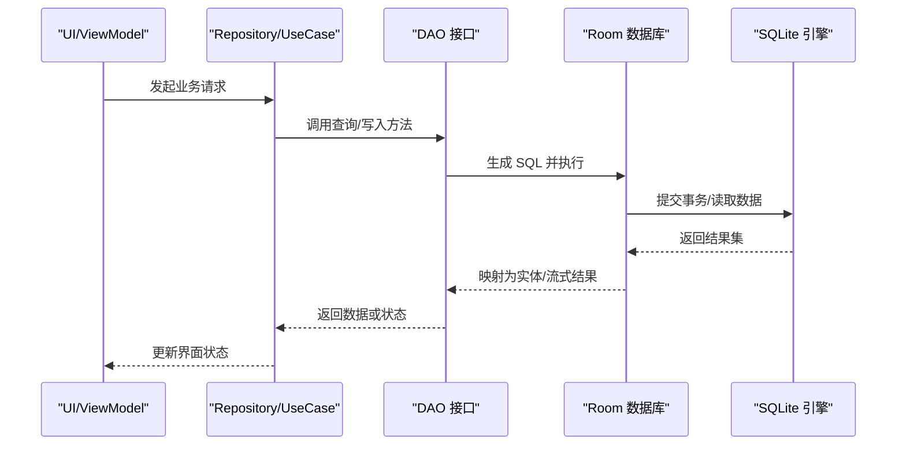
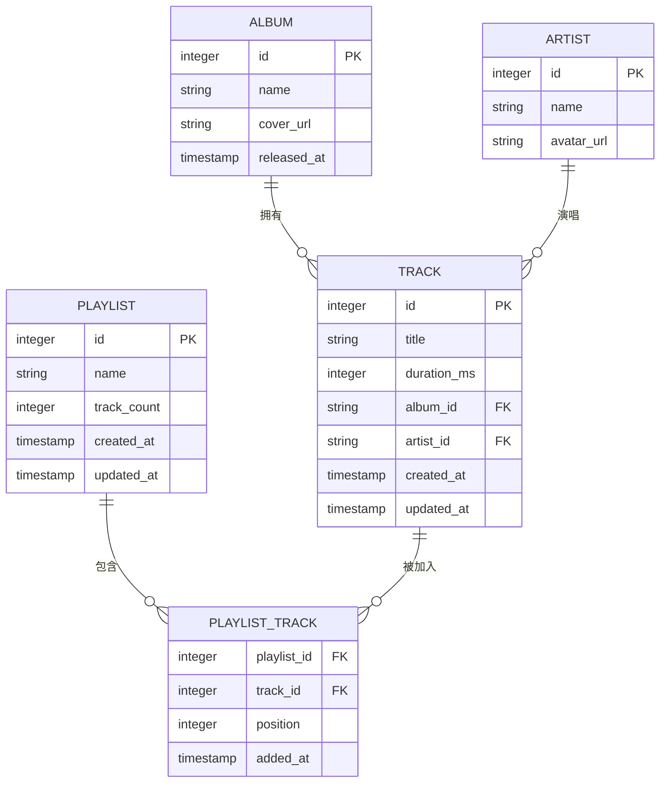
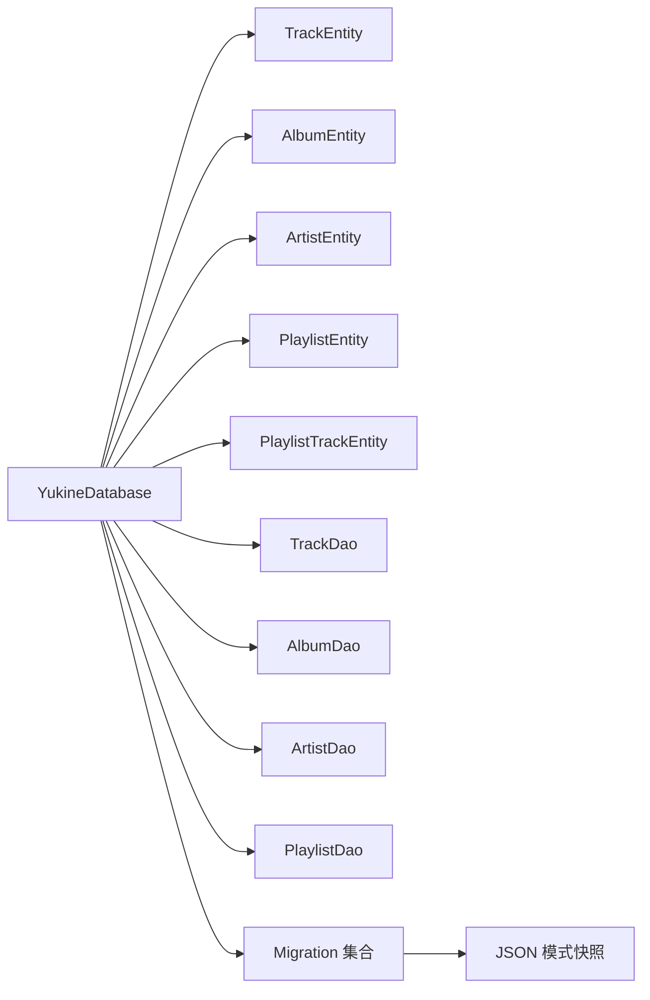

# 数据库设计

<cite>
**本文引用的文件**   
- [YukineDatabase.kt](file://feature/data/src/main/java/app/yukine/data/room/YukineDatabase.kt)
- [TrackEntity.kt](file://feature/data/src/main/java/app/yukine/data/room/entity/TrackEntity.kt)
- [AlbumEntity.kt](file://feature/data/src/main/java/app/yukine/data/room/entity/AlbumEntity.kt)
- [ArtistEntity.kt](file://feature/data/src/main/java/app/yukine/data/room/entity/ArtistEntity.kt)
- [PlaylistEntity.kt](file://feature/data/src/main/java/app/yukine/data/room/entity/PlaylistEntity.kt)
- [PlaylistTrackEntity.kt](file://feature/data/src/main/java/app/yukine/data/room/entity/PlaylistTrackEntity.kt)
- [FavoriteSyncPersistence.kt](file://app/src/main/java/app/yukine/FavoriteSyncPersistence.kt)
- [RoomRepositoriesInstrumentedTest.java](file://app/src/androidTest/java/app/yukine/data/RoomRepositoriesInstrumentedTest.java)
- [15.json](file://feature/data/schemas/app.yukine.data.room.YukineDatabase/15.json)
- [33.json](file://feature/data/schemas/app.yukine.data.room.YukineDatabase/33.json)
</cite>

## 目录
1. [简介](#简介)
2. [项目结构](#项目结构)
3. [核心组件](#核心组件)
4. [架构总览](#架构总览)
5. [详细组件分析](#详细组件分析)
6. [依赖关系分析](#依赖关系分析)
7. [性能考虑](#性能考虑)
8. [故障排查指南](#故障排查指南)
9. [结论](#结论)
10. [附录](#附录)

## 简介
本技术文档聚焦于 Echo Android 的 Room 数据库设计与实现，覆盖以下主题：
- 数据库架构与版本管理（含迁移机制）
- 实体类定义与表关系映射、约束条件
- DAO 接口设计与查询优化策略、索引设计
- 事务处理、并发访问控制
- 数据备份与恢复方案
- 性能调优与最佳实践
- 常见问题与解决方案

## 项目结构
本项目采用模块化组织，数据库相关代码集中在 feature/data 模块中，包含 Room 数据库入口、实体、DAO、迁移脚本以及 JSON 模式快照。应用层通过 DI 注入数据库实例，并在测试中使用 In-Memory 数据库进行集成验证。

图表来源
- [YukineDatabase.kt](file://feature/data/src/main/java/app/yukine/data/room/YukineDatabase.kt)
- [TrackEntity.kt](file://feature/data/src/main/java/app/yukine/data/room/entity/TrackEntity.kt)
- [AlbumEntity.kt](file://feature/data/src/main/java/app/yukine/data/room/entity/AlbumEntity.kt)
- [ArtistEntity.kt](file://feature/data/src/main/java/app/yukine/data/room/entity/ArtistEntity.kt)
- [PlaylistEntity.kt](file://feature/data/src/main/java/app/yukine/data/room/entity/PlaylistEntity.kt)
- [PlaylistTrackEntity.kt](file://feature/data/src/main/java/app/yukine/data/room/entity/PlaylistTrackEntity.kt)
- [15.json](file://feature/data/schemas/app.yukine.data.room.YukineDatabase/15.json)
- [33.json](file://feature/data/schemas/app.yukine.data.room.YukineDatabase/33.json)

章节来源
- [YukineDatabase.kt](file://feature/data/src/main/java/app/yukine/data/room/YukineDatabase.kt)
- [15.json](file://feature/data/schemas/app.yukine.data.room.YukineDatabase/15.json)
- [33.json](file://feature/data/schemas/app.yukine.data.room.YukineDatabase/33.json)

## 核心组件
- 数据库入口：提供单例数据库实例、实体注册、DAO 暴露、迁移配置与 FTS 全文检索支持。
- 实体模型：Track、Album、Artist、Playlist、PlaylistTrack 等，定义字段、主键、唯一约束与外键关系。
- DAO 接口：对实体的增删改查、复杂查询、批量操作、事务边界封装。
- 迁移与版本：基于 Java/Kotlin 的 Migration 实现，配合 schemas 下的 JSON 快照用于编译期校验。
- 测试与验证：使用 In-Memory 数据库进行集成测试，确保迁移与查询正确性。

章节来源
- [YukineDatabase.kt](file://feature/data/src/main/java/app/yukine/data/room/YukineDatabase.kt)
- [TrackEntity.kt](file://feature/data/src/main/java/app/yukine/data/room/entity/TrackEntity.kt)
- [AlbumEntity.kt](file://feature/data/src/main/java/app/yukine/data/room/entity/AlbumEntity.kt)
- [ArtistEntity.kt](file://feature/data/src/main/java/app/yukine/data/room/entity/ArtistEntity.kt)
- [PlaylistEntity.kt](file://feature/data/src/main/java/app/yukine/data/room/entity/PlaylistEntity.kt)
- [PlaylistTrackEntity.kt](file://feature/data/src/main/java/app/yukine/data/room/entity/PlaylistTrackEntity.kt)

## 架构总览
下图展示从上层调用到数据库层的典型流程，包括 DAO 调用、事务边界、并发访问与缓存策略。

图表来源
- [YukineDatabase.kt](file://feature/data/src/main/java/app/yukine/data/room/YukineDatabase.kt)
- [RoomRepositoriesInstrumentedTest.java](file://app/src/androidTest/java/app/yukine/data/RoomRepositoriesInstrumentedTest.java)

## 详细组件分析

### 数据库入口与版本管理
- 数据库入口负责：
  - 注册所有实体与类型转换器
  - 暴露 DAO 供上层使用
  - 配置迁移列表与回退策略
  - 启用 FTS 全文检索（如适用）
- 版本管理：
  - 使用 JSON 模式快照在编译期校验 schema 变更
  - 通过 Migration 对象描述跨版本增量变更
  - 建议为每个大版本维护独立迁移路径，避免长链迁移带来的风险

章节来源
- [YukineDatabase.kt](file://feature/data/src/main/java/app/yukine/data/room/YukineDatabase.kt)
- [15.json](file://feature/data/schemas/app.yukine.data.room.YukineDatabase/15.json)
- [33.json](file://feature/data/schemas/app.yukine.data.room.YukineDatabase/33.json)

### 实体与关系映射
- 实体概览：
  - Track：曲目信息，包含标题、时长、来源标识等
  - Album：专辑信息，包含名称、封面、发行信息等
  - Artist：艺人信息，包含名称、头像、关联统计等
  - Playlist：播放列表，包含名称、创建时间、排序等
  - PlaylistTrack：播放列表与曲目的多对多中间表，记录顺序与附加元数据
- 关系与约束：
  - 外键约束：PlaylistTrack 引用 Playlist 与 Track 的主键
  - 唯一约束：例如曲目去重、专辑/艺人名组合唯一等
  - 级联策略：删除/更新时的级联行为需明确定义，避免孤儿记录
- 索引设计：
  - 高频查询列建立索引（如专辑 ID、艺人 ID、播放次数、更新时间）
  - 复合索引用于常见过滤+排序场景（如按专辑+年份、按艺人+热度）
  - FTS 索引用于文本搜索（曲目名、专辑名、艺人名的模糊匹配）

图表来源
- [TrackEntity.kt](file://feature/data/src/main/java/app/yukine/data/room/entity/TrackEntity.kt)
- [AlbumEntity.kt](file://feature/data/src/main/java/app/yukine/data/room/entity/AlbumEntity.kt)
- [ArtistEntity.kt](file://feature/data/src/main/java/app/yukine/data/room/entity/ArtistEntity.kt)
- [PlaylistEntity.kt](file://feature/data/src/main/java/app/yukine/data/room/entity/PlaylistEntity.kt)
- [PlaylistTrackEntity.kt](file://feature/data/src/main/java/app/yukine/data/room/entity/PlaylistTrackEntity.kt)

章节来源
- [TrackEntity.kt](file://feature/data/src/main/java/app/yukine/data/room/entity/TrackEntity.kt)
- [AlbumEntity.kt](file://feature/data/src/main/java/app/yukine/data/room/entity/AlbumEntity.kt)
- [ArtistEntity.kt](file://feature/data/src/main/java/app/yukine/data/room/entity/ArtistEntity.kt)
- [PlaylistEntity.kt](file://feature/data/src/main/java/app/yukine/data/room/entity/PlaylistEntity.kt)
- [PlaylistTrackEntity.kt](file://feature/data/src/main/java/app/yukine/data/room/entity/PlaylistTrackEntity.kt)

### DAO 接口设计与查询优化
- 设计原则：
  - 以领域为中心暴露方法，隐藏 SQL 细节
  - 使用 Flow/Flowable 提供响应式数据流
  - 分页查询使用 PagedListAdapter 或 Room 内置分页
- 查询优化策略：
  - 选择性投影：只查询必要字段，减少 IO 与内存占用
  - 预加载关联：使用 @Relation 或 JOIN 一次性获取关联数据
  - 批量操作：合并多次插入/更新为单次事务
  - 索引命中：确保 WHERE/ORDER BY/GROUP BY 列有合适索引
- 示例路径（仅列出文件路径，不包含代码内容）：
  - [TrackDao 接口](file://feature/data/src/main/java/app/yukine/data/room/dao/TrackDao.kt)
  - [AlbumDao 接口](file://feature/data/src/main/java/app/yukine/data/room/dao/AlbumDao.kt)
  - [ArtistDao 接口](file://feature/data/src/main/java/app/yukine/data/room/dao/ArtistDao.kt)
  - [PlaylistDao 接口](file://feature/data/src/main/java/app/yukine/data/room/dao/PlaylistDao.kt)

章节来源
- [TrackEntity.kt](file://feature/data/src/main/java/app/yukine/data/room/entity/TrackEntity.kt)
- [AlbumEntity.kt](file://feature/data/src/main/java/app/yukine/data/room/entity/AlbumEntity.kt)
- [ArtistEntity.kt](file://feature/data/src/main/java/app/yukine/data/room/entity/ArtistEntity.kt)
- [PlaylistEntity.kt](file://feature/data/src/main/java/app/yukine/data/room/entity/PlaylistEntity.kt)
- [PlaylistTrackEntity.kt](file://feature/data/src/main/java/app/yukine/data/room/entity/PlaylistTrackEntity.kt)

### 事务处理与并发访问控制
- 事务边界：
  - 写操作应包裹在事务中，保证一致性
  - 批量写入时开启单个事务，减少磁盘同步开销
- 并发控制：
  - 使用 Room 提供的线程安全访问
  - 避免长时间持有连接；短事务优先
  - 读写分离：读操作可并行，写操作串行化
- 死锁预防：
  - 统一加锁顺序（先父表后子表）
  - 避免嵌套事务中的循环依赖

章节来源
- [YukineDatabase.kt](file://feature/data/src/main/java/app/yukine/data/room/YukineDatabase.kt)
- [RoomRepositoriesInstrumentedTest.java](file://app/src/androidTest/java/app/yukine/data/RoomRepositoriesInstrumentedTest.java)

### 数据备份与恢复
- 备份策略：
  - 使用系统级备份（Android Backup Manager）或自定义导出（CSV/SQL）
  - 针对敏感数据加密存储与传输
- 恢复流程：
  - 校验备份完整性（哈希校验）
  - 在低峰期执行导入，必要时进入维护模式
  - 失败回滚与重试机制

章节来源
- [FavoriteSyncPersistence.kt](file://app/src/main/java/app/yukine/FavoriteSyncPersistence.kt)

### 迁移机制与版本演进
- 迁移方式：
  - 增量 Migration：逐步描述表结构变更
  - 全量重建：当变更过大时，清空并重建数据（需谨慎）
- 版本管理：
  - 每次发布前更新 JSON 模式快照
  - 在测试中验证迁移路径的正确性与性能
- 回退策略：
  - 保留最近若干版本的迁移脚本
  - 灰度发布与快速回滚预案

章节来源
- [YukineDatabase.kt](file://feature/data/src/main/java/app/yukine/data/room/YukineDatabase.kt)
- [15.json](file://feature/data/schemas/app.yukine.data.room.YukineDatabase/15.json)
- [33.json](file://feature/data/schemas/app.yukine.data.room.YukineDatabase/33.json)

## 依赖关系分析
- 模块内依赖：
  - 数据库入口依赖实体与 DAO
  - DAO 依赖实体与类型转换器
  - 迁移脚本依赖目标版本 schema
- 外部依赖：
  - Room 运行时库
  - SQLite 引擎
  - 可选：协程/Flow 用于异步与响应式

图表来源
- [YukineDatabase.kt](file://feature/data/src/main/java/app/yukine/data/room/YukineDatabase.kt)
- [15.json](file://feature/data/schemas/app.yukine.data.room.YukineDatabase/15.json)
- [33.json](file://feature/data/schemas/app.yukine.data.room.YukineDatabase/33.json)

章节来源
- [YukineDatabase.kt](file://feature/data/src/main/java/app/yukine/data/room/YukineDatabase.kt)
- [15.json](file://feature/data/schemas/app.yukine.data.room.YukineDatabase/15.json)
- [33.json](file://feature/data/schemas/app.yukine.data.room.YukineDatabase/33.json)

## 性能考虑
- 索引与查询：
  - 为常用过滤与排序列建立索引
  - 避免 SELECT *，按需投影字段
  - 合理使用 JOIN 与 @Relation，减少 N+1 查询
- 事务与 I/O：
  - 批量写入合并事务，降低 fsync 次数
  - 避免在主线程执行耗时查询
- 缓存与内存：
  - 合理设置 Room 的查询缓存大小
  - 使用流式结果（Flow/Cursor）处理大数据集
- 监控与分析：
  - 使用 SQLite 慢查询日志定位热点
  - 结合 APM 工具观察数据库延迟与锁等待

[本节为通用指导，不直接分析具体文件]

## 故障排查指南
- 常见问题：
  - 迁移失败：检查迁移脚本与目标 schema 的一致性
  - 死锁：分析事务顺序与锁粒度
  - 查询缓慢：确认索引命中与执行计划
- 调试手段：
  - 启用 SQLite 日志与 EXPLAIN QUERY PLAN
  - 使用 In-Memory 数据库复现问题
  - 编写集成测试覆盖关键路径

章节来源
- [RoomRepositoriesInstrumentedTest.java](file://app/src/androidTest/java/app/yukine/data/RoomRepositoriesInstrumentedTest.java)

## 结论
本设计通过清晰的实体建模、合理的索引与事务策略、完善的迁移与测试保障，构建了稳定高效的本地数据层。后续可在以下方面持续优化：
- 引入更细粒度的权限与审计字段
- 完善全文检索与推荐数据的索引策略
- 强化备份恢复的自动化与可观测性

[本节为总结性内容，不直接分析具体文件]

## 附录
- 术语说明：
  - 实体：对应数据库表的 Kotlin/Java 类
  - DAO：数据访问对象，封装 SQL 与 ORM 操作
  - 迁移：数据库版本升级时的结构变更脚本
  - 模式快照：编译期生成的 JSON 文件，用于校验 schema 一致性
- 参考路径（仅列出文件路径，不包含代码内容）：
  - [数据库入口](file://feature/data/src/main/java/app/yukine/data/room/YukineDatabase.kt)
  - [实体：Track](file://feature/data/src/main/java/app/yukine/data/room/entity/TrackEntity.kt)
  - [实体：Album](file://feature/data/src/main/java/app/yukine/data/room/entity/AlbumEntity.kt)
  - [实体：Artist](file://feature/data/src/main/java/app/yukine/data/room/entity/ArtistEntity.kt)
  - [实体：Playlist](file://feature/data/src/main/java/app/yukine/data/room/entity/PlaylistEntity.kt)
  - [实体：PlaylistTrack](file://feature/data/src/main/java/app/yukine/data/room/entity/PlaylistTrackEntity.kt)
  - [模式快照 v15](file://feature/data/schemas/app.yukine.data.room.YukineDatabase/15.json)
  - [模式快照 v33](file://feature/data/schemas/app.yukine.data.room.YukineDatabase/33.json)
  - [集成测试](file://app/src/androidTest/java/app/yukine/data/RoomRepositoriesInstrumentedTest.java)
  - [收藏同步持久化](file://app/src/main/java/app/yukine/FavoriteSyncPersistence.kt)