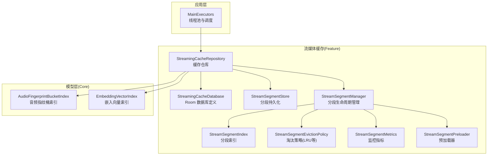
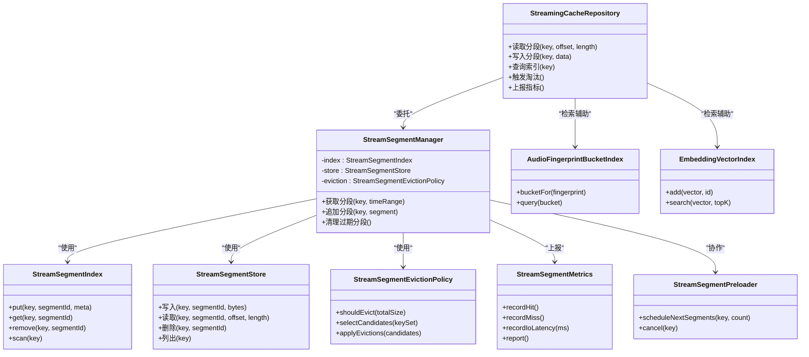
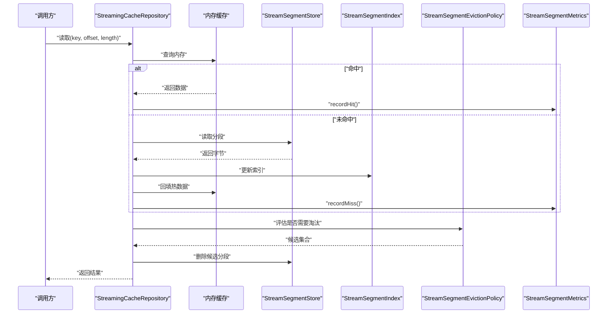
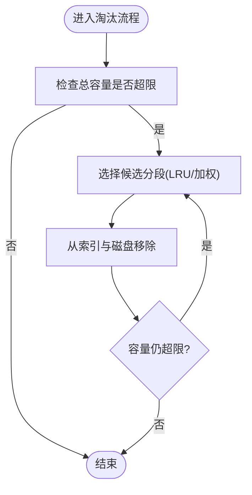
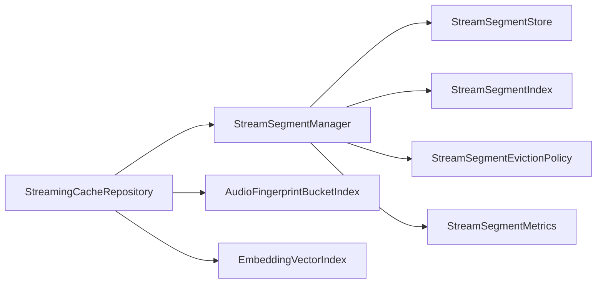

# 缓存策略

<cite>
**本文引用的文件**   
- [app/schemas/app.yukine.streaming.cache.StreamingCacheDatabase/1.json](file://app/schemas/app.yukine.streaming.cache.StreamingCacheDatabase/1.json)
- [feature/streaming/src/main/java/app/yukine/streaming/cache/StreamingCacheDatabase.kt](file://feature/streaming/src/main/java/app/yukine/streaming/cache/StreamingCacheDatabase.kt)
- [feature/streaming/src/main/java/app/yukine/streaming/cache/StreamingCacheRepository.kt](file://feature/streaming/src/main/java/app/yukine/streaming/cache/StreamingCacheRepository.kt)
- [feature/streaming/src/main/java/app/yukine/streaming/cache/StreamSegmentStore.kt](file://feature/streaming/src/main/java/app/yukine/streaming/cache/StreamSegmentStore.kt)
- [feature/streaming/src/main/java/app/yukine/streaming/cache/StreamSegmentManager.kt](file://feature/streaming/src/main/java/app/yukine/streaming/cache/StreamSegmentManager.kt)
- [feature/streaming/src/main/java/app/yukine/streaming/cache/StreamSegmentEvictionPolicy.kt](file://feature/streaming/src/main/java/app/yukine/streaming/cache/StreamSegmentEvictionPolicy.kt)
- [feature/streaming/src/main/java/app/yukine/streaming/cache/StreamSegmentIndex.kt](file://feature/streaming/src/main/java/app/yukine/streaming/cache/StreamSegmentIndex.kt)
- [feature/streaming/src/main/java/app/yukine/streaming/cache/StreamSegmentMetrics.kt](file://feature/streaming/src/main/java/app/yukine/streaming/cache/StreamSegmentMetrics.kt)
- [feature/streaming/src/main/java/app/yukine/streaming/cache/StreamSegmentPreloader.kt](file://feature/streaming/src/main/java/app/yukine/streaming/cache/StreamSegmentPreloader.kt)
- [core/model/src/main/java/app/yukine/model/fingerprint/AudioFingerprintBucketIndex.kt](file://core/model/src/main/java/app/yukine/model/fingerprint/AudioFingerprintBucketIndex.kt)
- [core/model/src/main/java/app/yukine/model/embedding/EmbeddingVectorIndex.kt](file://core/model/src/main/java/app/yukine/model/embedding/EmbeddingVectorIndex.kt)
- [app/src/main/java/app/yukine/MainExecutors.kt](file://app/src/main/java/app/yukine/MainExecutors.kt)
</cite>

## 目录
1. [简介](#简介)
2. [项目结构](#项目结构)
3. [核心组件](#核心组件)
4. [架构总览](#架构总览)
5. [详细组件分析](#详细组件分析)
6. [依赖关系分析](#依赖关系分析)
7. [性能考量](#性能考量)
8. [故障排查指南](#故障排查指南)
9. [结论](#结论)
10. [附录](#附录)

## 简介
本技术文档围绕 Echo Android 的缓存策略，系统性阐述多级缓存架构设计与实现，重点覆盖：
- 内存缓存与磁盘缓存协同工作模式
- 嵌入向量索引、音频指纹桶索引在检索与匹配中的角色
- 流媒体分段缓存（分片）的存储、索引、淘汰与预加载机制
- 缓存失效策略、LRU 算法与大小控制
- 缓存预热与命中率优化
- 监控指标、性能调优建议与问题诊断方法

## 项目结构
本项目采用模块化组织，缓存相关能力主要分布在 streaming 模块与 model 模块中，数据库 Schema 定义位于 app 模块。关键路径如下：
- 流式缓存数据库与仓库：feature/streaming/.../cache
- 流媒体分段存储与索引：feature/streaming/.../cache
- 模型层索引接口：core/model/.../fingerprint, core/model/.../embedding
- 应用级执行器：app/.../MainExecutors.kt

图表来源
- [feature/streaming/src/main/java/app/yukine/streaming/cache/StreamingCacheDatabase.kt](file://feature/streaming/src/main/java/app/yukine/streaming/cache/StreamingCacheDatabase.kt)
- [feature/streaming/src/main/java/app/yukine/streaming/cache/StreamingCacheRepository.kt](file://feature/streaming/src/main/java/app/yukine/streaming/cache/StreamingCacheRepository.kt)
- [feature/streaming/src/main/java/app/yukine/streaming/cache/StreamSegmentStore.kt](file://feature/streaming/src/main/java/app/yukine/streaming/cache/StreamSegmentStore.kt)
- [feature/streaming/src/main/java/app/yukine/streaming/cache/StreamSegmentManager.kt](file://feature/streaming/src/main/java/app/yukine/streaming/cache/StreamSegmentManager.kt)
- [feature/streaming/src/main/java/app/yukine/streaming/cache/StreamSegmentIndex.kt](file://feature/streaming/src/main/java/app/yukine/streaming/cache/StreamSegmentIndex.kt)
- [feature/streaming/src/main/java/app/yukine/streaming/cache/StreamSegmentEvictionPolicy.kt](file://feature/streaming/src/main/java/app/yukine/streaming/cache/StreamSegmentEvictionPolicy.kt)
- [feature/streaming/src/main/java/app/yukine/streaming/cache/StreamSegmentMetrics.kt](file://feature/streaming/src/main/java/app/yukine/streaming/cache/StreamSegmentMetrics.kt)
- [feature/streaming/src/main/java/app/yukine/streaming/cache/StreamSegmentPreloader.kt](file://feature/streaming/src/main/java/app/yukine/streaming/cache/StreamSegmentPreloader.kt)
- [core/model/src/main/java/app/yukine/model/fingerprint/AudioFingerprintBucketIndex.kt](file://core/model/src/main/java/app/yukine/model/fingerprint/AudioFingerprintBucketIndex.kt)
- [core/model/src/main/java/app/yukine/model/embedding/EmbeddingVectorIndex.kt](file://core/model/src/main/java/app/yukine/model/embedding/EmbeddingVectorIndex.kt)
- [app/src/main/java/app/yukine/MainExecutors.kt](file://app/src/main/java/app/yukine/MainExecutors.kt)

章节来源
- [feature/streaming/src/main/java/app/yukine/streaming/cache/StreamingCacheDatabase.kt](file://feature/streaming/src/main/java/app/yukine/streaming/cache/StreamingCacheDatabase.kt)
- [feature/streaming/src/main/java/app/yukine/streaming/cache/StreamingCacheRepository.kt](file://feature/streaming/src/main/java/app/yukine/streaming/cache/StreamingCacheRepository.kt)
- [feature/streaming/src/main/java/app/yukine/streaming/cache/StreamSegmentStore.kt](file://feature/streaming/src/main/java/app/yukine/streaming/cache/StreamSegmentStore.kt)
- [feature/streaming/src/main/java/app/yukine/streaming/cache/StreamSegmentManager.kt](file://feature/streaming/src/main/java/app/yukine/streaming/cache/StreamSegmentManager.kt)
- [feature/streaming/src/main/java/app/yukine/streaming/cache/StreamSegmentIndex.kt](file://feature/streaming/src/main/java/app/yukine/streaming/cache/StreamSegmentIndex.kt)
- [feature/streaming/src/main/java/app/yukine/streaming/cache/StreamSegmentEvictionPolicy.kt](file://feature/streaming/src/main/java/app/yukine/streaming/cache/StreamSegmentEvictionPolicy.kt)
- [feature/streaming/src/main/java/app/yukine/streaming/cache/StreamSegmentMetrics.kt](file://feature/streaming/src/main/java/app/yukine/streaming/cache/StreamSegmentMetrics.kt)
- [feature/streaming/src/main/java/app/yukine/streaming/cache/StreamSegmentPreloader.kt](file://feature/streaming/src/main/java/app/yukine/streaming/cache/StreamSegmentPreloader.kt)
- [core/model/src/main/java/app/yukine/model/fingerprint/AudioFingerprintBucketIndex.kt](file://core/model/src/main/java/app/yukine/model/fingerprint/AudioFingerprintBucketIndex.kt)
- [core/model/src/main/java/app/yukine/model/embedding/EmbeddingVectorIndex.kt](file://core/model/src/main/java/app/yukine/model/embedding/EmbeddingVectorIndex.kt)
- [app/src/main/java/app/yukine/MainExecutors.kt](file://app/src/main/java/app/yukine/MainExecutors.kt)

## 核心组件
- 流媒体缓存数据库：提供 Room 实体与 DAO，用于持久化流媒体分段元数据与状态。
- 缓存仓库：对外暴露统一的缓存读写接口，协调内存与磁盘两级缓存。
- 分段存储：负责将流媒体按固定大小的片段写入磁盘，并维护文件布局。
- 分段管理器：管理分段的创建、查找、合并、删除与生命周期。
- 分段索引：维护分段到时间戳、偏移量、校验和等映射，加速定位。
- 淘汰策略：基于 LRU 或混合策略，依据容量阈值与访问热度进行清理。
- 监控指标：记录命中/未命中、I/O 耗时、容量使用、淘汰次数等。
- 预加载器：根据播放队列与用户行为预测，提前拉取并落盘相邻分段。
- 模型索引：嵌入向量索引与音频指纹桶索引，支撑相似性检索与快速匹配。

章节来源
- [feature/streaming/src/main/java/app/yukine/streaming/cache/StreamingCacheDatabase.kt](file://feature/streaming/src/main/java/app/yukine/streaming/cache/StreamingCacheDatabase.kt)
- [feature/streaming/src/main/java/app/yukine/streaming/cache/StreamingCacheRepository.kt](file://feature/streaming/src/main/java/app/yukine/streaming/cache/StreamingCacheRepository.kt)
- [feature/streaming/src/main/java/app/yukine/streaming/cache/StreamSegmentStore.kt](file://feature/streaming/src/main/java/app/yukine/streaming/cache/StreamSegmentStore.kt)
- [feature/streaming/src/main/java/app/yukine/streaming/cache/StreamSegmentManager.kt](file://feature/streaming/src/main/java/app/yukine/streaming/cache/StreamSegmentManager.kt)
- [feature/streaming/src/main/java/app/yukine/streaming/cache/StreamSegmentIndex.kt](file://feature/streaming/src/main/java/app/yukine/streaming/cache/StreamSegmentIndex.kt)
- [feature/streaming/src/main/java/app/yukine/streaming/cache/StreamSegmentEvictionPolicy.kt](file://feature/streaming/src/main/java/app/yukine/streaming/cache/StreamSegmentEvictionPolicy.kt)
- [feature/streaming/src/main/java/app/yukine/streaming/cache/StreamSegmentMetrics.kt](file://feature/streaming/src/main/java/app/yukine/streaming/cache/StreamSegmentMetrics.kt)
- [feature/streaming/src/main/java/app/yukine/streaming/cache/StreamSegmentPreloader.kt](file://feature/streaming/src/main/java/app/yukine/streaming/cache/StreamSegmentPreloader.kt)
- [core/model/src/main/java/app/yukine/model/fingerprint/AudioFingerprintBucketIndex.kt](file://core/model/src/main/java/app/yukine/model/fingerprint/AudioFingerprintBucketIndex.kt)
- [core/model/src/main/java/app/yukine/model/embedding/EmbeddingVectorIndex.kt](file://core/model/src/main/java/app/yukine/model/embedding/EmbeddingVectorIndex.kt)

## 架构总览
Echo Android 的多级缓存由“内存 + 磁盘”两层构成，上层通过仓库统一入口访问；底层以分段为单位进行持久化，配合索引与淘汰策略保证高命中与可控占用。

图表来源
- [feature/streaming/src/main/java/app/yukine/streaming/cache/StreamingCacheRepository.kt](file://feature/streaming/src/main/java/app/yukine/streaming/cache/StreamingCacheRepository.kt)
- [feature/streaming/src/main/java/app/yukine/streaming/cache/StreamSegmentManager.kt](file://feature/streaming/src/main/java/app/yukine/streaming/cache/StreamSegmentManager.kt)
- [feature/streaming/src/main/java/app/yukine/streaming/cache/StreamSegmentStore.kt](file://feature/streaming/src/main/java/app/yukine/streaming/cache/StreamSegmentStore.kt)
- [feature/streaming/src/main/java/app/yukine/streaming/cache/StreamSegmentIndex.kt](file://feature/streaming/src/main/java/app/yukine/streaming/cache/StreamSegmentIndex.kt)
- [feature/streaming/src/main/java/app/yukine/streaming/cache/StreamSegmentEvictionPolicy.kt](file://feature/streaming/src/main/java/app/yukine/streaming/cache/StreamSegmentEvictionPolicy.kt)
- [feature/streaming/src/main/java/app/yukine/streaming/cache/StreamSegmentMetrics.kt](file://feature/streaming/src/main/java/app/yukine/streaming/cache/StreamSegmentMetrics.kt)
- [feature/streaming/src/main/java/app/yukine/streaming/cache/StreamSegmentPreloader.kt](file://feature/streaming/src/main/java/app/yukine/streaming/cache/StreamSegmentPreloader.kt)
- [core/model/src/main/java/app/yukine/model/fingerprint/AudioFingerprintBucketIndex.kt](file://core/model/src/main/java/app/yukine/model/fingerprint/AudioFingerprintBucketIndex.kt)
- [core/model/src/main/java/app/yukine/model/embedding/EmbeddingVectorIndex.kt](file://core/model/src/main/java/app/yukine/model/embedding/EmbeddingVectorIndex.kt)

## 详细组件分析

### 流媒体分段缓存（内存+磁盘）
- 设计要点
  - 内存层：存放最近访问的分段元数据与少量热数据，降低 I/O 延迟。
  - 磁盘层：按固定大小分段持久化，结合索引快速定位，避免随机写放大。
  - 淘汰策略：基于 LRU 与容量阈值，优先淘汰冷数据，保障整体命中率。
  - 预加载：根据播放进度与队列，提前拉取相邻分段，减少首帧等待。
- 关键流程（读取）
  - 仓库接收请求 → 检查内存命中 → 未命中则从磁盘分段读取 → 回填索引与内存 → 上报指标。
- 关键流程（写入）
  - 计算目标分段 → 追加写入磁盘 → 更新索引 → 评估容量 → 必要时触发淘汰。

图表来源
- [feature/streaming/src/main/java/app/yukine/streaming/cache/StreamingCacheRepository.kt](file://feature/streaming/src/main/java/app/yukine/streaming/cache/StreamingCacheRepository.kt)
- [feature/streaming/src/main/java/app/yukine/streaming/cache/StreamSegmentStore.kt](file://feature/streaming/src/main/java/app/yukine/streaming/cache/StreamSegmentStore.kt)
- [feature/streaming/src/main/java/app/yukine/streaming/cache/StreamSegmentIndex.kt](file://feature/streaming/src/main/java/app/yukine/streaming/cache/StreamSegmentIndex.kt)
- [feature/streaming/src/main/java/app/yukine/streaming/cache/StreamSegmentEvictionPolicy.kt](file://feature/streaming/src/main/java/app/yukine/streaming/cache/StreamSegmentEvictionPolicy.kt)
- [feature/streaming/src/main/java/app/yukine/streaming/cache/StreamSegmentMetrics.kt](file://feature/streaming/src/main/java/app/yukine/streaming/cache/StreamSegmentMetrics.kt)

章节来源
- [feature/streaming/src/main/java/app/yukine/streaming/cache/StreamingCacheRepository.kt](file://feature/streaming/src/main/java/app/yukine/streaming/cache/StreamingCacheRepository.kt)
- [feature/streaming/src/main/java/app/yukine/streaming/cache/StreamSegmentStore.kt](file://feature/streaming/src/main/java/app/yukine/streaming/cache/StreamSegmentStore.kt)
- [feature/streaming/src/main/java/app/yukine/streaming/cache/StreamSegmentIndex.kt](file://feature/streaming/src/main/java/app/yukine/streaming/cache/StreamSegmentIndex.kt)
- [feature/streaming/src/main/java/app/yukine/streaming/cache/StreamSegmentEvictionPolicy.kt](file://feature/streaming/src/main/java/app/yukine/streaming/cache/StreamSegmentEvictionPolicy.kt)
- [feature/streaming/src/main/java/app/yukine/streaming/cache/StreamSegmentMetrics.kt](file://feature/streaming/src/main/java/app/yukine/streaming/cache/StreamSegmentMetrics.kt)

### 嵌入向量索引
- 职责
  - 维护向量与 ID 的映射，支持近似最近邻搜索，用于内容相似性推荐与去重。
- 复杂度
  - 插入：O(1) 平均（哈希表）或 O(log N)（树形结构）。
  - 搜索：近似 O(k log N) 或 O(k·d)，k 为 TopK，d 为维度。
- 优化建议
  - 批量构建索引，减少重建开销。
  - 对热点向量设置内存常驻，提升查询速度。

章节来源
- [core/model/src/main/java/app/yukine/model/embedding/EmbeddingVectorIndex.kt](file://core/model/src/main/java/app/yukine/model/embedding/EmbeddingVectorIndex.kt)

### 音频指纹桶索引
- 职责
  - 将音频指纹按桶划分，缩小匹配范围，提高相似度比对效率。
- 复杂度
  - 桶分配：O(1)。
  - 桶内匹配：O(m)，m 为桶内候选数。
- 优化建议
  - 动态调整桶数量，平衡空间与时间。
  - 对高频桶进行局部排序或二次过滤。

章节来源
- [core/model/src/main/java/app/yukine/model/fingerprint/AudioFingerprintBucketIndex.kt](file://core/model/src/main/java/app/yukine/model/fingerprint/AudioFingerprintBucketIndex.kt)

### 流媒体缓存数据库（Room）
- 职责
  - 持久化分段元数据（如 key、segmentId、时间戳、长度、校验和等），并提供事务性操作。
- 设计要点
  - 使用迁移脚本确保版本演进。
  - 针对常用查询建立索引，减少扫描成本。

章节来源
- [app/schemas/app.yukine.streaming.cache.StreamingCacheDatabase/1.json](file://app/schemas/app.yukine.streaming.cache.StreamingCacheDatabase/1.json)
- [feature/streaming/src/main/java/app/yukine/streaming/cache/StreamingCacheDatabase.kt](file://feature/streaming/src/main/java/app/yukine/streaming/cache/StreamingCacheDatabase.kt)

### 分段管理器与淘汰策略
- 分段管理器
  - 协调索引与存储，处理分段的生命周期（创建、查找、合并、删除）。
- 淘汰策略（LRU 为主）
  - 基于访问时间或频率选择候选，结合容量阈值触发清理。
  - 可引入权重（如分段大小、冷热程度）进行加权淘汰。

图表来源
- [feature/streaming/src/main/java/app/yukine/streaming/cache/StreamSegmentManager.kt](file://feature/streaming/src/main/java/app/yukine/streaming/cache/StreamSegmentManager.kt)
- [feature/streaming/src/main/java/app/yukine/streaming/cache/StreamSegmentEvictionPolicy.kt](file://feature/streaming/src/main/java/app/yukine/streaming/cache/StreamSegmentEvictionPolicy.kt)

章节来源
- [feature/streaming/src/main/java/app/yukine/streaming/cache/StreamSegmentManager.kt](file://feature/streaming/src/main/java/app/yukine/streaming/cache/StreamSegmentManager.kt)
- [feature/streaming/src/main/java/app/yukine/streaming/cache/StreamSegmentEvictionPolicy.kt](file://feature/streaming/src/main/java/app/yukine/streaming/cache/StreamSegmentEvictionPolicy.kt)

### 预加载与缓存预热
- 预加载
  - 根据播放进度与队列，提前拉取相邻分段，减少卡顿。
  - 支持取消与优先级调整，避免浪费带宽与存储。
- 预热
  - 在空闲时段或应用启动后，基于历史播放偏好预热热门内容。

章节来源
- [feature/streaming/src/main/java/app/yukine/streaming/cache/StreamSegmentPreloader.kt](file://feature/streaming/src/main/java/app/yukine/streaming/cache/StreamSegmentPreloader.kt)
- [app/src/main/java/app/yukine/MainExecutors.kt](file://app/src/main/java/app/yukine/MainExecutors.kt)

## 依赖关系分析
- 组件耦合
  - 仓库对管理器强依赖，管理器对索引、存储、淘汰策略组合依赖。
  - 模型索引作为检索辅助，被仓库间接使用。
- 外部依赖
  - Room 数据库用于元数据持久化。
  - 系统 IO 与文件系统用于分段文件读写。
- 潜在循环
  - 当前分层清晰，未见直接循环依赖；需关注指标上报与预加载回调的异步边界。

图表来源
- [feature/streaming/src/main/java/app/yukine/streaming/cache/StreamingCacheRepository.kt](file://feature/streaming/src/main/java/app/yukine/streaming/cache/StreamingCacheRepository.kt)
- [feature/streaming/src/main/java/app/yukine/streaming/cache/StreamSegmentManager.kt](file://feature/streaming/src/main/java/app/yukine/streaming/cache/StreamSegmentManager.kt)
- [feature/streaming/src/main/java/app/yukine/streaming/cache/StreamSegmentStore.kt](file://feature/streaming/src/main/java/app/yukine/streaming/cache/StreamSegmentStore.kt)
- [feature/streaming/src/main/java/app/yukine/streaming/cache/StreamSegmentIndex.kt](file://feature/streaming/src/main/java/app/yukine/streaming/cache/StreamSegmentIndex.kt)
- [feature/streaming/src/main/java/app/yukine/streaming/cache/StreamSegmentEvictionPolicy.kt](file://feature/streaming/src/main/java/app/yukine/streaming/cache/StreamSegmentEvictionPolicy.kt)
- [feature/streaming/src/main/java/app/yukine/streaming/cache/StreamSegmentMetrics.kt](file://feature/streaming/src/main/java/app/yukine/streaming/cache/StreamSegmentMetrics.kt)
- [core/model/src/main/java/app/yukine/model/fingerprint/AudioFingerprintBucketIndex.kt](file://core/model/src/main/java/app/yukine/model/fingerprint/AudioFingerprintBucketIndex.kt)
- [core/model/src/main/java/app/yukine/model/embedding/EmbeddingVectorIndex.kt](file://core/model/src/main/java/app/yukine/model/embedding/EmbeddingVectorIndex.kt)

章节来源
- [feature/streaming/src/main/java/app/yukine/streaming/cache/StreamingCacheRepository.kt](file://feature/streaming/src/main/java/app/yukine/streaming/cache/StreamingCacheRepository.kt)
- [feature/streaming/src/main/java/app/yukine/streaming/cache/StreamSegmentManager.kt](file://feature/streaming/src/main/java/app/yukine/streaming/cache/StreamSegmentManager.kt)
- [feature/streaming/src/main/java/app/yukine/streaming/cache/StreamSegmentStore.kt](file://feature/streaming/src/main/java/app/yukine/streaming/cache/StreamSegmentStore.kt)
- [feature/streaming/src/main/java/app/yukine/streaming/cache/StreamSegmentIndex.kt](file://feature/streaming/src/main/java/app/yukine/streaming/cache/StreamSegmentIndex.kt)
- [feature/streaming/src/main/java/app/yukine/streaming/cache/StreamSegmentEvictionPolicy.kt](file://feature/streaming/src/main/java/app/yukine/streaming/cache/StreamSegmentEvictionPolicy.kt)
- [feature/streaming/src/main/java/app/yukine/streaming/cache/StreamSegmentMetrics.kt](file://feature/streaming/src/main/java/app/yukine/streaming/cache/StreamSegmentMetrics.kt)
- [core/model/src/main/java/app/yukine/model/fingerprint/AudioFingerprintBucketIndex.kt](file://core/model/src/main/java/app/yukine/model/fingerprint/AudioFingerprintBucketIndex.kt)
- [core/model/src/main/java/app/yukine/model/embedding/EmbeddingVectorIndex.kt](file://core/model/src/main/java/app/yukine/model/embedding/EmbeddingVectorIndex.kt)

## 性能考量
- 命中率优化
  - 合理设置分段大小，兼顾顺序读与随机定位成本。
  - 提升内存缓存命中率，减少磁盘 I/O。
  - 预加载相邻分段，平滑首帧与跳转延迟。
- 容量控制
  - 基于 LRU 与容量阈值进行淘汰，避免无限增长。
  - 对大分段与长尾分段进行特殊处理，防止碎片化。
- I/O 与并发
  - 使用专用线程池执行磁盘读写与网络拉取，避免阻塞主线程。
  - 合并小写入，减少系统调用次数。
- 索引与检索
  - 嵌入向量与指纹桶索引应定期重建与压缩，保持查询性能。
  - 热点索引驻留内存，冷数据按需加载。

[本节为通用指导，不直接分析具体文件]

## 故障排查指南
- 常见问题
  - 命中率低：检查分段大小、预加载策略与内存缓存命中率。
  - 容量泄漏：确认淘汰策略是否生效，是否存在未释放的引用。
  - I/O 抖动：观察磁盘队列与线程池饱和情况，调整并发度。
  - 索引不一致：核对索引与磁盘分段的一致性，必要时重建索引。
- 诊断步骤
  - 查看监控指标：命中/未命中比率、I/O 耗时分布、容量使用趋势。
  - 复现场景：构造特定播放序列，验证预加载与淘汰行为。
  - 日志分析：关注异常堆栈与警告信息，定位失败点。

章节来源
- [feature/streaming/src/main/java/app/yukine/streaming/cache/StreamSegmentMetrics.kt](file://feature/streaming/src/main/java/app/yukine/streaming/cache/StreamSegmentMetrics.kt)

## 结论
Echo Android 的缓存策略通过“内存+磁盘”的多级架构，结合分段化存储、高效索引与 LRU 淘汰，实现了高命中率与可控占用的平衡。嵌入向量与音频指纹桶索引进一步提升了检索与匹配效率。通过合理的预加载与监控指标，可在复杂播放场景下保持稳定体验。后续可继续优化淘汰权重、索引重建策略与并发模型，以进一步提升性能与稳定性。

[本节为总结，不直接分析具体文件]

## 附录
- 术语
  - 分段：流媒体按固定大小切分的连续数据块。
  - 索引：用于快速定位分段与其元数据的映射结构。
  - 淘汰：当容量超限时，依据策略移除部分缓存项。
  - 预加载：在需要之前主动拉取并缓存数据。
- 配置建议
  - 分段大小：根据网络与设备特性调整，常见范围为几百 KB 至几 MB。
  - 内存上限：限制热数据规模，避免影响前台应用。
  - 预加载窗口：根据播放队列与用户习惯设定。

[本节为概念说明，不直接分析具体文件]