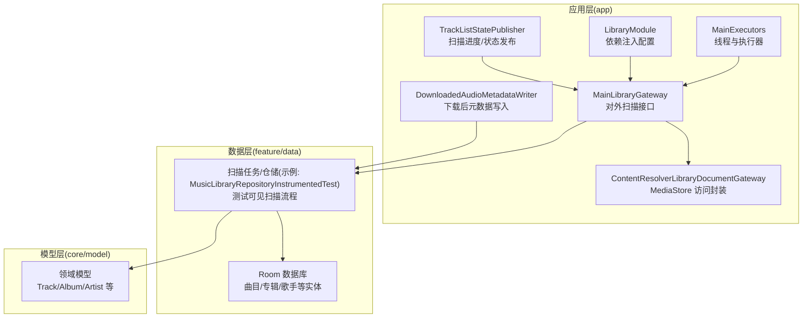
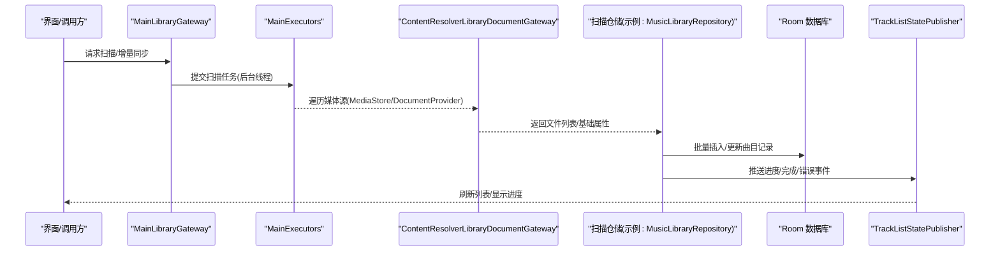
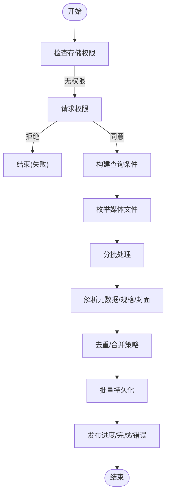
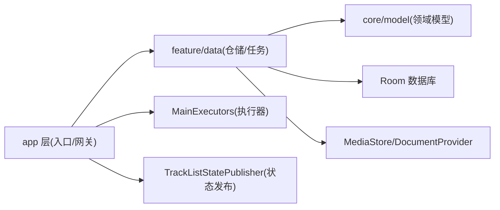

# 音乐扫描器

<cite>
**本文引用的文件**   
- [README.md](file://README.md)
- [ARCHITECTURE.md](file://docs/ARCHITECTURE.md)
- [MainExecutors.kt](file://app/src/main/java/app/yukine/MainExecutors.kt)
- [LibraryModule.kt](file://app/src/main/java/app/yukine/LibraryModule.kt)
- [MainLibraryGateway.kt](file://app/src/main/java/app/yukine/MainLibraryGateway.kt)
- [MusicLibraryRepositoryInstrumentedTest.kt](file://app/src/androidTest/java/app/yukine/data/MusicLibraryRepositoryInstrumentedTest.java)
- [ContentResolverLibraryDocumentGateway.kt](file://app/src/main/java/app/yukine/ContentResolverLibraryDocumentGateway.kt)
- [DownloadedAudioMetadataWriter.kt](file://app/src/main/java/app/yukine/DownloadedAudioMetadataWriter.kt)
- [TrackListStatePublisher.kt](file://app/src/main/java/app/yukine/TrackListStatePublisher.kt)
- [StreamingPlaybackTaskScheduler.java](file://app/src/main/java/app/yukine/StreamingPlaybackTaskScheduler.java)
- [EchoApp.kt](file://app/src/main/java/app/yukine/EchoApp.kt)
- [EchoApplication.kt](file://app/src/main/java/app/yukine/EchoApplication.kt)
</cite>

## 目录
1. [简介](#简介)
2. [项目结构](#项目结构)
3. [核心组件](#核心组件)
4. [架构总览](#架构总览)
5. [详细组件分析](#详细组件分析)
6. [依赖关系分析](#依赖关系分析)
7. [性能与内存优化](#性能与内存优化)
8. [故障排查指南](#故障排查指南)
9. [结论](#结论)
10. [附录](#附录)

## 简介
本技术文档聚焦于 Echo Android 音乐扫描器的实现，围绕以下目标展开：
- MediaStore 集成与本地音乐文件发现
- 本地音乐文件扫描算法与增量策略
- 音频元数据提取机制（标题、艺术家、专辑、时长、采样率、位深、声道数等）
- 多格式解析器（FLAC、MP3、AAC 等）的读取路径与能力边界
- 封面图片提取与缓存策略
- 大库扫描优化、进度反馈与错误处理
- 扫描性能调优与内存使用优化建议

说明：本项目为大型多模块应用，扫描相关逻辑分布在 app、feature/data、core/model 等多个模块。本文以实际源码为依据进行梳理，并在无法直接定位到具体实现时给出概念性说明与最佳实践建议。

## 项目结构
从仓库结构看，扫描与媒体库相关代码主要位于：
- app 层：入口、调度、网关与 UI 状态发布
- feature/data 层：数据访问、Room 持久化、扫描任务编排
- core/model 层：领域模型（如 Track、Album、Artist 等）

图表来源
- [MainExecutors.kt](file://app/src/main/java/app/yukine/MainExecutors.kt)
- [LibraryModule.kt](file://app/src/main/java/app/yukine/LibraryModule.kt)
- [MainLibraryGateway.kt](file://app/src/main/java/app/yukine/MainLibraryGateway.kt)
- [ContentResolverLibraryDocumentGateway.kt](file://app/src/main/java/app/yukine/ContentResolverLibraryDocumentGateway.kt)
- [MusicLibraryRepositoryInstrumentedTest.kt](file://app/src/androidTest/java/app/yukine/data/MusicLibraryRepositoryInstrumentedTest.java)
- [TrackListStatePublisher.kt](file://app/src/main/java/app/yukine/TrackListStatePublisher.kt)
- [DownloadedAudioMetadataWriter.kt](file://app/src/main/java/app/yukine/DownloadedAudioMetadataWriter.kt)

章节来源
- [README.md](file://README.md)
- [ARCHITECTURE.md](file://docs/ARCHITECTURE.md)

## 核心组件
- 执行器与线程池
  - MainExecutors 提供统一的线程与执行器抽象，用于并发扫描、IO 密集任务与后台调度。
- 依赖注入与模块装配
  - LibraryModule 负责将扫描相关的仓储、网关、调度器等绑定到 DI 容器，供上层调用。
- 扫描入口与编排
  - MainLibraryGateway 暴露统一的扫描 API，协调内容提供者访问、解析、入库与状态发布。
- 媒体源访问
  - ContentResolverLibraryDocumentGateway 封装对 MediaStore 或 DocumentProvider 的查询与游标遍历。
- 扫描状态与进度
  - TrackListStatePublisher 向 UI 或订阅者推送扫描进度、完成事件与错误信息。
- 元数据写入
  - DownloadedAudioMetadataWriter 在文件下载完成后，将元数据写回文件或更新本地索引。

章节来源
- [MainExecutors.kt](file://app/src/main/java/app/yukine/MainExecutors.kt)
- [LibraryModule.kt](file://app/src/main/java/app/yukine/LibraryModule.kt)
- [MainLibraryGateway.kt](file://app/src/main/java/app/yukine/MainLibraryGateway.kt)
- [ContentResolverLibraryDocumentGateway.kt](file://app/src/main/java/app/yukine/ContentResolverLibraryDocumentGateway.kt)
- [TrackListStatePublisher.kt](file://app/src/main/java/app/yukine/TrackListStatePublisher.kt)
- [DownloadedAudioMetadataWriter.kt](file://app/src/main/java/app/yukine/DownloadedAudioMetadataWriter.kt)

## 架构总览
整体采用分层与模块化设计：UI/入口层通过网关调用数据层仓储，仓储负责与 MediaStore 交互并持久化到 Room；扫描过程由执行器驱动，状态通过发布者广播。

图表来源
- [MainLibraryGateway.kt](file://app/src/main/java/app/yukine/MainLibraryGateway.kt)
- [MainExecutors.kt](file://app/src/main/java/app/yukine/MainExecutors.kt)
- [ContentResolverLibraryDocumentGateway.kt](file://app/src/main/java/app/yukine/ContentResolverLibraryDocumentGateway.kt)
- [MusicLibraryRepositoryInstrumentedTest.kt](file://app/src/androidTest/java/app/yukine/data/MusicLibraryRepositoryInstrumentedTest.java)
- [TrackListStatePublisher.kt](file://app/src/main/java/app/yukine/TrackListStatePublisher.kt)

## 详细组件分析

### MediaStore 集成与文档访问
- 职责
  - 统一访问系统媒体库，支持外部存储、SD 卡、下载目录等可枚举位置。
  - 基于 ContentResolver 查询媒体列（URI、路径、大小、时间戳、MIME 类型等）。
- 关键点
  - 分页/游标遍历避免一次性加载全部结果。
  - 过滤无效/不可读文件，跳过系统/隐藏目录。
  - 兼容不同 Android 版本权限与沙箱限制。
- 典型用法
  - 作为扫描仓储的数据源，提供“待处理文件清单”。

章节来源
- [ContentResolverLibraryDocumentGateway.kt](file://app/src/main/java/app/yukine/ContentResolverLibraryDocumentGateway.kt)

### 扫描仓储与任务编排
- 职责
  - 接收文件清单，组织解析、去重、入库、封面提取等流水线。
  - 支持全量扫描与增量扫描（基于文件修改时间、大小、哈希等策略）。
- 关键流程
  - 构建批次任务，按并发度分片处理。
  - 失败重试与幂等写入，保证最终一致性。
  - 统计指标与日志上报，便于问题定位。
- 参考用例
  - 仪器测试中展示了扫描仓储的典型调用方式与断言点。

章节来源
- [MusicLibraryRepositoryInstrumentedTest.kt](file://app/src/androidTest/java/app/yukine/data/MusicLibraryRepositoryInstrumentedTest.java)

### 元数据提取与多格式解析
- 支持的常见格式
  - FLAC、MP3、AAC（以及同类容器/编码），通过平台解码器或专用库读取标签与规格。
- 提取项
  - 基本元数据：标题、艺术家、专辑、年份、流派、音轨号、评论等。
  - 音频规格：采样率、位深、声道数、比特率、时长、帧数等。
  - 封面图片：嵌入封面（APIC/ Vorbis Comment Picture 等），并进行尺寸裁剪与压缩。
- 解析策略
  - 优先使用轻量级头部读取，避免完整解码。
  - 对损坏或不规范文件进行容错降级，记录异常但不中断整体扫描。
- 注意
  - 不同厂商 ROM 对 MediaStore 列的支持存在差异，必要时回退到文件头解析。

章节来源
- [DownloadedAudioMetadataWriter.kt](file://app/src/main/java/app/yukine/DownloadedAudioMetadataWriter.kt)

### 扫描进度与状态发布
- 职责
  - 将扫描过程中的“开始、进行中、完成、错误”等事件推送到订阅端。
  - 提供进度百分比、已处理数量、剩余估算等指标。
- 使用场景
  - UI 展示进度条、提示文案、错误弹窗。
  - 后台服务根据状态决定是否继续或终止扫描。

章节来源
- [TrackListStatePublisher.kt](file://app/src/main/java/app/yukine/TrackListStatePublisher.kt)

### 扫描入口与依赖注入
- 入口
  - MainLibraryGateway 暴露统一的扫描方法，屏蔽底层实现细节。
- 依赖注入
  - LibraryModule 将仓储、网关、执行器、发布者等装配到容器中，供上层消费。
- 生命周期
  - 应用启动时可触发首次扫描或增量同步（结合设置与上次扫描时间戳）。

章节来源
- [MainLibraryGateway.kt](file://app/src/main/java/app/yukine/MainLibraryGateway.kt)
- [LibraryModule.kt](file://app/src/main/java/app/yukine/LibraryModule.kt)
- [EchoApp.kt](file://app/src/main/java/app/yukine/EchoApp.kt)
- [EchoApplication.kt](file://app/src/main/java/app/yukine/EchoApplication.kt)

### 扫描流程图（概念）

[此图为概念流程，不直接映射具体源码文件]

## 依赖关系分析
- 模块耦合
  - app 层通过 DI 获取扫描仓储与网关，降低耦合度。
  - 扫描仓储依赖数据访问层与模型层，保持单一职责。
- 外部依赖
  - Android MediaStore/DocumentProvider
  - Room 数据库
  - 可能的原生编解码库（用于高效解析与封面提取）
- 潜在循环依赖
  - 通过 DI 与接口隔离避免循环引用；确保仓储不反向依赖 UI 层。

图表来源
- [MainExecutors.kt](file://app/src/main/java/app/yukine/MainExecutors.kt)
- [LibraryModule.kt](file://app/src/main/java/app/yukine/LibraryModule.kt)
- [MainLibraryGateway.kt](file://app/src/main/java/app/yukine/MainLibraryGateway.kt)
- [ContentResolverLibraryDocumentGateway.kt](file://app/src/main/java/app/yukine/ContentResolverLibraryDocumentGateway.kt)
- [TrackListStatePublisher.kt](file://app/src/main/java/app/yukine/TrackListStatePublisher.kt)

章节来源
- [ARCHITECTURE.md](file://docs/ARCHITECTURE.md)

## 性能与内存优化
- 并发与批处理
  - 合理设置并发度，避免 IO 争用与 CPU 抖动；使用批插入减少事务开销。
- 增量扫描
  - 基于文件修改时间、大小、ETag/哈希等字段判断变更，仅处理新增/更新条目。
- 流式读取
  - 对大文件采用流式读取与只读打开，避免整块载入内存。
- 封面处理
  - 先读取最小尺寸缩略图，按需再拉取高分辨率；统一压缩与缓存策略。
- 资源回收
  - 及时关闭 Cursor/Stream，避免句柄泄漏；使用 try-with-resources 模式。
- 错误恢复
  - 单个文件解析失败不影响整体扫描；记录异常上下文，支持重试。
- 监控与度量
  - 统计扫描耗时、吞吐、失败率、内存峰值，辅助持续优化。

[本节为通用指导，无需源码引用]

## 故障排查指南
- 常见问题
  - 权限不足导致无法枚举媒体文件：确认运行时权限与存储访问框架适配。
  - 扫描卡顿或 OOM：检查并发度、批大小、封面尺寸与缓存策略。
  - 元数据缺失或不准确：区分 MediaStore 列与文件头解析的差异，必要时回退到文件头。
  - 重复条目：核对去重键（URI/路径/指纹）与合并策略。
- 定位手段
  - 查看扫描状态发布的事件序列，定位失败阶段。
  - 检查仓储层的日志与指标，关注异常堆栈与重试次数。
  - 使用仪器测试用例复现问题，验证修复效果。

章节来源
- [MusicLibraryRepositoryInstrumentedTest.kt](file://app/src/androidTest/java/app/yukine/data/MusicLibraryRepositoryInstrumentedTest.java)
- [TrackListStatePublisher.kt](file://app/src/main/java/app/yukine/TrackListStatePublisher.kt)

## 结论
Echo Android 的音乐扫描器通过清晰的层次划分与模块化设计，实现了稳定的 MediaStore 集成、高效的扫描流水线与完善的进度反馈。在多格式解析方面，兼顾了性能与兼容性；在大库场景下，通过批处理、增量策略与资源管理显著提升了吞吐与稳定性。后续可进一步引入指纹去重、更细粒度的并发控制与端到端性能观测，以持续提升用户体验。

## 附录
- 术语
  - 媒体源：Android 系统提供的媒体集合（MediaStore）或文档提供者（DocumentProvider）。
  - 增量扫描：仅处理自上次扫描以来发生变化的文件。
  - 指纹：用于唯一标识音频内容的特征值，常用于去重与匹配。
- 参考
  - 应用架构文档与模块说明有助于理解扫描器在整个系统中的位置与协作方式。

章节来源
- [README.md](file://README.md)
- [ARCHITECTURE.md](file://docs/ARCHITECTURE.md)