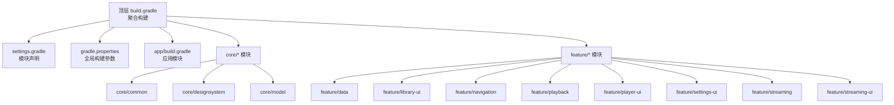
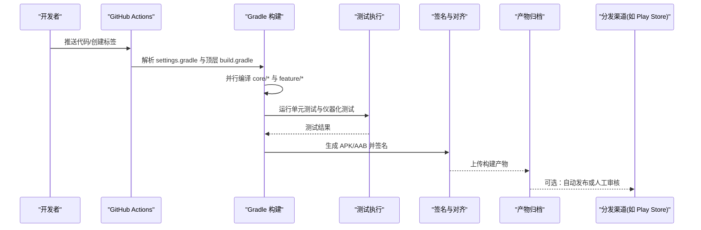
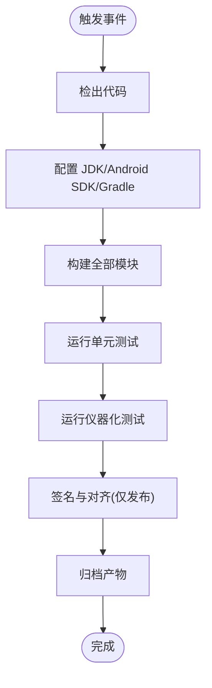
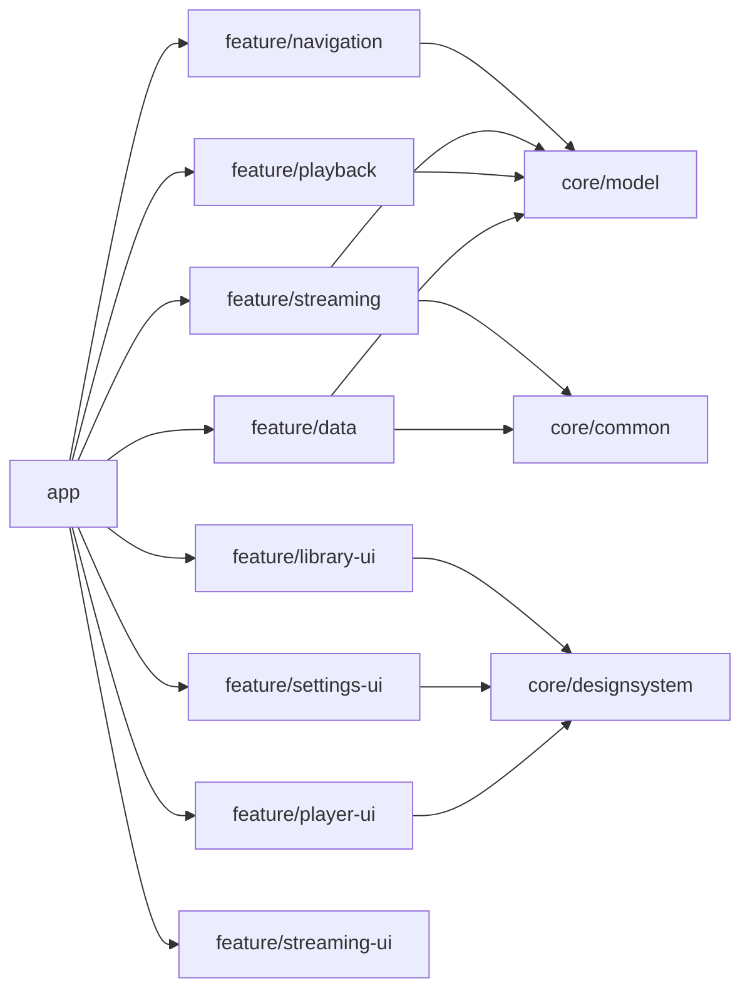

# 构建与部署

<cite>
**本文引用的文件**   
- [build.gradle](file://build.gradle)
- [settings.gradle](file://settings.gradle)
- [gradle.properties](file://gradle.properties)
- [app/build.gradle](file://app/build.gradle)
- [core/common/build.gradle](file://core/common/build.gradle)
- [core/designsystem/build.gradle](file://core/designsystem/build.gradle)
- [core/model/build.gradle](file://core/model/build.gradle)
- [feature/data/build.gradle](file://feature/data/build.gradle)
- [feature/library-ui/build.gradle](file://feature/library-ui/build.gradle)
- [feature/navigation/build.gradle](file://feature/navigation/build.gradle)
- [feature/playback/build.gradle](file://feature/playback/build.gradle)
- [feature/player-ui/build.gradle](file://feature/player-ui/build.gradle)
- [feature/settings-ui/build.gradle](file://feature/settings-ui/build.gradle)
- [feature/streaming/build.gradle](file://feature/streaming/build.gradle)
- [feature/streaming-ui/build.gradle](file://feature/streaming-ui/build.gradle)
- [.github/workflows/android.yml](file://.github/workflows/android.yml)
- [.github/workflows/release.yml](file://.github/workflows/release.yml)
- [scripts/verify-release.ps1](file://scripts/verify-release.ps1)
- [scripts/p0-stability-gate.ps1](file://scripts/p0-stability-gate.ps1)
- [scripts/playback-stability-smoke.ps1](file://scripts/playback-stability-smoke.ps1)
</cite>

## 目录
1. [简介](#简介)
2. [项目结构](#项目结构)
3. [核心组件](#核心组件)
4. [架构总览](#架构总览)
5. [详细组件分析](#详细组件分析)
6. [依赖分析](#依赖分析)
7. [性能考虑](#性能考虑)
8. [故障排查指南](#故障排查指南)
9. [结论](#结论)
10. [附录](#附录)

## 简介
本文件面向 Echo Android 应用的构建与部署，覆盖以下主题：
- Gradle 构建配置与多模块优化
- 签名打包流程（debug、release、staging）
- CI/CD 流水线（GitHub Actions）与自动化测试、代码质量检查
- 环境差异与版本管理策略
- 应用发布流程与 Play Store 上架准备
- 热更新方案建议
- 构建问题排查与性能优化建议

## 项目结构
Echo Android 采用多模块结构，顶层聚合构建脚本统一协调各子模块的编译、测试与打包。关键目录与职责如下：
- app：主应用模块，包含 UI、业务编排、资源与清单等
- core：通用能力与模型（common、designsystem、model）
- feature：按功能域划分的特性模块（data、library-ui、navigation、playback、player-ui、settings-ui、streaming、streaming-ui）
- gradle：Gradle Wrapper 与版本目录（libs.versions.toml）
- .github/workflows：CI/CD 工作流定义
- scripts：本地与 CI 使用的辅助脚本

图表来源
- [build.gradle:1-200](file://build.gradle#L1-L200)
- [settings.gradle:1-200](file://settings.gradle#L1-L200)
- [gradle.properties:1-200](file://gradle.properties#L1-L200)

章节来源
- [build.gradle:1-200](file://build.gradle#L1-L200)
- [settings.gradle:1-200](file://settings.gradle#L1-L200)
- [gradle.properties:1-200](file://gradle.properties#L1-L200)

## 核心组件
本节聚焦构建系统的关键构件及其职责：
- 顶层构建脚本：统一插件、仓库、公共依赖与任务编排
- settings.gradle：声明所有参与构建的子模块
- gradle.properties：全局构建开关（并行、内存、缓存、签名等）
- 各模块 build.gradle：模块级依赖、变体、产物与任务扩展
- CI 工作流：触发条件、构建步骤、测试与产物归档
- 辅助脚本：发布校验、稳定性门禁与冒烟测试

章节来源
- [build.gradle:1-200](file://build.gradle#L1-L200)
- [settings.gradle:1-200](file://settings.gradle#L1-L200)
- [gradle.properties:1-200](file://gradle.properties#L1-L200)
- [app/build.gradle:1-200](file://app/build.gradle#L1-L200)
- [.github/workflows/android.yml:1-200](file://.github/workflows/android.yml#L1-L200)
- [.github/workflows/release.yml:1-200](file://.github/workflows/release.yml#L1-L200)
- [scripts/verify-release.ps1:1-200](file://scripts/verify-release.ps1#L1-L200)
- [scripts/p0-stability-gate.ps1:1-200](file://scripts/p0-stability-gate.ps1#L1-L200)
- [scripts/playback-stability-smoke.ps1:1-200](file://scripts/playback-stability-smoke.ps1#L1-L200)

## 架构总览
下图展示从源码到可安装包的端到端构建与发布路径，包括多模块编译、测试、签名与产物归档。

图表来源
- [.github/workflows/android.yml:1-200](file://.github/workflows/android.yml#L1-L200)
- [.github/workflows/release.yml:1-200](file://.github/workflows/release.yml#L1-L200)
- [build.gradle:1-200](file://build.gradle#L1-L200)
- [settings.gradle:1-200](file://settings.gradle#L1-L200)

## 详细组件分析

### Gradle 构建配置与多模块优化
- 顶层构建脚本集中管理插件版本、仓库源、公共依赖与任务钩子，确保各模块一致性与可维护性
- settings.gradle 明确列出所有子模块，便于增量构建与并行执行
- gradle.properties 提供全局构建参数，例如并行度、JVM 堆大小、构建缓存与守护进程开关
- 各模块 build.gradle 按需引入 Android/Kotlin 插件、依赖库、ProGuard/R8 规则与资源过滤
- 通过版本目录（libs.versions.toml）统一管理第三方库版本，降低升级成本与冲突风险

优化要点
- 启用并行构建与构建缓存，缩短全量构建时间
- 合理拆分模块，减少跨模块耦合，提升增量编译效率
- 使用 R8/ProGuard 进行代码压缩与混淆，减小包体
- 按需启用 lint、单元测试与仪器化测试，平衡质量与速度

章节来源
- [build.gradle:1-200](file://build.gradle#L1-L200)
- [settings.gradle:1-200](file://settings.gradle#L1-L200)
- [gradle.properties:1-200](file://gradle.properties#L1-L200)
- [app/build.gradle:1-200](file://app/build.gradle#L1-L200)
- [core/common/build.gradle:1-200](file://core/common/build.gradle#L1-L200)
- [core/designsystem/build.gradle:1-200](file://core/designsystem/build.gradle#L1-L200)
- [core/model/build.gradle:1-200](file://core/model/build.gradle#L1-L200)
- [feature/data/build.gradle:1-200](file://feature/data/build.gradle#L1-L200)
- [feature/library-ui/build.gradle:1-200](file://feature/library-ui/build.gradle#L1-L200)
- [feature/navigation/build.gradle:1-200](file://feature/navigation/build.gradle#L1-L200)
- [feature/playback/build.gradle:1-200](file://feature/playback/build.gradle#L1-L200)
- [feature/player-ui/build.gradle:1-200](file://feature/player-ui/build.gradle#L1-L200)
- [feature/settings-ui/build.gradle:1-200](file://feature/settings-ui/build.gradle#L1-L200)
- [feature/streaming/build.gradle:1-200](file://feature/streaming/build.gradle#L1-L200)
- [feature/streaming-ui/build.gradle:1-200](file://feature/streaming-ui/build.gradle#L1-L200)

### 签名打包流程（debug、release、staging）
- debug：默认使用调试密钥，无需手动配置；适合本地开发与联调
- release：需配置正式签名信息（keystore、别名、密码），开启 R8/ProGuard 与资源压缩，输出 AAB/APK
- staging：可作为预发布变体，复用 release 优化但注入不同后端地址或日志级别，用于灰度验证

建议实践
- 将签名信息放入受保护的 secrets 或本地安全存储，避免硬编码
- 在 CI 中仅对特定分支或标签触发 release/staging 构建
- 为每个变体输出清晰的产物命名，便于追溯

章节来源
- [app/build.gradle:1-200](file://app/build.gradle#L1-L200)
- [gradle.properties:1-200](file://gradle.properties#L1-L200)
- [.github/workflows/release.yml:1-200](file://.github/workflows/release.yml#L1-L200)

### CI/CD 流水线配置与自动化测试
- GitHub Actions 工作流负责拉取代码、设置 JDK/Android SDK、解析依赖、执行构建与测试、归档产物
- android.yml：常规构建与测试，适用于 PR 与日常提交
- release.yml：针对发布分支或标签，执行完整构建、签名与产物归档，支持后续发布动作

测试策略
- 单元测试：快速反馈逻辑正确性
- 仪器化测试：在模拟器或真机上验证关键路径与兼容性
- 稳定性门禁：在关键任务前执行稳定性检查，阻断不稳定变更

图表来源
- [.github/workflows/android.yml:1-200](file://.github/workflows/android.yml#L1-L200)
- [.github/workflows/release.yml:1-200](file://.github/workflows/release.yml#L1-L200)

章节来源
- [.github/workflows/android.yml:1-200](file://.github/workflows/android.yml#L1-L200)
- [.github/workflows/release.yml:1-200](file://.github/workflows/release.yml#L1-L200)
- [scripts/verify-release.ps1:1-200](file://scripts/verify-release.ps1#L1-L200)
- [scripts/p0-stability-gate.ps1:1-200](file://scripts/p0-stability-gate.ps1#L1-L200)
- [scripts/playback-stability-smoke.ps1:1-200](file://scripts/playback-stability-smoke.ps1#L1-L200)

### 代码质量检查
- 集成 lint 静态检查，结合 baseline 文件逐步收敛问题
- 在 CI 中作为独立任务执行，失败则阻断合并
- 配合 ProGuard/R8 规则与资源裁剪，保证发布包质量

章节来源
- [app/build.gradle:1-200](file://app/build.gradle#L1-L200)
- [.github/workflows/android.yml:1-200](file://.github/workflows/android.yml#L1-L200)

### 环境差异与版本管理策略
- 构建变体：通过 buildTypes 与 flavor 区分 debug、release、staging 等环境
- 版本信息：在顶层或模块级集中管理版本号与构建号，结合 Git 标签自动生成
- 环境变量：在 CI 中注入敏感信息与差异化配置，避免泄露

章节来源
- [build.gradle:1-200](file://build.gradle#L1-L200)
- [gradle.properties:1-200](file://gradle.properties#L1-L200)
- [app/build.gradle:1-200](file://app/build.gradle#L1-L200)

### 应用发布流程与 Play Store 上架准备
- 构建产物：优先输出 AAB，满足现代分发要求
- 签名与完整性：确保签名一致，必要时进行二次校验
- 元数据与清单：核对权限、目标 API 等级、图标与描述
- 发布渠道：可通过 Google Play Console 上传 AAB，或使用 CI 集成发布工具

章节来源
- [.github/workflows/release.yml:1-200](file://.github/workflows/release.yml#L1-L200)
- [app/build.gradle:1-200](file://app/build.gradle#L1-L200)

### 热更新方案
- 基于现有构建体系，可在 release/staging 变体中集成热修复框架（如 Tinker、Sophix 等）
- 建议在 staging 先行验证热更链路，再在 release 中谨慎启用
- 注意与 R8/ProGuard 的规则兼容，避免类名与方法签名不一致导致加载失败

章节来源
- [app/build.gradle:1-200](file://app/build.gradle#L1-L200)
- [gradle.properties:1-200](file://gradle.properties#L1-L200)

## 依赖分析
多模块间的依赖关系直接影响构建速度与稳定性。建议遵循“上层依赖下层”的原则，避免循环依赖。

图表来源
- [settings.gradle:1-200](file://settings.gradle#L1-L200)
- [app/build.gradle:1-200](file://app/build.gradle#L1-L200)
- [feature/data/build.gradle:1-200](file://feature/data/build.gradle#L1-L200)
- [feature/playback/build.gradle:1-200](file://feature/playback/build.gradle#L1-L200)
- [feature/streaming/build.gradle:1-200](file://feature/streaming/build.gradle#L1-L200)
- [feature/navigation/build.gradle:1-200](file://feature/navigation/build.gradle#L1-L200)
- [feature/player-ui/build.gradle:1-200](file://feature/player-ui/build.gradle#L1-L200)
- [feature/settings-ui/build.gradle:1-200](file://feature/settings-ui/build.gradle#L1-L200)
- [feature/library-ui/build.gradle:1-200](file://feature/library-ui/build.gradle#L1-L200)
- [feature/streaming-ui/build.gradle:1-200](file://feature/streaming-ui/build.gradle#L1-L200)
- [core/model/build.gradle:1-200](file://core/model/build.gradle#L1-L200)
- [core/common/build.gradle:1-200](file://core/common/build.gradle#L1-L200)
- [core/designsystem/build.gradle:1-200](file://core/designsystem/build.gradle#L1-L200)

章节来源
- [settings.gradle:1-200](file://settings.gradle#L1-L200)
- [app/build.gradle:1-200](file://app/build.gradle#L1-L200)
- [core/common/build.gradle:1-200](file://core/common/build.gradle#L1-L200)
- [core/designsystem/build.gradle:1-200](file://core/designsystem/build.gradle#L1-L200)
- [core/model/build.gradle:1-200](file://core/model/build.gradle#L1-L200)
- [feature/data/build.gradle:1-200](file://feature/data/build.gradle#L1-L200)
- [feature/library-ui/build.gradle:1-200](file://feature/library-ui/build.gradle#L1-L200)
- [feature/navigation/build.gradle:1-200](file://feature/navigation/build.gradle#L1-L200)
- [feature/playback/build.gradle:1-200](file://feature/playback/build.gradle#L1-L200)
- [feature/player-ui/build.gradle:1-200](file://feature/player-ui/build.gradle#L1-L200)
- [feature/settings-ui/build.gradle:1-200](file://feature/settings-ui/build.gradle#L1-L200)
- [feature/streaming/build.gradle:1-200](file://feature/streaming/build.gradle#L1-L200)
- [feature/streaming-ui/build.gradle:1-200](file://feature/streaming-ui/build.gradle#L1-L200)

## 性能考虑
- 构建性能
  - 启用并行构建与构建缓存，合理分配 JVM 内存
  - 使用增量编译与只读依赖，减少不必要的重新构建
  - 控制资源体积与图片格式，避免大资源拖慢打包
- 运行时性能
  - 合理使用 R8/ProGuard 进行代码压缩与混淆
  - 按需加载模块与懒初始化，降低启动耗时
  - 监控内存与 CPU 占用，定位热点路径

[本节为通用指导，不直接分析具体文件]

## 故障排查指南
常见问题与处理建议
- 构建失败
  - 检查 Gradle 版本与 JDK 版本是否匹配
  - 清理缓存后重试，确认网络与镜像可用
  - 查看 CI 日志中的错误栈，定位具体模块与任务
- 签名问题
  - 确认 keystore 路径与凭据正确
  - 在本地先以 debug 变体验证流程，再迁移至 release
- 测试不稳定
  - 隔离设备/模拟器状态，增加重试机制
  - 对关键路径补充单测与回归用例
- 包体过大
  - 启用资源压缩与无用资源剔除
  - 分析依赖树，移除冗余库

章节来源
- [.github/workflows/android.yml:1-200](file://.github/workflows/android.yml#L1-L200)
- [.github/workflows/release.yml:1-200](file://.github/workflows/release.yml#L1-L200)
- [scripts/verify-release.ps1:1-200](file://scripts/verify-release.ps1#L1-L200)
- [scripts/p0-stability-gate.ps1:1-200](file://scripts/p0-stability-gate.ps1#L1-L200)
- [scripts/playback-stability-smoke.ps1:1-200](file://scripts/playback-stability-smoke.ps1#L1-L200)

## 结论
通过统一的 Gradle 构建配置、清晰的多模块划分与完善的 CI/CD 流水线，Echo Android 能够实现高效、稳定且可追溯的构建与发布。建议持续优化构建性能、完善测试覆盖与质量门禁，并在发布前严格校验签名与产物完整性。对于热更新，应在 staging 充分验证后再谨慎推广至生产环境。

[本节为总结性内容，不直接分析具体文件]

## 附录
- 常用命令参考（示例）
  - 构建 debug 包：./gradlew assembleDebug
  - 构建 release 包：./gradlew bundleRelease
  - 运行测试：./gradlew test
  - 运行仪器化测试：./gradlew connectedAndroidTest
- 相关文档与计划
  - 架构与模块化演进文档位于 docs 目录，可参考其规划与现状

[本节为补充信息，不直接分析具体文件]