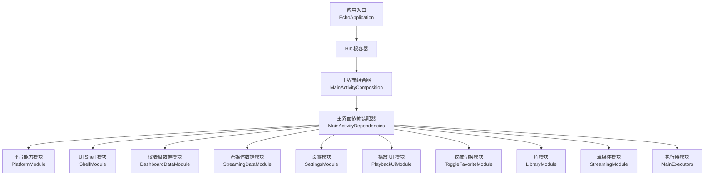
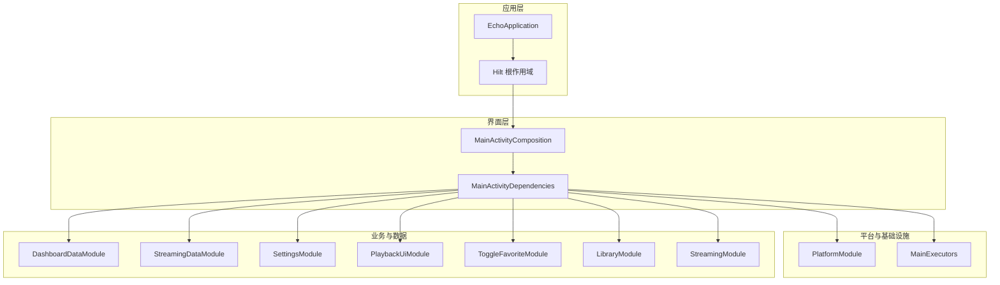
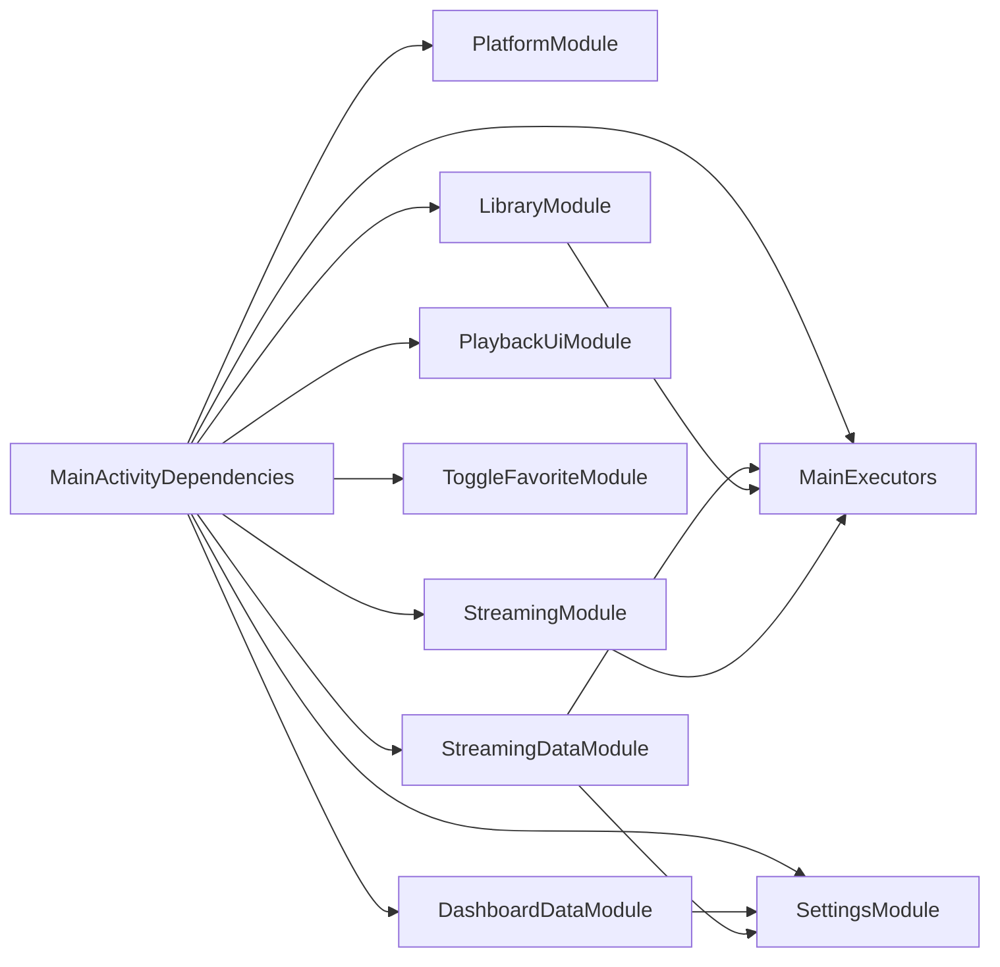

# 依赖注入系统

<cite>
**本文引用的文件**   
- [EchoApplication.kt](file://app/src/main/java/app/yukine/EchoApplication.kt)
- [MainActivityDependencies.kt](file://app/src/main/java/app/yukine/MainActivityDependencies.kt)
- [MainActivityComposition.kt](file://app/src/main/java/app/yukine/MainActivityComposition.kt)
- [DashboardDataModule.kt](file://app/src/main/java/app/yukine/dashboard/DashboardDataModule.kt)
- [PlatformModule.kt](file://app/src/main/java/app/yukine/PlatformModule.kt)
- [ShellModule.kt](file://app/src/main/java/app/yukine/ShellModule.kt)
- [StreamingDataModule.kt](file://app/src/main/java/app/yukine/streaming/StreamingDataModule.kt)
- [SettingsModule.kt](file://app/src/main/java/app/yukine/SettingsModule.kt)
- [PlaybackUiModule.kt](file://app/src/main/java/app/yukine/PlaybackUiModule.kt)
- [ToggleFavoriteModule.kt](file://app/src/main/java/app/yukine/ToggleFavoriteModule.kt)
- [MainExecutors.kt](file://app/src/main/java/app/yukine/MainExecutors.kt)
- [LibraryModule.kt](file://app/src/main/java/app/yukine/LibraryModule.kt)
- [StreamingModule.kt](file://app/src/main/java/app/yukine/StreamingModule.kt)
</cite>

## 目录
1. [简介](#简介)
2. [项目结构](#项目结构)
3. [核心组件](#核心组件)
4. [架构总览](#架构总览)
5. [详细组件分析](#详细组件分析)
6. [依赖关系分析](#依赖关系分析)
7. [性能考量](#性能考量)
8. [故障排查指南](#故障排查指南)
9. [结论](#结论)
10. [附录](#附录)

## 简介
本文件面向 Echo Android 应用，系统化梳理并文档化其基于 Hilt/Dagger 的依赖注入（DI）体系。重点覆盖：
- Hilt 在应用中的初始化与模块组织
- 关键 DI 模块的职责划分与边界
- 生命周期与作用域控制策略
- 条件注入、多实现选择与跨模块共享
- 循环依赖识别与规避
- 测试策略与最佳实践

目标是帮助开发者以统一的方式理解和使用 DI，提升代码的可测试性与可维护性。

## 项目结构
从仓库可见，DI 相关配置集中在 app 模块的 di 目录以及各功能模块中。典型入口包括 Application 层初始化、Activity 级 Composition 与多个领域/数据模块。

图表来源
- [EchoApplication.kt](file://app/src/main/java/app/yukine/EchoApplication.kt)
- [MainActivityComposition.kt](file://app/src/main/java/app/yukine/MainActivityComposition.kt)
- [MainActivityDependencies.kt](file://app/src/main/java/app/yukine/MainActivityDependencies.kt)
- [PlatformModule.kt](file://app/src/main/java/app/yukine/PlatformModule.kt)
- [ShellModule.kt](file://app/src/main/java/app/yukine/ShellModule.kt)
- [DashboardDataModule.kt](file://app/src/main/java/app/yukine/dashboard/DashboardDataModule.kt)
- [StreamingDataModule.kt](file://app/src/main/java/app/yukine/streaming/StreamingDataModule.kt)
- [SettingsModule.kt](file://app/src/main/java/app/yukine/SettingsModule.kt)
- [PlaybackUiModule.kt](file://app/src/main/java/app/yukine/PlaybackUiModule.kt)
- [ToggleFavoriteModule.kt](file://app/src/main/java/app/yukine/ToggleFavoriteModule.kt)
- [LibraryModule.kt](file://app/src/main/java/app/yukine/LibraryModule.kt)
- [StreamingModule.kt](file://app/src/main/java/app/yukine/StreamingModule.kt)
- [MainExecutors.kt](file://app/src/main/java/app/yukine/MainExecutors.kt)

章节来源
- [EchoApplication.kt](file://app/src/main/java/app/yukine/EchoApplication.kt)
- [MainActivityComposition.kt](file://app/src/main/java/app/yukine/MainActivityComposition.kt)
- [MainActivityDependencies.kt](file://app/src/main/java/app/yukine/MainActivityDependencies.kt)

## 核心组件
本节聚焦于 Hilt 在应用中的关键接入点与模块职责。

- 应用入口与 Hilt 初始化
  - 通过继承 Hilt 提供的基类完成全局容器初始化，确保在进程启动时构建根作用域的依赖图。
  - 参考路径：[EchoApplication.kt](file://app/src/main/java/app/yukine/EchoApplication.kt)

- Activity 级组合与依赖装配
  - MainActivityComposition 负责将 Hilt 生成的实例与 Jetpack Compose 的组合上下文集成，使 UI 层可直接消费依赖。
  - MainActivityDependencies 作为“依赖装配器”，集中声明该页面所需的全部依赖项，便于测试替换与阅读。
  - 参考路径：
    - [MainActivityComposition.kt](file://app/src/main/java/app/yukine/MainActivityComposition.kt)
    - [MainActivityDependencies.kt](file://app/src/main/java/app/yukine/MainActivityDependencies.kt)

- 平台能力与基础设施
  - PlatformModule：提供平台相关能力（如上下文、系统服务、设备信息）的单例或按需实例。
  - MainExecutors：为异步任务提供线程池/调度器抽象，避免在各处重复创建。
  - 参考路径：
    - [PlatformModule.kt](file://app/src/main/java/app/yukine/PlatformModule.kt)
    - [MainExecutors.kt](file://app/src/main/java/app/yukine/MainExecutors.kt)

- 业务与数据模块
  - DashboardDataModule：为首页仪表盘提供数据源、用例与状态工厂等依赖。
  - StreamingDataModule：为流媒体功能提供网络、缓存、解析器等数据层依赖。
  - SettingsModule：封装设置读写、偏好存储等能力。
  - PlaybackUiModule：为播放 UI 提供展示层所需的控制器与适配器。
  - ToggleFavoriteModule：封装收藏切换相关的用例与持久化依赖。
  - LibraryModule / StreamingModule：分别聚合库与流媒体领域的用例、网关与外部服务。
  - 参考路径：
    - [DashboardDataModule.kt](file://app/src/main/java/app/yukine/dashboard/DashboardDataModule.kt)
    - [StreamingDataModule.kt](file://app/src/main/java/app/yukine/streaming/StreamingDataModule.kt)
    - [SettingsModule.kt](file://app/src/main/java/app/yukine/SettingsModule.kt)
    - [PlaybackUiModule.kt](file://app/src/main/java/app/yukine/PlaybackUiModule.kt)
    - [ToggleFavoriteModule.kt](file://app/src/main/java/app/yukine/ToggleFavoriteModule.kt)
    - [LibraryModule.kt](file://app/src/main/java/app/yukine/LibraryModule.kt)
    - [StreamingModule.kt](file://app/src/main/java/app/yukine/StreamingModule.kt)

章节来源
- [EchoApplication.kt](file://app/src/main/java/app/yukine/EchoApplication.kt)
- [MainActivityComposition.kt](file://app/src/main/java/app/yukine/MainActivityComposition.kt)
- [MainActivityDependencies.kt](file://app/src/main/java/app/yukine/MainActivityDependencies.kt)
- [PlatformModule.kt](file://app/src/main/java/app/yukine/PlatformModule.kt)
- [MainExecutors.kt](file://app/src/main/java/app/yukine/MainExecutors.kt)
- [DashboardDataModule.kt](file://app/src/main/java/app/yukine/dashboard/DashboardDataModule.kt)
- [StreamingDataModule.kt](file://app/src/main/java/app/yukine/streaming/StreamingDataModule.kt)
- [SettingsModule.kt](file://app/src/main/java/app/yukine/SettingsModule.kt)
- [PlaybackUiModule.kt](file://app/src/main/java/app/yukine/PlaybackUiModule.kt)
- [ToggleFavoriteModule.kt](file://app/src/main/java/app/yukine/ToggleFavoriteModule.kt)
- [LibraryModule.kt](file://app/src/main/java/app/yukine/LibraryModule.kt)
- [StreamingModule.kt](file://app/src/main/java/app/yukine/StreamingModule.kt)

## 架构总览
下图展示了 Hilt 在 Echo 应用中的分层与交互方式：应用层初始化根容器，Activity 层通过组合器消费依赖，业务与数据层由各自模块提供。

图表来源
- [EchoApplication.kt](file://app/src/main/java/app/yukine/EchoApplication.kt)
- [MainActivityComposition.kt](file://app/src/main/java/app/yukine/MainActivityComposition.kt)
- [MainActivityDependencies.kt](file://app/src/main/java/app/yukine/MainActivityDependencies.kt)
- [PlatformModule.kt](file://app/src/main/java/app/yukine/PlatformModule.kt)
- [MainExecutors.kt](file://app/src/main/java/app/yukine/MainExecutors.kt)
- [DashboardDataModule.kt](file://app/src/main/java/app/yukine/dashboard/DashboardDataModule.kt)
- [StreamingDataModule.kt](file://app/src/main/java/app/yukine/streaming/StreamingDataModule.kt)
- [SettingsModule.kt](file://app/src/main/java/app/yukine/SettingsModule.kt)
- [PlaybackUiModule.kt](file://app/src/main/java/app/yukine/PlaybackUiModule.kt)
- [ToggleFavoriteModule.kt](file://app/src/main/java/app/yukine/ToggleFavoriteModule.kt)
- [LibraryModule.kt](file://app/src/main/java/app/yukine/LibraryModule.kt)
- [StreamingModule.kt](file://app/src/main/java/app/yukine/StreamingModule.kt)

## 详细组件分析

### 模块职责与边界
- DashboardDataModule
  - 职责：为仪表盘提供数据读取、转换与展示所需的数据源与用例。
  - 边界：仅暴露仪表盘相关接口，不直接耦合 UI。
  - 参考路径：[DashboardDataModule.kt](file://app/src/main/java/app/yukine/dashboard/DashboardDataModule.kt)

- PlatformModule
  - 职责：提供 Android 平台能力（上下文、系统服务、设备信息等）。
  - 边界：不持有业务状态，仅提供只读或无副作用能力。
  - 参考路径：[PlatformModule.kt](file://app/src/main/java/app/yukine/PlatformModule.kt)

- ShellModule
  - 职责：为 UI Shell 提供导航、主题、窗口管理等壳层能力。
  - 边界：与具体页面解耦，仅定义壳层契约。
  - 参考路径：[ShellModule.kt](file://app/src/main/java/app/yukine/ShellModule.kt)

- StreamingDataModule
  - 职责：为流媒体功能提供网络请求、缓存、解析、认证等数据层依赖。
  - 边界：屏蔽底层协议差异，向上暴露统一接口。
  - 参考路径：[StreamingDataModule.kt](file://app/src/main/java/app/yukine/streaming/StreamingDataModule.kt)

- SettingsModule
  - 职责：封装设置读写、偏好存储、默认值管理。
  - 边界：与 UI 无关，提供纯数据访问能力。
  - 参考路径：[SettingsModule.kt](file://app/src/main/java/app/yukine/SettingsModule.kt)

- PlaybackUiModule
  - 职责：为播放 UI 提供控制器、适配器等展示层依赖。
  - 边界：仅面向 UI 消费，不包含业务逻辑。
  - 参考路径：[PlaybackUiModule.kt](file://app/src/main/java/app/yukine/PlaybackUiModule.kt)

- ToggleFavoriteModule
  - 职责：封装收藏切换的用例与持久化依赖。
  - 边界：围绕收藏这一单一行为聚合依赖。
  - 参考路径：[ToggleFavoriteModule.kt](file://app/src/main/java/app/yukine/ToggleFavoriteModule.kt)

- LibraryModule / StreamingModule
  - 职责：分别聚合库与流媒体领域的用例、网关与外部服务。
  - 边界：按领域划分，避免跨领域耦合。
  - 参考路径：
    - [LibraryModule.kt](file://app/src/main/java/app/yukine/LibraryModule.kt)
    - [StreamingModule.kt](file://app/src/main/java/app/yukine/StreamingModule.kt)

章节来源
- [DashboardDataModule.kt](file://app/src/main/java/app/yukine/dashboard/DashboardDataModule.kt)
- [PlatformModule.kt](file://app/src/main/java/app/yukine/PlatformModule.kt)
- [ShellModule.kt](file://app/src/main/java/app/yukine/ShellModule.kt)
- [StreamingDataModule.kt](file://app/src/main/java/app/yukine/streaming/StreamingDataModule.kt)
- [SettingsModule.kt](file://app/src/main/java/app/yukine/SettingsModule.kt)
- [PlaybackUiModule.kt](file://app/src/main/java/app/yukine/PlaybackUiModule.kt)
- [ToggleFavoriteModule.kt](file://app/src/main/java/app/yukine/ToggleFavoriteModule.kt)
- [LibraryModule.kt](file://app/src/main/java/app/yukine/LibraryModule.kt)
- [StreamingModule.kt](file://app/src/main/java/app/yukine/StreamingModule.kt)

### 生命周期与作用域控制
- 根作用域（@Singleton）
  - 适用于全局共享且无状态或状态安全的对象，如平台能力、执行器、数据库连接等。
  - 建议：避免在单例中持有 UI 引用或可变业务状态。
- 活动作用域（@ActivityScoped）
  - 适用于与 Activity 生命周期绑定的对象，如 ViewModel、页面级控制器。
  - 建议：仅在需要跨 Fragment/Composable 共享时使用，避免滥用导致内存泄漏。
- 自定义作用域
  - 当需要更细粒度的生命周期（如会话级、任务级），可定义自定义注解与作用域，并在对应模块中提供实例。

章节来源
- [PlatformModule.kt](file://app/src/main/java/app/yukine/PlatformModule.kt)
- [MainExecutors.kt](file://app/src/main/java/app/yukine/MainExecutors.kt)
- [MainActivityDependencies.kt](file://app/src/main/java/app/yukine/MainActivityDependencies.kt)

### 条件注入与多实现选择
- 使用 @Qualifier 区分同类型不同实现（例如不同网络客户端、不同缓存策略）。
- 结合 BuildConfig 或运行时开关，在模块中提供不同实现（调试/发布、A/B 实验）。
- 建议在模块内集中声明条件分支，保持调用方透明。

章节来源
- [SettingsModule.kt](file://app/src/main/java/app/yukine/SettingsModule.kt)
- [StreamingDataModule.kt](file://app/src/main/java/app/yukine/streaming/StreamingDataModule.kt)

### 跨模块共享依赖
- 将通用能力（平台、执行器、日志、加密）放入独立模块并通过单例暴露。
- 领域模块之间通过接口解耦，避免直接引用具体实现。
- 在 MainActivityDependencies 中汇总页面所需依赖，减少分散装配。

章节来源
- [MainActivityDependencies.kt](file://app/src/main/java/app/yukine/MainActivityDependencies.kt)
- [PlatformModule.kt](file://app/src/main/java/app/yukine/PlatformModule.kt)
- [MainExecutors.kt](file://app/src/main/java/app/yukine/MainExecutors.kt)

### 循环依赖处理
- 识别：编译期报错通常提示环状依赖；也可借助静态分析工具扫描。
- 化解：
  - 引入中间接口或门面，打破直接环。
  - 将共享逻辑下沉到更底层的公共模块。
  - 使用延迟注入（Provider/Lazy）仅在需要时获取依赖。
- 预防：明确模块边界与依赖方向，遵循单向依赖原则。

章节来源
- [MainActivityDependencies.kt](file://app/src/main/java/app/yukine/MainActivityDependencies.kt)
- [LibraryModule.kt](file://app/src/main/java/app/yukine/LibraryModule.kt)
- [StreamingModule.kt](file://app/src/main/java/app/yukine/StreamingModule.kt)

### 依赖测试策略
- 单元测试
  - 使用 Hilt 测试支持，通过 @UninstallModules 卸载真实模块并提供 Fake/Mock 实现。
  - 针对用例与领域逻辑进行隔离测试。
- 仪器化测试
  - 使用 @HiltAndroidTest 与 HiltRunner，模拟 Android 环境。
  - 对数据层与 UI 层进行端到端验证。
- 测试示例参考
  - 单元测试：[app/src/test/java/app/yukine/...](file://app/src/test/java/app/yukine/)
  - 仪器化测试：[app/src/androidTest/java/app/yukine/...](file://app/src/androidTest/java/app/yukine/)

章节来源
- [MainActivityDependencies.kt](file://app/src/main/java/app/yukine/MainActivityDependencies.kt)
- [DashboardDataModule.kt](file://app/src/main/java/app/yukine/dashboard/DashboardDataModule.kt)
- [StreamingDataModule.kt](file://app/src/main/java/app/yukine/streaming/StreamingDataModule.kt)

## 依赖关系分析
下图展示主要模块之间的依赖方向与耦合度，强调单向依赖与模块化边界。

图表来源
- [MainActivityDependencies.kt](file://app/src/main/java/app/yukine/MainActivityDependencies.kt)
- [PlatformModule.kt](file://app/src/main/java/app/yukine/PlatformModule.kt)
- [MainExecutors.kt](file://app/src/main/java/app/yukine/MainExecutors.kt)
- [DashboardDataModule.kt](file://app/src/main/java/app/yukine/dashboard/DashboardDataModule.kt)
- [StreamingDataModule.kt](file://app/src/main/java/app/yukine/streaming/StreamingDataModule.kt)
- [SettingsModule.kt](file://app/src/main/java/app/yukine/SettingsModule.kt)
- [PlaybackUiModule.kt](file://app/src/main/java/app/yukine/PlaybackUiModule.kt)
- [ToggleFavoriteModule.kt](file://app/src/main/java/app/yukine/ToggleFavoriteModule.kt)
- [LibraryModule.kt](file://app/src/main/java/app/yukine/LibraryModule.kt)
- [StreamingModule.kt](file://app/src/main/java/app/yukine/StreamingModule.kt)

章节来源
- [MainActivityDependencies.kt](file://app/src/main/java/app/yukine/MainActivityDependencies.kt)
- [PlatformModule.kt](file://app/src/main/java/app/yukine/PlatformModule.kt)
- [MainExecutors.kt](file://app/src/main/java/app/yukine/MainExecutors.kt)
- [DashboardDataModule.kt](file://app/src/main/java/app/yukine/dashboard/DashboardDataModule.kt)
- [StreamingDataModule.kt](file://app/src/main/java/app/yukine/streaming/StreamingDataModule.kt)
- [SettingsModule.kt](file://app/src/main/java/app/yukine/SettingsModule.kt)
- [PlaybackUiModule.kt](file://app/src/main/java/app/yukine/PlaybackUiModule.kt)
- [ToggleFavoriteModule.kt](file://app/src/main/java/app/yukine/ToggleFavoriteModule.kt)
- [LibraryModule.kt](file://app/src/main/java/app/yukine/LibraryModule.kt)
- [StreamingModule.kt](file://app/src/main/java/app/yukine/StreamingModule.kt)

## 性能考量
- 避免在高频路径上创建重型对象，尽量复用单例或作用域实例。
- 谨慎使用 @Singleton，确保对象无状态或线程安全。
- 延迟加载：对冷路径依赖使用 Provider/Lazy，降低启动开销。
- 合理拆分模块：将大模块拆分为更小、更内聚的子模块，减少不必要的依赖树膨胀。
- 监控与度量：在关键路径添加耗时埋点，定位 DI 初始化瓶颈。

## 故障排查指南
- 常见错误
  - 循环依赖：检查模块间相互引用，引入中间接口或延迟注入。
  - 未找到提供者：确认模块是否被正确安装，作用域是否匹配。
  - 多实现冲突：使用 @Qualifier 明确区分，或在模块中限定唯一实现。
- 诊断步骤
  - 缩小范围：从 MainActivityDependencies 开始逐步注释模块，定位问题模块。
  - 查看生成代码：Hilt 会生成大量辅助类，有助于定位注入失败原因。
  - 启用详细日志：在开发版本开启 Hilt 日志输出，观察依赖解析过程。

章节来源
- [MainActivityDependencies.kt](file://app/src/main/java/app/yukine/MainActivityDependencies.kt)
- [PlatformModule.kt](file://app/src/main/java/app/yukine/PlatformModule.kt)
- [SettingsModule.kt](file://app/src/main/java/app/yukine/SettingsModule.kt)

## 结论
通过清晰的模块划分、严格的作用域管理与统一的装配入口，Echo 应用的 Hilt/Dagger 体系有效提升了代码的可测试性与可维护性。建议持续遵循单向依赖、最小权限与延迟加载等原则，并结合测试策略保障质量。

## 附录
- 快速上手清单
  - 在 Application 中初始化 Hilt 根容器。
  - 在 Activity 层通过组合器与依赖装配器消费依赖。
  - 将平台能力与基础设施放入独立模块并以单例暴露。
  - 按领域拆分业务与数据模块，明确边界与接口。
  - 使用 @Qualifier 与条件注入管理多实现。
  - 编写单元与仪器化测试，替换真实依赖为 Fake/Mock。
- 参考路径
  - 应用入口：[EchoApplication.kt](file://app/src/main/java/app/yukine/EchoApplication.kt)
  - 组合与装配：[MainActivityComposition.kt](file://app/src/main/java/app/yukine/MainActivityComposition.kt)、[MainActivityDependencies.kt](file://app/src/main/java/app/yukine/MainActivityDependencies.kt)
  - 模块集合：[PlatformModule.kt](file://app/src/main/java/app/yukine/PlatformModule.kt)、[ShellModule.kt](file://app/src/main/java/app/yukine/ShellModule.kt)、[DashboardDataModule.kt](file://app/src/main/java/app/yukine/dashboard/DashboardDataModule.kt)、[StreamingDataModule.kt](file://app/src/main/java/app/yukine/streaming/StreamingDataModule.kt)、[SettingsModule.kt](file://app/src/main/java/app/yukine/SettingsModule.kt)、[PlaybackUiModule.kt](file://app/src/main/java/app/yukine/PlaybackUiModule.kt)、[ToggleFavoriteModule.kt](file://app/src/main/java/app/yukine/ToggleFavoriteModule.kt)、[LibraryModule.kt](file://app/src/main/java/app/yukine/LibraryModule.kt)、[StreamingModule.kt](file://app/src/main/java/app/yukine/StreamingModule.kt)、[MainExecutors.kt](file://app/src/main/java/app/yukine/MainExecutors.kt)