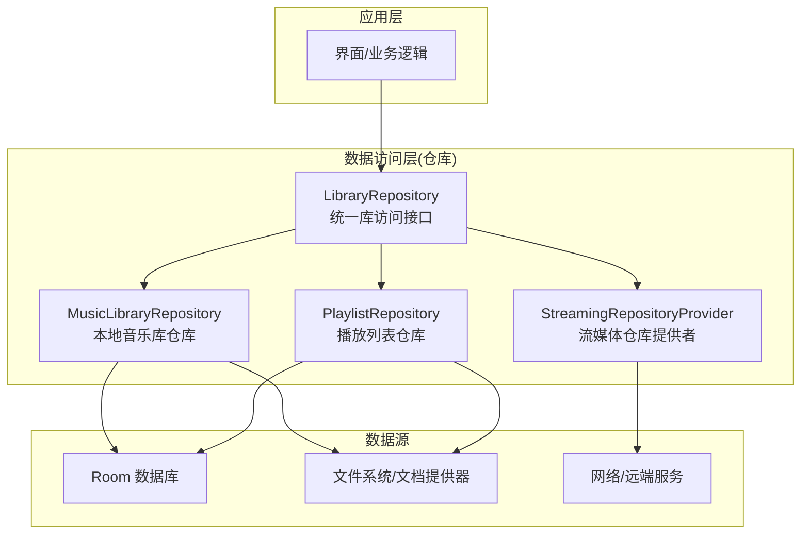
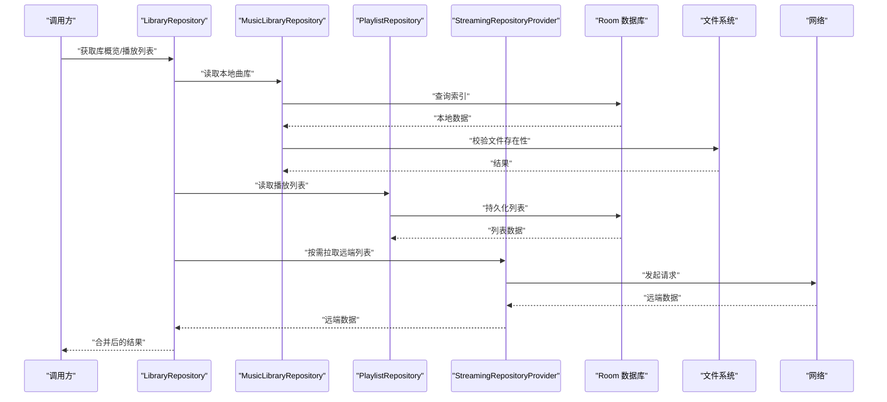
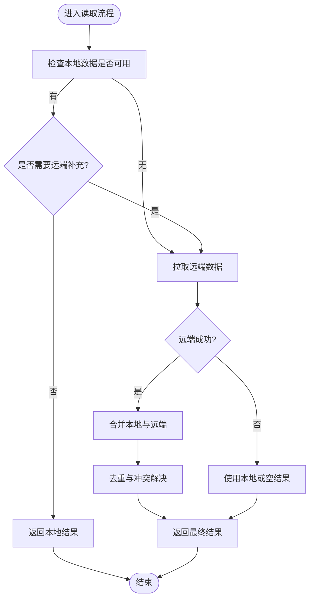
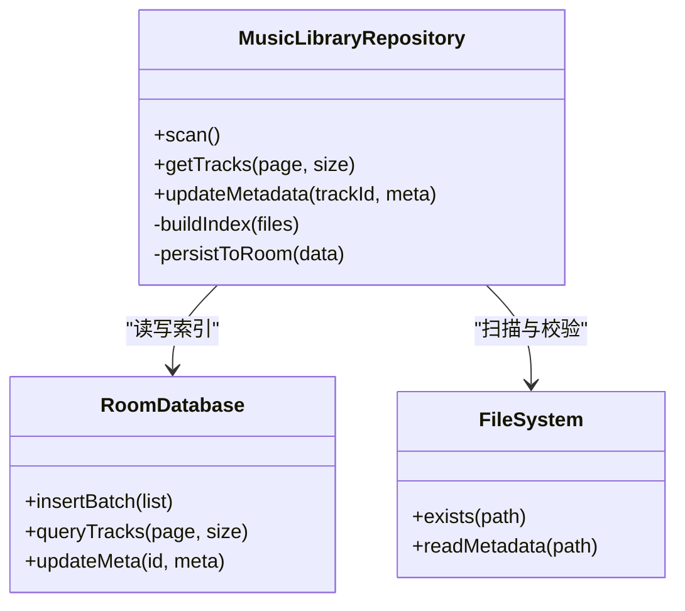
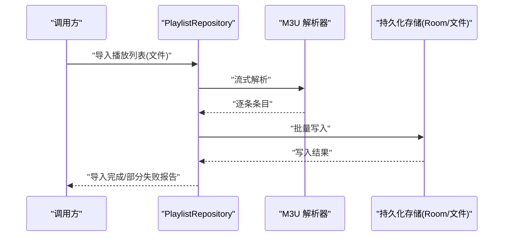
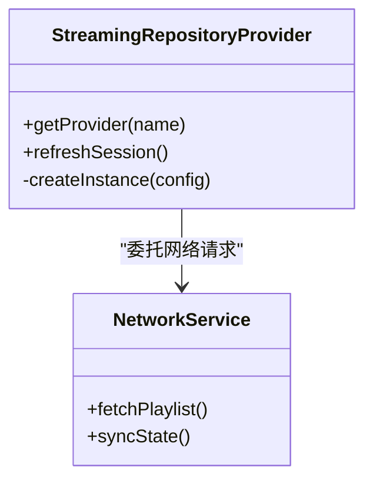
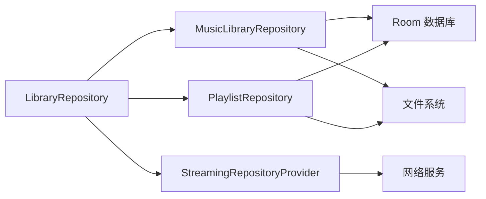

# 仓库模式实现

<cite>
**本文引用的文件**   
- [MusicLibraryRepository.kt](file://app/src/main/java/app/yukine/data/MusicLibraryRepository.kt)
- [PlaylistRepository.kt](file://app/src/main/java/app/yukine/data/PlaylistRepository.kt)
- [LibraryRepository.kt](file://app/src/main/java/app/yukine/data/LibraryRepository.kt)
- [StreamingRepositoryProvider.kt](file://app/src/main/java/app/yukine/StreamingRepositoryProvider.kt)
- [MainExecutors.kt](file://app/src/main/java/app/yukine/MainExecutors.kt)
- [RoomRepositoriesInstrumentedTest.java](file://app/src/androidTest/java/app/yukine/data/RoomRepositoriesInstrumentedTest.java)
- [MusicLibraryRepositoryInstrumentedTest.java](file://app/src/androidTest/java/app/yukine/data/MusicLibraryRepositoryInstrumentedTest.java)
- [M3uPlaylistParserInstrumentedTest.java](file://app/src/androidTest/java/app/yukine/data/M3uPlaylistParserInstrumentedTest.java)
- [M3uPlaylistExporterInstrumentedTest.java](file://app/src/androidTest/java/app/yukine/data/M3uPlaylistExporterInstrumentedTest.java)
</cite>

## 目录
1. [简介](#简介)
2. [项目结构](#项目结构)
3. [核心组件](#核心组件)
4. [架构总览](#架构总览)
5. [详细组件分析](#详细组件分析)
6. [依赖关系分析](#依赖关系分析)
7. [性能考量](#性能考量)
8. [故障排查指南](#故障排查指南)
9. [结论](#结论)
10. [附录](#附录)

## 简介
本文件面向 Echo Android 应用，系统化阐述仓库模式（Repository Pattern）在数据访问抽象层中的设计与实践。重点围绕 LibraryRepository、MusicLibraryRepository、PlaylistRepository 等仓库类，说明其职责边界、多数据源聚合策略、异步与错误处理机制，并提供单元测试与 Mock 数据源的编写指南以及扩展新数据源的最佳实践。目标是帮助开发者在不破坏既有契约的前提下，稳定地扩展与演进数据层能力。

## 项目结构
仓库相关代码主要位于 app 模块的 data 包中，配合测试用例分布在 androidTest 与 test 目录。关键入口包括：
- 仓库接口与实现：LibraryRepository、MusicLibraryRepository、PlaylistRepository
- 流媒体仓库提供者：StreamingRepositoryProvider
- 线程调度器：MainExecutors
- 集成测试：RoomRepositoriesInstrumentedTest、MusicLibraryRepositoryInstrumentedTest 等

图表来源
- [MusicLibraryRepository.kt](file://app/src/main/java/app/yukine/data/MusicLibraryRepository.kt)
- [PlaylistRepository.kt](file://app/src/main/java/app/yukine/data/PlaylistRepository.kt)
- [LibraryRepository.kt](file://app/src/main/java/app/yukine/data/LibraryRepository.kt)
- [StreamingRepositoryProvider.kt](file://app/src/main/java/app/yukine/StreamingRepositoryProvider.kt)

章节来源
- [MusicLibraryRepository.kt](file://app/src/main/java/app/yukine/data/MusicLibraryRepository.kt)
- [PlaylistRepository.kt](file://app/src/main/java/app/yukine/data/PlaylistRepository.kt)
- [LibraryRepository.kt](file://app/src/main/java/app/yukine/data/LibraryRepository.kt)
- [StreamingRepositoryProvider.kt](file://app/src/main/java/app/yukine/StreamingRepositoryProvider.kt)

## 核心组件
本节聚焦仓库层的三大核心角色及其协作方式。

- LibraryRepository（统一库访问接口）
  - 职责：对外暴露统一的“库”操作契约，屏蔽底层多种数据源差异；协调 MusicLibraryRepository、PlaylistRepository 与 StreamingRepositoryProvider 完成跨域聚合。
  - 设计要点：以接口形式定义读/写/同步等操作；对上层仅暴露领域语义方法，避免泄露具体数据源细节。

- MusicLibraryRepository（本地音乐库仓库）
  - 职责：封装本地音乐文件的扫描、索引、元数据读取与更新；负责与 Room 数据库及文件系统交互。
  - 设计要点：将 I/O 密集任务下沉到后台线程；对变更事件进行发布或缓存刷新；保证幂等写入与一致性。

- PlaylistRepository（播放列表仓库）
  - 职责：管理播放列表的增删改查、导入导出（如 M3U）、与本地存储和可选远端的同步。
  - 设计要点：读写分离；导入导出采用流式处理以降低内存占用；失败重试与回滚策略。

- StreamingRepositoryProvider（流媒体仓库提供者）
  - 职责：按配置或运行时条件返回合适的流媒体仓库实例，用于从在线服务拉取播放列表、曲目信息或同步状态。
  - 设计要点：工厂/提供者模式；可插拔的认证与会话维护；超时与降级策略。

章节来源
- [LibraryRepository.kt](file://app/src/main/java/app/yukine/data/LibraryRepository.kt)
- [MusicLibraryRepository.kt](file://app/src/main/java/app/yukine/data/MusicLibraryRepository.kt)
- [PlaylistRepository.kt](file://app/src/main/java/app/yukine/data/PlaylistRepository.kt)
- [StreamingRepositoryProvider.kt](file://app/src/main/java/app/yukine/StreamingRepositoryProvider.kt)

## 架构总览
仓库层作为数据访问抽象层，向上为业务与 UI 提供稳定的领域 API，向下聚合多个数据源并处理优先级、合并与冲突解决。

图表来源
- [LibraryRepository.kt](file://app/src/main/java/app/yukine/data/LibraryRepository.kt)
- [MusicLibraryRepository.kt](file://app/src/main/java/app/yukine/data/MusicLibraryRepository.kt)
- [PlaylistRepository.kt](file://app/src/main/java/app/yukine/data/PlaylistRepository.kt)
- [StreamingRepositoryProvider.kt](file://app/src/main/java/app/yukine/StreamingRepositoryProvider.kt)

## 详细组件分析

### LibraryRepository：统一库访问接口
- 职责边界
  - 聚合本地与远端数据，提供一致的“库”视图。
  - 编排 MusicLibraryRepository、PlaylistRepository 与 StreamingRepositoryProvider 的调用顺序与合并策略。
- 数据源聚合策略
  - 优先级：本地优先，远端补充；当本地缺失时再尝试远端。
  - 合并规则：基于唯一标识去重，冲突时按时间戳或版本字段决定最终值。
- 异步与错误处理
  - 所有耗时操作通过协程/线程池执行，避免阻塞主线程。
  - 错误分类：网络异常、I/O 异常、数据不一致；统一封装为领域错误类型，便于上层展示与重试。
- 典型流程
  - 读取：先查本地索引与播放列表，再按需拉取远端增量，最后合并返回。
  - 写入：落盘后触发本地索引重建或增量更新，必要时通知远端同步。

图表来源
- [LibraryRepository.kt](file://app/src/main/java/app/yukine/data/LibraryRepository.kt)

章节来源
- [LibraryRepository.kt](file://app/src/main/java/app/yukine/data/LibraryRepository.kt)

### MusicLibraryRepository：本地音乐库仓库
- 职责边界
  - 扫描与索引本地音频文件，维护元数据与播放统计。
  - 与 Room 数据库交互，提供高效查询与分页。
- 数据模型与复杂度
  - 索引表包含曲目、专辑、艺术家等实体；常用查询涉及 JOIN 与分组聚合。
  - 批量插入/更新采用事务与批大小控制，降低锁竞争与内存峰值。
- 异步与错误处理
  - 扫描任务在后台执行，支持中断与进度回调。
  - 文件不存在、权限不足、磁盘空间不足等错误统一封装，提供重试与降级策略。
- 性能优化
  - 增量扫描：仅处理新增/修改的文件。
  - 懒加载：大图与长文本延迟加载。
  - 索引预热：启动时预加载热门集合。

图表来源
- [MusicLibraryRepository.kt](file://app/src/main/java/app/yukine/data/MusicLibraryRepository.kt)

章节来源
- [MusicLibraryRepository.kt](file://app/src/main/java/app/yukine/data/MusicLibraryRepository.kt)

### PlaylistRepository：播放列表仓库
- 职责边界
  - 播放列表的 CRUD、导入导出（M3U）、与本地存储同步。
  - 提供流式解析与导出，减少内存占用。
- 数据源聚合策略
  - 本地优先：优先从 Room 读取；若本地缺失则尝试从文件系统恢复。
  - 导入流程：解析 M3U -> 校验路径 -> 构建条目 -> 批量写入。
- 异步与错误处理
  - 大文件导入采用分块处理与断点续传。
  - 解析失败记录日志并跳过坏行，保证整体导入成功率。
- 并发与一致性
  - 写入加锁，避免重复导入导致的数据膨胀。
  - 导入完成后触发索引重建或增量更新。

图表来源
- [PlaylistRepository.kt](file://app/src/main/java/app/yukine/data/PlaylistRepository.kt)

章节来源
- [PlaylistRepository.kt](file://app/src/main/java/app/yukine/data/PlaylistRepository.kt)

### StreamingRepositoryProvider：流媒体仓库提供者
- 职责边界
  - 根据配置或会话状态返回合适的流媒体仓库实例。
  - 管理认证、令牌刷新与连接池。
- 设计要点
  - 工厂模式：按 provider 名称或域名选择实现。
  - 降级策略：网络不可用时返回本地缓存或提示用户。
- 错误处理
  - 统一封装网络错误、鉴权失败与服务不可用。
  - 指数退避重试与熔断保护。

图表来源
- [StreamingRepositoryProvider.kt](file://app/src/main/java/app/yukine/StreamingRepositoryProvider.kt)

章节来源
- [StreamingRepositoryProvider.kt](file://app/src/main/java/app/yukine/StreamingRepositoryProvider.kt)

### 异步与错误处理机制
- 线程调度
  - 使用 MainExecutors 提供的调度器，确保 IO 与 CPU 密集型任务在合适线程执行。
- 错误封装
  - 将底层异常转换为领域错误类型，携带上下文信息与重试建议。
- 传播策略
  - 上层仅感知领域错误；UI 层根据错误类型展示友好提示或自动重试。

章节来源
- [MainExecutors.kt](file://app/src/main/java/app/yukine/MainExecutors.kt)

## 依赖关系分析
仓库层内部耦合度低、内聚度高，各仓库专注于自身领域，通过统一接口组合形成完整的数据访问能力。

图表来源
- [LibraryRepository.kt](file://app/src/main/java/app/yukine/data/LibraryRepository.kt)
- [MusicLibraryRepository.kt](file://app/src/main/java/app/yukine/data/MusicLibraryRepository.kt)
- [PlaylistRepository.kt](file://app/src/main/java/app/yukine/data/PlaylistRepository.kt)
- [StreamingRepositoryProvider.kt](file://app/src/main/java/app/yukine/StreamingRepositoryProvider.kt)

章节来源
- [LibraryRepository.kt](file://app/src/main/java/app/yukine/data/LibraryRepository.kt)
- [MusicLibraryRepository.kt](file://app/src/main/java/app/yukine/data/MusicLibraryRepository.kt)
- [PlaylistRepository.kt](file://app/src/main/java/app/yukine/data/PlaylistRepository.kt)
- [StreamingRepositoryProvider.kt](file://app/src/main/java/app/yukine/StreamingRepositoryProvider.kt)

## 性能考量
- 批量操作与事务
  - 批量插入/更新使用事务与批大小控制，减少锁竞争与磁盘抖动。
- 增量与懒加载
  - 增量扫描与懒加载降低启动时间与内存峰值。
- 缓存与预热
  - 热点集合与封面图缓存，提升二次访问速度。
- 流式处理
  - 导入/导出采用流式处理，避免一次性加载大文件导致 OOM。

[本节为通用指导，不直接分析具体文件]

## 故障排查指南
- 常见问题定位
  - 本地索引不同步：检查 MusicLibraryRepository 的增量扫描与索引重建流程。
  - 导入失败：查看 PlaylistRepository 的解析日志与回滚策略。
  - 远端同步失败：确认 StreamingRepositoryProvider 的认证与会话状态。
- 调试建议
  - 开启详细日志，记录关键步骤与错误堆栈。
  - 使用集成测试复现问题，验证修复效果。

章节来源
- [RoomRepositoriesInstrumentedTest.java](file://app/src/androidTest/java/app/yukine/data/RoomRepositoriesInstrumentedTest.java)
- [MusicLibraryRepositoryInstrumentedTest.java](file://app/src/androidTest/java/app/yukine/data/MusicLibraryRepositoryInstrumentedTest.java)
- [M3uPlaylistParserInstrumentedTest.java](file://app/src/androidTest/java/app/yukine/data/M3uPlaylistParserInstrumentedTest.java)
- [M3uPlaylistExporterInstrumentedTest.java](file://app/src/androidTest/java/app/yukine/data/M3uPlaylistExporterInstrumentedTest.java)

## 结论
仓库模式在本项目中有效解耦了数据访问与业务逻辑，提供了清晰的多数据源聚合与一致性的访问契约。通过明确的职责分工、稳健的异步与错误处理机制，以及完善的测试覆盖，系统具备良好的可扩展性与可维护性。遵循本文档的设计原则与实践指南，开发者可以安全地添加新的数据源或扩展现有功能。

## 附录

### 单元测试编写指南
- 目标
  - 验证仓库的领域行为与错误处理，隔离外部依赖。
- 方法
  - 使用 Mock 数据源替代真实 Room/文件系统/网络。
  - 针对边界条件与异常路径编写用例，如空结果、解析失败、网络超时。
  - 使用协程测试工具确保异步逻辑正确执行。
- 参考用例
  - 本地仓库集成测试：RoomRepositoriesInstrumentedTest、MusicLibraryRepositoryInstrumentedTest
  - 播放列表导入导出测试：M3uPlaylistParserInstrumentedTest、M3uPlaylistExporterInstrumentedTest

章节来源
- [RoomRepositoriesInstrumentedTest.java](file://app/src/androidTest/java/app/yukine/data/RoomRepositoriesInstrumentedTest.java)
- [MusicLibraryRepositoryInstrumentedTest.java](file://app/src/androidTest/java/app/yukine/data/MusicLibraryRepositoryInstrumentedTest.java)
- [M3uPlaylistParserInstrumentedTest.java](file://app/src/androidTest/java/app/yukine/data/M3uPlaylistParserInstrumentedTest.java)
- [M3uPlaylistExporterInstrumentedTest.java](file://app/src/androidTest/java/app/yukine/data/M3uPlaylistExporterInstrumentedTest.java)

### Mock 数据源的实现方法
- 原则
  - 保持与真实数据源相同的接口契约，便于替换。
  - 提供可控的输入输出与错误注入，覆盖正常与异常路径。
- 示例思路
  - Mock Room：返回预设数据集或抛出指定异常。
  - Mock 文件系统：模拟文件存在/不存在与元数据读取。
  - Mock 网络：模拟成功响应、鉴权失败、超时与重试。

[本节为通用指导，不直接分析具体文件]

### 仓库模式扩展指南
- 添加新数据源
  - 定义新的仓库实现，遵循现有接口契约。
  - 在 LibraryRepository 中注册新数据源，调整优先级与合并策略。
  - 编写对应的单元测试与集成测试，确保行为符合预期。
- 扩展现有功能
  - 在对应仓库中增加领域方法，保持单一职责。
  - 更新错误封装与日志记录，便于问题追踪。
  - 评估性能影响，必要时引入缓存或异步优化。

[本节为通用指导，不直接分析具体文件]