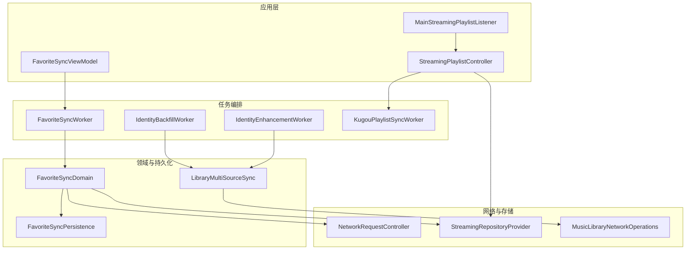
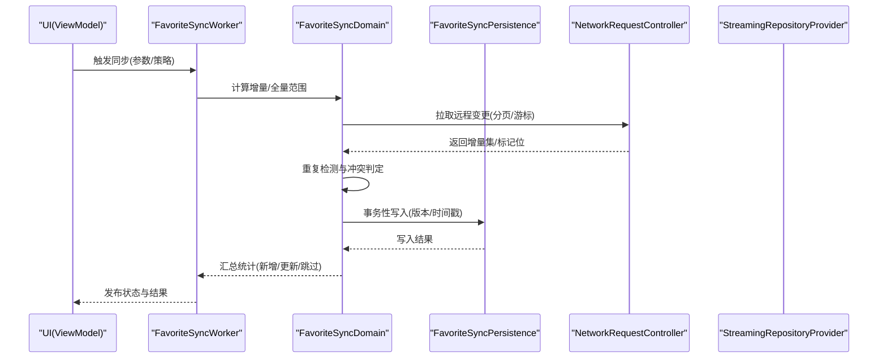
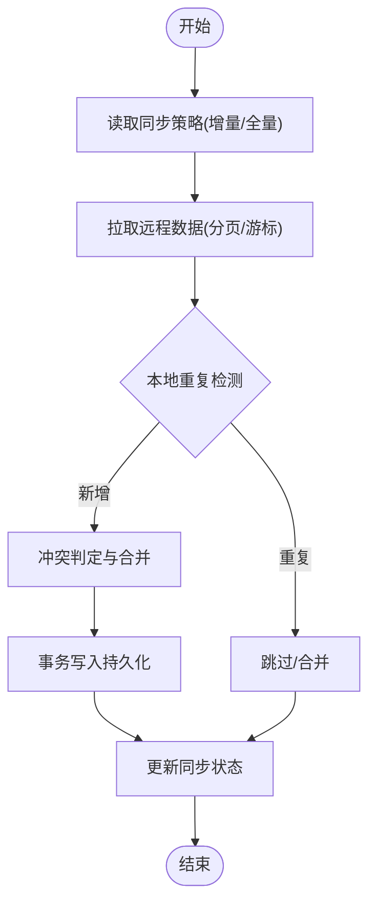
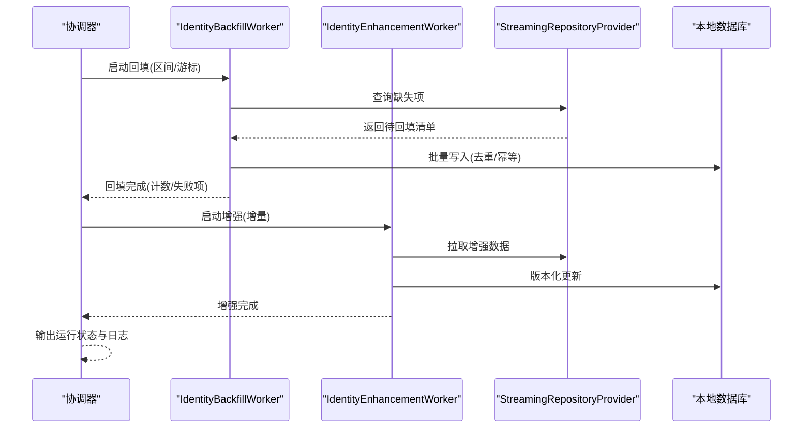
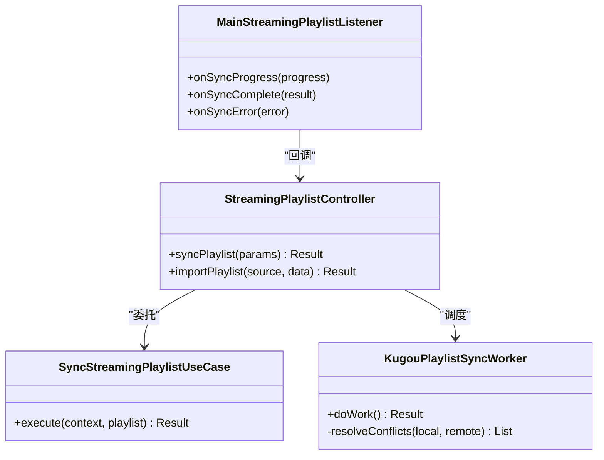
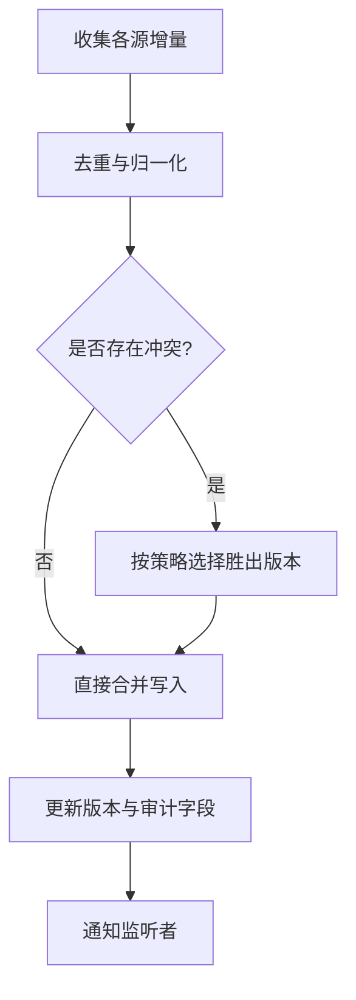
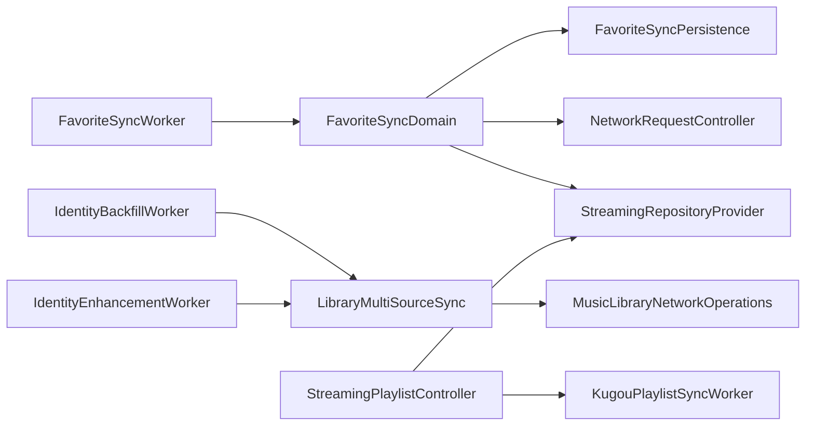

# 数据同步

<cite>
**本文引用的文件**   
- [FavoriteSyncWorker.kt](file://app/src/main/java/app/yukine/FavoriteSyncWorker.kt)
- [FavoriteSyncViewModel.kt](file://app/src/main/java/app/yukine/FavoriteSyncViewModel.kt)
- [FavoriteSyncDomain.kt](file://app/src/main/java/app/yukine/FavoriteSyncDomain.kt)
- [FavoriteSyncPersistence.kt](file://app/src/main/java/app/yukine/FavoriteSyncPersistence.kt)
- [IdentityBackfillWorker.kt](file://app/src/main/java/app/yukine/IdentityBackfillWorker.kt)
- [IdentityEnhancementWorker.kt](file://app/src/main/java/app/yukine/IdentityEnhancementWorker.kt)
- [LibraryMultiSourceSync.kt](file://app/src/main/java/app/yukine/LibraryMultiSourceSync.kt)
- [StreamingPlaylistController.kt](file://app/src/main/java/app/yukine/StreamingPlaylistController.kt)
- [SyncStreamingPlaylistUseCase.kt](file://app/src/main/java/app/yukine/SyncStreamingPlaylistUseCase.kt)
- [KugouPlaylistSyncWorker.kt](file://app/src/main/java/app/yukine/KugouPlaylistSyncWorker.kt)
- [MainStreamingPlaylistListener.kt](file://app/src/main/java/app/yukine/MainStreamingPlaylistListener.kt)
- [NetworkRequestController.kt](file://app/src/main/java/app/yukine/NetworkRequestController.kt)
- [StreamingPlaybackTaskScheduler.java](file://app/src/main/java/app/yukine/StreamingPlaybackTaskScheduler.java)
- [MusicLibraryNetworkOperations.kt](file://app/src/main/java/app/yukine/MusicLibraryNetworkOperations.kt)
- [StreamingRepositoryProvider.kt](file://app/src/main/java/app/yukine/StreamingRepositoryProvider.kt)
- [StreamingModule.kt](file://app/src/main/java/app/yukine/StreamingModule.kt)
- [FavoriteSyncCoordinatorTest.kt](file://app/src/test/java/app/yukine/FavoriteSyncCoordinatorTest.kt)
- [FavoriteSyncSchedulingTest.kt](file://app/src/test/java/app/yukine/FavoriteSyncSchedulingTest.kt)
- [IdentityBackfillRuntimeStatusTest.kt](file://app/src/test/java/app/yukine/IdentityBackfillRuntimeStatusTest.kt)
- [LibraryMultiSourceSyncCoordinatorTest.kt](file://app/src/test/java/app/yukine/LibraryMultiSourceSyncCoordinatorTest.kt)
</cite>

## 目录
1. [简介](#简介)
2. [项目结构](#项目结构)
3. [核心组件](#核心组件)
4. [架构总览](#架构总览)
5. [详细组件分析](#详细组件分析)
6. [依赖关系分析](#依赖关系分析)
7. [性能考虑](#性能考虑)
8. [故障排查指南](#故障排查指南)
9. [结论](#结论)
10. [附录](#附录)

## 简介
本文件面向 Echo Android 应用的数据同步子系统，聚焦以下目标：
- 解释本地与远程数据的增量/全量同步机制及冲突解决策略
- 文档身份识别数据的回填协调器工作流程（重复检测、合并、版本控制）
- 说明收藏数据同步的工作流程（后台任务调度、网络重试、错误处理）
- 解释播放列表同步的冲突解决算法与一致性保证
- 提供同步状态监控、日志记录与故障恢复策略
- 给出性能优化技巧与大数据量场景下的同步方案

## 项目结构
与数据同步相关的代码主要分布在 app 模块中，围绕 Worker 驱动的任务编排、领域逻辑、持久化与网络层展开。关键入口包括：
- 收藏同步：Worker + ViewModel + Domain + Persistence
- 身份识别回填：两个 Worker 分别负责“回填”和“增强”，由上层协调
- 播放列表同步：控制器 + UseCase + 平台特定 Worker（如酷狗）+ 监听器
- 通用网络与调度：网络请求控制器、任务调度器、多源库同步协调器

图表来源
- [FavoriteSyncWorker.kt](file://app/src/main/java/app/yukine/FavoriteSyncWorker.kt)
- [FavoriteSyncViewModel.kt](file://app/src/main/java/app/yukine/FavoriteSyncViewModel.kt)
- [FavoriteSyncDomain.kt](file://app/src/main/java/app/yukine/FavoriteSyncDomain.kt)
- [FavoriteSyncPersistence.kt](file://app/src/main/java/app/yukine/FavoriteSyncPersistence.kt)
- [IdentityBackfillWorker.kt](file://app/src/main/java/app/yukine/IdentityBackfillWorker.kt)
- [IdentityEnhancementWorker.kt](file://app/src/main/java/app/yukine/IdentityEnhancementWorker.kt)
- [LibraryMultiSourceSync.kt](file://app/src/main/java/app/yukine/LibraryMultiSourceSync.kt)
- [StreamingPlaylistController.kt](file://app/src/main/java/app/yukine/StreamingPlaylistController.kt)
- [KugouPlaylistSyncWorker.kt](file://app/src/main/java/app/yukine/KugouPlaylistSyncWorker.kt)
- [MainStreamingPlaylistListener.kt](file://app/src/main/java/app/yukine/MainStreamingPlaylistListener.kt)
- [NetworkRequestController.kt](file://app/src/main/java/app/yukine/NetworkRequestController.kt)
- [StreamingRepositoryProvider.kt](file://app/src/main/java/app/yukine/StreamingRepositoryProvider.kt)
- [MusicLibraryNetworkOperations.kt](file://app/src/main/java/app/yukine/MusicLibraryNetworkOperations.kt)

章节来源
- [FavoriteSyncWorker.kt](file://app/src/main/java/app/yukine/FavoriteSyncWorker.kt)
- [FavoriteSyncViewModel.kt](file://app/src/main/java/app/yukine/FavoriteSyncViewModel.kt)
- [FavoriteSyncDomain.kt](file://app/src/main/java/app/yukine/FavoriteSyncDomain.kt)
- [FavoriteSyncPersistence.kt](file://app/src/main/java/app/yukine/FavoriteSyncPersistence.kt)
- [IdentityBackfillWorker.kt](file://app/src/main/java/app/yukine/IdentityBackfillWorker.kt)
- [IdentityEnhancementWorker.kt](file://app/src/main/java/app/yukine/IdentityEnhancementWorker.kt)
- [LibraryMultiSourceSync.kt](file://app/src/main/java/app/yukine/LibraryMultiSourceSync.kt)
- [StreamingPlaylistController.kt](file://app/src/main/java/app/yukine/StreamingPlaylistController.kt)
- [KugouPlaylistSyncWorker.kt](file://app/src/main/java/app/yukine/KugouPlaylistSyncWorker.kt)
- [MainStreamingPlaylistListener.kt](file://app/src/main/java/app/yukine/MainStreamingPlaylistListener.kt)
- [NetworkRequestController.kt](file://app/src/main/java/app/yukine/NetworkRequestController.kt)
- [StreamingRepositoryProvider.kt](file://app/src/main/java/app/yukine/StreamingRepositoryProvider.kt)
- [MusicLibraryNetworkOperations.kt](file://app/src/main/java/app/yukine/MusicLibraryNetworkOperations.kt)

## 核心组件
- 收藏同步
  - 后台任务：通过 Worker 触发并执行收藏数据的拉取、去重、合并与落库
  - 视图模型：暴露同步状态与结果给 UI
  - 领域逻辑：定义增量/全量策略、冲突规则与幂等写入
  - 持久化：以 Room 或本地存储为最终一致源，维护版本号与时间戳
- 身份识别回填
  - 回填阶段：基于本地缺失项发起批量补全，避免重复回填
  - 增强阶段：对已有数据进行元数据增强与规范化
  - 协调：由上层协调器统一编排两阶段工作流
- 播放列表同步
  - 控制器：封装跨平台的播放列表同步流程
  - UseCase：将具体业务动作（导入/同步）抽象为可测试用例
  - 平台 Worker：针对特定服务（如酷狗）实现差异拉取与冲突合并
  - 监听器：向 UI 推送同步进度与结果

章节来源
- [FavoriteSyncWorker.kt](file://app/src/main/java/app/yukine/FavoriteSyncWorker.kt)
- [FavoriteSyncViewModel.kt](file://app/src/main/java/app/yukine/FavoriteSyncViewModel.kt)
- [FavoriteSyncDomain.kt](file://app/src/main/java/app/yukine/FavoriteSyncDomain.kt)
- [FavoriteSyncPersistence.kt](file://app/src/main/java/app/yukine/FavoriteSyncPersistence.kt)
- [IdentityBackfillWorker.kt](file://app/src/main/java/app/yukine/IdentityBackfillWorker.kt)
- [IdentityEnhancementWorker.kt](file://app/src/main/java/app/yukine/IdentityEnhancementWorker.kt)
- [StreamingPlaylistController.kt](file://app/src/main/java/app/yukine/StreamingPlaylistController.kt)
- [SyncStreamingPlaylistUseCase.kt](file://app/src/main/java/app/yukine/SyncStreamingPlaylistUseCase.kt)
- [KugouPlaylistSyncWorker.kt](file://app/src/main/java/app/yukine/KugouPlaylistSyncWorker.kt)
- [MainStreamingPlaylistListener.kt](file://app/src/main/java/app/yukine/MainStreamingPlaylistListener.kt)

## 架构总览
整体采用“任务编排 + 领域逻辑 + 持久化 + 网络”的分层设计。Worker 作为可靠的任务边界，结合协程与调度器实现重试与退避；领域层专注冲突解决与版本控制；持久化层保证最终一致；网络层提供带配额与重试能力的访问。

图表来源
- [FavoriteSyncWorker.kt](file://app/src/main/java/app/yukine/FavoriteSyncWorker.kt)
- [FavoriteSyncDomain.kt](file://app/src/main/java/app/yukine/FavoriteSyncDomain.kt)
- [FavoriteSyncPersistence.kt](file://app/src/main/java/app/yukine/FavoriteSyncPersistence.kt)
- [NetworkRequestController.kt](file://app/src/main/java/app/yukine/NetworkRequestController.kt)
- [StreamingRepositoryProvider.kt](file://app/src/main/java/app/yukine/StreamingRepositoryProvider.kt)

## 详细组件分析

### 收藏数据同步（Favorite Sync）
- 后台任务调度
  - 使用系统级任务调度（WorkManager）周期性或条件触发
  - 支持一次性与可重复任务，失败自动重试与指数退避
- 网络请求重试与错误处理
  - 网络层封装了重试策略、超时与熔断保护
  - 区分可重试错误（网络抖动）与不可重试错误（认证失效），在持久化前进行幂等校验
- 增量/全量策略
  - 增量：基于服务端游标/时间戳拉取变更集，本地按主键/指纹去重
  - 全量：首次初始化或强制刷新时拉取完整集合，按版本字段覆盖旧数据
- 冲突解决
  - 以“最近修改优先”为默认策略，同时保留审计字段（来源、时间戳）
  - 对删除操作采用软删除标记，确保两端可回溯
- 状态监控与日志
  - 通过 ViewModel 暴露同步状态（空闲/进行中/成功/失败）
  - 记录关键事件（开始、拉取完成、合并结果、异常堆栈）

图表来源
- [FavoriteSyncWorker.kt](file://app/src/main/java/app/yukine/FavoriteSyncWorker.kt)
- [FavoriteSyncDomain.kt](file://app/src/main/java/app/yukine/FavoriteSyncDomain.kt)
- [FavoriteSyncPersistence.kt](file://app/src/main/java/app/yukine/FavoriteSyncPersistence.kt)
- [NetworkRequestController.kt](file://app/src/main/java/app/yukine/NetworkRequestController.kt)

章节来源
- [FavoriteSyncWorker.kt](file://app/src/main/java/app/yukine/FavoriteSyncWorker.kt)
- [FavoriteSyncViewModel.kt](file://app/src/main/java/app/yukine/FavoriteSyncViewModel.kt)
- [FavoriteSyncDomain.kt](file://app/src/main/java/app/yukine/FavoriteSyncDomain.kt)
- [FavoriteSyncPersistence.kt](file://app/src/main/java/app/yukine/FavoriteSyncPersistence.kt)
- [FavoriteSyncCoordinatorTest.kt](file://app/src/test/java/app/yukine/FavoriteSyncCoordinatorTest.kt)
- [FavoriteSyncSchedulingTest.kt](file://app/src/test/java/app/yukine/FavoriteSyncSchedulingTest.kt)

### 身份识别数据回填协调器（Identity Backfill & Enhancement）
- 回填阶段
  - 扫描本地缺失的身份信息，按批次发起补全请求
  - 重复检测：基于唯一标识（如 ID/指纹）避免重复回填
- 增强阶段
  - 对已存在但信息不全的记录进行补充与规范化
  - 版本控制：每次增强生成新版本号，便于回滚与审计
- 协调流程
  - 上层协调器顺序执行回填与增强，任一阶段失败则中止并记录原因
  - 支持断点续跑：记录已处理的最小/最大 ID 区间

图表来源
- [IdentityBackfillWorker.kt](file://app/src/main/java/app/yukine/IdentityBackfillWorker.kt)
- [IdentityEnhancementWorker.kt](file://app/src/main/java/app/yukine/IdentityEnhancementWorker.kt)
- [StreamingRepositoryProvider.kt](file://app/src/main/java/app/yukine/StreamingRepositoryProvider.kt)

章节来源
- [IdentityBackfillWorker.kt](file://app/src/main/java/app/yukine/IdentityBackfillWorker.kt)
- [IdentityEnhancementWorker.kt](file://app/src/main/java/app/yukine/IdentityEnhancementWorker.kt)
- [IdentityBackfillRuntimeStatusTest.kt](file://app/src/test/java/app/yukine/IdentityBackfillRuntimeStatusTest.kt)

### 播放列表同步（含冲突解决与一致性）
- 控制器与用例
  - 控制器封装跨平台同步流程，调用 UseCase 执行导入/同步
  - UseCase 将业务动作解耦，便于单元测试与替换实现
- 平台特定同步
  - 针对特定服务（如酷狗）提供专用 Worker，实现差异拉取与冲突合并
- 冲突解决算法
  - 以“服务端最新优先”为默认策略，结合用户本地修改时间戳进行加权判断
  - 对删除冲突采用“保留本地删除标记”的策略，确保用户意图不被覆盖
- 一致性保证
  - 使用事务写入与版本号字段，保证同一批次的原子性与可追溯性
  - 引入幂等键（如远端 ID + 本地指纹）防止重复写入

图表来源
- [StreamingPlaylistController.kt](file://app/src/main/java/app/yukine/StreamingPlaylistController.kt)
- [SyncStreamingPlaylistUseCase.kt](file://app/src/main/java/app/yukine/SyncStreamingPlaylistUseCase.kt)
- [KugouPlaylistSyncWorker.kt](file://app/src/main/java/app/yukine/KugouPlaylistSyncWorker.kt)
- [MainStreamingPlaylistListener.kt](file://app/src/main/java/app/yukine/MainStreamingPlaylistListener.kt)

章节来源
- [StreamingPlaylistController.kt](file://app/src/main/java/app/yukine/StreamingPlaylistController.kt)
- [SyncStreamingPlaylistUseCase.kt](file://app/src/main/java/app/yukine/SyncStreamingPlaylistUseCase.kt)
- [KugouPlaylistSyncWorker.kt](file://app/src/main/java/app/yukine/KugouPlaylistSyncWorker.kt)
- [MainStreamingPlaylistListener.kt](file://app/src/main/java/app/yukine/MainStreamingPlaylistListener.kt)

### 多源库同步协调器（Library Multi-Source Sync）
- 职责
  - 聚合多个数据源的变更，统一冲突解决与版本控制
  - 提供统一的 API 供上层 UI 订阅状态
- 协调流程
  - 并行拉取各源增量，合并后按优先级与时间戳排序
  - 对冲突项进行归一化处理，生成最终一致视图

图表来源
- [LibraryMultiSourceSync.kt](file://app/src/main/java/app/yukine/LibraryMultiSourceSync.kt)

章节来源
- [LibraryMultiSourceSync.kt](file://app/src/main/java/app/yukine/LibraryMultiSourceSync.kt)
- [LibraryMultiSourceSyncCoordinatorTest.kt](file://app/src/test/java/app/yukine/LibraryMultiSourceSyncCoordinatorTest.kt)

## 依赖关系分析
- 组件耦合
  - Worker 仅依赖领域与持久化接口，保持低耦合
  - 领域层不感知 UI，通过返回值与副作用（日志/状态）与外部交互
  - 网络层被领域与仓库共同复用，提供一致的请求能力
- 外部依赖
  - 系统任务调度（WorkManager）
  - 数据库（Room）
  - 网络客户端（HTTP/REST）
- 潜在循环依赖
  - 通过接口与 Provider 解耦，避免直接循环引用

图表来源
- [FavoriteSyncWorker.kt](file://app/src/main/java/app/yukine/FavoriteSyncWorker.kt)
- [FavoriteSyncDomain.kt](file://app/src/main/java/app/yukine/FavoriteSyncDomain.kt)
- [FavoriteSyncPersistence.kt](file://app/src/main/java/app/yukine/FavoriteSyncPersistence.kt)
- [NetworkRequestController.kt](file://app/src/main/java/app/yukine/NetworkRequestController.kt)
- [StreamingRepositoryProvider.kt](file://app/src/main/java/app/yukine/StreamingRepositoryProvider.kt)
- [IdentityBackfillWorker.kt](file://app/src/main/java/app/yukine/IdentityBackfillWorker.kt)
- [IdentityEnhancementWorker.kt](file://app/src/main/java/app/yukine/IdentityEnhancementWorker.kt)
- [LibraryMultiSourceSync.kt](file://app/src/main/java/app/yukine/LibraryMultiSourceSync.kt)
- [MusicLibraryNetworkOperations.kt](file://app/src/main/java/app/yukine/MusicLibraryNetworkOperations.kt)
- [StreamingPlaylistController.kt](file://app/src/main/java/app/yukine/StreamingPlaylistController.kt)
- [KugouPlaylistSyncWorker.kt](file://app/src/main/java/app/yukine/KugouPlaylistSyncWorker.kt)

章节来源
- [StreamingModule.kt](file://app/src/main/java/app/yukine/StreamingModule.kt)

## 性能考虑
- 增量优先与分页拉取
  - 优先使用游标/时间戳拉取增量，减少带宽与 CPU 消耗
  - 合理设置分页大小，平衡内存占用与往返次数
- 并发与批处理
  - 对无依赖的拉取任务并行执行，合并阶段串行以保证一致性
  - 批量写入数据库，减少事务开销
- 去重与索引
  - 在主键/指纹上建立唯一索引，加速重复检测
  - 使用布隆过滤器或本地缓存降低重复计算
- 重试与退避
  - 指数退避与抖动，避免雪崩效应
  - 区分可重试与不可重试错误，快速失败与告警
- 大数据量场景
  - 分片同步：按 ID 区间或标签分批处理
  - 断点续跑：记录最小/最大处理键，崩溃后可恢复
  - 异步流水线：拉取、解析、合并、写入分层异步，提升吞吐

[本节为通用指导，无需源码引用]

## 故障排查指南
- 常见问题定位
  - 同步未触发：检查调度配置与权限
  - 网络失败：查看重试次数、退避策略与错误码
  - 数据不一致：核对版本号与时间戳，确认冲突策略
- 日志与监控
  - 记录关键节点（开始、拉取、合并、写入、异常）
  - 暴露同步状态到 UI，便于用户反馈
- 恢复策略
  - 失败重试：对瞬时错误自动重试
  - 回滚与补偿：对部分失败的批次进行补偿写入
  - 人工干预：提供手动触发与导出/导入工具

章节来源
- [FavoriteSyncWorker.kt](file://app/src/main/java/app/yukine/FavoriteSyncWorker.kt)
- [FavoriteSyncViewModel.kt](file://app/src/main/java/app/yukine/FavoriteSyncViewModel.kt)
- [NetworkRequestController.kt](file://app/src/main/java/app/yukine/NetworkRequestController.kt)
- [StreamingPlaybackTaskScheduler.java](file://app/src/main/java/app/yukine/StreamingPlaybackTaskScheduler.java)

## 结论
Echo 的数据同步体系以 Worker 为任务边界，领域层为核心，持久化与网络层为支撑，实现了可靠的增量/全量同步、冲突解决与一致性保障。通过清晰的职责划分与可测试的用例设计，系统在复杂场景下仍具备良好的可维护性与扩展性。建议在生产环境中持续完善监控与日志，并结合大数据量场景进行分片与批处理的调优。

[本节为总结，无需源码引用]

## 附录
- 术语
  - 增量同步：仅拉取自上次同步以来的变更
  - 全量同步：拉取完整数据集用于初始化或修复
  - 冲突解决：当本地与远端数据不一致时的决策过程
  - 幂等：多次执行产生相同结果，避免重复写入
- 最佳实践
  - 始终使用事务与版本号保证一致性
  - 明确区分可重试与不可重试错误
  - 为关键路径添加日志与指标，便于问题定位

[本节为概念性内容，无需源码引用]