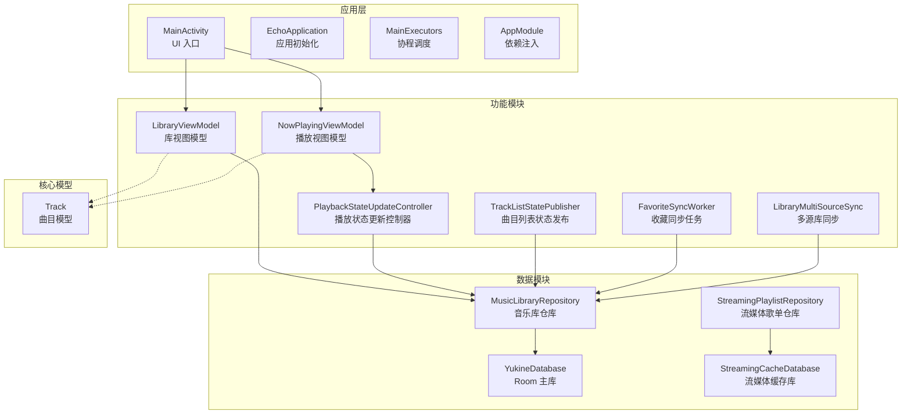
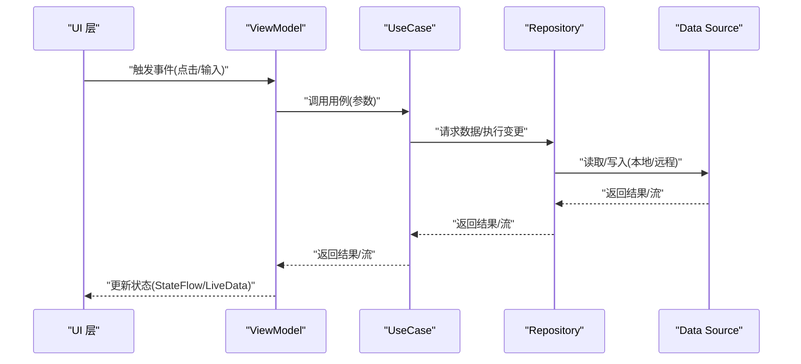
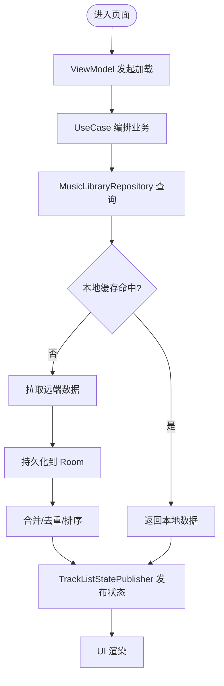
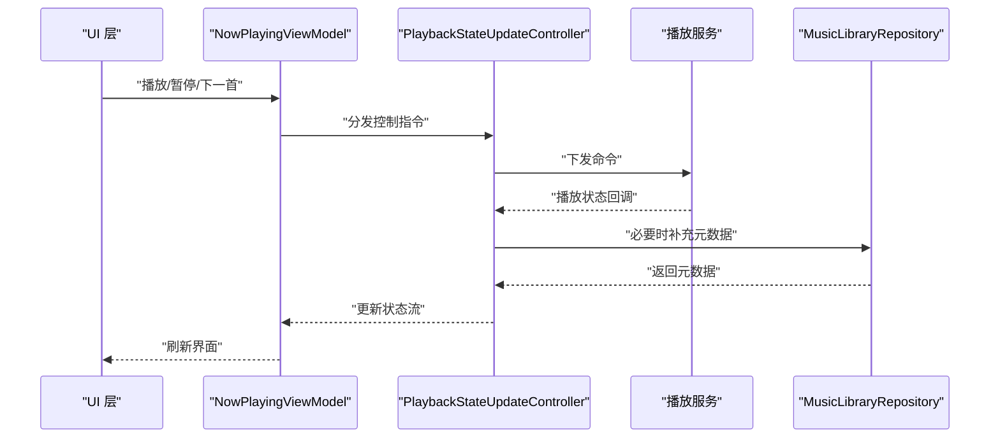
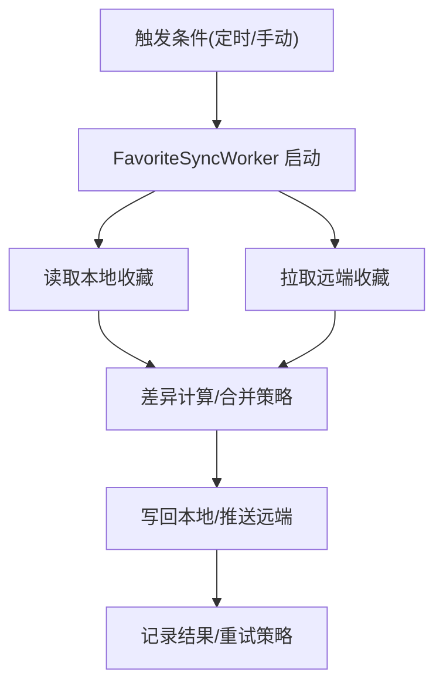
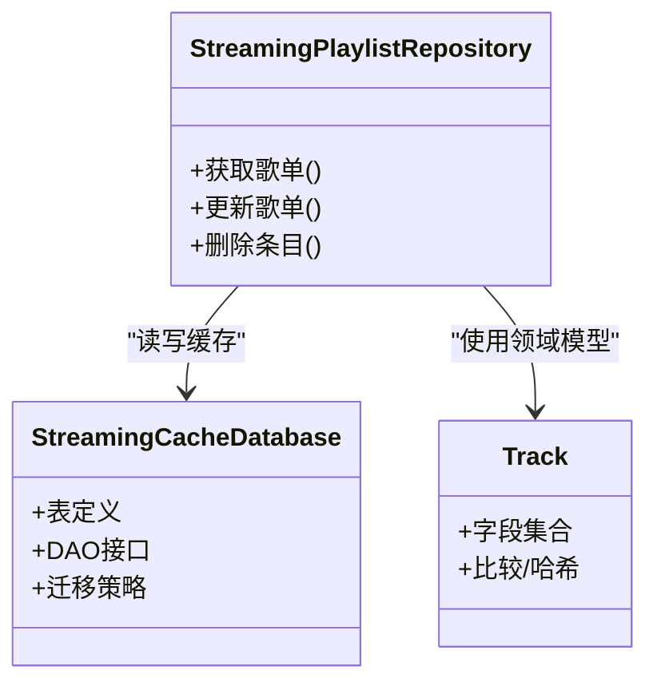
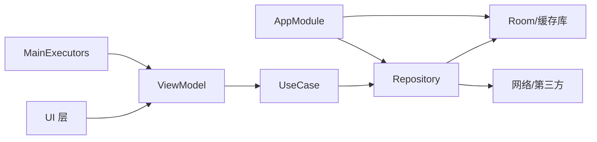

# 数据流架构

<cite>
**本文引用的文件**   
- [app/src/main/java/app/yukine/EchoApplication.kt](file://app/src/main/java/app/yukine/EchoApplication.kt)
- [app/src/main/java/app/yukine/MainActivity.kt](file://app/src/main/java/app/yukine/MainActivity.kt)
- [app/src/main/java/app/yukine/MainExecutors.kt](file://app/src/main/java/app/yukine/MainExecutors.kt)
- [app/src/main/java/app/yukine/di/AppModule.kt](file://app/src/main/java/app/yukine/di/AppModule.kt)
- [feature/data/src/main/java/app/yukine/data/repository/MusicLibraryRepository.kt](file://feature/data/src/main/java/app/yukine/data/repository/MusicLibraryRepository.kt)
- [feature/data/src/main/java/app/yukine/data/room/YukineDatabase.kt](file://feature/data/src/main/java/app/yukine/data/room/YukineDatabase.kt)
- [feature/streaming/src/main/java/app/yukine/streaming/cache/StreamingCacheDatabase.kt](file://feature/streaming/src/main/java/app/yukine/streaming/cache/StreamingCacheDatabase.kt)
- [feature/streaming/src/main/java/app/yukine/streaming/repository/StreamingPlaylistRepository.kt](file://feature/streaming/src/main/java/app/yukine/streaming/repository/StreamingPlaylistRepository.kt)
- [app/src/main/java/app/yukine/LibraryViewModel.kt](file://app/src/main/java/app/yukine/LibraryViewModel.kt)
- [app/src/main/java/app/yukine/NowPlayingViewModel.kt](file://app/src/main/java/app/yukine/NowPlayingViewModel.kt)
- [app/src/main/java/app/yukine/PlaybackStateUpdateController.kt](file://app/src/main/java/app/yukine/PlaybackStateUpdateController.kt)
- [app/src/main/java/app/yukine/TrackListStatePublisher.kt](file://app/src/main/java/app/yukine/TrackListStatePublisher.kt)
- [app/src/main/java/app/yukine/FavoriteSyncWorker.kt](file://app/src/main/java/app/yukine/FavoriteSyncWorker.kt)
- [app/src/main/java/app/yukine/LibraryMultiSourceSync.kt](file://app/src/main/java/app/yukine/LibraryMultiSourceSync.kt)
- [core/model/src/main/java/app/yukine/model/track/Track.kt](file://core/model/src/main/java/app/yukine/model/track/Track.kt)
</cite>

## 目录
1. [简介](#简介)
2. [项目结构](#项目结构)
3. [核心组件](#核心组件)
4. [架构总览](#架构总览)
5. [详细组件分析](#详细组件分析)
6. [依赖关系分析](#依赖关系分析)
7. [性能考量](#性能考量)
8. [故障排查指南](#故障排查指南)
9. [结论](#结论)
10. [附录](#附录)

## 简介
本文件面向 Echo Android 应用的数据流与状态管理，围绕 MVVM 单向数据流（UI → ViewModel → UseCase → Repository → Data Source）展开，系统化说明从 UI 到数据层的完整数据管道、状态管理模式（StateFlow/LiveData）、缓存策略、数据同步机制与离线支持方案。文档包含关键业务场景的数据流图与状态转换图，帮助开发者快速理解复杂数据处理逻辑并指导后续演进。

## 项目结构
Echo 采用模块化分层：
- app：应用装配层、UI 入口、协程调度、依赖注入、跨模块协调器
- feature/data：领域仓库实现、Room 数据库、本地持久化
- feature/streaming：流媒体相关仓库与缓存数据库
- core/model：跨模块共享的领域模型
- core/common、core/designsystem：通用能力与设计系统

图表来源
- [app/src/main/java/app/yukine/MainActivity.kt](file://app/src/main/java/app/yukine/MainActivity.kt)
- [app/src/main/java/app/yukine/EchoApplication.kt](file://app/src/main/java/app/yukine/EchoApplication.kt)
- [app/src/main/java/app/yukine/MainExecutors.kt](file://app/src/main/java/app/yukine/MainExecutors.kt)
- [app/src/main/java/app/yukine/di/AppModule.kt](file://app/src/main/java/app/yukine/di/AppModule.kt)
- [app/src/main/java/app/yukine/LibraryViewModel.kt](file://app/src/main/java/app/yukine/LibraryViewModel.kt)
- [app/src/main/java/app/yukine/NowPlayingViewModel.kt](file://app/src/main/java/app/yukine/NowPlayingViewModel.kt)
- [app/src/main/java/app/yukine/PlaybackStateUpdateController.kt](file://app/src/main/java/app/yukine/PlaybackStateUpdateController.kt)
- [app/src/main/java/app/yukine/TrackListStatePublisher.kt](file://app/src/main/java/app/yukine/TrackListStatePublisher.kt)
- [app/src/main/java/app/yukine/FavoriteSyncWorker.kt](file://app/src/main/java/app/yukine/FavoriteSyncWorker.kt)
- [app/src/main/java/app/yukine/LibraryMultiSourceSync.kt](file://app/src/main/java/app/yukine/LibraryMultiSourceSync.kt)
- [feature/data/src/main/java/app/yukine/data/repository/MusicLibraryRepository.kt](file://feature/data/src/main/java/app/yukine/data/repository/MusicLibraryRepository.kt)
- [feature/data/src/main/java/app/yukine/data/room/YukineDatabase.kt](file://feature/data/src/main/java/app/yukine/data/room/YukineDatabase.kt)
- [feature/streaming/src/main/java/app/yukine/streaming/repository/StreamingPlaylistRepository.kt](file://feature/streaming/src/main/java/app/yukine/streaming/repository/StreamingPlaylistRepository.kt)
- [feature/streaming/src/main/java/app/yukine/streaming/cache/StreamingCacheDatabase.kt](file://feature/streaming/src/main/java/app/yukine/streaming/cache/StreamingCacheDatabase.kt)
- [core/model/src/main/java/app/yukine/model/track/Track.kt](file://core/model/src/main/java/app/yukine/model/track/Track.kt)

章节来源
- [app/src/main/java/app/yukine/MainActivity.kt](file://app/src/main/java/app/yukine/MainActivity.kt)
- [app/src/main/java/app/yukine/EchoApplication.kt](file://app/src/main/java/app/yukine/EchoApplication.kt)
- [app/src/main/java/app/yukine/MainExecutors.kt](file://app/src/main/java/app/yukine/MainExecutors.kt)
- [app/src/main/java/app/yukine/di/AppModule.kt](file://app/src/main/java/app/yukine/di/AppModule.kt)

## 核心组件
- UI 层（Activity/Fragment/Compose）：订阅 ViewModel 暴露的状态流，触发用户操作事件。
- ViewModel 层：持有可观察状态（StateFlow/LiveData），编排业务用例调用，处理生命周期安全。
- UseCase 层：封装单一职责的业务流程，组合多个仓库或外部服务。
- Repository 层：统一数据访问接口，协调本地与远程数据源，提供缓存与合并策略。
- Data Source 层：Room 数据库、网络客户端、文件系统、第三方 SDK 等。

章节来源
- [app/src/main/java/app/yukine/LibraryViewModel.kt](file://app/src/main/java/app/yukine/LibraryViewModel.kt)
- [app/src/main/java/app/yukine/NowPlayingViewModel.kt](file://app/src/main/java/app/yukine/NowPlayingViewModel.kt)
- [feature/data/src/main/java/app/yukine/data/repository/MusicLibraryRepository.kt](file://feature/data/src/main/java/app/yukine/data/repository/MusicLibraryRepository.kt)
- [feature/streaming/src/main/java/app/yukine/streaming/repository/StreamingPlaylistRepository.kt](file://feature/streaming/src/main/java/app/yukine/streaming/repository/StreamingPlaylistRepository.kt)

## 架构总览
MVVM 单向数据流在 Echo 中的落地方式：
- UI 通过 StateFlow/LiveData 订阅 ViewModel 状态；用户交互产生事件，由 ViewModel 派发。
- ViewModel 调用 UseCase 执行具体业务；UseCase 聚合一个或多个 Repository。
- Repository 负责选择数据源优先级（内存缓存 → Room → 网络），并将结果以流式返回。
- Data Source 提供持久化与远端能力；后台任务（WorkManager）驱动增量同步。

图表来源
- [app/src/main/java/app/yukine/LibraryViewModel.kt](file://app/src/main/java/app/yukine/LibraryViewModel.kt)
- [feature/data/src/main/java/app/yukine/data/repository/MusicLibraryRepository.kt](file://feature/data/src/main/java/app/yukine/data/repository/MusicLibraryRepository.kt)
- [feature/streaming/src/main/java/app/yukine/streaming/repository/StreamingPlaylistRepository.kt](file://feature/streaming/src/main/java/app/yukine/streaming/repository/StreamingPlaylistRepository.kt)

## 详细组件分析

### 库数据流（Library）
- 数据读取路径：UI → LibraryViewModel → UseCase → MusicLibraryRepository → YukineDatabase/网络
- 状态发布：TrackListStatePublisher 将底层变化转换为 UI 友好的状态流
- 典型场景：加载歌单、搜索、分页刷新

图表来源
- [app/src/main/java/app/yukine/LibraryViewModel.kt](file://app/src/main/java/app/yukine/LibraryViewModel.kt)
- [feature/data/src/main/java/app/yukine/data/repository/MusicLibraryRepository.kt](file://feature/data/src/main/java/app/yukine/data/repository/MusicLibraryRepository.kt)
- [feature/data/src/main/java/app/yukine/data/room/YukineDatabase.kt](file://feature/data/src/main/java/app/yukine/data/room/YukineDatabase.kt)
- [app/src/main/java/app/yukine/TrackListStatePublisher.kt](file://app/src/main/java/app/yukine/TrackListStatePublisher.kt)

章节来源
- [app/src/main/java/app/yukine/LibraryViewModel.kt](file://app/src/main/java/app/yukine/LibraryViewModel.kt)
- [feature/data/src/main/java/app/yukine/data/repository/MusicLibraryRepository.kt](file://feature/data/src/main/java/app/yukine/data/repository/MusicLibraryRepository.kt)
- [feature/data/src/main/java/app/yukine/data/room/YukineDatabase.kt](file://feature/data/src/main/java/app/yukine/data/room/YukineDatabase.kt)
- [app/src/main/java/app/yukine/TrackListStatePublisher.kt](file://app/src/main/java/app/yukine/TrackListStatePublisher.kt)

### 播放状态流（Now Playing）
- 播放状态集中由 PlaybackStateUpdateController 维护，NowPlayingViewModel 对外暴露可读状态
- 播放控制事件经 Gateway/Service 转发至播放器，状态回推后更新 UI

图表来源
- [app/src/main/java/app/yukine/NowPlayingViewModel.kt](file://app/src/main/java/app/yukine/NowPlayingViewModel.kt)
- [app/src/main/java/app/yukine/PlaybackStateUpdateController.kt](file://app/src/main/java/app/yukine/PlaybackStateUpdateController.kt)
- [feature/data/src/main/java/app/yukine/data/repository/MusicLibraryRepository.kt](file://feature/data/src/main/java/app/yukine/data/repository/MusicLibraryRepository.kt)

章节来源
- [app/src/main/java/app/yukine/NowPlayingViewModel.kt](file://app/src/main/java/app/yukine/NowPlayingViewModel.kt)
- [app/src/main/java/app/yukine/PlaybackStateUpdateController.kt](file://app/src/main/java/app/yukine/PlaybackStateUpdateController.kt)

### 收藏同步（Favorites Sync）
- FavoriteSyncWorker 周期性或触发式执行收藏同步，确保本地与云端一致
- 多源库同步 LibraryMultiSourceSync 协调不同来源的增量合并

图表来源
- [app/src/main/java/app/yukine/FavoriteSyncWorker.kt](file://app/src/main/java/app/yukine/FavoriteSyncWorker.kt)
- [app/src/main/java/app/yukine/LibraryMultiSourceSync.kt](file://app/src/main/java/app/yukine/LibraryMultiSourceSync.kt)
- [feature/data/src/main/java/app/yukine/data/repository/MusicLibraryRepository.kt](file://feature/data/src/main/java/app/yukine/data/repository/MusicLibraryRepository.kt)

章节来源
- [app/src/main/java/app/yukine/FavoriteSyncWorker.kt](file://app/src/main/java/app/yukine/FavoriteSyncWorker.kt)
- [app/src/main/java/app/yukine/LibraryMultiSourceSync.kt](file://app/src/main/java/app/yukine/LibraryMultiSourceSync.kt)

### 流媒体歌单数据流
- StreamingPlaylistRepository 负责流媒体歌单的读写与缓存
- StreamingCacheDatabase 作为流媒体数据的独立缓存层，降低主库压力

图表来源
- [feature/streaming/src/main/java/app/yukine/streaming/repository/StreamingPlaylistRepository.kt](file://feature/streaming/src/main/java/app/yukine/streaming/repository/StreamingPlaylistRepository.kt)
- [feature/streaming/src/main/java/app/yukine/streaming/cache/StreamingCacheDatabase.kt](file://feature/streaming/src/main/java/app/yukine/streaming/cache/StreamingCacheDatabase.kt)
- [core/model/src/main/java/app/yukine/model/track/Track.kt](file://core/model/src/main/java/app/yukine/model/track/Track.kt)

章节来源
- [feature/streaming/src/main/java/app/yukine/streaming/repository/StreamingPlaylistRepository.kt](file://feature/streaming/src/main/java/app/yukine/streaming/repository/StreamingPlaylistRepository.kt)
- [feature/streaming/src/main/java/app/yukine/streaming/cache/StreamingCacheDatabase.kt](file://feature/streaming/src/main/java/app/yukine/streaming/cache/StreamingCacheDatabase.kt)
- [core/model/src/main/java/app/yukine/model/track/Track.kt](file://core/model/src/main/java/app/yukine/model/track/Track.kt)

### 状态管理模式（StateFlow/LiveData）
- 推荐在 ViewModel 中优先使用 StateFlow 暴露不可变状态，UI 侧用 collectAsStateWithLifecycle 收集
- 对需要兼容旧代码或特定场景可使用 LiveData，但建议逐步迁移至 StateFlow
- 最佳实践：
  - 状态不可变且最小粒度拆分，避免大对象频繁重建
  - 使用 combine/flatMapLatest 组合多个状态源
  - 在 ViewModel 中处理错误态与空态，UI 仅做展示

章节来源
- [app/src/main/java/app/yukine/LibraryViewModel.kt](file://app/src/main/java/app/yukine/LibraryViewModel.kt)
- [app/src/main/java/app/yukine/NowPlayingViewModel.kt](file://app/src/main/java/app/yukine/NowPlayingViewModel.kt)

### 缓存策略与离线支持
- 多级缓存：内存 → Room → 网络
- 失效策略：按实体维度设置 TTL 或基于版本号失效
- 离线优先：无网时返回本地快照，有网时后台增量同步
- 冲突解决：时间戳/版本号优先，必要时提示用户

章节来源
- [feature/data/src/main/java/app/yukine/data/repository/MusicLibraryRepository.kt](file://feature/data/src/main/java/app/yukine/data/repository/MusicLibraryRepository.kt)
- [feature/data/src/main/java/app/yukine/data/room/YukineDatabase.kt](file://feature/data/src/main/java/app/yukine/data/room/YukineDatabase.kt)
- [feature/streaming/src/main/java/app/yukine/streaming/repository/StreamingPlaylistRepository.kt](file://feature/streaming/src/main/java/app/yukine/streaming/repository/StreamingPlaylistRepository.kt)
- [feature/streaming/src/main/java/app/yukine/streaming/cache/StreamingCacheDatabase.kt](file://feature/streaming/src/main/java/app/yukine/streaming/cache/StreamingCacheDatabase.kt)

### 数据同步机制
- 使用 WorkManager 驱动后台任务（如收藏同步、身份增强、库多源同步）
- 同步策略：全量/增量混合，幂等写入，失败重试与退避
- 一致性：最终一致，允许短暂不一致并通过补偿任务修复

章节来源
- [app/src/main/java/app/yukine/FavoriteSyncWorker.kt](file://app/src/main/java/app/yukine/FavoriteSyncWorker.kt)
- [app/src/main/java/app/yukine/LibraryMultiSourceSync.kt](file://app/src/main/java/app/yukine/LibraryMultiSourceSync.kt)

## 依赖关系分析
- 低耦合高内聚：UI 不直接访问数据层，通过 ViewModel 与 UseCase 解耦
- 依赖注入：AppModule 集中装配仓库、数据库实例、调度器
- 协程调度：MainExecutors 统一管理 IO/Default/Main 调度器，避免线程滥用

图表来源
- [app/src/main/java/app/yukine/di/AppModule.kt](file://app/src/main/java/app/yukine/di/AppModule.kt)
- [app/src/main/java/app/yukine/MainExecutors.kt](file://app/src/main/java/app/yukine/MainExecutors.kt)
- [feature/data/src/main/java/app/yukine/data/repository/MusicLibraryRepository.kt](file://feature/data/src/main/java/app/yukine/data/repository/MusicLibraryRepository.kt)
- [feature/data/src/main/java/app/yukine/data/room/YukineDatabase.kt](file://feature/data/src/main/java/app/yukine/data/room/YukineDatabase.kt)

章节来源
- [app/src/main/java/app/yukine/di/AppModule.kt](file://app/src/main/java/app/yukine/di/AppModule.kt)
- [app/src/main/java/app/yukine/MainExecutors.kt](file://app/src/main/java/app/yukine/MainExecutors.kt)

## 性能考量
- 流式数据：尽量使用 StateFlow/LiveData 减少重复计算与 UI 抖动
- 分页与懒加载：列表数据按需加载，避免一次性加载大量数据
- 缓存命中率：合理设置缓存键与失效策略，提升命中率
- 后台任务批量化：合并小任务，减少唤醒次数与电量消耗
- 数据库索引：为高频查询字段建立索引，优化查询性能

[本节为通用指导，无需源码引用]

## 故障排查指南
- 常见问题定位：
  - UI 未更新：检查 ViewModel 状态是否被正确发射，是否存在背压或取消
  - 数据不一致：核对缓存失效策略与同步任务执行日志
  - 播放状态异常：确认 PlaybackStateUpdateController 回调链路与服务通信
- 调试建议：
  - 在 UseCase/Repository 层增加结构化日志
  - 使用断点与日志输出追踪关键路径
  - 针对同步任务添加重试与失败告警

章节来源
- [app/src/main/java/app/yukine/PlaybackStateUpdateController.kt](file://app/src/main/java/app/yukine/PlaybackStateUpdateController.kt)
- [app/src/main/java/app/yukine/FavoriteSyncWorker.kt](file://app/src/main/java/app/yukine/FavoriteSyncWorker.kt)

## 结论
Echo 的数据流遵循清晰的 MVVM 单向流，结合 StateFlow/LiveData 的状态管理与多级缓存、后台同步机制，实现了良好的可维护性与用户体验。建议在后续迭代中持续推进状态流标准化、完善缓存失效策略与同步幂等性保障，进一步提升稳定性与性能。

[本节为总结，无需源码引用]

## 附录
- 术语说明：
  - StateFlow：Kotlin 协程的可观察流，适合在 ViewModel 中暴露状态
  - LiveData：Android 可观察数据容器，适合与 UI 生命周期绑定
  - Repository：数据访问抽象，屏蔽数据源细节
  - UseCase：单一职责的业务用例，便于测试与复用
- 参考文件清单见“本文引用的文件”部分

[本节为附录，无需源码引用]