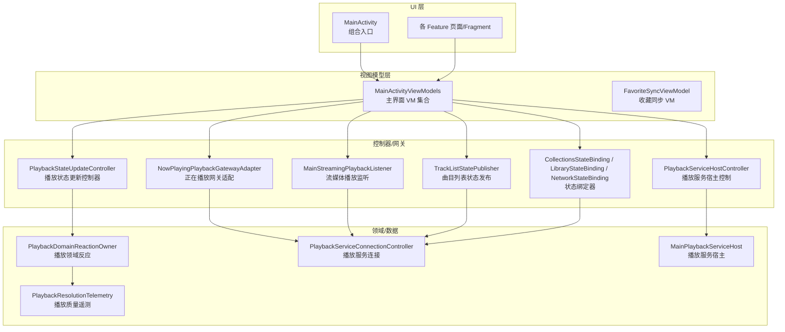
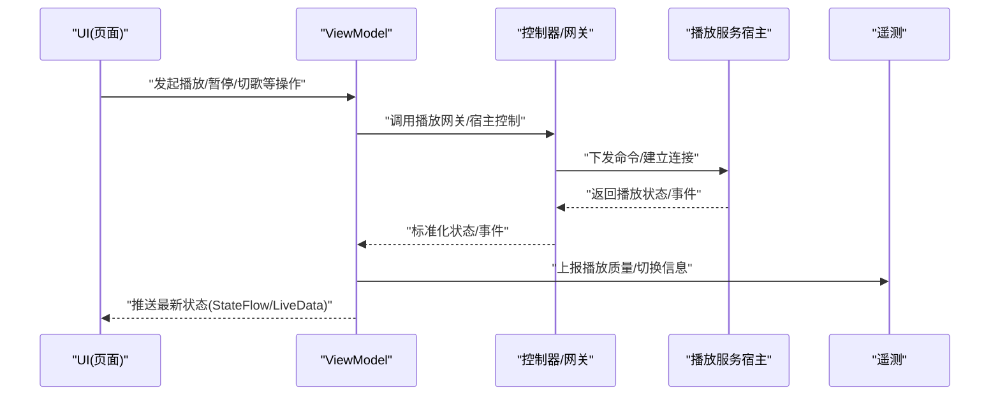
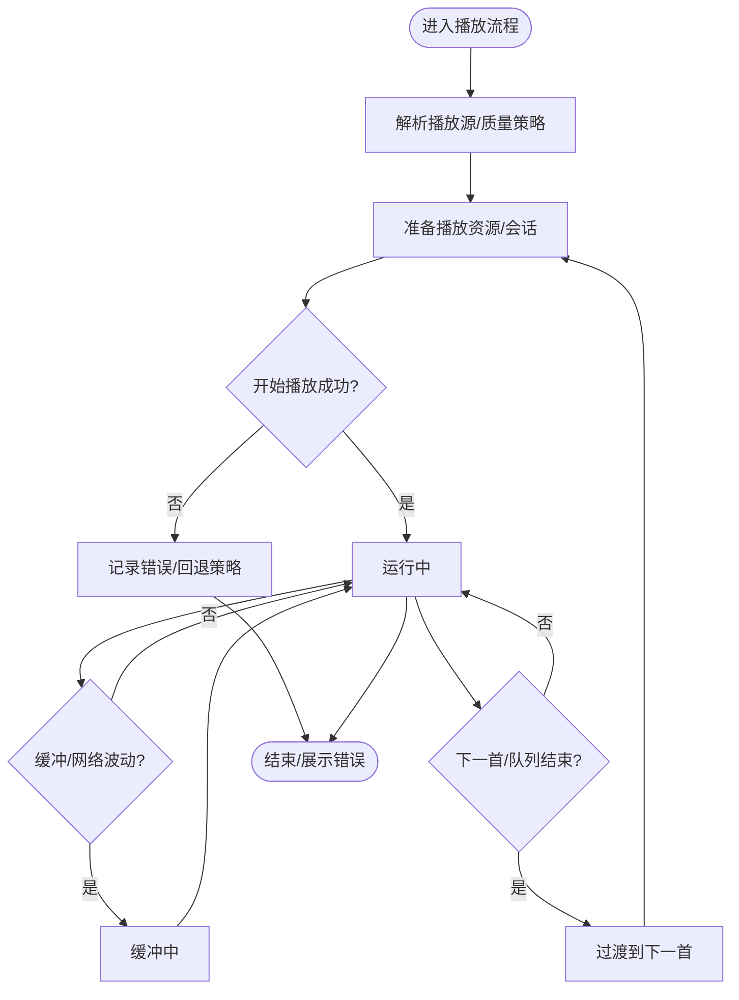
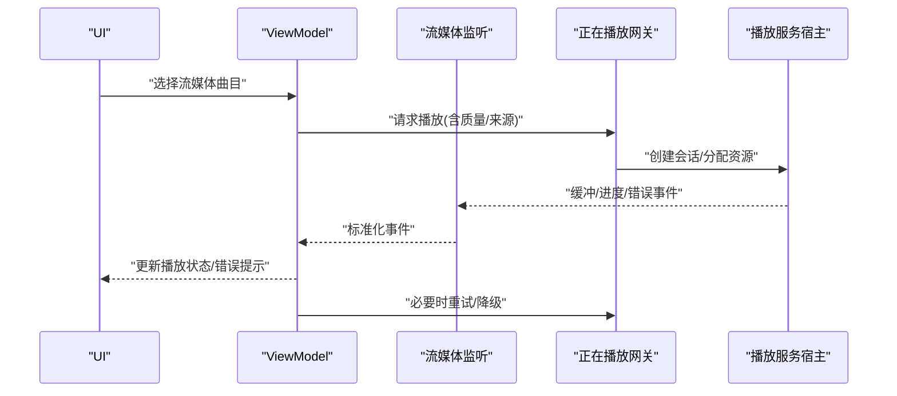
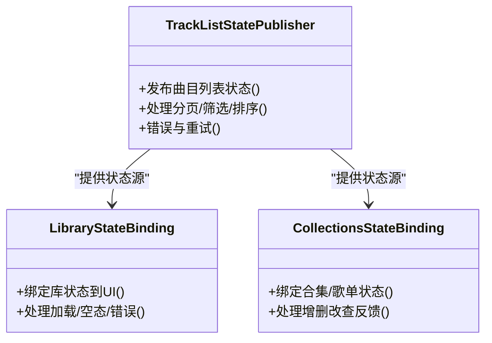
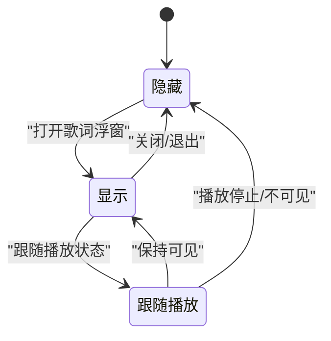
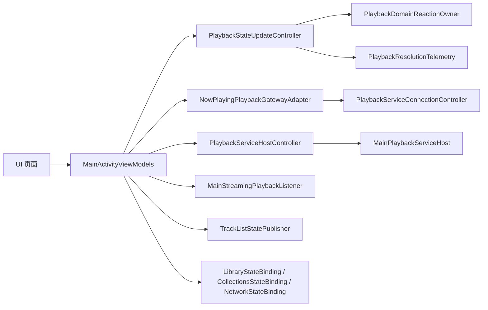

# 状态管理

<cite>
**本文引用的文件**   
- [MainActivity.kt](file://app/src/main/java/app/yukine/MainActivity.kt)
- [MainActivityViewModels.kt](file://app/src/main/java/app/yukine/MainActivityViewModels.kt)
- [PlaybackStateUpdateController.kt](file://app/src/main/java/app/yukine/PlaybackStateUpdateController.kt)
- [MainStreamingPlaybackListener.kt](file://app/src/main/java/app/yukine/MainStreamingPlaybackListener.kt)
- [NowPlayingPlaybackGatewayAdapter.kt](file://app/src/main/java/app/yukine/NowPlayingPlaybackGatewayAdapter.kt)
- [PlaybackServiceHostController.kt](file://app/src/main/java/app/yukine/PlaybackServiceHostController.kt)
- [PlaybackDomainReactionOwner.kt](file://app/src/main/java/app/yukine/PlaybackDomainReactionOwner.kt)
- [TrackListStatePublisher.kt](file://app/src/main/java/app/yukine/TrackListStatePublisher.kt)
- [CollectionsStateBinding.kt](file://app/src/main/java/app/yukine/CollectionsStateBinding.kt)
- [LibraryStateBinding.kt](file://app/src/main/java/app/yukine/LibraryStateBinding.kt)
- [NetworkStateBinding.kt](file://app/src/main/java/app/yukine/NetworkStateBinding.kt)
- [FloatingLyricsOverlayState.kt](file://app/src/main/java/app/yukine/FloatingLyricsOverlayState.kt)
- [FavoriteSyncViewModel.kt](file://app/src/main/java/app/yukine/FavoriteSyncViewModel.kt)
- [PlayHistoryActionController.kt](file://app/src/main/java/app/yukine/PlayHistoryActionController.kt)
- [QueueActionController.kt](file://app/src/main/java/app/yukine/QueueActionController.kt)
- [PlaybackStartController.kt](file://app/src/main/java/app/yukine/PlaybackStartController.kt)
- [StreamingPlaybackController.kt](file://app/src/main/java/app/yukine/StreamingPlaybackController.kt)
- [StreamingPlaylistController.kt](file://app/src/main/java/app/yukine/StreamingPlaylistController.kt)
- [PlaybackServiceConnectionController.kt](file://app/src/main/java/app/yukine/PlaybackServiceConnectionController.kt)
- [MainPlaybackServiceHost.kt](file://app/src/main/java/app/yukine/MainPlaybackServiceHost.kt)
- [PlaybackResolutionTelemetry.kt](file://app/src/main/java/app/yukine/PlaybackResolutionTelemetry.kt)
- [ARCHITECTURE.md](file://docs/ARCHITECTURE.md)
</cite>

## 目录
1. [简介](#简介)
2. [项目结构](#项目结构)
3. [核心组件](#核心组件)
4. [架构总览](#架构总览)
5. [详细组件分析](#详细组件分析)
6. [依赖关系分析](#依赖关系分析)
7. [性能考量](#性能考量)
8. [故障排查指南](#故障排查指南)
9. [结论](#结论)
10. [附录](#附录)

## 简介
本文件聚焦于 Echo Android 应用的状态管理模式，围绕 MVVM 架构下的 ViewModel 职责与生命周期、StateFlow/LiveData 的使用方式与最佳实践（订阅、更新、内存泄漏防护），以及播放状态、库状态、流媒体状态等核心业务状态的流转逻辑进行系统化说明。文档包含状态转换图、状态持久化策略与恢复机制，并通过“代码片段路径”的方式指引读者定位具体实现，帮助开发者理解响应式编程在音乐播放器中的落地方法。

## 项目结构
从模块划分看，状态相关能力分布在 app 层与 feature 层：
- app 层负责 UI 与业务编排：Activity/Fragment 持有 StateFlow/LiveData 的观察者，ViewModel 聚合领域事件并暴露状态；控制器类桥接 Service、网络、本地存储等外部系统。
- feature 层提供可复用的功能域（如 playback、streaming、library-ui）及其内部状态模型与交互契约。

图表来源
- [MainActivity.kt:1-200](file://app/src/main/java/app/yukine/MainActivity.kt#L1-L200)
- [MainActivityViewModels.kt:1-200](file://app/src/main/java/app/yukine/MainActivityViewModels.kt#L1-L200)
- [PlaybackStateUpdateController.kt:1-200](file://app/src/main/java/app/yukine/PlaybackStateUpdateController.kt#L1-L200)
- [NowPlayingPlaybackGatewayAdapter.kt:1-200](file://app/src/main/java/app/yukine/NowPlayingPlaybackGatewayAdapter.kt#L1-L200)
- [PlaybackServiceHostController.kt:1-200](file://app/src/main/java/app/yukine/PlaybackServiceHostController.kt#L1-L200)
- [MainStreamingPlaybackListener.kt:1-200](file://app/src/main/java/app/yukine/MainStreamingPlaybackListener.kt#L1-L200)
- [TrackListStatePublisher.kt:1-200](file://app/src/main/java/app/yukine/TrackListStatePublisher.kt#L1-L200)
- [CollectionsStateBinding.kt:1-200](file://app/src/main/java/app/yukine/CollectionsStateBinding.kt#L1-L200)
- [LibraryStateBinding.kt:1-200](file://app/src/main/java/app/yukine/LibraryStateBinding.kt#L1-L200)
- [NetworkStateBinding.kt:1-200](file://app/src/main/java/app/yukine/NetworkStateBinding.kt#L1-L200)
- [PlaybackDomainReactionOwner.kt:1-200](file://app/src/main/java/app/yukine/PlaybackDomainReactionOwner.kt#L1-L200)
- [PlaybackServiceConnectionController.kt:1-200](file://app/src/main/java/app/yukine/PlaybackServiceConnectionController.kt#L1-L200)
- [MainPlaybackServiceHost.kt:1-200](file://app/src/main/java/app/yukine/MainPlaybackServiceHost.kt#L1-L200)
- [PlaybackResolutionTelemetry.kt:1-200](file://app/src/main/java/app/yukine/PlaybackResolutionTelemetry.kt#L1-L200)

章节来源
- [MainActivity.kt:1-200](file://app/src/main/java/app/yukine/MainActivity.kt#L1-L200)
- [MainActivityViewModels.kt:1-200](file://app/src/main/java/app/yukine/MainActivityViewModels.kt#L1-L200)
- [ARCHITECTURE.md:1-200](file://docs/ARCHITECTURE.md#L1-L200)

## 核心组件
- MainActivityViewModels：集中管理主界面相关 ViewModel，协调 UI 状态与业务动作，是 MVVM 中“视图模型”的核心枢纽。
- PlaybackStateUpdateController：统一处理来自播放引擎/服务的状态变更，将其转换为 UI 可读的状态对象并分发。
- NowPlayingPlaybackGatewayAdapter：将“正在播放”相关的播放行为抽象为网关接口，屏蔽底层差异（本地/流媒体）。
- PlaybackServiceHostController：封装对播放服务宿主的启动、绑定、解绑与通信，确保跨进程状态一致性。
- MainStreamingPlaybackListener：监听流媒体播放事件（缓冲、错误、元数据变化等），驱动状态机推进。
- TrackListStatePublisher：将曲目列表的加载、分页、错误等状态以响应式流的形式发布给 UI。
- CollectionsStateBinding / LibraryStateBinding / NetworkStateBinding：将不同领域的状态绑定到 UI 组件，简化订阅与更新。
- FavoriteSyncViewModel：演示基于 ViewModel 的异步任务与状态暴露（例如收藏同步进度、错误提示）。
- PlaybackDomainReactionOwner：对播放领域事件做出反应（如自动下一首、队列调整、推荐触发）。
- PlaybackServiceConnectionController：维护与服务端的连接生命周期，保障状态订阅的健壮性。
- MainPlaybackServiceHost：播放服务宿主，承载实际音频播放与系统通知等长驻逻辑。
- PlaybackResolutionTelemetry：记录播放分辨率/码率切换等指标，辅助状态决策与问题定位。

章节来源
- [MainActivityViewModels.kt:1-200](file://app/src/main/java/app/yukine/MainActivityViewModels.kt#L1-L200)
- [PlaybackStateUpdateController.kt:1-200](file://app/src/main/java/app/yukine/PlaybackStateUpdateController.kt#L1-L200)
- [NowPlayingPlaybackGatewayAdapter.kt:1-200](file://app/src/main/java/app/yukine/NowPlayingPlaybackGatewayAdapter.kt#L1-L200)
- [PlaybackServiceHostController.kt:1-200](file://app/src/main/java/app/yukine/PlaybackServiceHostController.kt#L1-L200)
- [MainStreamingPlaybackListener.kt:1-200](file://app/src/main/java/app/yukine/MainStreamingPlaybackListener.kt#L1-L200)
- [TrackListStatePublisher.kt:1-200](file://app/src/main/java/app/yukine/TrackListStatePublisher.kt#L1-L200)
- [CollectionsStateBinding.kt:1-200](file://app/src/main/java/app/yukine/CollectionsStateBinding.kt#L1-L200)
- [LibraryStateBinding.kt:1-200](file://app/src/main/java/app/yukine/LibraryStateBinding.kt#L1-L200)
- [NetworkStateBinding.kt:1-200](file://app/src/main/java/app/yukine/NetworkStateBinding.kt#L1-L200)
- [FavoriteSyncViewModel.kt:1-200](file://app/src/main/java/app/yukine/FavoriteSyncViewModel.kt#L1-L200)
- [PlaybackDomainReactionOwner.kt:1-200](file://app/src/main/java/app/yukine/PlaybackDomainReactionOwner.kt#L1-L200)
- [PlaybackServiceConnectionController.kt:1-200](file://app/src/main/java/app/yukine/PlaybackServiceConnectionController.kt#L1-L200)
- [MainPlaybackServiceHost.kt:1-200](file://app/src/main/java/app/yukine/MainPlaybackServiceHost.kt#L1-L200)
- [PlaybackResolutionTelemetry.kt:1-200](file://app/src/main/java/app/yukine/PlaybackResolutionTelemetry.kt#L1-L200)

## 架构总览
MVVM 在本项目中的关键要点：
- Activity/Fragment 仅持有轻量级 UI 状态与用户交互，不直接操作播放或网络。
- ViewModel 作为单一事实源，聚合多个 Source（服务、仓库、监听器）的事件，合并为稳定的 UI 状态。
- 控制器/网关承担跨进程/跨模块调用，将复杂细节封装为简单 API。
- 状态通过 StateFlow/LiveData 单向流动，UI 只读订阅，避免双向耦合。

图表来源
- [MainActivityViewModels.kt:1-200](file://app/src/main/java/app/yukine/MainActivityViewModels.kt#L1-L200)
- [PlaybackServiceHostController.kt:1-200](file://app/src/main/java/app/yukine/PlaybackServiceHostController.kt#L1-L200)
- [NowPlayingPlaybackGatewayAdapter.kt:1-200](file://app/src/main/java/app/yukine/NowPlayingPlaybackGatewayAdapter.kt#L1-L200)
- [PlaybackResolutionTelemetry.kt:1-200](file://app/src/main/java/app/yukine/PlaybackResolutionTelemetry.kt#L1-L200)

## 详细组件分析

### 播放状态管理与状态机
播放状态是应用最核心的状态之一，涉及本地与流媒体两种路径。其典型流程如下：

图表来源
- [PlaybackStateUpdateController.kt:1-200](file://app/src/main/java/app/yukine/PlaybackStateUpdateController.kt#L1-L200)
- [MainStreamingPlaybackListener.kt:1-200](file://app/src/main/java/app/yukine/MainStreamingPlaybackListener.kt#L1-L200)
- [PlaybackDomainReactionOwner.kt:1-200](file://app/src/main/java/app/yukine/PlaybackDomainReactionOwner.kt#L1-L200)
- [PlaybackServiceConnectionController.kt:1-200](file://app/src/main/java/app/yukine/PlaybackServiceConnectionController.kt#L1-L200)
- [MainPlaybackServiceHost.kt:1-200](file://app/src/main/java/app/yukine/MainPlaybackServiceHost.kt#L1-L200)
- [PlaybackResolutionTelemetry.kt:1-200](file://app/src/main/java/app/yukine/PlaybackResolutionTelemetry.kt#L1-L200)

章节来源
- [PlaybackStateUpdateController.kt:1-200](file://app/src/main/java/app/yukine/PlaybackStateUpdateController.kt#L1-L200)
- [MainStreamingPlaybackListener.kt:1-200](file://app/src/main/java/app/yukine/MainStreamingPlaybackListener.kt#L1-L200)
- [PlaybackDomainReactionOwner.kt:1-200](file://app/src/main/java/app/yukine/PlaybackDomainReactionOwner.kt#L1-L200)
- [PlaybackServiceConnectionController.kt:1-200](file://app/src/main/java/app/yukine/PlaybackServiceConnectionController.kt#L1-L200)
- [MainPlaybackServiceHost.kt:1-200](file://app/src/main/java/app/yukine/MainPlaybackServiceHost.kt#L1-L200)
- [PlaybackResolutionTelemetry.kt:1-200](file://app/src/main/java/app/yukine/PlaybackResolutionTelemetry.kt#L1-L200)

### 流媒体播放状态与重试/降级
流媒体播放需关注网络抖动、认证失效、解码失败等场景。典型处理包括：
- 缓冲事件驱动 UI 显示缓冲态
- 错误分类与重试（指数退避/切换码率）
- 元数据/封面/歌词的异步加载与缓存
- 与“正在播放”网关协同，保证跨进程一致

图表来源
- [MainStreamingPlaybackListener.kt:1-200](file://app/src/main/java/app/yukine/MainStreamingPlaybackListener.kt#L1-L200)
- [NowPlayingPlaybackGatewayAdapter.kt:1-200](file://app/src/main/java/app/yukine/NowPlayingPlaybackGatewayAdapter.kt#L1-L200)
- [PlaybackServiceHostController.kt:1-200](file://app/src/main/java/app/yukine/PlaybackServiceHostController.kt#L1-L200)

章节来源
- [MainStreamingPlaybackListener.kt:1-200](file://app/src/main/java/app/yukine/MainStreamingPlaybackListener.kt#L1-L200)
- [NowPlayingPlaybackGatewayAdapter.kt:1-200](file://app/src/main/java/app/yukine/NowPlayingPlaybackGatewayAdapter.kt#L1-L200)
- [PlaybackServiceHostController.kt:1-200](file://app/src/main/java/app/yukine/PlaybackServiceHostController.kt#L1-L200)

### 库状态与列表状态发布
库与列表状态通常包含加载、分页、筛选、排序、错误等维度。TrackListStatePublisher 将底层数据变化转化为 UI 友好的状态流，配合 LibraryStateBinding/CollectionsStateBinding 完成 UI 绑定。

图表来源
- [TrackListStatePublisher.kt:1-200](file://app/src/main/java/app/yukine/TrackListStatePublisher.kt#L1-L200)
- [LibraryStateBinding.kt:1-200](file://app/src/main/java/app/yukine/LibraryStateBinding.kt#L1-L200)
- [CollectionsStateBinding.kt:1-200](file://app/src/main/java/app/yukine/CollectionsStateBinding.kt#L1-L200)

章节来源
- [TrackListStatePublisher.kt:1-200](file://app/src/main/java/app/yukine/TrackListStatePublisher.kt#L1-L200)
- [LibraryStateBinding.kt:1-200](file://app/src/main/java/app/yukine/LibraryStateBinding.kt#L1-L200)
- [CollectionsStateBinding.kt:1-200](file://app/src/main/java/app/yukine/CollectionsStateBinding.kt#L1-L200)

### 浮动歌词覆盖层状态
浮动歌词覆盖层需要独立的生命周期与状态管理，避免与主播放状态互相干扰。

图表来源
- [FloatingLyricsOverlayState.kt:1-200](file://app/src/main/java/app/yukine/FloatingLyricsOverlayState.kt#L1-L200)

章节来源
- [FloatingLyricsOverlayState.kt:1-200](file://app/src/main/java/app/yukine/FloatingLyricsOverlayState.kt#L1-L200)

### 收藏同步与后台任务状态
FavoriteSyncViewModel 展示了如何在 ViewModel 中管理耗时任务与状态（进行中、成功、失败、错误消息），并与 UI 解耦。

章节来源
- [FavoriteSyncViewModel.kt:1-200](file://app/src/main/java/app/yukine/FavoriteSyncViewModel.kt#L1-L200)

### 播放历史与队列操作
PlayHistoryActionController 与 QueueActionController 分别负责历史记录写入与队列变更，这些操作会触发播放状态与 UI 的联动更新。

章节来源
- [PlayHistoryActionController.kt:1-200](file://app/src/main/java/app/yukine/PlayHistoryActionController.kt#L1-L200)
- [QueueActionController.kt:1-200](file://app/src/main/java/app/yukine/QueueActionController.kt#L1-L200)

### 播放启动与流媒体播放控制
PlaybackStartController 与 StreamingPlaybackController 共同决定何时启动播放、如何解析播放源、如何处理流媒体特有逻辑（鉴权、Cookie、代理等）。

章节来源
- [PlaybackStartController.kt:1-200](file://app/src/main/java/app/yukine/PlaybackStartController.kt#L1-L200)
- [StreamingPlaybackController.kt:1-200](file://app/src/main/java/app/yukine/StreamingPlaybackController.kt#L1-L200)
- [StreamingPlaylistController.kt:1-200](file://app/src/main/java/app/yukine/StreamingPlaylistController.kt#L1-L200)

## 依赖关系分析
- 低耦合：UI 仅依赖 ViewModel 暴露的状态流；控制器/网关屏蔽底层差异。
- 高内聚：播放状态更新集中在 PlaybackStateUpdateController，便于测试与维护。
- 连接管理：PlaybackServiceConnectionController 统一管理连接生命周期，避免重复订阅与内存泄漏。
- 遥测与诊断：PlaybackResolutionTelemetry 贯穿播放链路，有助于定位状态异常。

图表来源
- [MainActivityViewModels.kt:1-200](file://app/src/main/java/app/yukine/MainActivityViewModels.kt#L1-L200)
- [PlaybackStateUpdateController.kt:1-200](file://app/src/main/java/app/yukine/PlaybackStateUpdateController.kt#L1-L200)
- [NowPlayingPlaybackGatewayAdapter.kt:1-200](file://app/src/main/java/app/yukine/NowPlayingPlaybackGatewayAdapter.kt#L1-L200)
- [PlaybackServiceHostController.kt:1-200](file://app/src/main/java/app/yukine/PlaybackServiceHostController.kt#L1-L200)
- [MainStreamingPlaybackListener.kt:1-200](file://app/src/main/java/app/yukine/MainStreamingPlaybackListener.kt#L1-L200)
- [TrackListStatePublisher.kt:1-200](file://app/src/main/java/app/yukine/TrackListStatePublisher.kt#L1-L200)
- [CollectionsStateBinding.kt:1-200](file://app/src/main/java/app/yukine/CollectionsStateBinding.kt#L1-L200)
- [LibraryStateBinding.kt:1-200](file://app/src/main/java/app/yukine/LibraryStateBinding.kt#L1-L200)
- [NetworkStateBinding.kt:1-200](file://app/src/main/java/app/yukine/NetworkStateBinding.kt#L1-L200)
- [PlaybackDomainReactionOwner.kt:1-200](file://app/src/main/java/app/yukine/PlaybackDomainReactionOwner.kt#L1-L200)
- [PlaybackServiceConnectionController.kt:1-200](file://app/src/main/java/app/yukine/PlaybackServiceConnectionController.kt#L1-L200)
- [MainPlaybackServiceHost.kt:1-200](file://app/src/main/java/app/yukine/MainPlaybackServiceHost.kt#L1-L200)
- [PlaybackResolutionTelemetry.kt:1-200](file://app/src/main/java/app/yukine/PlaybackResolutionTelemetry.kt#L1-L200)

章节来源
- [MainActivityViewModels.kt:1-200](file://app/src/main/java/app/yukine/MainActivityViewModels.kt#L1-L200)
- [PlaybackStateUpdateController.kt:1-200](file://app/src/main/java/app/yukine/PlaybackStateUpdateController.kt#L1-L200)
- [NowPlayingPlaybackGatewayAdapter.kt:1-200](file://app/src/main/java/app/yukine/NowPlayingPlaybackGatewayAdapter.kt#L1-L200)
- [PlaybackServiceHostController.kt:1-200](file://app/src/main/java/app/yukine/PlaybackServiceHostController.kt#L1-L200)
- [MainStreamingPlaybackListener.kt:1-200](file://app/src/main/java/app/yukine/MainStreamingPlaybackListener.kt#L1-L200)
- [TrackListStatePublisher.kt:1-200](file://app/src/main/java/app/yukine/TrackListStatePublisher.kt#L1-L200)
- [CollectionsStateBinding.kt:1-200](file://app/src/main/java/app/yukine/CollectionsStateBinding.kt#L1-L200)
- [LibraryStateBinding.kt:1-200](file://app/src/main/java/app/yukine/LibraryStateBinding.kt#L1-L200)
- [NetworkStateBinding.kt:1-200](file://app/src/main/java/app/yukine/NetworkStateBinding.kt#L1-L200)
- [PlaybackDomainReactionOwner.kt:1-200](file://app/src/main/java/app/yukine/PlaybackDomainReactionOwner.kt#L1-L200)
- [PlaybackServiceConnectionController.kt:1-200](file://app/src/main/java/app/yukine/PlaybackServiceConnectionController.kt#L1-L200)
- [MainPlaybackServiceHost.kt:1-200](file://app/src/main/java/app/yukine/MainPlaybackServiceHost.kt#L1-L200)
- [PlaybackResolutionTelemetry.kt:1-200](file://app/src/main/java/app/yukine/PlaybackResolutionTelemetry.kt#L1-L200)

## 性能考量
- 状态去抖与节流：对高频事件（缓冲、进度、网络波动）做合理合并，减少 UI 重绘。
- 背压与取消：使用 StateFlow/LiveData 时注意作用域与取消，避免在销毁后继续更新。
- 懒加载与分页：列表状态采用分页加载，结合骨架屏与错误重试提升体验。
- 资源复用：播放会话、解码器、网络客户端尽量复用，降低启动开销。
- 遥测采样：对关键指标（码率切换、缓冲时长）进行采样上报，避免过多 IO。

[本节为通用指导，无需特定文件引用]

## 故障排查指南
- 播放无响应：检查 PlaybackServiceConnectionController 的连接状态与回调是否被正确注册；确认 PlaybackServiceHostController 的宿主生命周期。
- 频繁缓冲：查看 MainStreamingPlaybackListener 的错误分类与重试策略；结合 PlaybackResolutionTelemetry 分析码率切换是否过于激进。
- 列表不刷新：确认 TrackListStatePublisher 的状态发布是否正确；检查 LibraryStateBinding/CollectionsStateBinding 的订阅作用域。
- 内存泄漏：确保所有 LiveData/StateFlow 订阅在合适的生命周期内取消；避免在静态变量中持有 Context 引用。
- 状态不一致：核对 PlaybackStateUpdateController 的状态归一化逻辑，确保多源事件合并后的最终状态唯一且稳定。

章节来源
- [PlaybackServiceConnectionController.kt:1-200](file://app/src/main/java/app/yukine/PlaybackServiceConnectionController.kt#L1-L200)
- [PlaybackServiceHostController.kt:1-200](file://app/src/main/java/app/yukine/PlaybackServiceHostController.kt#L1-L200)
- [MainStreamingPlaybackListener.kt:1-200](file://app/src/main/java/app/yukine/MainStreamingPlaybackListener.kt#L1-L200)
- [PlaybackResolutionTelemetry.kt:1-200](file://app/src/main/java/app/yukine/PlaybackResolutionTelemetry.kt#L1-L200)
- [TrackListStatePublisher.kt:1-200](file://app/src/main/java/app/yukine/TrackListStatePublisher.kt#L1-L200)
- [LibraryStateBinding.kt:1-200](file://app/src/main/java/app/yukine/LibraryStateBinding.kt#L1-L200)
- [CollectionsStateBinding.kt:1-200](file://app/src/main/java/app/yukine/CollectionsStateBinding.kt#L1-L200)
- [PlaybackStateUpdateController.kt:1-200](file://app/src/main/java/app/yukine/PlaybackStateUpdateController.kt#L1-L200)

## 结论
Echo 的状态管理遵循 MVVM 与响应式范式：以 ViewModel 为中心，控制器/网关隔离复杂调用，状态通过 StateFlow/LiveData 单向流动。播放、库、流媒体等核心状态均具备清晰的状态机与错误处理路径，配合遥测与连接管理，形成稳健的可观测性与可维护性。建议在新功能开发中延续该模式，优先定义状态模型与转换规则，再实现 UI 绑定与交互。

[本节为总结性内容，无需特定文件引用]

## 附录
- 代码片段路径（示例）
  - 主界面 VM 集合与状态订阅：[MainActivityViewModels.kt](file://app/src/main/java/app/yukine/MainActivityViewModels.kt)
  - 播放状态更新与归一化：[PlaybackStateUpdateController.kt](file://app/src/main/java/app/yukine/PlaybackStateUpdateController.kt)
  - 正在播放网关适配：[NowPlayingPlaybackGatewayAdapter.kt](file://app/src/main/java/app/yukine/NowPlayingPlaybackGatewayAdapter.kt)
  - 播放服务宿主控制：[PlaybackServiceHostController.kt](file://app/src/main/java/app/yukine/PlaybackServiceHostController.kt)
  - 流媒体播放监听：[MainStreamingPlaybackListener.kt](file://app/src/main/java/app/yukine/MainStreamingPlaybackListener.kt)
  - 曲目列表状态发布：[TrackListStatePublisher.kt](file://app/src/main/java/app/yukine/TrackListStatePublisher.kt)
  - 状态绑定器（库/合集/网络）：[LibraryStateBinding.kt](file://app/src/main/java/app/yukine/LibraryStateBinding.kt)、[CollectionsStateBinding.kt](file://app/src/main/java/app/yukine/CollectionsStateBinding.kt)、[NetworkStateBinding.kt](file://app/src/main/java/app/yukine/NetworkStateBinding.kt)
  - 浮动歌词覆盖层状态：[FloatingLyricsOverlayState.kt](file://app/src/main/java/app/yukine/FloatingLyricsOverlayState.kt)
  - 收藏同步 VM：[FavoriteSyncViewModel.kt](file://app/src/main/java/app/yukine/FavoriteSyncViewModel.kt)
  - 播放历史与队列：[PlayHistoryActionController.kt](file://app/src/main/java/app/yukine/PlayHistoryActionController.kt)、[QueueActionController.kt](file://app/src/main/java/app/yukine/QueueActionController.kt)
  - 播放启动与流媒体控制：[PlaybackStartController.kt](file://app/src/main/java/app/yukine/PlaybackStartController.kt)、[StreamingPlaybackController.kt](file://app/src/main/java/app/yukine/StreamingPlaybackController.kt)、[StreamingPlaylistController.kt](file://app/src/main/java/app/yukine/StreamingPlaylistController.kt)
  - 播放服务连接与宿主：[PlaybackServiceConnectionController.kt](file://app/src/main/java/app/yukine/PlaybackServiceConnectionController.kt)、[MainPlaybackServiceHost.kt](file://app/src/main/java/app/yukine/MainPlaybackServiceHost.kt)
  - 播放质量遥测：[PlaybackResolutionTelemetry.kt](file://app/src/main/java/app/yukine/PlaybackResolutionTelemetry.kt)
  - 架构参考：[ARCHITECTURE.md](file://docs/ARCHITECTURE.md)