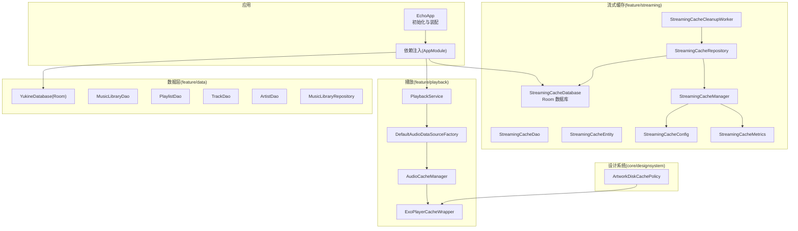
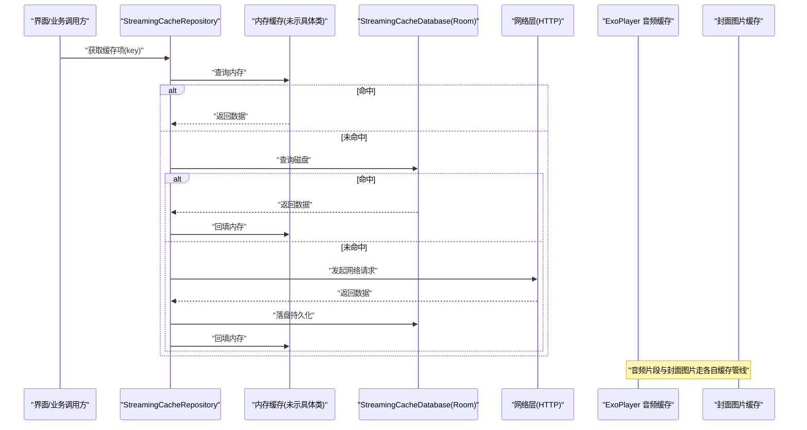
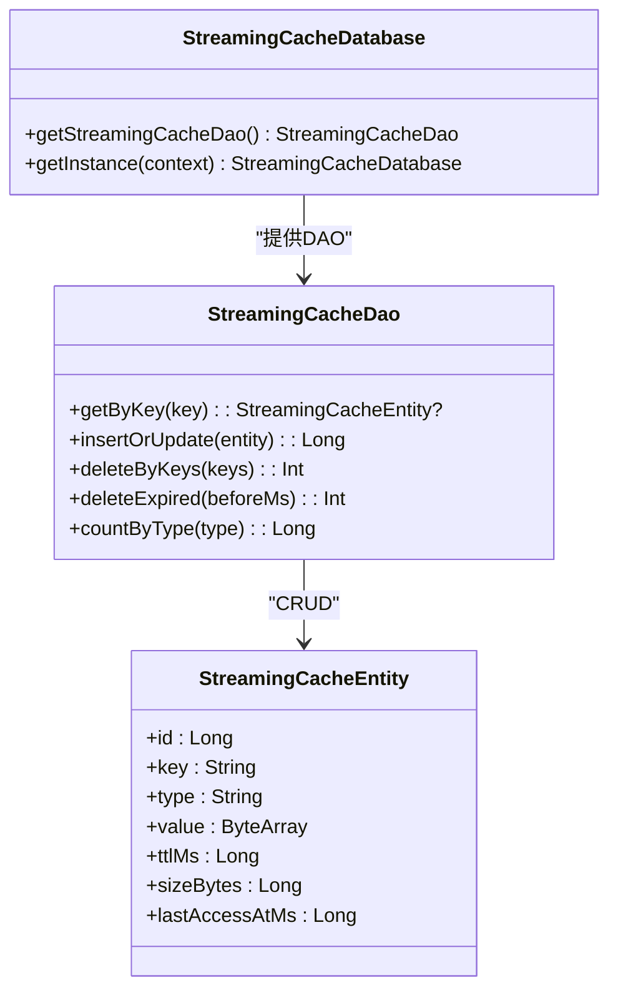
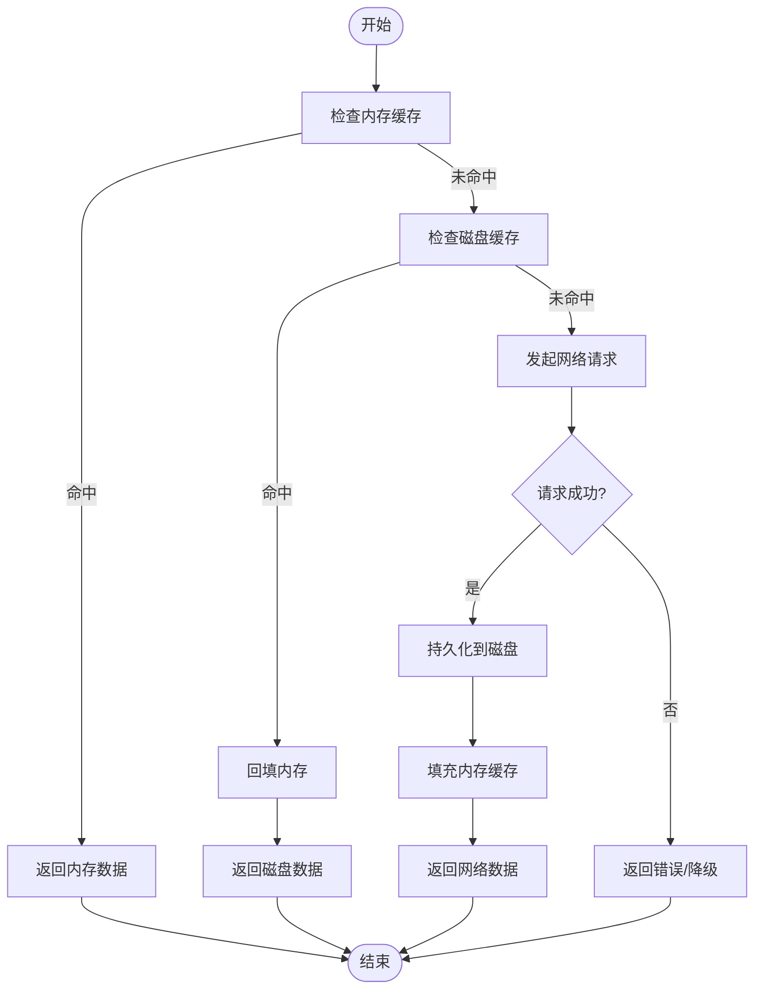
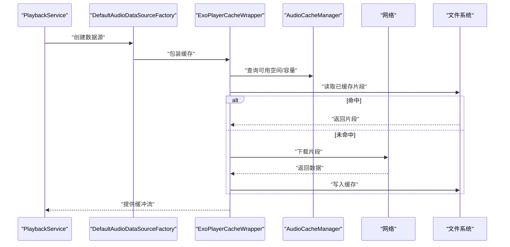
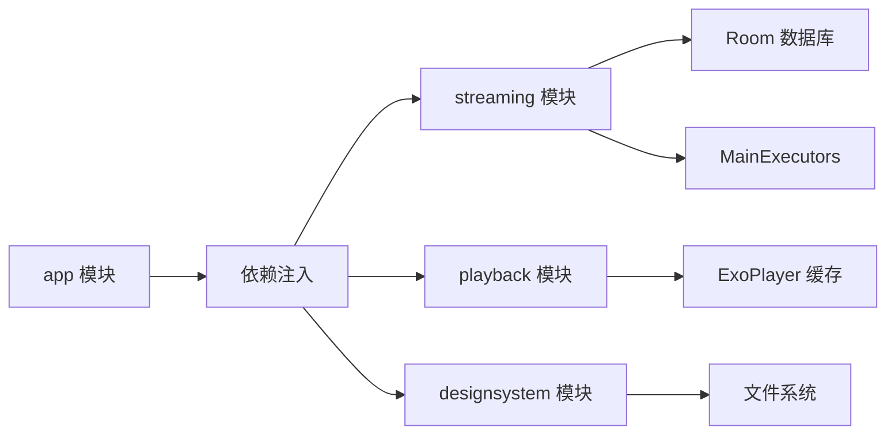

# 缓存策略

<cite>
**本文引用的文件**   
- [app/src/main/java/app/yukine/EchoApp.kt](file://app/src/main/java/app/yukine/EchoApp.kt)
- [app/schemas/app.yukine.streaming.cache.StreamingCacheDatabase/1.json](file://app/schemas/app.yukine.streaming.cache.StreamingCacheDatabase/1.json)
- [feature/streaming/build.gradle](file://feature/streaming/build.gradle)
- [feature/streaming/src/main/java/app/yukine/streaming/cache/StreamingCacheDatabase.kt](file://feature/streaming/src/main/java/app/yukine/streaming/cache/StreamingCacheDatabase.kt)
- [feature/streaming/src/main/java/app/yukine/streaming/cache/StreamingCacheDao.kt](file://feature/streaming/src/main/java/app/yukine/streaming/cache/StreamingCacheDao.kt)
- [feature/streaming/src/main/java/app/yukine/streaming/cache/StreamingCacheEntity.kt](file://feature/streaming/src/main/java/app/yukine/streaming/cache/StreamingCacheEntity.kt)
- [feature/streaming/src/main/java/app/yukine/streaming/cache/StreamingCacheRepository.kt](file://feature/streaming/src/main/java/app/yukine/streaming/cache/StreamingCacheRepository.kt)
- [feature/streaming/src/main/java/app/yukine/streaming/cache/StreamingCacheManager.kt](file://feature/streaming/src/main/java/app/yukine/streaming/cache/StreamingCacheManager.kt)
- [feature/streaming/src/main/java/app/yukine/streaming/cache/StreamingCacheConfig.kt](file://feature/streaming/src/main/java/app/yukine/streaming/cache/StreamingCacheConfig.kt)
- [feature/streaming/src/main/java/app/yukine/streaming/cache/StreamingCacheMetrics.kt](file://feature/streaming/src/main/java/app/yukine/streaming/cache/StreamingCacheMetrics.kt)
- [feature/streaming/src/main/java/app/yukine/streaming/cache/StreamingCacheCleanupWorker.kt](file://feature/streaming/src/main/java/app/yukine/streaming/cache/StreamingCacheCleanupWorker.kt)
- [feature/streaming/src/main/java/app/yukine/streaming/cache/StreamingCacheDebug.kt](file://feature/streaming/src/main/java/app/yukine/streaming/cache/StreamingCacheDebug.kt)
- [core/designsystem/src/main/java/app/yukine/ui/ArtworkDiskCachePolicy.kt](file://core/designsystem/src/main/java/app/yukine/ui/ArtworkDiskCachePolicy.kt)
- [app/src/main/java/app/yukine/MainExecutors.kt](file://app/src/main/java/app/yukine/MainExecutors.kt)
- [feature/data/src/main/java/app/yukine/data/room/YukineDatabase.kt](file://feature/data/src/main/java/app/yukine/data/room/YukineDatabase.kt)
- [feature/data/src/main/java/app/yukine/data/room/MusicLibraryDao.kt](file://feature/data/src/main/java/app/yukine/data/room/MusicLibraryDao.kt)
- [feature/data/src/main/java/app/yukine/data/room/PlaylistDao.kt](file://feature/data/src/main/java/app/yukine/data/room/PlaylistDao.kt)
- [feature/data/src/main/java/app/yukine/data/room/TrackDao.kt](file://feature/data/src/main/java/app/yukine/data/room/TrackDao.kt)
- [feature/data/src/main/java/app/yukine/data/room/ArtistDao.kt](file://feature/data/src/main/java/app/yukine/data/room/ArtistDao.kt)
- [feature/data/src/main/java/app/yukine/data/repository/MusicLibraryRepository.kt](file://feature/data/src/main/java/app/yukine/data/repository/MusicLibraryRepository.kt)
- [feature/playback/src/main/java/app/yukine/playback/PlaybackService.kt](file://feature/playback/src/main/java/app/yukine/playback/PlaybackService.kt)
- [feature/playback/src/main/java/app/yukine/playback/DefaultAudioDataSourceFactory.kt](file://feature/playback/src/main/java/app/yukine/playback/DefaultAudioDataSourceFactory.kt)
- [feature/playback/src/main/java/app/yukine/playback/AudioCacheManager.kt](file://feature/playback/src/main/java/app/yukine/playback/AudioCacheManager.kt)
- [feature/playback/src/main/java/app/yukine/playback/ExoPlayerCacheWrapper.kt](file://feature/playback/src/main/java/app/yukine/playback/ExoPlayerCacheWrapper.kt)
- [feature/streaming/src/main/java/app/yukine/streaming/StreamingModule.kt](file://feature/streaming/src/main/java/app/yukine/streaming/StreamingModule.kt)
- [app/src/main/java/app/yukine/di/AppModule.kt](file://app/src/main/java/app/yukine/di/AppModule.kt)
</cite>

## 目录
1. [简介](#简介)
2. [项目结构](#项目结构)
3. [核心组件](#核心组件)
4. [架构总览](#架构总览)
5. [详细组件分析](#详细组件分析)
6. [依赖关系分析](#依赖关系分析)
7. [性能考量](#性能考量)
8. [故障排查指南](#故障排查指南)
9. [结论](#结论)
10. [附录](#附录)

## 简介
本文件为 Echo Android 应用制定全面的缓存策略文档，覆盖多级缓存（内存、磁盘、网络）、Room 数据库缓存与索引优化、流媒体内容缓存（音频片段、封面图片、元数据）、缓存失效与清理机制、存储空间管理、命中率监控与性能分析、调试工具使用以及配置与自定义扩展方法。目标是帮助开发者在保障用户体验的同时，最大化缓存命中并控制资源占用。

## 项目结构
Echo 的缓存相关能力分布在多个模块：
- 流式缓存模块 feature/streaming：提供 StreamingCacheDatabase（Room）及配套的 DAO、实体、仓库、管理器、配置、指标与清理任务等。
- 播放模块 feature/playback：封装 ExoPlayer 缓存、音频片段缓存、缓存包装器与播放器集成。
- 设计系统 core/designsystem：提供封面图片磁盘缓存策略。
- 数据层 feature/data：通用业务数据的 Room 数据库与 DAO，用于库信息、歌单、曲目、艺人等持久化。
- 应用入口 app：初始化全局执行器、依赖注入与模块装配。

图表来源
- [app/src/main/java/app/yukine/EchoApp.kt](file://app/src/main/java/app/yukine/EchoApp.kt)
- [feature/streaming/src/main/java/app/yukine/streaming/cache/StreamingCacheDatabase.kt](file://feature/streaming/src/main/java/app/yukine/streaming/cache/StreamingCacheDatabase.kt)
- [feature/streaming/src/main/java/app/yukine/streaming/cache/StreamingCacheRepository.kt](file://feature/streaming/src/main/java/app/yukine/streaming/cache/StreamingCacheRepository.kt)
- [feature/streaming/src/main/java/app/yukine/streaming/cache/StreamingCacheManager.kt](file://feature/streaming/src/main/java/app/yukine/streaming/cache/StreamingCacheManager.kt)
- [feature/streaming/src/main/java/app/yukine/streaming/cache/StreamingCacheConfig.kt](file://feature/streaming/src/main/java/app/yukine/streaming/cache/StreamingCacheConfig.kt)
- [feature/streaming/src/main/java/app/yukine/streaming/cache/StreamingCacheMetrics.kt](file://feature/streaming/src/main/java/app/yukine/streaming/cache/StreamingCacheMetrics.kt)
- [feature/streaming/src/main/java/app/yukine/streaming/cache/StreamingCacheCleanupWorker.kt](file://feature/streaming/src/main/java/app/yukine/streaming/cache/StreamingCacheCleanupWorker.kt)
- [feature/playback/src/main/java/app/yukine/playback/PlaybackService.kt](file://feature/playback/src/main/java/app/yukine/playback/PlaybackService.kt)
- [feature/playback/src/main/java/app/yukine/playback/DefaultAudioDataSourceFactory.kt](file://feature/playback/src/main/java/app/yukine/playback/DefaultAudioDataSourceFactory.kt)
- [feature/playback/src/main/java/app/yukine/playback/AudioCacheManager.kt](file://feature/playback/src/main/java/app/yukine/playback/AudioCacheManager.kt)
- [feature/playback/src/main/java/app/yukine/playback/ExoPlayerCacheWrapper.kt](file://feature/playback/src/main/java/app/yukine/playback/ExoPlayerCacheWrapper.kt)
- [core/designsystem/src/main/java/app/yukine/ui/ArtworkDiskCachePolicy.kt](file://core/designsystem/src/main/java/app/yukine/ui/ArtworkDiskCachePolicy.kt)
- [feature/data/src/main/java/app/yukine/data/room/YukineDatabase.kt](file://feature/data/src/main/java/app/yukine/data/room/YukineDatabase.kt)
- [feature/data/src/main/java/app/yukine/data/room/MusicLibraryDao.kt](file://feature/data/src/main/java/app/yukine/data/room/MusicLibraryDao.kt)
- [feature/data/src/main/java/app/yukine/data/room/PlaylistDao.kt](file://feature/data/src/main/java/app/yukine/data/room/PlaylistDao.kt)
- [feature/data/src/main/java/app/yukine/data/room/TrackDao.kt](file://feature/data/src/main/java/app/yukine/data/room/TrackDao.kt)
- [feature/data/src/main/java/app/yukine/data/room/ArtistDao.kt](file://feature/data/src/main/java/app/yukine/data/room/ArtistDao.kt)
- [feature/data/src/main/java/app/yukine/data/repository/MusicLibraryRepository.kt](file://feature/data/src/main/java/app/yukine/data/repository/MusicLibraryRepository.kt)
- [app/src/main/java/app/yukine/di/AppModule.kt](file://app/src/main/java/app/yukine/di/AppModule.kt)

章节来源
- [app/src/main/java/app/yukine/EchoApp.kt](file://app/src/main/java/app/yukine/EchoApp.kt)
- [feature/streaming/src/main/java/app/yukine/streaming/cache/StreamingCacheDatabase.kt](file://feature/streaming/src/main/java/app/yukine/streaming/cache/StreamingCacheDatabase.kt)
- [feature/streaming/src/main/java/app/yukine/streaming/cache/StreamingCacheRepository.kt](file://feature/streaming/src/main/java/app/yukine/streaming/cache/StreamingCacheRepository.kt)
- [feature/streaming/src/main/java/app/yukine/streaming/cache/StreamingCacheManager.kt](file://feature/streaming/src/main/java/app/yukine/streaming/cache/StreamingCacheManager.kt)
- [feature/streaming/src/main/java/app/yukine/streaming/cache/StreamingCacheConfig.kt](file://feature/streaming/src/main/java/app/yukine/streaming/cache/StreamingCacheConfig.kt)
- [feature/streaming/src/main/java/app/yukine/streaming/cache/StreamingCacheMetrics.kt](file://feature/streaming/src/main/java/app/yukine/streaming/cache/StreamingCacheMetrics.kt)
- [feature/streaming/src/main/java/app/yukine/streaming/cache/StreamingCacheCleanupWorker.kt](file://feature/streaming/src/main/java/app/yukine/streaming/cache/StreamingCacheCleanupWorker.kt)
- [feature/playback/src/main/java/app/yukine/playback/PlaybackService.kt](file://feature/playback/src/main/java/app/yukine/playback/PlaybackService.kt)
- [feature/playback/src/main/java/app/yukine/playback/DefaultAudioDataSourceFactory.kt](file://feature/playback/src/main/java/app/yukine/playback/DefaultAudioDataSourceFactory.kt)
- [feature/playback/src/main/java/app/yukine/playback/AudioCacheManager.kt](file://feature/playback/src/main/java/app/yukine/playback/AudioCacheManager.kt)
- [feature/playback/src/main/java/app/yukine/playback/ExoPlayerCacheWrapper.kt](file://feature/playback/src/main/java/app/yukine/playback/ExoPlayerCacheWrapper.kt)
- [core/designsystem/src/main/java/app/yukine/ui/ArtworkDiskCachePolicy.kt](file://core/designsystem/src/main/java/app/yukine/ui/ArtworkDiskCachePolicy.kt)
- [feature/data/src/main/java/app/yukine/data/room/YukineDatabase.kt](file://feature/data/src/main/java/app/yukine/data/room/YukineDatabase.kt)
- [feature/data/src/main/java/app/yukine/data/room/MusicLibraryDao.kt](file://feature/data/src/main/java/app/yukine/data/room/MusicLibraryDao.kt)
- [feature/data/src/main/java/app/yukine/data/room/PlaylistDao.kt](file://feature/data/src/main/java/app/yukine/data/room/PlaylistDao.kt)
- [feature/data/src/main/java/app/yukine/data/room/TrackDao.kt](file://feature/data/src/main/java/app/yukine/data/room/TrackDao.kt)
- [feature/data/src/main/java/app/yukine/data/room/ArtistDao.kt](file://feature/data/src/main/java/app/yukine/data/room/ArtistDao.kt)
- [feature/data/src/main/java/app/yukine/data/repository/MusicLibraryRepository.kt](file://feature/data/src/main/java/app/yukine/data/repository/MusicLibraryRepository.kt)
- [app/src/main/java/app/yukine/di/AppModule.kt](file://app/src/main/java/app/yukine/di/AppModule.kt)

## 核心组件
- 流式缓存数据库与实体
  - StreamingCacheDatabase：定义流式缓存的 Room 数据库实例与版本迁移。
  - StreamingCacheEntity：缓存条目模型（如键、值、过期时间、类型、大小等）。
  - StreamingCacheDao：CRUD 与查询接口，支持按键查找、批量删除、过期清理等。
- 流式缓存仓库与管理器
  - StreamingCacheRepository：对外暴露缓存读写、失效、统计等统一接口。
  - StreamingCacheManager：协调内存/磁盘/网络三级缓存读取路径、写入与回退逻辑。
  - StreamingCacheConfig：集中配置项（容量上限、TTL、并发度、是否启用等）。
  - StreamingCacheMetrics：记录命中率、延迟、空间占用等指标。
  - StreamingCacheCleanupWorker：后台清理任务，定期或触发式回收过期与低优先级条目。
- 播放与音频缓存
  - PlaybackService：播放服务，负责播放器生命周期与数据源装配。
  - DefaultAudioDataSourceFactory：构建数据源工厂，接入缓存包装器。
  - AudioCacheManager：管理音频缓存目录、大小限制与清理策略。
  - ExoPlayerCacheWrapper：对 ExoPlayer 缓存进行封装，提供开关与统计。
- 封面图片缓存
  - ArtworkDiskCachePolicy：封面图磁盘缓存策略（尺寸、格式、压缩、保留期）。
- 通用数据层缓存
  - YukineDatabase + MusicLibraryDao/PlaylistDao/TrackDao/ArtistDao：库、歌单、曲目、艺人的持久化与索引。
  - MusicLibraryRepository：组合多 DAO 的领域级缓存访问。

章节来源
- [feature/streaming/src/main/java/app/yukine/streaming/cache/StreamingCacheDatabase.kt](file://feature/streaming/src/main/java/app/yukine/streaming/cache/StreamingCacheDatabase.kt)
- [feature/streaming/src/main/java/app/yukine/streaming/cache/StreamingCacheEntity.kt](file://feature/streaming/src/main/java/app/yukine/streaming/cache/StreamingCacheEntity.kt)
- [feature/streaming/src/main/java/app/yukine/streaming/cache/StreamingCacheDao.kt](file://feature/streaming/src/main/java/app/yukine/streaming/cache/StreamingCacheDao.kt)
- [feature/streaming/src/main/java/app/yukine/streaming/cache/StreamingCacheRepository.kt](file://feature/streaming/src/main/java/app/yukine/streaming/cache/StreamingCacheRepository.kt)
- [feature/streaming/src/main/java/app/yukine/streaming/cache/StreamingCacheManager.kt](file://feature/streaming/src/main/java/app/yukine/streaming/cache/StreamingCacheManager.kt)
- [feature/streaming/src/main/java/app/yukine/streaming/cache/StreamingCacheConfig.kt](file://feature/streaming/src/main/java/app/yukine/streaming/cache/StreamingCacheConfig.kt)
- [feature/streaming/src/main/java/app/yukine/streaming/cache/StreamingCacheMetrics.kt](file://feature/streaming/src/main/java/app/yukine/streaming/cache/StreamingCacheMetrics.kt)
- [feature/streaming/src/main/java/app/yukine/streaming/cache/StreamingCacheCleanupWorker.kt](file://feature/streaming/src/main/java/app/yukine/streaming/cache/StreamingCacheCleanupWorker.kt)
- [feature/playback/src/main/java/app/yukine/playback/PlaybackService.kt](file://feature/playback/src/main/java/app/yukine/playback/PlaybackService.kt)
- [feature/playback/src/main/java/app/yukine/playback/DefaultAudioDataSourceFactory.kt](file://feature/playback/src/main/java/app/yukine/playback/DefaultAudioDataSourceFactory.kt)
- [feature/playback/src/main/java/app/yukine/playback/AudioCacheManager.kt](file://feature/playback/src/main/java/app/yukine/playback/AudioCacheManager.kt)
- [feature/playback/src/main/java/app/yukine/playback/ExoPlayerCacheWrapper.kt](file://feature/playback/src/main/java/app/yukine/playback/ExoPlayerCacheWrapper.kt)
- [core/designsystem/src/main/java/app/yukine/ui/ArtworkDiskCachePolicy.kt](file://core/designsystem/src/main/java/app/yukine/ui/ArtworkDiskCachePolicy.kt)
- [feature/data/src/main/java/app/yukine/data/room/YukineDatabase.kt](file://feature/data/src/main/java/app/yukine/data/room/YukineDatabase.kt)
- [feature/data/src/main/java/app/yukine/data/room/MusicLibraryDao.kt](file://feature/data/src/main/java/app/yukine/data/room/MusicLibraryDao.kt)
- [feature/data/src/main/java/app/yukine/data/room/PlaylistDao.kt](file://feature/data/src/main/java/app/yukine/data/room/PlaylistDao.kt)
- [feature/data/src/main/java/app/yukine/data/room/TrackDao.kt](file://feature/data/src/main/java/app/yukine/data/room/TrackDao.kt)
- [feature/data/src/main/java/app/yukine/data/room/ArtistDao.kt](file://feature/data/src/main/java/app/yukine/data/room/ArtistDao.kt)
- [feature/data/src/main/java/app/yukine/data/repository/MusicLibraryRepository.kt](file://feature/data/src/main/java/app/yukine/data/repository/MusicLibraryRepository.kt)

## 架构总览
多级缓存分层如下：
- 内存缓存：进程内 LRU/LFU 等策略，适合热点小对象（如最近播放列表、UI 状态、短 TTL 元数据）。
- 磁盘缓存：
  - 音频片段缓存：由 ExoPlayer 缓存层管理，按 URL/分片粒度存储，提升回放与快进体验。
  - 封面图片缓存：基于 ArtworkDiskCachePolicy 的策略，按分辨率与质量裁剪后落盘。
  - 流式元数据缓存：通过 StreamingCacheDatabase 持久化键值型元数据（如播放列表解析结果、鉴权会话摘要等）。
- 网络缓存：HTTP 层缓存（如 OkHttp Cache-Control/ETag），结合服务端响应头实现条件请求与复用。

图表来源
- [feature/streaming/src/main/java/app/yukine/streaming/cache/StreamingCacheRepository.kt](file://feature/streaming/src/main/java/app/yukine/streaming/cache/StreamingCacheRepository.kt)
- [feature/streaming/src/main/java/app/yukine/streaming/cache/StreamingCacheManager.kt](file://feature/streaming/src/main/java/app/yukine/streaming/cache/StreamingCacheManager.kt)
- [feature/streaming/src/main/java/app/yukine/streaming/cache/StreamingCacheDatabase.kt](file://feature/streaming/src/main/java/app/yukine/streaming/cache/StreamingCacheDatabase.kt)
- [feature/playback/src/main/java/app/yukine/playback/ExoPlayerCacheWrapper.kt](file://feature/playback/src/main/java/app/yukine/playback/ExoPlayerCacheWrapper.kt)
- [core/designsystem/src/main/java/app/yukine/ui/ArtworkDiskCachePolicy.kt](file://core/designsystem/src/main/java/app/yukine/ui/ArtworkDiskCachePolicy.kt)

## 详细组件分析

### 流式缓存数据库与实体（Room）
- 目标：以结构化方式持久化流式场景中的元数据与中间结果，降低重复计算与网络开销。
- 关键设计
  - 数据库版本与迁移：通过 schema 文件管理演进，确保升级兼容。
  - 实体字段：包含唯一键、类型、序列化值、过期时间戳、大小、最后访问时间等。
  - 索引与约束：对高频查询键建立唯一索引；对过期时间与类型建立复合索引以提升清理与筛选效率。
  - DAO 操作：提供按键读取、批量删除、按过期时间清理、按类型聚合统计等方法。
- 性能建议
  - 避免大对象直接入表，优先存储引用或分块序列化。
  - 使用事务批量写入，减少 IO 抖动。
  - 合理设置 WAL 模式与 PRAGMA 参数（若可配置）。

图表来源
- [feature/streaming/src/main/java/app/yukine/streaming/cache/StreamingCacheDatabase.kt](file://feature/streaming/src/main/java/app/yukine/streaming/cache/StreamingCacheDatabase.kt)
- [feature/streaming/src/main/java/app/yukine/streaming/cache/StreamingCacheEntity.kt](file://feature/streaming/src/main/java/app/yukine/streaming/cache/StreamingCacheEntity.kt)
- [feature/streaming/src/main/java/app/yukine/streaming/cache/StreamingCacheDao.kt](file://feature/streaming/src/main/java/app/yukine/streaming/cache/StreamingCacheDao.kt)

章节来源
- [feature/streaming/src/main/java/app/yukine/streaming/cache/StreamingCacheDatabase.kt](file://feature/streaming/src/main/java/app/yukine/streaming/cache/StreamingCacheDatabase.kt)
- [feature/streaming/src/main/java/app/yukine/streaming/cache/StreamingCacheEntity.kt](file://feature/streaming/src/main/java/app/yukine/streaming/cache/StreamingCacheEntity.kt)
- [feature/streaming/src/main/java/app/yukine/streaming/cache/StreamingCacheDao.kt](file://feature/streaming/src/main/java/app/yukine/streaming/cache/StreamingCacheDao.kt)
- [app/schemas/app.yukine.streaming.cache.StreamingCacheDatabase/1.json](file://app/schemas/app.yukine.streaming.cache.StreamingCacheDatabase/1.json)

### 流式缓存仓库与管理器
- 职责
  - Repository：面向上层提供统一的 get/set/remove/clear 接口，屏蔽底层细节。
  - Manager：实现多级读取路径（内存→磁盘→网络），并负责回填与统计。
- 读取流程
  - 先查内存，命中则返回；否则查磁盘；再未命中则拉取网络，成功后写回磁盘与内存。
- 写入与失效
  - 写入时更新 TTL 与 lastAccessAt；失效可通过显式 key 或定时清理。
- 并发与一致性
  - 使用锁或原子操作保证同一 key 的并发写入串行化。
  - 读多写少场景下，采用 Copy-on-Write 或不可变对象减少竞争。

图表来源
- [feature/streaming/src/main/java/app/yukine/streaming/cache/StreamingCacheManager.kt](file://feature/streaming/src/main/java/app/yukine/streaming/cache/StreamingCacheManager.kt)
- [feature/streaming/src/main/java/app/yukine/streaming/cache/StreamingCacheRepository.kt](file://feature/streaming/src/main/java/app/yukine/streaming/cache/StreamingCacheRepository.kt)
- [feature/streaming/src/main/java/app/yukine/streaming/cache/StreamingCacheDatabase.kt](file://feature/streaming/src/main/java/app/yukine/streaming/cache/StreamingCacheDatabase.kt)

章节来源
- [feature/streaming/src/main/java/app/yukine/streaming/cache/StreamingCacheRepository.kt](file://feature/streaming/src/main/java/app/yukine/streaming/cache/StreamingCacheRepository.kt)
- [feature/streaming/src/main/java/app/yukine/streaming/cache/StreamingCacheManager.kt](file://feature/streaming/src/main/java/app/yukine/streaming/cache/StreamingCacheManager.kt)

### 流式缓存配置与指标
- 配置项（示例维度）
  - 最大条目数、最大字节数、默认 TTL、是否启用、并发线程池大小、是否允许跨进程共享等。
- 指标采集
  - 命中率（内存/磁盘/网络）、平均延迟、P95/P99 延迟、空间占用、失败率、清理次数等。
- 上报与可视化
  - 将指标汇聚至诊断通道，供运行时分析与问题定位。

章节来源
- [feature/streaming/src/main/java/app/yukine/streaming/cache/StreamingCacheConfig.kt](file://feature/streaming/src/main/java/app/yukine/streaming/cache/StreamingCacheConfig.kt)
- [feature/streaming/src/main/java/app/yukine/streaming/cache/StreamingCacheMetrics.kt](file://feature/streaming/src/main/java/app/yukine/streaming/cache/StreamingCacheMetrics.kt)

### 流式缓存清理任务
- 触发时机
  - 定时任务（例如每日/每周）、存储空间不足告警、用户手动触发。
- 清理策略
  - 优先清理过期条目；其次清理低频访问；最后按大小淘汰直至低于阈值。
- 幂等与健壮性
  - 清理过程需具备重试与断点续清能力，避免长时间阻塞主线程。

章节来源
- [feature/streaming/src/main/java/app/yukine/streaming/cache/StreamingCacheCleanupWorker.kt](file://feature/streaming/src/main/java/app/yukine/streaming/cache/StreamingCacheCleanupWorker.kt)

### 播放与音频缓存
- 角色分工
  - PlaybackService：编排播放生命周期与数据源。
  - DefaultAudioDataSourceFactory：组装 DataSource，注入缓存包装器。
  - AudioCacheManager：维护缓存目录、容量上限与清理策略。
  - ExoPlayerCacheWrapper：对 ExoPlayer 缓存进行开关、统计与异常处理。
- 缓存粒度
  - 以 URL/分片为单位缓存，支持随机访问与预加载。
- 与 UI 联动
  - 根据当前播放队列预热相邻曲目片段，提高切换流畅度。

图表来源
- [feature/playback/src/main/java/app/yukine/playback/PlaybackService.kt](file://feature/playback/src/main/java/app/yukine/playback/PlaybackService.kt)
- [feature/playback/src/main/java/app/yukine/playback/DefaultAudioDataSourceFactory.kt](file://feature/playback/src/main/java/app/yukine/playback/DefaultAudioDataSourceFactory.kt)
- [feature/playback/src/main/java/app/yukine/playback/ExoPlayerCacheWrapper.kt](file://feature/playback/src/main/java/app/yukine/playback/ExoPlayerCacheWrapper.kt)
- [feature/playback/src/main/java/app/yukine/playback/AudioCacheManager.kt](file://feature/playback/src/main/java/app/yukine/playback/AudioCacheManager.kt)

章节来源
- [feature/playback/src/main/java/app/yukine/playback/PlaybackService.kt](file://feature/playback/src/main/java/app/yukine/playback/PlaybackService.kt)
- [feature/playback/src/main/java/app/yukine/playback/DefaultAudioDataSourceFactory.kt](file://feature/playback/src/main/java/app/yukine/playback/DefaultAudioDataSourceFactory.kt)
- [feature/playback/src/main/java/app/yukine/playback/ExoPlayerCacheWrapper.kt](file://feature/playback/src/main/java/app/yukine/playback/ExoPlayerCacheWrapper.kt)
- [feature/playback/src/main/java/app/yukine/playback/AudioCacheManager.kt](file://feature/playback/src/main/java/app/yukine/playback/AudioCacheManager.kt)

### 封面图片缓存策略
- 策略要点
  - 按显示尺寸生成缩略图，避免大图浪费空间。
  - 选择合适编码与质量，平衡清晰度与体积。
  - 基于 URL+尺寸+质量作为缓存键，避免冲突。
  - 设置合理的保留期与淘汰策略（LRU/年龄）。
- 与播放器集成
  - 在播放器背景或封面展示处使用该策略，减少重复下载。

章节来源
- [core/designsystem/src/main/java/app/yukine/ui/ArtworkDiskCachePolicy.kt](file://core/designsystem/src/main/java/app/yukine/ui/ArtworkDiskCachePolicy.kt)

### 通用数据层缓存（Room）
- 数据库与 DAO
  - YukineDatabase：应用主数据库，管理版本迁移。
  - MusicLibraryDao/PlaylistDao/TrackDao/ArtistDao：针对各实体的查询与索引优化。
- 索引优化建议
  - 对常用过滤字段（如专辑名、艺术家、标签、更新时间）建立索引。
  - 对联合查询建立复合索引，避免全表扫描。
  - 合理使用唯一约束，防止重复插入导致膨胀。
- 查询调优
  - 分页与游标：大数据集使用分页或 Flow 流式返回。
  - 只取必要列：投影减少 IO。
  - 合并查询：减少往返次数。

章节来源
- [feature/data/src/main/java/app/yukine/data/room/YukineDatabase.kt](file://feature/data/src/main/java/app/yukine/data/room/YukineDatabase.kt)
- [feature/data/src/main/java/app/yukine/data/room/MusicLibraryDao.kt](file://feature/data/src/main/java/app/yukine/data/room/MusicLibraryDao.kt)
- [feature/data/src/main/java/app/yukine/data/room/PlaylistDao.kt](file://feature/data/src/main/java/app/yukine/data/room/PlaylistDao.kt)
- [feature/data/src/main/java/app/yukine/data/room/TrackDao.kt](file://feature/data/src/main/java/app/yukine/data/room/TrackDao.kt)
- [feature/data/src/main/java/app/yukine/data/room/ArtistDao.kt](file://feature/data/src/main/java/app/yukine/data/room/ArtistDao.kt)
- [feature/data/src/main/java/app/yukine/data/repository/MusicLibraryRepository.kt](file://feature/data/src/main/java/app/yukine/data/repository/MusicLibraryRepository.kt)

## 依赖关系分析
- 模块耦合
  - streaming 模块依赖 Room 与基础执行器，被 playback 与设计系统间接使用。
  - playback 模块依赖 ExoPlayer 与文件系统，独立于 streaming 的元数据缓存。
  - designsystem 提供通用的图片缓存策略，被 UI 层广泛使用。
- 外部依赖
  - Room、ExoPlayer、文件系统、网络栈（HTTP 缓存）。
- 潜在循环依赖
  - 通过依赖注入解耦，避免直接互相引用。

图表来源
- [feature/streaming/build.gradle](file://feature/streaming/build.gradle)
- [app/src/main/java/app/yukine/MainExecutors.kt](file://app/src/main/java/app/yukine/MainExecutors.kt)
- [app/src/main/java/app/yukine/di/AppModule.kt](file://app/src/main/java/app/yukine/di/AppModule.kt)

章节来源
- [feature/streaming/build.gradle](file://feature/streaming/build.gradle)
- [app/src/main/java/app/yukine/MainExecutors.kt](file://app/src/main/java/app/yukine/MainExecutors.kt)
- [app/src/main/java/app/yukine/di/AppModule.kt](file://app/src/main/java/app/yukine/di/AppModule.kt)

## 性能考量
- 内存缓存
  - 控制单条大小上限，避免 OOM；使用弱引用或软引用需谨慎评估。
  - 热点数据优先入内存，冷数据直接走磁盘/网络。
- 磁盘缓存
  - 音频缓存按分片粒度，避免整曲落盘；封面图按需缩放。
  - 定期清理与空间监控，防止占满设备存储。
- 网络缓存
  - 利用 HTTP 缓存头（Cache-Control、ETag）减少带宽与服务器压力。
- 并发与 I/O
  - 读写分离，批量写入，避免频繁小 IO。
  - 使用协程/线程池隔离不同缓存层的 I/O 负载。

[本节为通用指导，不直接分析具体文件]

## 故障排查指南
- 常见问题
  - 缓存未命中：检查键生成规则、TTL 设置、清理策略与并发写入竞争。
  - 空间不足：查看清理任务是否运行、容量上限是否过低、是否存在大对象未分块。
  - 播放卡顿：确认音频缓存目录权限、ExoPlayer 缓存开关、网络波动与重试策略。
- 调试工具
  - 使用 StreamingCacheDebug 提供的诊断接口，输出命中率、延迟分布、空间占用快照。
  - 通过 Metrics 导出指标，结合 APM 平台进行分析。
- 日志与埋点
  - 关键路径打点：读取路径、写入路径、清理路径、失败原因分类。
  - 区分环境（debug/release）控制日志级别，避免线上噪音。

章节来源
- [feature/streaming/src/main/java/app/yukine/streaming/cache/StreamingCacheDebug.kt](file://feature/streaming/src/main/java/app/yukine/streaming/cache/StreamingCacheDebug.kt)
- [feature/streaming/src/main/java/app/yukine/streaming/cache/StreamingCacheMetrics.kt](file://feature/streaming/src/main/java/app/yukine/streaming/cache/StreamingCacheMetrics.kt)

## 结论
通过内存、磁盘、网络的三级缓存协同，配合 Room 的结构化元数据缓存与 ExoPlayer 的音频片段缓存，Echo 能够在复杂流式场景下显著提升首开与回放体验。合理的索引与查询优化、严格的清理与空间管理、完善的指标与调试手段，共同构成稳定高效的缓存体系。建议在上线前完成容量规划与压测，持续监控命中率与延迟，动态调整策略以适应真实用户行为。

[本节为总结，不直接分析具体文件]

## 附录
- 配置清单（示例）
  - 流式缓存：最大条目数、最大字节数、默认 TTL、并发度、是否启用。
  - 音频缓存：目录路径、容量上限、是否启用、预加载数量。
  - 封面缓存：尺寸档位、质量系数、保留期、淘汰策略。
- 自定义扩展
  - 新增缓存类型：在 Entity 中扩展 type 字段，并在 DAO 增加对应查询。
  - 自定义淘汰策略：实现策略接口，替换默认 LRU/LFU。
  - 自定义网络缓存：在数据源工厂中注入自定义拦截器或缓存层。

[本节为补充说明，不直接分析具体文件]