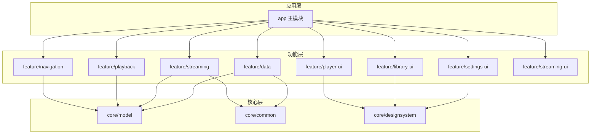
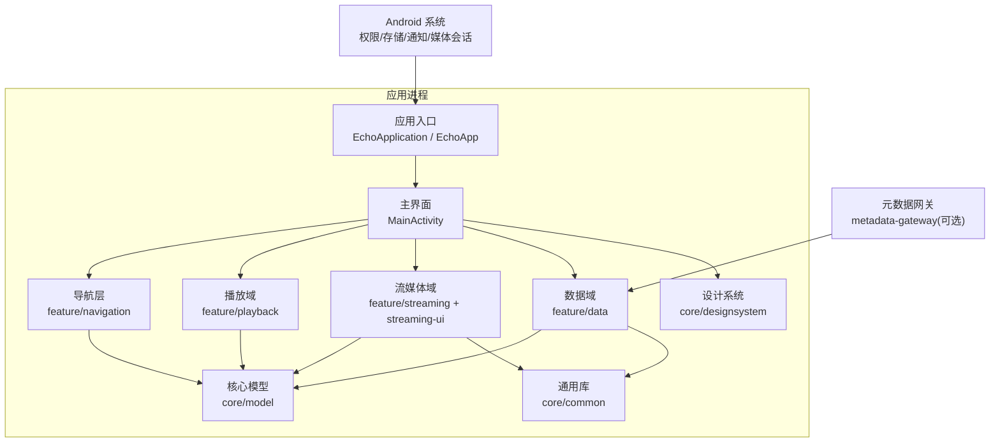
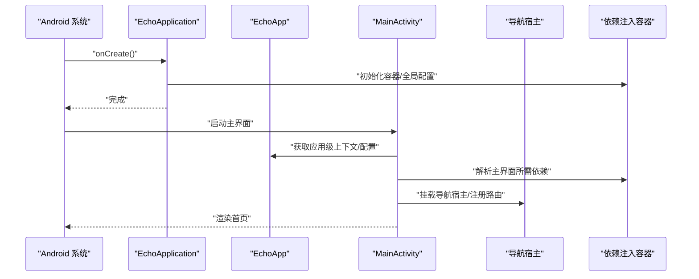
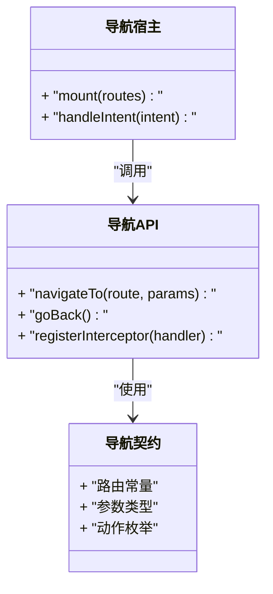
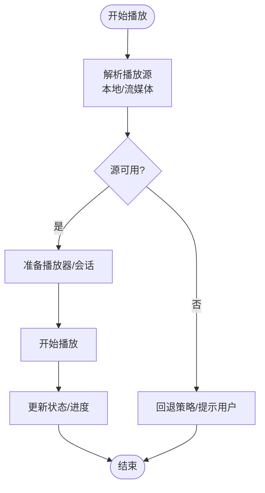
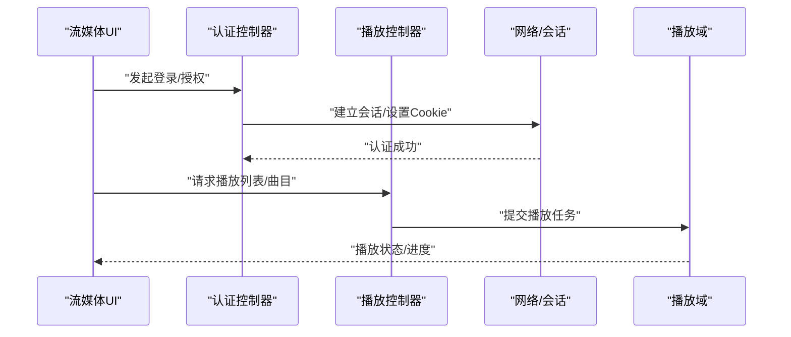
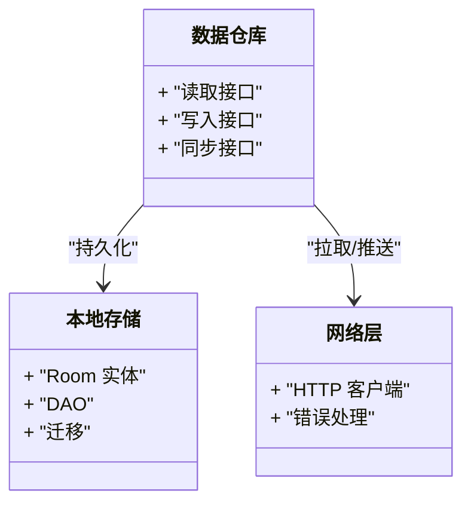
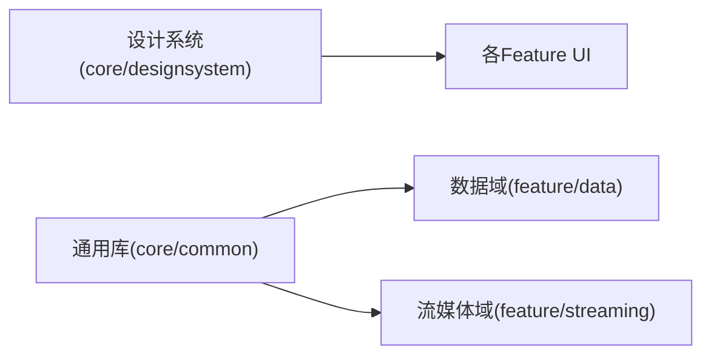
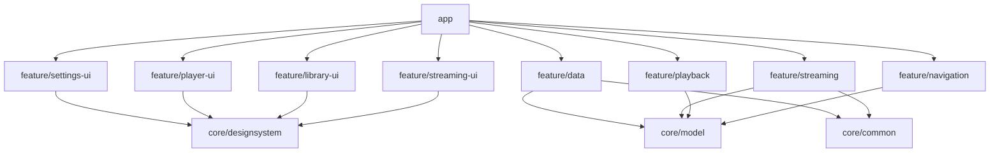

# 整体架构概览

<cite>
**本文引用的文件**   
- [README.md](file://README.md)
- [build.gradle](file://build.gradle)
- [settings.gradle](file://settings.gradle)
- [app/src/main/AndroidManifest.xml](file://app/src/main/AndroidManifest.xml)
- [app/src/main/java/app/yukine/EchoApp.kt](file://app/src/main/java/app/yukine/EchoApp.kt)
- [app/src/main/java/app/yukine/EchoApplication.kt](file://app/src/main/java/app/yukine/EchoApplication.kt)
- [app/src/main/java/app/yukine/MainActivity.kt](file://app/src/main/java/app/yukine/MainActivity.kt)
- [app/src/main/java/app/yukine/MainActivityComposition.kt](file://app/src/main/java/app/yukine/MainActivityComposition.kt)
- [app/src/main/java/app/yukine/MainActivityDependencies.kt](file://app/src/main/java/app/yukine/MainActivityDependencies.kt)
- [app/src/main/java/app/yukine/MainNavHostMount.kt](file://app/src/main/java/app/yukine/MainNavHostMount.kt)
- [core/model/build.gradle](file://core/model/build.gradle)
- [core/common/build.gradle](file://core/common/build.gradle)
- [core/designsystem/build.gradle](file://core/designsystem/build.gradle)
- [feature/data/build.gradle](file://feature/data/build.gradle)
- [feature/navigation/build.gradle](file://feature/navigation/build.gradle)
- [feature/playback/build.gradle](file://feature/playback/build.gradle)
- [feature/player-ui/build.gradle](file://feature/player-ui/build.gradle)
- [feature/library-ui/build.gradle](file://feature/library-ui/build.gradle)
- [feature/settings-ui/build.gradle](file://feature/settings-ui/build.gradle)
- [feature/streaming/build.gradle](file://feature/streaming/build.gradle)
- [feature/streaming-ui/build.gradle](file://feature/streaming-ui/build.gradle)
</cite>

## 目录
1. [简介](#简介)
2. [项目结构](#项目结构)
3. [核心组件](#核心组件)
4. [架构总览](#架构总览)
5. [详细组件分析](#详细组件分析)
6. [依赖关系分析](#依赖关系分析)
7. [性能与可维护性考量](#性能与可维护性考量)
8. [故障排查指南](#故障排查指南)
9. [结论](#结论)
10. [附录](#附录)

## 简介
本文件为 Echo Android 应用的整体架构概览，面向希望快速理解系统全貌的开发者。文档聚焦以下目标：
- 高层架构设计：模块化、分层原则、核心设计模式
- 入口点初始化流程：EchoApp、MainActivity 如何装配并启动各模块
- 模块职责边界与交互：app 主模块、core 核心模块、feature 功能模块
- 技术栈选择与权衡：为何采用这些技术与模式
- 图示说明：系统上下文图与模块依赖关系图

## 项目结构
仓库采用多模块结构，按“核心能力下沉、业务特性上移”的原则组织：
- core 层：提供跨模块复用的模型、通用工具与设计系统
- feature 层：按领域拆分的功能模块（数据、导航、播放、UI 等）
- app 层：应用装配与组合、入口 Activity、平台适配与系统集成

图表来源
- [settings.gradle](file://settings.gradle)
- [app/src/main/AndroidManifest.xml](file://app/src/main/AndroidManifest.xml)
- [core/model/build.gradle](file://core/model/build.gradle)
- [core/common/build.gradle](file://core/common/build.gradle)
- [core/designsystem/build.gradle](file://core/designsystem/build.gradle)
- [feature/data/build.gradle](file://feature/data/build.gradle)
- [feature/navigation/build.gradle](file://feature/navigation/build.gradle)
- [feature/playback/build.gradle](file://feature/playback/build.gradle)
- [feature/player-ui/build.gradle](file://feature/player-ui/build.gradle)
- [feature/library-ui/build.gradle](file://feature/library-ui/build.gradle)
- [feature/settings-ui/build.gradle](file://feature/settings-ui/build.gradle)
- [feature/streaming/build.gradle](file://feature/streaming/build.gradle)
- [feature/streaming-ui/build.gradle](file://feature/streaming-ui/build.gradle)

章节来源
- [README.md](file://README.md)
- [build.gradle](file://build.gradle)
- [settings.gradle](file://settings.gradle)

## 核心组件
- 应用入口与生命周期
  - 应用进程级初始化：在 Application 子类中完成全局配置与依赖注入容器准备
  - 主界面入口：Activity 负责 UI 壳、导航宿主挂载与参数装配
- 导航与路由
  - 统一的导航契约与路由表，集中管理页面跳转与参数传递
- 播放域
  - 播放状态机、队列、媒体会话、后台服务桥接、播放源解析与策略
- 流媒体域
  - 流式播放、认证、Cookie 管理、播放质量策略、任务调度
- 数据域
  - Room 数据库、本地缓存、网络访问封装、同步与迁移
- 设计系统与通用库
  - 主题、样式、基础控件与通用工具类

章节来源
- [app/src/main/java/app/yukine/EchoApp.kt](file://app/src/main/java/app/yukine/EchoApp.kt)
- [app/src/main/java/app/yukine/EchoApplication.kt](file://app/src/main/java/app/yukine/EchoApplication.kt)
- [app/src/main/java/app/yukine/MainActivity.kt](file://app/src/main/java/app/yukine/MainActivity.kt)
- [app/src/main/java/app/yukine/MainActivityComposition.kt](file://app/src/main/java/app/yukine/MainActivityComposition.kt)
- [app/src/main/java/app/yukine/MainActivityDependencies.kt](file://app/src/main/java/app/yukine/MainActivityDependencies.kt)
- [app/src/main/java/app/yukine/MainNavHostMount.kt](file://app/src/main/java/app/yukine/MainNavHostMount.kt)

## 架构总览
下图展示从系统到应用的上下文关系，以及应用内部的分层与模块边界。

图表来源
- [app/src/main/AndroidManifest.xml](file://app/src/main/AndroidManifest.xml)
- [app/src/main/java/app/yukine/EchoApplication.kt](file://app/src/main/java/app/yukine/EchoApplication.kt)
- [app/src/main/java/app/yukine/EchoApp.kt](file://app/src/main/java/app/yukine/EchoApp.kt)
- [app/src/main/java/app/yukine/MainActivity.kt](file://app/src/main/java/app/yukine/MainActivity.kt)
- [feature/navigation/build.gradle](file://feature/navigation/build.gradle)
- [feature/playback/build.gradle](file://feature/playback/build.gradle)
- [feature/streaming/build.gradle](file://feature/streaming/build.gradle)
- [feature/streaming-ui/build.gradle](file://feature/streaming-ui/build.gradle)
- [feature/data/build.gradle](file://feature/data/build.gradle)
- [core/model/build.gradle](file://core/model/build.gradle)
- [core/common/build.gradle](file://core/common/build.gradle)
- [core/designsystem/build.gradle](file://core/designsystem/build.gradle)

## 详细组件分析

### 应用入口与初始化流程
- 进程启动阶段
  - Application 子类执行全局初始化：日志、崩溃收集、依赖注入容器、线程池、首屏必要配置
- 主界面启动阶段
  - MainActivity 作为 UI 壳，挂载导航宿主、组装 ViewModel 与依赖、处理返回键与横竖屏策略
- 关键装配点
  - 依赖注入与工厂：集中声明模块依赖，避免循环依赖
  - 导航宿主挂载：将 feature/navigation 的路由表注入到宿主
  - 播放与流媒体桥接：向播放域与流媒体域暴露必要的运行时上下文

图表来源
- [app/src/main/java/app/yukine/EchoApplication.kt](file://app/src/main/java/app/yukine/EchoApplication.kt)
- [app/src/main/java/app/yukine/EchoApp.kt](file://app/src/main/java/app/yukine/EchoApp.kt)
- [app/src/main/java/app/yukine/MainActivity.kt](file://app/src/main/java/app/yukine/MainActivity.kt)
- [app/src/main/java/app/yukine/MainActivityComposition.kt](file://app/src/main/java/app/yukine/MainActivityComposition.kt)
- [app/src/main/java/app/yukine/MainActivityDependencies.kt](file://app/src/main/java/app/yukine/MainActivityDependencies.kt)
- [app/src/main/java/app/yukine/MainNavHostMount.kt](file://app/src/main/java/app/yukine/MainNavHostMount.kt)

章节来源
- [app/src/main/java/app/yukine/EchoApplication.kt](file://app/src/main/java/app/yukine/EchoApplication.kt)
- [app/src/main/java/app/yukine/EchoApp.kt](file://app/src/main/java/app/yukine/EchoApp.kt)
- [app/src/main/java/app/yukine/MainActivity.kt](file://app/src/main/java/app/yukine/MainActivity.kt)
- [app/src/main/java/app/yukine/MainActivityComposition.kt](file://app/src/main/java/app/yukine/MainActivityComposition.kt)
- [app/src/main/java/app/yukine/MainActivityDependencies.kt](file://app/src/main/java/app/yukine/MainActivityDependencies.kt)
- [app/src/main/java/app/yukine/MainNavHostMount.kt](file://app/src/main/java/app/yukine/MainNavHostMount.kt)

### 导航与路由模块
- 职责边界
  - 定义路由常量、页面参数契约、导航动作与拦截器
  - 提供统一的导航 API，屏蔽底层实现差异
- 交互关系
  - 被 app 与多个 feature 模块消费，不反向依赖具体业务实现
- 设计要点
  - 路由表集中管理，便于静态分析与测试
  - 通过依赖注入注入到导航宿主，避免硬编码耦合

图表来源
- [feature/navigation/build.gradle](file://feature/navigation/build.gradle)
- [app/src/main/java/app/yukine/MainNavHostMount.kt](file://app/src/main/java/app/yukine/MainNavHostMount.kt)

章节来源
- [feature/navigation/build.gradle](file://feature/navigation/build.gradle)
- [app/src/main/java/app/yukine/MainNavHostMount.kt](file://app/src/main/java/app/yukine/MainNavHostMount.kt)

### 播放域（Playback）
- 职责边界
  - 播放状态机、队列管理、媒体会话、播放源解析与切换、效果与均衡器
- 交互关系
  - 依赖 core/model 的数据模型；与 feature/streaming 协作以支持在线播放
- 设计要点
  - 状态驱动 UI，事件总线或响应式流更新播放进度与状态
  - 策略模式用于不同播放源与解码路径

图表来源
- [feature/playback/build.gradle](file://feature/playback/build.gradle)
- [core/model/build.gradle](file://core/model/build.gradle)

章节来源
- [feature/playback/build.gradle](file://feature/playback/build.gradle)
- [core/model/build.gradle](file://core/model/build.gradle)

### 流媒体域（Streaming）
- 职责边界
  - 流式播放、认证与 Cookie 管理、播放质量策略、任务调度、播放监听
- 交互关系
  - 依赖 core/model 与 core/common；与 playback 协作完成实际音频输出
- 设计要点
  - 认证回调与手动 Cookie 输入流程解耦
  - 任务调度与重试机制保证稳定性

图表来源
- [feature/streaming/build.gradle](file://feature/streaming/build.gradle)
- [feature/streaming-ui/build.gradle](file://feature/streaming-ui/build.gradle)
- [core/common/build.gradle](file://core/common/build.gradle)
- [feature/playback/build.gradle](file://feature/playback/build.gradle)

章节来源
- [feature/streaming/build.gradle](file://feature/streaming/build.gradle)
- [feature/streaming-ui/build.gradle](file://feature/streaming-ui/build.gradle)
- [core/common/build.gradle](file://core/common/build.gradle)
- [feature/playback/build.gradle](file://feature/playback/build.gradle)

### 数据域（Data）
- 职责边界
  - 本地持久化（Room）、缓存、网络访问封装、同步与迁移
- 交互关系
  - 依赖 core/model 与 core/common；被上层 feature 消费
- 设计要点
  - Repository 抽象统一数据源；迁移脚本集中管理
  - 读写分离与缓存策略提升体验

图表来源
- [feature/data/build.gradle](file://feature/data/build.gradle)
- [core/model/build.gradle](file://core/model/build.gradle)
- [core/common/build.gradle](file://core/common/build.gradle)

章节来源
- [feature/data/build.gradle](file://feature/data/build.gradle)
- [core/model/build.gradle](file://core/model/build.gradle)
- [core/common/build.gradle](file://core/common/build.gradle)

### 设计系统与通用库
- 设计系统（Design System）
  - 主题、颜色、字体、基础组件，确保一致的用户体验
- 通用库（Common）
  - 工具函数、扩展、跨模块共享的基础能力

图表来源
- [core/designsystem/build.gradle](file://core/designsystem/build.gradle)
- [core/common/build.gradle](file://core/common/build.gradle)
- [feature/player-ui/build.gradle](file://feature/player-ui/build.gradle)
- [feature/library-ui/build.gradle](file://feature/library-ui/build.gradle)
- [feature/settings-ui/build.gradle](file://feature/settings-ui/build.gradle)
- [feature/streaming-ui/build.gradle](file://feature/streaming-ui/build.gradle)
- [feature/data/build.gradle](file://feature/data/build.gradle)
- [feature/streaming/build.gradle](file://feature/streaming/build.gradle)

章节来源
- [core/designsystem/build.gradle](file://core/designsystem/build.gradle)
- [core/common/build.gradle](file://core/common/build.gradle)
- [feature/player-ui/build.gradle](file://feature/player-ui/build.gradle)
- [feature/library-ui/build.gradle](file://feature/library-ui/build.gradle)
- [feature/settings-ui/build.gradle](file://feature/settings-ui/build.gradle)
- [feature/streaming-ui/build.gradle](file://feature/streaming-ui/build.gradle)
- [feature/data/build.gradle](file://feature/data/build.gradle)
- [feature/streaming/build.gradle](file://feature/streaming/build.gradle)

## 依赖关系分析
- 依赖方向
  - app 仅依赖 feature 与 core，不直接依赖第三方框架细节
  - feature 之间尽量通过 core 提供的模型与接口通信，减少横向耦合
  - core 不依赖任何 feature，保持纯能力下沉
- 可能的风险
  - 若 feature 间存在隐式耦合（如通过全局单例），需引入显式接口与依赖注入
  - 大型 feature 内部应继续拆分为子模块，控制编译时依赖

图表来源
- [settings.gradle](file://settings.gradle)
- [feature/navigation/build.gradle](file://feature/navigation/build.gradle)
- [feature/playback/build.gradle](file://feature/playback/build.gradle)
- [feature/streaming/build.gradle](file://feature/streaming/build.gradle)
- [feature/streaming-ui/build.gradle](file://feature/streaming-ui/build.gradle)
- [feature/library-ui/build.gradle](file://feature/library-ui/build.gradle)
- [feature/player-ui/build.gradle](file://feature/player-ui/build.gradle)
- [feature/settings-ui/build.gradle](file://feature/settings-ui/build.gradle)
- [feature/data/build.gradle](file://feature/data/build.gradle)
- [core/model/build.gradle](file://core/model/build.gradle)
- [core/common/build.gradle](file://core/common/build.gradle)
- [core/designsystem/build.gradle](file://core/designsystem/build.gradle)

章节来源
- [settings.gradle](file://settings.gradle)
- [build.gradle](file://build.gradle)

## 性能与可维护性考量
- 构建与编译
  - 多模块降低增量编译时间；按需启用 R8/ProGuard 规则
- 内存与资源
  - 图片与媒体资源走设计系统缓存策略；避免在 UI 线程做 IO
- 播放体验
  - 预缓冲与自适应码率；后台播放与锁屏控制
- 可测试性
  - 通过依赖注入替换真实实现；单元测试覆盖核心逻辑

[本节为通用指导，无需代码来源]

## 故障排查指南
- 启动失败
  - 检查 Application 初始化顺序与依赖注入容器是否就绪
  - 确认 Manifest 中入口 Activity 与权限声明
- 导航异常
  - 核对路由表与参数契约；检查拦截器是否抛出未捕获异常
- 播放问题
  - 区分本地与流媒体路径；查看媒体会话状态与权限
- 数据不一致
  - 检查 Room 迁移脚本版本与 DAO 变更；确认缓存失效策略

章节来源
- [app/src/main/AndroidManifest.xml](file://app/src/main/AndroidManifest.xml)
- [app/src/main/java/app/yukine/EchoApplication.kt](file://app/src/main/java/app/yukine/EchoApplication.kt)
- [app/src/main/java/app/yukine/MainActivity.kt](file://app/src/main/java/app/yukine/MainActivity.kt)
- [app/src/main/java/app/yukine/MainNavHostMount.kt](file://app/src/main/java/app/yukine/MainNavHostMount.kt)

## 结论
Echo Android 采用清晰的多模块分层架构：core 提供稳定能力，feature 按领域拆分，app 负责装配与集成。通过依赖注入与导航契约，模块间耦合度低、可测试性强。该架构兼顾可扩展性与可维护性，适合持续演进的大型音乐应用。

[本节为总结性内容，无需代码来源]

## 附录
- 技术栈选择与权衡
  - Kotlin 为主语言：类型安全与协程简化异步
  - Jetpack Compose/Material：现代化 UI 与一致性设计
  - Room + DataStore：本地持久化与轻量配置
  - 依赖注入：提高可测试性与解耦
- 参考文档
  - 仓库根 README 与架构文档可作为补充阅读

章节来源
- [README.md](file://README.md)