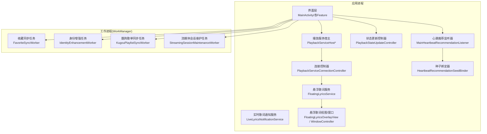
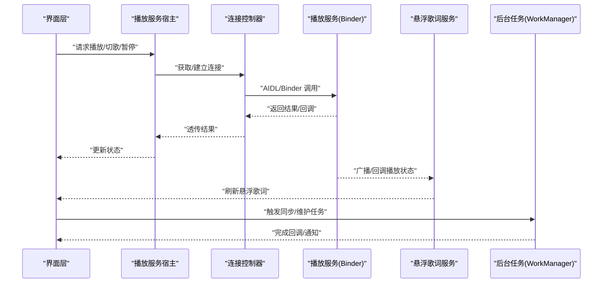
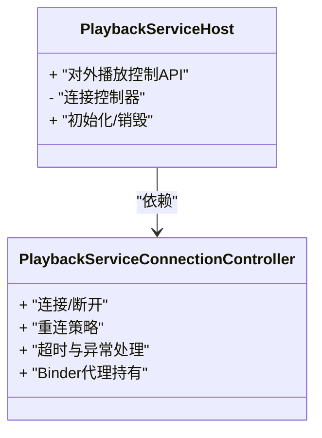
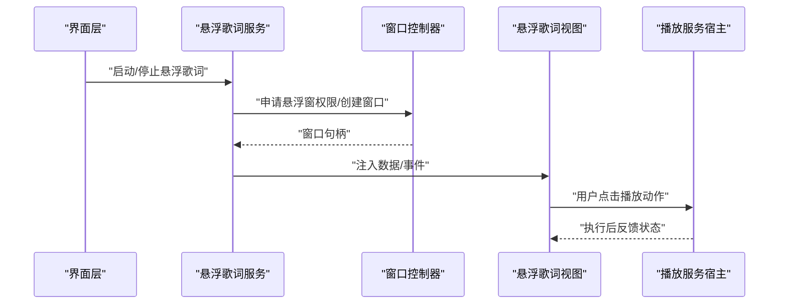
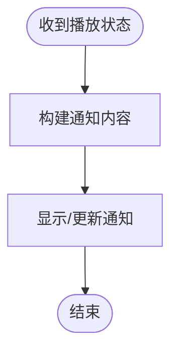
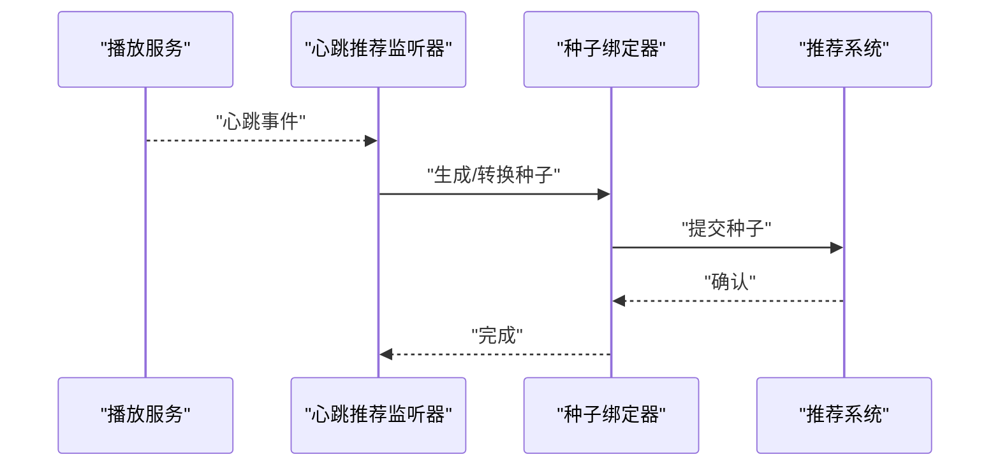
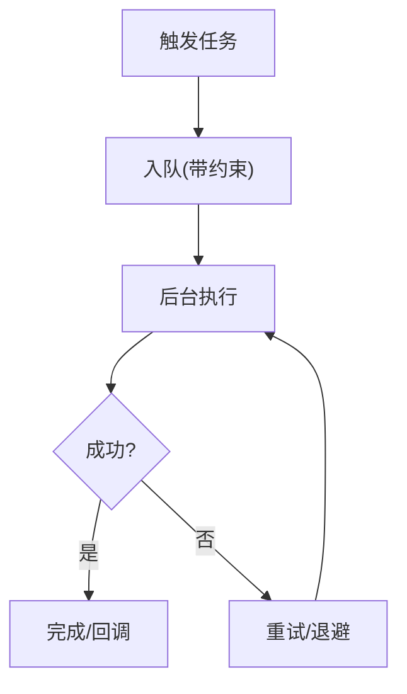
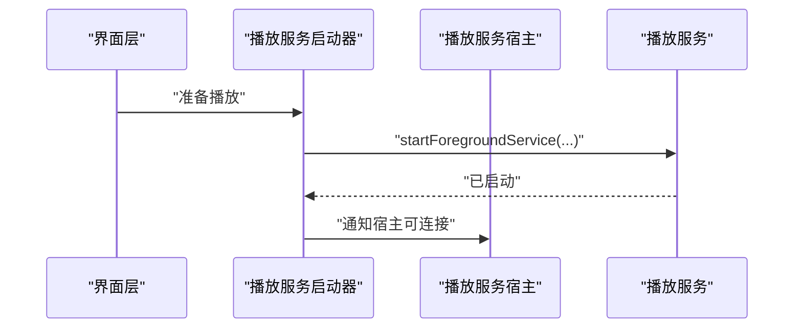
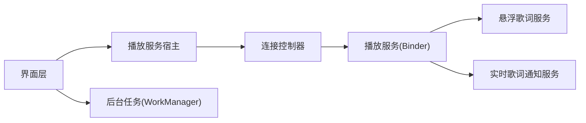

# 服务间通信

<cite>
**本文引用的文件**   
- [AndroidManifest.xml](file://app/src/main/AndroidManifest.xml)
- [PlaybackServiceHost.kt](file://app/src/main/java/app/yukine/MainPlaybackServiceHost.kt)
- [PlaybackServiceConnectionController.kt](file://app/src/main/java/app/yukine/PlaybackServiceConnectionController.kt)
- [PlaybackServiceHostController.kt](file://app/src/main/java/app/yukine/PlaybackServiceHostController.kt)
- [PlaybackServiceHostPort.kt](file://app/src/main/java/app/yukine/PlaybackServiceHostPort.kt)
- [PlaybackStateUpdateController.kt](file://app/src/main/java/app/yukine/PlaybackStateUpdateController.kt)
- [FloatingLyricsService.kt](file://app/src/main/java/app/yukine/FloatingLyricsService.kt)
- [FloatingLyricsOverlayView.kt](file://app/src/main/java/app/yukine/FloatingLyricsOverlayView.kt)
- [FloatingLyricsWindowController.kt](file://app/src/main/java/app/yukine/FloatingLyricsWindowController.kt)
- [FloatingLyricsPlaybackActionMapper.kt](file://app/src/main/java/app/yukine/FloatingLyricsPlaybackActionMapper.kt)
- [LiveLyricsNotificationService.kt](file://app/src/main/java/app/yukine/LiveLyricsNotificationService.kt)
- [NowPlayingPlaybackServiceStarter.kt](file://app/src/main/java/app/yukine/NowPlayingPlaybackServiceStarter.kt)
- [MainHeartbeatRecommendationListener.kt](file://app/src/main/java/app/yukine/MainHeartbeatRecommendationListener.kt)
- [HeartbeatRecommendationSeedBinder.kt](file://app/src/main/java/app/yukine/HeartbeatRecommendationSeedBinder.kt)
- [StreamingPlaybackTaskScheduler.java](file://app/src/main/java/app/yukine/StreamingPlaybackTaskScheduler.java)
- [FavoriteSyncWorker.kt](file://app/src/main/java/app/yukine/FavoriteSyncWorker.kt)
- [IdentityEnhancementWorker.kt](file://app/src/main/java/app/yukine/IdentityEnhancementWorker.kt)
- [KugouPlaylistSyncWorker.kt](file://app/src/main/java/app/yukine/KugouPlaylistSyncWorker.kt)
- [StreamingSessionMaintenanceWorker.kt](file://app/src/main/java/app/yukine/StreamingSessionMaintenanceWorker.kt)
</cite>

## 目录
1. [简介](#简介)
2. [项目结构](#项目结构)
3. [核心组件](#核心组件)
4. [架构总览](#架构总览)
5. [详细组件分析](#详细组件分析)
6. [依赖关系分析](#依赖关系分析)
7. [性能考虑](#性能考虑)
8. [故障排查指南](#故障排查指南)
9. [结论](#结论)
10. [附录](#附录)

## 简介
本文件聚焦于 Echo Android 应用中的“服务间通信”机制，围绕播放控制、悬浮歌词、后台任务等关键场景，系统梳理以下通信方式与最佳实践：
- AIDL/Binder 接口定义与跨进程调用
- Intent 启动与参数传递（含前台服务）
- 广播消息用于解耦事件分发
- 生命周期管理与资源清理策略
- 安全、性能与错误处理的关键点

目标读者包括需要实现复杂服务协作的开发者与维护者。

## 项目结构
从模块划分看，播放与悬浮歌词相关逻辑集中在 app 主模块中，后台任务通过 WorkManager 在独立进程中执行；部分宿主与连接控制器位于 app 层，负责桥接 UI 与底层服务。

图表来源
- [PlaybackServiceHost.kt](file://app/src/main/java/app/yukine/MainPlaybackServiceHost.kt)
- [PlaybackServiceConnectionController.kt](file://app/src/main/java/app/yukine/PlaybackServiceConnectionController.kt)
- [PlaybackStateUpdateController.kt](file://app/src/main/java/app/yukine/PlaybackStateUpdateController.kt)
- [FloatingLyricsService.kt](file://app/src/main/java/app/yukine/FloatingLyricsService.kt)
- [FloatingLyricsOverlayView.kt](file://app/src/main/java/app/yukine/FloatingLyricsOverlayView.kt)
- [FloatingLyricsWindowController.kt](file://app/src/main/java/app/yukine/FloatingLyricsWindowController.kt)
- [LiveLyricsNotificationService.kt](file://app/src/main/java/app/yukine/LiveLyricsNotificationService.kt)
- [MainHeartbeatRecommendationListener.kt](file://app/src/main/java/app/yukine/MainHeartbeatRecommendationListener.kt)
- [HeartbeatRecommendationSeedBinder.kt](file://app/src/main/java/app/yukine/HeartbeatRecommendationSeedBinder.kt)
- [FavoriteSyncWorker.kt](file://app/src/main/java/app/yukine/FavoriteSyncWorker.kt)
- [IdentityEnhancementWorker.kt](file://app/src/main/java/app/yukine/IdentityEnhancementWorker.kt)
- [KugouPlaylistSyncWorker.kt](file://app/src/main/java/app/yukine/KugouPlaylistSyncWorker.kt)
- [StreamingSessionMaintenanceWorker.kt](file://app/src/main/java/app/yukine/StreamingSessionMaintenanceWorker.kt)

章节来源
- [AndroidManifest.xml](file://app/src/main/AndroidManifest.xml)

## 核心组件
- 播放服务宿主与连接控制器：负责发现、绑定并管理播放服务的 Binder 通道，统一封装跨进程调用入口。
- 悬浮歌词服务：以独立服务承载悬浮窗与歌词渲染，接收来自播放侧的状态与动作指令。
- 实时歌词通知服务：提供通知栏歌词展示与交互能力。
- 心跳推荐监听器与种子绑定器：将播放端的心跳事件转化为推荐种子，供推荐系统消费。
- 后台任务（WorkManager）：在独立进程中执行收藏同步、身份增强、歌单同步与会话维护等耗时操作。

章节来源
- [PlaybackServiceHost.kt](file://app/src/main/java/app/yukine/MainPlaybackServiceHost.kt)
- [PlaybackServiceConnectionController.kt](file://app/src/main/java/app/yukine/PlaybackServiceConnectionController.kt)
- [FloatingLyricsService.kt](file://app/src/main/java/app/yukine/FloatingLyricsService.kt)
- [LiveLyricsNotificationService.kt](file://app/src/main/java/app/yukine/LiveLyricsNotificationService.kt)
- [MainHeartbeatRecommendationListener.kt](file://app/src/main/java/app/yukine/MainHeartbeatRecommendationListener.kt)
- [HeartbeatRecommendationSeedBinder.kt](file://app/src/main/java/app/yukine/HeartbeatRecommendationSeedBinder.kt)
- [FavoriteSyncWorker.kt](file://app/src/main/java/app/yukine/FavoriteSyncWorker.kt)
- [IdentityEnhancementWorker.kt](file://app/src/main/java/app/yukine/IdentityEnhancementWorker.kt)
- [KugouPlaylistSyncWorker.kt](file://app/src/main/java/app/yukine/KugouPlaylistSyncWorker.kt)
- [StreamingSessionMaintenanceWorker.kt](file://app/src/main/java/app/yukine/StreamingSessionMaintenanceWorker.kt)

## 架构总览
整体采用“UI 层 -> 宿主/控制器 -> 服务/任务”的分层模式：
- UI 层通过宿主与连接控制器发起跨进程调用或启动服务。
- 播放服务暴露 Binder/AIDL 接口，供宿主转发调用。
- 悬浮歌词服务订阅播放状态变更，驱动悬浮窗与通知更新。
- 后台任务通过 WorkManager 调度，避免阻塞主线程与服务。

图表来源
- [PlaybackServiceHost.kt](file://app/src/main/java/app/yukine/MainPlaybackServiceHost.kt)
- [PlaybackServiceConnectionController.kt](file://app/src/main/java/app/yukine/PlaybackServiceConnectionController.kt)
- [FloatingLyricsService.kt](file://app/src/main/java/app/yukine/FloatingLyricsService.kt)
- [FavoriteSyncWorker.kt](file://app/src/main/java/app/yukine/FavoriteSyncWorker.kt)

## 详细组件分析

### 播放服务宿主与连接控制器
职责与交互
- 宿主负责对外暴露统一的播放控制 API，内部委托给连接控制器进行连接管理。
- 连接控制器负责 ServiceConnection 的生命周期、重连、异常恢复与超时处理。
- 典型流程：UI 发起控制 -> 宿主校验/缓存 -> 连接控制器确保连接 -> 通过 Binder 调用播放服务 -> 回写状态。

图表来源
- [PlaybackServiceHost.kt](file://app/src/main/java/app/yukine/MainPlaybackServiceHost.kt)
- [PlaybackServiceConnectionController.kt](file://app/src/main/java/app/yukine/PlaybackServiceConnectionController.kt)

章节来源
- [PlaybackServiceHost.kt](file://app/src/main/java/app/yukine/MainPlaybackServiceHost.kt)
- [PlaybackServiceConnectionController.kt](file://app/src/main/java/app/yukine/PlaybackServiceConnectionController.kt)

### 悬浮歌词服务与窗口
职责与交互
- 悬浮歌词服务作为独立服务运行，负责悬浮窗创建、显示与销毁，以及播放状态监听。
- 窗口控制器管理窗口权限、层级与可见性；视图负责歌词绘制与手势交互。
- 播放动作映射器将悬浮窗上的点击转换为标准播放动作，再经宿主转发至播放服务。

图表来源
- [FloatingLyricsService.kt](file://app/src/main/java/app/yukine/FloatingLyricsService.kt)
- [FloatingLyricsWindowController.kt](file://app/src/main/java/app/yukine/FloatingLyricsWindowController.kt)
- [FloatingLyricsOverlayView.kt](file://app/src/main/java/app/yukine/FloatingLyricsOverlayView.kt)
- [FloatingLyricsPlaybackActionMapper.kt](file://app/src/main/java/app/yukine/FloatingLyricsPlaybackActionMapper.kt)
- [PlaybackServiceHost.kt](file://app/src/main/java/app/yukine/MainPlaybackServiceHost.kt)

章节来源
- [FloatingLyricsService.kt](file://app/src/main/java/app/yukine/FloatingLyricsService.kt)
- [FloatingLyricsWindowController.kt](file://app/src/main/java/app/yukine/FloatingLyricsWindowController.kt)
- [FloatingLyricsOverlayView.kt](file://app/src/main/java/app/yukine/FloatingLyricsOverlayView.kt)
- [FloatingLyricsPlaybackActionMapper.kt](file://app/src/main/java/app/yukine/FloatingLyricsPlaybackActionMapper.kt)

### 实时歌词通知服务
职责与交互
- 提供通知栏歌词展示与基础交互（如上一首/下一首）。
- 与播放服务保持松耦合，通常通过广播或轻量回调更新内容。

图表来源
- [LiveLyricsNotificationService.kt](file://app/src/main/java/app/yukine/LiveLyricsNotificationService.kt)

章节来源
- [LiveLyricsNotificationService.kt](file://app/src/main/java/app/yukine/LiveLyricsNotificationService.kt)

### 心跳推荐与种子绑定
职责与交互
- 心跳监听器收集播放端的心跳事件（如开始/暂停/切歌），将其转化为推荐种子。
- 种子绑定器负责将种子传递给推荐子系统，供后续个性化推荐使用。

图表来源
- [MainHeartbeatRecommendationListener.kt](file://app/src/main/java/app/yukine/MainHeartbeatRecommendationListener.kt)
- [HeartbeatRecommendationSeedBinder.kt](file://app/src/main/java/app/yukine/HeartbeatRecommendationSeedBinder.kt)

章节来源
- [MainHeartbeatRecommendationListener.kt](file://app/src/main/java/app/yukine/MainHeartbeatRecommendationListener.kt)
- [HeartbeatRecommendationSeedBinder.kt](file://app/src/main/java/app/yukine/HeartbeatRecommendationSeedBinder.kt)

### 后台任务（WorkManager）
职责与交互
- 收藏同步、身份增强、歌单同步与会话维护等任务在独立进程中执行，避免影响前台体验。
- 任务可配置重试、退避策略与约束条件（网络、电量等）。

图表来源
- [FavoriteSyncWorker.kt](file://app/src/main/java/app/yukine/FavoriteSyncWorker.kt)
- [IdentityEnhancementWorker.kt](file://app/src/main/java/app/yukine/IdentityEnhancementWorker.kt)
- [KugouPlaylistSyncWorker.kt](file://app/src/main/java/app/yukine/KugouPlaylistSyncWorker.kt)
- [StreamingSessionMaintenanceWorker.kt](file://app/src/main/java/app/yukine/StreamingSessionMaintenanceWorker.kt)

章节来源
- [FavoriteSyncWorker.kt](file://app/src/main/java/app/yukine/FavoriteSyncWorker.kt)
- [IdentityEnhancementWorker.kt](file://app/src/main/java/app/yukine/IdentityEnhancementWorker.kt)
- [KugouPlaylistSyncWorker.kt](file://app/src/main/java/app/yukine/KugouPlaylistSyncWorker.kt)
- [StreamingSessionMaintenanceWorker.kt](file://app/src/main/java/app/yukine/StreamingSessionMaintenanceWorker.kt)

### 播放服务启动器
职责与交互
- 负责根据当前场景启动或唤醒播放服务，确保前台服务可用。
- 与宿主协同，保证服务生命周期与 UI 行为一致。

图表来源
- [NowPlayingPlaybackServiceStarter.kt](file://app/src/main/java/app/yukine/NowPlayingPlaybackServiceStarter.kt)
- [PlaybackServiceHost.kt](file://app/src/main/java/app/yukine/MainPlaybackServiceHost.kt)

章节来源
- [NowPlayingPlaybackServiceStarter.kt](file://app/src/main/java/app/yukine/NowPlayingPlaybackServiceStarter.kt)
- [PlaybackServiceHost.kt](file://app/src/main/java/app/yukine/MainPlaybackServiceHost.kt)

## 依赖关系分析
- 低耦合：UI 不直接依赖具体服务实现，而是通过宿主与控制器访问。
- 明确边界：悬浮歌词与通知服务各自承担展示职责，通过事件/广播与播放侧解耦。
- 异步化：后台任务由 WorkManager 统一管理，避免在主线程或服务中执行耗时操作。

图表来源
- [PlaybackServiceHost.kt](file://app/src/main/java/app/yukine/MainPlaybackServiceHost.kt)
- [PlaybackServiceConnectionController.kt](file://app/src/main/java/app/yukine/PlaybackServiceConnectionController.kt)
- [FloatingLyricsService.kt](file://app/src/main/java/app/yukine/FloatingLyricsService.kt)
- [LiveLyricsNotificationService.kt](file://app/src/main/java/app/yukine/LiveLyricsNotificationService.kt)
- [FavoriteSyncWorker.kt](file://app/src/main/java/app/yukine/FavoriteSyncWorker.kt)

章节来源
- [PlaybackServiceHost.kt](file://app/src/main/java/app/yukine/MainPlaybackServiceHost.kt)
- [PlaybackServiceConnectionController.kt](file://app/src/main/java/app/yukine/PlaybackServiceConnectionController.kt)
- [FloatingLyricsService.kt](file://app/src/main/java/app/yukine/FloatingLyricsService.kt)
- [LiveLyricsNotificationService.kt](file://app/src/main/java/app/yukine/LiveLyricsNotificationService.kt)
- [FavoriteSyncWorker.kt](file://app/src/main/java/app/yukine/FavoriteSyncWorker.kt)

## 性能考虑
- 连接复用与重连：连接控制器应缓存 Binder 代理，失败时指数退避重试，避免频繁重建连接。
- 批量与节流：状态更新与悬浮歌词渲染需合并高频事件，减少跨进程与 UI 开销。
- 前台服务保活：播放服务使用前台通知降低被杀风险，同时避免过度占用资源。
- 后台任务批量化：将小任务聚合，合理设置约束与退避策略，降低系统唤醒次数。
- 内存与对象复用：跨进程传输的数据尽量精简，避免大对象序列化带来的 GC 压力。

[本节为通用指导，无需源码引用]

## 故障排查指南
常见问题与定位要点
- 连接失败/超时：检查连接控制器的重连策略、Binder 代理是否有效、服务是否存活。
- 悬浮窗不可见：确认悬浮窗权限、窗口层级与可见性状态；核对窗口控制器与视图的创建顺序。
- 通知未更新：核查广播/回调路径是否正确，通知渠道与权限是否配置。
- 任务未执行：查看 WorkManager 日志、约束条件是否满足、重试与退避策略是否过于保守。
- 崩溃与 ANR：避免在服务主线程执行 IO 或复杂计算；对跨进程调用增加超时与异常捕获。

章节来源
- [PlaybackServiceConnectionController.kt](file://app/src/main/java/app/yukine/PlaybackServiceConnectionController.kt)
- [FloatingLyricsWindowController.kt](file://app/src/main/java/app/yukine/FloatingLyricsWindowController.kt)
- [LiveLyricsNotificationService.kt](file://app/src/main/java/app/yukine/LiveLyricsNotificationService.kt)
- [FavoriteSyncWorker.kt](file://app/src/main/java/app/yukine/FavoriteSyncWorker.kt)

## 结论
Echo 的服务间通信以“宿主+连接控制器”为核心，结合悬浮歌词服务、通知服务与后台任务，形成清晰的分层与解耦。通过 Binder/AIDL、Intent 与广播的组合，既保证了跨进程调用的可靠性，又兼顾了扩展性与可维护性。遵循本文的生命周期管理、安全与性能建议，可有效提升复杂服务协作的稳定性与用户体验。

[本节为总结性内容，无需源码引用]

## 附录

### 通信方式清单与适用场景
- AIDL/Binder：适合高频、强类型、低延迟的跨进程方法调用（如播放控制、状态查询）。
- Intent：适合一次性启动服务或 Activity，携带少量参数（如启动悬浮歌词、打开设置）。
- 广播：适合一对多、松耦合的事件通知（如播放状态变更、系统事件）。
- WorkManager：适合耗时、可延迟、可重试的后台任务（如同步、维护）。

章节来源
- [PlaybackServiceHost.kt](file://app/src/main/java/app/yukine/MainPlaybackServiceHost.kt)
- [PlaybackServiceConnectionController.kt](file://app/src/main/java/app/yukine/PlaybackServiceConnectionController.kt)
- [FloatingLyricsService.kt](file://app/src/main/java/app/yukine/FloatingLyricsService.kt)
- [LiveLyricsNotificationService.kt](file://app/src/main/java/app/yukine/LiveLyricsNotificationService.kt)
- [FavoriteSyncWorker.kt](file://app/src/main/java/app/yukine/FavoriteSyncWorker.kt)