# 架构设计

<cite>
**本文引用的文件**   
- [README.md](file://README.md)
- [ARCHITECTURE.md](file://docs/ARCHITECTURE.md)
- [MVVM_MIGRATION_PLAN.md](file://docs/MVVM_MIGRATION_PLAN.md)
- [build.gradle](file://build.gradle)
- [settings.gradle](file://settings.gradle)
- [app/build.gradle](file://app/build.gradle)
- [core/common/build.gradle](file://core/common/build.gradle)
- [core/designsystem/build.gradle](file://core/designsystem/build.gradle)
- [core/model/build.gradle](file://core/model/build.gradle)
- [feature/data/build.gradle](file://feature/data/build.gradle)
- [feature/library-ui/build.gradle](file://feature/library-ui/build.gradle)
- [feature/navigation/build.gradle](file://feature/navigation/build.gradle)
- [feature/playback/build.gradle](file://feature/playback/build.gradle)
- [feature/player-ui/build.gradle](file://feature/player-ui/build.gradle)
- [feature/settings-ui/build.gradle](file://feature/settings-ui/build.gradle)
- [feature/streaming/build.gradle](file://feature/streaming/build.gradle)
- [feature/streaming-ui/build.gradle](file://feature/streaming-ui/build.gradle)
- [app/src/main/java/app/yukine/EchoApplication.kt](file://app/src/main/java/app/yukine/EchoApplication.kt)
- [app/src/main/java/app/yukine/di/AppModule.kt](file://app/src/main/java/app/yukine/di/AppModule.kt)
- [app/src/main/java/app/yukine/MainActivity.kt](file://app/src/main/java/app/yukine/MainActivity.kt)
- [app/src/main/java/app/yukine/MainActivityComposition.kt](file://app/src/main/java/app/yukine/MainActivityComposition.kt)
- [app/src/main/java/app/yukine/MainNavHostMount.kt](file://app/src/main/java/app/yukine/MainNavHostMount.kt)
- [app/src/main/java/app/yukine/MainRouteController.kt](file://app/src/main/java/app/yukine/MainRouteController.kt)
- [app/src/main/java/app/yukine/MainPlaybackServiceHost.kt](file://app/src/main/java/app/yukine/MainPlaybackServiceHost.kt)
- [app/src/main/java/app/yukine/FloatingLyricsService.kt](file://app/src/main/java/app/yukine/FloatingLyricsService.kt)
- [app/src/main/java/app/yukine/LiveLyricsNotificationService.kt](file://app/src/main/java/app/yukine/LiveLyricsNotificationService.kt)
- [app/src/main/java/app/yukine/LibraryModule.kt](file://app/src/main/java/app/yukine/LibraryModule.kt)
- [app/src/main/java/app/yukine/StreamingModule.kt](file://app/src/main/java/app/yukine/StreamingModule.kt)
- [app/src/main/java/app/yukine/PlaybackUiModule.kt](file://app/src/main/java/app/yukine/PlaybackUiModule.kt)
- [app/src/main/java/app/yukine/SettingsModule.kt](file://app/src/main/java/app/yukine/SettingsModule.kt)
- [app/src/main/java/app/yukine/ToggleFavoriteModule.kt](file://app/src/main/java/app/yukine/ToggleFavoriteModule.kt)
- [app/src/main/java/app/yukine/ApplySettingsPreferenceUseCase.kt](file://app/src/main/java/app/yukine/ApplySettingsPreferenceUseCase.kt)
- [app/src/main/java/app/yukine/EnsureStreamingLoginPlaylistUseCase.kt](file://app/src/main/java/app/yukine/EnsureStreamingLoginPlaylistUseCase.kt)
- [app/src/main/java/app/yukine/GetStreamingPlaylistLinkUseCase.kt](file://app/src/main/java/app/yukine/GetStreamingPlaylistLinkUseCase.kt)
- [app/src/main/java/app/yukine/ImportStreamingPlaylistUseCase.kt](file://app/src/main/java/app/yukine/ImportStreamingPlaylistUseCase.kt)
- [app/src/main/java/app/yukine/LoadLyricsSettingsUseCase.kt](file://app/src/main/java/app/yukine/LoadLyricsSettingsUseCase.kt)
- [app/src/main/java/app/yukine/LoadPlaylistTracksUseCase.kt](file://app/src/main/java/app/yukine/LoadPlaylistTracksUseCase.kt)
- [app/src/main/java/app/yukine/LoadSettingsPreferencesUseCase.kt](file://app/src/main/java/app/yukine/LoadSettingsPreferencesUseCase.kt)
- [app/src/main/java/app/yukine/LoadTrackLyricsUseCase.kt](file://app/src/main/java/app/yukine/LoadTrackLyricsUseCase.kt)
- [app/src/main/java/app/yukine/SyncStreamingPlaylistUseCase.kt](file://app/src/main/java/app/yukine/SyncStreamingPlaylistUseCase.kt)
- [app/src/main/java/app/yukine/ToggleFavoriteUseCase.kt](file://app/src/main/java/app/yukine/ToggleFavoriteUseCase.kt)
- [app/src/main/java/app/yukine/StreamingRepositoryProvider.kt](file://app/src/main/java/app/yukine/StreamingRepositoryProvider.kt)
- [app/src/main/java/app/yukine/CanonicalPlaybackSourceResolver.kt](file://app/src/main/java/app/yukine/CanonicalPlaybackSourceResolver.kt)
- [app/src/main/java/app/yukine/PlaylistSourceResolver.kt](file://app/src/main/java/app/yukine/PlaylistSourceResolver.kt)
- [app/src/main/java/app/yukine/PlaybackActionController.kt](file://app/src/main/java/app/yukine/PlaybackActionController.kt)
- [app/src/main/java/app/yukine/PlaybackStateUpdateController.kt](file://app/src/main/java/app/yukine/PlaybackStateUpdateController.kt)
- [app/src/main/java/app/yukine/PlaybackStartController.kt](file://app/src/main/java/app/yukine/PlaybackStartController.kt)
- [app/src/main/java/app/yukine/PlaybackServiceConnectionController.kt](file://app/src/main/java/app/yukine/PlaybackServiceConnectionController.kt)
- [app/src/main/java/app/yukine/PlaybackServiceHostController.kt](file://app/src/main/java/app/yukine/PlaybackServiceHostController.kt)
- [app/src/main/java/app/yukine/NowPlayingPlaybackGatewayAdapter.kt](file://app/src/main/java/app/yukine/NowPlayingPlaybackGatewayAdapter.kt)
- [app/src/main/java/app/yukine/NowPlayingSourceSwitchOwner.kt](file://app/src/main/java/app/yukine/NowPlayingSourceSwitchOwner.kt)
- [app/src/main/java/app/yukine/NowPlayingEffectOwner.kt](file://app/src/main/java/app/yukine/NowPlayingEffectOwner.kt)
- [app/src/main/java/app/yukine/PlaybackDomainReactionOwner.kt](file://app/src/main/java/app/yukine/PlaybackDomainReactionOwner.kt)
- [app/src/main/java/app/yukine/QueueActionController.kt](file://app/src/main/java/app/yukine/QueueActionController.kt)
- [app/src/main/java/app/yukine/QueueIntentOwner.kt](file://app/src/main/java/app/yukine/QueueIntentOwner.kt)
- [app/src/main/java/app/yukine/PlayHistoryActionController.kt](file://app/src/main/java/app/yukine/PlayHistoryActionController.kt)
- [app/src/main/java/app/yukine/NetworkRequestController.kt](file://app/src/main/java/app/yukine/NetworkRequestController.kt)
- [app/src/main/java/app/yukine/NetworkSourcesEventController.kt](file://app/src/main/java/app/yukine/NetworkSourcesEventController.kt)
- [app/src/main/java/app/yukine/NetworkMenuEventController.kt](file://app/src/main/java/app/yukine/NetworkMenuEventController.kt)
- [app/src/main/java/app/yukine/StreamingPlaybackController.kt](file://app/src/main/java/app/yukine/StreamingPlaybackController.kt)
- [app/src/main/java/app/yukine/StreamingPlaylistController.kt](file://app/src/main/java/app/yukine/StreamingPlaylistController.kt)
- [app/src/main/java/app/yukine/StreamingAuthCallbackController.kt](file://app/src/main/java/app/yukine/StreamingAuthCallbackController.kt)
- [app/src/main/java/app/yukine/StreamingManualCookieController.kt](file://app/src/main/java/app/yukine/StreamingManualCookieController.kt)
- [app/src/main/java/app/yukine/StreamingSessionMaintenanceWorker.kt](file://app/src/main/java/app/yukine/StreamingSessionMaintenanceWorker.kt)
- [app/src/main/java/app/yukine/FavoriteSyncCoordinator.kt](file://app/src/main/java/app/yukine/FavoriteSyncCoordinator.kt)
- [app/src/main/java/app/yukine/FavoriteSyncPersistence.kt](file://app/src/main/java/app/yukine/FavoriteSyncPersistence.kt)
- [app/src/main/java/app/yukine/FavoriteSyncWorker.kt](file://app/src/main/java/app/yukine/FavoriteSyncWorker.kt)
- [app/src/main/java/app/yukine/IdentityEnhancementWorker.kt](file://app/src/main/java/app/yukine/IdentityEnhancementWorker.kt)
- [app/src/main/java/app/yukine/IdentityBackfillWorker.kt](file://app/src/main/java/app/yukine/IdentityBackfillWorker.kt)
- [app/src/main/java/app/yukine/KugouPlaylistSyncWorker.kt](file://app/src/main/java/app/yukine/KugouPlaylistSyncWorker.kt)
- [app/src/main/java/app/yukine/DownloadRequestController.kt](file://app/src/main/java/app/yukine/DownloadRequestController.kt)
- [app/src/main/java/app/yukine/TrackDownloadManager.kt](file://app/src/main/java/app/yukine/TrackDownloadManager.kt)
- [app/src/main/java/app/yukine/BackgroundImageStore.kt](file://app/src/main/java/app/yukine/BackgroundImageStore.kt)
- [app/src/main/java/app/yukine/SettingsContextProvider.kt](file://app/src/main/java/app/yukine/SettingsContextProvider.kt)
- [app/src/main/java/app/yukine/MainSettingsStore.kt](file://app/src/main/java/app/yukine/MainSettingsStore.kt)
- [app/src/main/java/app/yukine/StreamingGatewaySettingsStore.kt](file://app/src/main/java/app/yukine/StreamingGatewaySettingsStore.kt)
- [app/src/main/java/app/yukine/PersistentMetadataGatewayRequestQuota.kt](file://app/src/main/java/app/yukine/PersistentMetadataGatewayRequestQuota.kt)
- [app/src/main/java/app/yukine/StreamingPlaybackQualityPolicy.kt](file://app/src/main/java/app/yukine/StreamingPlaybackQualityPolicy.kt)
- [app/src/main/java/app/yukine/PlaybackResolutionTelemetry.kt](file://app/src/main/java/app/yukine/PlaybackResolutionTelemetry.kt)
- [app/src/main/java/app/yukine/HeartbeatRecommendationController.kt](file://app/src/main/java/app/yukine/HeartbeatRecommendationController.kt)
- [app/src/main/java/app/yukine/HeartbeatRecommendationSeedBinder.kt](file://app/src/main/java/app/yukine/HeartbeatRecommendationSeedBinder.kt)
- [app/src/main/java/app/yukine/HeartbeatRecommendationSeedResolver.kt](file://app/src/main/java/app/yukine/HeartbeatRecommendationSeedResolver.kt)
- [app/src/main/java/app/yukine/MainHeartbeatRecommendationListener.kt](file://app/src/main/java/app/yukine/MainHeartbeatRecommendationListener.kt)
- [app/src/main/java/app/yukine/StreamingStatusTextFactory.kt](file://app/src/main/java/app/yukine/StreamingStatusTextFactory.kt)
- [app/src/main/java/app/yukine/MessageTextResolver.kt](file://app/src/main/java/app/yukine/MessageTextResolver.kt)
- [app/src/main/java/app/yukine/StatusMessageController.java](file://app/src/main/java/app/yukine/StatusMessageController.java)
- [app/src/main/java/app/yukine/StatusMessageContracts.kt](file://app/src/main/java/app/yukine/StatusMessageContracts.kt)
- [app/src/main/java/app/yukine/OnboardingController.kt](file://app/src/main/java/app/yukine/OnboardingController.kt)
- [app/src/main/java/app/yukine/PermissionResultOwner.kt](file://app/src/main/java/app/yukine/PermissionResultOwner.kt)
- [app/src/main/java/app/yukine/AppPermissions.kt](file://app/src/main/java/app/yukine/AppPermissions.kt)
- [app/src/main/java/app/yukine/DocumentPickerController.kt](file://app/src/main/java/app/yukine/DocumentPickerController.kt)
- [app/src/main/java/app/yukine/BackupRestoreLauncher.kt](file://app/src/main/java/app/yukine/BackupRestoreLauncher.kt)
- [app/src/main/java/app/yukine/ContentResolverLibraryDocumentGateway.kt](file://app/src/main/java/app/yukine/ContentResolverLibraryDocumentGateway.kt)
- [app/src/main/java/app/yukine/M3uDocumentHelper.java](file://app/src/main/java/app/yukine/M3uDocumentHelper.java)
- [app/src/main/java/app/yukine/LibraryAudioVerificationOwner.kt](file://app/src/main/java/app/yukine/LibraryAudioVerificationOwner.kt)
- [app/src/main/java/app/yukine/LibraryDeletionCompletionOwner.kt](file://app/src/main/java/app/yukine/LibraryDeletionCompletionOwner.kt)
- [app/src/main/java/app/yukine/LibraryImportOwner.kt](file://app/src/main/java/app/yukine/LibraryImportOwner.kt)
- [app/src/main/java/app/yukine/LibraryMultiSourceSync.kt](file://app/src/main/java/app/yukine/LibraryMultiSourceSync.kt)
- [app/src/main/java/app/yukine/LibraryWebDavSyncOwner.kt](file://app/src/main/java/app/yukine/LibraryWebDavSyncOwner.kt)
- [app/src/main/java/app/yukine/LibraryCollectionsOwner.kt](file://app/src/main/java/app/yukine/LibraryCollectionsOwner.kt)
- [app/src/main/java/app/yukine/LibraryGroupsActionAdapter.kt](file://app/src/main/java/app/yukine/LibraryGroupsActionAdapter.kt)
- [app/src/main/java/app/yukine/LibraryPlaylistsIntentOwner.kt](file://app/src/main/java/app/yukine/LibraryPlaylistsIntentOwner.kt)
- [app/src/main/java/app/yukine/LibraryStateBinding.kt](file://app/src/main/java/app/yukine/LibraryStateBinding.kt)
- [app/src/main/java/app/yukine/LibraryFeatureBinding.java](file://app/src/main/java/app/yukine/LibraryFeatureBinding.java)
- [app/src/main/java/app/yukine/NavigationFeatureBinding.kt](file://app/src/main/java/app/yukine/NavigationFeatureBinding.kt)
- [app/src/main/java/app/yukine/PlatformFeatureBinding.java](file://app/src/main/java/app/yukine/PlatformFeatureBinding.java)
- [app/src/main/java/app/yukine/PlaybackFeatureBinding.kt](file://app/src/main/java/app/yukine/PlaybackFeatureBinding.kt)
- [app/src/main/java/app/yukine/StreamingFeatureBinding.java](file://app/src/main/java/app/yukine/StreamingFeatureBinding.java)
- [app/src/main/java/app/yukine/SettingsFeatureBinding.java](file://app/src/main/java/app/yukine/SettingsFeatureBinding.java)
- [app/src/main/java/app/yukine/OnboardingFeatureBinding.java](file://app/src/main/java/app/yukine/OnboardingFeatureBinding.java)
- [app/src/main/java/app/yukine/NetworkFeatureBinding.java](file://app/src/main/java/app/yukine/NetworkFeatureBinding.java)
- [app/src/main/java/app/yukine/NetworkStateBinding.kt](file://app/src/main/java/app/yukine/NetworkStateBinding.kt)
- [app/src/main/java/app/yukine/NetworkTrackListOwner.kt](file://app/src/main/java/app/yukine/NetworkTrackListOwner.kt)
- [app/src/main/java/app/yukine/UnifiedSearchOwner.kt](file://app/src/main/java/app/yukine/UnifiedSearchOwner.kt)
- [app/src/main/java/app/yukine/UnsplashSearchScreenStatusTest.kt](file://app/src/main/java/app/yukine/UnsplashSearchScreenStatusTest.kt)
- [app/src/main/java/app/yukine/RoomArtistLocalInfoSource.java](file://app/src/main/java/app/yukine/RoomArtistLocalInfoSource.java)
- [app/src/main/java/app/yukine/DefaultRecordingSourceVerificationGateway.kt](file://app/src/main/java/app/yukine/DefaultRecordingSourceVerificationGateway.kt)
- [app/src/main/java/app/yukine/NativeMusicShareManager.kt](file://app/src/main/java/app/yukine/NativeMusicShareManager.kt)
- [app/src/main/java/app/yukine/StreamingWebAuthActivity.kt](file://app/src/main/java/app/yukine/StreamingWebAuthActivity.kt)
- [app/src/main/java/app/yukine/StreamingAuthLauncher.kt](file://app/src/main/java/app/yukine/StreamingAuthLauncher.kt)
- [app/src/main/java/app/yukine/AndroidStreamingWebCookieSessionSource.kt](file://app/src/main/java/app/yukine/AndroidStreamingWebCookieSessionSource.kt)
- [app/src/main/java/app/yukine/StreamingManualCookieDialogController.java](file://app/src/main/java/app/yukine/StreamingManualCookieDialogController.java)
- [app/src/main/java/app/yukine/StreamingPlaylistDialogController.java](file://app/src/main/java/app/yukine/StreamingPlaylistDialogController.java)
- [app/src/main/java/app/yukine/StreamingPlaylistImportDialogController.java](file://app/src/main/java/app/yukine/StreamingPlaylistImportDialogController.java)
- [app/src/main/java/app/yukine/PlaylistDialogController.java](file://app/src/main/java/app/yukine/PlaylistDialogController.java)
- [app/src/main/java/app/yukine/ArtistIdentityDialogController.java](file://app/src/main/java/app/yukine/ArtistIdentityDialogController.java)
- [app/src/main/java/app/yukine/IdentityEnhancementProxyDialogController.java](file://app/src/main/java/app/yukine/IdentityEnhancementProxyDialogController.java)
- [app/src/main/java/app/yukine/NetworkDialogController.java](file://app/src/main/java/app/yukine/NetworkDialogController.java)
- [app/src/main/java/app/yukine/ConfirmationDialogController.kt](file://app/src/main/java/app/yukine/ConfirmationDialogController.kt)
- [app/src/main/java/app/yukine/CustomBackgroundAccentController.kt](file://app/src/main/java/app/yukine/CustomBackgroundAccentController.kt)
- [app/src/main/java/app/yukine/CustomBackgroundAccentExtractor.kt](file://app/src/main/java/app/yukine/CustomBackgroundAccentExtractor.kt)
- [app/src/main/java/app/yukine/BackgroundImagePickerController.kt](file://app/src/main/java/app/yukine/BackgroundImagePickerController.kt)
- [app/src/main/java/app/yukine/BackgroundPreviewActivity.kt](file://app/src/main/java/app/yukine/BackgroundPreviewActivity.kt)
- [app/src/main/java/app/yukine/DownloadDirectoryOwner.kt](file://app/src/main/java/app/yukine/DownloadDirectoryOwner.kt)
- [app/src/main/java/app/yukine/DownloadsDestinationOwner.kt](file://app/src/main/java/app/yukine/DownloadsDestinationOwner.kt)
- [app/src/main/java/app/yukine/DownloadedAudioMetadataWriter.kt](file://app/src/main/java/app/yukine/DownloadedAudioMetadataWriter.kt)
- [app/src/main/java/app/yukine/HiddenLibraryRestoreOwner.kt](file://app/src/main/java/app/yukine/HiddenLibraryRestoreOwner.kt)
- [app/src/main/java/app/yukine/FloatingLyricsOverlayView.kt](file://app/src/main/java/app/yukine/FloatingLyricsOverlayView.kt)
- [app/src/main/java/app/yukine/FloatingLyricsOverlayState.kt](file://app/src/main/java/app/yukine/FloatingLyricsOverlayState.kt)
- [app/src/main/java/app/yukine/FloatingLyricsOverlaySettings.kt](file://app/src/main/java/app/yukine/FloatingLyricsOverlaySettings.kt)
- [app/src/main/java/app/yukine/FloatingLyricsWindowController.kt](file://app/src/main/java/app/yukine/FloatingLyricsWindowController.kt)
- [app/src/main/java/app/yukine/FloatingLyricsPlaybackActionMapper.kt](file://app/src/main/java/app/yukine/FloatingLyricsPlaybackActionMapper.kt)
- [app/src/main/java/app/yukine/FloatingLyricsNotificationOwner.kt](file://app/src/main/java/app/yukine/FloatingLyricsNotificationOwner.kt)
- [app/src/main/java/app/yukine/FloatingLyricsEnableRequestStore.kt](file://app/src/src/main/java/app/yukine/FloatingLyricsEnableRequestStore.kt)
- [app/src/main/java/app/yukine/FloatingLyricsRestoreReceiver.java](file://app/src/main/java/app/yukine/FloatingLyricsRestoreReceiver.java)
- [app/src/main/java/app/yukine/FloatingLyricsArtworkLoader.kt](file://app/src/main/java/app/yukine/FloatingLyricsArtworkLoader.kt)
- [app/src/main/java/app/yukine/SettingsRuntimeApplier.kt](file://app/src/main/java/app/yukine/SettingsRuntimeApplier.kt)
- [app/src/main/java/app/yukine/SettingsPlaybackServiceControlsAdapter.kt](file://app/src/main/java/app/yukine/SettingsPlaybackServiceControlsAdapter.kt)
- [app/src/main/java/app/yukine/SettingsEffectOwner.kt](file://app/src/main/java/app/yukine/SettingsEffectOwner.kt)
- [app/src/main/java/app/yukine/SettingsPageStateBuilderTest.kt](file://app/src/main/java/app/yukine/SettingsPageStateBuilderTest.kt)
- [app/src/main/java/app/yukine/SettingsViewModelTest.kt](file://app/src/main/java/app/yukine/SettingsViewModelTest.kt)
- [app/src/main/java/app/yukine/SettingsPageTest.kt](file://app/src/main/java/app/yukine/SettingsPageTest.kt)
- [app/src/main/java/app/yukine/SettingsBackStackTest.kt](file://app/src/main/java/app/yukine/SettingsBackStackTest.kt)
- [app/src/main/java/app/yukine/SettingsRuntimeApplierTest.kt](file://app/src/main/java/app/yukine/SettingsRuntimeApplierTest.kt)
- [app/src/main/java/app/yukine/SettingsPlaybackServiceControlsAdapterTest.kt](file://app/src/main/java/app/yukine/SettingsPlaybackServiceControlsAdapterTest.kt)
- [app/src/main/java/app/yukine/SettingsEffectOwnerTest.kt](file://app/src/main/java/app/yukine/SettingsEffectOwnerTest.kt)
- [app/src/main/java/app/yukine/SettingsFeatureBinding.java](file://app/src/main/java/app/yukine/SettingsFeatureBinding.java)
- [app/src/main/java/app/yukine/SettingsModule.kt](file://app/src/main/java/app/yukine/SettingsModule.kt)
- [app/src/main/java/app/yukine/SettingsContextProvider.kt](file://app/src/main/java/app/yukine/SettingsContextProvider.kt)
- [app/src/main/java/app/yukine/SettingsEffectOwner.kt](file://app/src/main/java/app/yukine/SettingsEffectOwner.kt)
- [app/src/main/java/app/yukine/SettingsRuntimeApplier.kt](file://app/src/main/java/app/yukine/SettingsRuntimeApplier.kt)
- [app/src/main/java/app/yukine/SettingsPlaybackServiceControlsAdapter.kt](file://app/src/main/java/app/yukine/SettingsPlaybackServiceControlsAdapter.kt)
- [app/src/main/java/app/yukine/SettingsPageStateBuilderTest.kt](file://app/src/main/java/app/yukine/SettingsPageStateBuilderTest.kt)
- [app/src/main/java/app/yukine/SettingsViewModelTest.kt](file://app/src/main/java/app/yukine/SettingsViewModelTest.kt)
- [app/src/main/java/app/yukine/SettingsPageTest.kt](file://app/src/main/java/app/yukine/SettingsPageTest.kt)
- [app/src/main/java/app/yukine/SettingsBackStackTest.kt](file://app/src/main/java/app/yukine/SettingsBackStackTest.kt)
- [app/src/main/java/app/yukine/SettingsRuntimeApplierTest.kt](file://app/src/main/java/app/yukine/SettingsRuntimeApplierTest.kt)
- [app/src/main/java/app/yukine/SettingsPlaybackServiceControlsAdapterTest.kt](file://app/src/main/java/app/yukine/SettingsPlaybackServiceControlsAdapterTest.kt)
- [app/src/main/java/app/yukine/SettingsEffectOwnerTest.kt](file://app/src/main/java/app/yukine/SettingsEffectOwnerTest.kt)
</cite>

## 目录
1. [简介](#简介)
2. [项目结构](#项目结构)
3. [核心组件](#核心组件)
4. [架构总览](#架构总览)
5. [详细组件分析](#详细组件分析)
6. [依赖分析](#依赖分析)
7. [性能考虑](#性能考虑)
8. [故障排查指南](#故障排查指南)
9. [结论](#结论)
10. [附录](#附录)

## 简介
本架构设计文档面向 Echo Android 应用，系统性阐述整体架构模式与分层职责，包括：
- MVVM 架构与状态管理
- Clean Architecture 分层（表现层、业务层、数据层）
- 模块化架构原则与模块边界
- 依赖注入（Hilt）使用方式
- 服务间通信机制（前台播放服务、浮动歌词服务、通知服务等）
- 异步处理策略（协程、WorkManager、事件总线）
- 数据流向与状态管理模式（Compose + ViewModel + StateFlow/SharedFlow）

目标是为开发者提供清晰、可落地的系统设计理解与扩展指引。

## 项目结构
Echo Android 采用多模块工程组织，顶层包含 app 与 core、feature 等子模块，遵循“按能力拆分、按层次解耦”的模块化原则。

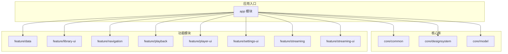

图表来源
- [build.gradle](file://build.gradle)
- [settings.gradle](file://settings.gradle)
- [app/build.gradle](file://app/build.gradle)
- [core/common/build.gradle](file://core/common/build.gradle)
- [core/designsystem/build.gradle](file://core/designsystem/build.gradle)
- [core/model/build.gradle](file://core/model/build.gradle)
- [feature/data/build.gradle](file://feature/data/build.gradle)
- [feature/library-ui/build.gradle](file://feature/library-ui/build.gradle)
- [feature/navigation/build.gradle](file://feature/navigation/build.gradle)
- [feature/playback/build.gradle](file://feature/playback/build.gradle)
- [feature/player-ui/build.gradle](file://feature/player-ui/build.gradle)
- [feature/settings-ui/build.gradle](file://feature/settings-ui/build.gradle)
- [feature/streaming/build.gradle](file://feature/streaming/build.gradle)
- [feature/streaming-ui/build.gradle](file://feature/streaming-ui/build.gradle)

章节来源
- [README.md](file://README.md)
- [ARCHITECTURE.md](file://docs/ARCHITECTURE.md)
- [build.gradle](file://build.gradle)
- [settings.gradle](file://settings.gradle)

## 核心组件
- 应用启动与依赖注入
  - 应用初始化与 Hilt 配置位于应用入口与 DI 模块中，负责装配全局单例、数据库、网络栈、存储等基础设施。
- 主界面与导航
  - MainActivity 作为宿主，结合 Compose 与导航模块进行页面挂载与路由分发。
- 播放域
  - 播放控制、队列、状态更新、与前台播放服务的连接均由控制器与适配器协同完成。
- 流媒体域
  - 认证回调、手动 Cookie、会话维护、播放质量策略、状态文本工厂等共同支撑在线播放体验。
- 设置域
  - 设置上下文、运行时应用、效果与 UI 适配由设置相关模块与控制器协作实现。
- 后台任务
  - WorkManager 用于同步收藏、身份增强、元数据回填、会话维护等周期性或一次性任务。

章节来源
- [app/src/main/java/app/yukine/EchoApplication.kt](file://app/src/main/java/app/yukine/EchoApplication.kt)
- [app/src/main/java/app/yukine/di/AppModule.kt](file://app/src/main/java/app/yukine/di/AppModule.kt)
- [app/src/main/java/app/yukine/MainActivity.kt](file://app/src/main/java/app/yukine/MainActivity.kt)
- [app/src/main/java/app/yukine/MainActivityComposition.kt](file://app/src/main/java/app/yukine/MainActivityComposition.kt)
- [app/src/main/java/app/yukine/MainNavHostMount.kt](file://app/src/main/java/app/yukine/MainNavHostMount.kt)
- [app/src/main/java/app/yukine/MainRouteController.kt](file://app/src/main/java/app/yukine/MainRouteController.kt)
- [app/src/main/java/app/yukine/PlaybackActionController.kt](file://app/src/main/java/app/yukine/PlaybackActionController.kt)
- [app/src/main/java/app/yukine/PlaybackStateUpdateController.kt](file://app/src/main/java/app/yukine/PlaybackStateUpdateController.kt)
- [app/src/main/java/app/yukine/PlaybackStartController.kt](file://app/src/main/java/app/yukine/PlaybackStartController.kt)
- [app/src/main/java/app/yukine/PlaybackServiceConnectionController.kt](file://app/src/main/java/app/yukine/PlaybackServiceConnectionController.kt)
- [app/src/main/java/app/yukine/PlaybackServiceHostController.kt](file://app/src/main/java/app/yukine/PlaybackServiceHostController.kt)
- [app/src/main/java/app/yukine/StreamingPlaybackController.kt](file://app/src/main/java/app/yukine/StreamingPlaybackController.kt)
- [app/src/main/java/app/yukine/StreamingPlaylistController.kt](file://app/src/main/java/app/yukine/StreamingPlaylistController.kt)
- [app/src/main/java/app/yukine/StreamingAuthCallbackController.kt](file://app/src/main/java/app/yukine/StreamingAuthCallbackController.kt)
- [app/src/main/java/app/yukine/StreamingManualCookieController.kt](file://app/src/main/java/app/yukine/StreamingManualCookieController.kt)
- [app/src/main/java/app/yukine/StreamingSessionMaintenanceWorker.kt](file://app/src/main/java/app/yukine/StreamingSessionMaintenanceWorker.kt)
- [app/src/main/java/app/yukine/SettingsContextProvider.kt](file://app/src/main/java/app/yukine/SettingsContextProvider.kt)
- [app/src/main/java/app/yukine/SettingsRuntimeApplier.kt](file://app/src/main/java/app/yukine/SettingsRuntimeApplier.kt)
- [app/src/main/java/app/yukine/FavoriteSyncWorker.kt](file://app/src/main/java/app/yukine/FavoriteSyncWorker.kt)
- [app/src/main/java/app/yukine/IdentityEnhancementWorker.kt](file://app/src/main/java/app/yukine/IdentityEnhancementWorker.kt)
- [app/src/main/java/app/yukine/IdentityBackfillWorker.kt](file://app/src/main/java/app/yukine/IdentityBackfillWorker.kt)
- [app/src/main/java/app/yukine/KugouPlaylistSyncWorker.kt](file://app/src/main/java/app/yukine/KugouPlaylistSyncWorker.kt)

## 架构总览
Echo 采用 MVVM + Clean Architecture 的分层设计，结合模块化与依赖注入，形成清晰的职责边界与数据流向。

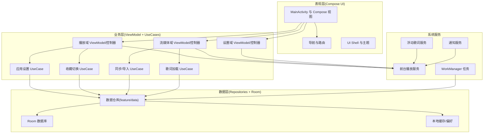

图表来源
- [app/src/main/java/app/yukine/MainActivity.kt](file://app/src/main/java/app/yukine/MainActivity.kt)
- [app/src/main/java/app/yukine/MainActivityComposition.kt](file://app/src/main/java/app/yukine/MainActivityComposition.kt)
- [app/src/main/java/app/yukine/MainNavHostMount.kt](file://app/src/main/java/app/yukine/MainNavHostMount.kt)
- [app/src/main/java/app/yukine/MainRouteController.kt](file://app/src/main/java/app/yukine/MainRouteController.kt)
- [app/src/main/java/app/yukine/PlaybackActionController.kt](file://app/src/main/java/app/yukine/PlaybackActionController.kt)
- [app/src/main/java/app/yukine/PlaybackStateUpdateController.kt](file://app/src/main/java/app/yukine/PlaybackStateUpdateController.kt)
- [app/src/main/java/app/yukine/PlaybackStartController.kt](file://app/src/main/java/app/yukine/PlaybackStartController.kt)
- [app/src/main/java/app/yukine/PlaybackServiceConnectionController.kt](file://app/src/main/java/app/yukine/PlaybackServiceConnectionController.kt)
- [app/src/main/java/app/yukine/PlaybackServiceHostController.kt](file://app/src/main/java/app/yukine/PlaybackServiceHostController.kt)
- [app/src/main/java/app/yukine/StreamingPlaybackController.kt](file://app/src/main/java/app/yukine/StreamingPlaybackController.kt)
- [app/src/main/java/app/yukine/StreamingPlaylistController.kt](file://app/src/main/java/app/yukine/StreamingPlaylistController.kt)
- [app/src/main/java/app/yukine/ApplySettingsPreferenceUseCase.kt](file://app/src/main/java/app/yukine/ApplySettingsPreferenceUseCase.kt)
- [app/src/main/java/app/yukine/LoadLyricsSettingsUseCase.kt](file://app/src/main/java/app/yukine/LoadLyricsSettingsUseCase.kt)
- [app/src/main/java/app/yukine/LoadTrackLyricsUseCase.kt](file://app/src/main/java/app/yukine/LoadTrackLyricsUseCase.kt)
- [app/src/main/java/app/yukine/ToggleFavoriteUseCase.kt](file://app/src/main/java/app/yukine/ToggleFavoriteUseCase.kt)
- [app/src/main/java/app/yukine/SyncStreamingPlaylistUseCase.kt](file://app/src/main/java/app/yukine/SyncStreamingPlaylistUseCase.kt)
- [app/src/main/java/app/yukine/ImportStreamingPlaylistUseCase.kt](file://app/src/main/java/app/yukine/ImportStreamingPlaylistUseCase.kt)
- [app/src/main/java/app/yukine/LoadPlaylistTracksUseCase.kt](file://app/src/main/java/app/yukine/LoadPlaylistTracksUseCase.kt)
- [app/src/main/java/app/yukine/LoadSettingsPreferencesUseCase.kt](file://app/src/main/java/app/yukine/LoadSettingsPreferencesUseCase.kt)
- [app/src/main/java/app/yukine/EnsureStreamingLoginPlaylistUseCase.kt](file://app/src/main/java/app/yukine/EnsureStreamingLoginPlaylistUseCase.kt)
- [app/src/main/java/app/yukine/GetStreamingPlaylistLinkUseCase.kt](file://app/src/main/java/app/yukine/GetStreamingPlaylistLinkUseCase.kt)
- [app/src/main/java/app/yukine/FavoriteSyncWorker.kt](file://app/src/main/java/app/yukine/FavoriteSyncWorker.kt)
- [app/src/main/java/app/yukine/IdentityEnhancementWorker.kt](file://app/src/main/java/app/yukine/IdentityEnhancementWorker.kt)
- [app/src/main/java/app/yukine/IdentityBackfillWorker.kt](file://app/src/main/java/app/yukine/IdentityBackfillWorker.kt)
- [app/src/main/java/app/yukine/KugouPlaylistSyncWorker.kt](file://app/src/main/java/app/yukine/KugouPlaylistSyncWorker.kt)
- [app/src/main/java/app/yukine/FloatingLyricsService.kt](file://app/src/main/java/app/yukine/FloatingLyricsService.kt)
- [app/src/main/java/app/yukine/LiveLyricsNotificationService.kt](file://app/src/main/java/app/yukine/LiveLyricsNotificationService.kt)

## 详细组件分析

### 表现层（Jetpack Compose UI）
- 职责
  - 渲染界面、收集状态、转发用户操作到业务层。
  - 通过导航模块进行页面跳转与参数传递。
- 关键文件
  - MainActivity、MainActivityComposition、MainNavHostMount、MainRouteController
- 交互关系
  - UI 订阅 ViewModel/控制器暴露的状态流；用户动作触发 UseCase 调用。

章节来源
- [app/src/main/java/app/yukine/MainActivity.kt](file://app/src/main/java/app/yukine/MainActivity.kt)
- [app/src/main/java/app/yukine/MainActivityComposition.kt](file://app/src/main/java/app/yukine/MainActivityComposition.kt)
- [app/src/main/java/app/yukine/MainNavHostMount.kt](file://app/src/main/java/app/yukine/MainNavHostMount.kt)
- [app/src/main/java/app/yukine/MainRouteController.kt](file://app/src/main/java/app/yukine/MainRouteController.kt)

### 业务层（Use Cases + ViewModels/Controllers）
- 职责
  - 编排用例逻辑，协调数据层与服务层，暴露稳定状态给 UI。
- 典型用例
  - 设置应用、歌词加载、收藏切换、播放列表同步/导入、播放开始/状态更新等。
- 关键文件
  - ApplySettingsPreferenceUseCase、LoadLyricsSettingsUseCase、LoadTrackLyricsUseCase、ToggleFavoriteUseCase、SyncStreamingPlaylistUseCase、ImportStreamingPlaylistUseCase、LoadPlaylistTracksUseCase、LoadSettingsPreferencesUseCase、EnsureStreamingLoginPlaylistUseCase、GetStreamingPlaylistLinkUseCase
  - PlaybackActionController、PlaybackStateUpdateController、PlaybackStartController、StreamingPlaybackController、StreamingPlaylistController、StreamingAuthCallbackController、StreamingManualCookieController

```mermaid
classDiagram
class ApplySettingsPreferenceUseCase
class LoadLyricsSettingsUseCase
class LoadTrackLyricsUseCase
class ToggleFavoriteUseCase
class SyncStreamingPlaylistUseCase
class ImportStreamingPlaylistUseCase
class LoadPlaylistTracksUseCase
class LoadSettingsPreferencesUseCase
class EnsureStreamingLoginPlaylistUseCase
class GetStreamingPlaylistLinkUseCase
class PlaybackActionController
class PlaybackStateUpdateController
class PlaybackStartController
class StreamingPlaybackController
class StreamingPlaylistController
class StreamingAuthCallbackController
class StreamingManualCookieController
PlaybackActionController --> ApplySettingsPreferenceUseCase : "调用"
PlaybackStateUpdateController --> LoadLyricsSettingsUseCase : "读取设置"
PlaybackStartController --> LoadPlaylistTracksUseCase : "加载曲目"
StreamingPlaybackController --> GetStreamingPlaylistLinkUseCase : "获取链接"
StreamingPlaylistController --> SyncStreamingPlaylistUseCase : "同步"
StreamingPlaylistController --> ImportStreamingPlaylistUseCase : "导入"
StreamingAuthCallbackController --> EnsureStreamingLoginPlaylistUseCase : "登录后确保歌单"
StreamingManualCookieController --> LoadSettingsPreferencesUseCase : "读取设置"
```

图表来源
- [app/src/main/java/app/yukine/ApplySettingsPreferenceUseCase.kt](file://app/src/main/java/app/yukine/ApplySettingsPreferenceUseCase.kt)
- [app/src/main/java/app/yukine/LoadLyricsSettingsUseCase.kt](file://app/src/main/java/app/yukine/LoadLyricsSettingsUseCase.kt)
- [app/src/main/java/app/yukine/LoadTrackLyricsUseCase.kt](file://app/src/main/java/app/yukine/LoadTrackLyricsUseCase.kt)
- [app/src/main/java/app/yukine/ToggleFavoriteUseCase.kt](file://app/src/main/java/app/yukine/ToggleFavoriteUseCase.kt)
- [app/src/main/java/app/yukine/SyncStreamingPlaylistUseCase.kt](file://app/src/main/java/app/yukine/SyncStreamingPlaylistUseCase.kt)
- [app/src/main/java/app/yukine/ImportStreamingPlaylistUseCase.kt](file://app/src/main/java/app/yukine/ImportStreamingPlaylistUseCase.kt)
- [app/src/main/java/app/yukine/LoadPlaylistTracksUseCase.kt](file://app/src/main/java/app/yukine/LoadPlaylistTracksUseCase.kt)
- [app/src/main/java/app/yukine/LoadSettingsPreferencesUseCase.kt](file://app/src/main/java/app/yukine/LoadSettingsPreferencesUseCase.kt)
- [app/src/main/java/app/yukine/EnsureStreamingLoginPlaylistUseCase.kt](file://app/src/main/java/app/yukine/EnsureStreamingLoginPlaylistUseCase.kt)
- [app/src/main/java/app/yukine/GetStreamingPlaylistLinkUseCase.kt](file://app/src/main/java/app/yukine/GetStreamingPlaylistLinkUseCase.kt)
- [app/src/main/java/app/yukine/PlaybackActionController.kt](file://app/src/main/java/app/yukine/PlaybackActionController.kt)
- [app/src/main/java/app/yukine/PlaybackStateUpdateController.kt](file://app/src/main/java/app/yukine/PlaybackStateUpdateController.kt)
- [app/src/main/java/app/yukine/PlaybackStartController.kt](file://app/src/main/java/app/yukine/PlaybackStartController.kt)
- [app/src/main/java/app/yukine/StreamingPlaybackController.kt](file://app/src/main/java/app/yukine/StreamingPlaybackController.kt)
- [app/src/main/java/app/yukine/StreamingPlaylistController.kt](file://app/src/main/java/app/yukine/StreamingPlaylistController.kt)
- [app/src/main/java/app/yukine/StreamingAuthCallbackController.kt](file://app/src/main/java/app/yukine/StreamingAuthCallbackController.kt)
- [app/src/main/java/app/yukine/StreamingManualCookieController.kt](file://app/src/main/java/app/yukine/StreamingManualCookieController.kt)

章节来源
- [app/src/main/java/app/yukine/PlaybackActionController.kt](file://app/src/main/java/app/yukine/PlaybackActionController.kt)
- [app/src/main/java/app/yukine/PlaybackStateUpdateController.kt](file://app/src/main/java/app/yukine/PlaybackStateUpdateController.kt)
- [app/src/main/java/app/yukine/PlaybackStartController.kt](file://app/src/main/java/app/yukine/PlaybackStartController.kt)
- [app/src/main/java/app/yukine/StreamingPlaybackController.kt](file://app/src/main/java/app/yukine/StreamingPlaybackController.kt)
- [app/src/main/java/app/yukine/StreamingPlaylistController.kt](file://app/src/main/java/app/yukine/StreamingPlaylistController.kt)
- [app/src/main/java/app/yukine/StreamingAuthCallbackController.kt](file://app/src/main/java/app/yukine/StreamingAuthCallbackController.kt)
- [app/src/main/java/app/yukine/StreamingManualCookieController.kt](file://app/src/main/java/app/yukine/StreamingManualCookieController.kt)
- [app/src/main/java/app/yukine/ApplySettingsPreferenceUseCase.kt](file://app/src/main/java/app/yukine/ApplySettingsPreferenceUseCase.kt)
- [app/src/main/java/app/yukine/LoadLyricsSettingsUseCase.kt](file://app/src/main/java/app/yukine/LoadLyricsSettingsUseCase.kt)
- [app/src/main/java/app/yukine/LoadTrackLyricsUseCase.kt](file://app/src/main/java/app/yukine/LoadTrackLyricsUseCase.kt)
- [app/src/main/java/app/yukine/ToggleFavoriteUseCase.kt](file://app/src/main/java/app/yukine/ToggleFavoriteUseCase.kt)
- [app/src/main/java/app/yukine/SyncStreamingPlaylistUseCase.kt](file://app/src/main/java/app/yukine/SyncStreamingPlaylistUseCase.kt)
- [app/src/main/java/app/yukine/ImportStreamingPlaylistUseCase.kt](file://app/src/main/java/app/yukine/ImportStreamingPlaylistUseCase.kt)
- [app/src/main/java/app/yukine/LoadPlaylistTracksUseCase.kt](file://app/src/main/java/app/yukine/LoadPlaylistTracksUseCase.kt)
- [app/src/main/java/app/yukine/LoadSettingsPreferencesUseCase.kt](file://app/src/main/java/app/yukine/LoadSettingsPreferencesUseCase.kt)
- [app/src/main/java/app/yukine/EnsureStreamingLoginPlaylistUseCase.kt](file://app/src/main/java/app/yukine/EnsureStreamingLoginPlaylistUseCase.kt)
- [app/src/main/java/app/yukine/GetStreamingPlaylistLinkUseCase.kt](file://app/src/main/java/app/yukine/GetStreamingPlaylistLinkUseCase.kt)

### 数据层（Repositories + Room Database）
- 职责
  - 封装本地与远程数据源，提供统一的数据访问接口；管理 Room 数据库迁移与缓存策略。
- 关键文件
  - feature/data 模块中的仓库实现、Room 数据库定义与迁移脚本
- 数据模型
  - 歌曲、专辑、艺术家、播放列表、下载任务、设置项等实体在 core/model 与 feature/data 中定义与映射。

章节来源
- [feature/data/build.gradle](file://feature/data/build.gradle)
- [core/model/build.gradle](file://core/model/build.gradle)

### 依赖注入（Hilt）
- 职责
  - 集中装配全局单例、数据库实例、网络栈、存储与模块级依赖，降低耦合度。
- 关键文件
  - AppModule、各功能 Module（LibraryModule、StreamingModule、PlaybackUiModule、SettingsModule、ToggleFavoriteModule 等）

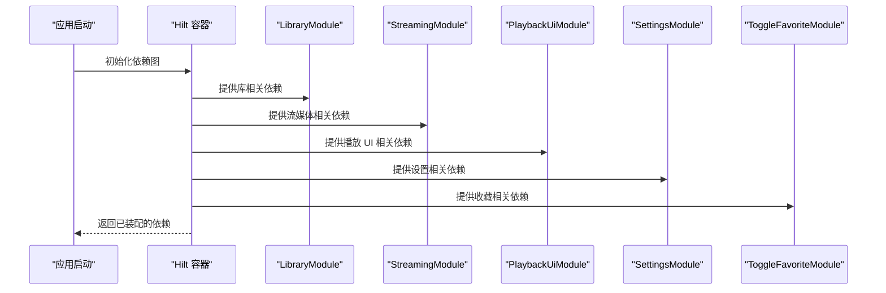

图表来源
- [app/src/main/java/app/yukine/di/AppModule.kt](file://app/src/main/java/app/yukine/di/AppModule.kt)
- [app/src/main/java/app/yukine/LibraryModule.kt](file://app/src/main/java/app/yukine/LibraryModule.kt)
- [app/src/main/java/app/yukine/StreamingModule.kt](file://app/src/main/java/app/yukine/StreamingModule.kt)
- [app/src/main/java/app/yukine/PlaybackUiModule.kt](file://app/src/main/java/app/yukine/PlaybackUiModule.kt)
- [app/src/main/java/app/yukine/SettingsModule.kt](file://app/src/main/java/app/yukine/SettingsModule.kt)
- [app/src/main/java/app/yukine/ToggleFavoriteModule.kt](file://app/src/main/java/app/yukine/ToggleFavoriteModule.kt)

章节来源
- [app/src/main/java/app/yukine/di/AppModule.kt](file://app/src/main/java/app/yukine/di/AppModule.kt)
- [app/src/main/java/app/yukine/LibraryModule.kt](file://app/src/main/java/app/yukine/LibraryModule.kt)
- [app/src/main/java/app/yukine/StreamingModule.kt](file://app/src/main/java/app/yukine/StreamingModule.kt)
- [app/src/main/java/app/yukine/PlaybackUiModule.kt](file://app/src/main/java/app/yukine/PlaybackUiModule.kt)
- [app/src/main/java/app/yukine/SettingsModule.kt](file://app/src/main/java/app/yukine/SettingsModule.kt)
- [app/src/main/java/app/yukine/ToggleFavoriteModule.kt](file://app/src/main/java/app/yukine/ToggleFavoriteModule.kt)

### 服务间通信机制
- 前台播放服务
  - 通过 MainPlaybackServiceHost、PlaybackServiceConnectionController、PlaybackServiceHostController 建立连接与控制通道。
- 浮动歌词服务
  - FloatingLyricsService 与 LiveLyricsNotificationService 协同，提供悬浮窗口与通知栏歌词展示。
- 事件与状态广播
  - NowPlayingPlaybackGatewayAdapter、NowPlayingSourceSwitchOwner、NowPlayingEffectOwner 等桥接 UI 与播放服务状态。

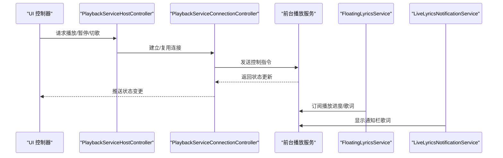

图表来源
- [app/src/main/java/app/yukine/MainPlaybackServiceHost.kt](file://app/src/main/java/app/yukine/MainPlaybackServiceHost.kt)
- [app/src/main/java/app/yukine/PlaybackServiceConnectionController.kt](file://app/src/main/java/app/yukine/PlaybackServiceConnectionController.kt)
- [app/src/main/java/app/yukine/PlaybackServiceHostController.kt](file://app/src/main/java/app/yukine/PlaybackServiceHostController.kt)
- [app/src/main/java/app/yukine/FloatingLyricsService.kt](file://app/src/main/java/app/yukine/FloatingLyricsService.kt)
- [app/src/main/java/app/yukine/LiveLyricsNotificationService.kt](file://app/src/main/java/app/yukine/LiveLyricsNotificationService.kt)
- [app/src/main/java/app/yukine/NowPlayingPlaybackGatewayAdapter.kt](file://app/src/main/java/app/yukine/NowPlayingPlaybackGatewayAdapter.kt)
- [app/src/main/java/app/yukine/NowPlayingSourceSwitchOwner.kt](file://app/src/main/java/app/yukine/NowPlayingSourceSwitchOwner.kt)
- [app/src/main/java/app/yukine/NowPlayingEffectOwner.kt](file://app/src/main/java/app/yukine/NowPlayingEffectOwner.kt)

章节来源
- [app/src/main/java/app/yukine/MainPlaybackServiceHost.kt](file://app/src/main/java/app/yukine/MainPlaybackServiceHost.kt)
- [app/src/main/java/app/yukine/PlaybackServiceConnectionController.kt](file://app/src/main/java/app/yukine/PlaybackServiceConnectionController.kt)
- [app/src/main/java/app/yukine/PlaybackServiceHostController.kt](file://app/src/main/java/app/yukine/PlaybackServiceHostController.kt)
- [app/src/main/java/app/yukine/FloatingLyricsService.kt](file://app/src/main/java/app/yukine/FloatingLyricsService.kt)
- [app/src/main/java/app/yukine/LiveLyricsNotificationService.kt](file://app/src/main/java/app/yukine/LiveLyricsNotificationService.kt)
- [app/src/main/java/app/yukine/NowPlayingPlaybackGatewayAdapter.kt](file://app/src/main/java/app/yukine/NowPlayingPlaybackGatewayAdapter.kt)
- [app/src/main/java/app/yukine/NowPlayingSourceSwitchOwner.kt](file://app/src/main/java/app/yukine/NowPlayingSourceSwitchOwner.kt)
- [app/src/main/java/app/yukine/NowPlayingEffectOwner.kt](file://app/src/main/java/app/yukine/NowPlayingEffectOwner.kt)

### 异步处理策略
- 协程与调度器
  - 业务层与数据层广泛使用协程进行异步 IO 与状态更新。
- WorkManager 后台任务
  - FavoriteSyncWorker、IdentityEnhancementWorker、IdentityBackfillWorker、KugouPlaylistSyncWorker、StreamingSessionMaintenanceWorker 等执行离线同步、增量回填与会话维护。
- 事件驱动
  - NetworkRequestController、NetworkSourcesEventController、NetworkMenuEventController 等将网络事件转化为 UI 可消费的状态流。

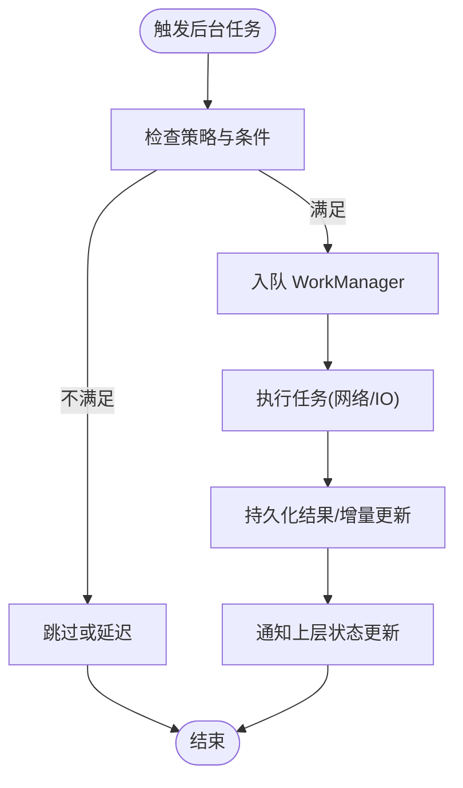

图表来源
- [app/src/main/java/app/yukine/FavoriteSyncWorker.kt](file://app/src/main/java/app/yukine/FavoriteSyncWorker.kt)
- [app/src/main/java/app/yukine/IdentityEnhancementWorker.kt](file://app/src/main/java/app/yukine/IdentityEnhancementWorker.kt)
- [app/src/main/java/app/yukine/IdentityBackfillWorker.kt](file://app/src/main/java/app/yukine/IdentityBackfillWorker.kt)
- [app/src/main/java/app/yukine/KugouPlaylistSyncWorker.kt](file://app/src/main/java/app/yukine/KugouPlaylistSyncWorker.kt)
- [app/src/main/java/app/yukine/StreamingSessionMaintenanceWorker.kt](file://app/src/main/java/app/yukine/StreamingSessionMaintenanceWorker.kt)
- [app/src/main/java/app/yukine/NetworkRequestController.kt](file://app/src/main/java/app/yukine/NetworkRequestController.kt)
- [app/src/main/java/app/yukine/NetworkSourcesEventController.kt](file://app/src/main/java/app/yukine/NetworkSourcesEventController.kt)
- [app/src/main/java/app/yukine/NetworkMenuEventController.kt](file://app/src/main/java/app/yukine/NetworkMenuEventController.kt)

章节来源
- [app/src/main/java/app/yukine/FavoriteSyncWorker.kt](file://app/src/main/java/app/yukine/FavoriteSyncWorker.kt)
- [app/src/main/java/app/yukine/IdentityEnhancementWorker.kt](file://app/src/main/java/app/yukine/IdentityEnhancementWorker.kt)
- [app/src/main/java/app/yukine/IdentityBackfillWorker.kt](file://app/src/main/java/app/yukine/IdentityBackfillWorker.kt)
- [app/src/main/java/app/yukine/KugouPlaylistSyncWorker.kt](file://app/src/main/java/app/yukine/KugouPlaylistSyncWorker.kt)
- [app/src/main/java/app/yukine/StreamingSessionMaintenanceWorker.kt](file://app/src/main/java/app/yukine/StreamingSessionMaintenanceWorker.kt)
- [app/src/main/java/app/yukine/NetworkRequestController.kt](file://app/src/main/java/app/yukine/NetworkRequestController.kt)
- [app/src/main/java/app/yukine/NetworkSourcesEventController.kt](file://app/src/main/java/app/yukine/NetworkSourcesEventController.kt)
- [app/src/main/java/app/yukine/NetworkMenuEventController.kt](file://app/src/main/java/app/yukine/NetworkMenuEventController.kt)

### 状态管理模式（MVVM + Compose）
- 状态来源
  - ViewModel/控制器暴露 StateFlow/SharedFlow 供 Compose 订阅。
- 状态更新路径
  - UI 动作 -> 控制器 -> UseCase -> Repository -> 数据源 -> 状态回推 -> UI 刷新。
- 关键文件
  - PlaybackStateUpdateController、PlaybackDomainReactionOwner、QueueActionController、QueueIntentOwner、PlayHistoryActionController、StreamingStatusTextFactory、MessageTextResolver、StatusMessageController、StatusMessageContracts

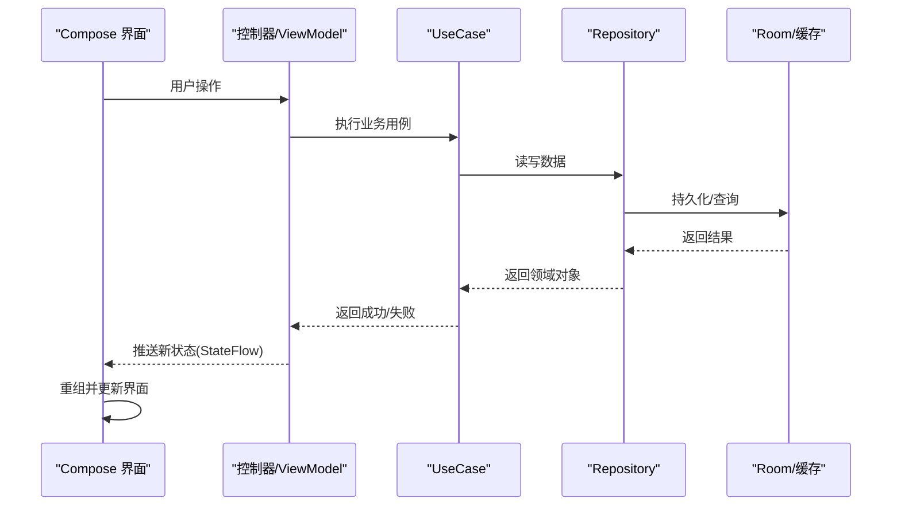

图表来源
- [app/src/main/java/app/yukine/PlaybackStateUpdateController.kt](file://app/src/main/java/app/yukine/PlaybackStateUpdateController.kt)
- [app/src/main/java/app/yukine/PlaybackDomainReactionOwner.kt](file://app/src/main/java/app/yukine/PlaybackDomainReactionOwner.kt)
- [app/src/main/java/app/yukine/QueueActionController.kt](file://app/src/main/java/app/yukine/QueueActionController.kt)
- [app/src/main/java/app/yukine/QueueIntentOwner.kt](file://app/src/main/java/app/yukine/QueueIntentOwner.kt)
- [app/src/main/java/app/yukine/PlayHistoryActionController.kt](file://app/src/main/java/app/yukine/PlayHistoryActionController.kt)
- [app/src/main/java/app/yukine/StreamingStatusTextFactory.kt](file://app/src/main/java/app/yukine/StreamingStatusTextFactory.kt)
- [app/src/main/java/app/yukine/MessageTextResolver.kt](file://app/src/main/java/app/yukine/MessageTextResolver.kt)
- [app/src/main/java/app/yukine/StatusMessageController.java](file://app/src/main/java/app/yukine/StatusMessageController.java)
- [app/src/main/java/app/yukine/StatusMessageContracts.kt](file://app/src/main/java/app/yukine/StatusMessageContracts.kt)

章节来源
- [app/src/main/java/app/yukine/PlaybackStateUpdateController.kt](file://app/src/main/java/app/yukine/PlaybackStateUpdateController.kt)
- [app/src/main/java/app/yukine/PlaybackDomainReactionOwner.kt](file://app/src/main/java/app/yukine/PlaybackDomainReactionOwner.kt)
- [app/src/main/java/app/yukine/QueueActionController.kt](file://app/src/main/java/app/yukine/QueueActionController.kt)
- [app/src/main/java/app/yukine/QueueIntentOwner.kt](file://app/src/main/java/app/yukine/QueueIntentOwner.kt)
- [app/src/main/java/app/yukine/PlayHistoryActionController.kt](file://app/src/main/java/app/yukine/PlayHistoryActionController.kt)
- [app/src/main/java/app/yukine/StreamingStatusTextFactory.kt](file://app/src/main/java/app/yukine/StreamingStatusTextFactory.kt)
- [app/src/main/java/app/yukine/MessageTextResolver.kt](file://app/src/main/java/app/yukine/MessageTextResolver.kt)
- [app/src/main/java/app/yukine/StatusMessageController.java](file://app/src/main/java/app/yukine/StatusMessageController.java)
- [app/src/main/java/app/yukine/StatusMessageContracts.kt](file://app/src/main/java/app/yukine/StatusMessageContracts.kt)

### 播放与队列流程
- 播放开始
  - PlaybackStartController 协调曲目解析、源选择与播放服务启动。
- 队列操作
  - QueueActionController 与 QueueIntentOwner 管理队列增删改查与意图派发。
- 播放历史
  - PlayHistoryActionController 记录与回放历史。

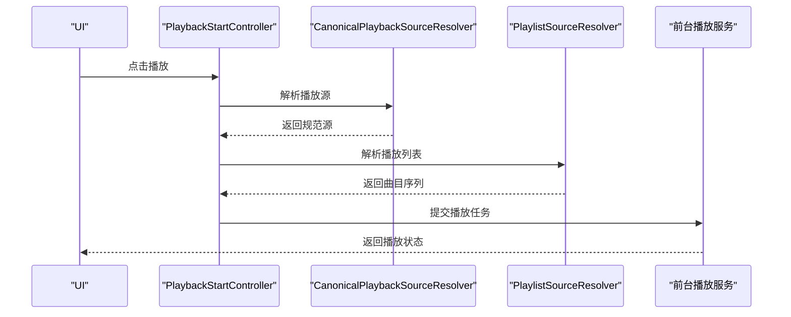

图表来源
- [app/src/main/java/app/yukine/PlaybackStartController.kt](file://app/src/main/java/app/yukine/PlaybackStartController.kt)
- [app/src/main/java/app/yukine/CanonicalPlaybackSourceResolver.kt](file://app/src/main/java/app/yukine/CanonicalPlaybackSourceResolver.kt)
- [app/src/main/java/app/yukine/PlaylistSourceResolver.kt](file://app/src/main/java/app/yukine/PlaylistSourceResolver.kt)
- [app/src/main/java/app/yukine/QueueActionController.kt](file://app/src/main/java/app/yukine/QueueActionController.kt)
- [app/src/main/java/app/yukine/QueueIntentOwner.kt](file://app/src/main/java/app/yukine/QueueIntentOwner.kt)
- [app/src/main/java/app/yukine/PlayHistoryActionController.kt](file://app/src/main/java/app/yukine/PlayHistoryActionController.kt)

章节来源
- [app/src/main/java/app/yukine/PlaybackStartController.kt](file://app/src/main/java/app/yukine/PlaybackStartController.kt)
- [app/src/main/java/app/yukine/CanonicalPlaybackSourceResolver.kt](file://app/src/main/java/app/yukine/CanonicalPlaybackSourceResolver.kt)
- [app/src/main/java/app/yukine/PlaylistSourceResolver.kt](file://app/src/main/java/app/yukine/PlaylistSourceResolver.kt)
- [app/src/main/java/app/yukine/QueueActionController.kt](file://app/src/main/java/app/yukine/QueueActionController.kt)
- [app/src/main/java/app/yukine/QueueIntentOwner.kt](file://app/src/main/java/app/yukine/QueueIntentOwner.kt)
- [app/src/main/java/app/yukine/PlayHistoryActionController.kt](file://app/src/main/java/app/yukine/PlayHistoryActionController.kt)

### 流媒体认证与 Cookie 管理
- Web 认证回调
  - StreamingAuthCallbackController 处理第三方登录回调与后续流程。
- 手动 Cookie
  - StreamingManualCookieController 与对话框控制器配合，支持手动输入与校验。
- 会话维护
  - StreamingSessionMaintenanceWorker 定期维护会话有效性。

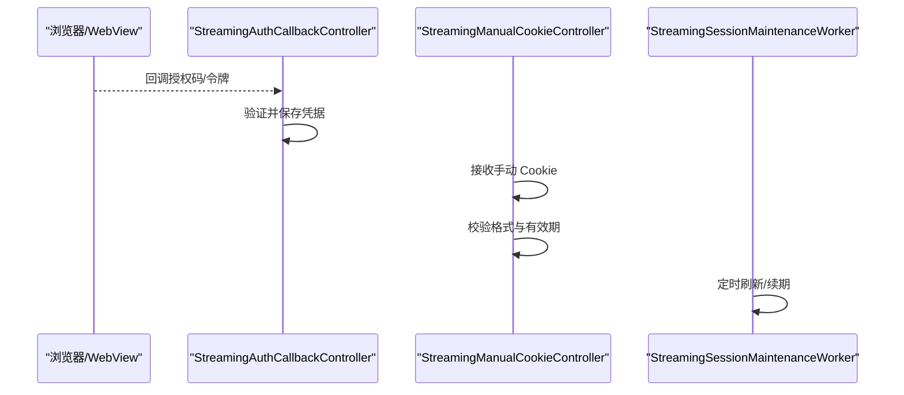

图表来源
- [app/src/main/java/app/yukine/StreamingAuthCallbackController.kt](file://app/src/main/java/app/yukine/StreamingAuthCallbackController.kt)
- [app/src/main/java/app/yukine/StreamingManualCookieController.kt](file://app/src/main/java/app/yukine/StreamingManualCookieController.kt)
- [app/src/main/java/app/yukine/StreamingSessionMaintenanceWorker.kt](file://app/src/main/java/app/yukine/StreamingSessionMaintenanceWorker.kt)
- [app/src/main/java/app/yukine/StreamingWebAuthActivity.kt](file://app/src/main/java/app/yukine/StreamingWebAuthActivity.kt)
- [app/src/main/java/app/yukine/StreamingAuthLauncher.kt](file://app/src/main/java/app/yukine/StreamingAuthLauncher.kt)
- [app/src/main/java/app/yukine/AndroidStreamingWebCookieSessionSource.kt](file://app/src/main/java/app/yukine/AndroidStreamingWebCookieSessionSource.kt)
- [app/src/main/java/app/yukine/StreamingManualCookieDialogController.java](file://app/src/main/java/app/yukine/StreamingManualCookieDialogController.java)

章节来源
- [app/src/main/java/app/yukine/StreamingAuthCallbackController.kt](file://app/src/main/java/app/yukine/StreamingAuthCallbackController.kt)
- [app/src/main/java/app/yukine/StreamingManualCookieController.kt](file://app/src/main/java/app/yukine/StreamingManualCookieController.kt)
- [app/src/main/java/app/yukine/StreamingSessionMaintenanceWorker.kt](file://app/src/main/java/app/yukine/StreamingSessionMaintenanceWorker.kt)
- [app/src/main/java/app/yukine/StreamingWebAuthActivity.kt](file://app/src/main/java/app/yukine/StreamingWebAuthActivity.kt)
- [app/src/main/java/app/yukine/StreamingAuthLauncher.kt](file://app/src/main/java/app/yukine/StreamingAuthLauncher.kt)
- [app/src/main/java/app/yukine/AndroidStreamingWebCookieSessionSource.kt](file://app/src/main/java/app/yukine/AndroidStreamingWebCookieSessionSource.kt)
- [app/src/main/java/app/yukine/StreamingManualCookieDialogController.java](file://app/src/main/java/app/yukine/StreamingManualCookieDialogController.java)

### 设置与运行时应用
- 设置上下文与应用
  - SettingsContextProvider 提供运行时设置上下文；SettingsRuntimeApplier 将设置应用到运行期。
- 播放服务控制适配
  - SettingsPlaybackServiceControlsAdapter 将设置项映射为播放服务控制行为。
- 效果与 UI 适配
  - SettingsEffectOwner 负责设置对 UI 效果的影响。

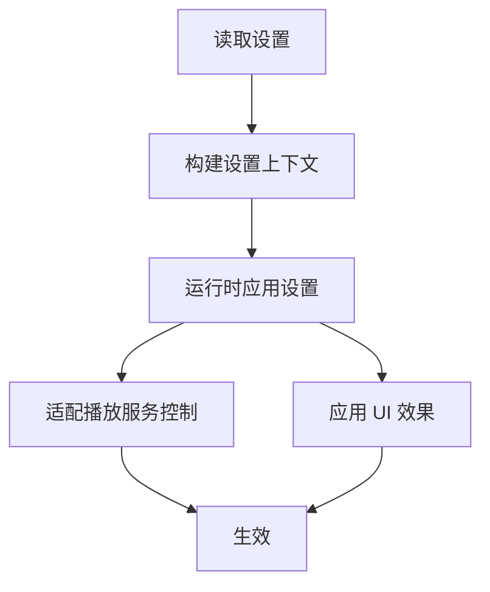

图表来源
- [app/src/main/java/app/yukine/SettingsContextProvider.kt](file://app/src/main/java/app/yukine/SettingsContextProvider.kt)
- [app/src/main/java/app/yukine/SettingsRuntimeApplier.kt](file://app/src/main/java/app/yukine/SettingsRuntimeApplier.kt)
- [app/src/main/java/app/yukine/SettingsPlaybackServiceControlsAdapter.kt](file://app/src/main/java/app/yukine/SettingsPlaybackServiceControlsAdapter.kt)
- [app/src/main/java/app/yukine/SettingsEffectOwner.kt](file://app/src/main/java/app/yukine/SettingsEffectOwner.kt)

章节来源
- [app/src/main/java/app/yukine/SettingsContextProvider.kt](file://app/src/main/java/app/yukine/SettingsContextProvider.kt)
- [app/src/main/java/app/yukine/SettingsRuntimeApplier.kt](file://app/src/main/java/app/yukine/SettingsRuntimeApplier.kt)
- [app/src/main/java/app/yukine/SettingsPlaybackServiceControlsAdapter.kt](file://app/src/main/java/app/yukine/SettingsPlaybackServiceControlsAdapter.kt)
- [app/src/main/java/app/yukine/SettingsEffectOwner.kt](file://app/src/main/java/app/yukine/SettingsEffectOwner.kt)

### 下载与元数据处理
- 下载请求与任务管理
  - DownloadRequestController 与 TrackDownloadManager 协调下载任务生命周期。
- 元数据写入与目录管理
  - DownloadedAudioMetadataWriter 写入音频元数据；DownloadDirectoryOwner/DownloadsDestinationOwner 管理下载目录与目标路径。

章节来源
- [app/src/main/java/app/yukine/DownloadRequestController.kt](file://app/src/main/java/app/yukine/DownloadRequestController.kt)
- [app/src/main/java/app/yukine/TrackDownloadManager.kt](file://app/src/main/java/app/yukine/TrackDownloadManager.kt)
- [app/src/main/java/app/yukine/DownloadedAudioMetadataWriter.kt](file://app/src/main/java/app/yukine/DownloadedAudioMetadataWriter.kt)
- [app/src/main/java/app/yukine/DownloadDirectoryOwner.kt](file://app/src/main/java/app/yukine/DownloadDirectoryOwner.kt)
- [app/src/main/java/app/yukine/DownloadsDestinationOwner.kt](file://app/src/main/java/app/yukine/DownloadsDestinationOwner.kt)

### 浮动歌词与通知
- 浮动窗口与状态
  - FloatingLyricsOverlayView、FloatingLyricsOverlayState、FloatingLyricsOverlaySettings 管理悬浮歌词 UI 与设置。
- 窗口与播放动作映射
  - FloatingLyricsWindowController、FloatingLyricsPlaybackActionMapper 将播放动作映射到悬浮歌词窗口。
- 通知与恢复
  - FloatingLyricsNotificationOwner、FloatingLyricsRestoreReceiver 负责通知与恢复逻辑。

章节来源
- [app/src/main/java/app/yukine/FloatingLyricsOverlayView.kt](file://app/src/main/java/app/yukine/FloatingLyricsOverlayView.kt)
- [app/src/main/java/app/yukine/FloatingLyricsOverlayState.kt](file://app/src/main/java/app/yukine/FloatingLyricsOverlayState.kt)
- [app/src/main/java/app/yukine/FloatingLyricsOverlaySettings.kt](file://app/src/main/java/app/yukine/FloatingLyricsOverlaySettings.kt)
- [app/src/main/java/app/yukine/FloatingLyricsWindowController.kt](file://app/src/main/java/app/yukine/FloatingLyricsWindowController.kt)
- [app/src/main/java/app/yukine/FloatingLyricsPlaybackActionMapper.kt](file://app/src/main/java/app/yukine/FloatingLyricsPlaybackActionMapper.kt)
- [app/src/main/java/app/yukine/FloatingLyricsNotificationOwner.kt](file://app/src/main/java/app/yukine/FloatingLyricsNotificationOwner.kt)
- [app/src/main/java/app/yukine/FloatingLyricsRestoreReceiver.java](file://app/src/main/java/app/yukine/FloatingLyricsRestoreReceiver.java)

### 权限与文档选择
- 权限处理
  - PermissionResultOwner、AppPermissions 统一管理权限申请与结果处理。
- 文档选择与导入
  - DocumentPickerController、M3uDocumentHelper、ContentResolverLibraryDocumentGateway 支持 M3U 等文档导入。

章节来源
- [app/src/main/java/app/yukine/PermissionResultOwner.kt](file://app/src/main/java/app/yukine/PermissionResultOwner.kt)
- [app/src/main/java/app/yukine/AppPermissions.kt](file://app/src/main/java/app/yukine/AppPermissions.kt)
- [app/src/main/java/app/yukine/DocumentPickerController.kt](file://app/src/main/java/app/yukine/DocumentPickerController.kt)
- [app/src/main/java/app/yukine/M3uDocumentHelper.java](file://app/src/main/java/app/yukine/M3uDocumentHelper.java)
- [app/src/main/java/app/yukine/ContentResolverLibraryDocumentGateway.kt](file://app/src/main/java/app/yukine/ContentResolverLibraryDocumentGateway.kt)

### 库管理与同步
- 库状态绑定与操作
  - LibraryStateBinding、LibraryCollectionsOwner、LibraryGroupsActionAdapter、LibraryPlaylistsIntentOwner 等管理库状态与操作。
- 多源同步与 WebDAV
  - LibraryMultiSourceSync、LibraryWebDavSyncOwner 支持多源合并与 WebDAV 同步。
- 音频验证与删除完成
  - LibraryAudioVerificationOwner、LibraryDeletionCompletionOwner 保障库完整性与清理。

章节来源
- [app/src/main/java/app/yukine/LibraryStateBinding.kt](file://app/src/main/java/app/yukine/LibraryStateBinding.kt)
- [app/src/main/java/app/yukine/LibraryCollectionsOwner.kt](file://app/src/main/java/app/yukine/LibraryCollectionsOwner.kt)
- [app/src/main/java/app/yukine/LibraryGroupsActionAdapter.kt](file://app/src/main/java/app/yukine/LibraryGroupsActionAdapter.kt)
- [app/src/main/java/app/yukine/LibraryPlaylistsIntentOwner.kt](file://app/src/main/java/app/yukine/LibraryPlaylistsIntentOwner.kt)
- [app/src/main/java/app/yukine/LibraryMultiSourceSync.kt](file://app/src/main/java/app/yukine/LibraryMultiSourceSync.kt)
- [app/src/main/java/app/yukine/LibraryWebDavSyncOwner.kt](file://app/src/main/java/app/yukine/LibraryWebDavSyncOwner.kt)
- [app/src/main/java/app/yukine/LibraryAudioVerificationOwner.kt](file://app/src/main/java/app/yukine/LibraryAudioVerificationOwner.kt)
- [app/src/main/java/app/yukine/LibraryDeletionCompletionOwner.kt](file://app/src/main/java/app/yukine/LibraryDeletionCompletionOwner.kt)

### 网络与搜索
- 网络请求与事件
  - NetworkRequestController、NetworkSourcesEventController、NetworkMenuEventController 管理网络请求与事件分发。
- 统一搜索
  - UnifiedSearchOwner 聚合本地与远端搜索结果。

章节来源
- [app/src/main/java/app/yukine/NetworkRequestController.kt](file://app/src/main/java/app/yukine/NetworkRequestController.kt)
- [app/src/main/java/app/yukine/NetworkSourcesEventController.kt](file://app/src/main/java/app/yukine/NetworkSourcesEventController.kt)
- [app/src/main/java/app/yukine/NetworkMenuEventController.kt](file://app/src/main/java/app/yukine/NetworkMenuEventController.kt)
- [app/src/main/java/app/yukine/UnifiedSearchOwner.kt](file://app/src/main/java/app/yukine/UnifiedSearchOwner.kt)

### 特性绑定与平台适配
- 特性开关与平台差异
  - LibraryFeatureBinding、NavigationFeatureBinding、PlatformFeatureBinding、PlaybackFeatureBinding、StreamingFeatureBinding、SettingsFeatureBinding、OnboardingFeatureBinding、NetworkFeatureBinding 等实现特性开关与平台适配。

章节来源
- [app/src/main/java/app/yukine/LibraryFeatureBinding.java](file://app/src/main/java/app/yukine/LibraryFeatureBinding.java)
- [app/src/main/java/app/yukine/NavigationFeatureBinding.kt](file://app/src/main/java/app/yukine/NavigationFeatureBinding.kt)
- [app/src/main/java/app/yukine/PlatformFeatureBinding.java](file://app/src/main/java/app/yukine/PlatformFeatureBinding.java)
- [app/src/main/java/app/yukine/PlaybackFeatureBinding.kt](file://app/src/main/java/app/yukine/PlaybackFeatureBinding.kt)
- [app/src/main/java/app/yukine/StreamingFeatureBinding.java](file://app/src/main/java/app/yukine/StreamingFeatureBinding.java)
- [app/src/main/java/app/yukine/SettingsFeatureBinding.java](file://app/src/main/java/app/yukine/SettingsFeatureBinding.java)
- [app/src/main/java/app/yukine/OnboardingFeatureBinding.java](file://app/src/main/java/app/yukine/OnboardingFeatureBinding.java)
- [app/src/main/java/app/yukine/NetworkFeatureBinding.java](file://app/src/main/java/app/yukine/NetworkFeatureBinding.java)

## 依赖分析
模块间依赖遵循“上层依赖下层、同层低耦合”的原则，避免循环依赖。

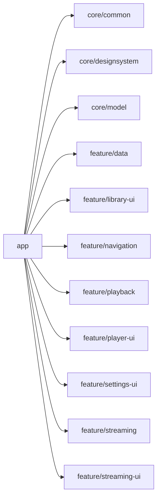

图表来源
- [build.gradle](file://build.gradle)
- [settings.gradle](file://settings.gradle)
- [app/build.gradle](file://app/build.gradle)
- [core/common/build.gradle](file://core/common/build.gradle)
- [core/designsystem/build.gradle](file://core/designsystem/build.gradle)
- [core/model/build.gradle](file://core/model/build.gradle)
- [feature/data/build.gradle](file://feature/data/build.gradle)
- [feature/library-ui/build.gradle](file://feature/library-ui/build.gradle)
- [feature/navigation/build.gradle](file://feature/navigation/build.gradle)
- [feature/playback/build.gradle](file://feature/playback/build.gradle)
- [feature/player-ui/build.gradle](file://feature/player-ui/build.gradle)
- [feature/settings-ui/build.gradle](file://feature/settings-ui/build.gradle)
- [feature/streaming/build.gradle](file://feature/streaming/build.gradle)
- [feature/streaming-ui/build.gradle](file://feature/streaming-ui/build.gradle)

章节来源
- [build.gradle](file://build.gradle)
- [settings.gradle](file://settings.gradle)
- [app/build.gradle](file://app/build.gradle)

## 性能考虑
- 状态更新节流与批量更新
  - 在高频场景（如播放进度、歌词滚动）下，使用防抖与批量更新减少重组次数。
- 数据库与缓存
  - 合理使用 Room 索引与分页查询；对热点数据引入内存缓存与磁盘缓存策略。
- 网络请求优化
  - 合并请求、启用缓存、限制并发数；使用配额控制器（PersistentMetadataGatewayRequestQuota）控制元数据网关请求频率。
- 后台任务调度
  - 合理设置 WorkManager 约束（网络、电量），避免频繁唤醒设备。
- 资源与图片
  - 使用 designsystem 提供的图片变换与缓存策略，减少内存占用。

[本节为通用指导，无需具体文件引用]

## 故障排查指南
- 常见问题定位
  - 播放状态不同步：检查 PlaybackStateUpdateController 与 NowPlayingPlaybackGatewayAdapter 的状态推送链路。
  - 认证失败：查看 StreamingAuthCallbackController 与 StreamingManualCookieController 的错误分支与日志。
  - 同步任务失败：确认 FavoriteSyncWorker、IdentityEnhancementWorker、KugouPlaylistSyncWorker 的执行日志与重试策略。
  - 设置未生效：验证 SettingsRuntimeApplier 与 SettingsPlaybackServiceControlsAdapter 的应用顺序。
- 调试建议
  - 使用 StatusMessageController 与 MessageTextResolver 输出可读状态信息。
  - 利用测试用例（如 SettingsViewModelTest、PlaybackViewModelTest）复现问题路径。

章节来源
- [app/src/main/java/app/yukine/StatusMessageController.java](file://app/src/main/java/app/yukine/StatusMessageController.java)
- [app/src/main/java/app/yukine/MessageTextResolver.kt](file://app/src/main/java/app/yukine/MessageTextResolver.kt)
- [app/src/main/java/app/yukine/SettingsViewModelTest.kt](file://app/src/main/java/app/yukine/SettingsViewModelTest.kt)
- [app/src/main/java/app/yukine/PlaybackViewModelTest.kt](file://app/src/main/java/app/yukine/PlaybackViewModelTest.kt)

## 结论
Echo Android 应用通过 MVVM + Clean Architecture 的分层设计与模块化组织，实现了清晰的职责边界与良好的可扩展性。依赖注入（Hilt）降低了耦合度，服务间通信与异步处理策略保障了用户体验与稳定性。建议在后续迭代中持续完善状态一致性、错误处理与性能监控，进一步提升系统的健壮性与可维护性。

[本节为总结性内容，无需具体文件引用]

## 附录
- 参考文档
  - ARCHITECTURE.md：总体架构说明
  - MVVM_MIGRATION_PLAN.md：MVVM 迁移计划与步骤

章节来源
- [ARCHITECTURE.md](file://docs/ARCHITECTURE.md)
- [MVVM_MIGRATION_PLAN.md](file://docs/MVVM_MIGRATION_PLAN.md)