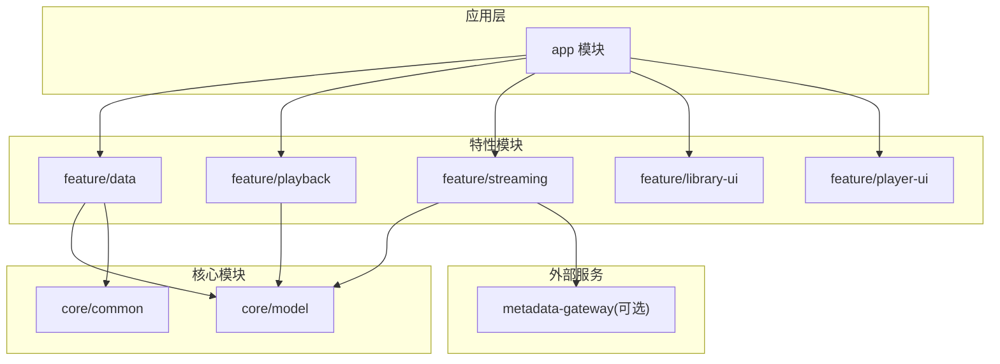
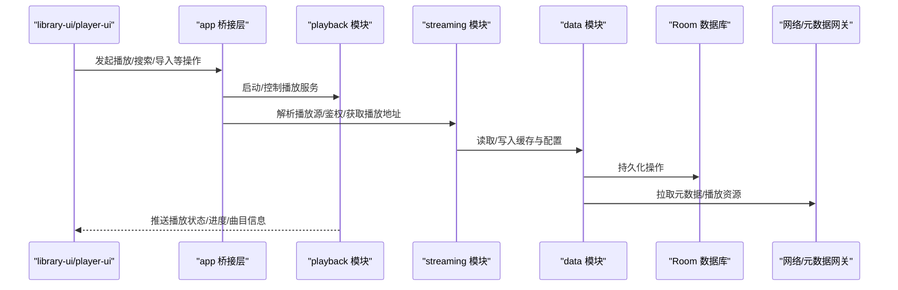
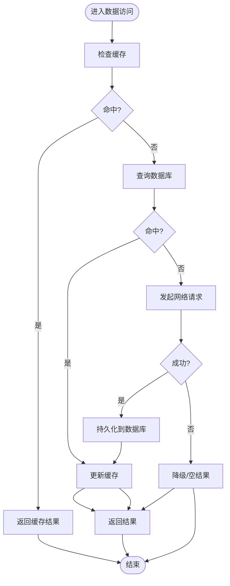
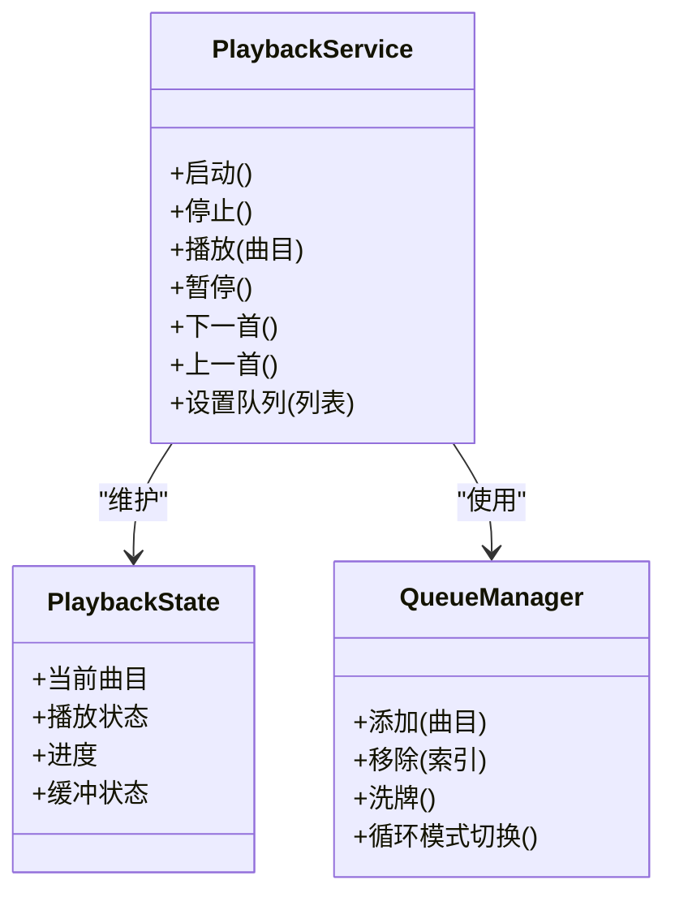
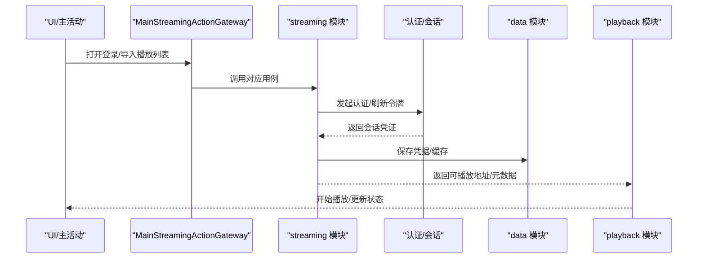
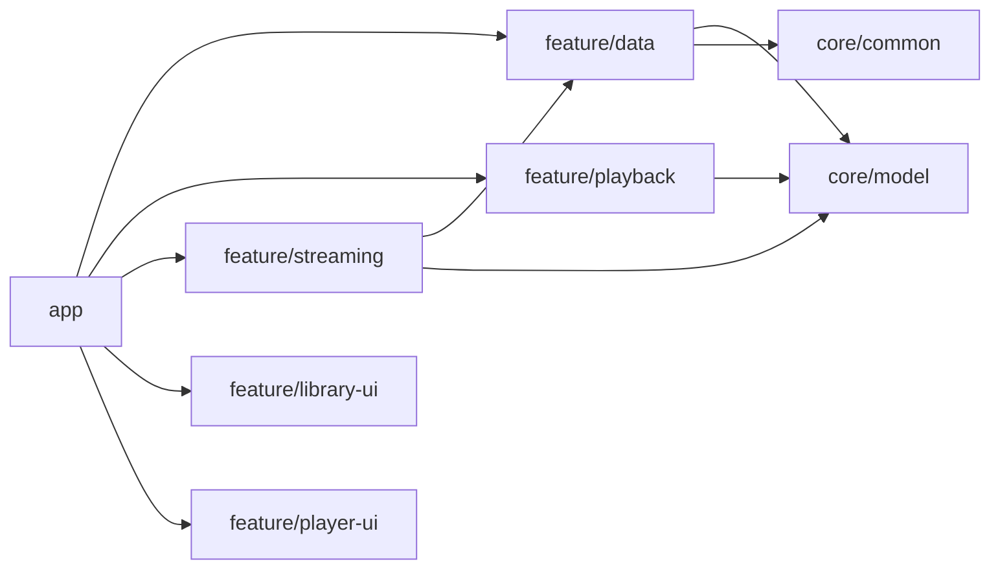

# 功能特性模块

<cite>
**本文引用的文件**   
- [feature/data/build.gradle](file://feature/data/build.gradle)
- [feature/data/src/main/AndroidManifest.xml](file://feature/data/src/main/AndroidManifest.xml)
- [feature/playback/build.gradle](file://feature/playback/build.gradle)
- [feature/playback/src/main/AndroidManifest.xml](file://feature/playback/src/main/AndroidManifest.xml)
- [feature/streaming/build.gradle](file://feature/streaming/build.gradle)
- [feature/streaming/src/main/AndroidManifest.xml](file://feature/streaming/src/main/AndroidManifest.xml)
- [feature/library-ui/build.gradle](file://feature/library-ui/build.gradle)
- [feature/player-ui/build.gradle](file://feature/player-ui/build.gradle)
- [app/src/main/java/app/yukine/MainPlaybackServiceHost.kt](file://app/src/main/java/app/yukine/MainPlaybackServiceHost.kt)
- [app/src/main/java/app/yukine/MainStreamingActionGateway.kt](file://app/src/main/java/app/yukine/MainStreamingActionGateway.kt)
- [app/src/main/java/app/yukine/MainNowPlayingGateway.kt](file://app/src/main/java/app/yukine/MainNowPlayingGateway.kt)
- [app/src/main/java/app/yukine/StreamingModule.kt](file://app/src/main/java/app/yukine/StreamingModule.kt)
- [app/src/main/java/app/yukine/LibraryModule.kt](file://app/src/main/java/app/yukine/LibraryModule.kt)
- [app/src/main/java/app/yukine/PlaybackFeatureBinding.kt](file://app/src/main/java/app/yukine/PlaybackFeatureBinding.kt)
- [app/src/main/java/app/yukine/StreamingFeatureBinding.java](file://app/src/main/java/app/yukine/StreamingFeatureBinding.java)
- [app/src/main/java/app/yukine/NavigationFeatureBinding.kt](file://app/src/main/java/app/yukine/NavigationFeatureBinding.kt)
- [core/model/src/main/AndroidManifest.xml](file://core/model/src/main/AndroidManifest.xml)
- [core/common/src/main/AndroidManifest.xml](file://core/common/src/main/AndroidManifest.xml)
</cite>

## 目录
1. [简介](#简介)
2. [项目结构](#项目结构)
3. [核心组件](#核心组件)
4. [架构总览](#架构总览)
5. [详细组件分析](#详细组件分析)
6. [依赖关系分析](#依赖关系分析)
7. [性能考量](#性能考量)
8. [故障排查指南](#故障排查指南)
9. [结论](#结论)
10. [附录](#附录)

## 简介
本文件面向 Echo Android 应用的功能特性模块，聚焦以下目标：
- 深入说明 feature/data 数据层模块的数据库操作、网络请求与缓存策略。
- 详细介绍 feature/playback 播放核心模块的播放服务、状态管理与音频处理职责。
- 说明 feature/streaming 流媒体模块的多平台集成、认证授权与播放适配机制。
- 文档化 feature/library-ui 音乐库模块、feature/player-ui 播放器界面模块的职责边界与对外接口。
- 解释各功能模块间的协作模式与通信机制（含跨进程服务交互）。

## 项目结构
Echo Android 采用多模块分层组织方式：
- app：应用装配层，负责 DI 绑定、导航、宿主桥接与 UI 组合。
- core/model、core/common：共享模型与通用能力。
- feature/*：按业务域拆分的特性模块，彼此通过清晰的接口与事件进行解耦。
- metadata-gateway：元数据网关（Node.js），为本地或远端提供统一元数据访问。

图表来源
- [feature/data/build.gradle](file://feature/data/build.gradle)
- [feature/playback/build.gradle](file://feature/playback/build.gradle)
- [feature/streaming/build.gradle](file://feature/streaming/build.gradle)
- [feature/library-ui/build.gradle](file://feature/library-ui/build.gradle)
- [feature/player-ui/build.gradle](file://feature/player-ui/build.gradle)
- [core/model/src/main/AndroidManifest.xml](file://core/model/src/main/AndroidManifest.xml)
- [core/common/src/main/AndroidManifest.xml](file://core/common/src/main/AndroidManifest.xml)

章节来源
- [feature/data/build.gradle](file://feature/data/build.gradle)
- [feature/playback/build.gradle](file://feature/playback/build.gradle)
- [feature/streaming/build.gradle](file://feature/streaming/build.gradle)
- [feature/library-ui/build.gradle](file://feature/library-ui/build.gradle)
- [feature/player-ui/build.gradle](file://feature/player-ui/build.gradle)
- [core/model/src/main/AndroidManifest.xml](file://core/model/src/main/AndroidManifest.xml)
- [core/common/src/main/AndroidManifest.xml](file://core/common/src/main/AndroidManifest.xml)

## 核心组件
- data 模块：封装本地持久化（Room）、网络访问与缓存策略，向上暴露 Repository 接口供上层消费。
- playback 模块：提供播放引擎抽象、队列管理、播放状态机与系统级播放控制（MediaSession/Notification）。
- streaming 模块：实现多平台流媒体源接入、认证流程、会话维护与播放适配，屏蔽底层差异。
- library-ui 模块：展示本地/网络音乐库、播放列表、收藏等，订阅播放与库状态并渲染 UI。
- player-ui 模块：提供迷你播放器、全屏播放器、歌词与效果等播放界面组件。

章节来源
- [feature/data/build.gradle](file://feature/data/build.gradle)
- [feature/playback/build.gradle](file://feature/playback/build.gradle)
- [feature/streaming/build.gradle](file://feature/streaming/build.gradle)
- [feature/library-ui/build.gradle](file://feature/library-ui/build.gradle)
- [feature/player-ui/build.gradle](file://feature/player-ui/build.gradle)

## 架构总览
整体采用“UI 层 -> 特性模块 -> 数据层”的分层架构，并通过 app 层的桥接类完成跨模块与跨进程通信。

图表来源
- [app/src/main/java/app/yukine/MainPlaybackServiceHost.kt](file://app/src/main/java/app/yukine/MainPlaybackServiceHost.kt)
- [app/src/main/java/app/yukine/MainStreamingActionGateway.kt](file://app/src/main/java/app/yukine/MainStreamingActionGateway.kt)
- [app/src/main/java/app/yukine/MainNowPlayingGateway.kt](file://app/src/main/java/app/yukine/MainNowPlayingGateway.kt)
- [feature/streaming/build.gradle](file://feature/streaming/build.gradle)
- [feature/playback/build.gradle](file://feature/playback/build.gradle)
- [feature/data/build.gradle](file://feature/data/build.gradle)

## 详细组件分析

### feature/data 数据层模块
- 职责边界
  - 提供统一的 Repository 接口，屏蔽 Room、网络与缓存细节。
  - 管理本地数据库迁移与版本演进。
  - 协调网络请求与缓存一致性。
- 关键能力
  - 数据库操作：基于 Room 的实体定义、DAO 与数据库实例。
  - 网络请求：HTTP 客户端封装、重试与错误映射。
  - 缓存策略：内存/磁盘两级缓存、失效与回退策略。
- 对外接口
  - 以接口形式暴露查询、写入、同步等方法；具体实现由 DI 注入。
- 典型流程（示例）
  - 播放列表加载：Repository 先查缓存/数据库，未命中则发起网络请求并回填缓存。

章节来源
- [feature/data/build.gradle](file://feature/data/build.gradle)
- [feature/data/src/main/AndroidManifest.xml](file://feature/data/src/main/AndroidManifest.xml)

### feature/playback 播放核心模块
- 职责边界
  - 播放引擎抽象与实现（本地/流媒体）。
  - 播放队列、随机/循环/顺序策略。
  - 播放状态机与通知栏/锁屏控件。
- 关键能力
  - 播放服务：前台服务生命周期管理、MediaSession 绑定。
  - 状态管理：当前曲目、进度、缓冲、错误码等状态广播。
  - 音频处理：解码器选择、混音、音效扩展点。
- 对外接口
  - 提供播放控制命令（播放/暂停/下一首/跳转）、状态订阅与队列操作。
- 与 app 层协作
  - app 通过 MainPlaybackServiceHost 启动/连接播放服务，MainNowPlayingGateway 转发 UI 动作。

图表来源
- [feature/playback/build.gradle](file://feature/playback/build.gradle)
- [feature/playback/src/main/AndroidManifest.xml](file://feature/playback/src/main/AndroidManifest.xml)
- [app/src/main/java/app/yukine/MainPlaybackServiceHost.kt](file://app/src/main/java/app/yukine/MainPlaybackServiceHost.kt)
- [app/src/main/java/app/yukine/MainNowPlayingGateway.kt](file://app/src/main/java/app/yukine/MainNowPlayingGateway.kt)

章节来源
- [feature/playback/build.gradle](file://feature/playback/build.gradle)
- [feature/playback/src/main/AndroidManifest.xml](file://feature/playback/src/main/AndroidManifest.xml)
- [app/src/main/java/app/yukine/MainPlaybackServiceHost.kt](file://app/src/main/java/app/yukine/MainPlaybackServiceHost.kt)
- [app/src/main/java/app/yukine/MainNowPlayingGateway.kt](file://app/src/main/java/app/yukine/MainNowPlayingGateway.kt)

### feature/streaming 流媒体模块
- 职责边界
  - 多平台流媒体源接入与适配。
  - 认证授权与会话维护（Cookie/Token）。
  - 播放地址解析与质量策略。
- 关键能力
  - 认证流程：WebAuth 回调、手动 Cookie 输入、自动续期。
  - 播放适配：根据设备/网络/音质策略选择最佳流。
  - 会话维护：后台任务保活、异常恢复。
- 与 app 层协作
  - app 通过 MainStreamingActionGateway 触发登录/导入/播放等动作；StreamingModule 完成 DI 绑定。

图表来源
- [app/src/main/java/app/yukine/MainStreamingActionGateway.kt](file://app/src/main/java/app/yukine/MainStreamingActionGateway.kt)
- [app/src/main/java/app/yukine/StreamingModule.kt](file://app/src/main/java/app/yukine/StreamingModule.kt)
- [feature/streaming/build.gradle](file://feature/streaming/build.gradle)
- [feature/streaming/src/main/AndroidManifest.xml](file://feature/streaming/src/main/AndroidManifest.xml)

章节来源
- [feature/streaming/build.gradle](file://feature/streaming/build.gradle)
- [feature/streaming/src/main/AndroidManifest.xml](file://feature/streaming/src/main/AndroidManifest.xml)
- [app/src/main/java/app/yukine/MainStreamingActionGateway.kt](file://app/src/main/java/app/yukine/MainStreamingActionGateway.kt)
- [app/src/main/java/app/yukine/StreamingModule.kt](file://app/src/main/java/app/yukine/StreamingModule.kt)

### feature/library-ui 音乐库模块
- 职责边界
  - 展示本地/网络音乐库、专辑、歌手、播放列表与收藏。
  - 提供库内搜索、筛选与批量操作入口。
  - 订阅播放与库状态，驱动 UI 更新。
- 对外接口
  - 暴露页面路由、状态订阅与操作回调（如添加到队列、分享、下载）。
- 与 app 层协作
  - 通过 NavigationFeatureBinding 注册路由与导航契约。

章节来源
- [feature/library-ui/build.gradle](file://feature/library-ui/build.gradle)
- [app/src/main/java/app/yukine/NavigationFeatureBinding.kt](file://app/src/main/java/app/yukine/NavigationFeatureBinding.kt)

### feature/player-ui 播放器界面模块
- 职责边界
  - 迷你播放器与全屏播放器视图。
  - 歌词显示、播放效果面板、手势控制。
  - 与播放服务状态双向同步。
- 对外接口
  - 暴露播放控制按钮、进度条、音量与歌词开关等交互事件。
- 与 app 层协作
  - 通过 PlaybackFeatureBinding 与播放模块对接。

章节来源
- [feature/player-ui/build.gradle](file://feature/player-ui/build.gradle)
- [app/src/main/java/app/yukine/PlaybackFeatureBinding.kt](file://app/src/main/java/app/yukine/PlaybackFeatureBinding.kt)

## 依赖关系分析
- 模块间依赖
  - app 依赖所有 feature 模块，承担装配与桥接职责。
  - feature/data 依赖 core/model 与 core/common。
  - feature/streaming 依赖 data 与 model，并可访问 metadata-gateway。
  - feature/playback 依赖 model，必要时通过 app 桥接访问 streaming 提供的播放源。
- 可能的耦合点
  - 播放状态在 playback 与 UI 之间高频同步，需关注线程与背压。
  - streaming 与 data 的缓存一致性需要明确失效策略。

图表来源
- [feature/data/build.gradle](file://feature/data/build.gradle)
- [feature/playback/build.gradle](file://feature/playback/build.gradle)
- [feature/streaming/build.gradle](file://feature/streaming/build.gradle)
- [feature/library-ui/build.gradle](file://feature/library-ui/build.gradle)
- [feature/player-ui/build.gradle](file://feature/player-ui/build.gradle)
- [core/model/src/main/AndroidManifest.xml](file://core/model/src/main/AndroidManifest.xml)
- [core/common/src/main/AndroidManifest.xml](file://core/common/src/main/AndroidManifest.xml)

章节来源
- [feature/data/build.gradle](file://feature/data/build.gradle)
- [feature/playback/build.gradle](file://feature/playback/build.gradle)
- [feature/streaming/build.gradle](file://feature/streaming/build.gradle)
- [feature/library-ui/build.gradle](file://feature/library-ui/build.gradle)
- [feature/player-ui/build.gradle](file://feature/player-ui/build.gradle)
- [core/model/src/main/AndroidManifest.xml](file://core/model/src/main/AndroidManifest.xml)
- [core/common/src/main/AndroidManifest.xml](file://core/common/src/main/AndroidManifest.xml)

## 性能考量
- 数据层
  - 合理使用缓存层级，避免重复 IO 与网络请求。
  - 分页与增量同步，减少一次性加载开销。
- 播放层
  - 预缓冲与自适应码率，降低卡顿概率。
  - 状态变更节流与合并，降低 UI 重绘压力。
- 流媒体层
  - 会话复用与令牌刷新，减少鉴权失败导致的重试风暴。
  - 资源选择策略结合设备能力与网络状况。

## 故障排查指南
- 播放无法启动
  - 检查播放服务是否已在前台运行，确认 MediaSession 绑定状态。
  - 查看播放状态与错误码，定位是解码、网络还是权限问题。
- 流媒体登录失败
  - 确认 WebAuth 回调链路是否正常，检查 Cookie/Token 是否持久化成功。
  - 核对会话维护任务是否被系统回收，必要时触发手动续期。
- 库数据不同步
  - 验证缓存失效策略与数据库迁移是否生效。
  - 对比网络响应与本地存储，定位不一致原因。

章节来源
- [app/src/main/java/app/yukine/MainPlaybackServiceHost.kt](file://app/src/main/java/app/yukine/MainPlaybackServiceHost.kt)
- [app/src/main/java/app/yukine/MainStreamingActionGateway.kt](file://app/src/main/java/app/yukine/MainStreamingActionGateway.kt)
- [feature/streaming/build.gradle](file://feature/streaming/build.gradle)
- [feature/playback/build.gradle](file://feature/playback/build.gradle)
- [feature/data/build.gradle](file://feature/data/build.gradle)

## 结论
Echo Android 的功能特性模块通过清晰的分层与解耦设计，实现了播放、流媒体与数据能力的稳定协作。app 层作为装配与桥接中心，将 UI、播放、流媒体与数据层有机串联。建议在后续迭代中持续优化缓存一致性、状态同步效率与跨进程通信稳定性，以提升整体用户体验。

## 附录
- 术语
  - 播放服务：系统级前台服务，负责音频播放与状态广播。
  - 播放适配器：对多种播放源（本地/流媒体）的统一抽象。
  - 会话维护：对认证凭据与有效期的后台管理。
- 参考
  - 模块清单与构建脚本见各 feature 模块 build.gradle。
  - 服务与权限声明见各模块 AndroidManifest.xml。