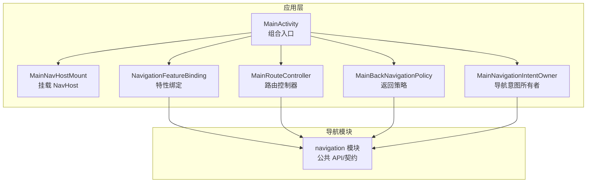
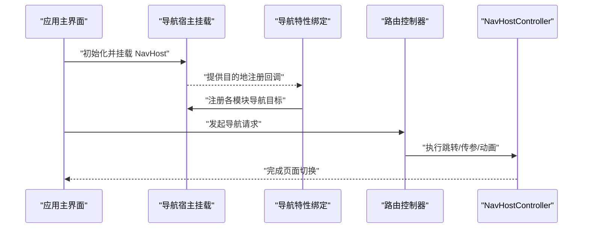
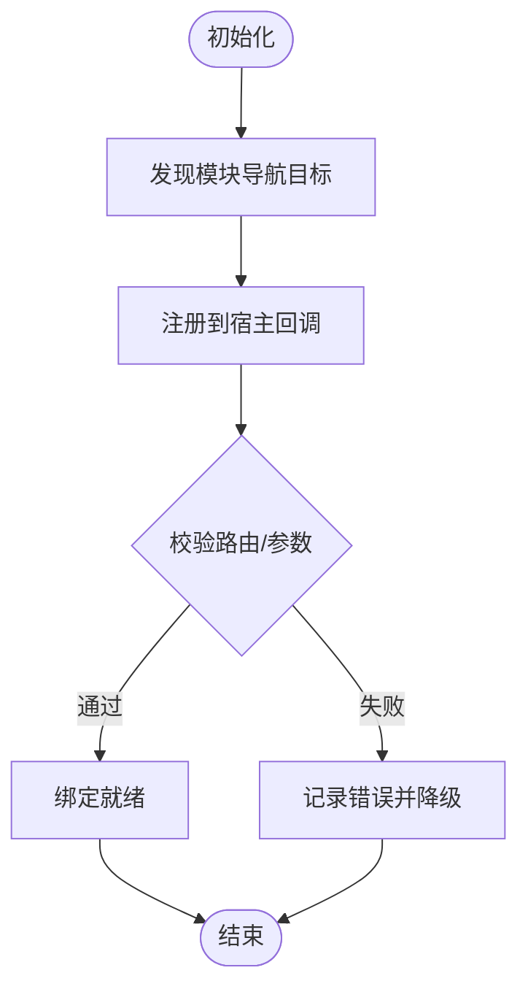
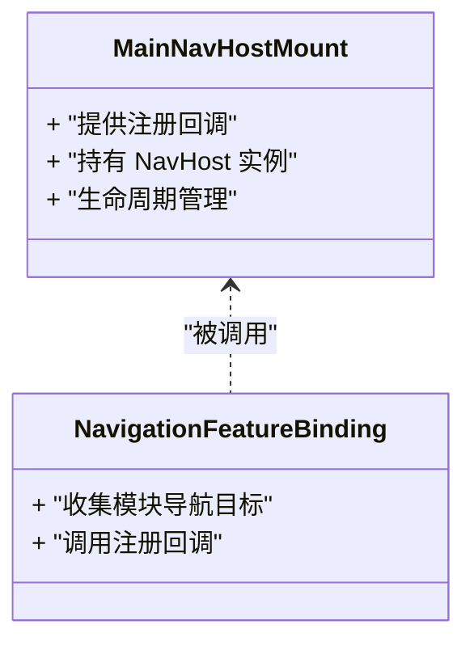
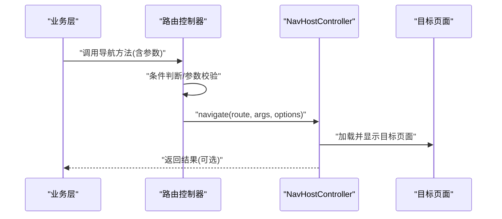
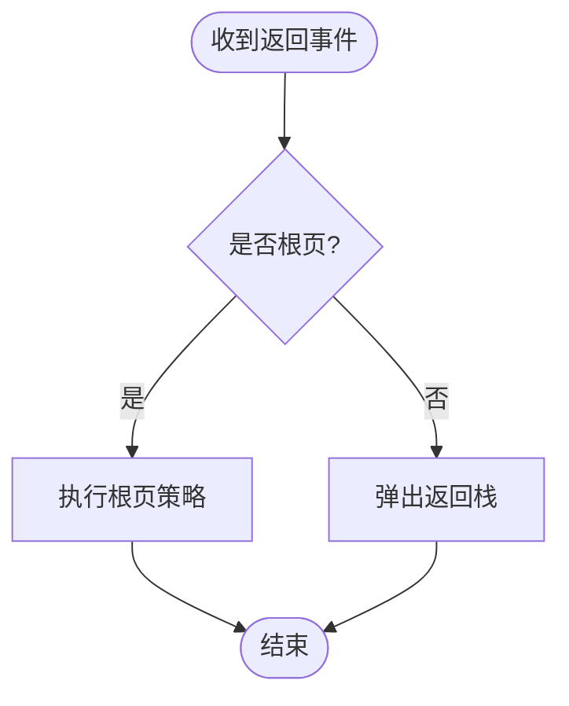
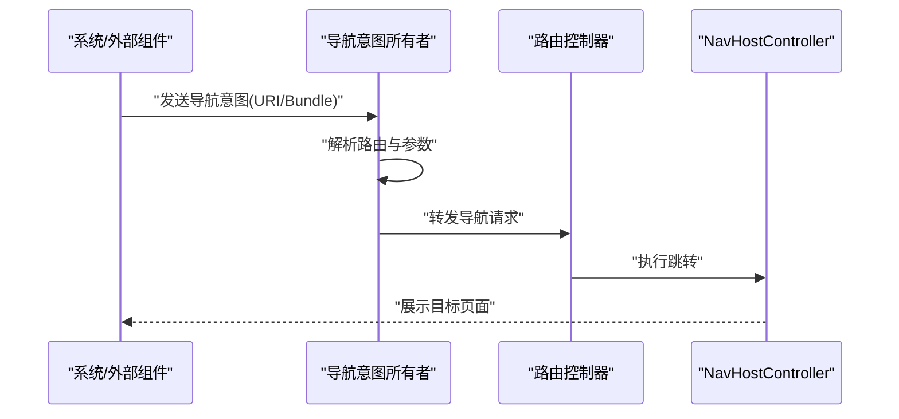
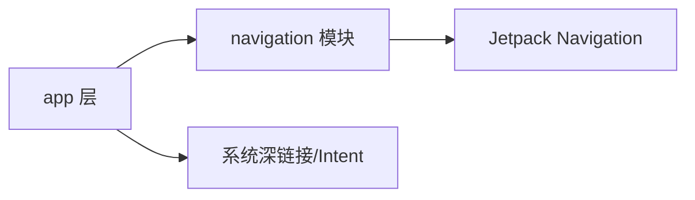

# 导航系统模块 (feature/navigation)

<cite>
**本文引用的文件**   
- [NavigationFeatureBinding.kt](file://app/src/main/java/app/yukine/NavigationFeatureBinding.kt)
- [MainNavHostMount.kt](file://app/src/main/java/app/yukine/MainNavHostMount.kt)
- [MainActivityComposition.kt](file://app/src/main/java/app/yukine/MainActivityComposition.kt)
- [MainRouteController.kt](file://app/src/main/java/app/yukine/MainRouteController.kt)
- [MainBackNavigationPolicy.kt](file://app/src/main/java/app/yukine/MainBackNavigationPolicy.kt)
- [MainNavigationIntentOwner.kt](file://app/src/main/java/app/yukine/MainNavigationIntentOwner.kt)
- [build.gradle](file://feature/navigation/build.gradle)
- [AndroidManifest.xml](file://feature/navigation/src/main/AndroidManifest.xml)
</cite>

## 目录
1. [简介](#简介)
2. [项目结构](#项目结构)
3. [核心组件](#核心组件)
4. [架构总览](#架构总览)
5. [详细组件分析](#详细组件分析)
6. [依赖分析](#依赖分析)
7. [性能考虑](#性能考虑)
8. [故障排查指南](#故障排查指南)
9. [结论](#结论)
10. [附录](#附录)

## 简介
本文件为 Echo Android 应用的 feature/navigation 导航系统模块提供系统化文档。内容覆盖导航图配置、路由管理、页面跳转、深链接支持、参数传递、返回栈控制、条件导航、动画与过渡、无障碍优化，以及与 app 层和各功能模块的集成方式。文档以“从高层到代码级”的方式组织，既便于快速理解整体设计，也便于定位具体实现细节。

## 项目结构
feature/navigation 模块作为应用的核心导航能力提供者，主要职责包括：
- 定义并暴露统一的导航入口与路由控制器
- 在应用主界面挂载 NavHost 并提供目的地注册点
- 通过特性绑定（Feature Binding）将各业务模块的导航目标接入统一导航图
- 处理返回栈策略与全局导航意图分发

图表来源
- [MainActivityComposition.kt](file://app/src/main/java/app/yukine/MainActivityComposition.kt)
- [MainNavHostMount.kt](file://app/src/main/java/app/yukine/MainNavHostMount.kt)
- [NavigationFeatureBinding.kt](file://app/src/main/java/app/yukine/NavigationFeatureBinding.kt)
- [MainRouteController.kt](file://app/src/main/java/app/yukine/MainRouteController.kt)
- [MainBackNavigationPolicy.kt](file://app/src/main/java/app/yukine/MainBackNavigationPolicy.kt)
- [MainNavigationIntentOwner.kt](file://app/src/main/java/app/yukine/MainNavigationIntentOwner.kt)

章节来源
- [NavigationFeatureBinding.kt](file://app/src/main/java/app/yukine/NavigationFeatureBinding.kt)
- [MainNavHostMount.kt](file://app/src/main/java/app/yukine/MainNavHostMount.kt)
- [MainActivityComposition.kt](file://app/src/main/java/app/yukine/MainActivityComposition.kt)
- [MainRouteController.kt](file://app/src/main/java/app/yukine/MainRouteController.kt)
- [MainBackNavigationPolicy.kt](file://app/src/main/java/app/yukine/MainBackNavigationPolicy.kt)
- [MainNavigationIntentOwner.kt](file://app/src/main/java/app/yukine/MainNavigationIntentOwner.kt)

## 核心组件
- 导航特性绑定（NavigationFeatureBinding）
  - 负责将各功能模块的导航目标集中注册到统一导航图中，屏蔽底层 Jetpack Navigation 细节，对外暴露稳定的导航契约。
- 导航宿主挂载（MainNavHostMount）
  - 负责在主界面中创建并挂载 NavHost，提供目的地注册回调接口，供特性绑定注入导航图。
- 路由控制器（MainRouteController）
  - 封装跨模块的路由调用，提供类型安全或约定式的路由方法，内部委托给 NavHostController 执行跳转。
- 返回策略（MainBackNavigationPolicy）
  - 集中处理返回键行为、根页返回、任务栈清理等策略，保证一致的返回体验。
- 导航意图所有者（MainNavigationIntentOwner）
  - 接收来自外部（如深链接、通知、其他 Activity）的导航意图，解析后交由路由控制器执行。

章节来源
- [NavigationFeatureBinding.kt](file://app/src/main/java/app/yukine/NavigationFeatureBinding.kt)
- [MainNavHostMount.kt](file://app/src/main/java/app/yukine/MainNavHostMount.kt)
- [MainRouteController.kt](file://app/src/main/java/app/yukine/MainRouteController.kt)
- [MainBackNavigationPolicy.kt](file://app/src/main/java/app/yukine/MainBackNavigationPolicy.kt)
- [MainNavigationIntentOwner.kt](file://app/src/main/java/app/yukine/MainNavigationIntentOwner.kt)

## 架构总览
导航系统采用“中心路由 + 特性绑定”的架构模式：
- 应用启动时，主界面组合入口初始化导航宿主挂载点
- 导航特性绑定将各模块的导航目标注册到宿主
- 路由控制器作为统一入口，对外提供跳转 API
- 返回策略统一管理返回行为
- 导航意图所有者负责解析外部意图并触发路由

图表来源
- [MainActivityComposition.kt](file://app/src/main/java/app/yukine/MainActivityComposition.kt)
- [MainNavHostMount.kt](file://app/src/main/java/app/yukine/MainNavHostMount.kt)
- [NavigationFeatureBinding.kt](file://app/src/main/java/app/yukine/NavigationFeatureBinding.kt)
- [MainRouteController.kt](file://app/src/main/java/app/yukine/MainRouteController.kt)

## 详细组件分析

### 导航特性绑定（NavigationFeatureBinding）
- 职责
  - 聚合各功能模块的导航目标，统一注入到宿主提供的注册点
  - 维护导航契约（路由名、参数键、默认值、条件跳转规则）
- 关键设计
  - 使用“注册器”模式，避免直接耦合具体目的地类
  - 对复杂参数进行序列化/反序列化处理，确保跨进程/深链接场景稳定
- 典型流程
  - 应用启动阶段调用绑定初始化
  - 遍历已发现的模块导航目标，逐一注册
  - 暴露统一的导航 API 供上层调用

图表来源
- [NavigationFeatureBinding.kt](file://app/src/main/java/app/yukine/NavigationFeatureBinding.kt)
- [MainNavHostMount.kt](file://app/src/main/java/app/yukine/MainNavHostMount.kt)

章节来源
- [NavigationFeatureBinding.kt](file://app/src/main/java/app/yukine/NavigationFeatureBinding.kt)
- [MainNavHostMount.kt](file://app/src/main/java/app/yukine/MainNavHostMount.kt)

### 导航宿主挂载（MainNavHostMount）
- 职责
  - 在主界面生命周期内创建并持有 NavHost
  - 提供“目的地注册”回调，供特性绑定注入导航图
- 关键点
  - 与 Compose/View 体系解耦，仅关注导航容器
  - 暴露最小化接口，降低耦合度
- 与特性绑定的协作
  - 在合适的时机（如 Composition 建立或视图树构建完成后）触发注册回调

图表来源
- [MainNavHostMount.kt](file://app/src/main/java/app/yukine/MainNavHostMount.kt)
- [NavigationFeatureBinding.kt](file://app/src/main/java/app/yukine/NavigationFeatureBinding.kt)

章节来源
- [MainNavHostMount.kt](file://app/src/main/java/app/yukine/MainNavHostMount.kt)
- [NavigationFeatureBinding.kt](file://app/src/main/java/app/yukine/NavigationFeatureBinding.kt)

### 路由控制器（MainRouteController）
- 职责
  - 对外暴露类型安全或约定式的导航方法
  - 内部委托 NavHostController 执行跳转、传参、动画
- 关键能力
  - 条件导航：根据当前状态决定跳转目标
  - 返回栈控制：clearTop/newTask/singleTop 等策略
  - 参数封装：将业务对象转换为可序列化的 Bundle/Args
- 典型调用链
  - 业务层 -> 路由控制器 -> NavHostController -> 目标页面

图表来源
- [MainRouteController.kt](file://app/src/main/java/app/yukine/MainRouteController.kt)

章节来源
- [MainRouteController.kt](file://app/src/main/java/app/yukine/MainRouteController.kt)

### 返回策略（MainBackNavigationPolicy）
- 职责
  - 统一处理返回键逻辑，避免在各页面重复实现
  - 支持根页特殊处理、任务栈清理、条件拦截
- 常见策略
  - 根页返回：提示退出或最小化
  - 中间页返回：标准返回栈弹出
  - 条件返回：根据业务状态决定是否允许返回
- 与系统返回栈的交互
  - 监听系统返回事件，必要时消费事件并自定义行为

图表来源
- [MainBackNavigationPolicy.kt](file://app/src/main/java/app/yukine/MainBackNavigationPolicy.kt)

章节来源
- [MainBackNavigationPolicy.kt](file://app/src/main/java/app/yukine/MainBackNavigationPolicy.kt)

### 导航意图所有者（MainNavigationIntentOwner）
- 职责
  - 接收外部导航意图（深链接、通知、其他组件）
  - 解析 URI/Bundle 中的路由信息，交由路由控制器执行
- 关键点
  - 深链接路径映射到内部路由
  - 参数校验与缺省值填充
  - 权限检查与前置条件验证

图表来源
- [MainNavigationIntentOwner.kt](file://app/src/main/java/app/yukine/MainNavigationIntentOwner.kt)
- [MainRouteController.kt](file://app/src/main/java/app/yukine/MainRouteController.kt)

章节来源
- [MainNavigationIntentOwner.kt](file://app/src/main/java/app/yukine/MainNavigationIntentOwner.kt)
- [MainRouteController.kt](file://app/src/main/java/app/yukine/MainRouteController.kt)

### 应用组合入口（MainActivityComposition）
- 职责
  - 组装导航宿主挂载、特性绑定、路由控制器、返回策略等组件
  - 协调生命周期，确保导航系统在合适时机初始化
- 关键点
  - 延迟初始化：按需创建导航相关对象
  - 错误隔离：导航初始化失败不影响主界面可用性

章节来源
- [MainActivityComposition.kt](file://app/src/main/java/app/yukine/MainActivityComposition.kt)

## 依赖分析
- 模块依赖
  - navigation 模块对外暴露导航契约与控制器
  - app 层通过特性绑定将各功能模块的导航目标注册到导航系统
- 运行时依赖
  - Jetpack Navigation（NavHost、NavController、DeepLink）
  - Android 系统深链接与 Intent 机制
- 可能的循环依赖
  - 特性绑定不应反向依赖具体业务页面，避免循环引用

图表来源
- [build.gradle](file://feature/navigation/build.gradle)
- [AndroidManifest.xml](file://feature/navigation/src/main/AndroidManifest.xml)

章节来源
- [build.gradle](file://feature/navigation/build.gradle)
- [AndroidManifest.xml](file://feature/navigation/src/main/AndroidManifest.xml)

## 性能考虑
- 导航图懒加载：仅在需要时注册目的地，减少初始开销
- 参数序列化优化：避免大对象直接传递，优先使用 ID 引用
- 返回栈裁剪：合理设置 launchMode 与导航选项，避免多余页面堆积
- 动画与过渡：选择轻量动画，避免影响首帧渲染

## 故障排查指南
- 常见问题
  - 深链接无法匹配：检查 URI 格式与路由映射是否正确
  - 参数丢失：确认参数键一致且可序列化
  - 返回栈异常：核对返回策略与导航选项
- 定位步骤
  - 打印导航日志：记录每次 navigate 调用与参数
  - 断点调试：在路由控制器与 NavHostController 处观察调用链
  - 单元测试：覆盖边界条件与异常分支

章节来源
- [MainRouteController.kt](file://app/src/main/java/app/yukine/MainRouteController.kt)
- [MainBackNavigationPolicy.kt](file://app/src/main/java/app/yukine/MainBackNavigationPolicy.kt)
- [MainNavigationIntentOwner.kt](file://app/src/main/java/app/yukine/MainNavigationIntentOwner.kt)

## 结论
feature/navigation 模块通过“中心路由 + 特性绑定”的设计，实现了高内聚、低耦合的导航体系。该方案清晰分离了导航契约与业务实现，便于扩展与维护；同时结合返回策略与意图解析，提供了完整的导航体验保障。建议在实际使用中遵循参数序列化规范、谨慎管理返回栈，并充分利用深链接提升用户可达性。

## 附录
- 最佳实践
  - 路由命名：使用语义化名称，避免硬编码字符串散落各处
  - 参数契约：集中定义参数键与类型，提供默认值与校验
  - 条件导航：在路由控制器中统一处理业务前置条件
  - 动画与过渡：保持风格一致，避免过度动效
  - 无障碍：为目标页面提供描述与焦点顺序，确保读屏友好
- 与功能模块集成方式
  - 各模块通过特性绑定注册自身导航目标
  - 业务层仅依赖路由控制器，不直接操作 NavHost
  - 深链接在 manifest 中声明，并在意图所有者中映射到内部路由