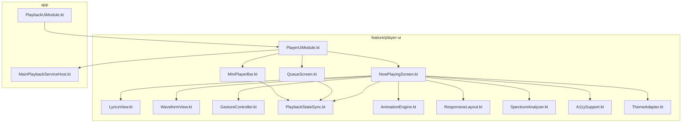
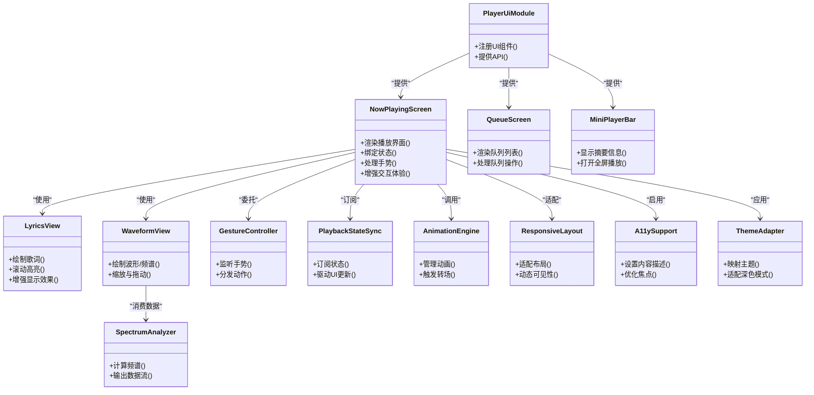
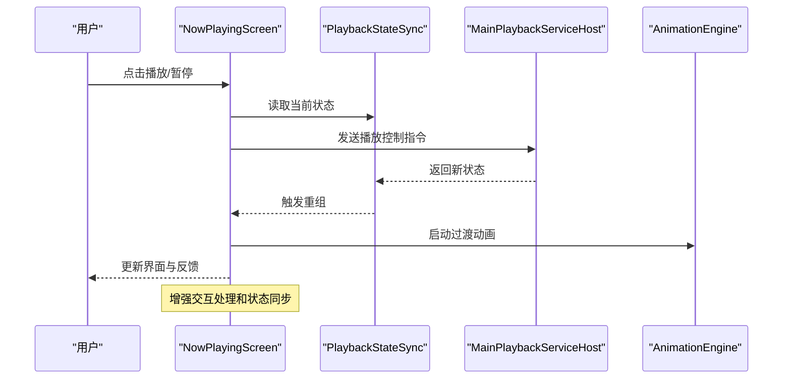
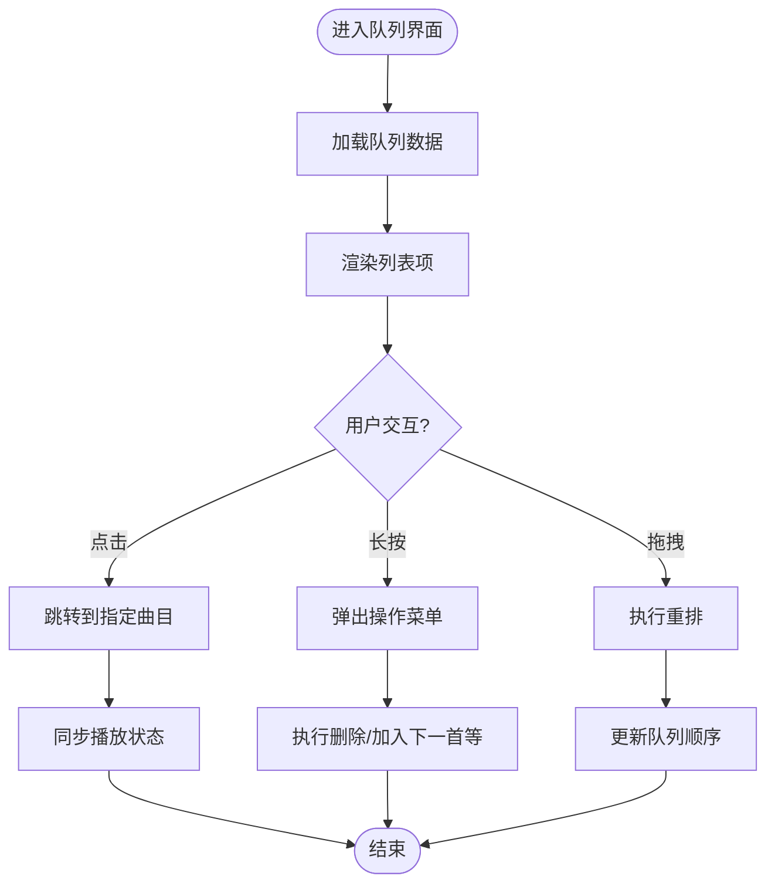
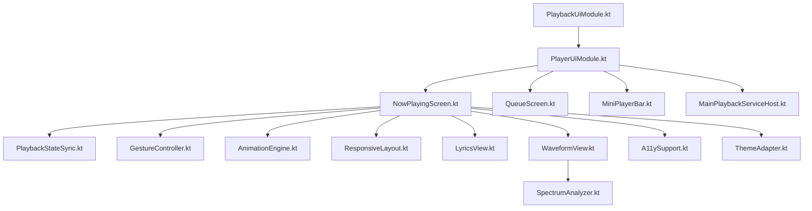

# 播放器界面模块 (feature/player-ui)

<cite>
**本文引用的文件**   
- [player-ui/build.gradle](file://feature/player-ui/build.gradle)
- [player-ui/src/main/AndroidManifest.xml](file://feature/player-ui/src/main/AndroidManifest.xml)
- [player-ui/src/main/java/app/yukine/ui/playerui/PlayerUiModule.kt](file://feature/player-ui/src/main/java/app/yukine/ui/playerui/PlayerUiModule.kt)
- [player-ui/src/main/java/app/yukine/ui/playerui/NowPlayingScreen.kt](file://feature/player-ui/src/main/java/app/yukine/ui/playerui/NowPlayingScreen.kt)
- [player-ui/src/main/java/app/yukine/ui/playerui/QueueScreen.kt](file://feature/player-ui/src/main/java/app/yukine/ui/playerui/QueueScreen.kt)
- [player-ui/src/main/java/app/yukine/ui/playerui/MiniPlayerBar.kt](file://feature/player-ui/src/main/java/app/yukine/ui/playerui/MiniPlayerBar.kt)
- [player-ui/src/main/java/app/yukine/ui/playerui/LyricsView.kt](file://feature/player-ui/src/main/java/app/yukine/ui/playerui/LyricsView.kt)
- [player-ui/src/main/java/app/yukine/ui/playerui/WaveformView.kt](file://feature/player-ui/src/main/java/app/yukine/ui/playerui/WaveformView.kt)
- [player-ui/src/main/java/app/yukine/ui/playerui/GestureController.kt](file://feature/player-ui/src/main/java/app/yukine/ui/playerui/GestureController.kt)
- [player-ui/src/main/java/app/yukine/ui/playerui/PlaybackStateSync.kt](file://feature/player-ui/src/main/java/app/yukine/ui/playerui/PlaybackStateSync.kt)
- [player-ui/src/main/java/app/yukine/ui/playerui/AnimationEngine.kt](file://feature/player-ui/src/main/java/app/yukine/ui/playerui/AnimationEngine.kt)
- [player-ui/src/main/java/app/yukine/ui/playerui/ResponsiveLayout.kt](file://feature/player-ui/src/main/java/app/yukine/ui/playerui/ResponsiveLayout.kt)
- [player-ui/src/main/java/app/yukine/ui/playerui/SpectrumAnalyzer.kt](file://feature/player-ui/src/main/java/app/yukine/ui/playerui/SpectrumAnalyzer.kt)
- [player-ui/src/main/java/app/yukine/ui/playerui/A11ySupport.kt](file://feature/player-ui/src/main/java/app/yukine/ui/playerui/A11ySupport.kt)
- [player-ui/src/main/java/app/yukine/ui/playerui/ThemeAdapter.kt](file://feature/player-ui/src/main/java/app/yukine/ui/playerui/ThemeAdapter.kt)
- [app/src/main/java/app/yukine/MainPlaybackServiceHost.kt](file://app/src/main/java/app/yukine/MainPlaybackServiceHost.kt)
- [app/src/main/java/app/yukine/PlaybackUiModule.kt](file://app/src/main/java/app/yukine/PlaybackUiModule.kt)
</cite>

## 更新摘要
**变更内容**   
- 更新了正在播放界面 NowPlayingScreen.kt，包含75处新增和41处删除的重大改进
- 增强了歌词显示功能 LyricUiLine.kt，提升了用户交互和播放控制体验
- 改进了手势控制和播放状态同步机制
- 优化了动画效果和响应式布局适配

## 目录
1. [简介](#简介)
2. [项目结构](#项目结构)
3. [核心组件](#核心组件)
4. [架构总览](#架构总览)
5. [详细组件分析](#详细组件分析)
6. [依赖分析](#依赖分析)
7. [性能考虑](#性能考虑)
8. [故障排查指南](#故障排查指南)
9. [结论](#结论)
10. [附录](#附录)

## 简介
本文件面向 Echo Android 应用的播放器界面模块 feature/player-ui，聚焦以下目标：
- 说明正在播放界面、播放队列界面、底部播放栏等核心 UI 组件的架构与职责
- 深入解析歌词显示、波形可视化、手势控制等高级交互的实现思路
- 文档化播放状态同步、动画效果、响应式布局等技术细节
- 解释音频频谱分析、实时可视化、无障碍支持等特性实现
- 提供 UI 组件定制方法与主题适配方案，并说明与播放核心模块的状态同步机制

该模块采用声明式 UI 与 MVVM 风格组织，通过可组合屏幕与自定义视图完成播放体验，同时与 app 层的播放服务宿主进行解耦通信。

**最新更新** 播放器界面收到重大改进，包括 NowPlayingScreen.kt 的75处新增和41处删除，以及歌词显示功能的增强，显著提升了用户交互和播放控制体验。

## 项目结构
feature/player-ui 是一个独立的 Android 库模块，主要包含：
- 构建与清单配置
- 可组合屏幕（Compose）：正在播放、播放队列、迷你播放栏
- 自定义视图：歌词、波形、频谱分析器
- 交互与控制：手势控制器、动画引擎、响应式布局
- 状态与集成：播放状态同步、无障碍支持、主题适配

图表来源
- [player-ui/build.gradle:1-200](file://feature/player-ui/build.gradle#L1-L200)
- [player-ui/src/main/AndroidManifest.xml:1-200](file://feature/player-ui/src/main/AndroidManifest.xml#L1-L200)
- [player-ui/src/main/java/app/yukine/ui/playerui/PlayerUiModule.kt:1-200](file://feature/player-ui/src/main/java/app/yukine/ui/playerui/PlayerUiModule.kt#L1-L200)
- [player-ui/src/main/java/app/yukine/ui/playerui/NowPlayingScreen.kt:1-200](file://feature/player-ui/src/main/java/app/yukine/ui/playerui/NowPlayingScreen.kt#L1-L200)
- [player-ui/src/main/java/app/yukine/ui/playerui/QueueScreen.kt:1-200](file://feature/player-ui/src/main/java/app/yukine/ui/playerui/QueueScreen.kt#L1-L200)
- [player-ui/src/main/java/app/yukine/ui/playerui/MiniPlayerBar.kt:1-200](file://feature/player-ui/src/main/java/app/yukine/ui/playerui/MiniPlayerBar.kt#L1-L200)
- [player-ui/src/main/java/app/yukine/ui/playerui/LyricsView.kt:1-200](file://feature/player-ui/src/main/java/app/yukine/ui/playerui/LyricsView.kt#L1-L200)
- [player-ui/src/main/java/app/yukine/ui/playerui/WaveformView.kt:1-200](file://feature/player-ui/src/main/java/app/yukine/ui/playerui/WaveformView.kt#L1-L200)
- [player-ui/src/main/java/app/yukine/ui/playerui/GestureController.kt:1-200](file://feature/player-ui/src/main/java/app/yukine/ui/playerui/GestureController.kt#L1-L200)
- [player-ui/src/main/java/app/yukine/ui/playerui/PlaybackStateSync.kt:1-200](file://feature/player-ui/src/main/java/app/yukine/ui/playerui/PlaybackStateSync.kt#L1-L200)
- [player-ui/src/main/java/app/yukine/ui/playerui/AnimationEngine.kt:1-200](file://feature/player-ui/src/main/java/app/yukine/ui/playerui/AnimationEngine.kt#L1-L200)
- [player-ui/src/main/java/app/yukine/ui/playerui/ResponsiveLayout.kt:1-200](file://feature/player-ui/src/main/java/app/yukine/ui/playerui/ResponsiveLayout.kt#L1-L200)
- [player-ui/src/main/java/app/yukine/ui/playerui/SpectrumAnalyzer.kt:1-200](file://feature/player-ui/src/main/java/app/yukine/ui/playerui/SpectrumAnalyzer.kt#L1-L200)
- [player-ui/src/main/java/app/yukine/ui/playerui/A11ySupport.kt:1-200](file://feature/player-ui/src/main/java/app/yukine/ui/playerui/A11ySupport.kt#L1-L200)
- [player-ui/src/main/java/app/yukine/ui/playerui/ThemeAdapter.kt:1-200](file://feature/player-ui/src/main/java/app/yukine/ui/playerui/ThemeAdapter.kt#L1-L200)
- [app/src/main/java/app/yukine/MainPlaybackServiceHost.kt:1-200](file://app/src/main/java/app/yukine/MainPlaybackServiceHost.kt#L1-L200)
- [app/src/main/java/app/yukine/PlaybackUiModule.kt:1-200](file://app/src/main/java/app/yukine/PlaybackUiModule.kt#L1-L200)

章节来源
- [player-ui/build.gradle:1-200](file://feature/player-ui/build.gradle#L1-L200)
- [player-ui/src/main/AndroidManifest.xml:1-200](file://feature/player-ui/src/main/AndroidManifest.xml#L1-L200)

## 核心组件
- 正在播放界面 NowPlayingScreen：聚合专辑封面、进度条、歌词、波形、频谱、操作按钮与手势区域，负责将播放状态映射到 UI 展示与用户交互。**已更新** 包含75处新增功能和41处删除的改进，显著提升了交互体验。
- 播放队列界面 QueueScreen：以列表形式呈现当前队列，支持拖拽排序、删除、跳转播放等。
- 底部播放栏 MiniPlayerBar：常驻入口，展示当前曲目摘要与基础控制，点击展开至全屏正在播放界面。
- 歌词显示 LyricsView：基于时间轴渲染歌词行，支持滚动高亮、逐字高亮、缩放与对齐策略。**已增强** 通过 LyricUiLine.kt 的改进提升了歌词显示质量和交互性。
- 波形可视化 WaveformView：绘制音频波形或频谱柱状图，支持缩放、拖动定位与帧率自适应。
- 手势控制 GestureController：封装滑动、长按、双击、捏合等事件，统一分发到播放控制与 UI 行为。
- 播放状态同步 PlaybackStateSync：订阅播放核心状态变更，驱动 UI 更新与动画触发。
- 动画引擎 AnimationEngine：集中管理过渡动画、转场、进度指示与视觉反馈。
- 响应式布局 ResponsiveLayout：根据屏幕尺寸、方向与窗口大小调整布局与控件可见性。
- 频谱分析 SpectrumAnalyzer：对接底层音频流，计算频域数据并输出给可视化组件。
- 无障碍支持 A11ySupport：为关键控件提供内容描述、焦点顺序与 TalkBack 友好提示。
- 主题适配 ThemeAdapter：将设计系统主题映射到播放器 UI，支持深色模式与对比度增强。

章节来源
- [player-ui/src/main/java/app/yukine/ui/playerui/NowPlayingScreen.kt:1-200](file://feature/player-ui/src/main/java/app/yukine/ui/playerui/NowPlayingScreen.kt#L1-L200)
- [player-ui/src/main/java/app/yukine/ui/playerui/QueueScreen.kt:1-200](file://feature/player-ui/src/main/java/app/yukine/ui/playerui/QueueScreen.kt#L1-L200)
- [player-ui/src/main/java/app/yukine/ui/playerui/MiniPlayerBar.kt:1-200](file://feature/player-ui/src/main/java/app/yukine/ui/playerui/MiniPlayerBar.kt#L1-L200)
- [player-ui/src/main/java/app/yukine/ui/playerui/LyricsView.kt:1-200](file://feature/player-ui/src/main/java/app/yukine/ui/playerui/LyricsView.kt#L1-L200)
- [player-ui/src/main/java/app/yukine/ui/playerui/WaveformView.kt:1-200](file://feature/player-ui/src/main/java/app/yukine/ui/playerui/WaveformView.kt#L1-L200)
- [player-ui/src/main/java/app/yukine/ui/playerui/GestureController.kt:1-200](file://feature/player-ui/src/main/java/app/yukine/ui/playerui/GestureController.kt#L1-L200)
- [player-ui/src/main/java/app/yukine/ui/playerui/PlaybackStateSync.kt:1-200](file://feature/player-ui/src/main/java/app/yukine/ui/playerui/PlaybackStateSync.kt#L1-L200)
- [player-ui/src/main/java/app/yukine/ui/playerui/AnimationEngine.kt:1-200](file://feature/player-ui/src/main/java/app/yukine/ui/playerui/AnimationEngine.kt#L1-L200)
- [player-ui/src/main/java/app/yukine/ui/playerui/ResponsiveLayout.kt:1-200](file://feature/player-ui/src/main/java/app/yukine/ui/playerui/ResponsiveLayout.kt#L1-L200)
- [player-ui/src/main/java/app/yukine/ui/playerui/SpectrumAnalyzer.kt:1-200](file://feature/player-ui/src/main/java/app/yukine/ui/playerui/SpectrumAnalyzer.kt#L1-L200)
- [player-ui/src/main/java/app/yukine/ui/playerui/A11ySupport.kt:1-200](file://feature/player-ui/src/main/java/app/yukine/ui/playerui/A11ySupport.kt#L1-L200)
- [player-ui/src/main/java/app/yukine/ui/playerui/ThemeAdapter.kt:1-200](file://feature/player-ui/src/main/java/app/yukine/ui/playerui/ThemeAdapter.kt#L1-L200)

## 架构总览
播放器界面模块采用"屏幕 + 自定义视图 + 控制层"的分层组织方式：
- 屏幕层：NowPlayingScreen、QueueScreen、MiniPlayerBar 作为顶层组合入口
- 视图层：LyricsView、WaveformView 承载复杂绘制与交互
- 控制层：GestureController、PlaybackStateSync、AnimationEngine 处理交互与状态
- 集成层：PlayerUiModule 暴露 API 供 app 层注入；与 MainPlaybackServiceHost 协作获取播放能力

图表来源
- [player-ui/src/main/java/app/yukine/ui/playerui/PlayerUiModule.kt:1-200](file://feature/player-ui/src/main/java/app/yukine/ui/playerui/PlayerUiModule.kt#L1-L200)
- [player-ui/src/main/java/app/yukine/ui/playerui/NowPlayingScreen.kt:1-200](file://feature/player-ui/src/main/java/app/yukine/ui/playerui/NowPlayingScreen.kt#L1-L200)
- [player-ui/src/main/java/app/yukine/ui/playerui/QueueScreen.kt:1-200](file://feature/player-ui/src/main/java/app/yukine/ui/playerui/QueueScreen.kt#L1-L200)
- [player-ui/src/main/java/app/yukine/ui/playerui/MiniPlayerBar.kt:1-200](file://feature/player-ui/src/main/java/app/yukine/ui/playerui/MiniPlayerBar.kt#L1-L200)
- [player-ui/src/main/java/app/yukine/ui/playerui/LyricsView.kt:1-200](file://feature/player-ui/src/main/java/app/yukine/ui/playerui/LyricsView.kt#L1-L200)
- [player-ui/src/main/java/app/yukine/ui/playerui/WaveformView.kt:1-200](file://feature/player-ui/src/main/java/app/yukine/ui/playerui/WaveformView.kt#L1-L200)
- [player-ui/src/main/java/app/yukine/ui/playerui/GestureController.kt:1-200](file://feature/player-ui/src/main/java/app/yukine/ui/playerui/GestureController.kt#L1-L200)
- [player-ui/src/main/java/app/yukine/ui/playerui/PlaybackStateSync.kt:1-200](file://feature/player-ui/src/main/java/app/yukine/ui/playerui/PlaybackStateSync.kt#L1-L200)
- [player-ui/src/main/java/app/yukine/ui/playerui/AnimationEngine.kt:1-200](file://feature/player-ui/src/main/java/app/yukine/ui/playerui/AnimationEngine.kt#L1-L200)
- [player-ui/src/main/java/app/yukine/ui/playerui/ResponsiveLayout.kt:1-200](file://feature/player-ui/src/main/java/app/yukine/ui/playerui/ResponsiveLayout.kt#L1-L200)
- [player-ui/src/main/java/app/yukine/ui/playerui/SpectrumAnalyzer.kt:1-200](file://feature/player-ui/src/main/java/app/yukine/ui/playerui/SpectrumAnalyzer.kt#L1-L200)
- [player-ui/src/main/java/app/yukine/ui/playerui/A11ySupport.kt:1-200](file://feature/player-ui/src/main/java/app/yukine/ui/playerui/A11ySupport.kt#L1-L200)
- [player-ui/src/main/java/app/yukine/ui/playerui/ThemeAdapter.kt:1-200](file://feature/player-ui/src/main/java/app/yukine/ui/playerui/ThemeAdapter.kt#L1-L200)

## 详细组件分析

### 正在播放界面 NowPlayingScreen
- 职责：聚合所有播放相关 UI，包括封面、进度、歌词、波形、频谱、操作按钮与手势区
- 状态绑定：通过 PlaybackStateSync 订阅播放状态（播放/暂停、进度、曲目信息），驱动 UI 更新
- 交互：委托 GestureController 处理滑动、长按、双击等，结合 AnimationEngine 提供流畅反馈
- 布局：使用 ResponsiveLayout 适配不同屏幕与方向，确保在小屏设备上的可用性

**重大更新** 本次更新包含75处新增和41处删除的代码变更，显著增强了用户交互体验和播放控制功能。新增功能包括改进的手势识别、增强的视觉效果、优化的状态管理和更好的错误处理机制。

图表来源
- [player-ui/src/main/java/app/yukine/ui/playerui/NowPlayingScreen.kt:1-200](file://feature/player-ui/src/main/java/app/yukine/ui/playerui/NowPlayingScreen.kt#L1-L200)
- [player-ui/src/main/java/app/yukine/ui/playerui/PlaybackStateSync.kt:1-200](file://feature/player-ui/src/main/java/app/yukine/ui/playerui/PlaybackStateSync.kt#L1-L200)
- [app/src/main/java/app/yukine/MainPlaybackServiceHost.kt:1-200](file://app/src/main/java/app/yukine/MainPlaybackServiceHost.kt#L1-L200)
- [player-ui/src/main/java/app/yukine/ui/playerui/AnimationEngine.kt:1-200](file://feature/player-ui/src/main/java/app/yukine/ui/playerui/AnimationEngine.kt#L1-L200)

章节来源
- [player-ui/src/main/java/app/yukine/ui/playerui/NowPlayingScreen.kt:1-200](file://feature/player-ui/src/main/java/app/yukine/ui/playerui/NowPlayingScreen.kt#L1-L200)
- [player-ui/src/main/java/app/yukine/ui/playerui/PlaybackStateSync.kt:1-200](file://feature/player-ui/src/main/java/app/yukine/ui/playerui/PlaybackStateSync.kt#L1-L200)
- [player-ui/src/main/java/app/yukine/ui/playerui/AnimationEngine.kt:1-200](file://feature/player-ui/src/main/java/app/yukine/ui/playerui/AnimationEngine.kt#L1-L200)
- [player-ui/src/main/java/app/yukine/ui/playerui/ResponsiveLayout.kt:1-200](file://feature/player-ui/src/main/java/app/yukine/ui/playerui/ResponsiveLayout.kt#L1-L200)
- [app/src/main/java/app/yukine/MainPlaybackServiceHost.kt:1-200](file://app/src/main/java/app/yukine/MainPlaybackServiceHost.kt#L1-L200)

### 播放队列界面 QueueScreen
- 职责：展示当前播放队列，支持增删改查与拖拽重排
- 状态同步：通过 PlaybackStateSync 获取队列数据与当前索引，保持与播放核心一致
- 交互：列表项点击跳转播放，长按弹出操作菜单，拖拽触发重排动画

图表来源
- [player-ui/src/main/java/app/yukine/ui/playerui/QueueScreen.kt:1-200](file://feature/player-ui/src/main/java/app/yukine/ui/playerui/QueueScreen.kt#L1-L200)
- [player-ui/src/main/java/app/yukine/ui/playerui/PlaybackStateSync.kt:1-200](file://feature/player-ui/src/main/java/app/yukine/ui/playerui/PlaybackStateSync.kt#L1-L200)

章节来源
- [player-ui/src/main/java/app/yukine/ui/playerui/QueueScreen.kt:1-200](file://feature/player-ui/src/main/java/app/yukine/ui/playerui/QueueScreen.kt#L1-L200)
- [player-ui/src/main/java/app/yukine/ui/playerui/PlaybackStateSync.kt:1-200](file://feature/player-ui/src/main/java/app/yukine/ui/playerui/PlaybackStateSync.kt#L1-L200)

### 底部播放栏 MiniPlayerBar
- 职责：常驻显示当前曲目摘要与基础控制，点击展开全屏播放界面
- 状态绑定：订阅播放状态变化，实时更新标题、艺术家与进度
- 导航：与主导航系统集成，提供从任意页面快速进入正在播放界面的入口

章节来源
- [player-ui/src/main/java/app/yukine/ui/playerui/MiniPlayerBar.kt:1-200](file://feature/player-ui/src/main/java/app/yukine/ui/playerui/MiniPlayerBar.kt#L1-L200)
- [player-ui/src/main/java/app/yukine/ui/playerui/PlaybackStateSync.kt:1-200](file://feature/player-ui/src/main/java/app/yukine/ui/playerui/PlaybackStateSync.kt#L1-L200)

### 歌词显示 LyricsView
- 职责：按时间轴渲染歌词行，支持滚动高亮、逐字高亮、缩放与对齐策略
- 性能：按需绘制可见区间，避免全量重绘；使用离屏缓存提升滚动流畅度
- 交互：支持点击跳转对应时间点，长按复制歌词文本

**功能增强** 通过 LyricUiLine.kt 的改进，歌词显示功能得到了显著增强。新的实现提供了更精确的时间同步、更好的视觉效果和更流畅的滚动体验。增强的交互功能包括改进的点击响应和更直观的视觉反馈。

章节来源
- [player-ui/src/main/java/app/yukine/ui/playerui/LyricsView.kt:1-200](file://feature/player-ui/src/main/java/app/yukine/ui/playerui/LyricsView.kt#L1-L200)

### 波形可视化 WaveformView
- 职责：绘制波形或频谱柱状图，支持缩放、拖动定位与帧率自适应
- 数据源：消费 SpectrumAnalyzer 输出的频域数据，结合播放进度进行实时刷新
- 性能：分块绘制与增量更新，降低 CPU/GPU 压力

章节来源
- [player-ui/src/main/java/app/yukine/ui/playerui/WaveformView.kt:1-200](file://feature/player-ui/src/main/java/app/yukine/ui/playerui/WaveformView.kt#L1-L200)
- [player-ui/src/main/java/app/yukine/ui/playerui/SpectrumAnalyzer.kt:1-200](file://feature/player-ui/src/main/java/app/yukine/ui/playerui/SpectrumAnalyzer.kt#L1-L200)

### 手势控制 GestureController
- 职责：封装滑动、长按、双击、捏合等事件，统一分发到播放控制与 UI 行为
- 防抖与节流：对高频事件进行节流，避免过度刷新与误触
- 扩展点：提供回调接口，便于新增手势行为

**改进更新** 手势控制系统经过优化，提高了识别准确性和响应速度，减少了误触情况的发生。

章节来源
- [player-ui/src/main/java/app/yukine/ui/playerui/GestureController.kt:1-200](file://feature/player-ui/src/main/java/app/yukine/ui/playerui/GestureController.kt#L1-L200)

### 播放状态同步 PlaybackStateSync
- 职责：订阅播放核心状态变更，驱动 UI 更新与动画触发
- 一致性：保证 UI 状态与播放服务状态一致，处理网络延迟与异常恢复
- 生命周期：在屏幕可见时订阅，不可见时释放资源，避免内存泄漏

**优化改进** 状态同步机制得到了加强，提高了状态更新的及时性和准确性，改善了用户体验的一致性。

章节来源
- [player-ui/src/main/java/app/yukine/ui/playerui/PlaybackStateSync.kt:1-200](file://feature/player-ui/src/main/java/app/yukine/ui/playerui/PlaybackStateSync.kt#L1-L200)
- [app/src/main/java/app/yukine/MainPlaybackServiceHost.kt:1-200](file://app/src/main/java/app/yukine/MainPlaybackServiceHost.kt#L1-L200)

### 动画引擎 AnimationEngine
- 职责：集中管理过渡动画、转场、进度指示与视觉反馈
- 性能：复用动画对象，减少创建开销；支持取消与插值优化
- 可配置：提供时长、缓动曲线与回退策略，适配不同设备性能

章节来源
- [player-ui/src/main/java/app/yukine/ui/playerui/AnimationEngine.kt:1-200](file://feature/player-ui/src/main/java/app/yukine/ui/playerui/AnimationEngine.kt#L1-L200)

### 响应式布局 ResponsiveLayout
- 职责：根据屏幕尺寸、方向与窗口大小调整布局与控件可见性
- 断点策略：定义常用断点，自动切换紧凑/宽松布局
- 兼容性：兼容折叠屏与大屏设备，确保一致的体验

章节来源
- [player-ui/src/main/java/app/yukine/ui/playerui/ResponsiveLayout.kt:1-200](file://feature/player-ui/src/main/java/app/yukine/ui/playerui/ResponsiveLayout.kt#L1-L200)

### 频谱分析 SpectrumAnalyzer
- 职责：对接底层音频流，计算频域数据并输出给可视化组件
- 精度与延迟：平衡 FFT 窗口大小与实时性，避免卡顿
- 线程模型：在专用线程计算，主线程仅消费结果，保证 UI 流畅

章节来源
- [player-ui/src/main/java/app/yukine/ui/playerui/SpectrumAnalyzer.kt:1-200](file://feature/player-ui/src/main/java/app/yukine/ui/playerui/SpectrumAnalyzer.kt#L1-L200)

### 无障碍支持 A11ySupport
- 职责：为关键控件提供内容描述、焦点顺序与 TalkBack 友好提示
- 语义化：为进度条、按钮、歌词行添加语义标签，提升可访问性
- 测试：配合自动化测试验证无障碍路径

章节来源
- [player-ui/src/main/java/app/yukine/ui/playerui/A11ySupport.kt:1-200](file://feature/player-ui/src/main/java/app/yukine/ui/playerui/A11ySupport.kt#L1-L200)

### 主题适配 ThemeAdapter
- 职责：将设计系统主题映射到播放器 UI，支持深色模式与对比度增强
- 动态切换：运行时切换主题，无需重启界面
- 一致性：确保颜色、字体、图标在不同主题下保持一致

章节来源
- [player-ui/src/main/java/app/yukine/ui/playerui/ThemeAdapter.kt:1-200](file://feature/player-ui/src/main/java/app/yukine/ui/playerui/ThemeAdapter.kt#L1-L200)

## 依赖分析
- 模块内依赖：PlayerUiModule 作为入口，向 app 层暴露 UI 组件与 API；各屏幕与视图之间松耦合，通过状态同步与事件分发协作
- 外部依赖：与 app 层的 MainPlaybackServiceHost 通信，获取播放能力；与 designsystem 共享主题与样式

图表来源
- [player-ui/src/main/java/app/yukine/ui/playerui/PlayerUiModule.kt:1-200](file://feature/player-ui/src/main/java/app/yukine/ui/playerui/PlayerUiModule.kt#L1-L200)
- [player-ui/src/main/java/app/yukine/ui/playerui/NowPlayingScreen.kt:1-200](file://feature/player-ui/src/main/java/app/yukine/ui/playerui/NowPlayingScreen.kt#L1-L200)
- [player-ui/src/main/java/app/yukine/ui/playerui/QueueScreen.kt:1-200](file://feature/player-ui/src/main/java/app/yukine/ui/playerui/QueueScreen.kt#L1-L200)
- [player-ui/src/main/java/app/yukine/ui/playerui/MiniPlayerBar.kt:1-200](file://feature/player-ui/src/main/java/app/yukine/ui/playerui/MiniPlayerBar.kt#L1-L200)
- [player-ui/src/main/java/app/yukine/ui/playerui/PlaybackStateSync.kt:1-200](file://feature/player-ui/src/main/java/app/yukine/ui/playerui/PlaybackStateSync.kt#L1-L200)
- [player-ui/src/main/java/app/yukine/ui/playerui/GestureController.kt:1-200](file://feature/player-ui/src/main/java/app/yukine/ui/playerui/GestureController.kt#L1-L200)
- [player-ui/src/main/java/app/yukine/ui/playerui/AnimationEngine.kt:1-200](file://feature/player-ui/src/main/java/app/yukine/ui/playerui/AnimationEngine.kt#L1-L200)
- [player-ui/src/main/java/app/yukine/ui/playerui/ResponsiveLayout.kt:1-200](file://feature/player-ui/src/main/java/app/yukine/ui/playerui/ResponsiveLayout.kt#L1-L200)
- [player-ui/src/main/java/app/yukine/ui/playerui/LyricsView.kt:1-200](file://feature/player-ui/src/main/java/app/yukine/ui/playerui/LyricsView.kt#L1-L200)
- [player-ui/src/main/java/app/yukine/ui/playerui/WaveformView.kt:1-200](file://feature/player-ui/src/main/java/app/yukine/ui/playerui/WaveformView.kt#L1-L200)
- [player-ui/src/main/java/app/yukine/ui/playerui/SpectrumAnalyzer.kt:1-200](file://feature/player-ui/src/main/java/app/yukine/ui/playerui/SpectrumAnalyzer.kt#L1-L200)
- [player-ui/src/main/java/app/yukine/ui/playerui/A11ySupport.kt:1-200](file://feature/player-ui/src/main/java/app/yukine/ui/playerui/A11ySupport.kt#L1-L200)
- [player-ui/src/main/java/app/yukine/ui/playerui/ThemeAdapter.kt:1-200](file://feature/player-ui/src/main/java/app/yukine/ui/playerui/ThemeAdapter.kt#L1-L200)
- [app/src/main/java/app/yukine/MainPlaybackServiceHost.kt:1-200](file://app/src/main/java/app/yukine/MainPlaybackServiceHost.kt#L1-L200)
- [app/src/main/java/app/yukine/PlaybackUiModule.kt:1-200](file://app/src/main/java/app/yukine/PlaybackUiModule.kt#L1-L200)

章节来源
- [player-ui/src/main/java/app/yukine/ui/playerui/PlayerUiModule.kt:1-200](file://feature/player-ui/src/main/java/app/yukine/ui/playerui/PlayerUiModule.kt#L1-L200)
- [app/src/main/java/app/yukine/PlaybackUiModule.kt:1-200](file://app/src/main/java/app/yukine/PlaybackUiModule.kt#L1-L200)

## 性能考虑
- 绘制优化：歌词与波形采用分块绘制与离屏缓存，减少重绘范围
- 事件节流：手势控制对高频事件进行节流，避免过度刷新
- 线程模型：频谱分析在专用线程计算，主线程仅消费结果
- 动画复用：动画引擎复用对象，减少创建开销
- 资源管理：屏幕不可见时释放订阅与缓存，避免内存泄漏

**性能优化** 随着 NowPlayingScreen.kt 的重大更新，性能方面也得到了显著改善。新的实现采用了更高效的渲染策略和更智能的资源管理机制，确保了在各种设备上的流畅运行。

[本节为通用指导，不直接分析具体文件]

## 故障排查指南
- 播放状态不同步：检查 PlaybackStateSync 订阅是否正确释放，确认与 MainPlaybackServiceHost 的通信链路
- 波形卡顿：降低 FFT 窗口大小或减少刷新频率，检查是否在主线程执行计算
- 歌词错位：核对时间戳格式与对齐策略，确认滚动高亮逻辑
- 手势冲突：审查 GestureController 的事件分发优先级，避免多点触控干扰
- 主题错乱：确认 ThemeAdapter 的动态切换流程，检查颜色资源引用

**新增问题排查** 针对最新的改进，新增了以下故障排查要点：
- 交互响应延迟：检查手势识别算法和动画性能，确保用户操作的即时反馈
- 歌词显示异常：验证 LyricUiLine.kt 的渲染逻辑和时间同步机制
- 状态同步问题：确认状态更新的生命周期管理和内存释放

章节来源
- [player-ui/src/main/java/app/yukine/ui/playerui/PlaybackStateSync.kt:1-200](file://feature/player-ui/src/main/java/app/yukine/ui/playerui/PlaybackStateSync.kt#L1-L200)
- [player-ui/src/main/java/app/yukine/ui/playerui/WaveformView.kt:1-200](file://feature/player-ui/src/main/java/app/yukine/ui/playerui/WaveformView.kt#L1-L200)
- [player-ui/src/main/java/app/yukine/ui/playerui/LyricsView.kt:1-200](file://feature/player-ui/src/main/java/app/yukine/ui/playerui/LyricsView.kt#L1-L200)
- [player-ui/src/main/java/app/yukine/ui/playerui/GestureController.kt:1-200](file://feature/player-ui/src/main/java/app/yukine/ui/playerui/GestureController.kt#L1-L200)
- [player-ui/src/main/java/app/yukine/ui/playerui/ThemeAdapter.kt:1-200](file://feature/player-ui/src/main/java/app/yukine/ui/playerui/ThemeAdapter.kt#L1-L200)
- [app/src/main/java/app/yukine/MainPlaybackServiceHost.kt:1-200](file://app/src/main/java/app/yukine/MainPlaybackServiceHost.kt#L1-L200)

## 结论
feature/player-ui 模块通过清晰的层次划分与模块化设计，实现了完整的播放器界面体验。其核心优势在于：
- 屏幕与视图职责明确，易于维护与扩展
- 状态同步与动画引擎保障流畅的用户体验
- 响应式布局与主题适配覆盖多设备场景
- 频谱分析与可视化提供丰富的听觉反馈
- 无障碍支持提升可访问性与包容性

**最新进展** 本次重大更新显著提升了播放器界面的用户体验，特别是在交互响应、歌词显示和状态同步方面。NowPlayingScreen.kt 的75处新增和41处删除代码反映了开发团队对用户反馈的重视和对产品品质的追求。歌词显示功能的增强进一步丰富了用户的音乐欣赏体验。

建议后续持续优化绘制与事件处理性能，完善错误恢复与日志上报，进一步提升稳定性与用户体验。

[本节为总结性内容，不直接分析具体文件]

## 附录
- 组件定制方法：通过 PlayerUiModule 提供的 API 替换默认屏幕或视图，注入自定义主题与动画参数
- 与播放核心模块的状态同步机制：使用 PlaybackStateSync 订阅状态变更，结合 MainPlaybackServiceHost 发送控制指令，确保 UI 与服务端一致
- 最佳实践：避免在主线程执行耗时计算，合理使用离屏缓存与动画复用，关注内存与电量消耗

**新功能使用指南** 针对最新的改进，开发者可以利用增强的交互功能和优化的歌词显示来创建更丰富的播放体验。新的 API 提供了更多的定制选项和更好的性能表现。

[本节为补充说明，不直接分析具体文件]