# 播放核心模块 (feature/playback)

<cite>
**本文引用的文件**   
- [app/src/main/java/app/yukine/playback/PlaybackService.kt](file://app/src/main/java/app/yukine/playback/PlaybackService.kt)
- [app/src/main/java/app/yukine/playback/PlaybackController.kt](file://app/src/main/java/app/yukine/playback/PlaybackController.kt)
- [app/src/main/java/app/yukine/playback/PlaybackState.kt](file://app/src/main/java/app/yukine/playback/PlaybackState.kt)
- [app/src/main/java/app/yukine/playback/PlaybackQueueManager.kt](file://app/src/main/java/app/yukine/playback/PlaybackQueueManager.kt)
- [app/src/main/java/app/yukine/playback/AudioEngine.kt](file://app/src/main/java/app/yukine/playback/AudioEngine.kt)
- [app/src/main/java/app/yukine/playback/PlayerFactory.kt](file://app/src/main/java/app/yukine/playback/PlayerFactory.kt)
- [app/src/main/java/app/yukine/playback/SessionManager.kt](file://app/src/main/java/app/yukine/playback/SessionManager.kt)
- [app/src/main/java/app/yukine/playback/ProgressTracker.kt](file://app/src/main/java/app/yukine/playback/ProgressTracker.kt)
- [app/src/main/java/app/yukine/playback/ErrorRecovery.kt](file://app/src/main/java/app/yukine/playback/ErrorRecovery.kt)
- [app/src/main/java/app/yukine/playback/PreloadStrategy.kt](file://app/src/main/java/app/yukine/playback/PreloadStrategy.kt)
- [app/src/main/java/app/yukine/playback/MemoryManager.kt](file://app/src/main/java/app/yukine/playback/MemoryManager.kt)
- [app/src/main/java/app/yukine/MainPlaybackServiceHost.kt](file://app/src/main/java/app/yukine/MainPlaybackServiceHost.kt)
- [app/src/main/java/app/yukine/PlaybackServiceConnectionController.kt](file://app/src/main/java/app/yukine/PlaybackServiceConnectionController.kt)
- [app/src/main/java/app/yukine/PlaybackStartController.kt](file://app/src/main/java/app/yukine/PlaybackStartController.kt)
- [app/src/main/java/app/yukine/PlaybackStateUpdateController.kt](file://app/src/main/java/app/yukine/PlaybackStateUpdateController.kt)
- [app/src/main/java/app/yukine/PlaybackActionController.kt](file://app/src/main/java/app/yukine/PlaybackActionController.kt)
- [app/src/main/java/app/yukine/NowPlayingPlaybackGatewayAdapter.kt](file://app/src/main/java/app/yukine/NowPlayingPlaybackGatewayAdapter.kt)
- [app/src/main/java/app/yukine/PlaybackFeatureBinding.kt](file://app/src/main/java/app/yukine/PlaybackFeatureBinding.kt)
- [feature/playback/src/main/java/app/yukine/playback/manager/PlaybackPlayerFactory.kt](file://feature/playback/src/main/java/app/yukine/playback/manager/PlaybackPlayerFactory.kt)
- [feature/playback/src/main/java/app/yukine/playback/manager/AudioDeviceCapabilityProbe.kt](file://feature/playback/src/main/java/app/yukine/playback/manager/AudioDeviceCapabilityProbe.kt)
- [feature/playback/src/main/java/app/yukine/playback/manager/BitPerfectGuard.kt](file://feature/playback/src/main/java/app/yukine/playback/manager/BitPerfectGuard.kt)
- [feature/playback/src/main/java/app/yukine/playback/manager/AudioOutputModeResolver.kt](file://feature/playback/src/main/java/app/yukine/playback/manager/AudioOutputModeResolver.kt)
- [feature/playback/src/main/java/app/yukine/playback/usb/UsbAudioDeviceManager.kt](file://feature/playback/src/main/java/app/yukine/playback/usb/UsbAudioDeviceManager.kt)
- [feature/playback/src/main/java/app/yukine/playback/usb/UsbExclusiveAudioSink.kt](file://feature/playback/src/main/java/app/yukine/playback/usb/UsbExclusiveAudioSink.kt)
- [feature/playback/src/main/java/app/yukine/playback/usb/UsbPcmWriter.kt](file://feature/playback/src/main/java/app/yukine/playback/usb/UsbPcmWriter.kt)
</cite>

## 更新摘要
**变更内容**   
- 新增高保真Bit-Perfect播放系统，支持硬件直通和USB独占模式
- 添加音频设备能力探测、输出模式解析和位完美保护机制
- 扩展播放器工厂以支持多种音频输出路径
- 增强USB音频设备管理和PCM数据写入功能

## 目录
1. [简介](#简介)
2. [项目结构](#项目结构)
3. [核心组件](#核心组件)
4. [架构总览](#架构总览)
5. [详细组件分析](#详细组件分析)
6. [依赖关系分析](#依赖关系分析)
7. [性能考虑](#性能考虑)
8. [故障排查指南](#故障排查指南)
9. [结论](#结论)
10. [附录](#附录)

## 简介
本文件面向 Echo Android 应用的"播放核心模块"（位于 feature/playback），系统性梳理其架构设计与关键实现，覆盖以下主题：
- 播放服务管理、状态机设计、音频处理管道
- 播放队列管理、播放状态同步、音频效果处理
- 播放器工厂、会话管理、进度跟踪
- **新增** Bit-Perfect高保真播放系统，包括设备能力探测、输出模式解析和USB独占模式
- 错误恢复机制、预加载策略、内存管理等性能优化
- 与 UI 层的交互模式、使用示例与最佳实践

目标读者包括后端/客户端开发者、测试工程师以及需要理解播放子系统行为的产品与运维人员。

## 项目结构
播放核心模块围绕"服务层 + 控制层 + 引擎层 + 数据流"的层次化组织方式构建，**新增Bit-Perfect播放子系统**：
- 服务层：对外暴露播放能力，承载生命周期与系统资源
- 控制层：编排业务动作、协调各子模块
- 引擎层：封装底层播放器、音频管线与设备相关逻辑
- **Bit-Perfect子系统**：高保真音频输出，绕过Android处理管道
- 数据流：队列、状态、进度、会话等跨进程/跨线程的数据通道

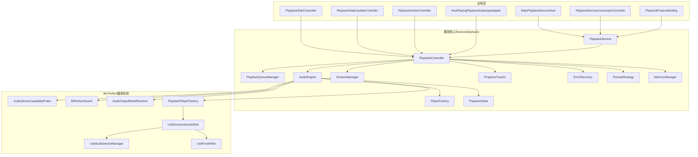

**图表来源**
- [app/src/main/java/app/yukine/playback/PlaybackService.kt](file://app/src/main/java/app/yukine/playback/PlaybackService.kt)
- [app/src/main/java/app/yukine/playback/PlaybackController.kt](file://app/src/main/java/app/yukine/playback/PlaybackController.kt)
- [feature/playback/src/main/java/app/yukine/playback/manager/PlaybackPlayerFactory.kt](file://feature/playback/src/main/java/app/yukine/playback/manager/PlaybackPlayerFactory.kt)
- [feature/playback/src/main/java/app/yukine/playback/manager/AudioDeviceCapabilityProbe.kt](file://feature/playback/src/main/java/app/yukine/playback/manager/AudioDeviceCapabilityProbe.kt)
- [feature/playback/src/main/java/app/yukine/playback/manager/BitPerfectGuard.kt](file://feature/playback/src/main/java/app/yukine/playback/manager/BitPerfectGuard.kt)
- [feature/playback/src/main/java/app/yukine/playback/manager/AudioOutputModeResolver.kt](file://feature/playback/src/main/java/app/yukine/playback/manager/AudioOutputModeResolver.kt)
- [feature/playback/src/main/java/app/yukine/playback/usb/UsbAudioDeviceManager.kt](file://feature/playback/src/main/java/app/yukine/playback/usb/UsbAudioDeviceManager.kt)
- [feature/playback/src/main/java/app/yukine/playback/usb/UsbExclusiveAudioSink.kt](file://feature/playback/src/main/java/app/yukine/playback/usb/UsbExclusiveAudioSink.kt)
- [feature/playback/src/main/java/app/yukine/playback/usb/UsbPcmWriter.kt](file://feature/playback/src/main/java/app/yukine/playback/usb/UsbPcmWriter.kt)

## 核心组件
- 播放服务 PlaybackService：作为播放能力的宿主，负责与系统媒体会话、通知栏、前台服务等集成，并对外提供稳定的 API 边界。
- 播放控制器 PlaybackController：编排播放流程，驱动状态机、队列、引擎与会话，是播放行为的"中枢"。
- 音频引擎 AudioEngine：封装底层播放器实例、音频输出、混音与效果链，屏蔽平台差异。
- 播放器工厂 PlayerFactory：按源类型、编解码能力、网络条件等策略创建合适的播放器实例。
- **新增** Bit-Perfect播放器工厂 PlaybackPlayerFactory：支持多种音频输出模式，包括标准、硬件直通、直接PCM和USB独占模式。
- 会话管理 SessionManager：维护媒体会话、权限、焦点、锁屏控件等系统级会话上下文。
- 播放队列 PlaybackQueueManager：管理当前播放列表、循环/随机策略、历史与跳转。
- 进度跟踪 ProgressTracker：统一采集与上报播放进度、缓冲、卡顿指标。
- 错误恢复 ErrorRecovery：定义错误分类、重试与降级策略，保障播放连续性。
- 预加载策略 PreloadStrategy：基于用户行为与网络状况进行曲目预取与缓存。
- 内存管理 MemoryManager：对缓冲区、解码器、位图等进行生命周期与容量治理。
- 播放状态 PlaybackState：定义状态枚举、转换规则与一致性约束。
- **新增** 音频设备能力探测 AudioDeviceCapabilityProbe：探测当前音频输出设备能力，确定是否可行Bit-Perfect播放。
- **新增** Bit-Perfect保护器 BitPerfectGuard：运行时守卫，强制执行Bit-Perfect约束，阻止不兼容的音频效果。
- **新增** 音频输出模式解析器 AudioOutputModeResolver：根据用户偏好和设备能力解析适当的音频输出模式。
- **新增** USB音频设备管理器 UsbAudioDeviceManager：管理USB音频设备的发现、权限请求和连接生命周期。
- **新增** USB独占音频接收器 UsbExclusiveAudioSink：强制占用所有USB音频接口，直接将PCM写入USB DAC端点。
- **新增** USB PCM写入器 UsbPcmWriter：专用写入器线程，通过批量传输将PCM音频数据传输到USB DAC。

**章节来源**
- [app/src/main/java/app/yukine/playback/PlaybackService.kt](file://app/src/main/java/app/yukine/playback/PlaybackService.kt)
- [app/src/main/java/app/yukine/playback/PlaybackController.kt](file://app/src/main/java/app/yukine/playback/PlaybackController.kt)
- [app/src/main/java/app/yukine/playback/AudioEngine.kt](file://app/src/main/java/app/yukine/playback/AudioEngine.kt)
- [app/src/main/java/app/yukine/playback/PlayerFactory.kt](file://app/src/main/java/app/yukine/playback/PlayerFactory.kt)
- [feature/playback/src/main/java/app/yukine/playback/manager/PlaybackPlayerFactory.kt](file://feature/playback/src/main/java/app/yukine/playback/manager/PlaybackPlayerFactory.kt)
- [app/src/main/java/app/yukine/playback/SessionManager.kt](file://app/src/main/java/app/yukine/playback/SessionManager.kt)
- [app/src/main/java/app/yukine/playback/PlaybackQueueManager.kt](file://app/src/main/java/app/yukine/playback/PlaybackQueueManager.kt)
- [app/src/main/java/app/yukine/playback/ProgressTracker.kt](file://app/src/main/java/app/yukine/playback/ProgressTracker.kt)
- [app/src/main/java/app/yukine/playback/ErrorRecovery.kt](file://app/src/main/java/app/yukine/playback/ErrorRecovery.kt)
- [app/src/main/java/app/yukine/playback/PreloadStrategy.kt](file://app/src/main/java/app/yukine/playback/PreloadStrategy.kt)
- [app/src/main/java/app/yukine/playback/MemoryManager.kt](file://app/src/main/java/app/yukine/playback/MemoryManager.kt)
- [app/src/main/java/app/yukine/playback/PlaybackState.kt](file://app/src/main/java/app/yukine/playback/PlaybackState.kt)
- [feature/playback/src/main/java/app/yukine/playback/manager/AudioDeviceCapabilityProbe.kt](file://feature/playback/src/main/java/app/yukine/playback/manager/AudioDeviceCapabilityProbe.kt)
- [feature/playback/src/main/java/app/yukine/playback/manager/BitPerfectGuard.kt](file://feature/playback/src/main/java/app/yukine/playback/manager/BitPerfectGuard.kt)
- [feature/playback/src/main/java/app/yukine/playback/manager/AudioOutputModeResolver.kt](file://feature/playback/src/main/java/app/yukine/playback/manager/AudioOutputModeResolver.kt)
- [feature/playback/src/main/java/app/yukine/playback/usb/UsbAudioDeviceManager.kt](file://feature/playback/src/main/java/app/yukine/playback/usb/UsbAudioDeviceManager.kt)
- [feature/playback/src/main/java/app/yukine/playback/usb/UsbExclusiveAudioSink.kt](file://feature/playback/src/main/java/app/yukine/playback/usb/UsbExclusiveAudioSink.kt)
- [feature/playback/src/main/java/app/yukine/playback/usb/UsbPcmWriter.kt](file://feature/playback/src/main/java/app/yukine/playback/usb/UsbPcmWriter.kt)

## 架构总览
播放核心采用"服务-控制-引擎"三层解耦，配合"状态机+事件总线"的通信模型，确保跨进程/跨线程的一致性与可观测性。**新增Bit-Perfect播放子系统**提供高保真音频输出路径。

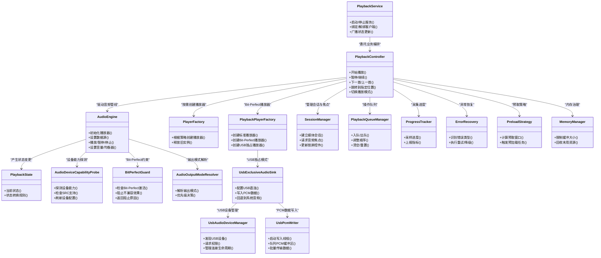

**图表来源**
- [app/src/main/java/app/yukine/playback/PlaybackService.kt](file://app/src/main/java/app/yukine/playback/PlaybackService.kt)
- [app/src/main/java/app/yukine/playback/PlaybackController.kt](file://app/src/main/java/app/yukine/playback/PlaybackController.kt)
- [app/src/main/java/app/yukine/playback/AudioEngine.kt](file://app/src/main/java/app/yukine/playback/AudioEngine.kt)
- [app/src/main/java/app/yukine/playback/PlayerFactory.kt](file://app/src/main/java/app/yukine/playback/PlayerFactory.kt)
- [feature/playback/src/main/java/app/yukine/playback/manager/PlaybackPlayerFactory.kt](file://feature/playback/src/main/java/app/yukine/playback/manager/PlaybackPlayerFactory.kt)
- [feature/playback/src/main/java/app/yukine/playback/manager/AudioDeviceCapabilityProbe.kt](file://feature/playback/src/main/java/app/yukine/playback/manager/AudioDeviceCapabilityProbe.kt)
- [feature/playback/src/main/java/app/yukine/playback/manager/BitPerfectGuard.kt](file://feature/playback/src/main/java/app/yukine/playback/manager/BitPerfectGuard.kt)
- [feature/playback/src/main/java/app/yukine/playback/manager/AudioOutputModeResolver.kt](file://feature/playback/src/main/java/app/yukine/playback/manager/AudioOutputModeResolver.kt)
- [feature/playback/src/main/java/app/yukine/playback/usb/UsbAudioDeviceManager.kt](file://feature/playback/src/main/java/app/yukine/playback/usb/UsbAudioDeviceManager.kt)
- [feature/playback/src/main/java/app/yukine/playback/usb/UsbExclusiveAudioSink.kt](file://feature/playback/src/main/java/app/yukine/playback/usb/UsbExclusiveAudioSink.kt)
- [feature/playback/src/main/java/app/yukine/playback/usb/UsbPcmWriter.kt](file://feature/playback/src/main/java/app/yukine/playback/usb/UsbPcmWriter.kt)

## 详细组件分析

### 播放服务管理（PlaybackService）
- 职责：作为播放能力的宿主，负责前台服务生命周期、系统通知、媒体会话初始化、与上层 Host 的桥接。
- 关键点：
  - 与 MainPlaybackServiceHost 协作，完成服务启动、绑定与回调分发
  - 通过 PlaybackServiceConnectionController 管理客户端连接与鉴权
  - 将具体播放逻辑委派给 PlaybackController，保持服务层轻量

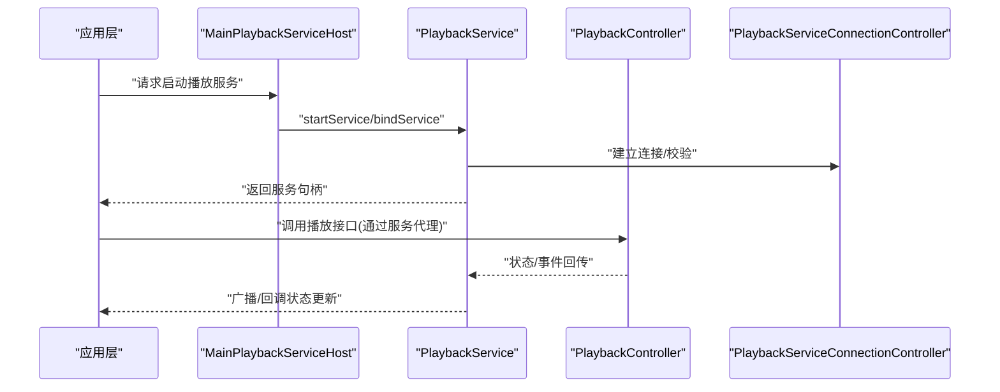

**图表来源**
- [app/src/main/java/app/yukine/playback/PlaybackService.kt](file://app/src/main/java/app/yukine/playback/PlaybackService.kt)
- [app/src/main/java/app/yukine/MainPlaybackServiceHost.kt](file://app/src/main/java/app/yukine/MainPlaybackServiceHost.kt)
- [app/src/main/java/app/yukine/PlaybackServiceConnectionController.kt](file://app/src/main/java/app/yukine/PlaybackServiceConnectionController.kt)
- [app/src/main/java/app/yukine/playback/PlaybackController.kt](file://app/src/main/java/app/yukine/playback/PlaybackController.kt)

**章节来源**
- [app/src/main/java/app/yukine/playback/PlaybackService.kt](file://app/src/main/java/app/yukine/playback/PlaybackService.kt)
- [app/src/main/java/app/yukine/MainPlaybackServiceHost.kt](file://app/src/main/java/app/yukine/MainPlaybackServiceHost.kt)
- [app/src/main/java/app/yukine/PlaybackServiceConnectionController.kt](file://app/src/main/java/app/yukine/PlaybackServiceConnectionController.kt)

### Bit-Perfect播放系统（新增）
**更新** 新增完整的Bit-Perfect高保真播放系统，支持绕过Android处理管道的无损音频输出。

#### 音频设备能力探测（AudioDeviceCapabilityProbe）
- 职责：探测当前音频输出设备能力，确定是否可行Bit-Perfect播放
- 功能特性：
  - 自动检测原生采样率和支持的采样率范围
  - 识别USB音频设备和蓝牙设备
  - 监控设备插拔事件并实时更新配置
  - 判断是否支持无SRC输出

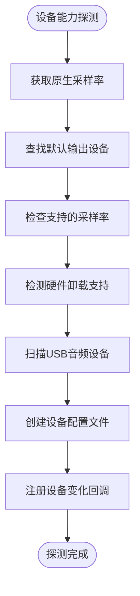

**图表来源**
- [feature/playback/src/main/java/app/yukine/playback/manager/AudioDeviceCapabilityProbe.kt](file://feature/playback/src/main/java/app/yukine/playback/manager/AudioDeviceCapabilityProbe.kt)

#### Bit-Perfect保护器（BitPerfectGuard）
- 职责：运行时守卫，强制执行Bit-Perfect约束
- 保护机制：
  - 当Bit-Perfect输出激活时，阻止EQ、低音增强、虚拟环绕声等软件处理效果
  - 禁止播放速度变化和ReplayGain处理
  - 提供详细的阻止原因说明

#### 音频输出模式解析器（AudioOutputModeResolver）
- 职责：根据用户偏好和设备能力解析适当的音频输出模式
- 决策优先级：
  1. USB独占模式（最高优先级）- 完全绕过AudioFlinger
  2. 标准模式 - 常规音频处理路径
  3. 硬件卸载模式 - 压缩比特流直接发送到硬件DSP
  4. 直接PCM模式 - 无处理的PCM输出

#### USB独占音频输出
- USB音频设备管理器：管理USB音频设备的发现、权限请求和连接生命周期
- USB独占音频接收器：强制占用所有USB音频接口，直接将PCM写入USB DAC端点
- USB PCM写入器：专用写入器线程，通过批量传输将PCM音频数据传输到USB DAC

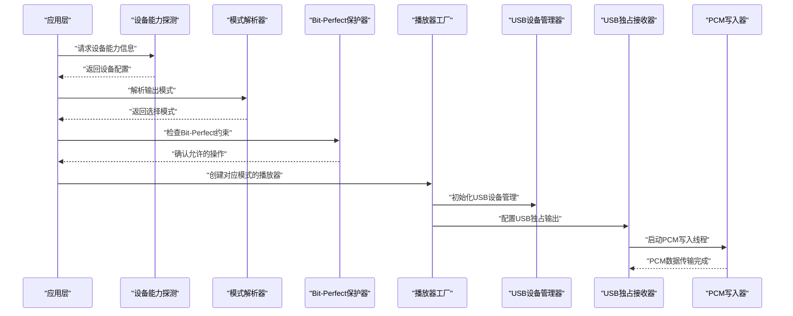

**图表来源**
- [feature/playback/src/main/java/app/yukine/playback/manager/AudioDeviceCapabilityProbe.kt](file://feature/playback/src/main/java/app/yukine/playback/manager/AudioDeviceCapabilityProbe.kt)
- [feature/playback/src/main/java/app/yukine/playback/manager/AudioOutputModeResolver.kt](file://feature/playback/src/main/java/app/yukine/playback/manager/AudioOutputModeResolver.kt)
- [feature/playback/src/main/java/app/yukine/playback/manager/BitPerfectGuard.kt](file://feature/playback/src/main/java/app/yukine/playback/manager/BitPerfectGuard.kt)
- [feature/playback/src/main/java/app/yukine/playback/manager/PlaybackPlayerFactory.kt](file://feature/playback/src/main/java/app/yukine/playback/manager/PlaybackPlayerFactory.kt)
- [feature/playback/src/main/java/app/yukine/playback/usb/UsbAudioDeviceManager.kt](file://feature/playback/src/main/java/app/yukine/playback/usb/UsbAudioDeviceManager.kt)
- [feature/playback/src/main/java/app/yukine/playback/usb/UsbExclusiveAudioSink.kt](file://feature/playback/src/main/java/app/yukine/playback/usb/UsbExclusiveAudioSink.kt)
- [feature/playback/src/main/java/app/yukine/playback/usb/UsbPcmWriter.kt](file://feature/playback/src/main/java/app/yukine/playback/usb/UsbPcmWriter.kt)

**章节来源**
- [feature/playback/src/main/java/app/yukine/playback/manager/AudioDeviceCapabilityProbe.kt](file://feature/playback/src/main/java/app/yukine/playback/manager/AudioDeviceCapabilityProbe.kt)
- [feature/playback/src/main/java/app/yukine/playback/manager/BitPerfectGuard.kt](file://feature/playback/src/main/java/app/yukine/playback/manager/BitPerfectGuard.kt)
- [feature/playback/src/main/java/app/yukine/playback/manager/AudioOutputModeResolver.kt](file://feature/playback/src/main/java/app/yukine/playback/manager/AudioOutputModeResolver.kt)
- [feature/playback/src/main/java/app/yukine/playback/manager/PlaybackPlayerFactory.kt](file://feature/playback/src/main/java/app/yukine/playback/manager/PlaybackPlayerFactory.kt)
- [feature/playback/src/main/java/app/yukine/playback/usb/UsbAudioDeviceManager.kt](file://feature/playback/src/main/java/app/yukine/playback/usb/UsbAudioDeviceManager.kt)
- [feature/playback/src/main/java/app/yukine/playback/usb/UsbExclusiveAudioSink.kt](file://feature/playback/src/main/java/app/yukine/playback/usb/UsbExclusiveAudioSink.kt)
- [feature/playback/src/main/java/app/yukine/playback/usb/UsbPcmWriter.kt](file://feature/playback/src/main/java/app/yukine/playback/usb/UsbPcmWriter.kt)

### 状态机设计（PlaybackState）
- 状态集合：空闲、准备中、播放中、暂停、停止、错误、缓冲中等
- 转换规则：由 PlaybackController 驱动，结合 AudioEngine 回调与外部事件（如用户操作、系统中断）决定合法转移
- 一致性：所有状态变更需经统一入口，避免并发导致的状态不一致

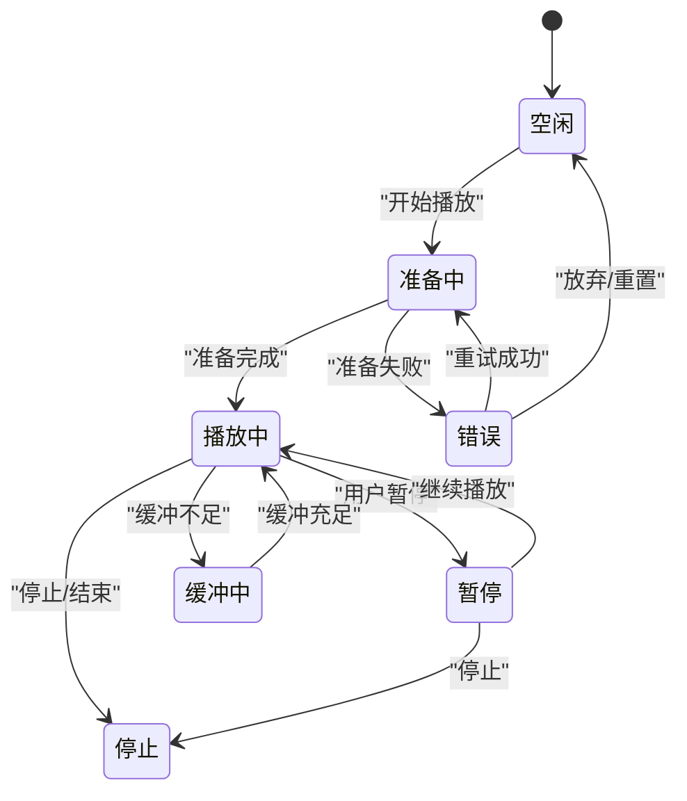

**图表来源**
- [app/src/main/java/app/yukine/playback/PlaybackState.kt](file://app/src/main/java/app/yukine/playback/PlaybackState.kt)
- [app/src/main/java/app/yukine/playback/PlaybackController.kt](file://app/src/main/java/app/yukine/playback/PlaybackController.kt)

**章节来源**
- [app/src/main/java/app/yukine/playback/PlaybackState.kt](file://app/src/main/java/app/yukine/playback/PlaybackState.kt)
- [app/src/main/java/app/yukine/playback/PlaybackController.kt](file://app/src/main/java/app/yukine/playback/PlaybackController.kt)

### 音频处理管道（AudioEngine + PlayerFactory + PlaybackPlayerFactory）
**更新** 音频处理管道现已支持多种输出模式，包括传统处理和Bit-Perfect高保真路径。

- 管道组成：数据源解析 -> 解码 -> 音效处理 -> 混音/输出
- 工厂策略：依据源类型（本地/网络）、编码格式、设备能力选择合适播放器实现
- **新增** Bit-Perfect路径：硬件卸载、直接PCM、USB独占三种高保真输出模式
- 效果链：支持均衡器、环绕声、响度标准化等，可通过配置动态启用/禁用

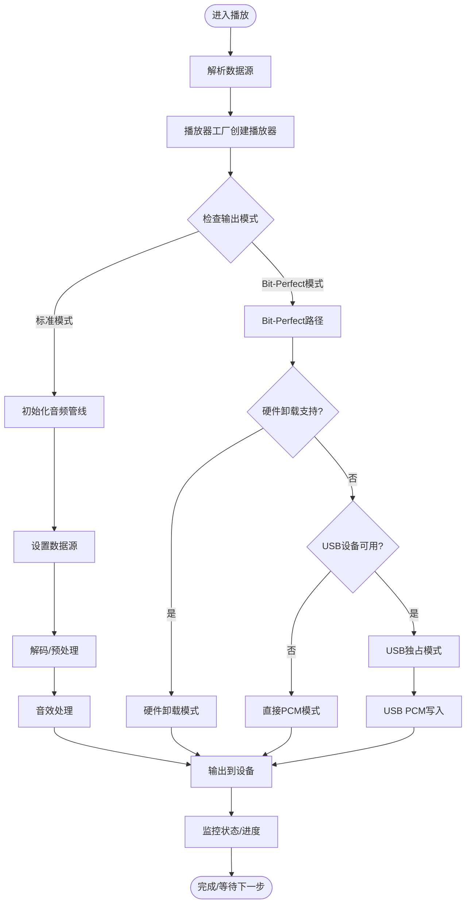

**图表来源**
- [app/src/main/java/app/yukine/playback/AudioEngine.kt](file://app/src/main/java/app/yukine/playback/AudioEngine.kt)
- [app/src/main/java/app/yukine/playback/PlayerFactory.kt](file://app/src/main/java/app/yukine/playback/PlayerFactory.kt)
- [feature/playback/src/main/java/app/yukine/playback/manager/PlaybackPlayerFactory.kt](file://feature/playback/src/main/java/app/yukine/playback/manager/PlaybackPlayerFactory.kt)

**章节来源**
- [app/src/main/java/app/yukine/playback/AudioEngine.kt](file://app/src/main/java/app/yukine/playback/AudioEngine.kt)
- [app/src/main/java/app/yukine/playback/PlayerFactory.kt](file://app/src/main/java/app/yukine/playback/PlayerFactory.kt)
- [feature/playback/src/main/java/app/yukine/playback/manager/PlaybackPlayerFactory.kt](file://feature/playback/src/main/java/app/yukine/playback/manager/PlaybackPlayerFactory.kt)

### 播放队列管理（PlaybackQueueManager）
- 功能：入队/出队、插入/删除、循环/随机模式、历史记录、跳转定位
- 一致性：与状态机联动，保证在播放中修改队列时的平滑过渡
- 性能：批量操作与懒加载，减少主线程阻塞

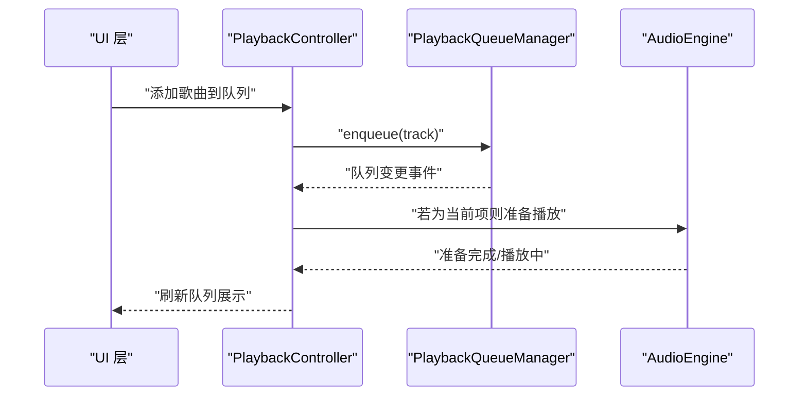

**图表来源**
- [app/src/main/java/app/yukine/playback/PlaybackQueueManager.kt](file://app/src/main/java/app/yukine/playback/PlaybackQueueManager.kt)
- [app/src/main/java/app/yukine/playback/PlaybackController.kt](file://app/src/main/java/app/yukine/playback/PlaybackController.kt)
- [app/src/main/java/app/yukine/playback/AudioEngine.kt](file://app/src/main/java/app/yukine/playback/AudioEngine.kt)

**章节来源**
- [app/src/main/java/app/yukine/playback/PlaybackQueueManager.kt](file://app/src/main/java/app/yukine/playback/PlaybackQueueManager.kt)
- [app/src/main/java/app/yukine/playback/PlaybackController.kt](file://app/src/main/java/app/yukine/playback/PlaybackController.kt)

### 会话管理（SessionManager）
- 职责：媒体会话建立、音频焦点申请/释放、锁屏控件更新、系统通知联动
- 与 UI 交互：通过 NowPlayingPlaybackGatewayAdapter 向"正在播放"界面推送状态与控件响应

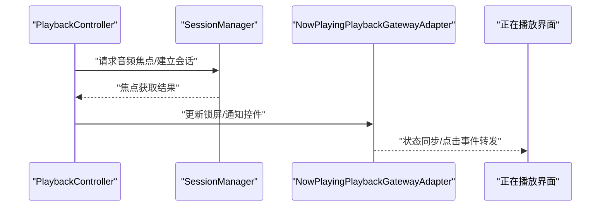

**图表来源**
- [app/src/main/java/app/yukine/playback/SessionManager.kt](file://app/src/main/java/app/yukine/playback/SessionManager.kt)
- [app/src/main/java/app/yukine/NowPlayingPlaybackGatewayAdapter.kt](file://app/src/main/java/app/yukine/NowPlayingPlaybackGatewayAdapter.kt)

**章节来源**
- [app/src/main/java/app/yukine/playback/SessionManager.kt](file://app/src/main/java/app/yukine/playback/SessionManager.kt)
- [app/src/main/java/app/yukine/NowPlayingPlaybackGatewayAdapter.kt](file://app/src/main/java/app/yukine/NowPlayingPlaybackGatewayAdapter.kt)

### 进度跟踪（ProgressTracker）
- 功能：周期性采样播放进度、缓冲占比、卡顿次数与时长
- 上报：聚合后以事件形式通知上层用于 UI 显示与分析埋点

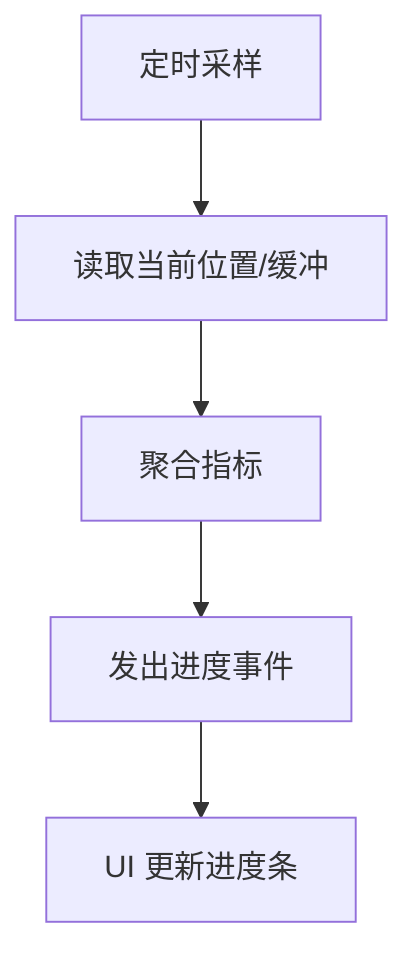

**图表来源**
- [app/src/main/java/app/yukine/playback/ProgressTracker.kt](file://app/src/main/java/app/yukine/playback/ProgressTracker.kt)

**章节来源**
- [app/src/main/java/app/yukine/playback/ProgressTracker.kt](file://app/src/main/java/app/yukine/playback/ProgressTracker.kt)

### 错误恢复机制（ErrorRecovery）
- 错误分类：网络错误、解码错误、设备错误、权限错误等
- 恢复策略：指数退避重试、降级码率、切换备用源、提示用户
- 与状态机联动：错误态可转入准备中或空闲，避免死锁

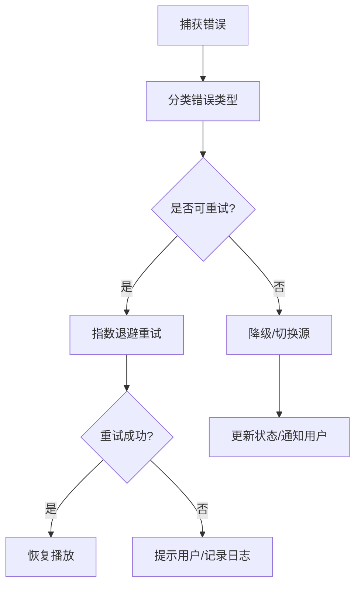

**图表来源**
- [app/src/main/java/app/yukine/playback/ErrorRecovery.kt](file://app/src/main/java/app/yukine/playback/ErrorRecovery.kt)
- [app/src/main/java/app/yukine/playback/PlaybackState.kt](file://app/src/main/java/app/yukine/playback/PlaybackState.kt)

**章节来源**
- [app/src/main/java/app/yukine/playback/ErrorRecovery.kt](file://app/src/main/java/app/yukine/playback/ErrorRecovery.kt)
- [app/src/main/java/app/yukine/playback/PlaybackState.kt](file://app/src/main/java/app/yukine/playback/PlaybackState.kt)

### 预加载策略（PreloadStrategy）
- 策略维度：用户行为（连续播放概率）、网络质量、设备电量
- 执行时机：当前曲目播放至阈值、队列变化、进入后台前
- 资源控制：受 MemoryManager 约束，避免过度占用内存与带宽

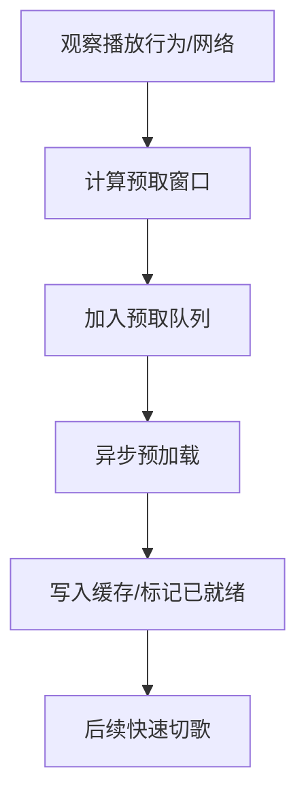

**图表来源**
- [app/src/main/java/app/yukine/playback/PreloadStrategy.kt](file://app/src/main/java/app/yukine/playback/PreloadStrategy.kt)
- [app/src/main/java/app/yukine/playback/MemoryManager.kt](file://app/src/main/java/app/yukine/playback/MemoryManager.kt)

**章节来源**
- [app/src/main/java/app/yukine/playback/PreloadStrategy.kt](file://app/src/main/java/app/yukine/playback/PreloadStrategy.kt)
- [app/src/main/java/app/yukine/playback/MemoryManager.kt](file://app/src/main/java/app/yukine/playback/MemoryManager.kt)

### 内存管理（MemoryManager）
- 目标：控制解码缓冲、位图缓存、临时对象的生命周期
- 手段：上限阈值、LRU 淘汰、延迟释放、低内存告警
- 协同：与 PreloadStrategy 和 AudioEngine 共享策略参数

**章节来源**
- [app/src/main/java/app/yukine/playback/MemoryManager.kt](file://app/src/main/java/app/yukine/playback/MemoryManager.kt)

### 与 UI 层的交互模式
- 连接与启动：MainPlaybackServiceHost 负责服务发现与启动；PlaybackServiceConnectionController 管理连接生命周期
- 动作派发：PlaybackStartController、PlaybackActionController 将 UI 动作转换为播放指令
- 状态同步：PlaybackStateUpdateController 订阅状态变更并推送到 UI
- 正在播放：NowPlayingPlaybackGatewayAdapter 提供"正在播放"界面的双向交互

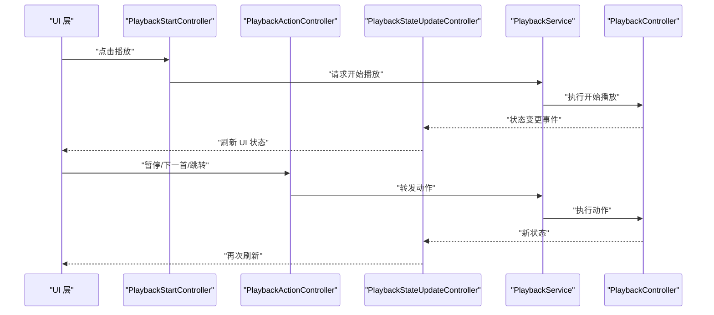

**图表来源**
- [app/src/main/java/app/yukine/PlaybackStartController.kt](file://app/src/main/java/app/yukine/PlaybackStartController.kt)
- [app/src/main/java/app/yukine/PlaybackActionController.kt](file://app/src/main/java/app/yukine/PlaybackActionController.kt)
- [app/src/main/java/app/yukine/PlaybackStateUpdateController.kt](file://app/src/main/java/app/yukine/PlaybackStateUpdateController.kt)
- [app/src/main/java/app/yukine/playback/PlaybackService.kt](file://app/src/main/java/app/yukine/playback/PlaybackService.kt)
- [app/src/main/java/app/yukine/playback/PlaybackController.kt](file://app/src/main/java/app/yukine/playback/PlaybackController.kt)

**章节来源**
- [app/src/main/java/app/yukine/PlaybackStartController.kt](file://app/src/main/java/app/yukine/PlaybackStartController.kt)
- [app/src/main/java/app/yukine/PlaybackActionController.kt](file://app/src/main/java/app/yukine/PlaybackActionController.kt)
- [app/src/main/java/app/yukine/PlaybackStateUpdateController.kt](file://app/src/main/java/app/yukine/PlaybackStateUpdateController.kt)
- [app/src/main/java/app/yukine/playback/PlaybackService.kt](file://app/src/main/java/app/yukine/playback/PlaybackService.kt)
- [app/src/main/java/app/yukine/playback/PlaybackController.kt](file://app/src/main/java/app/yukine/playback/PlaybackController.kt)

## 依赖关系分析
- 内聚性：PlaybackController 集中编排，降低耦合；AudioEngine 专注音频管线；SessionManager 专注系统会话
- 直接依赖：
  - PlaybackService 依赖 MainPlaybackServiceHost、PlaybackServiceConnectionController
  - PlaybackController 依赖 AudioEngine、PlayerFactory、SessionManager、PlaybackQueueManager、ProgressTracker、ErrorRecovery、PreloadStrategy、MemoryManager、PlaybackState
  - **新增** AudioEngine 依赖 Bit-Perfect 子系统组件
- 间接依赖：UI 层通过各类 Controller 与服务交互，避免直接访问底层引擎

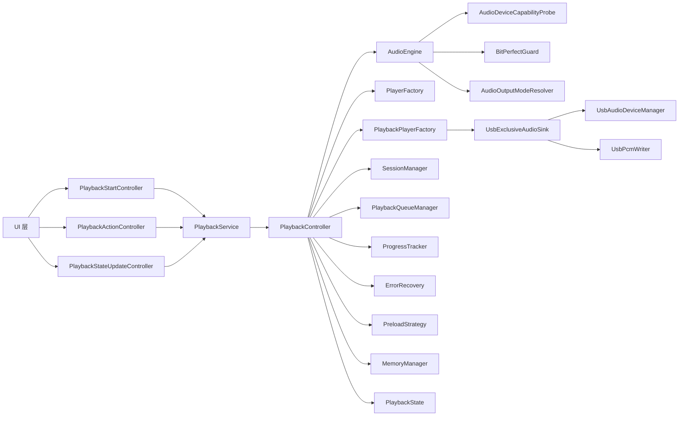

**图表来源**
- [app/src/main/java/app/yukine/playback/PlaybackService.kt](file://app/src/main/java/app/yukine/playback/PlaybackService.kt)
- [app/src/main/java/app/yukine/playback/PlaybackController.kt](file://app/src/main/java/app/yukine/playback/PlaybackController.kt)
- [app/src/main/java/app/yukine/playback/AudioEngine.kt](file://app/src/main/java/app/yukine/playback/AudioEngine.kt)
- [app/src/main/java/app/yukine/playback/PlayerFactory.kt](file://app/src/main/java/app/yukine/playback/PlayerFactory.kt)
- [feature/playback/src/main/java/app/yukine/playback/manager/PlaybackPlayerFactory.kt](file://feature/playback/src/main/java/app/yukine/playback/manager/PlaybackPlayerFactory.kt)
- [feature/playback/src/main/java/app/yukine/playback/manager/AudioDeviceCapabilityProbe.kt](file://feature/playback/src/main/java/app/yukine/playback/manager/AudioDeviceCapabilityProbe.kt)
- [feature/playback/src/main/java/app/yukine/playback/manager/BitPerfectGuard.kt](file://feature/playback/src/main/java/app/yukine/playback/manager/BitPerfectGuard.kt)
- [feature/playback/src/main/java/app/yukine/playback/manager/AudioOutputModeResolver.kt](file://feature/playback/src/main/java/app/yukine/playback/manager/AudioOutputModeResolver.kt)
- [feature/playback/src/main/java/app/yukine/playback/usb/UsbAudioDeviceManager.kt](file://feature/playback/src/main/java/app/yukine/playback/usb/UsbAudioDeviceManager.kt)
- [feature/playback/src/main/java/app/yukine/playback/usb/UsbExclusiveAudioSink.kt](file://feature/playback/src/main/java/app/yukine/playback/usb/UsbExclusiveAudioSink.kt)
- [feature/playback/src/main/java/app/yukine/playback/usb/UsbPcmWriter.kt](file://feature/playback/src/main/java/app/yukine/playback/usb/UsbPcmWriter.kt)

**章节来源**
- [app/src/main/java/app/yukine/playback/PlaybackService.kt](file://app/src/main/java/app/yukine/playback/PlaybackService.kt)
- [app/src/main/java/app/yukine/playback/PlaybackController.kt](file://app/src/main/java/app/yukine/playback/PlaybackController.kt)

## 性能考虑
- 预加载与缓存：基于 PreloadStrategy 与 MemoryManager 的协同，平衡首开时延与内存占用
- 缓冲与码率自适应：在网络波动时自动降级，减少卡顿
- 资源释放：在暂停/后台场景及时释放解码器与位图，避免内存泄漏
- 事件节流：进度与状态上报合并与去抖，降低 UI 刷新压力
- 线程模型：I/O 与解码在后台线程，UI 更新在主线程，避免 ANR
- **新增** Bit-Perfect性能优化：
  - USB独占模式使用专用音频线程，优先级设置为THREAD_PRIORITY_AUDIO
  - 批量传输减少USB调用开销，提高数据传输效率
  - 智能回退机制，USB直连失败时自动回退到系统音频路径
  - 设备能力缓存，避免重复探测带来的性能损耗

## 故障排查指南
- 常见问题
  - 无法获取音频焦点：检查 SessionManager 的请求与释放路径
  - 频繁缓冲：查看 ErrorRecovery 的重试与降级策略，确认网络与码率设置
  - 内存溢出：关注 MemoryManager 的阈值与 LRU 淘汰策略
  - 状态不同步：核对 PlaybackStateUpdateController 的事件订阅与去重逻辑
  - **新增** Bit-Perfect相关问题：
    - USB设备无法识别：检查USB权限请求和设备兼容性
    - 无声输出：验证USB独占模式是否正确配置，检查PCM写入器状态
    - 音质异常：确认Bit-Perfect保护器是否正确阻止了软件处理效果
- 建议步骤
  - 开启详细日志，定位错误分类与恢复分支
  - 复现路径最小化，隔离 UI 与网络因素
  - 使用 ProgressTracker 的指标辅助判断卡顿原因
  - **新增** 针对Bit-Perfect系统的诊断工具：
    - 使用AudioDeviceCapabilityProbe检测设备能力
    - 检查BitPerfectGuard的阻止原因
    - 验证USB设备连接状态和数据传输统计

**章节来源**
- [app/src/main/java/app/yukine/playback/ErrorRecovery.kt](file://app/src/main/java/app/yukine/playback/ErrorRecovery.kt)
- [app/src/main/java/app/yukine/playback/MemoryManager.kt](file://app/src/main/java/app/yukine/playback/MemoryManager.kt)
- [app/src/main/java/app/yukine/playback/ProgressTracker.kt](file://app/src/main/java/app/yukine/playback/ProgressTracker.kt)
- [app/src/main/java/app/yukine/PlaybackStateUpdateController.kt](file://app/src/main/java/app/yukine/playback/PlaybackStateUpdateController.kt)
- [feature/playback/src/main/java/app/yukine/playback/manager/AudioDeviceCapabilityProbe.kt](file://feature/playback/src/main/java/app/yukine/playback/manager/AudioDeviceCapabilityProbe.kt)
- [feature/playback/src/main/java/app/yukine/playback/manager/BitPerfectGuard.kt](file://feature/playback/src/main/java/app/yukine/playback/manager/BitPerfectGuard.kt)

## 结论
播放核心模块通过清晰的分层与职责划分，实现了高内聚、低耦合的可扩展架构。状态机与事件驱动的模型保障了跨进程/跨线程的一致性；错误恢复、预加载与内存管理共同提升了用户体验与稳定性。**新增的Bit-Perfect播放系统**进一步增强了音频质量，为用户提供专业级的高保真播放体验。建议在后续迭代中持续完善指标埋点与自动化回归，进一步巩固播放服务的可靠性。

## 附录
- 使用示例与最佳实践
  - 启动播放：通过 PlaybackStartController 发起，避免直接调用服务内部方法
  - 队列操作：优先使用 PlaybackQueueManager 提供的原子接口，注意批量操作的副作用
  - 状态监听：使用 PlaybackStateUpdateController 订阅，避免轮询
  - 错误处理：遵循 ErrorRecovery 的分类与策略，不要自行吞掉异常
  - 资源管理：在页面销毁时主动释放与播放相关的资源，防止泄漏
  - **新增** Bit-Perfect使用指南：
    - 启用Bit-Perfect模式前检查设备能力支持
    - USB独占模式下避免其他音频应用干扰
    - 合理使用BitPerfectGuard的功能限制
    - 监控USB设备连接状态和传输性能