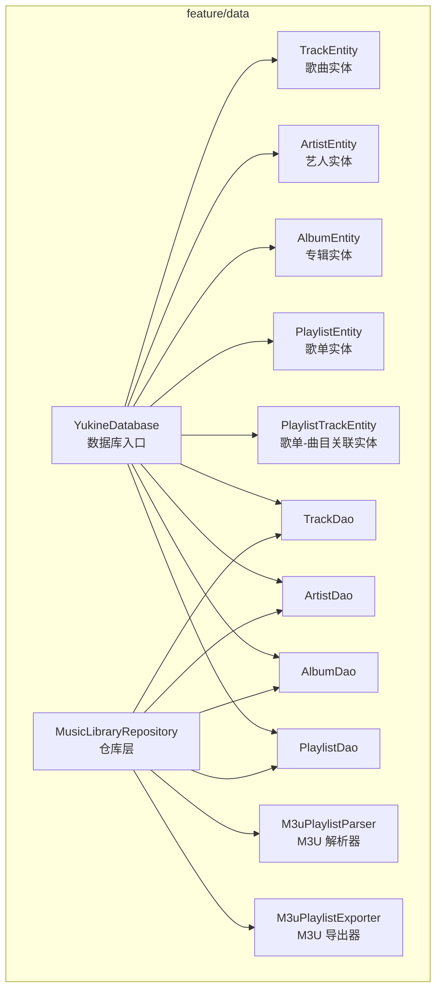
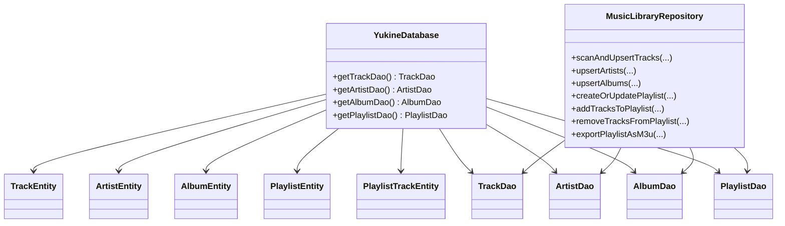
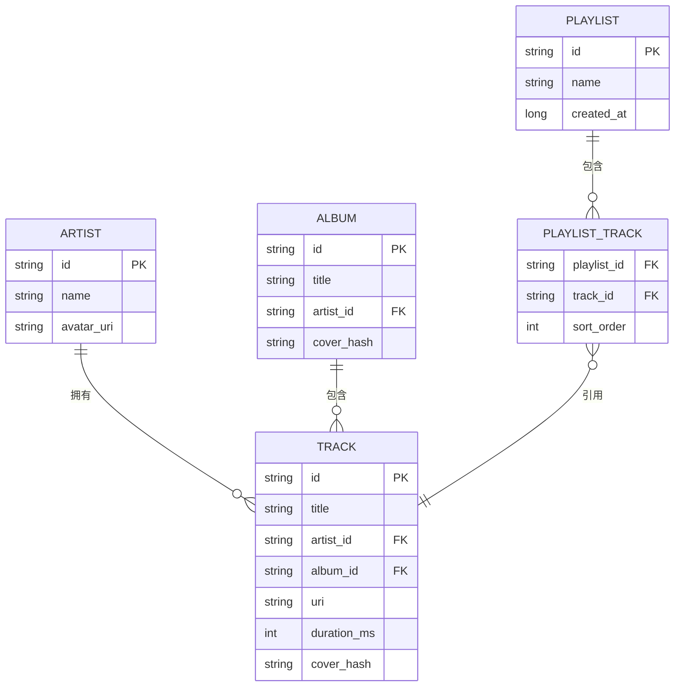
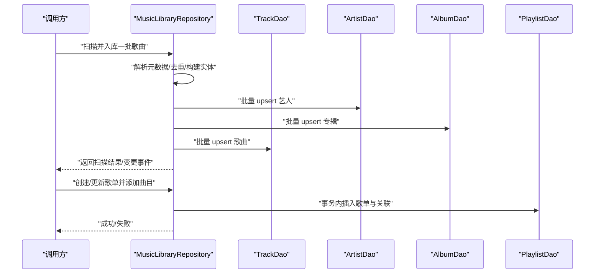
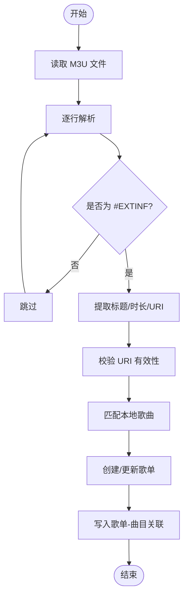
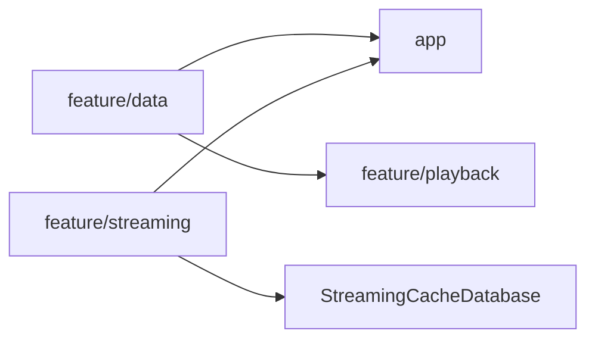

# 数据层模块 (feature/data)

<cite>
**本文引用的文件**   
- [YukineDatabase.kt](file://feature/data/src/main/java/app/yukine/data/room/YukineDatabase.kt)
- [TrackEntity.kt](file://feature/data/src/main/java/app/yukine/data/room/entity/TrackEntity.kt)
- [ArtistEntity.kt](file://feature/data/src/main/java/app/yukine/data/room/entity/ArtistEntity.kt)
- [AlbumEntity.kt](file://feature/data/src/main/java/app/yukine/data/room/entity/AlbumEntity.kt)
- [PlaylistEntity.kt](file://feature/data/src/main/java/app/yukine/data/room/entity/PlaylistEntity.kt)
- [PlaylistTrackEntity.kt](file://feature/data/src/main/java/app/yukine/data/room/entity/PlaylistTrackEntity.kt)
- [TrackDao.kt](file://feature/data/src/main/java/app/yukine/data/room/dao/TrackDao.kt)
- [ArtistDao.kt](file://feature/data/src/main/java/app/yukine/data/room/dao/ArtistDao.kt)
- [AlbumDao.kt](file://feature/data/src/main/java/app/yukine/data/room/dao/AlbumDao.kt)
- [PlaylistDao.kt](file://feature/data/src/main/java/app/yukine/data/room/dao/PlaylistDao.kt)
- [MusicLibraryRepository.kt](file://feature/data/src/main/java/app/yukine/data/MusicLibraryRepository.kt)
- [M3uPlaylistParser.kt](file://feature/data/src/main/java/app/yukine/data/M3uPlaylistParser.kt)
- [M3uPlaylistExporter.kt](file://feature/data/src/main/java/app/yukine/data/M3uPlaylistExporter.kt)
- [StreamingCacheDatabase.kt](file://app/schemas/app.yukine.streaming.cache.StreamingCacheDatabase/1.json)
- [RoomRepositoriesInstrumentedTest.kt](file://app/src/androidTest/java/app/yukine/data/RoomRepositoriesInstrumentedTest.java)
- [MusicLibraryRepositoryInstrumentedTest.kt](file://app/src/androidTest/java/app/yukine/data/MusicLibraryRepositoryInstrumentedTest.java)
</cite>

## 目录
1. [简介](#简介)
2. [项目结构](#项目结构)
3. [核心组件](#核心组件)
4. [架构总览](#架构总览)
5. [详细组件分析](#详细组件分析)
6. [依赖关系分析](#依赖关系分析)
7. [性能考量](#性能考量)
8. [故障排查指南](#故障排查指南)
9. [结论](#结论)
10. [附录](#附录)

## 简介
本文件聚焦于 Echo Android 应用的 feature/data 数据层模块，系统性说明其基于 Room 的本地持久化设计、实体与 DAO 定义、音乐库管理（扫描、元数据处理、播放列表）以及网络与缓存相关的集成点。文档同时覆盖数据访问模式、事务处理、性能优化策略，并给出与其他模块的集成方式与使用模式指引。

## 项目结构
feature/data 模块围绕 Room 数据库组织，包含：
- 数据库入口与迁移配置
- 领域实体映射（歌曲、艺人、专辑、歌单及其关联）
- DAO 接口（CRUD、查询、分页、批量操作）
- 仓库层 MusicLibraryRepository（聚合多 DAO、编排业务逻辑）
- 播放列表导入导出工具（M3U 解析与导出）
- 测试用例（单元测试与仪器测试）

图表来源
- [YukineDatabase.kt](file://feature/data/src/main/java/app/yukine/data/room/YukineDatabase.kt)
- [TrackEntity.kt](file://feature/data/src/main/java/app/yukine/data/room/entity/TrackEntity.kt)
- [ArtistEntity.kt](file://feature/data/src/main/java/app/yukine/data/room/entity/ArtistEntity.kt)
- [AlbumEntity.kt](file://feature/data/src/main/java/app/yukine/data/room/entity/AlbumEntity.kt)
- [PlaylistEntity.kt](file://feature/data/src/main/java/app/yukine/data/room/entity/PlaylistEntity.kt)
- [PlaylistTrackEntity.kt](file://feature/data/src/main/java/app/yukine/data/room/entity/PlaylistTrackEntity.kt)
- [TrackDao.kt](file://feature/data/src/main/java/app/yukine/data/room/dao/TrackDao.kt)
- [ArtistDao.kt](file://feature/data/src/main/java/app/yukine/data/room/dao/ArtistDao.kt)
- [AlbumDao.kt](file://feature/data/src/main/java/app/yukine/data/room/dao/AlbumDao.kt)
- [PlaylistDao.kt](file://feature/data/src/main/java/app/yukine/data/room/dao/PlaylistDao.kt)
- [MusicLibraryRepository.kt](file://feature/data/src/main/java/app/yukine/data/MusicLibraryRepository.kt)
- [M3uPlaylistParser.kt](file://feature/data/src/main/java/app/yukine/data/M3uPlaylistParser.kt)
- [M3uPlaylistExporter.kt](file://feature/data/src/main/java/app/yukine/data/M3uPlaylistExporter.kt)

章节来源
- [YukineDatabase.kt](file://feature/data/src/main/java/app/yukine/data/room/YukineDatabase.kt)
- [MusicLibraryRepository.kt](file://feature/data/src/main/java/app/yukine/data/MusicLibraryRepository.kt)

## 核心组件
- 数据库入口 YukineDatabase：集中声明所有实体与 DAO，提供单例实例与迁移策略。
- 实体类：TrackEntity、ArtistEntity、AlbumEntity、PlaylistEntity、PlaylistTrackEntity 等，描述本地表结构与关系。
- DAO 接口：TrackDao、ArtistDao、AlbumDao、PlaylistDao 等，封装 SQL 操作与流式结果。
- 仓库层 MusicLibraryRepository：组合多个 DAO，实现跨表查询、事务性写入、索引与去重策略，对外暴露统一的数据访问 API。
- 播放列表工具：M3uPlaylistParser 负责 M3U 文本解析；M3uPlaylistExporter 负责将本地歌单导出为标准 M3U 格式。

章节来源
- [YukineDatabase.kt](file://feature/data/src/main/java/app/yukine/data/room/YukineDatabase.kt)
- [TrackEntity.kt](file://feature/data/src/main/java/app/yukine/data/room/entity/TrackEntity.kt)
- [ArtistEntity.kt](file://feature/data/src/main/java/app/yukine/data/room/entity/ArtistEntity.kt)
- [AlbumEntity.kt](file://feature/data/src/main/java/app/yukine/data/room/entity/AlbumEntity.kt)
- [PlaylistEntity.kt](file://feature/data/src/main/java/app/yukine/data/room/entity/PlaylistEntity.kt)
- [PlaylistTrackEntity.kt](file://feature/data/src/main/java/app/yukine/data/room/entity/PlaylistTrackEntity.kt)
- [TrackDao.kt](file://feature/data/src/main/java/app/yukine/data/room/dao/TrackDao.kt)
- [ArtistDao.kt](file://feature/data/src/main/java/app/yukine/data/room/dao/ArtistDao.kt)
- [AlbumDao.kt](file://feature/data/src/main/java/app/yukine/data/room/dao/AlbumDao.kt)
- [PlaylistDao.kt](file://feature/data/src/main/java/app/yukine/data/room/dao/PlaylistDao.kt)
- [MusicLibraryRepository.kt](file://feature/data/src/main/java/app/yukine/data/MusicLibraryRepository.kt)
- [M3uPlaylistParser.kt](file://feature/data/src/main/java/app/yukine/data/M3uPlaylistParser.kt)
- [M3uPlaylistExporter.kt](file://feature/data/src/main/java/app/yukine/data/M3uPlaylistExporter.kt)

## 架构总览
数据层采用“Repository + DAO + Entity”的经典分层：
- Repository 作为业务边界，协调多个 DAO 完成复杂读写，保证事务一致性与幂等性。
- DAO 仅关注数据访问细节，返回 Flow/Pager 以支持响应式 UI。
- Entity 与数据库表一一对应，通过注解建立主键、外键与索引。

图表来源
- [YukineDatabase.kt](file://feature/data/src/main/java/app/yukine/data/room/YukineDatabase.kt)
- [TrackEntity.kt](file://feature/data/src/main/java/app/yukine/data/room/entity/TrackEntity.kt)
- [ArtistEntity.kt](file://feature/data/src/main/java/app/yukine/data/room/entity/ArtistEntity.kt)
- [AlbumEntity.kt](file://feature/data/src/main/java/app/yukine/data/room/entity/AlbumEntity.kt)
- [PlaylistEntity.kt](file://feature/data/src/main/java/app/yukine/data/room/entity/PlaylistEntity.kt)
- [PlaylistTrackEntity.kt](file://feature/data/src/main/java/app/yukine/data/room/entity/PlaylistTrackEntity.kt)
- [TrackDao.kt](file://feature/data/src/main/java/app/yukine/data/room/dao/TrackDao.kt)
- [ArtistDao.kt](file://feature/data/src/main/java/app/yukine/data/room/dao/ArtistDao.kt)
- [AlbumDao.kt](file://feature/data/src/main/java/app/yukine/data/room/dao/AlbumDao.kt)
- [PlaylistDao.kt](file://feature/data/src/main/java/app/yukine/data/room/dao/PlaylistDao.kt)
- [MusicLibraryRepository.kt](file://feature/data/src/main/java/app/yukine/data/MusicLibraryRepository.kt)

## 详细组件分析

### 数据库与实体模型
- 数据库入口集中注册实体与 DAO，并提供迁移策略以支持版本演进。
- 实体类通过注解定义主键、唯一约束、索引与外键关系，确保数据完整性与查询性能。
- 典型实体包括：
  - 歌曲实体：用于存储音频文件路径、标题、时长、封面哈希等。
  - 艺人实体：存储艺人名、头像、标识符等。
  - 专辑实体：存储专辑名、封面、发行信息等。
  - 歌单实体：存储歌单名称、创建时间、排序规则等。
  - 歌单-曲目关联实体：维护歌单与歌曲的顺序与存在性。

图表来源
- [TrackEntity.kt](file://feature/data/src/main/java/app/yukine/data/room/entity/TrackEntity.kt)
- [ArtistEntity.kt](file://feature/data/src/main/java/app/yukine/data/room/entity/ArtistEntity.kt)
- [AlbumEntity.kt](file://feature/data/src/main/java/app/yukine/data/room/entity/AlbumEntity.kt)
- [PlaylistEntity.kt](file://feature/data/src/main/java/app/yukine/data/room/entity/PlaylistEntity.kt)
- [PlaylistTrackEntity.kt](file://feature/data/src/main/java/app/yukine/data/room/entity/PlaylistTrackEntity.kt)

章节来源
- [YukineDatabase.kt](file://feature/data/src/main/java/app/yukine/data/room/YukineDatabase.kt)
- [TrackEntity.kt](file://feature/data/src/main/java/app/yukine/data/room/entity/TrackEntity.kt)
- [ArtistEntity.kt](file://feature/data/src/main/java/app/yukine/data/room/entity/ArtistEntity.kt)
- [AlbumEntity.kt](file://feature/data/src/main/java/app/yukine/data/room/entity/AlbumEntity.kt)
- [PlaylistEntity.kt](file://feature/data/src/main/java/app/yukine/data/room/entity/PlaylistEntity.kt)
- [PlaylistTrackEntity.kt](file://feature/data/src/main/java/app/yukine/data/room/entity/PlaylistTrackEntity.kt)

### DAO 接口与数据访问模式
- TrackDao：提供歌曲的插入、更新、删除、按条件查询、分页与统计。
- ArtistDao / AlbumDao：提供艺人/专辑的增删改查与关联查询。
- PlaylistDao：提供歌单的 CRUD 及歌单-曲目关系的批量维护。
- 数据访问模式：
  - 响应式：DAO 方法返回 Flow/List，便于上层实时订阅变化。
  - 分页：对大数据集使用 Pager，避免一次性加载导致卡顿。
  - 批量操作：在仓库层使用事务包裹多条 DAO 调用，保证一致性。

章节来源
- [TrackDao.kt](file://feature/data/src/main/java/app/yukine/data/room/dao/TrackDao.kt)
- [ArtistDao.kt](file://feature/data/src/main/java/app/yukine/data/room/dao/ArtistDao.kt)
- [AlbumDao.kt](file://feature/data/src/main/java/app/yukine/data/room/dao/AlbumDao.kt)
- [PlaylistDao.kt](file://feature/data/src/main/java/app/yukine/data/room/dao/PlaylistDao.kt)

### 仓库层 MusicLibraryRepository
仓库层是数据层的业务门面，职责包括：
- 本地音乐扫描：遍历文件系统或 ContentResolver，提取媒体信息，去重后批量入库。
- 元数据处理：解析 ID3/容器标签，生成封面哈希、标准化标题与艺人名称。
- 播放列表管理：创建/更新/删除歌单，维护歌单-曲目顺序，支持导入导出。
- 事务管理：将多次 DAO 操作放入同一事务，失败回滚，避免脏数据。
- 幂等与去重：基于唯一键（如 URI、指纹、规范化标题+艺人）进行 upsert，避免重复条目。

图表来源
- [MusicLibraryRepository.kt](file://feature/data/src/main/java/app/yukine/data/MusicLibraryRepository.kt)
- [TrackDao.kt](file://feature/data/src/main/java/app/yukine/data/room/dao/TrackDao.kt)
- [ArtistDao.kt](file://feature/data/src/main/java/app/yukine/data/room/dao/ArtistDao.kt)
- [AlbumDao.kt](file://feature/data/src/main/java/app/yukine/data/room/dao/AlbumDao.kt)
- [PlaylistDao.kt](file://feature/data/src/main/java/app/yukine/data/room/dao/PlaylistDao.kt)

章节来源
- [MusicLibraryRepository.kt](file://feature/data/src/main/java/app/yukine/data/MusicLibraryRepository.kt)

### 播放列表导入导出（M3U）
- 解析器 M3uPlaylistParser：读取 M3U 文本，提取 #EXTINF 行中的元信息与 URI 列表，转换为内部数据结构。
- 导出器 M3uPlaylistExporter：将本地歌单与曲目序列化为标准 M3U 文本，供外部应用或备份恢复使用。
- 典型流程：
  - 导入：解析 -> 校验 URI 有效性 -> 匹配本地歌曲 -> 创建/更新歌单 -> 写入关联关系。
  - 导出：查询歌单与曲目顺序 -> 生成 EXTINF 与 URI 列表 -> 输出到文件或字节流。

图表来源
- [M3uPlaylistParser.kt](file://feature/data/src/main/java/app/yukine/data/M3uPlaylistParser.kt)
- [M3uPlaylistExporter.kt](file://feature/data/src/main/java/app/yukine/data/M3uPlaylistExporter.kt)
- [PlaylistDao.kt](file://feature/data/src/main/java/app/yukine/data/room/dao/PlaylistDao.kt)

章节来源
- [M3uPlaylistParser.kt](file://feature/data/src/main/java/app/yukine/data/M3uPlaylistParser.kt)
- [M3uPlaylistExporter.kt](file://feature/data/src/main/java/app/yukine/data/M3uPlaylistExporter.kt)
- [PlaylistDao.kt](file://feature/data/src/main/java/app/yukine/data/room/dao/PlaylistDao.kt)

### 网络请求处理、缓存策略与数据同步
- 网络与缓存：feature/streaming 模块包含独立的 StreamingCacheDatabase（见 app/schemas），用于流媒体相关数据的本地缓存。
- 数据同步：仓库层可与网络源协作，结合后台任务（如 Worker）执行增量同步与冲突解决。
- 集成方式：
  - 数据层通过接口抽象网络源，由上层注入具体实现。
  - 本地优先：先读本地，再按需拉取远端，合并差异后落库。
  - 幂等写入：基于唯一键进行 upsert，避免重复与乱序。

章节来源
- [StreamingCacheDatabase.kt](file://app/schemas/app.yukine.streaming.cache.StreamingCacheDatabase/1.json)
- [MusicLibraryRepository.kt](file://feature/data/src/main/java/app/yukine/data/MusicLibraryRepository.kt)

### 数据访问模式与事务管理
- 响应式数据流：DAO 返回 Flow，UI 可自动感知变更。
- 分页加载：对大集合使用 Pager，减少内存占用与首屏延迟。
- 事务边界：仓库层在批量写入时开启事务，失败回滚，保证一致性。
- 去重策略：基于规范化字段（URI、标题+艺人、指纹等）建立唯一约束，避免重复。

章节来源
- [TrackDao.kt](file://feature/data/src/main/java/app/yukine/data/room/dao/TrackDao.kt)
- [PlaylistDao.kt](file://feature/data/src/main/java/app/yukine/data/room/dao/PlaylistDao.kt)
- [MusicLibraryRepository.kt](file://feature/data/src/main/java/app/yukine/data/MusicLibraryRepository.kt)

### 性能优化策略
- 索引与唯一约束：为常用查询字段（标题、艺人、专辑、URI）建立索引，提升检索速度。
- 批量写入：使用 Room 的批量插入/更新，减少事务开销。
- 懒加载与分页：对大图/长列表采用分页与缩略图缓存。
- 异步调度：扫描与元数据处理在后台线程执行，避免阻塞主线程。
- 增量同步：对比远端与本地差异，仅传输必要数据。

章节来源
- [TrackEntity.kt](file://feature/data/src/main/java/app/yukine/data/room/entity/TrackEntity.kt)
- [AlbumEntity.kt](file://feature/data/src/main/java/app/yukine/data/room/entity/AlbumEntity.kt)
- [MusicLibraryRepository.kt](file://feature/data/src/main/java/app/yukine/data/MusicLibraryRepository.kt)

## 依赖关系分析
- 模块内依赖：
  - YukineDatabase 依赖实体与 DAO。
  - MusicLibraryRepository 依赖各 DAO 与播放列表工具。
- 模块间依赖：
  - feature/data 被 app 与 feature/playback 等模块消费。
  - streaming 模块通过独立数据库进行流媒体缓存，与 data 模块解耦。

图表来源
- [YukineDatabase.kt](file://feature/data/src/main/java/app/yukine/data/room/YukineDatabase.kt)
- [StreamingCacheDatabase.kt](file://app/schemas/app.yukine.streaming.cache.StreamingCacheDatabase/1.json)

章节来源
- [YukineDatabase.kt](file://feature/data/src/main/java/app/yukine/data/room/YukineDatabase.kt)
- [StreamingCacheDatabase.kt](file://app/schemas/app.yukine.streaming.cache.StreamingCacheDatabase/1.json)

## 性能考量
- 数据库层面：合理设置索引、唯一约束与外键，避免全表扫描。
- 查询层面：尽量使用投影与过滤条件，减少数据传输量。
- 写入层面：批量操作与事务合并，降低 I/O 次数。
- 内存层面：分页与懒加载，控制对象生命周期。
- 并发层面：后台线程池执行耗时任务，避免主线程阻塞。

[本节为通用指导，不直接分析具体文件]

## 故障排查指南
- 常见错误定位：
  - 数据库迁移失败：检查迁移脚本与 schema 变更是否一致。
  - 重复数据：确认唯一约束与去重逻辑是否正确。
  - 歌单导入失败：验证 M3U 格式与 URI 有效性。
- 调试建议：
  - 使用仪器测试快速复现问题（参考 RoomRepositoriesInstrumentedTest）。
  - 针对仓库层关键路径编写 MusicLibraryRepositoryInstrumentedTest，覆盖事务与异常分支。
  - 打印关键日志与中间状态，辅助定位解析与匹配阶段的问题。

章节来源
- [RoomRepositoriesInstrumentedTest.kt](file://app/src/androidTest/java/app/yukine/data/RoomRepositoriesInstrumentedTest.java)
- [MusicLibraryRepositoryInstrumentedTest.kt](file://app/src/androidTest/java/app/yukine/data/MusicLibraryRepositoryInstrumentedTest.java)

## 结论
feature/data 模块以 Room 为核心，构建了清晰的数据访问边界与稳定的本地持久化能力。通过仓库层聚合 DAO 与工具类，实现了音乐库扫描、元数据处理与播放列表管理的完整闭环。配合响应式数据流、分页与事务管理，兼顾了性能与一致性。与 streaming 模块的解耦设计使得缓存与同步策略更加灵活可控。

[本节为总结性内容，不直接分析具体文件]

## 附录
- 使用模式示例（路径指引）：
  - 初始化数据库与获取 DAO：参见 [YukineDatabase.kt](file://feature/data/src/main/java/app/yukine/data/room/YukineDatabase.kt)
  - 扫描并入库歌曲：参见 [MusicLibraryRepository.kt](file://feature/data/src/main/java/app/yukine/data/MusicLibraryRepository.kt)
  - 创建歌单并添加曲目：参见 [PlaylistDao.kt](file://feature/data/src/main/java/app/yukine/data/room/dao/PlaylistDao.kt)
  - 导入 M3U 歌单：参见 [M3uPlaylistParser.kt](file://feature/data/src/main/java/app/yukine/data/M3uPlaylistParser.kt)
  - 导出 M3U 歌单：参见 [M3uPlaylistExporter.kt](file://feature/data/src/main/java/app/yukine/data/M3uPlaylistExporter.kt)
- 测试参考：
  - 仓库层仪器测试：参见 [MusicLibraryRepositoryInstrumentedTest.kt](file://app/src/androidTest/java/app/yukine/data/MusicLibraryRepositoryInstrumentedTest.java)
  - Room 仓库集成测试：参见 [RoomRepositoriesInstrumentedTest.kt](file://app/src/androidTest/java/app/yukine/data/RoomRepositoriesInstrumentedTest.java)