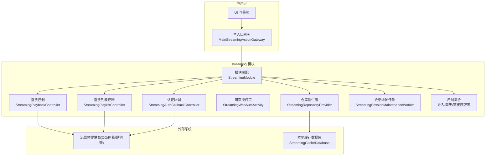
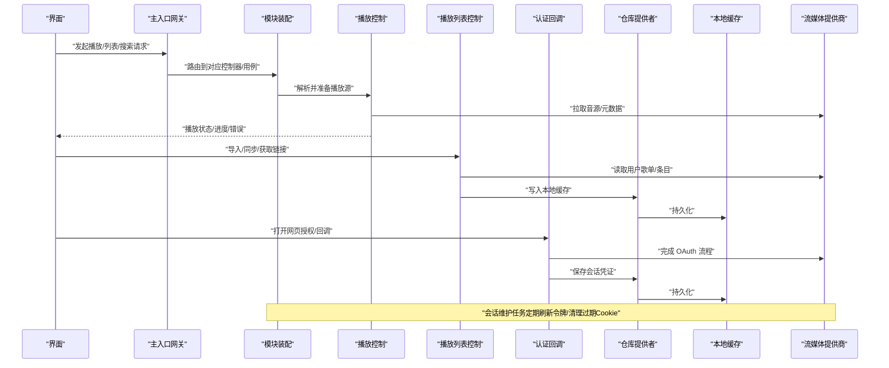
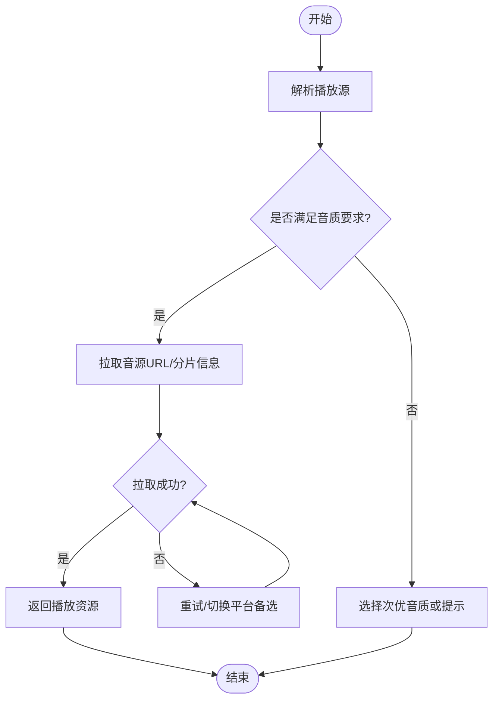
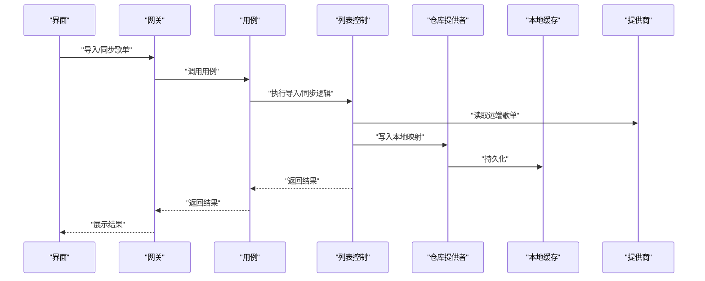
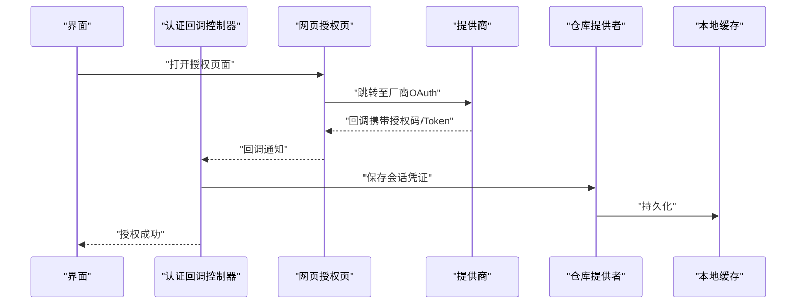
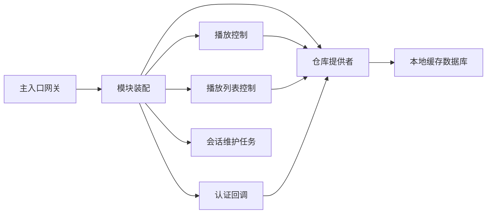

# 流媒体模块 (feature/streaming)

<cite>
**本文引用的文件**   
- [StreamingModule.kt](file://app/src/main/java/app/yukine/StreamingModule.kt)
- [MainStreamingActionGateway.kt](file://app/src/main/java/app/yukine/MainStreamingActionGateway.kt)
- [StreamingPlaybackController.kt](file://app/src/main/java/app/yukine/StreamingPlaybackController.kt)
- [StreamingPlaylistController.kt](file://app/src/main/java/app/yukine/StreamingPlaylistController.kt)
- [StreamingAuthCallbackController.kt](file://app/src/main/java/app/yukine/StreamingAuthCallbackController.kt)
- [StreamingWebAuthActivity.kt](file://app/src/main/java/app/yukine/StreamingWebAuthActivity.kt)
- [StreamingRepositoryProvider.kt](file://app/src/main/java/app/yukine/StreamingRepositoryProvider.kt)
- [StreamingSessionMaintenanceWorker.kt](file://app/src/main/java/app/yukine/StreamingSessionMaintenanceWorker.kt)
- [EnsureStreamingLoginPlaylistUseCase.kt](file://app/src/main/java/app/yukine/EnsureStreamingLoginPlaylistUseCase.kt)
- [ImportStreamingPlaylistUseCase.kt](file://app/src/main/java/app/yukine/ImportStreamingPlaylistUseCase.kt)
- [SyncStreamingPlaylistUseCase.kt](file://app/src/main/java/app/yukine/SyncStreamingPlaylistUseCase.kt)
- [GetStreamingPlaylistLinkUseCase.kt](file://app/src/main/java/app/yukine/GetStreamingPlaylistLinkUseCase.kt)
- [DefaultStreamingSearchActionHandler.kt](file://app/src/main/java/app/yukine/DefaultStreamingSearchActionHandler.kt)
- [StreamingFeatureBinding.java](file://app/src/main/java/app/yukine/StreamingFeatureBinding.java)
- [StreamingCacheDatabase.json](file://app/schemas/app.yukine.streaming.cache.StreamingCacheDatabase/1.json)
- [build.gradle](file://feature/streaming/build.gradle)
- [core-model build.gradle](file://core/model/build.gradle)
</cite>

## 目录
1. [简介](#简介)
2. [项目结构](#项目结构)
3. [核心组件](#核心组件)
4. [架构总览](#架构总览)
5. [详细组件分析](#详细组件分析)
6. [依赖关系分析](#依赖关系分析)
7. [性能与缓存策略](#性能与缓存策略)
8. [故障排查指南](#故障排查指南)
9. [结论](#结论)
10. [附录：平台接入与扩展指南](#附录平台接入与扩展指南)

## 简介
本文件为 Echo Android 应用的“流媒体模块”（feature/streaming）提供系统化文档。内容覆盖模块架构、网关接口、多平台适配、认证授权流程、播放与列表同步、收藏管理、搜索联动、错误处理与性能优化，并给出集成示例与扩展新平台的开发指南。读者无需深入源码即可理解整体设计与关键实现要点。

## 项目结构
feature/streaming 模块围绕“统一网关 + 多提供商适配 + 会话维护 + 播放/列表/收藏能力”的架构组织，上层通过统一的 Streaming API 暴露能力，内部按职责拆分为控制器、用例、仓库提供者、认证回调与会话维护等子组件。

图表来源
- [StreamingModule.kt](file://app/src/main/java/app/yukine/StreamingModule.kt)
- [MainStreamingActionGateway.kt](file://app/src/main/java/app/yukine/MainStreamingActionGateway.kt)
- [StreamingPlaybackController.kt](file://app/src/main/java/app/yukine/StreamingPlaybackController.kt)
- [StreamingPlaylistController.kt](file://app/src/main/java/app/yukine/StreamingPlaylistController.kt)
- [StreamingAuthCallbackController.kt](file://app/src/main/java/app/yukine/StreamingAuthCallbackController.kt)
- [StreamingWebAuthActivity.kt](file://app/src/main/java/app/yukine/StreamingWebAuthActivity.kt)
- [StreamingRepositoryProvider.kt](file://app/src/main/java/app/yukine/StreamingRepositoryProvider.kt)
- [StreamingSessionMaintenanceWorker.kt](file://app/src/main/java/app/yukine/StreamingSessionMaintenanceWorker.kt)
- [StreamingCacheDatabase.json](file://app/schemas/app.yukine.streaming.cache.StreamingCacheDatabase/1.json)

章节来源
- [StreamingModule.kt](file://app/src/main/java/app/yukine/StreamingModule.kt)
- [StreamingFeatureBinding.java](file://app/src/main/java/app/yukine/StreamingFeatureBinding.java)
- [build.gradle](file://feature/streaming/build.gradle)

## 核心组件
- 模块装配与依赖注入
  - 负责注册流媒体相关服务、仓库、控制器与后台任务，统一对外暴露能力。
- 主入口网关
  - 作为 UI 与 streaming 模块之间的契约边界，屏蔽内部实现细节，聚合常用操作。
- 播放控制
  - 封装跨平台播放能力，包括解析播放源、选择质量、状态管理与事件上报。
- 播放列表控制
  - 提供列表查询、导入、同步、链接生成等操作，对接各平台列表 API。
- 认证与授权
  - 支持网页授权回调、Cookie 手动注入、会话续期与失效处理。
- 仓库提供者
  - 抽象数据访问层，统一对接本地缓存与远程数据源。
- 会话维护任务
  - 周期性刷新令牌、清理过期 Cookie、触发登录态检查。
- 用例集
  - 将复杂业务编排为可复用的用例，如确保登录歌单存在、导入/同步歌单、获取分享链接等。

章节来源
- [StreamingModule.kt](file://app/src/main/java/app/yukine/StreamingModule.kt)
- [MainStreamingActionGateway.kt](file://app/src/main/java/app/yukine/MainStreamingActionGateway.kt)
- [StreamingPlaybackController.kt](file://app/src/main/java/app/yukine/StreamingPlaybackController.kt)
- [StreamingPlaylistController.kt](file://app/src/main/java/app/yukine/StreamingPlaylistController.kt)
- [StreamingAuthCallbackController.kt](file://app/src/main/java/app/yukine/StreamingAuthCallbackController.kt)
- [StreamingWebAuthActivity.kt](file://app/src/main/java/app/yukine/StreamingWebAuthActivity.kt)
- [StreamingRepositoryProvider.kt](file://app/src/main/java/app/yukine/StreamingRepositoryProvider.kt)
- [StreamingSessionMaintenanceWorker.kt](file://app/src/main/java/app/yukine/StreamingSessionMaintenanceWorker.kt)
- [EnsureStreamingLoginPlaylistUseCase.kt](file://app/src/main/java/app/yukine/EnsureStreamingLoginPlaylistUseCase.kt)
- [ImportStreamingPlaylistUseCase.kt](file://app/src/main/java/app/yukine/ImportStreamingPlaylistUseCase.kt)
- [SyncStreamingPlaylistUseCase.kt](file://app/src/main/java/app/yukine/SyncStreamingPlaylistUseCase.kt)
- [GetStreamingPlaylistLinkUseCase.kt](file://app/src/main/java/app/yukine/GetStreamingPlaylistLinkUseCase.kt)

## 架构总览
下图展示从 UI 到流媒体提供商的端到端调用路径，以及认证、缓存与后台维护的协作方式。

图表来源
- [MainStreamingActionGateway.kt](file://app/src/main/java/app/yukine/MainStreamingActionGateway.kt)
- [StreamingModule.kt](file://app/src/main/java/app/yukine/StreamingModule.kt)
- [StreamingPlaybackController.kt](file://app/src/main/java/app/yukine/StreamingPlaybackController.kt)
- [StreamingPlaylistController.kt](file://app/src/main/java/app/yukine/StreamingPlaylistController.kt)
- [StreamingAuthCallbackController.kt](file://app/src/main/java/app/yukine/StreamingAuthCallbackController.kt)
- [StreamingRepositoryProvider.kt](file://app/src/main/java/app/yukine/StreamingRepositoryProvider.kt)
- [StreamingSessionMaintenanceWorker.kt](file://app/src/main/java/app/yukine/StreamingSessionMaintenanceWorker.kt)

## 详细组件分析

### 模块装配与依赖注入
- 职责
  - 集中注册控制器、仓库、后台任务与配置项，保证模块内高内聚、低耦合。
- 关键点
  - 以 Provider/Factory 形式暴露控制器与仓库实例，便于测试替换。
  - 将平台无关的通用能力（如缓存、网络、调度）注入到具体控制器中。

章节来源
- [StreamingModule.kt](file://app/src/main/java/app/yukine/StreamingModule.kt)

### 主入口网关
- 职责
  - 面向 UI 的统一入口，聚合播放、列表、搜索、收藏等常用操作。
- 设计要点
  - 参数校验与异常包装，向上返回稳定的结果类型。
  - 对多平台差异进行收敛，避免 UI 感知底层实现。

章节来源
- [MainStreamingActionGateway.kt](file://app/src/main/java/app/yukine/MainStreamingActionGateway.kt)

### 播放控制
- 职责
  - 解析播放源、选择音质、处理重试与降级、上报播放事件。
- 关键流程
  - 根据目标平台与用户偏好选择最佳音源；失败时回退到次优方案。
  - 与播放器服务解耦，仅负责“可播放资源”的获取与状态协调。

图表来源
- [StreamingPlaybackController.kt](file://app/src/main/java/app/yukine/StreamingPlaybackController.kt)

章节来源
- [StreamingPlaybackController.kt](file://app/src/main/java/app/yukine/StreamingPlaybackController.kt)

### 播放列表控制
- 职责
  - 提供歌单的导入、同步、链接获取与本地映射。
- 典型用例
  - 确保登录歌单存在：首次登录时创建默认歌单。
  - 导入歌单：将远端歌单条目转换为本地可识别的轨道集合。
  - 同步歌单：增量更新本地与远端的差异。
  - 获取链接：生成可分享的播放列表链接。

图表来源
- [StreamingPlaylistController.kt](file://app/src/main/java/app/yukine/StreamingPlaylistController.kt)
- [EnsureStreamingLoginPlaylistUseCase.kt](file://app/src/main/java/app/yukine/EnsureStreamingLoginPlaylistUseCase.kt)
- [ImportStreamingPlaylistUseCase.kt](file://app/src/main/java/app/yukine/ImportStreamingPlaylistUseCase.kt)
- [SyncStreamingPlaylistUseCase.kt](file://app/src/main/java/app/yukine/SyncStreamingPlaylistUseCase.kt)
- [GetStreamingPlaylistLinkUseCase.kt](file://app/src/main/java/app/yukine/GetStreamingPlaylistLinkUseCase.kt)
- [StreamingRepositoryProvider.kt](file://app/src/main/java/app/yukine/StreamingRepositoryProvider.kt)

章节来源
- [StreamingPlaylistController.kt](file://app/src/main/java/app/yukine/StreamingPlaylistController.kt)
- [EnsureStreamingLoginPlaylistUseCase.kt](file://app/src/main/java/app/yukine/EnsureStreamingLoginPlaylistUseCase.kt)
- [ImportStreamingPlaylistUseCase.kt](file://app/src/main/java/app/yukine/ImportStreamingPlaylistUseCase.kt)
- [SyncStreamingPlaylistUseCase.kt](file://app/src/main/java/app/yukine/SyncStreamingPlaylistUseCase.kt)
- [GetStreamingPlaylistLinkUseCase.kt](file://app/src/main/java/app/yukine/GetStreamingPlaylistLinkUseCase.kt)

### 认证与授权
- 支持方式
  - 网页授权：在内置 WebView 中完成 OAuth 流程，回调后自动保存会话。
  - Cookie 手动注入：用于部分平台不支持标准 OAuth 的场景。
- 会话维护
  - 后台任务定期检查令牌有效期、刷新 Cookie、触发登录态校验。

图表来源
- [StreamingAuthCallbackController.kt](file://app/src/main/java/app/yukine/StreamingAuthCallbackController.kt)
- [StreamingWebAuthActivity.kt](file://app/src/main/java/app/yukine/StreamingWebAuthActivity.kt)
- [StreamingRepositoryProvider.kt](file://app/src/main/java/app/yukine/StreamingRepositoryProvider.kt)
- [StreamingSessionMaintenanceWorker.kt](file://app/src/main/java/app/yukine/StreamingSessionMaintenanceWorker.kt)

章节来源
- [StreamingAuthCallbackController.kt](file://app/src/main/java/app/yukine/StreamingAuthCallbackController.kt)
- [StreamingWebAuthActivity.kt](file://app/src/main/java/app/yukine/StreamingWebAuthActivity.kt)
- [StreamingSessionMaintenanceWorker.kt](file://app/src/main/java/app/yukine/StreamingSessionMaintenanceWorker.kt)

### 仓库提供者与缓存
- 职责
  - 抽象数据访问，统一对接本地缓存与远程数据源，提供一致的读写接口。
- 缓存模型
  - 使用 Room 数据库持久化会话、歌单映射、播放历史等。
  - 提供迁移与版本管理，保障升级兼容。

章节来源
- [StreamingRepositoryProvider.kt](file://app/src/main/java/app/yukine/StreamingRepositoryProvider.kt)
- [StreamingCacheDatabase.json](file://app/schemas/app.yukine.streaming.cache.StreamingCacheDatabase/1.json)

### 搜索联动
- 职责
  - 将搜索动作分发到对应的流媒体提供商，并返回结构化结果。
- 行为
  - 默认搜索处理器负责参数规范化、去重与分页合并。

章节来源
- [DefaultStreamingSearchActionHandler.kt](file://app/src/main/java/app/yukine/DefaultStreamingSearchActionHandler.kt)

## 依赖关系分析
- 模块内依赖
  - 网关依赖模块装配；控制器依赖仓库提供者；用例依赖控制器与仓库。
- 外部依赖
  - 流媒体提供商 SDK/API；Room 数据库；后台任务调度。
- 可能的循环依赖
  - 通过用例与仓库抽象化解耦，避免控制器直接互相引用。

图表来源
- [MainStreamingActionGateway.kt](file://app/src/main/java/app/yukine/MainStreamingActionGateway.kt)
- [StreamingModule.kt](file://app/src/main/java/app/yukine/StreamingModule.kt)
- [StreamingPlaybackController.kt](file://app/src/main/java/app/yukine/StreamingPlaybackController.kt)
- [StreamingPlaylistController.kt](file://app/src/main/java/app/yukine/StreamingPlaylistController.kt)
- [StreamingAuthCallbackController.kt](file://app/src/main/java/app/yukine/StreamingAuthCallbackController.kt)
- [StreamingRepositoryProvider.kt](file://app/src/main/java/app/yukine/StreamingRepositoryProvider.kt)
- [StreamingSessionMaintenanceWorker.kt](file://app/src/main/java/app/yukine/StreamingSessionMaintenanceWorker.kt)
- [StreamingCacheDatabase.json](file://app/schemas/app.yukine.streaming.cache.StreamingCacheDatabase/1.json)

章节来源
- [StreamingModule.kt](file://app/src/main/java/app/yukine/StreamingModule.kt)
- [build.gradle](file://feature/streaming/build.gradle)
- [core-model build.gradle](file://core/model/build.gradle)

## 性能与缓存策略
- 播放源选择
  - 优先高质量音源，失败时自动降级；必要时启用多平台备选。
- 缓存策略
  - 会话与歌单映射采用本地持久化，减少重复网络请求。
  - 搜索结果与热门列表可做短期内存缓存，提升首屏体验。
- 并发与限流
  - 批量导入/同步时限制并发度，避免阻塞 UI 与耗尽带宽。
- 资源回收
  - 播放结束后及时释放句柄，避免内存泄漏。

[本节为通用指导，不直接分析具体文件]

## 故障排查指南
- 常见问题
  - 授权失败：检查回调地址、权限范围与网络可达性。
  - 播放失败：确认音源可用性、版权限制与网络状况。
  - 同步异常：核对歌单 ID 映射与增量策略。
- 定位方法
  - 查看会话维护日志与最近一次令牌刷新时间。
  - 检查本地缓存表结构与版本号，确认是否存在迁移问题。
  - 使用网关的错误包装信息快速定位上游原因。

章节来源
- [StreamingSessionMaintenanceWorker.kt](file://app/src/main/java/app/yukine/StreamingSessionMaintenanceWorker.kt)
- [StreamingCacheDatabase.json](file://app/schemas/app.yukine.streaming.cache.StreamingCacheDatabase/1.json)
- [MainStreamingActionGateway.kt](file://app/src/main/java/app/yukine/MainStreamingActionGateway.kt)

## 结论
feature/streaming 模块通过“统一网关 + 控制器 + 用例 + 仓库提供者”的分层设计，实现了跨平台流媒体的统一接入与稳定运行。认证与会话维护、播放与列表同步、搜索联动等功能均具备清晰的职责边界与可扩展点，便于后续新增平台与功能演进。

[本节为总结，不直接分析具体文件]

## 附录：平台接入与扩展指南

### 新增平台接入步骤
- 定义平台标识与能力
  - 在模块装配中注册新的平台实现，声明其支持的特性（如音质、歌词、收藏）。
- 实现认证流程
  - 若平台支持 OAuth，复用网页授权与回调控制器；否则实现 Cookie 注入流程。
- 实现播放源解析
  - 在播放控制中增加平台分支，返回可用的音源 URL 或分片信息。
- 实现列表与收藏
  - 在播放列表控制中实现导入/同步/链接生成；在仓库提供者中持久化映射。
- 编写用例
  - 将复杂流程封装为用例，供网关与 UI 调用。
- 单元测试与集成测试
  - 针对认证、播放、列表与缓存路径补充测试用例。

章节来源
- [StreamingModule.kt](file://app/src/main/java/app/yukine/StreamingModule.kt)
- [StreamingAuthCallbackController.kt](file://app/src/main/java/app/yukine/StreamingAuthCallbackController.kt)
- [StreamingWebAuthActivity.kt](file://app/src/main/java/app/yukine/StreamingWebAuthActivity.kt)
- [StreamingPlaybackController.kt](file://app/src/main/java/app/yukine/StreamingPlaybackController.kt)
- [StreamingPlaylistController.kt](file://app/src/main/java/app/yukine/StreamingPlaylistController.kt)
- [StreamingRepositoryProvider.kt](file://app/src/main/java/app/yukine/StreamingRepositoryProvider.kt)

### 集成示例与配置
- 在应用启动阶段加载模块装配，确保所有控制器与仓库可用。
- 在设置页中提供“账号绑定/解绑”入口，调用认证回调控制器。
- 在播放列表页中提供“导入/同步”按钮，调用相应用例。
- 在搜索页中接入默认搜索处理器，统一展示结果。

章节来源
- [StreamingFeatureBinding.java](file://app/src/main/java/app/yukine/StreamingFeatureBinding.java)
- [DefaultStreamingSearchActionHandler.kt](file://app/src/main/java/app/yukine/DefaultStreamingSearchActionHandler.kt)
- [ImportStreamingPlaylistUseCase.kt](file://app/src/main/java/app/yukine/ImportStreamingPlaylistUseCase.kt)
- [SyncStreamingPlaylistUseCase.kt](file://app/src/main/java/app/yukine/SyncStreamingPlaylistUseCase.kt)
- [GetStreamingPlaylistLinkUseCase.kt](file://app/src/main/java/app/yukine/GetStreamingPlaylistLinkUseCase.kt)