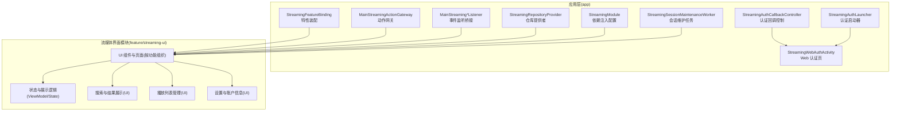
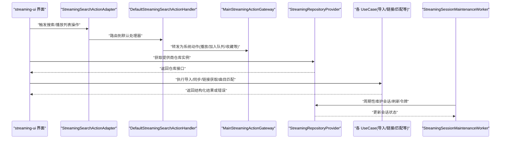
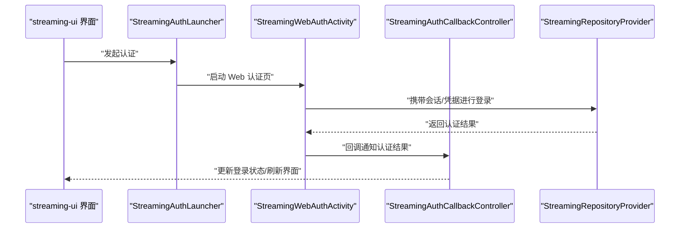
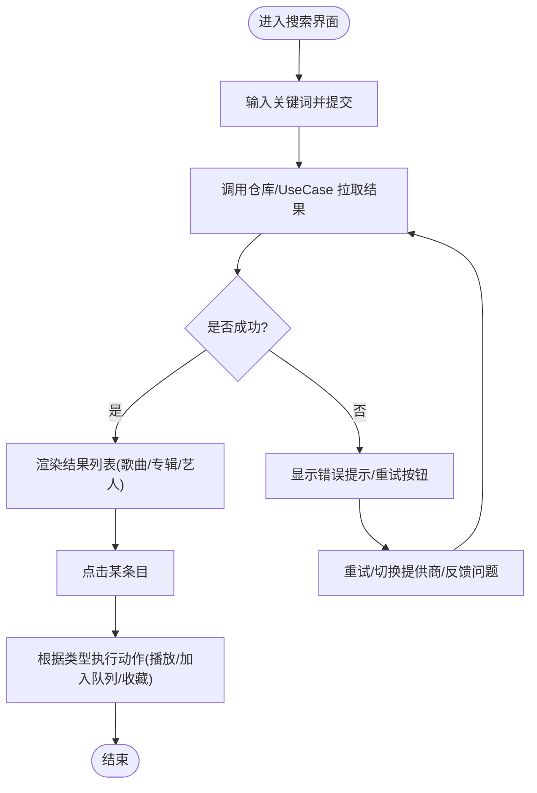
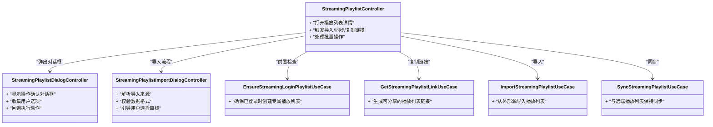
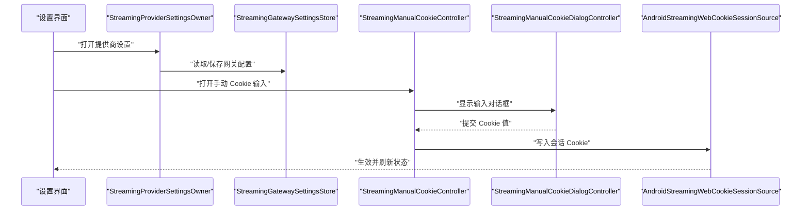
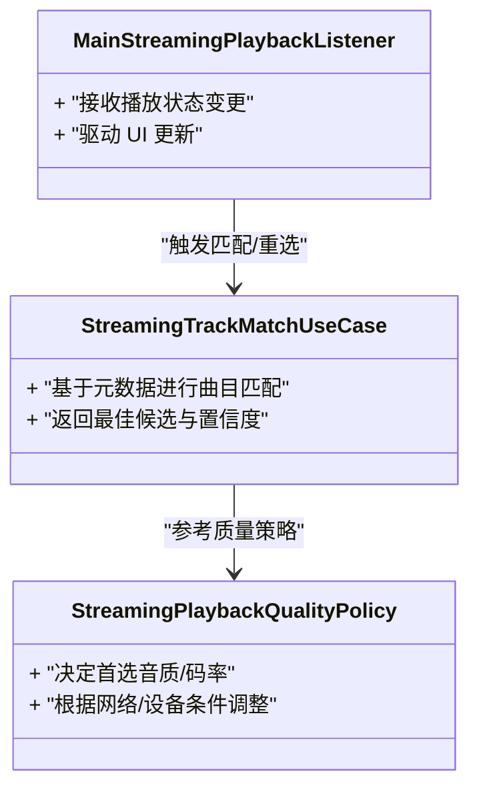
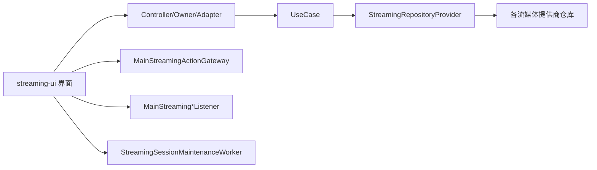

# 流媒体界面模块 (feature/streaming-ui)

<cite>
**本文引用的文件**   
- [build.gradle](file://feature/streaming-ui/build.gradle)
- [AndroidManifest.xml](file://feature/streaming-ui/src/main/AndroidManifest.xml)
- [StreamingFeatureBinding.java](file://app/src/main/java/app/yukine/StreamingFeatureBinding.java)
- [MainStreamingActionGateway.kt](file://app/src/main/java/app/yukine/MainStreamingActionGateway.kt)
- [MainStreamingPlaylistListener.kt](file://app/src/main/java/app/yukine/MainStreamingPlaylistListener.kt)
- [MainStreamingPlaylistDialogListener.kt](file://app/src/main/java/app/yukine/MainStreamingPlaylistDialogListener.kt)
- [MainStreamingPlaylistImportDialogListener.kt](file://app/src/main/java/app/yukine/MainStreamingPlaylistImportDialogListener.kt)
- [MainStreamingPlaybackListener.kt](file://app/src/main/java/app/yukine/MainStreamingPlaybackListener.kt)
- [MainStreamingManualCookieListener.kt](file://app/src/main/java/app/yukine/MainStreamingManualCookieListener.kt)
- [StreamingAuthCallbackController.kt](file://app/src/main/java/app/yukine/StreamingAuthCallbackController.kt)
- [StreamingAuthLauncher.kt](file://app/src/main/java/app/yukine/StreamingAuthLauncher.kt)
- [StreamingWebAuthActivity.kt](file://app/src/main/java/app/yukine/StreamingWebAuthActivity.kt)
- [StreamingRepositoryProvider.kt](file://app/src/main/java/app/yukine/StreamingRepositoryProvider.kt)
- [StreamingModule.kt](file://app/src/main/java/app/yukine/StreamingModule.kt)
- [EnsureStreamingLoginPlaylistUseCase.kt](file://app/src/main/java/app/yukine/EnsureStreamingLoginPlaylistUseCase.kt)
- [GetStreamingPlaylistLinkUseCase.kt](file://app/src/main/java/app/yukine/GetStreamingPlaylistLinkUseCase.kt)
- [ImportStreamingPlaylistUseCase.kt](file://app/src/main/java/app/yukine/ImportStreamingPlaylistUseCase.kt)
- [SyncStreamingPlaylistUseCase.kt](file://app/src/main/java/app/yukine/SyncStreamingPlaylistUseCase.kt)
- [StreamingSearchActionAdapter.kt](file://app/src/main/java/app/yukine/StreamingSearchActionAdapter.kt)
- [DefaultStreamingSearchActionHandler.kt](file://app/src/main/java/app/yukine/DefaultStreamingSearchActionHandler.kt)
- [UnifiedSearchOwner.kt](file://app/src/main/java/app/yukine/UnifiedSearchOwner.kt)
- [StreamingStatusTextFactory.kt](file://app/src/main/java/app/yukine/StreamingStatusTextFactory.kt)
- [StreamingAccountPlaylistImportText.kt](file://app/src/main/java/app/yukine/StreamingAccountPlaylistImportText.kt)
- [StreamingProviderSettingsOwner.kt](file://app/src/main/java/app/yukine/StreamingProviderSettingsOwner.kt)
- [StreamingGatewaySettingsStore.kt](file://app/src/main/java/app/yukine/StreamingGatewaySettingsStore.kt)
- [StreamingSessionMaintenanceWorker.kt](file://app/src/main/java/app/yukine/StreamingSessionMaintenanceWorker.kt)
- [StreamingPlaybackQualityPolicy.kt](file://app/src/main/java/app/yukine/StreamingPlaybackQualityPolicy.kt)
- [StreamingTrackMatchUseCase.kt](file://app/src/main/java/app/yukine/StreamingTrackMatchUseCase.kt)
- [StreamingPlaybackController.kt](file://app/src/main/java/app/yukine/StreamingPlaybackController.kt)
- [StreamingPlaylistController.kt](file://app/src/main/java/app/yukine/StreamingPlaylistController.kt)
- [StreamingPlaylistDialogController.java](file://app/src/main/java/app/yukine/StreamingPlaylistDialogController.java)
- [StreamingPlaylistImportDialogController.java](file://app/src/main/java/app/yukine/StreamingPlaylistImportDialogController.java)
- [StreamingManualCookieController.kt](file://app/src/main/java/app/yukine/StreamingManualCookieController.kt)
- [StreamingManualCookieDialogController.java](file://app/src/main/java/app/yukine/StreamingManualCookieDialogController.java)
- [AndroidStreamingWebCookieSessionSource.kt](file://app/src/main/java/app/yukine/AndroidStreamingWebCookieSessionSource.kt)
</cite>

## 目录
1. [简介](#简介)
2. [项目结构](#项目结构)
3. [核心组件](#核心组件)
4. [架构总览](#架构总览)
5. [详细组件分析](#详细组件分析)
6. [依赖关系分析](#依赖关系分析)
7. [性能与体验优化](#性能与体验优化)
8. [故障排查指南](#故障排查指南)
9. [结论](#结论)
10. [附录](#附录)

## 简介
本文件面向 Echo Android 应用的“流媒体界面模块”（feature/streaming-ui），聚焦以下目标：
- 说明 feature/streaming-ui 的架构设计与职责边界
- 梳理流媒体登录、在线音乐搜索、播放列表管理等关键 UI 能力及其交互流程
- 文档化用户认证流程、在线内容浏览、搜索结果展示等用户交互的实现要点
- 总结状态管理、错误提示、加载状态等用户体验优化策略
- 解释与流媒体后端服务的通信协议、数据格式、错误处理等集成细节
- 提供界面定制方法与主题适配方案，并说明与流媒体核心模块的协作模式

## 项目结构
feature/streaming-ui 作为独立功能模块，主要承担与“流媒体”相关的界面与交互编排。其入口由应用层通过特性绑定装配到主导航中；UI 行为通过一系列 Listener/Controller/UseCase 组合实现，并与 app 层的网关、控制器和会话维护组件协同工作。

图表来源
- [StreamingFeatureBinding.java](file://app/src/main/java/app/yukine/StreamingFeatureBinding.java)
- [MainStreamingActionGateway.kt](file://app/src/main/java/app/yukine/MainStreamingActionGateway.kt)
- [MainStreamingPlaylistListener.kt](file://app/src/main/java/app/yukine/MainStreamingPlaylistListener.kt)
- [MainStreamingPlaylistDialogListener.kt](file://app/src/main/java/app/yukine/MainStreamingPlaylistDialogListener.kt)
- [MainStreamingPlaylistImportDialogListener.kt](file://app/src/main/java/app/yukine/MainStreamingPlaylistImportDialogListener.kt)
- [MainStreamingPlaybackListener.kt](file://app/src/main/java/app/yukine/MainStreamingPlaybackListener.kt)
- [MainStreamingManualCookieListener.kt](file://app/src/main/java/app/yukine/MainStreamingManualCookieListener.kt)
- [StreamingAuthCallbackController.kt](file://app/src/main/java/app/yukine/StreamingAuthCallbackController.kt)
- [StreamingAuthLauncher.kt](file://app/src/main/java/app/yukine/StreamingAuthLauncher.kt)
- [StreamingWebAuthActivity.kt](file://app/src/main/java/app/yukine/StreamingWebAuthActivity.kt)
- [StreamingRepositoryProvider.kt](file://app/src/main/java/app/yukine/StreamingRepositoryProvider.kt)
- [StreamingModule.kt](file://app/src/main/java/app/yukine/StreamingModule.kt)
- [StreamingSessionMaintenanceWorker.kt](file://app/src/main/java/app/yukine/StreamingSessionMaintenanceWorker.kt)

章节来源
- [build.gradle](file://feature/streaming-ui/build.gradle)
- [AndroidManifest.xml](file://feature/streaming-ui/src/main/AndroidManifest.xml)
- [StreamingFeatureBinding.java](file://app/src/main/java/app/yukine/StreamingFeatureBinding.java)

## 核心组件
本节从“界面—交互—数据”三层视角，概述 streaming-ui 的核心组成与职责。

- 界面与交互编排
  - 搜索与结果展示：负责在线搜索输入、分页加载、结果卡片渲染与点击跳转。
  - 播放列表管理：支持查看、导入、同步、复制链接等操作，以及批量操作对话框。
  - 设置与账户信息：提供提供商设置、手动 Cookie 输入、账号状态展示等。
- 状态与展示逻辑
  - 使用 State/Flow 驱动 UI 刷新，统一处理加载中、成功、空态、错误等状态。
  - 将业务语义转换为可展示的文本与图标，提升可读性与一致性。
- 数据与集成
  - 通过 UseCase 聚合跨层调用，封装网络请求、本地缓存与转换逻辑。
  - 借助 RepositoryProvider 获取具体提供商的数据源，屏蔽差异。
  - 与 app 层网关/监听器对接，完成播放、队列、收藏等系统级动作。

章节来源
- [StreamingSearchActionAdapter.kt](file://app/src/main/java/app/yukine/StreamingSearchActionAdapter.kt)
- [DefaultStreamingSearchActionHandler.kt](file://app/src/main/java/app/yukine/DefaultStreamingSearchActionHandler.kt)
- [UnifiedSearchOwner.kt](file://app/src/main/java/app/yukine/UnifiedSearchOwner.kt)
- [StreamingPlaylistController.kt](file://app/src/main/java/app/yukine/StreamingPlaylistController.kt)
- [StreamingPlaylistDialogController.java](file://app/src/main/java/app/yukine/StreamingPlaylistDialogController.java)
- [StreamingPlaylistImportDialogController.java](file://app/src/main/java/app/yukine/StreamingPlaylistImportDialogController.java)
- [StreamingStatusTextFactory.kt](file://app/src/main/java/app/yukine/StreamingStatusTextFactory.kt)
- [StreamingAccountPlaylistImportText.kt](file://app/src/main/java/app/yukine/StreamingAccountPlaylistImportText.kt)
- [StreamingProviderSettingsOwner.kt](file://app/src/main/java/app/yukine/StreamingProviderSettingsOwner.kt)
- [StreamingGatewaySettingsStore.kt](file://app/src/main/java/app/yukine/StreamingGatewaySettingsStore.kt)
- [StreamingRepositoryProvider.kt](file://app/src/main/java/app/yukine/StreamingRepositoryProvider.kt)

## 架构总览
下图展示了 streaming-ui 在整体应用中的位置与关键交互路径：UI 层通过 Listener/Controller 与 app 层网关交互，UseCase 聚合数据访问，RepositoryProvider 选择具体提供商，Web 认证通过 Activity 完成，会话维护由后台任务保障。

图表来源
- [StreamingSearchActionAdapter.kt](file://app/src/main/java/app/yukine/StreamingSearchActionAdapter.kt)
- [DefaultStreamingSearchActionHandler.kt](file://app/src/main/java/app/yukine/DefaultStreamingSearchActionHandler.kt)
- [MainStreamingActionGateway.kt](file://app/src/main/java/app/yukine/MainStreamingActionGateway.kt)
- [StreamingRepositoryProvider.kt](file://app/src/main/java/app/yukine/StreamingRepositoryProvider.kt)
- [StreamingSessionMaintenanceWorker.kt](file://app/src/main/java/app/yukine/StreamingSessionMaintenanceWorker.kt)

## 详细组件分析

### 用户认证流程（Web 授权）
该流程用于完成第三方流媒体提供商的 Web 登录，并将会话状态回传到应用内。

图表来源
- [StreamingAuthLauncher.kt](file://app/src/main/java/app/yukine/StreamingAuthLauncher.kt)
- [StreamingWebAuthActivity.kt](file://app/src/main/java/app/yukine/StreamingWebAuthActivity.kt)
- [StreamingAuthCallbackController.kt](file://app/src/main/java/app/yukine/StreamingAuthCallbackController.kt)
- [StreamingRepositoryProvider.kt](file://app/src/main/java/app/yukine/StreamingRepositoryProvider.kt)

章节来源
- [StreamingAuthLauncher.kt](file://app/src/main/java/app/yukine/StreamingAuthLauncher.kt)
- [StreamingWebAuthActivity.kt](file://app/src/main/java/app/yukine/StreamingWebAuthActivity.kt)
- [StreamingAuthCallbackController.kt](file://app/src/main/java/app/yukine/StreamingAuthCallbackController.kt)

### 在线音乐搜索与结果展示
搜索入口由统一搜索持有者协调，action 适配器将用户操作分发至默认处理器，最终通过网关触发系统播放/队列/收藏等行为。

图表来源
- [UnifiedSearchOwner.kt](file://app/src/main/java/app/yukine/UnifiedSearchOwner.kt)
- [StreamingSearchActionAdapter.kt](file://app/src/main/java/app/yukine/StreamingSearchActionAdapter.kt)
- [DefaultStreamingSearchActionHandler.kt](file://app/src/main/java/app/yukine/DefaultStreamingSearchActionHandler.kt)
- [MainStreamingActionGateway.kt](file://app/src/main/java/app/yukine/MainStreamingActionGateway.kt)

章节来源
- [UnifiedSearchOwner.kt](file://app/src/main/java/app/yukine/UnifiedSearchOwner.kt)
- [StreamingSearchActionAdapter.kt](file://app/src/main/java/app/yukine/StreamingSearchActionAdapter.kt)
- [DefaultStreamingSearchActionHandler.kt](file://app/src/main/java/app/yukine/DefaultStreamingSearchActionHandler.kt)
- [MainStreamingActionGateway.kt](file://app/src/main/java/app/yukine/MainStreamingActionGateway.kt)

### 播放列表管理（查看/导入/同步/复制链接）
播放列表相关 UI 通过控制器与对话框控制器组织，配合 UseCase 完成导入、同步、链接获取等动作。

图表来源
- [StreamingPlaylistController.kt](file://app/src/main/java/app/yukine/StreamingPlaylistController.kt)
- [StreamingPlaylistDialogController.java](file://app/src/main/java/app/yukine/StreamingPlaylistDialogController.java)
- [StreamingPlaylistImportDialogController.java](file://app/src/main/java/app/yukine/StreamingPlaylistImportDialogController.java)
- [EnsureStreamingLoginPlaylistUseCase.kt](file://app/src/main/java/app/yukine/EnsureStreamingLoginPlaylistUseCase.kt)
- [GetStreamingPlaylistLinkUseCase.kt](file://app/src/main/java/app/yukine/GetStreamingPlaylistLinkUseCase.kt)
- [ImportStreamingPlaylistUseCase.kt](file://app/src/main/java/app/yukine/ImportStreamingPlaylistUseCase.kt)
- [SyncStreamingPlaylistUseCase.kt](file://app/src/main/java/app/yukine/SyncStreamingPlaylistUseCase.kt)

章节来源
- [StreamingPlaylistController.kt](file://app/src/main/java/app/yukine/StreamingPlaylistController.kt)
- [StreamingPlaylistDialogController.java](file://app/src/main/java/app/yukine/StreamingPlaylistDialogController.java)
- [StreamingPlaylistImportDialogController.java](file://app/src/main/java/app/yukine/StreamingPlaylistImportDialogController.java)
- [EnsureStreamingLoginPlaylistUseCase.kt](file://app/src/main/java/app/yukine/EnsureStreamingLoginPlaylistUseCase.kt)
- [GetStreamingPlaylistLinkUseCase.kt](file://app/src/main/java/app/yukine/GetStreamingPlaylistLinkUseCase.kt)
- [ImportStreamingPlaylistUseCase.kt](file://app/src/main/java/app/yukine/ImportStreamingPlaylistUseCase.kt)
- [SyncStreamingPlaylistUseCase.kt](file://app/src/main/java/app/yukine/SyncStreamingPlaylistUseCase.kt)

### 设置与账户信息（提供商设置/手动 Cookie）
提供对提供商网关地址、手动 Cookie 输入等能力的 UI 入口与交互流程。

图表来源
- [StreamingProviderSettingsOwner.kt](file://app/src/main/java/app/yukine/StreamingProviderSettingsOwner.kt)
- [StreamingGatewaySettingsStore.kt](file://app/src/main/java/app/yukine/StreamingGatewaySettingsStore.kt)
- [StreamingManualCookieController.kt](file://app/src/main/java/app/yukine/StreamingManualCookieController.kt)
- [StreamingManualCookieDialogController.java](file://app/src/main/java/app/yukine/StreamingManualCookieDialogController.java)
- [AndroidStreamingWebCookieSessionSource.kt](file://app/src/main/java/app/yukine/AndroidStreamingWebCookieSessionSource.kt)

章节来源
- [StreamingProviderSettingsOwner.kt](file://app/src/main/java/app/yukine/StreamingProviderSettingsOwner.kt)
- [StreamingGatewaySettingsStore.kt](file://app/src/main/java/app/yukine/StreamingGatewaySettingsStore.kt)
- [StreamingManualCookieController.kt](file://app/src/main/java/app/yukine/StreamingManualCookieController.kt)
- [StreamingManualCookieDialogController.java](file://app/src/main/java/app/yukine/StreamingManualCookieDialogController.java)
- [AndroidStreamingWebCookieSessionSource.kt](file://app/src/main/java/app/yukine/AndroidStreamingWebCookieSessionSource.kt)

### 与播放系统的协作（播放质量/曲目匹配）
播放质量策略与曲目匹配用例影响搜索结果的可播放性与播放体验。

图表来源
- [StreamingPlaybackQualityPolicy.kt](file://app/src/main/java/app/yukine/StreamingPlaybackQualityPolicy.kt)
- [StreamingTrackMatchUseCase.kt](file://app/src/main/java/app/yukine/StreamingTrackMatchUseCase.kt)
- [MainStreamingPlaybackListener.kt](file://app/src/main/java/app/yukine/MainStreamingPlaybackListener.kt)

章节来源
- [StreamingPlaybackQualityPolicy.kt](file://app/src/main/java/app/yukine/StreamingPlaybackQualityPolicy.kt)
- [StreamingTrackMatchUseCase.kt](file://app/src/main/java/app/yukine/StreamingTrackMatchUseCase.kt)
- [MainStreamingPlaybackListener.kt](file://app/src/main/java/app/yukine/MainStreamingPlaybackListener.kt)

## 依赖关系分析
- 模块内依赖
  - UI 层依赖 Controller/Owner/Adapter 等编排类，避免直接耦合数据层。
  - UseCase 聚合跨层调用，屏蔽网络、缓存、转换细节。
- 跨模块依赖
  - 与 app 层通过网关与监听器解耦，保证 UI 不感知底层播放/队列/收藏实现。
  - 通过 RepositoryProvider 动态选择提供商仓库，降低多提供商接入成本。
- 外部依赖
  - Web 认证依赖浏览器/WebView 与回调机制。
  - 会话维护依赖系统调度器定期刷新令牌与会话。

图表来源
- [StreamingRepositoryProvider.kt](file://app/src/main/java/app/yukine/StreamingRepositoryProvider.kt)
- [MainStreamingActionGateway.kt](file://app/src/main/java/app/yukine/MainStreamingActionGateway.kt)
- [MainStreamingPlaylistListener.kt](file://app/src/main/java/app/yukine/MainStreamingPlaylistListener.kt)
- [MainStreamingPlaylistDialogListener.kt](file://app/src/main/java/app/yukine/MainStreamingPlaylistDialogListener.kt)
- [MainStreamingPlaylistImportDialogListener.kt](file://app/src/main/java/app/yukine/MainStreamingPlaylistImportDialogListener.kt)
- [MainStreamingPlaybackListener.kt](file://app/src/main/java/app/yukine/MainStreamingPlaybackListener.kt)
- [MainStreamingManualCookieListener.kt](file://app/src/main/java/app/yukine/MainStreamingManualCookieListener.kt)
- [StreamingSessionMaintenanceWorker.kt](file://app/src/main/java/app/yukine/StreamingSessionMaintenanceWorker.kt)

章节来源
- [StreamingRepositoryProvider.kt](file://app/src/main/java/app/yukine/StreamingRepositoryProvider.kt)
- [MainStreamingActionGateway.kt](file://app/src/main/java/app/yukine/MainStreamingActionGateway.kt)
- [MainStreamingPlaylistListener.kt](file://app/src/main/java/app/yukine/MainStreamingPlaylistListener.kt)
- [MainStreamingPlaylistDialogListener.kt](file://app/src/main/java/app/yukine/MainStreamingPlaylistDialogListener.kt)
- [MainStreamingPlaylistImportDialogListener.kt](file://app/src/main/java/app/yukine/MainStreamingPlaylistImportDialogListener.kt)
- [MainStreamingPlaybackListener.kt](file://app/src/main/java/app/yukine/MainStreamingPlaybackListener.kt)
- [MainStreamingManualCookieListener.kt](file://app/src/main/java/app/yukine/MainStreamingManualCookieListener.kt)
- [StreamingSessionMaintenanceWorker.kt](file://app/src/main/java/app/yukine/StreamingSessionMaintenanceWorker.kt)

## 性能与体验优化
- 状态管理
  - 以不可变 State 驱动 UI，减少不必要的重组与绘制。
  - 将加载、成功、空态、错误等状态抽象为统一枚举，便于复用与测试。
- 错误提示
  - 通过状态工厂生成友好的错误文案与操作建议，提升可诊断性。
  - 针对网络异常、认证失效、权限不足等场景分别处理。
- 加载状态
  - 采用骨架屏/占位图与渐进式加载，提高首屏感知速度。
  - 对长列表启用分页与懒加载，避免一次性加载大量数据。
- 播放体验
  - 依据网络与设备条件选择合适音质，平衡清晰度与流畅度。
  - 通过曲目匹配提升搜索结果的可播放命中率。
- 会话维护
  - 后台任务定期刷新令牌与会话，降低用户主动登出的概率。

章节来源
- [StreamingStatusTextFactory.kt](file://app/src/main/java/app/yukine/StreamingStatusTextFactory.kt)
- [StreamingPlaybackQualityPolicy.kt](file://app/src/main/java/app/yukine/StreamingPlaybackQualityPolicy.kt)
- [StreamingTrackMatchUseCase.kt](file://app/src/main/java/app/yukine/StreamingTrackMatchUseCase.kt)
- [StreamingSessionMaintenanceWorker.kt](file://app/src/main/java/app/yukine/StreamingSessionMaintenanceWorker.kt)

## 故障排查指南
- 认证失败
  - 检查 Web 认证回调是否被正确接收与处理。
  - 确认会话 Cookie 是否正确写入并生效。
- 搜索无结果或结果不准确
  - 核对查询参数与分页逻辑。
  - 检查曲目匹配策略与置信度阈值。
- 播放列表导入/同步失败
  - 验证导入数据格式与字段完整性。
  - 检查远端同步冲突解决策略与重试机制。
- 会话过期或频繁掉线
  - 观察会话维护任务的执行周期与成功率。
  - 检查提供商令牌刷新接口与错误码映射。

章节来源
- [StreamingAuthCallbackController.kt](file://app/src/main/java/app/yukine/StreamingAuthCallbackController.kt)
- [AndroidStreamingWebCookieSessionSource.kt](file://app/src/main/java/app/yukine/AndroidStreamingWebCookieSessionSource.kt)
- [StreamingTrackMatchUseCase.kt](file://app/src/main/java/app/yukine/StreamingTrackMatchUseCase.kt)
- [ImportStreamingPlaylistUseCase.kt](file://app/src/main/java/app/yukine/ImportStreamingPlaylistUseCase.kt)
- [SyncStreamingPlaylistUseCase.kt](file://app/src/main/java/app/yukine/SyncStreamingPlaylistUseCase.kt)
- [StreamingSessionMaintenanceWorker.kt](file://app/src/main/java/app/yukine/StreamingSessionMaintenanceWorker.kt)

## 结论
feature/streaming-ui 以清晰的层次划分与解耦设计，将“界面—交互—数据”有效分离。通过控制器与适配器组织用户操作，UseCase 聚合数据访问，RepositoryProvider 屏蔽提供商差异，结合统一的会话维护与状态工厂，实现了良好的可扩展性与用户体验。后续可在以下方面持续优化：
- 进一步细化错误分类与可观测性埋点
- 增强离线与弱网下的降级策略
- 完善多提供商差异化行为的配置化与热更新

## 附录
- 界面定制与主题适配
  - 通过设计系统提供的主题与样式变量，统一色彩、字体与间距。
  - 在对话框与菜单中使用一致的文案风格与交互范式。
- 与流媒体核心模块的协作
  - 通过 app 层网关与监听器完成播放、队列、收藏等系统级动作。
  - 使用 RepositoryProvider 按需切换提供商仓库，简化多源接入。
- 构建与清单
  - 模块构建脚本定义了依赖与编译选项。
  - 清单文件声明了必要的组件与权限。

章节来源
- [build.gradle](file://feature/streaming-ui/build.gradle)
- [AndroidManifest.xml](file://feature/streaming-ui/src/main/AndroidManifest.xml)
- [StreamingModule.kt](file://app/src/main/java/app/yukine/StreamingModule.kt)