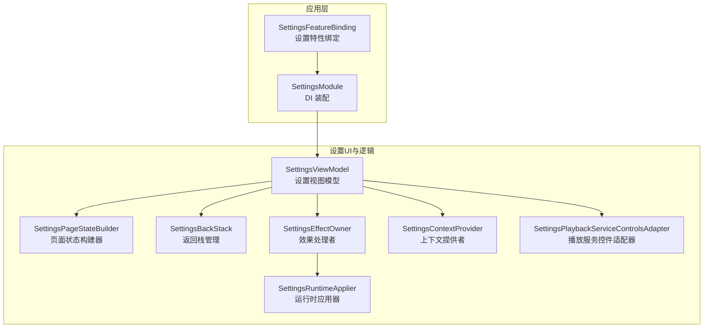
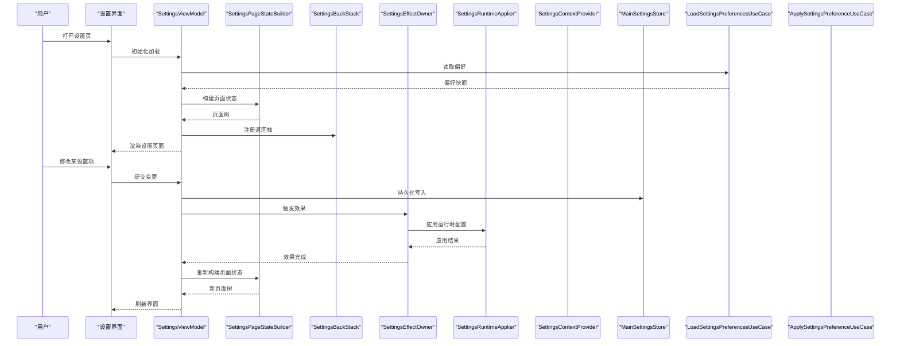
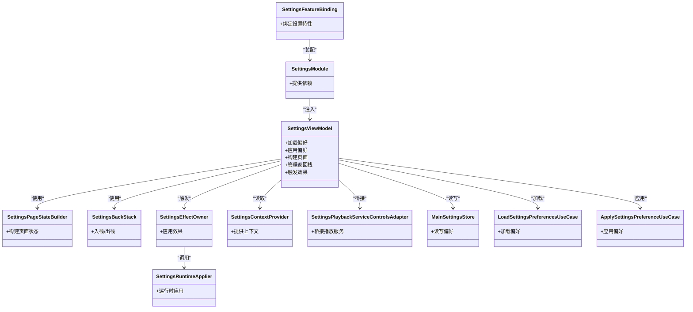

# 设置界面模块 (feature/settings-ui)

<cite>
**本文引用的文件**   
- [SettingsFeatureBinding.java](file://app/src/main/java/app/yukine/SettingsFeatureBinding.java)
- [SettingsModule.kt](file://app/src/main/java/app/yukine/SettingsModule.kt)
- [MainSettingsStore.kt](file://app/src/main/java/app/yukine/MainSettingsStore.kt)
- [ApplySettingsPreferenceUseCase.kt](file://app/src/main/java/app/yukine/ApplySettingsPreferenceUseCase.kt)
- [LoadSettingsPreferencesUseCase.kt](file://app/src/main/java/app/yukine/LoadSettingsPreferencesUseCase.kt)
- [SettingsEffectOwner.kt](file://app/src/main/java/app/yukine/SettingsEffectOwner.kt)
- [SettingsRuntimeApplier.kt](file://app/src/main/java/app/yukine/SettingsRuntimeApplier.kt)
- [SettingsContextProvider.kt](file://app/src/main/java/app/yukine/SettingsContextProvider.kt)
- [SettingsViewModelTest.kt](file://app/src/test/java/app/yukine/SettingsViewModelTest.kt)
- [SettingsPageStateBuilderTest.kt](file://app/src/test/java/app/yukine/SettingsPageStateBuilderTest.kt)
- [SettingsBackStackTest.kt](file://app/src/test/java/app/yukine/SettingsBackStackTest.kt)
- [SettingsEffectOwnerTest.kt](file://app/src/test/java/app/yukine/SettingsEffectOwnerTest.kt)
- [SettingsPlaybackServiceControlsAdapterTest.kt](file://app/src/test/java/app/yukine/SettingsPlaybackServiceControlsAdapterTest.kt)
- [SettingsRuntimeApplierTest.kt](file://app/src/test/java/app/yukine/SettingsRuntimeApplierTest.kt)
- [SettingsPageTest.kt](file://app/src/test/java/app/yukine/SettingsPageTest.kt)
- [SettingsPlaybackServiceControlsAdapter.kt](file://app/src/main/java/app/yukine/SettingsPlaybackServiceControlsAdapter.kt)
</cite>

## 目录
1. [简介](#简介)
2. [项目结构](#项目结构)
3. [核心组件](#核心组件)
4. [架构总览](#架构总览)
5. [详细组件分析](#详细组件分析)
6. [依赖关系分析](#依赖关系分析)
7. [性能与实时性](#性能与实时性)
8. [故障排查指南](#故障排查指南)
9. [结论](#结论)
10. [附录：扩展与定制指南](#附录扩展与定制指南)

## 简介
本文件为 Echo Android 应用的“设置界面模块”（feature/settings-ui）提供系统化文档。内容覆盖设置页面组织、偏好存储、动态配置、应用设置、网络源管理、主题配置等用户界面的实现要点；并深入说明设置项验证、默认值管理、配置迁移、变更实时生效机制、数据持久化与备份恢复集成方式，以及设置项扩展方法与界面定制方案。

## 项目结构
feature/settings-ui 作为独立功能模块，主要职责是提供设置相关的 UI 与交互编排，并通过 DI 与应用主模块进行装配。其关键入口与绑定由 app 模块中的 SettingsFeatureBinding 负责，配合 SettingsModule 完成依赖注入与运行时适配。

图表来源
- [SettingsFeatureBinding.java](file://app/src/main/java/app/yukine/SettingsFeatureBinding.java)
- [SettingsModule.kt](file://app/src/main/java/app/yukine/SettingsModule.kt)

章节来源
- [SettingsFeatureBinding.java](file://app/src/main/java/app/yukine/SettingsFeatureBinding.java)
- [SettingsModule.kt](file://app/src/main/java/app/yukine/SettingsModule.kt)

## 核心组件
- 设置视图模型（SettingsViewModel）：承载设置页面的状态与业务编排，协调页面构建、返回栈、效果执行与运行时应用。
- 页面状态构建器（SettingsPageStateBuilder）：根据当前配置与上下文生成设置页面树与展示状态。
- 返回栈管理（SettingsBackStack）：维护设置子页面的导航历史与回退策略。
- 效果处理者（SettingsEffectOwner）：将设置变更转化为系统级或跨模块的效果（如主题切换、播放服务控制更新）。
- 运行时应用器（SettingsRuntimeApplier）：在内存中即时应用配置变更，确保 UI 与行为同步。
- 上下文提供者（SettingsContextProvider）：向设置模块提供必要的运行上下文（语言、主题、权限等）。
- 播放服务控件适配器（SettingsPlaybackServiceControlsAdapter）：桥接设置项与播放服务的可控制项。

章节来源
- [SettingsViewModelTest.kt](file://app/src/test/java/app/yukine/SettingsViewModelTest.kt)
- [SettingsPageStateBuilderTest.kt](file://app/src/test/java/app/yukine/SettingsPageStateBuilderTest.kt)
- [SettingsBackStackTest.kt](file://app/src/test/java/app/yukine/SettingsBackStackTest.kt)
- [SettingsEffectOwnerTest.kt](file://app/src/test/java/app/yukine/SettingsEffectOwnerTest.kt)
- [SettingsRuntimeApplierTest.kt](file://app/src/test/java/app/yukine/SettingsRuntimeApplierTest.kt)
- [SettingsPlaybackServiceControlsAdapterTest.kt](file://app/src/test/java/app/yukine/SettingsPlaybackServiceControlsAdapterTest.kt)
- [SettingsPlaybackServiceControlsAdapter.kt](file://app/src/main/java/app/yukine/SettingsPlaybackServiceControlsAdapter.kt)

## 架构总览
设置模块采用 MVVM + Effect 模式：UI 通过 ViewModel 暴露状态，用户操作触发 Effect，EffectOwner 将变更应用到运行时与系统层面，同时通过 Store 与 UseCase 读写偏好与配置。

图表来源
- [SettingsViewModelTest.kt](file://app/src/test/java/app/yukine/SettingsViewModelTest.kt)
- [SettingsPageStateBuilderTest.kt](file://app/src/test/java/app/yukine/SettingsPageStateBuilderTest.kt)
- [SettingsBackStackTest.kt](file://app/src/test/java/app/yukine/SettingsBackStackTest.kt)
- [SettingsEffectOwnerTest.kt](file://app/src/test/java/app/yukine/SettingsEffectOwnerTest.kt)
- [SettingsRuntimeApplierTest.kt](file://app/src/test/java/app/yukine/SettingsRuntimeApplierTest.kt)
- [LoadSettingsPreferencesUseCase.kt](file://app/src/main/java/app/yukine/LoadSettingsPreferencesUseCase.kt)
- [ApplySettingsPreferenceUseCase.kt](file://app/src/main/java/app/yukine/ApplySettingsPreferenceUseCase.kt)
- [MainSettingsStore.kt](file://app/src/main/java/app/yukine/MainSettingsStore.kt)

## 详细组件分析

### 设置视图模型（SettingsViewModel）
- 职责
  - 聚合设置页面状态，驱动页面渲染与导航。
  - 协调 Load/Apply UseCase 与 MainSettingsStore 的读写。
  - 触发 Effect 并等待运行时应用完成后再刷新 UI。
- 关键流程
  - 初始化时加载偏好快照，构建页面树，注册返回栈。
  - 用户修改设置后，先持久化，再触发效果，最后重建页面状态。
- 测试覆盖
  - 使用单元测试验证状态流转、页面构建与返回栈行为。

章节来源
- [SettingsViewModelTest.kt](file://app/src/test/java/app/yukine/SettingsViewModelTest.kt)
- [SettingsPageStateBuilderTest.kt](file://app/src/test/java/app/yukine/SettingsPageStateBuilderTest.kt)
- [SettingsBackStackTest.kt](file://app/src/test/java/app/yukine/SettingsBackStackTest.kt)

### 页面状态构建器（SettingsPageStateBuilder）
- 职责
  - 基于当前配置与上下文，生成设置页面树与展示信息。
  - 支持按分组组织设置项（应用设置、网络源管理、主题配置等）。
- 关键点
  - 对动态配置项进行条件渲染与排序。
  - 与返回栈协同，保证页面层级正确。

章节来源
- [SettingsPageStateBuilderTest.kt](file://app/src/test/java/app/yukine/SettingsPageStateBuilderTest.kt)

### 返回栈管理（SettingsBackStack）
- 职责
  - 维护设置子页面的历史与回退策略。
  - 支持批量入栈与出栈，避免重复页面。
- 关键点
  - 与页面状态构建器联动，确保返回时状态一致。

章节来源
- [SettingsBackStackTest.kt](file://app/src/test/java/app/yukine/SettingsBackStackTest.kt)

### 效果处理者（SettingsEffectOwner）
- 职责
  - 将设置变更转换为系统级或跨模块效果（例如主题切换、播放服务控件更新）。
  - 与运行时应用器协作，确保效果顺序与幂等性。
- 关键点
  - 对敏感效果（如语言、主题）进行幂等判断，避免重复应用。

章节来源
- [SettingsEffectOwnerTest.kt](file://app/src/test/java/app/yukine/SettingsEffectOwnerTest.kt)

### 运行时应用器（SettingsRuntimeApplier）
- 职责
  - 在内存中即时应用配置变更，使 UI 与行为同步。
  - 提供统一的运行时配置接口，供其他模块订阅。
- 关键点
  - 对并发变更进行合并与去抖，减少不必要的重算。

章节来源
- [SettingsRuntimeApplierTest.kt](file://app/src/test/java/app/yukine/SettingsRuntimeApplierTest.kt)

### 上下文提供者（SettingsContextProvider）
- 职责
  - 向设置模块提供语言、主题、权限等上下文信息。
  - 为页面状态构建与效果执行提供必要的环境参数。
- 关键点
  - 上下文变化应触发页面重建与效果重放。

章节来源
- [SettingsContextProvider.kt](file://app/src/main/java/app/yukine/SettingsContextProvider.kt)

### 播放服务控件适配器（SettingsPlaybackServiceControlsAdapter）
- 职责
  - 桥接设置项与播放服务的可控制项（如音量、均衡器、显示选项）。
  - 在设置变更后立即通知播放服务更新控件状态。
- 关键点
  - 与 EffectOwner 协作，确保播放服务状态与设置一致。

章节来源
- [SettingsPlaybackServiceControlsAdapterTest.kt](file://app/src/test/java/app/yukine/SettingsPlaybackServiceControlsAdapterTest.kt)
- [SettingsPlaybackServiceControlsAdapter.kt](file://app/src/main/java/app/yukine/SettingsPlaybackServiceControlsAdapter.kt)

### 偏好存储与用例（MainSettingsStore / LoadSettingsPreferencesUseCase / ApplySettingsPreferenceUseCase）
- MainSettingsStore
  - 提供设置的读写接口，封装底层持久化细节。
- LoadSettingsPreferencesUseCase
  - 负责加载偏好快照，供页面初始渲染使用。
- ApplySettingsPreferenceUseCase
  - 负责将用户变更持久化，并返回应用结果。
- 关键点
  - 默认值管理与校验逻辑应在 UseCase 层集中实现，便于复用与测试。
  - 配置迁移可在 Store 或专用迁移器中统一处理。

章节来源
- [MainSettingsStore.kt](file://app/src/main/java/app/yukine/MainSettingsStore.kt)
- [LoadSettingsPreferencesUseCase.kt](file://app/src/main/java/app/yukine/LoadSettingsPreferencesUseCase.kt)
- [ApplySettingsPreferenceUseCase.kt](file://app/src/main/java/app/yukine/ApplySettingsPreferenceUseCase.kt)

## 依赖关系分析
设置模块通过 DI 装配到应用层，核心依赖如下：

图表来源
- [SettingsFeatureBinding.java](file://app/src/main/java/app/yukine/SettingsFeatureBinding.java)
- [SettingsModule.kt](file://app/src/main/java/app/yukine/SettingsModule.kt)
- [SettingsViewModelTest.kt](file://app/src/test/java/app/yukine/SettingsViewModelTest.kt)
- [SettingsPageStateBuilderTest.kt](file://app/src/test/java/app/yukine/SettingsPageStateBuilderTest.kt)
- [SettingsBackStackTest.kt](file://app/src/test/java/app/yukine/SettingsBackStackTest.kt)
- [SettingsEffectOwnerTest.kt](file://app/src/test/java/app/yukine/SettingsEffectOwnerTest.kt)
- [SettingsRuntimeApplierTest.kt](file://app/src/test/java/app/yukine/SettingsRuntimeApplierTest.kt)
- [SettingsPlaybackServiceControlsAdapterTest.kt](file://app/src/test/java/app/yukine/SettingsPlaybackServiceControlsAdapterTest.kt)
- [MainSettingsStore.kt](file://app/src/main/java/app/yukine/MainSettingsStore.kt)
- [LoadSettingsPreferencesUseCase.kt](file://app/src/main/java/app/yukine/LoadSettingsPreferencesUseCase.kt)
- [ApplySettingsPreferenceUseCase.kt](file://app/src/main/java/app/yukine/ApplySettingsPreferenceUseCase.kt)

章节来源
- [SettingsFeatureBinding.java](file://app/src/main/java/app/yukine/SettingsFeatureBinding.java)
- [SettingsModule.kt](file://app/src/main/java/app/yukine/SettingsModule.kt)

## 性能与实时性
- 去抖与批处理：在高频设置变更场景下，运行时应用器应对变更进行合并与去抖，避免频繁重建页面与效果重放。
- 懒加载与分页：对于大型设置页面，建议按需加载子页面与分组，降低首屏渲染压力。
- 幂等效果：对主题、语言等全局效果进行幂等判断，避免重复应用导致的抖动。
- 异步持久化：偏好写入应异步执行，并在完成后回调 UI 刷新，避免阻塞主线程。

[本节为通用性能建议，不直接分析具体文件]

## 故障排查指南
- 设置未生效
  - 检查 ApplySettingsPreferenceUseCase 是否成功持久化。
  - 确认 SettingsEffectOwner 是否正确触发运行时应用。
  - 查看 SettingsRuntimeApplier 是否收到变更并应用。
- 页面状态不一致
  - 验证 SettingsPageStateBuilder 是否基于最新上下文构建。
  - 检查 SettingsBackStack 是否存在重复或遗漏的页面。
- 播放服务控件不同步
  - 确认 SettingsPlaybackServiceControlsAdapter 是否正确桥接设置项与服务端状态。
- 上下文异常
  - 检查 SettingsContextProvider 提供的语言、主题等上下文是否与系统一致。

章节来源
- [SettingsEffectOwnerTest.kt](file://app/src/test/java/app/yukine/SettingsEffectOwnerTest.kt)
- [SettingsRuntimeApplierTest.kt](file://app/src/test/java/app/yukine/SettingsRuntimeApplierTest.kt)
- [SettingsPlaybackServiceControlsAdapterTest.kt](file://app/src/test/java/app/yukine/SettingsPlaybackServiceControlsAdapterTest.kt)

## 结论
设置界面模块以 MVVM + Effect 为核心架构，结合页面状态构建器与返回栈管理，实现了清晰的状态流与可扩展的页面组织。通过 Store 与 UseCase 的解耦设计，设置项的验证、默认值与迁移得以集中管理；EffectOwner 与 RuntimeApplier 保证了变更的实时生效。整体架构具备良好的可测试性与可维护性，适合持续扩展新的设置项与界面定制。

[本节为总结性内容，不直接分析具体文件]

## 附录：扩展与定制指南
- 新增设置项
  - 在页面状态构建器中添加对应分组与条目。
  - 在 Store 中定义键值与默认值，在 UseCase 中实现校验与持久化。
  - 如需运行时生效，在 EffectOwner 中增加对应效果分支。
- 界面定制
  - 通过 ContextProvider 注入主题与语言，确保页面样式与文案一致。
  - 对复杂设置项，可使用自定义控件并通过适配器桥接到播放服务。
- 与全局配置集成
  - 通过 DI 将设置模块与其他功能模块耦合，确保全局配置变更能广播至相关模块。
- 备份与恢复
  - 在 Store 层提供导出/导入接口，与应用的备份恢复流程对接，确保设置数据的完整性与一致性。

[本节为概念性指导，不直接分析具体文件]