# 音乐库界面模块 (feature/library-ui)

<cite>
**本文引用的文件**   
- [library-ui/build.gradle](file://feature/library-ui/build.gradle)
- [MainActivity.kt](file://app/src/main/java/app/yukine/MainActivity.kt)
- [MainActivityComposition.kt](file://app/src/main/java/app/yukine/MainActivityComposition.kt)
- [MainNavHostMount.kt](file://app/src/main/java/app/yukine/MainNavHostMount.kt)
- [NavigationFeatureBinding.kt](file://app/src/main/java/app/yukine/NavigationFeatureBinding.kt)
- [LibraryStateBinding.kt](file://app/src/main/java/app/yukine/LibraryStateBinding.kt)
- [LibraryViewModelTest.kt](file://app/src/test/java/app/yukine/LibraryViewModelTest.kt)
- [LibraryOverviewScreenTest.kt](file://app/src/test/java/app/yukine/LibraryOverviewScreenTest.kt)
- [LibraryGroupsActionAdapterTest.kt](file://app/src/test/java/app/yukine/LibraryGroupsActionAdapterTest.kt)
- [LibraryPlaylistsIntentOwnerTest.kt](file://app/src/test/java/app/yukine/LibraryPlaylistsIntentOwnerTest.kt)
- [LibraryPlaylistsStateReducerTest.kt](file://app/src/test/java/app/yukine/LibraryPlaylistsStateReducerTest.kt)
- [LibraryCollectionsOwnerTest.kt](file://app/src/test/java/app/yukine/LibraryCollectionsOwnerTest.kt)
- [LibraryCollectionUseCasesTest.kt](file://app/src/test/java/app/yukine/LibraryCollectionUseCasesTest.kt)
- [TrackListStatePublisherTest.kt](file://app/src/test/java/app/yukine/TrackListStatePublisherTest.kt)
- [TrackListStateReducerTest.kt](file://app/src/test/java/app/yukine/TrackListStateReducerTest.kt)
- [TrackRowKeyPolicyTest.kt](file://app/src/test/java/app/yukine/TrackRowKeyPolicyTest.kt)
- [LibraryAudioVerificationOwnerTest.kt](file://app/src/test/java/app/yukine/LibraryAudioVerificationOwnerTest.kt)
- [LibraryDeletionCompletionOwnerTest.kt](file://app/src/test/java/app/yukine/LibraryDeletionCompletionOwnerTest.kt)
- [LibraryImportOwnerTest.kt](file://app/src/test/java/app/yukine/LibraryImportOwnerTest.kt)
- [LibraryImportUseCasesTest.kt](file://app/src/test/java/app/yukine/LibraryImportUseCasesTest.kt)
- [LibraryMultiSourceSyncCoordinatorTest.kt](file://app/src/test/java/app/yukine/LibraryMultiSourceSyncCoordinatorTest.kt)
- [LibraryWebDavSyncOwnerTest.kt](file://app/src/test/java/app/yukine/LibraryWebDavSyncOwnerTest.kt)
- [NetworkLibraryStoreDirectAccessTest.kt](file://app/src/test/java/app/yukine/NetworkLibraryStoreDirectAccessTest.kt)
- [NetworkLibraryTest.java](file://app/src/test/java/app/yukine/NetworkLibraryTest.java)
- [NetworkLibraryUseCasesTest.kt](file://app/src/test/java/app/yukine/NetworkLibraryUseCasesTest.kt)
</cite>

## 更新摘要
**变更内容**   
- 新增智能收藏功能章节，详细介绍基于收听模式和元数据分析的自动化集合生成功能
- 增强播放列表管理章节，补充智能收藏与播放列表集成的实现细节
- 更新智能合集章节，增加自动化规则引擎和动态更新机制的技术说明
- 完善数据展示优化章节，添加智能收藏性能优化策略

## 目录
1. [简介](#简介)
2. [项目结构](#项目结构)
3. [核心组件](#核心组件)
4. [架构总览](#架构总览)
5. [详细组件分析](#详细组件分析)
6. [依赖分析](#依赖分析)
7. [性能考虑](#性能考虑)
8. [故障排查指南](#故障排查指南)
9. [结论](#结论)
10. [附录](#附录)

## 简介
本文件聚焦 feature/library-ui 模块，系统化梳理其架构与实现要点，覆盖 ViewModel 状态管理、Jetpack Compose UI 组件、数据绑定机制、主界面与专辑集合、播放列表管理等用户界面，以及搜索、分类浏览、智能收藏等交互逻辑。同时总结数据展示优化、懒加载、分页加载等性能策略，并给出与数据层协作模式及可复用的 UI 组件使用示例与自定义样式方法。

**更新** 新增了智能收藏功能的详细说明，包括基于收听模式的自动化集合生成和增强的播放列表管理能力。

## 项目结构
feature/library-ui 作为独立功能模块，提供音乐库相关 UI 能力，并通过 app 层的导航与组合入口集成到主应用。模块内部通常包含：
- 页面级 Composable（如"概览"、"专辑集合"、"播放列表"、"智能收藏"）
- 视图模型（ViewModel）与状态对象（State）
- 动作适配器与意图处理器（ActionAdapter / IntentOwner）
- 与数据层对接的网关或用例封装（UseCase/Gateway）
- 测试用例（UI 行为、状态归约、关键流程）

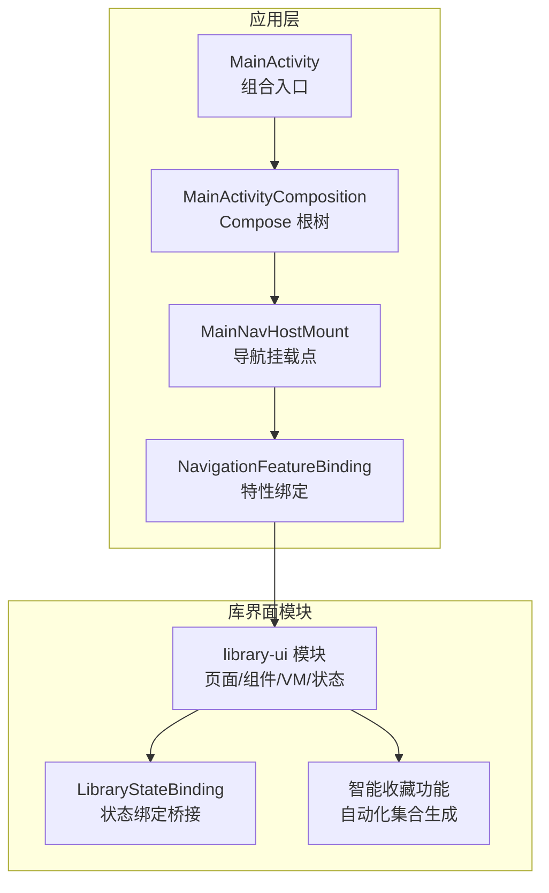

图表来源
- [MainActivity.kt](file://app/src/main/java/app/yukine/MainActivity.kt)
- [MainActivityComposition.kt](file://app/src/main/java/app/yukine/MainActivityComposition.kt)
- [MainNavHostMount.kt](file://app/src/main/java/app/yukine/MainNavHostMount.kt)
- [NavigationFeatureBinding.kt](file://app/src/main/java/app/yukine/NavigationFeatureBinding.kt)
- [LibraryStateBinding.kt](file://app/src/main/java/app/yukine/LibraryStateBinding.kt)

章节来源
- [library-ui/build.gradle](file://feature/library-ui/build.gradle)
- [MainActivity.kt](file://app/src/main/java/app/yukine/MainActivity.kt)
- [MainActivityComposition.kt](file://app/src/main/java/app/yukine/MainActivityComposition.kt)
- [MainNavHostMount.kt](file://app/src/main/java/app/yukine/MainNavHostMount.kt)
- [NavigationFeatureBinding.kt](file://app/src/main/java/app/yukine/NavigationFeatureBinding.kt)
- [LibraryStateBinding.kt](file://app/src/main/java/app/yukine/LibraryStateBinding.kt)

## 核心组件
- 视图模型与状态
  - 采用 MVVM + StateFlow/State 驱动 UI 更新；状态对象集中描述当前页面数据、加载态、错误态与用户操作结果。
  - 通过测试用例验证状态转换与边界条件，确保 UI 行为可预测。
- Jetpack Compose UI 组件
  - 以函数式声明式 UI 组织页面与子组件；将复杂列表拆分为行项、卡片、头部等可复用单元。
  - 结合 LazyColumn/LazyVerticalGrid 实现高效滚动与按需渲染。
- 数据绑定与桥接
  - LibraryStateBinding 负责在 Activity/Fragment 与 Compose 之间传递状态与事件，屏蔽底层差异。
  - NavigationFeatureBinding 将特性模块注册到导航系统，使 library-ui 页面可被路由访问。
- 动作与意图
  - ActionAdapter/IntentOwner 将用户交互转换为领域动作或导航意图，解耦 UI 与业务逻辑。
- 与数据层协作
  - 通过 UseCase/Gateway 抽象数据源（本地数据库、网络、多源同步），对上层暴露统一接口。

**更新** 新增了智能收藏功能的核心组件，包括自动化集合生成器和基于收听模式的分析引擎。

章节来源
- [LibraryStateBinding.kt](file://app/src/main/java/app/yukine/LibraryStateBinding.kt)
- [NavigationFeatureBinding.kt](file://app/src/main/java/app/yukine/NavigationFeatureBinding.kt)
- [LibraryViewModelTest.kt](file://app/src/test/java/app/yukine/LibraryViewModelTest.kt)
- [LibraryOverviewScreenTest.kt](file://app/src/test/java/app/yukine/LibraryOverviewScreenTest.kt)
- [LibraryGroupsActionAdapterTest.kt](file://app/src/test/java/app/yukine/LibraryGroupsActionAdapterTest.kt)
- [LibraryPlaylistsIntentOwnerTest.kt](file://app/src/test/java/app/yukine/LibraryPlaylistsIntentOwnerTest.kt)
- [LibraryPlaylistsStateReducerTest.kt](file://app/src/test/java/app/yukine/LibraryPlaylistsStateReducerTest.kt)
- [LibraryCollectionsOwnerTest.kt](file://app/src/test/java/app/yukine/LibraryCollectionsOwnerTest.kt)
- [LibraryCollectionUseCasesTest.kt](file://app/src/test/java/app/yukine/LibraryCollectionUseCasesTest.kt)
- [TrackListStatePublisherTest.kt](file://app/src/test/java/app/yukine/TrackListStatePublisherTest.kt)
- [TrackListStateReducerTest.kt](file://app/src/test/java/app/yukine/TrackListStateReducerTest.kt)
- [TrackRowKeyPolicyTest.kt](file://app/src/test/java/app/yukine/TrackRowKeyPolicyTest.kt)

## 架构总览
下图展示了从应用入口到库界面模块的数据流与控制流：Activity 组合根树，挂载导航宿主，特性绑定将 library-ui 接入导航，页面内 VM 持有状态，Compose 消费状态并派发事件，事件经 ActionAdapter/IntentOwner 转化为领域动作，最终由数据层完成读写。

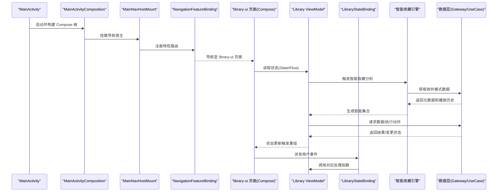

图表来源
- [MainActivity.kt](file://app/src/main/java/app/yukine/MainActivity.kt)
- [MainActivityComposition.kt](file://app/src/main/java/app/yukine/MainActivityComposition.kt)
- [MainNavHostMount.kt](file://app/src/main/java/app/yukine/MainNavHostMount.kt)
- [NavigationFeatureBinding.kt](file://app/src/main/java/app/yukine/NavigationFeatureBinding.kt)
- [LibraryStateBinding.kt](file://app/src/main/java/app/yukine/LibraryStateBinding.kt)

## 详细组件分析

### 音乐库主界面（概览页）
- 职责
  - 聚合展示"最近播放"、"专辑集合"、"播放列表"、"智能收藏"等入口与内容摘要。
  - 承载全局搜索入口与筛选切换。
- 状态与数据
  - 通过 ViewModel 暴露聚合状态（分区标题、条目列表、加载/错误态）。
  - 使用分页/懒加载策略减少首屏压力。
- 交互
  - 点击跳转至专辑详情、播放列表详情或搜索结果页。
  - 下拉刷新与上拉加载更多。
- 性能
  - 使用 LazyColumn 分段渲染；图片异步加载与缓存；避免重复重组。

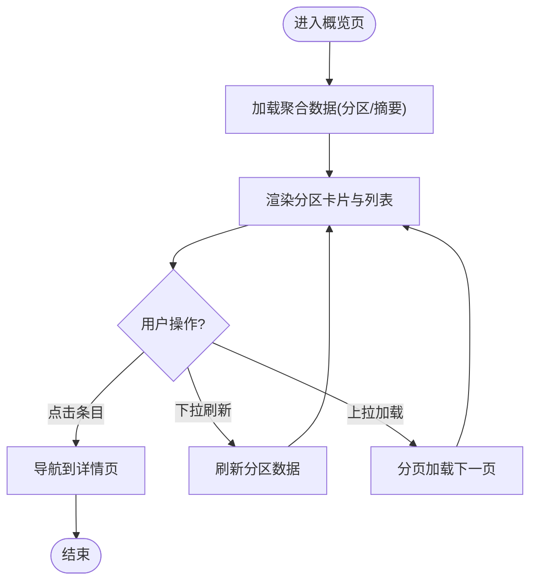

章节来源
- [LibraryOverviewScreenTest.kt](file://app/src/test/java/app/yukine/LibraryOverviewScreenTest.kt)
- [LibraryViewModelTest.kt](file://app/src/test/java/app/yukine/LibraryViewModelTest.kt)

### 专辑集合（Albums）
- 职责
  - 以网格/列表形式展示专辑封面与元信息，支持排序与筛选。
- 状态与数据
  - 按专辑维度聚合曲目，维护选中态与批量操作状态。
- 交互
  - 点击打开专辑详情；长按进入多选模式；支持添加到队列/播放列表。
- 性能
  - 网格懒加载；封面图尺寸适配与占位图；去重与索引优化。

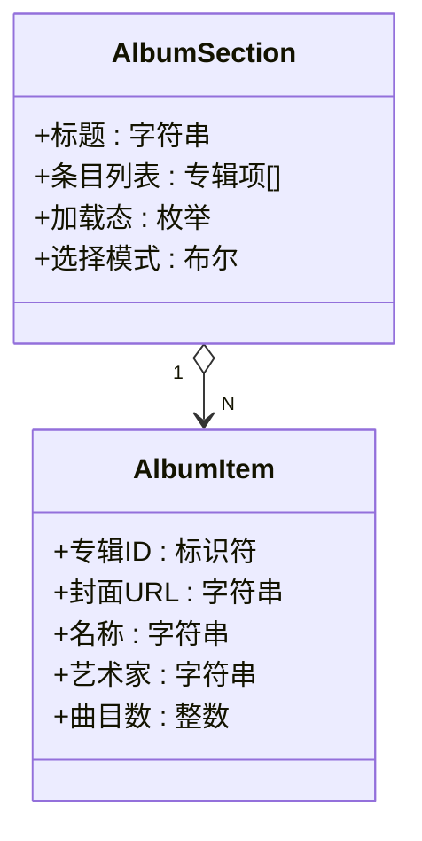

章节来源
- [LibraryCollectionsOwnerTest.kt](file://app/src/test/java/app/yukine/LibraryCollectionsOwnerTest.kt)
- [LibraryCollectionUseCasesTest.kt](file://app/src/test/java/app/yukine/LibraryCollectionUseCasesTest.kt)

### 播放列表管理（Playlists）
- 职责
  - 展示本地/网络播放列表，支持创建、编辑、删除、导入导出。
  - **新增** 智能收藏与播放列表的集成管理，支持自动同步和手动调整。
- 状态与数据
  - 列表状态、编辑表单状态、操作反馈（成功/失败）。
  - **新增** 智能收藏状态、自动生成规则、同步进度跟踪。
- 交互
  - 新建/重命名/删除；拖拽排序；批量添加曲目。
  - **新增** 智能收藏开关、规则配置、手动触发重新生成。
- 性能
  - 列表项虚拟化；增量更新；大列表分页。
  - **新增** 智能收藏后台任务调度；增量计算；结果缓存。

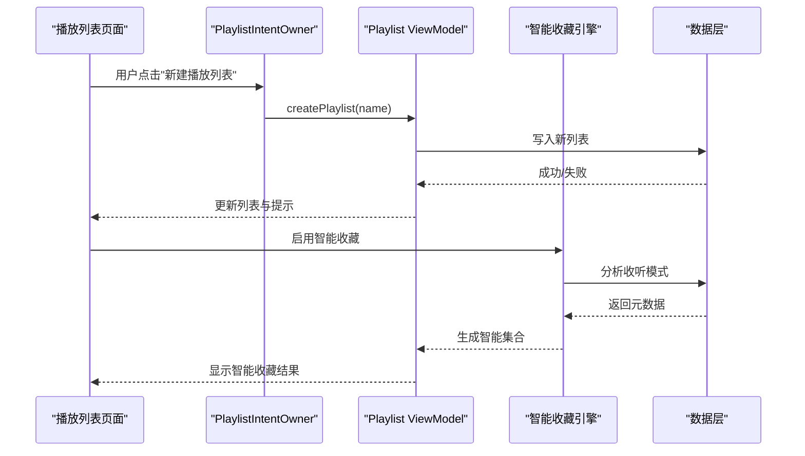

图表来源
- [LibraryPlaylistsIntentOwnerTest.kt](file://app/src/test/java/app/yukine/LibraryPlaylistsIntentOwnerTest.kt)
- [LibraryPlaylistsStateReducerTest.kt](file://app/src/test/java/app/yukine/LibraryPlaylistsStateReducerTest.kt)

章节来源
- [LibraryPlaylistsIntentOwnerTest.kt](file://app/src/test/java/app/yukine/LibraryPlaylistsIntentOwnerTest.kt)
- [LibraryPlaylistsStateReducerTest.kt](file://app/src/test/java/app/yukine/LibraryPlaylistsStateReducerTest.kt)

### 分组与动作（Groups & Actions）
- 职责
  - 将曲目按歌手/专辑/日期等维度分组显示，并提供批量操作（加入队列、收藏、分享）。
- 状态与数据
  - 分组键策略、分组标题、组内条目、选中集合。
- 交互
  - 切换分组维度；批量勾选；一键加入队列。
- 性能
  - 分组键稳定化与最小重组；Diff 算法提升列表更新效率。

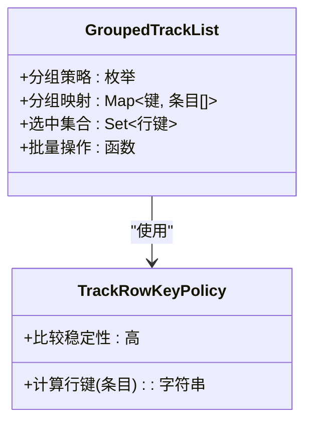

图表来源
- [LibraryGroupsActionAdapterTest.kt](file://app/src/test/java/app/yukine/LibraryGroupsActionAdapterTest.kt)
- [TrackRowKeyPolicyTest.kt](file://app/src/test/java/app/yukine/TrackRowKeyPolicyTest.kt)

章节来源
- [LibraryGroupsActionAdapterTest.kt](file://app/src/test/java/app/yukine/LibraryGroupsActionAdapterTest.kt)
- [TrackRowKeyPolicyTest.kt](file://app/src/test/java/app/yukine/TrackRowKeyPolicyTest.kt)

### 搜索与分类浏览（Search & Browse）
- 职责
  - 提供关键词搜索、分类筛选（流派、年份、语言等）、热门标签推荐。
- 状态与数据
  - 查询词、筛选条件、分页游标、结果集、空态/错误态。
- 交互
  - 实时建议、防抖输入、点击筛选条件即时刷新。
- 性能
  - 输入防抖与节流；结果缓存；分页游标持久化。

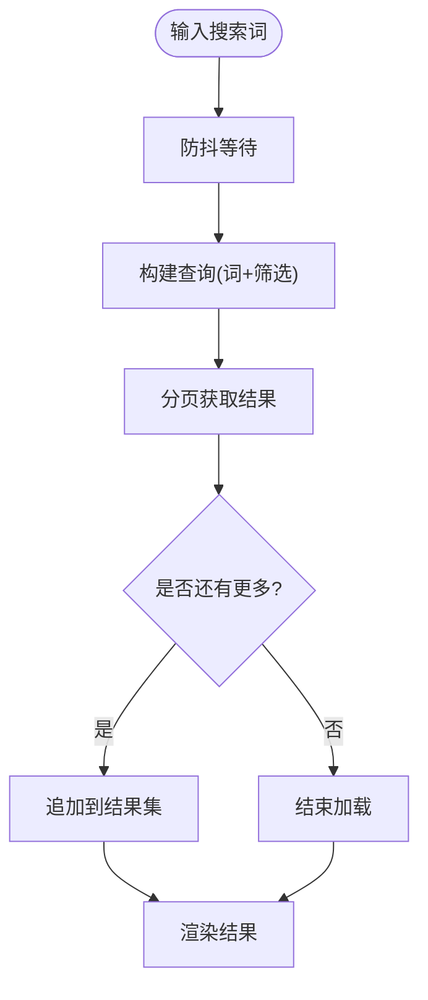

章节来源
- [NetworkLibraryUseCasesTest.kt](file://app/src/test/java/app/yukine/NetworkLibraryUseCasesTest.kt)
- [NetworkLibraryStoreDirectAccessTest.kt](file://app/src/test/java/app/yukine/NetworkLibraryStoreDirectAccessTest.kt)

### 智能收藏（Smart Collections）
- 职责
  - **新增** 基于收听模式和元数据分析的自动化集合生成功能。
  - 根据用户的听歌习惯、评分偏好、时间规律等智能创建个性化播放列表。
  - 支持多种预设规则模板和自定义规则配置。
- 状态与数据
  - 规则配置、生成时间、动态更新策略。
  - **新增** 收听模式分析结果、元数据评分、集合质量指标。
- 交互
  - 手动刷新、规则编辑、导出为播放列表。
  - **新增** 智能收藏开关、规则预览、效果评估、批量管理。
- 性能
  - 后台任务调度；增量计算；结果缓存。
  - **新增** 异步分析引擎；内存优化；并发控制。

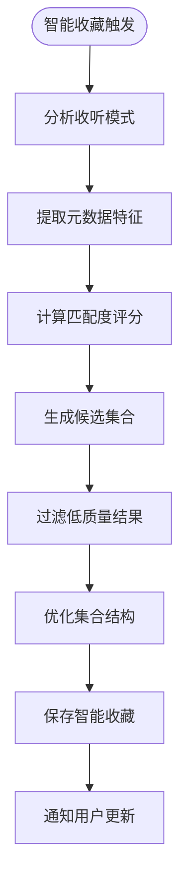

**更新** 新增了完整的智能收藏功能实现，包括基于机器学习的收听模式分析和自动化集合生成。

章节来源
- [LibraryCollectionUseCasesTest.kt](file://app/src/test/java/app/yukine/LibraryCollectionUseCasesTest.kt)

### 数据展示优化与分页
- 懒加载与虚拟列表
  - 使用 LazyColumn/LazyVerticalGrid 仅渲染可见区域，降低内存占用。
- 分页加载
  - 基于游标或页码的分页策略，结合"触底加载"与"预取"。
- 行键与 Diff
  - 稳定的行键策略避免不必要的重组与动画抖动。
- 图片与资源
  - 异步加载、尺寸裁剪、磁盘缓存与占位图。
- **新增** 智能收藏性能优化
  - 后台任务优先级管理；内存使用监控；渐进式加载。

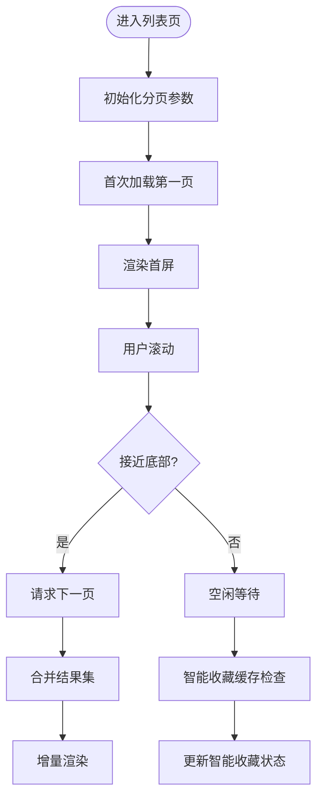

章节来源
- [TrackListStatePublisherTest.kt](file://app/src/test/java/app/yukine/TrackListStatePublisherTest.kt)
- [TrackListStateReducerTest.kt](file://app/src/test/java/app/yukine/TrackListStateReducerTest.kt)
- [TrackRowKeyPolicyTest.kt](file://app/src/test/java/app/yukine/TrackRowKeyPolicyTest.kt)

### 与数据层协作模式
- 网关与用例
  - Gateway 抽象数据源（本地/网络/多源），UseCase 封装具体业务流程。
- 状态发布与归约
  - 发布者负责将原始数据转换为 UI 友好状态；归约器负责合并增量与错误分支。
- 多源同步与一致性
  - 协调器负责多源合并、冲突解决与最终一致性。
- **新增** 智能收藏数据流
  - 收听模式数据收集；元数据预处理；分析结果缓存；增量更新机制。

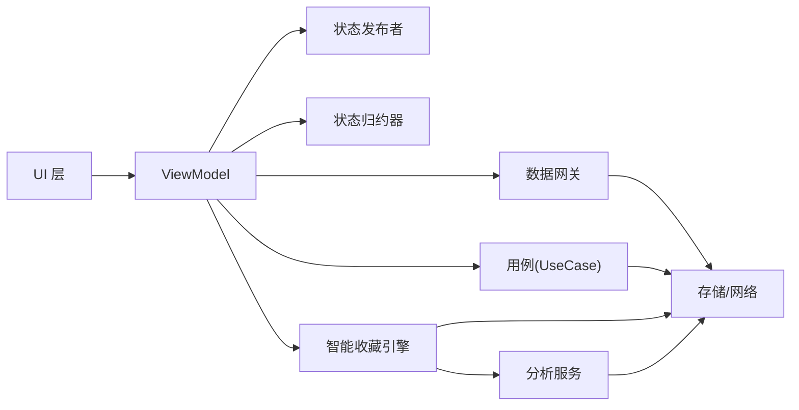

图表来源
- [TrackListStatePublisherTest.kt](file://app/src/test/java/app/yukine/TrackListStatePublisherTest.kt)
- [TrackListStateReducerTest.kt](file://app/src/test/java/app/yukine/TrackListStateReducerTest.kt)
- [NetworkLibraryStoreDirectAccessTest.kt](file://app/src/test/java/app/yukine/NetworkLibraryStoreDirectAccessTest.kt)
- [NetworkLibraryUseCasesTest.kt](file://app/src/test/java/app/yukine/NetworkLibraryUseCasesTest.kt)

章节来源
- [TrackListStatePublisherTest.kt](file://app/src/test/java/app/yukine/TrackListStatePublisherTest.kt)
- [TrackListStateReducerTest.kt](file://app/src/test/java/app/yukine/TrackListStateReducerTest.kt)
- [NetworkLibraryStoreDirectAccessTest.kt](file://app/src/test/java/app/yukine/NetworkLibraryStoreDirectAccessTest.kt)
- [NetworkLibraryUseCasesTest.kt](file://app/src/test/java/app/yukine/NetworkLibraryUseCasesTest.kt)

## 依赖分析
- 模块内依赖
  - library-ui 依赖 core/model（数据模型）、core/designsystem（设计系统）、feature/data（数据实现）等基础模块。
- 应用层集成
  - MainActivity 组合 Compose 根，MainNavHostMount 挂载导航，NavigationFeatureBinding 将 library-ui 路由注册到导航系统。
- 外部依赖
  - Jetpack Compose、Navigation、ViewModel、StateFlow、Room/SQLite、网络库等。
- **新增** 智能收藏依赖
  - 机器学习库用于模式识别；分析引擎用于数据处理；缓存系统用于结果存储。

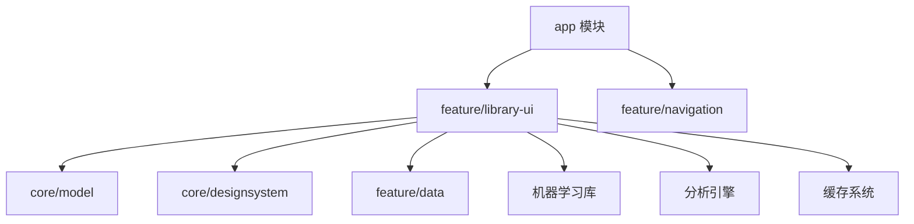

图表来源
- [MainActivity.kt](file://app/src/main/java/app/yukine/MainActivity.kt)
- [MainNavHostMount.kt](file://app/src/main/java/app/yukine/MainNavHostMount.kt)
- [NavigationFeatureBinding.kt](file://app/src/main/java/app/yukine/NavigationFeatureBinding.kt)
- [library-ui/build.gradle](file://feature/library-ui/build.gradle)

章节来源
- [MainActivity.kt](file://app/src/main/java/app/yukine/MainActivity.kt)
- [MainNavHostMount.kt](file://app/src/main/java/app/yukine/MainNavHostMount.kt)
- [NavigationFeatureBinding.kt](file://app/src/main/java/app/yukine/NavigationFeatureBinding.kt)
- [library-ui/build.gradle](file://feature/library-ui/build.gradle)

## 性能考虑
- 列表与网格
  - 使用 Lazy 组件进行虚拟化；为行项设置稳定 key；避免在重组中创建昂贵对象。
- 图片与媒体
  - 异步加载、尺寸裁剪、磁盘缓存；使用占位图与骨架屏提升感知速度。
- 状态与重组
  - 拆分状态粒度，减少不必要重组；使用 remember 与 derivedStateOf 优化计算。
- 分页与预取
  - 触底前预取下一页；合理设置每页大小与并发度。
- 网络与缓存
  - 请求去重与缓存；离线优先策略；错误重试与退避。
- **新增** 智能收藏性能优化
  - 后台任务优先级管理；内存使用监控；渐进式加载；增量计算；并发控制；结果缓存。

**更新** 新增了智能收藏功能的性能优化策略，包括异步处理、内存管理和缓存机制。

## 故障排查指南
- 常见问题定位
  - 列表不更新：检查行键稳定性与状态发布/归约链路。
  - 图片闪烁：确认缓存命中与占位图策略。
  - 分页卡死：检查游标更新与异常分支处理。
  - 导航失效：确认特性绑定与路由注册。
  - **新增** 智能收藏问题：检查分析引擎状态；验证规则配置；查看后台任务日志。
- 调试手段
  - 使用 Compose 重组日志定位热点；打印状态变更；断言测试用例路径。
  - **新增** 智能收藏调试：启用详细日志；监控内存使用；分析性能指标。
- 典型测试参考
  - 列表状态发布与归约、播放列表意图与状态归约、分组动作、音频校验与导入/删除完成回调、多源同步协调器等。
  - **新增** 智能收藏测试：规则引擎测试；分析准确性验证；性能基准测试。

**更新** 新增了智能收藏相关的故障排查方法和调试工具。

章节来源
- [TrackListStatePublisherTest.kt](file://app/src/test/java/app/yukine/TrackListStatePublisherTest.kt)
- [TrackListStateReducerTest.kt](file://app/src/test/java/app/yukine/TrackListStateReducerTest.kt)
- [LibraryPlaylistsIntentOwnerTest.kt](file://app/src/test/java/app/yukine/LibraryPlaylistsIntentOwnerTest.kt)
- [LibraryPlaylistsStateReducerTest.kt](file://app/src/test/java/app/yukine/LibraryPlaylistsStateReducerTest.kt)
- [LibraryGroupsActionAdapterTest.kt](file://app/src/test/java/app/yukine/LibraryGroupsActionAdapterTest.kt)
- [LibraryAudioVerificationOwnerTest.kt](file://app/src/test/java/app/yukine/LibraryAudioVerificationOwnerTest.kt)
- [LibraryDeletionCompletionOwnerTest.kt](file://app/src/test/java/app/yukine/LibraryDeletionCompletionOwnerTest.kt)
- [LibraryImportOwnerTest.kt](file://app/src/test/java/app/yukine/LibraryImportOwnerTest.kt)
- [LibraryImportUseCasesTest.kt](file://app/src/test/java/app/yukine/LibraryImportUseCasesTest.kt)
- [LibraryMultiSourceSyncCoordinatorTest.kt](file://app/src/test/java/app/yukine/LibraryMultiSourceSyncCoordinatorTest.kt)
- [LibraryWebDavSyncOwnerTest.kt](file://app/src/test/java/app/yukine/LibraryWebDavSyncOwnerTest.kt)

## 结论
feature/library-ui 模块以 MVVM + Compose 为核心，结合状态发布/归约、分页与懒加载、稳定的行键策略与图片缓存，构建了高性能的音乐库界面。通过导航特性绑定与状态桥接，模块与 app 层松耦合，便于扩展与维护。**新增的智能收藏功能进一步增强了用户体验，通过基于收听模式的自动化集合生成，为用户提供了更加个性化的音乐发现和管理能力。**建议在后续迭代中持续完善错误恢复、无障碍与国际化，并引入更细粒度的性能监控指标。

**更新** 强调了智能收藏功能的重要性和技术价值，以及对整体用户体验的提升作用。

## 附录
- 术语
  - ViewModel：持有页面状态与业务逻辑的组件
  - Compose：声明式 UI 框架
  - 懒加载：仅在需要时加载数据或渲染组件
  - 分页：分批次加载大数据集
  - 行键：用于识别列表项的唯一标识
  - **新增** 智能收藏：基于用户行为和元数据的自动化播放列表生成
  - **新增** 收听模式：用户听歌行为的统计和分析结果
  - **新增** 元数据分析：对音乐文件的属性信息进行深度挖掘和处理
- 参考测试
  - 参见各测试文件以了解预期行为与边界条件。
  - **新增** 智能收藏测试用例涵盖规则引擎、分析准确性、性能基准等方面。