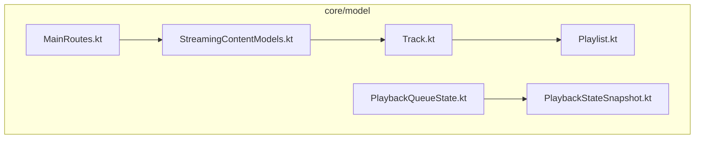
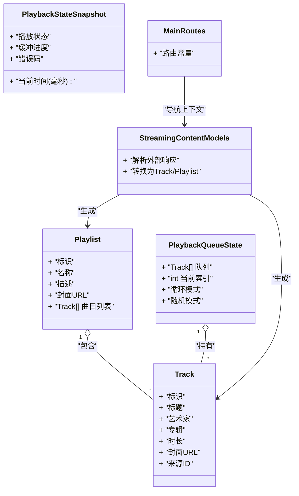
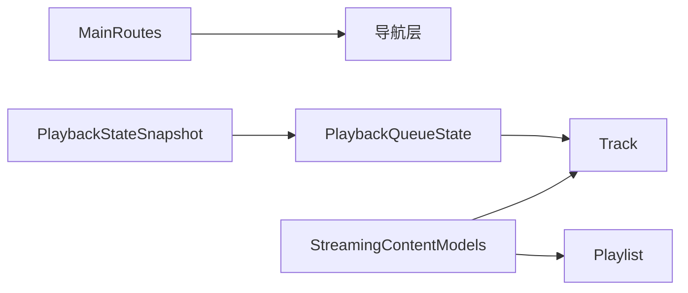

# 数据模型模块 (core/model)

<cite>
**本文引用的文件**   
- [Track.kt](file://core/model/src/main/java/app/yukine/model/Track.kt)
- [Playlist.kt](file://core/model/src/main/java/app/yukine/model/Playlist.kt)
- [PlaybackQueueState.kt](file://core/model/src/main/java/app/yukine/playback/PlaybackQueueState.kt)
- [PlaybackStateSnapshot.kt](file://core/model/src/main/java/app/yukine/playback/PlaybackStateSnapshot.kt)
- [StreamingContentModels.kt](file://core/model/src/main/java/app/yukine/streaming/StreamingContentModels.kt)
- [MainRoutes.kt](file://core/model/src/main/java/app/yukine/navigation/MainRoutes.kt)
</cite>

## 目录
1. [简介](#简介)
2. [项目结构](#项目结构)
3. [核心组件](#核心组件)
4. [架构总览](#架构总览)
5. [详细组件分析](#详细组件分析)
6. [依赖关系分析](#依赖关系分析)
7. [性能与序列化注意事项](#性能与序列化注意事项)
8. [故障排查指南](#故障排查指南)
9. [结论](#结论)
10. [附录：跨模块使用示例](#附录跨模块使用示例)

## 简介
本章节聚焦 core/model 模块的数据模型，覆盖以下关键内容：
- 核心实体：Track、Playlist 的字段定义与关系
- 播放状态模型：PlaybackQueueState、PlaybackStateSnapshot 等
- 流媒体相关模型：StreamingContentModels
- 路由常量：MainRoutes
- 序列化/反序列化规则、数据验证约束与业务逻辑
- 跨模块传递与使用示例（以路径引用形式给出）

该文档旨在帮助开发者快速理解并正确使用这些模型，确保在 UI、播放、流媒体与导航等模块间保持一致的数据契约。

## 项目结构
core/model 模块按领域组织数据模型与常量，便于多模块共享。主要文件与职责如下：
- Track.kt：曲目实体，承载音乐元数据与来源标识
- Playlist.kt：歌单实体，包含曲目集合与基本信息
- PlaybackQueueState.kt：播放队列状态，描述当前队列与游标位置
- PlaybackStateSnapshot.kt：播放快照，记录播放进度、状态等瞬时信息
- StreamingContentModels.kt：流媒体内容相关的通用数据结构
- MainRoutes.kt：主界面路由常量，用于导航层统一入口

图表来源
- [Track.kt](file://core/model/src/main/java/app/yukine/model/Track.kt)
- [Playlist.kt](file://core/model/src/main/java/app/yukine/model/Playlist.kt)
- [PlaybackQueueState.kt](file://core/model/src/main/java/app/yukine/playback/PlaybackQueueState.kt)
- [PlaybackStateSnapshot.kt](file://core/model/src/main/java/app/yukine/playback/PlaybackStateSnapshot.kt)
- [StreamingContentModels.kt](file://core/model/src/main/java/app/yukine/streaming/StreamingContentModels.kt)
- [MainRoutes.kt](file://core/model/src/main/java/app/yukine/navigation/MainRoutes.kt)

章节来源
- [Track.kt](file://core/model/src/main/java/app/yukine/model/Track.kt)
- [Playlist.kt](file://core/model/src/main/java/app/yukine/model/Playlist.kt)
- [PlaybackQueueState.kt](file://core/model/src/main/java/app/yukine/playback/PlaybackQueueState.kt)
- [PlaybackStateSnapshot.kt](file://core/model/src/main/java/app/yukine/playback/PlaybackStateSnapshot.kt)
- [StreamingContentModels.kt](file://core/model/src/main/java/app/yukine/streaming/StreamingContentModels.kt)
- [MainRoutes.kt](file://core/model/src/main/java/app/yukine/navigation/MainRoutes.kt)

## 核心组件
本节概述各模型的核心职责与关键字段类型，不展示具体代码内容。

- Track（曲目）
  - 作用：表示一首可播放的音乐条目，包含标题、艺术家、专辑、时长、封面、来源标识等
  - 关键关系：被 Playlist 引用；作为 PlaybackQueueState 的队列项；参与 StreamingContentModels 的内容解析
  - 典型用途：列表展示、详情展示、下载/分享、搜索命中结果

- Playlist（歌单）
  - 作用：一组 Track 的有序集合，包含名称、描述、封面、创建/更新时间等
  - 关键关系：聚合多个 Track；可作为流媒体导入的目标或本地持久化对象
  - 典型用途：收藏页、导入导出、批量操作

- PlaybackQueueState（播放队列状态）
  - 作用：维护当前播放队列、当前索引、循环模式、随机模式等
  - 关键关系：持有 Track 列表与游标；驱动播放服务切换曲目
  - 典型用途：队列管理、切歌、重排、同步到通知栏

- PlaybackStateSnapshot（播放快照）
  - 作用：记录播放器的瞬时状态，如当前时间、播放状态、缓冲进度、错误码等
  - 关键关系：由播放器事件更新；UI 订阅以刷新显示
  - 典型用途：进度条、播放控制按钮、悬浮歌词、锁屏控件

- StreamingContentModels（流媒体内容模型）
  - 作用：抽象不同流媒体源返回的内容结构，提供统一的解析与转换接口
  - 关键关系：将外部响应映射为内部 Track/Playlist 等模型
  - 典型用途：网络请求后数据归一化、缓存写入、UI 渲染

- MainRoutes（主路由常量）
  - 作用：集中定义应用内页面跳转的路径常量，避免硬编码字符串
  - 关键关系：被导航层与页面控制器消费
  - 典型用途：从搜索结果跳转到详情页、从歌单跳转到播放页

章节来源
- [Track.kt](file://core/model/src/main/java/app/yukine/model/Track.kt)
- [Playlist.kt](file://core/model/src/main/java/app/yukine/model/Playlist.kt)
- [PlaybackQueueState.kt](file://core/model/src/main/java/app/yukine/playback/PlaybackQueueState.kt)
- [PlaybackStateSnapshot.kt](file://core/model/src/main/java/app/yukine/playback/PlaybackStateSnapshot.kt)
- [StreamingContentModels.kt](file://core/model/src/main/java/app/yukine/streaming/StreamingContentModels.kt)
- [MainRoutes.kt](file://core/model/src/main/java/app/yukine/navigation/MainRoutes.kt)

## 架构总览
下图展示了核心模型之间的静态关系与主要交互方向。

图表来源
- [Track.kt](file://core/model/src/main/java/app/yukine/model/Track.kt)
- [Playlist.kt](file://core/model/src/main/java/app/yukine/model/Playlist.kt)
- [PlaybackQueueState.kt](file://core/model/src/main/java/app/yukine/playback/PlaybackQueueState.kt)
- [PlaybackStateSnapshot.kt](file://core/model/src/main/java/app/yukine/playback/PlaybackStateSnapshot.kt)
- [StreamingContentModels.kt](file://core/model/src/main/java/app/yukine/streaming/StreamingContentModels.kt)
- [MainRoutes.kt](file://core/model/src/main/java/app/yukine/navigation/MainRoutes.kt)

## 详细组件分析

### Track 模型
- 字段说明
  - 标识：唯一 ID，用于去重与关联
  - 标题/艺术家/专辑：基础元数据，用于展示与排序
  - 时长：毫秒级时长，用于进度计算与列表展示
  - 封面 URL：图片资源地址，需配合加载器使用
  - 来源 ID：区分本地/流媒体等不同来源
- 数据关系
  - 被 Playlist 聚合
  - 作为 PlaybackQueueState 的队列元素
  - 由 StreamingContentModels 解析生成
- 验证与约束
  - 必填字段校验（如标识、标题）
  - 时长非负
  - URL 格式合法性
- 序列化/反序列化
  - JSON 键名与字段映射约定
  - 缺失字段时的默认值策略
- 业务逻辑
  - 比较与排序（按标题/艺术家/时长）
  - 去重策略（基于标识或哈希）

章节来源
- [Track.kt](file://core/model/src/main/java/app/yukine/model/Track.kt)

### Playlist 模型
- 字段说明
  - 标识/名称/描述/封面 URL：歌单基本信息
  - 曲目列表：Track 数组，保持顺序
- 数据关系
  - 聚合 Track
  - 可与用户账户或本地存储绑定
- 验证与约束
  - 名称非空与长度限制
  - 曲目列表非空时至少包含一个有效 Track
- 序列化/反序列化
  - 嵌套对象的序列化顺序与版本兼容
- 业务逻辑
  - 添加/删除/移动曲目
  - 导出为 M3U 等格式（由上层用例处理）

章节来源
- [Playlist.kt](file://core/model/src/main/java/app/yukine/model/Playlist.kt)

### PlaybackQueueState 模型
- 字段说明
  - 队列：Track 列表
  - 当前索引：指向正在播放或即将播放的 Track
  - 循环/随机模式：控制播放行为
- 数据关系
  - 强依赖 Track
  - 与 PlaybackStateSnapshot 协同反映播放进程
- 验证与约束
  - 索引越界保护
  - 空队列时的降级策略
- 业务逻辑
  - 入队/出队/插入/替换
  - 随机打乱与记忆恢复
  - 与播放服务的事件同步

章节来源
- [PlaybackQueueState.kt](file://core/model/src/main/java/app/yukine/playback/PlaybackQueueState.kt)

### PlaybackStateSnapshot 模型
- 字段说明
  - 播放状态：如空闲、播放中、暂停、错误
  - 当前时间/缓冲进度：毫秒与百分比
  - 错误码：用于诊断与提示
- 数据关系
  - 与 PlaybackQueueState 共同构成完整播放上下文
- 验证与约束
  - 时间范围校验（不超过曲目时长）
  - 错误码枚举有效性
- 业务逻辑
  - 增量更新与合并策略
  - 异常恢复与重试标记

章节来源
- [PlaybackStateSnapshot.kt](file://core/model/src/main/java/app/yukine/playback/PlaybackStateSnapshot.kt)

### StreamingContentModels 模型
- 字段说明
  - 外部响应结构抽象：适配不同流媒体源的差异
  - 转换规则：将外部字段映射为内部 Track/Playlist
- 数据关系
  - 输出 Track/Playlist
  - 输入来自网络层或缓存
- 验证与约束
  - 字段存在性与类型校验
  - 容错与降级（缺失字段时使用占位值）
- 业务逻辑
  - 分页/增量更新
  - 去重与冲突解决

章节来源
- [StreamingContentModels.kt](file://core/model/src/main/java/app/yukine/streaming/StreamingContentModels.kt)

### MainRoutes 路由常量
- 字段说明
  - 路由键：字符串常量，代表页面或动作
- 数据关系
  - 被导航层消费，触发对应页面打开
- 业务逻辑
  - 参数传递约定（如通过 Bundle/NavArgs）
  - 与 StreamingContentModels 结合实现“从搜索结果进入详情”

章节来源
- [MainRoutes.kt](file://core/model/src/main/java/app/yukine/navigation/MainRoutes.kt)

## 依赖关系分析
- 耦合度
  - Track 是核心原子模型，被多处引用，建议保持稳定
  - Playlist 对 Track 有聚合依赖，变更时需考虑兼容性
  - PlaybackQueueState 与 PlaybackStateSnapshot 紧密协作，但彼此解耦
  - StreamingContentModels 对外部协议变化敏感，应封装适配层
  - MainRoutes 仅暴露常量，低耦合
- 直接/间接依赖
  - 导航层依赖 MainRoutes
  - 播放层依赖 Queue/Snapshot
  - 流媒体层依赖 Track/Playlist
- 潜在循环依赖
  - 应避免 StreamingContentModels 反向依赖播放层
- 外部依赖点
  - 网络层返回的原始 JSON/XML 由 StreamingContentModels 解析
  - UI 层通过 ViewModel 订阅快照与队列状态

图表来源
- [MainRoutes.kt](file://core/model/src/main/java/app/yukine/navigation/MainRoutes.kt)
- [StreamingContentModels.kt](file://core/model/src/main/java/app/yukine/streaming/StreamingContentModels.kt)
- [Track.kt](file://core/model/src/main/java/app/yukine/model/Track.kt)
- [Playlist.kt](file://core/model/src/main/java/app/yukine/model/Playlist.kt)
- [PlaybackQueueState.kt](file://core/model/src/main/java/app/yukine/playback/PlaybackQueueState.kt)
- [PlaybackStateSnapshot.kt](file://core/model/src/main/java/app/yukine/playback/PlaybackStateSnapshot.kt)

章节来源
- [MainRoutes.kt](file://core/model/src/main/java/app/yukine/navigation/MainRoutes.kt)
- [StreamingContentModels.kt](file://core/model/src/main/java/app/yukine/streaming/StreamingContentModels.kt)
- [Track.kt](file://core/model/src/main/java/app/yukine/model/Track.kt)
- [Playlist.kt](file://core/model/src/main/java/app/yukine/model/Playlist.kt)
- [PlaybackQueueState.kt](file://core/model/src/main/java/app/yukine/playback/PlaybackQueueState.kt)
- [PlaybackStateSnapshot.kt](file://core/model/src/main/java/app/yukine/playback/PlaybackStateSnapshot.kt)

## 性能与序列化注意事项
- 序列化/反序列化
  - 使用稳定的 JSON 键名与版本字段，保证向后兼容
  - 大对象（如长列表）采用延迟加载与分页策略
  - 对可选字段设置合理默认值，避免反序列化失败
- 内存与拷贝
  - 避免在热点路径重复构造大对象，优先复用与不可变设计
  - 快照更新采用增量合并，减少全量复制
- 校验与容错
  - 在网络层与模型层双重校验，尽早失败
  - 对缺失字段进行降级处理，保障 UI 可用

[本节为通用指导，无需特定文件来源]

## 故障排查指南
- 常见问题定位
  - 播放中断：检查 PlaybackStateSnapshot 的错误码与当前时间是否越界
  - 队列错乱：核对 PlaybackQueueState 的索引与队列长度一致性
  - 流媒体解析失败：查看 StreamingContentModels 的字段映射与容错日志
  - 导航异常：确认 MainRoutes 常量与目标页面参数匹配
- 建议的调试手段
  - 打印快照与队列状态的快照对比
  - 记录外部响应原始报文与解析中间态
  - 在路由跳转前后打印参数完整性

章节来源
- [PlaybackStateSnapshot.kt](file://core/model/src/main/java/app/yukine/playback/PlaybackStateSnapshot.kt)
- [PlaybackQueueState.kt](file://core/model/src/main/java/app/yukine/playback/PlaybackQueueState.kt)
- [StreamingContentModels.kt](file://core/model/src/main/java/app/yukine/streaming/StreamingContentModels.kt)
- [MainRoutes.kt](file://core/model/src/main/java/app/yukine/navigation/MainRoutes.kt)

## 结论
core/model 模块提供了稳定且清晰的数据契约，贯穿播放、流媒体与导航等子系统。遵循本文档的字段规范、序列化约定与验证策略，可有效降低跨模块集成风险，提升系统稳定性与可维护性。

[本节为总结性内容，无需特定文件来源]

## 附录：跨模块使用示例
以下为常见场景的使用路径参考（以文件路径标注代替代码片段）：
- 从搜索结果进入曲目详情
  - 路由常量：[MainRoutes.kt](file://core/model/src/main/java/app/yukine/navigation/MainRoutes.kt)
  - 内容模型：[StreamingContentModels.kt](file://core/model/src/main/java/app/yukine/streaming/StreamingContentModels.kt)
  - 曲目实体：[Track.kt](file://core/model/src/main/java/app/yukine/model/Track.kt)
- 将流媒体歌单导入本地
  - 内容模型：[StreamingContentModels.kt](file://core/model/src/main/java/app/yukine/streaming/StreamingContentModels.kt)
  - 歌单实体：[Playlist.kt](file://core/model/src/main/java/app/yukine/model/Playlist.kt)
  - 曲目实体：[Track.kt](file://core/model/src/main/java/app/yukine/model/Track.kt)
- 启动播放并更新 UI
  - 队列状态：[PlaybackQueueState.kt](file://core/model/src/main/java/app/yukine/playback/PlaybackQueueState.kt)
  - 播放快照：[PlaybackStateSnapshot.kt](file://core/model/src/main/java/app/yukine/playback/PlaybackStateSnapshot.kt)
  - 曲目实体：[Track.kt](file://core/model/src/main/java/app/yukine/model/Track.kt)

章节来源
- [MainRoutes.kt](file://core/model/src/main/java/app/yukine/navigation/MainRoutes.kt)
- [StreamingContentModels.kt](file://core/model/src/main/java/app/yukine/streaming/StreamingContentModels.kt)
- [Playlist.kt](file://core/model/src/main/java/app/yukine/model/Playlist.kt)
- [Track.kt](file://core/model/src/main/java/app/yukine/model/Track.kt)
- [PlaybackQueueState.kt](file://core/model/src/main/java/app/yukine/playback/PlaybackQueueState.kt)
- [PlaybackStateSnapshot.kt](file://core/model/src/main/java/app/yukine/playback/PlaybackStateSnapshot.kt)