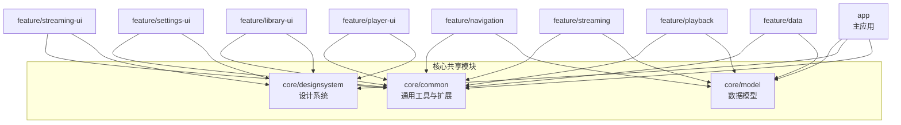
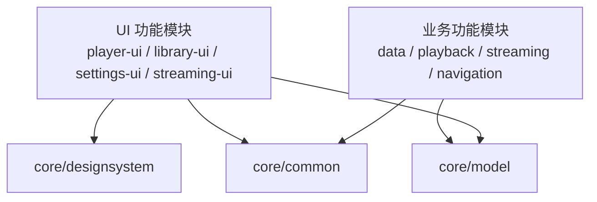
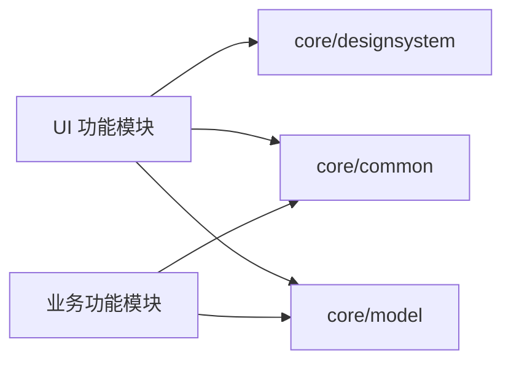

# 核心共享模块

<cite>
**本文引用的文件**   
- [core/common/build.gradle](file://core/common/build.gradle)
- [core/designsystem/build.gradle](file://core/designsystem/build.gradle)
- [core/model/build.gradle](file://core/model/build.gradle)
- [core/common/src/main/AndroidManifest.xml](file://core/common/src/main/AndroidManifest.xml)
- [core/designsystem/src/main/AndroidManifest.xml](file://core/designsystem/src/main/AndroidManifest.xml)
- [core/model/src/main/AndroidManifest.xml](file://core/model/src/main/AndroidManifest.xml)
</cite>

## 目录
1. [简介](#简介)
2. [项目结构](#项目结构)
3. [核心组件](#核心组件)
4. [架构总览](#架构总览)
5. [详细组件分析](#详细组件分析)
6. [依赖分析](#依赖分析)
7. [性能考虑](#性能考虑)
8. [故障排查指南](#故障排查指南)
9. [结论](#结论)
10. [附录](#附录)

## 简介
本文件聚焦 Echo Android 应用的核心共享模块，围绕以下三个子模块进行系统化文档化：
- core/common：通用工具与扩展能力（扩展函数、工具类、常量定义、异常处理等）
- core/designsystem：设计系统（颜色主题、字体规范、组件库、图标资源等）
- core/model：数据模型（实体类、数据传输对象、枚举类型、接口定义等）

目标是为其他功能模块提供稳定、可复用的基础能力支持，并明确公共 API 边界与使用模式。

## 项目结构
核心共享模块位于 core 目录下，采用多模块拆分，每个子模块独立构建与测试，便于复用与演进。

图表来源
- [core/common/build.gradle](file://core/common/build.gradle)
- [core/designsystem/build.gradle](file://core/designsystem/build.gradle)
- [core/model/build.gradle](file://core/model/build.gradle)

章节来源
- [core/common/build.gradle](file://core/common/build.gradle)
- [core/designsystem/build.gradle](file://core/designsystem/build.gradle)
- [core/model/build.gradle](file://core/model/build.gradle)

## 核心组件
本节概述三大核心共享模块的职责与对外能力边界，为后续深入分析奠定基础。

- core/common
  - 职责：提供跨模块复用的扩展函数、工具类、常量与异常体系；屏蔽平台差异与重复逻辑。
  - 典型能力：字符串/集合/时间/IO/网络相关扩展；统一异常封装；日志与调试辅助。
  - 使用建议：优先通过扩展函数提升可读性；避免在 UI 层直接依赖 Android 框架细节。

- core/designsystem
  - 职责：集中管理视觉与交互规范，包括颜色主题、字体、尺寸、组件与图标资源。
  - 典型能力：主题配置、调色板、排版规范、可复用 UI 组件、图标集。
  - 使用建议：UI 层统一从设计系统获取样式与组件，确保一致性与可维护性。

- core/model
  - 职责：定义领域内稳定的数据结构与契约，作为各层之间的“最小共识”。
  - 典型能力：实体类、DTO、枚举、接口；序列化/反序列化约定；不可变数据优先。
  - 使用建议：仅在必要处引入业务语义；保持轻量与稳定，避免耦合具体实现。

章节来源
- [core/common/build.gradle](file://core/common/build.gradle)
- [core/designsystem/build.gradle](file://core/designsystem/build.gradle)
- [core/model/build.gradle](file://core/model/build.gradle)

## 架构总览
核心共享模块遵循“低耦合、高内聚”的模块化原则：
- 上层功能模块依赖 core/model 与 core/common，UI 层额外依赖 core/designsystem。
- 共享模块之间相互解耦，避免循环依赖。
- 通过清晰的包结构与命名约定，降低认知成本。

图表来源
- [core/common/build.gradle](file://core/common/build.gradle)
- [core/designsystem/build.gradle](file://core/designsystem/build.gradle)
- [core/model/build.gradle](file://core/model/build.gradle)

## 详细组件分析

### core/common 通用工具模块
- 定位与范围
  - 提供语言级与平台级的通用扩展与工具，覆盖字符串、集合、时间、IO、网络、异常等常见场景。
  - 面向 Kotlin 生态，强调扩展函数与高阶函数的易用性。
- 关键能力
  - 扩展函数：对常用类型进行增强，减少样板代码。
  - 工具类：封装复杂逻辑，如路径解析、编码转换、校验规则等。
  - 常量定义：统一的键名、默认值、阈值等。
  - 异常处理：统一异常层次与错误码，便于上层捕获与展示。
- 使用模式
  - 以扩展函数为主，保持调用方简洁。
  - 工具类方法尽量无副作用或纯函数风格。
  - 异常信息包含上下文，便于问题定位。
- 质量保障
  - 单元测试覆盖核心扩展与工具方法。
  - 静态检查与 lint 规则约束。

章节来源
- [core/common/build.gradle](file://core/common/build.gradle)
- [core/common/src/main/AndroidManifest.xml](file://core/common/src/main/AndroidManifest.xml)

### core/designsystem 设计系统模块
- 定位与范围
  - 统一管理视觉与交互规范，确保全应用一致的体验。
  - 提供可复用的 UI 组件与资源，降低 UI 层重复建设。
- 关键能力
  - 颜色主题：主色、辅色、状态色、对比度适配。
  - 字体规范：字号、字重、行距、本地化字体回退。
  - 组件库：按钮、卡片、列表项、对话框等基础组件。
  - 图标资源：矢量图标、占位图、动效资源。
- 使用模式
  - UI 层通过主题与组件 API 消费设计系统。
  - 新增样式需在设计系统中注册，禁止在页面中硬编码。
- 质量保障
  - 组件具备可组合性与可测试性。
  - 主题切换与暗色模式验证。

章节来源
- [core/designsystem/build.gradle](file://core/designsystem/build.gradle)
- [core/designsystem/src/main/AndroidManifest.xml](file://core/designsystem/src/main/AndroidManifest.xml)

### core/model 数据模型模块
- 定位与范围
  - 定义跨层共享的数据契约，保证数据一致性。
  - 不包含持久化与网络实现细节，仅描述数据形态。
- 关键能力
  - 实体类：领域核心对象的不可变表示。
  - 数据传输对象：用于跨进程/跨模块传输的结构化数据。
  - 枚举类型：状态、类型、优先级等离散取值。
  - 接口定义：抽象行为契约，便于替换实现。
- 使用模式
  - 在 feature 层进行 DTO 与实体的映射。
  - 对外暴露只读视图，内部变更通过工厂或 Builder。
- 质量保障
  - 序列化/反序列化稳定性测试。
  - 字段变更遵循向后兼容策略。

章节来源
- [core/model/build.gradle](file://core/model/build.gradle)
- [core/model/src/main/AndroidManifest.xml](file://core/model/src/main/AndroidManifest.xml)

## 依赖分析
- 模块间依赖关系
  - core/common、core/designsystem、core/model 三者互不依赖，保持最小内聚。
  - 上层功能模块按需依赖对应共享模块，避免不必要的耦合。
- 外部依赖
  - 各模块通过 build.gradle 声明所需第三方库，遵循版本目录管理。
- 潜在风险
  - 若出现循环依赖，需在模块边界抽取接口或下沉到更底层模块。
  - 过度泛化的工具类可能导致职责不清，应持续收敛。

图表来源
- [core/common/build.gradle](file://core/common/build.gradle)
- [core/designsystem/build.gradle](file://core/designsystem/build.gradle)
- [core/model/build.gradle](file://core/model/build.gradle)

章节来源
- [core/common/build.gradle](file://core/common/build.gradle)
- [core/designsystem/build.gradle](file://core/designsystem/build.gradle)
- [core/model/build.gradle](file://core/model/build.gradle)

## 性能考虑
- 扩展函数与工具类
  - 避免在热路径创建临时对象；优先使用零拷贝或内存友好的算法。
  - 对大集合操作提供批量 API，减少迭代次数。
- 设计系统
  - 组件渲染路径优化，避免频繁重组；合理使用缓存与懒加载。
  - 图标资源使用矢量与按需加载，减小包体与内存占用。
- 数据模型
  - 使用不可变数据结构，减少同步开销。
  - 合理划分 DTO 粒度，避免传输冗余字段。

[本节为通用指导，无需特定文件引用]

## 故障排查指南
- 常见问题定位
  - 扩展函数未生效：检查导入与作用域是否正确。
  - 主题不一致：确认是否在应用启动时正确初始化设计系统主题。
  - 模型序列化失败：核对字段注解与版本兼容性。
- 诊断手段
  - 启用详细日志与堆栈追踪，结合统一异常体系快速定位。
  - 使用单元测试与 UI 测试用例复现问题。
- 修复建议
  - 将易错逻辑下沉至工具类，并提供健壮的错误处理。
  - 对设计系统进行回归测试，确保主题切换与暗色模式正常。

章节来源
- [core/common/build.gradle](file://core/common/build.gradle)
- [core/designsystem/build.gradle](file://core/designsystem/build.gradle)
- [core/model/build.gradle](file://core/model/build.gradle)

## 结论
core/common、core/designsystem、core/model 构成了 Echo Android 应用的基石：
- 通过清晰的职责划分与稳定的公共 API，显著降低模块间耦合。
- 借助扩展函数与设计系统，提升开发效率与用户体验一致性。
- 以数据模型为核心契约，保障跨层通信的正确性与可演进性。

建议在后续迭代中持续收敛工具类职责、完善设计系统组件库，并强化模型版本的向后兼容策略。

[本节为总结性内容，无需特定文件引用]

## 附录
- 术语说明
  - 扩展函数：在不修改原类型的前提下为其添加新行为的函数。
  - DTO：数据传输对象，用于在不同层或模块间传递数据。
  - 设计系统：包含颜色、字体、组件、图标等视觉与交互规范的集合。
- 参考入口
  - 各模块的构建脚本与清单文件可作为进一步探索的起点。

章节来源
- [core/common/build.gradle](file://core/common/build.gradle)
- [core/designsystem/build.gradle](file://core/designsystem/build.gradle)
- [core/model/build.gradle](file://core/model/build.gradle)
- [core/common/src/main/AndroidManifest.xml](file://core/common/src/main/AndroidManifest.xml)
- [core/designsystem/src/main/AndroidManifest.xml](file://core/designsystem/src/main/AndroidManifest.xml)
- [core/model/src/main/AndroidManifest.xml](file://core/model/src/main/AndroidManifest.xml)