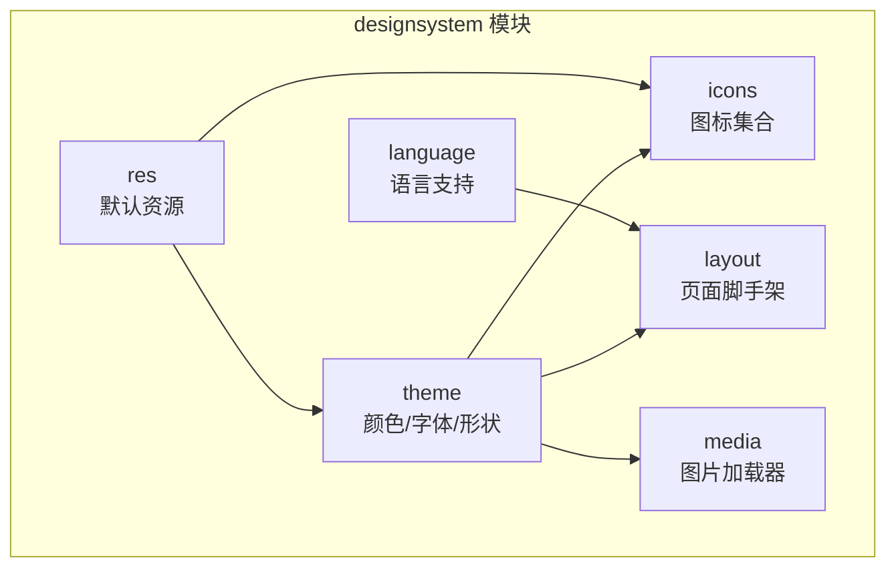
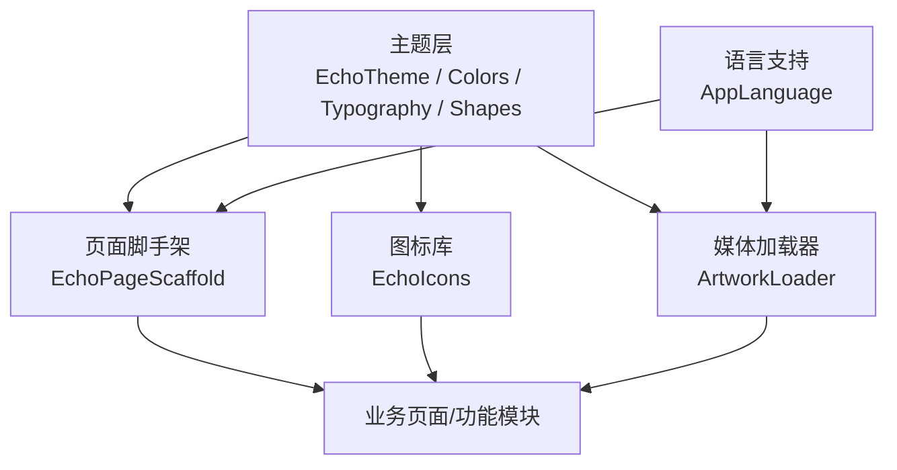
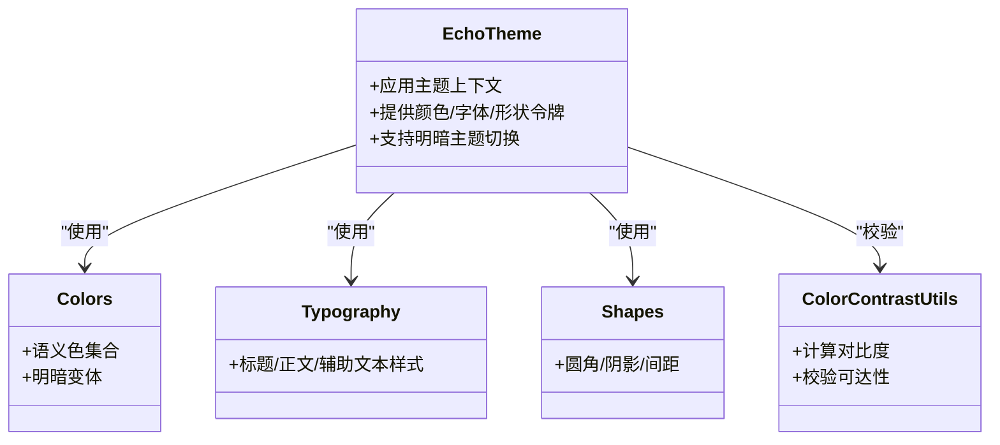
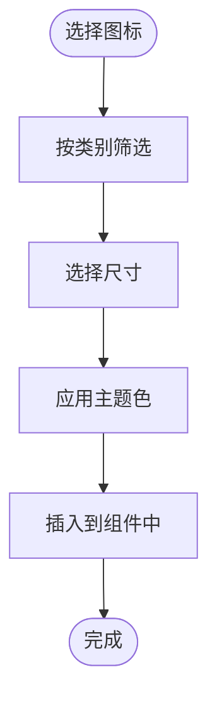
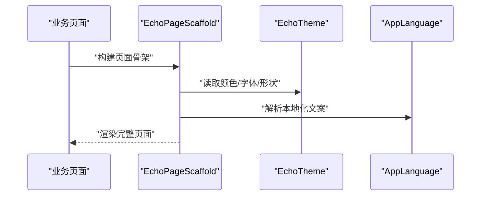
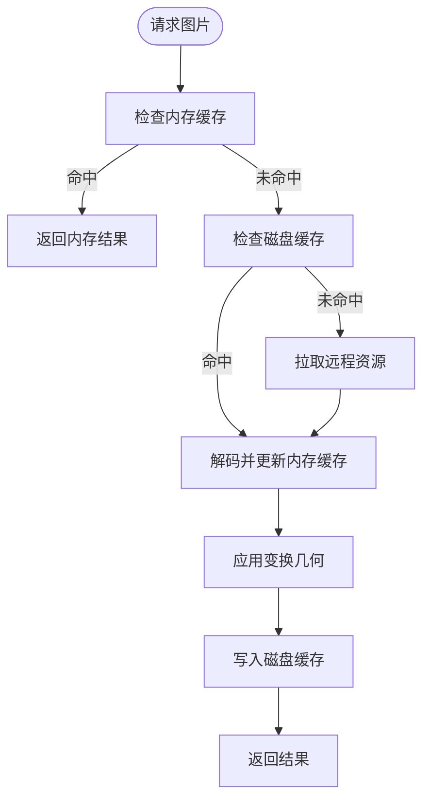
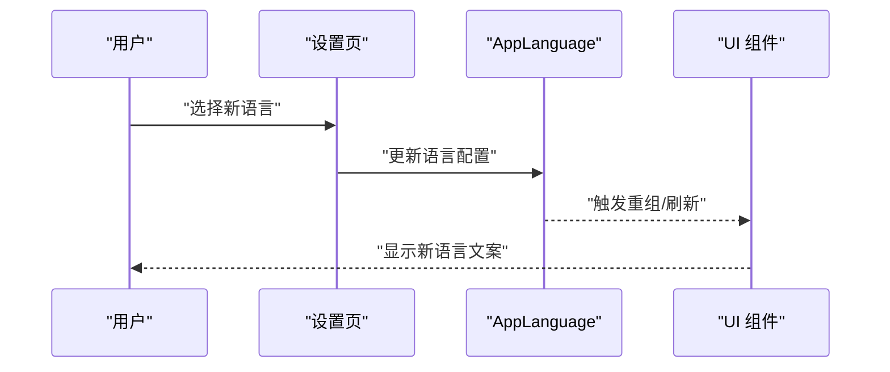
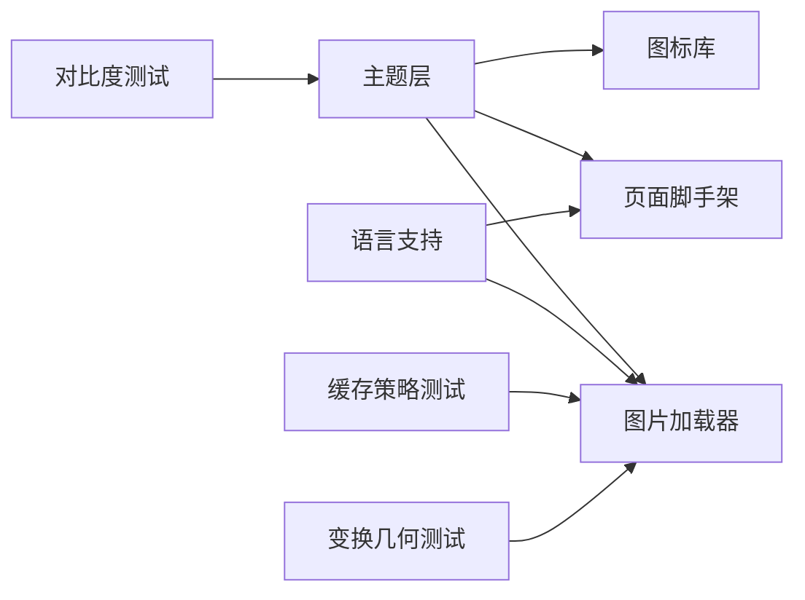

# 设计系统模块 (core/designsystem)

<cite>
**本文引用的文件**   
- [build.gradle](file://core/designsystem/build.gradle)
- [AndroidManifest.xml](file://core/designsystem/src/main/AndroidManifest.xml)
- [EchoTheme.kt](file://core/designsystem/src/main/java/app/yukine/ui/theme/EchoTheme.kt)
- [ColorContrastUtils.kt](file://core/designsystem/src/main/java/app/yukine/ui/theme/ColorContrastUtils.kt)
- [Typography.kt](file://core/designsystem/src/main/java/app/yukine/ui/theme/Typography.kt)
- [Shapes.kt](file://core/designsystem/src/main/java/app/yukine/ui/theme/Shapes.kt)
- [Colors.kt](file://core/designsystem/src/main/java/app/yukine/ui/theme/Colors.kt)
- [EchoIcons.kt](file://core/designsystem/src/main/java/app/yukine/ui/icons/EchoIcons.kt)
- [EchoPageScaffold.kt](file://core/designsystem/src/main/java/app/yukine/ui/layout/EchoPageScaffold.kt)
- [ArtworkLoader.kt](file://core/designsystem/src/main/java/app/yukine/ui/media/ArtworkLoader.kt)
- [AppLanguage.kt](file://core/designsystem/src/main/java/app/yukine/ui/language/AppLanguage.kt)
- [ArtworkDiskCachePolicyTest.kt](file://core/designsystem/src/test/java/app/yukine/ui/ArtworkDiskCachePolicyTest.kt)
- [BackgroundTransformGeometryTest.kt](file://core/designsystem/src/test/java/app/yukine/ui/BackgroundTransformGeometryTest.kt)
- [EchoThemeContrastTest.kt](file://core/designsystem/src/test/java/app/yukine/ui/EchoThemeContrastTest.kt)
</cite>

## 目录
1. [简介](#简介)
2. [项目结构](#项目结构)
3. [核心组件](#核心组件)
4. [架构总览](#架构总览)
5. [详细组件分析](#详细组件分析)
6. [依赖关系分析](#依赖关系分析)
7. [性能考量](#性能考量)
8. [故障排查指南](#故障排查指南)
9. [结论](#结论)
10. [附录](#附录)

## 简介
本文件面向 Echo Android 应用的设计系统模块 core/designsystem，系统性说明主题系统、图标库、页面脚手架、图片加载器与语言支持等关键能力。文档聚焦于：
- EchoTheme 主题系统的实现要点（颜色对比度、字体规范、组件样式）
- EchoIcons 图标库的使用方式
- EchoPageScaffold 页面脚手架的自定义选项
- ArtworkLoader 图片加载器的配置与使用模式
- AppLanguage 语言支持功能
并提供主题定制指南与组件使用示例，帮助开发者在应用中保持一致的用户体验。

## 项目结构
designsystem 模块以 Jetpack Compose 为基础，围绕“主题—图标—布局—媒体—语言”五个维度组织代码，并通过资源目录提供默认视觉资产。

**图表来源** 
- [build.gradle:1-200](file://core/designsystem/build.gradle#L1-L200)
- [AndroidManifest.xml:1-200](file://core/designsystem/src/main/AndroidManifest.xml#L1-L200)

**章节来源**
- [build.gradle:1-200](file://core/designsystem/build.gradle#L1-L200)
- [AndroidManifest.xml:1-200](file://core/designsystem/src/main/AndroidManifest.xml#L1-L200)

## 核心组件
- 主题系统（EchoTheme）：集中管理颜色、对比度、字体与圆角等设计令牌，为上层组件提供一致的主题上下文。
- 图标库（EchoIcons）：封装常用图标，统一命名与尺寸约定，便于跨页面复用。
- 页面脚手架（EchoPageScaffold）：提供统一的页面骨架（如顶部栏、内容区、底部导航），并支持主题化与可访问性增强。
- 图片加载器（ArtworkLoader）：负责封面图/背景图的加载、缓存与变换策略，适配不同场景的性能需求。
- 语言支持（AppLanguage）：提供多语言切换与文本解析能力，确保界面文案国际化。

**章节来源**
- [EchoTheme.kt:1-200](file://core/designsystem/src/main/java/app/yukine/ui/theme/EchoTheme.kt#L1-L200)
- [ColorContrastUtils.kt:1-200](file://core/designsystem/src/main/java/app/yukine/ui/theme/ColorContrastUtils.kt#L1-L200)
- [Typography.kt:1-200](file://core/designsystem/src/main/java/app/yukine/ui/theme/Typography.kt#L1-L200)
- [Shapes.kt:1-200](file://core/designsystem/src/main/java/app/yukine/ui/theme/Shapes.kt#L1-L200)
- [Colors.kt:1-200](file://core/designsystem/src/main/java/app/yukine/ui/theme/Colors.kt#L1-L200)
- [EchoIcons.kt:1-200](file://core/designsystem/src/main/java/app/yukine/ui/icons/EchoIcons.kt#L1-L200)
- [EchoPageScaffold.kt:1-200](file://core/designsystem/src/main/java/app/yukine/ui/layout/EchoPageScaffold.kt#L1-L200)
- [ArtworkLoader.kt:1-200](file://core/designsystem/src/main/java/app/yukine/ui/media/ArtworkLoader.kt#L1-L200)
- [AppLanguage.kt:1-200](file://core/designsystem/src/main/java/app/yukine/ui/language/AppLanguage.kt#L1-L200)

## 架构总览
设计系统模块采用“主题驱动 + 组合式 UI”的架构思路：主题层定义设计令牌，图标与布局组件消费这些令牌；媒体加载器与语言服务作为横切能力被各组件按需注入。

**图表来源** 
- [EchoTheme.kt:1-200](file://core/designsystem/src/main/java/app/yukine/ui/theme/EchoTheme.kt#L1-L200)
- [EchoPageScaffold.kt:1-200](file://core/designsystem/src/main/java/app/yukine/ui/layout/EchoPageScaffold.kt#L1-L200)
- [EchoIcons.kt:1-200](file://core/designsystem/src/main/java/app/yukine/ui/icons/EchoIcons.kt#L1-L200)
- [ArtworkLoader.kt:1-200](file://core/designsystem/src/main/java/app/yukine/ui/media/ArtworkLoader.kt#L1-L200)
- [AppLanguage.kt:1-200](file://core/designsystem/src/main/java/app/yukine/ui/language/AppLanguage.kt#L1-L200)

## 详细组件分析

### 主题系统（EchoTheme）
- 颜色与对比度
  - 通过颜色集与对比度工具函数保证文本与背景的可达性，避免低对比度导致的可读性问题。
  - 提供明暗主题切换时的语义化颜色映射，确保在不同背景下的一致体验。
- 字体规范
  - 定义标题、正文、辅助文本等字重与字号层级，保持信息层次清晰。
- 组件样式
  - 将圆角、阴影、间距等视觉属性抽象为设计令牌，供按钮、卡片、输入框等组件复用。

**图表来源** 
- [EchoTheme.kt:1-200](file://core/designsystem/src/main/java/app/yukine/ui/theme/EchoTheme.kt#L1-L200)
- [Colors.kt:1-200](file://core/designsystem/src/main/java/app/yukine/ui/theme/Colors.kt#L1-L200)
- [Typography.kt:1-200](file://core/designsystem/src/main/java/app/yukine/ui/theme/Typography.kt#L1-L200)
- [Shapes.kt:1-200](file://core/designsystem/src/main/java/app/yukine/ui/theme/Shapes.kt#L1-L200)
- [ColorContrastUtils.kt:1-200](file://core/designsystem/src/main/java/app/yukine/ui/theme/ColorContrastUtils.kt#L1-L200)

**章节来源**
- [EchoTheme.kt:1-200](file://core/designsystem/src/main/java/app/yukine/ui/theme/EchoTheme.kt#L1-L200)
- [ColorContrastUtils.kt:1-200](file://core/designsystem/src/main/java/app/yukine/ui/theme/ColorContrastUtils.kt#L1-L200)
- [Typography.kt:1-200](file://core/designsystem/src/main/java/app/yukine/ui/theme/Typography.kt#L1-L200)
- [Shapes.kt:1-200](file://core/designsystem/src/main/java/app/yukine/ui/theme/Shapes.kt#L1-L200)
- [Colors.kt:1-200](file://core/designsystem/src/main/java/app/yukine/ui/theme/Colors.kt#L1-L200)
- [EchoThemeContrastTest.kt:1-200](file://core/designsystem/src/test/java/app/yukine/ui/EchoThemeContrastTest.kt#L1-L200)

### 图标库（EchoIcons）
- 统一命名与分类：按功能域划分图标集合，便于检索与维护。
- 尺寸与对齐：提供标准尺寸与基线对齐，确保在多行文本或复杂布局中的视觉一致性。
- 主题适配：自动跟随主题色与对比度要求，保证在不同背景下的可见性。

**图表来源** 
- [EchoIcons.kt:1-200](file://core/designsystem/src/main/java/app/yukine/ui/icons/EchoIcons.kt#L1-L200)

**章节来源**
- [EchoIcons.kt:1-200](file://core/designsystem/src/main/java/app/yukine/ui/icons/EchoIcons.kt#L1-L200)

### 页面脚手架（EchoPageScaffold）
- 自定义选项
  - 顶部区域：标题、操作项、搜索入口等
  - 内容区域：滚动容器、占位状态、错误提示
  - 底部区域：标签栏、浮动操作按钮等
- 主题集成：自动继承主题的颜色、字体与形状令牌
- 可访问性：提供语义化结构与键盘导航支持

**图表来源** 
- [EchoPageScaffold.kt:1-200](file://core/designsystem/src/main/java/app/yukine/ui/layout/EchoPageScaffold.kt#L1-L200)
- [EchoTheme.kt:1-200](file://core/designsystem/src/main/java/app/yukine/ui/theme/EchoTheme.kt#L1-L200)
- [AppLanguage.kt:1-200](file://core/designsystem/src/main/java/app/yukine/ui/language/AppLanguage.kt#L1-L200)

**章节来源**
- [EchoPageScaffold.kt:1-200](file://core/designsystem/src/main/java/app/yukine/ui/layout/EchoPageScaffold.kt#L1-L200)

### 图片加载器（ArtworkLoader）
- 配置项
  - 磁盘缓存策略：命中率与存储空间的平衡
  - 内存缓存：减少重复解码开销
  - 变换几何：裁剪、缩放、模糊等效果
- 使用模式
  - 封面图：优先命中缓存，必要时异步解码
  - 背景图：根据屏幕密度与尺寸进行自适应处理
  - 错误与占位：网络失败或资源缺失时展示降级方案

**图表来源** 
- [ArtworkLoader.kt:1-200](file://core/designsystem/src/main/java/app/yukine/ui/media/ArtworkLoader.kt#L1-L200)

**章节来源**
- [ArtworkLoader.kt:1-200](file://core/designsystem/src/main/java/app/yukine/ui/media/ArtworkLoader.kt#L1-L200)
- [ArtworkDiskCachePolicyTest.kt:1-200](file://core/designsystem/src/test/java/app/yukine/ui/ArtworkDiskCachePolicyTest.kt#L1-L200)
- [BackgroundTransformGeometryTest.kt:1-200](file://core/designsystem/src/test/java/app/yukine/ui/BackgroundTransformGeometryTest.kt#L1-L200)

### 语言支持（AppLanguage）
- 功能要点
  - 多语言切换：运行时动态切换语言环境
  - 文本解析：基于键值对或资源 ID 获取对应文案
  - 与主题/布局联动：确保切换后界面即时刷新
- 使用建议
  - 在应用启动时初始化默认语言
  - 在设置页提供语言切换入口并持久化用户选择

**图表来源** 
- [AppLanguage.kt:1-200](file://core/designsystem/src/main/java/app/yukine/ui/language/AppLanguage.kt#L1-L200)

**章节来源**
- [AppLanguage.kt:1-200](file://core/designsystem/src/main/java/app/yukine/ui/language/AppLanguage.kt#L1-L200)

## 依赖关系分析
- 模块内依赖
  - 主题层为图标、布局与媒体加载器提供基础令牌
  - 语言服务被布局与媒体加载器用于文案与元数据
- 测试覆盖
  - 对比度测试保障主题可达性
  - 磁盘缓存策略与变换几何测试保障图片加载稳定性

**图表来源** 
- [EchoTheme.kt:1-200](file://core/designsystem/src/main/java/app/yukine/ui/theme/EchoTheme.kt#L1-L200)
- [EchoIcons.kt:1-200](file://core/designsystem/src/main/java/app/yukine/ui/icons/EchoIcons.kt#L1-L200)
- [EchoPageScaffold.kt:1-200](file://core/designsystem/src/main/java/app/yukine/ui/layout/EchoPageScaffold.kt#L1-L200)
- [ArtworkLoader.kt:1-200](file://core/designsystem/src/main/java/app/yukine/ui/media/ArtworkLoader.kt#L1-L200)
- [AppLanguage.kt:1-200](file://core/designsystem/src/main/java/app/yukine/ui/language/AppLanguage.kt#L1-L200)
- [EchoThemeContrastTest.kt:1-200](file://core/designsystem/src/test/java/app/yukine/ui/EchoThemeContrastTest.kt#L1-L200)
- [ArtworkDiskCachePolicyTest.kt:1-200](file://core/designsystem/src/test/java/app/yukine/ui/ArtworkDiskCachePolicyTest.kt#L1-L200)
- [BackgroundTransformGeometryTest.kt:1-200](file://core/designsystem/src/test/java/app/yukine/ui/BackgroundTransformGeometryTest.kt#L1-L200)

**章节来源**
- [EchoTheme.kt:1-200](file://core/designsystem/src/main/java/app/yukine/ui/theme/EchoTheme.kt#L1-L200)
- [EchoIcons.kt:1-200](file://core/designsystem/src/main/java/app/yukine/ui/icons/EchoIcons.kt#L1-L200)
- [EchoPageScaffold.kt:1-200](file://core/designsystem/src/main/java/app/yukine/ui/layout/EchoPageScaffold.kt#L1-L200)
- [ArtworkLoader.kt:1-200](file://core/designsystem/src/main/java/app/yukine/ui/media/ArtworkLoader.kt#L1-L200)
- [AppLanguage.kt:1-200](file://core/designsystem/src/main/java/app/yukine/ui/language/AppLanguage.kt#L1-L200)
- [EchoThemeContrastTest.kt:1-200](file://core/designsystem/src/test/java/app/yukine/ui/EchoThemeContrastTest.kt#L1-L200)
- [ArtworkDiskCachePolicyTest.kt:1-200](file://core/designsystem/src/test/java/app/yukine/ui/ArtworkDiskCachePolicyTest.kt#L1-L200)
- [BackgroundTransformGeometryTest.kt:1-200](file://core/designsystem/src/test/java/app/yukine/ui/BackgroundTransformGeometryTest.kt#L1-L200)

## 性能考量
- 主题层
  - 避免频繁重建主题上下文，尽量在应用根节点一次性配置
  - 对比度校验应在构建期或变更时执行，避免运行时高开销
- 图标库
  - 使用矢量图标以减少资源体积，注意绘制复杂度
- 页面脚手架
  - 合理拆分内容区域，减少不必要的重组
- 图片加载器
  - 启用合理的磁盘与内存缓存策略，降低重复解码与网络请求
  - 针对大图与背景图使用渐进式加载与降采样
- 语言支持
  - 批量更新语言配置，避免多次重组导致抖动

[本节为通用指导，无需具体文件引用]

## 故障排查指南
- 主题对比度问题
  - 现象：文本与背景对比不足，影响可读性
  - 排查：运行对比度测试，定位不合规的颜色组合
  - 修复：调整语义色映射或引入更高对比度的替代色
- 图片加载异常
  - 现象：封面图加载缓慢或失败
  - 排查：检查磁盘缓存策略与变换几何配置，确认网络与资源路径
  - 修复：优化缓存大小、增加重试与降级占位图
- 语言切换无效
  - 现象：切换语言后文案未更新
  - 排查：确认语言配置是否持久化，UI 是否响应重组
  - 修复：在语言变更后触发必要的重组或重新挂载

**章节来源**
- [EchoThemeContrastTest.kt:1-200](file://core/designsystem/src/test/java/app/yukine/ui/EchoThemeContrastTest.kt#L1-L200)
- [ArtworkDiskCachePolicyTest.kt:1-200](file://core/designsystem/src/test/java/app/yukine/ui/ArtworkDiskCachePolicyTest.kt#L1-L200)
- [BackgroundTransformGeometryTest.kt:1-200](file://core/designsystem/src/test/java/app/yukine/ui/BackgroundTransformGeometryTest.kt#L1-L200)

## 结论
designsystem 模块通过主题驱动的令牌体系、标准化的图标与布局组件、稳健的图片加载策略以及完善的语言支持，为 Echo Android 应用提供了高质量、可扩展且一致的用户体验基础。遵循本文档的定制指南与最佳实践，开发者可在保持设计一致性的同时，灵活扩展与优化功能。

[本节为总结性内容，无需具体文件引用]

## 附录
- 主题定制清单
  - 新增语义色：在颜色集中添加明暗变体，并在对比度测试中验证
  - 扩展字体层级：在字体规范中补充新的字号与字重，确保可读性与层次
  - 调整形状令牌：统一圆角与阴影，避免过度装饰影响性能
- 组件使用示例
  - 在页面中使用 EchoPageScaffold 包裹内容，并传入主题与语言上下文
  - 使用 EchoIcons 替换原生图标，确保风格一致
  - 通过 ArtworkLoader 加载封面图，配置合适的缓存与变换策略
  - 在设置页集成 AppLanguage，提供语言切换入口并持久化选择

[本节为补充说明，无需具体文件引用]