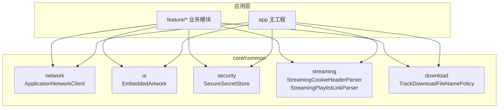
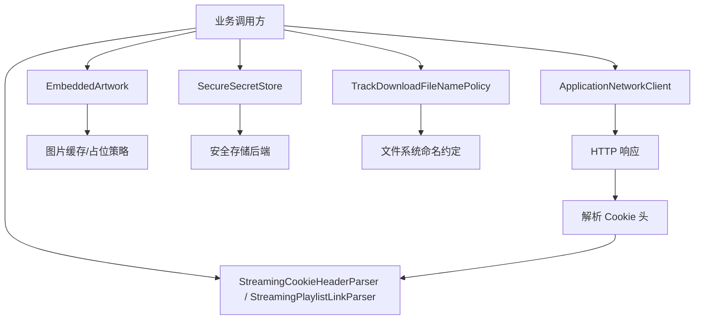
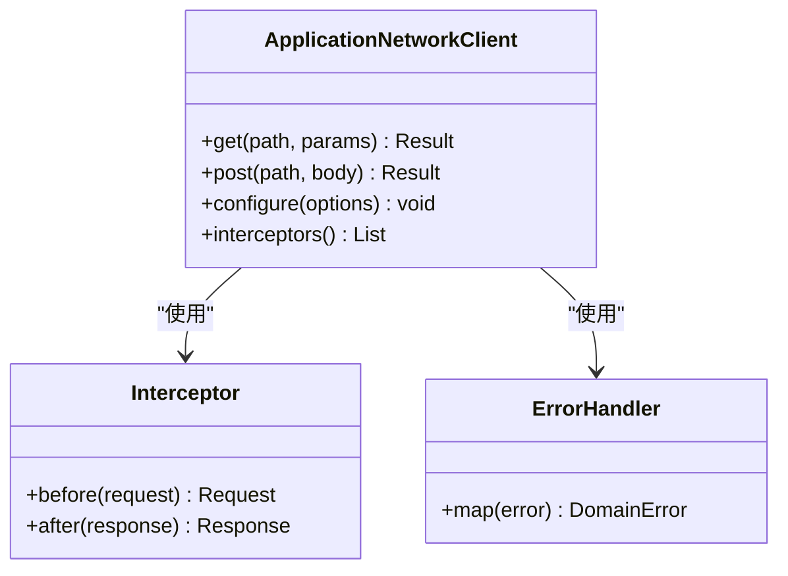
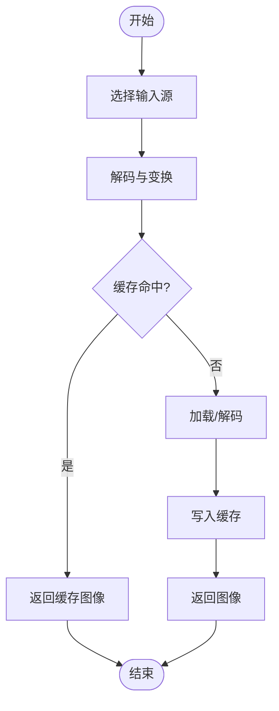
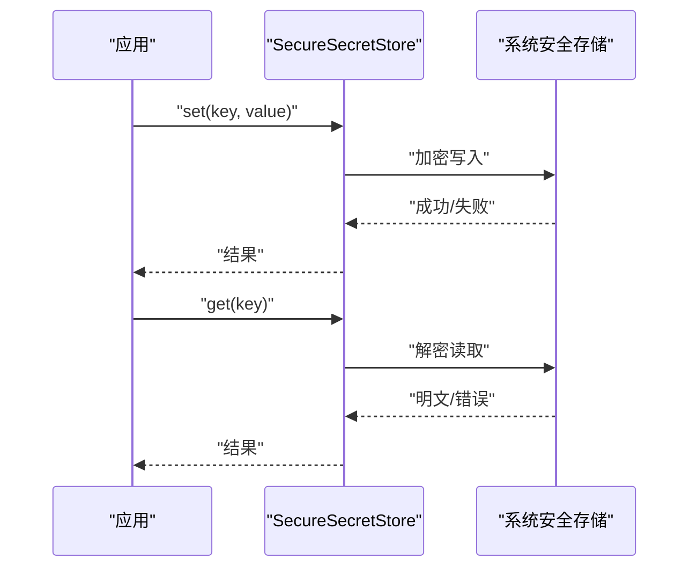
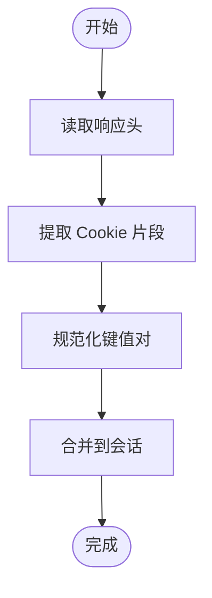
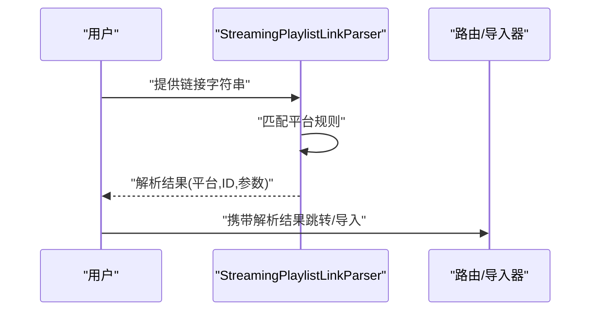
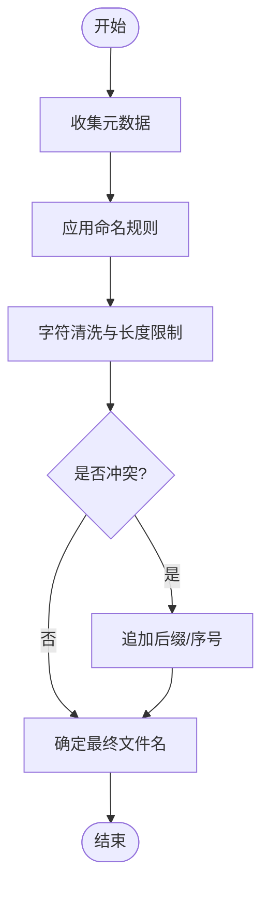
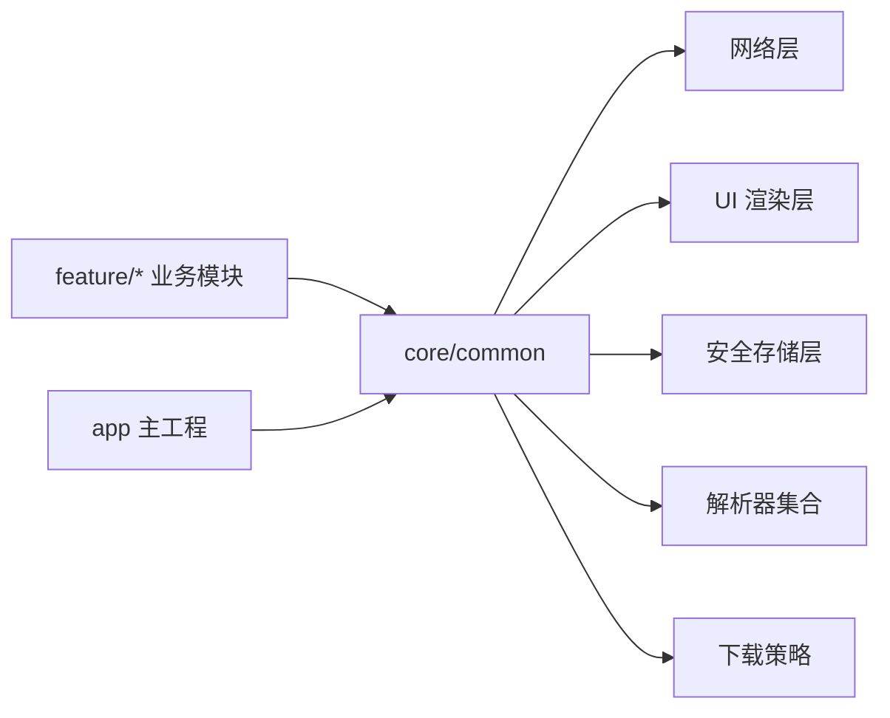

# 通用工具模块 (core/common)

<cite>
**本文引用的文件**   
- [ApplicationNetworkClient.kt](file://core/common/src/main/java/app/yukine/common/network/ApplicationNetworkClient.kt)
- [EmbeddedArtwork.kt](file://core/common/src/main/java/app/yukine/common/ui/EmbeddedArtwork.kt)
- [SecureSecretStore.kt](file://core/common/src/main/java/app/yukine/common/security/SecureSecretStore.kt)
- [StreamingCookieHeaderParser.kt](file://core/common/src/main/java/app/yukine/common/streaming/StreamingCookieHeaderParser.kt)
- [StreamingPlaylistLinkParser.kt](file://core/common/src/main/java/app/yukine/common/streaming/StreamingPlaylistLinkParser.kt)
- [TrackDownloadFileNamePolicy.kt](file://core/common/src/main/java/app/yukine/common/download/TrackDownloadFileNamePolicy.kt)
- [TrackDownloadFileNamePolicyTest.kt](file://core/common/src/test/java/app/yukine/TrackDownloadFileNamePolicyTest.kt)
</cite>

## 目录
1. [简介](#简介)
2. [项目结构](#项目结构)
3. [核心组件](#核心组件)
4. [架构总览](#架构总览)
5. [详细组件分析](#详细组件分析)
6. [依赖关系分析](#依赖关系分析)
7. [性能考虑](#性能考虑)
8. [故障排查指南](#故障排查指南)
9. [结论](#结论)
10. [附录：使用示例与最佳实践](#附录使用示例与最佳实践)

## 简介
本文件面向 Echo Android 应用的通用工具模块 core/common，聚焦以下关键能力：
- ApplicationNetworkClient：统一的网络客户端封装与使用模式
- EmbeddedArtwork：嵌入式图片处理与展示策略
- SecureSecretStore：安全存储机制（密钥/敏感信息）
- StreamingCookieHeaderParser 与 StreamingPlaylistLinkParser：流媒体 Cookie 头解析与播放列表链接解析
- TrackDownloadFileNamePolicy：下载文件名生成策略

文档提供架构图、类图、时序图与流程图，并给出使用示例路径、错误处理要点与最佳实践。

## 项目结构
core/common 模块按职责划分包结构，涵盖网络、UI、安全、流媒体解析与下载等通用能力。下图展示了与本模块相关的顶层组织与入口点。

图表来源
- [ApplicationNetworkClient.kt:1-200](file://core/common/src/main/java/app/yukine/common/network/ApplicationNetworkClient.kt#L1-L200)
- [EmbeddedArtwork.kt:1-200](file://core/common/src/main/java/app/yukine/common/ui/EmbeddedArtwork.kt#L1-L200)
- [SecureSecretStore.kt:1-200](file://core/common/src/main/java/app/yukine/common/security/SecureSecretStore.kt#L1-L200)
- [StreamingCookieHeaderParser.kt:1-200](file://core/common/src/main/java/app/yukine/common/streaming/StreamingCookieHeaderParser.kt#L1-L200)
- [StreamingPlaylistLinkParser.kt:1-200](file://core/common/src/main/java/app/yukine/common/streaming/StreamingPlaylistLinkParser.kt#L1-L200)
- [TrackDownloadFileNamePolicy.kt:1-200](file://core/common/src/main/java/app/yukine/common/download/TrackDownloadFileNamePolicy.kt#L1-L200)

章节来源
- [ApplicationNetworkClient.kt:1-200](file://core/common/src/main/java/app/yukine/common/network/ApplicationNetworkClient.kt#L1-L200)
- [EmbeddedArtwork.kt:1-200](file://core/common/src/main/java/app/yukine/common/ui/EmbeddedArtwork.kt#L1-L200)
- [SecureSecretStore.kt:1-200](file://core/common/src/main/java/app/yukine/common/security/SecureSecretStore.kt#L1-L200)
- [StreamingCookieHeaderParser.kt:1-200](file://core/common/src/main/java/app/yukine/common/streaming/StreamingCookieHeaderParser.kt#L1-L200)
- [StreamingPlaylistLinkParser.kt:1-200](file://core/common/src/main/java/app/yukine/common/streaming/StreamingPlaylistLinkParser.kt#L1-L200)
- [TrackDownloadFileNamePolicy.kt:1-200](file://core/common/src/main/java/app/yukine/common/download/TrackDownloadFileNamePolicy.kt#L1-L200)

## 核心组件
本节对每个核心组件进行概览说明，后续章节将展开深入分析与图示。

- ApplicationNetworkClient：统一网络请求封装，提供重试、超时、拦截器注入、错误码映射与可观测性钩子，便于在业务层以一致方式发起 HTTP 调用。
- EmbeddedArtwork：负责嵌入式图片的解码、缩放、缓存与占位图策略，支持多种输入源与输出格式，适配 UI 展示需求。
- SecureSecretStore：基于系统安全存储实现，提供对称密钥或敏感字符串的安全读写接口，具备权限校验与异常隔离。
- StreamingCookieHeaderParser：从响应头中解析 Cookie 片段，合并到会话上下文，用于流媒体鉴权与访问控制。
- StreamingPlaylistLinkParser：解析外部或内部返回的播放列表链接，提取目标平台、ID 与参数，供后续导入或跳转流程使用。
- TrackDownloadFileNamePolicy：根据曲目元数据与配置规则生成稳定的下载文件名，避免冲突与乱码。

章节来源
- [ApplicationNetworkClient.kt:1-200](file://core/common/src/main/java/app/yukine/common/network/ApplicationNetworkClient.kt#L1-L200)
- [EmbeddedArtwork.kt:1-200](file://core/common/src/main/java/app/yukine/common/ui/EmbeddedArtwork.kt#L1-L200)
- [SecureSecretStore.kt:1-200](file://core/common/src/main/java/app/yukine/common/security/SecureSecretStore.kt#L1-L200)
- [StreamingCookieHeaderParser.kt:1-200](file://core/common/src/main/java/app/yukine/common/streaming/StreamingCookieHeaderParser.kt#L1-L200)
- [StreamingPlaylistLinkParser.kt:1-200](file://core/common/src/main/java/app/yukine/common/streaming/StreamingPlaylistLinkParser.kt#L1-L200)
- [TrackDownloadFileNamePolicy.kt:1-200](file://core/common/src/main/java/app/yukine/common/download/TrackDownloadFileNamePolicy.kt#L1-L200)

## 架构总览
下图展示了 core/common 各组件与应用层的交互关系以及典型的数据流向。

图表来源
- [ApplicationNetworkClient.kt:1-200](file://core/common/src/main/java/app/yukine/common/network/ApplicationNetworkClient.kt#L1-L200)
- [EmbeddedArtwork.kt:1-200](file://core/common/src/main/java/app/yukine/common/ui/EmbeddedArtwork.kt#L1-L200)
- [SecureSecretStore.kt:1-200](file://core/common/src/main/java/app/yukine/common/security/SecureSecretStore.kt#L1-L200)
- [StreamingCookieHeaderParser.kt:1-200](file://core/common/src/main/java/app/yukine/common/streaming/StreamingCookieHeaderParser.kt#L1-L200)
- [StreamingPlaylistLinkParser.kt:1-200](file://core/common/src/main/java/app/yukine/common/streaming/StreamingPlaylistLinkParser.kt#L1-L200)
- [TrackDownloadFileNamePolicy.kt:1-200](file://core/common/src/main/java/app/yukine/common/download/TrackDownloadFileNamePolicy.kt#L1-L200)

## 详细组件分析

### ApplicationNetworkClient 网络客户端
- 设计要点
  - 统一请求构建：封装基础 URL、公共头、超时与重试策略
  - 错误映射：将底层异常转换为领域错误类型，便于上层处理
  - 可插拔拦截器：支持鉴权、日志、埋点等横切关注点
  - 线程模型：默认在 IO 调度器执行，返回协程友好的结果
- 使用模式
  - 通过工厂或 DI 获取实例，传入业务域名与配置
  - 调用 get/post/put/delete 等方法，传入路径与参数
  - 捕获并处理特定错误分支（如认证失败、网络不可用）
- 错误处理
  - 区分网络层错误与服务端错误
  - 对超时、取消、重定向等边界条件做明确处理
- 性能考量
  - 连接复用、合理超时、批量请求合并
  - 大响应体流式读取，避免一次性加载到内存

图表来源
- [ApplicationNetworkClient.kt:1-200](file://core/common/src/main/java/app/yukine/common/network/ApplicationNetworkClient.kt#L1-L200)

章节来源
- [ApplicationNetworkClient.kt:1-200](file://core/common/src/main/java/app/yukine/common/network/ApplicationNetworkClient.kt#L1-L200)

### EmbeddedArtwork 嵌入式图片处理
- 功能概述
  - 多源输入：URL、资源 ID、字节数组、文件路径
  - 解码与变换：尺寸裁剪、比例保持、色彩空间转换
  - 缓存策略：内存与磁盘两级缓存，命中优先
  - 占位与降级：缺省图、模糊占位、错误态显示
- 使用模式
  - 在 UI 层通过 API 加载图片，传入目标尺寸与回调
  - 结合生命周期管理，避免泄漏与重复加载
- 错误处理
  - 网络不可达、解码失败、IO 异常的兜底策略
  - 提供可观察的错误事件，便于统计与提示
- 性能优化
  - 按需采样、延迟加载、回收释放
  - 预取热门封面，减少首帧等待

图表来源
- [EmbeddedArtwork.kt:1-200](file://core/common/src/main/java/app/yukine/common/ui/EmbeddedArtwork.kt#L1-L200)

章节来源
- [EmbeddedArtwork.kt:1-200](file://core/common/src/main/java/app/yukine/common/ui/EmbeddedArtwork.kt#L1-L200)

### SecureSecretStore 安全存储
- 设计要点
  - 安全后端：基于系统安全存储（如 Keystore/EncryptedSharedPreferences）
  - 键值抽象：提供 set/get/remove 等原子操作
  - 权限与异常：无权限时快速失败，异常不泄露敏感细节
- 使用模式
  - 初始化后直接存取敏感字段（如令牌、私钥）
  - 在需要时轮换密钥并迁移旧数据
- 错误处理
  - 设备不支持、硬件受限、被锁屏等场景的降级策略
  - 记录最小化日志，避免泄露敏感内容
- 性能与安全权衡
  - 冷启动开销可控，避免频繁加解密热点路径
  - 建议批量更新与懒加载

图表来源
- [SecureSecretStore.kt:1-200](file://core/common/src/main/java/app/yukine/common/security/SecureSecretStore.kt#L1-L200)

章节来源
- [SecureSecretStore.kt:1-200](file://core/common/src/main/java/app/yukine/common/security/SecureSecretStore.kt#L1-L200)

### StreamingCookieHeaderParser 流媒体 Cookie 解析器
- 功能概述
  - 从响应头中提取 Cookie 片段，规范化为键值对
  - 支持 Set-Cookie 与自定义头格式
  - 合并到会话上下文，供后续请求携带
- 使用模式
  - 在网络层拦截响应后调用解析器
  - 将解析结果注入到会话管理器
- 错误处理
  - 非法头格式、缺失必要字段时的容错策略
  - 记录解析失败原因，不影响主流程
- 性能考量
  - 轻量解析，避免正则滥用
  - 增量更新，减少全量重建

图表来源
- [StreamingCookieHeaderParser.kt:1-200](file://core/common/src/main/java/app/yukine/common/streaming/StreamingCookieHeaderParser.kt#L1-L200)

章节来源
- [StreamingCookieHeaderParser.kt:1-200](file://core/common/src/main/java/app/yukine/common/streaming/StreamingCookieHeaderParser.kt#L1-L200)

### StreamingPlaylistLinkParser 流媒体播放列表链接解析器
- 功能概述
  - 识别不同平台的播放列表链接格式
  - 提取平台标识、列表 ID 与查询参数
  - 标准化为内部表示，供导入或跳转逻辑使用
- 使用模式
  - 接收用户粘贴或分享链接，调用解析器得到结构化对象
  - 若无法识别，返回友好错误提示
- 错误处理
  - 链接格式不正确、缺少必要字段时的处理
  - 兼容历史版本链接的降级策略
- 扩展性
  - 新增平台只需注册新的解析规则

图表来源
- [StreamingPlaylistLinkParser.kt:1-200](file://core/common/src/main/java/app/yukine/common/streaming/StreamingPlaylistLinkParser.kt#L1-L200)

章节来源
- [StreamingPlaylistLinkParser.kt:1-200](file://core/common/src/main/java/app/yukine/common/streaming/StreamingPlaylistLinkParser.kt#L1-L200)

### TrackDownloadFileNamePolicy 下载文件名策略
- 功能概述
  - 根据曲目元数据（标题、艺术家、专辑等）与配置规则生成稳定文件名
  - 支持字符清洗、长度限制、编码规范
  - 避免覆盖冲突，必要时追加序号或哈希后缀
- 使用模式
  - 在下载任务开始前计算文件名
  - 与下载管理器协作，确保唯一性与可读性
- 错误处理
  - 元数据缺失时的回退策略
  - 非法字符替换与长度截断
- 测试覆盖
  - 单元测试验证各种边界情况与组合规则

图表来源
- [TrackDownloadFileNamePolicy.kt:1-200](file://core/common/src/main/java/app/yukine/common/download/TrackDownloadFileNamePolicy.kt#L1-L200)

章节来源
- [TrackDownloadFileNamePolicy.kt:1-200](file://core/common/src/main/java/app/yukine/common/download/TrackDownloadFileNamePolicy.kt#L1-L200)
- [TrackDownloadFileNamePolicyTest.kt:1-200](file://core/common/src/test/java/app/yukine/TrackDownloadFileNamePolicyTest.kt#L1-L200)

## 依赖关系分析
core/common 模块对外暴露稳定的 API，业务模块通过依赖注入或直接引用方式使用。下图展示主要依赖方向与耦合点。

图表来源
- [ApplicationNetworkClient.kt:1-200](file://core/common/src/main/java/app/yukine/common/network/ApplicationNetworkClient.kt#L1-L200)
- [EmbeddedArtwork.kt:1-200](file://core/common/src/main/java/app/yukine/common/ui/EmbeddedArtwork.kt#L1-L200)
- [SecureSecretStore.kt:1-200](file://core/common/src/main/java/app/yukine/common/security/SecureSecretStore.kt#L1-L200)
- [StreamingCookieHeaderParser.kt:1-200](file://core/common/src/main/java/app/yukine/common/streaming/StreamingCookieHeaderParser.kt#L1-L200)
- [StreamingPlaylistLinkParser.kt:1-200](file://core/common/src/main/java/app/yukine/common/streaming/StreamingPlaylistLinkParser.kt#L1-L200)
- [TrackDownloadFileNamePolicy.kt:1-200](file://core/common/src/main/java/app/yukine/common/download/TrackDownloadFileNamePolicy.kt#L1-L200)

章节来源
- [ApplicationNetworkClient.kt:1-200](file://core/common/src/main/java/app/yukine/common/network/ApplicationNetworkClient.kt#L1-L200)
- [EmbeddedArtwork.kt:1-200](file://core/common/src/main/java/app/yukine/common/ui/EmbeddedArtwork.kt#L1-L200)
- [SecureSecretStore.kt:1-200](file://core/common/src/main/java/app/yukine/common/security/SecureSecretStore.kt#L1-L200)
- [StreamingCookieHeaderParser.kt:1-200](file://core/common/src/main/java/app/yukine/common/streaming/StreamingCookieHeaderParser.kt#L1-L200)
- [StreamingPlaylistLinkParser.kt:1-200](file://core/common/src/main/java/app/yukine/common/streaming/StreamingPlaylistLinkParser.kt#L1-L200)
- [TrackDownloadFileNamePolicy.kt:1-200](file://core/common/src/main/java/app/yukine/common/download/TrackDownloadFileNamePolicy.kt#L1-L200)

## 性能考虑
- 网络
  - 合理设置超时与重试次数，避免雪崩
  - 启用连接池与压缩，降低带宽占用
- 图片
  - 使用合适的采样率与目标尺寸，减少内存峰值
  - 利用缓存命中，减少重复解码
- 安全存储
  - 避免在主线程频繁加解密，采用异步与批处理
  - 冷启动时按需加载，减少阻塞
- 解析器
  - 使用高效的字符串处理，避免不必要的对象创建
  - 对复杂规则进行缓存与复用
- 下载
  - 文件名计算尽量幂等，避免重复计算
  - 冲突检测采用 O(1) 查找结构

[本节为通用指导，无需源码引用]

## 故障排查指南
- ApplicationNetworkClient
  - 检查拦截器链顺序与异常传播
  - 确认错误映射是否覆盖所有服务端状态码
- EmbeddedArtwork
  - 核对输入源可达性与解码格式支持
  - 查看缓存目录权限与磁盘空间
- SecureSecretStore
  - 验证设备安全特性与权限授予
  - 检查密钥轮转与迁移脚本的执行结果
- StreamingCookieHeaderParser
  - 打印原始响应头，定位非法格式
  - 确认会话上下文是否正确注入
- StreamingPlaylistLinkParser
  - 补充新平台规则，回归测试常见链接
  - 对异常链接返回明确错误信息
- TrackDownloadFileNamePolicy
  - 运行单元测试覆盖边界用例
  - 检查文件系统命名限制与冲突检测

章节来源
- [TrackDownloadFileNamePolicyTest.kt:1-200](file://core/common/src/test/java/app/yukine/TrackDownloadFileNamePolicyTest.kt#L1-L200)

## 结论
core/common 模块为 Echo Android 应用提供了稳定、可扩展的通用能力。通过统一的网络客户端、安全的存储机制、高效的图片处理与解析器，以及稳健的下载策略，显著提升了业务层的开发效率与系统稳定性。建议在业务集成时遵循本文的使用模式与最佳实践，以获得一致且可靠的体验。

[本节为总结，无需源码引用]

## 附录：使用示例与最佳实践
以下为各组件的典型用法指引与注意事项（以“代码片段路径”形式标注，避免直接粘贴代码）。

- ApplicationNetworkClient
  - 基本 GET 请求：参考 [ApplicationNetworkClient.kt:1-200](file://core/common/src/main/java/app/yukine/common/network/ApplicationNetworkClient.kt#L1-L200)
  - POST 表单与 JSON：参考 [ApplicationNetworkClient.kt:1-200](file://core/common/src/main/java/app/yukine/common/network/ApplicationNetworkClient.kt#L1-L200)
  - 错误处理分支：参考 [ApplicationNetworkClient.kt:1-200](file://core/common/src/main/java/app/yukine/common/network/ApplicationNetworkClient.kt#L1-L200)
  - 最佳实践：统一错误映射、合理超时、避免在主线程执行

- EmbeddedArtwork
  - 从 URL 加载并指定尺寸：参考 [EmbeddedArtwork.kt:1-200](file://core/common/src/main/java/app/yukine/common/ui/EmbeddedArtwork.kt#L1-L200)
  - 占位图与错误图配置：参考 [EmbeddedArtwork.kt:1-200](file://core/common/src/main/java/app/yukine/common/ui/EmbeddedArtwork.kt#L1-L200)
  - 最佳实践：生命周期感知、避免重复加载、合理使用缓存

- SecureSecretStore
  - 写入与读取敏感数据：参考 [SecureSecretStore.kt:1-200](file://core/common/src/main/java/app/yukine/common/security/SecureSecretStore.kt#L1-L200)
  - 错误与降级处理：参考 [SecureSecretStore.kt:1-200](file://core/common/src/main/java/app/yukine/common/security/SecureSecretStore.kt#L1-L200)
  - 最佳实践：最小权限、异步操作、避免日志泄露

- StreamingCookieHeaderParser
  - 从响应头解析 Cookie：参考 [StreamingCookieHeaderParser.kt:1-200](file://core/common/src/main/java/app/yukine/common/streaming/StreamingCookieHeaderParser.kt#L1-L200)
  - 合并到会话上下文：参考 [StreamingCookieHeaderParser.kt:1-200](file://core/common/src/main/java/app/yukine/common/streaming/StreamingCookieHeaderParser.kt#L1-L200)
  - 最佳实践：容错解析、增量更新、记录失败原因

- StreamingPlaylistLinkParser
  - 解析外部链接并提取参数：参考 [StreamingPlaylistLinkParser.kt:1-200](file://core/common/src/main/java/app/yukine/common/streaming/StreamingPlaylistLinkParser.kt#L1-L200)
  - 处理未知平台与异常链接：参考 [StreamingPlaylistLinkParser.kt:1-200](file://core/common/src/main/java/app/yukine/common/streaming/StreamingPlaylistLinkParser.kt#L1-L200)
  - 最佳实践：规则可插拔、兼容历史格式、清晰错误提示

- TrackDownloadFileNamePolicy
  - 生成稳定文件名：参考 [TrackDownloadFileNamePolicy.kt:1-200](file://core/common/src/main/java/app/yukine/common/download/TrackDownloadFileNamePolicy.kt#L1-L200)
  - 处理冲突与非法字符：参考 [TrackDownloadFileNamePolicy.kt:1-200](file://core/common/src/main/java/app/yukine/common/download/TrackDownloadFileNamePolicy.kt#L1-L200)
  - 单元测试参考：参考 [TrackDownloadFileNamePolicyTest.kt:1-200](file://core/common/src/test/java/app/yukine/TrackDownloadFileNamePolicyTest.kt#L1-L200)
  - 最佳实践：幂等计算、长度限制、可读性与唯一性兼顾

[本节为使用指引，具体实现请参考对应源码路径]