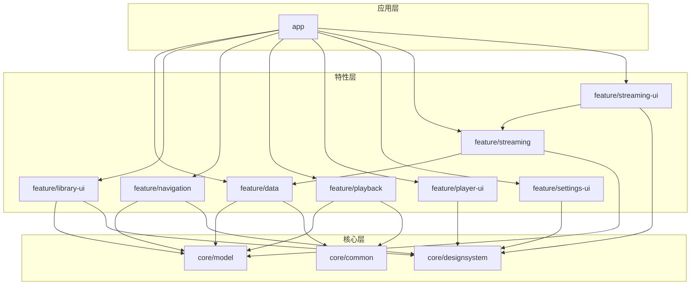
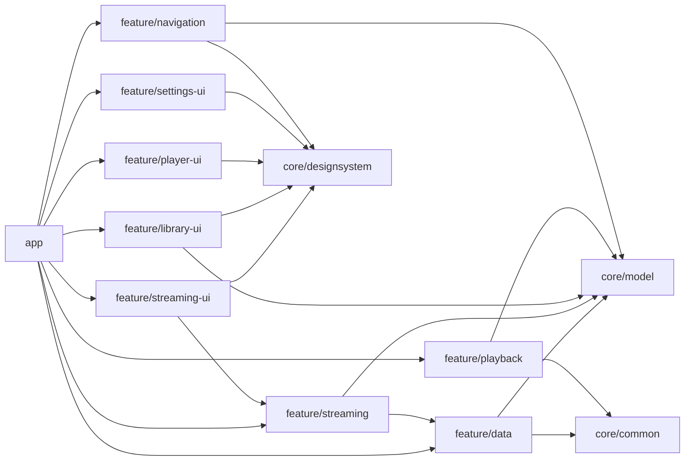
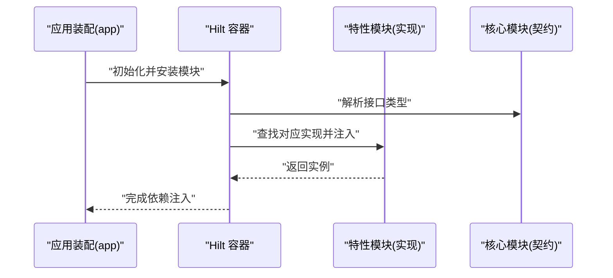

# 模块依赖管理

<cite>
**本文引用的文件**   
- [settings.gradle](file://settings.gradle)
- [build.gradle](file://build.gradle)
- [gradle/libs.versions.toml](file://gradle/libs.versions.toml)
- [app/build.gradle](file://app/build.gradle)
- [core/common/build.gradle](file://core/common/build.gradle)
- [core/designsystem/build.gradle](file://core/designsystem/build.gradle)
- [core/model/build.gradle](file://core/model/build.gradle)
- [feature/data/build.gradle](file://feature/data/build.gradle)
- [feature/library-ui/build.gradle](file://feature/library-ui/build.gradle)
- [feature/navigation/build.gradle](file://feature/navigation/build.gradle)
- [feature/playback/build.gradle](file://feature/playback/build.gradle)
- [feature/player-ui/build.gradle](file://feature/player-ui/build.gradle)
- [feature/settings-ui/build.gradle](file://feature/settings-ui/build.gradle)
- [feature/streaming/build.gradle](file://feature/streaming/build.gradle)
- [feature/streaming-ui/build.gradle](file://feature/streaming-ui/build.gradle)
</cite>

## 目录
1. [简介](#简介)
2. [项目结构](#项目结构)
3. [核心组件](#核心组件)
4. [架构总览](#架构总览)
5. [详细组件分析](#详细组件分析)
6. [依赖关系与循环依赖治理](#依赖关系与循环依赖治理)
7. [依赖注入在模块化中的使用](#依赖注入在模块化中的使用)
8. [版本目录（libs.versions.toml）统一策略](#版本目录libsversionstoml统一策略)
9. [依赖冲突解决](#依赖冲突解决)
10. [性能优化与构建加速](#性能优化与构建加速)
11. [故障排查指南](#故障排查指南)
12. [结论](#结论)

## 简介
本文件面向 Echo Android 多模块项目的依赖管理与配置，聚焦以下目标：
- 说明 Gradle 多模块的依赖组织方式与最佳实践
- 文档化版本目录（Version Catalog）的使用与统一管理策略
- 绘制模块间依赖关系图并给出避免循环依赖的策略
- 说明 Hilt/Dagger 在模块化项目中的配置与模块绑定要点
- 提供依赖冲突解决、性能优化与构建加速的实践建议

## 项目结构
Echo Android 采用分层+分层的模块化组织：
- app：应用装配层，聚合各功能模块，负责应用入口与运行时组装
- core：公共能力层，包含通用工具、设计系统与领域模型
- feature：按业务域划分的特性模块，如数据、播放、流媒体、UI 等
- gradle/libs.versions.toml：集中声明第三方库与插件版本

图表来源
- [settings.gradle](file://settings.gradle)
- [app/build.gradle](file://app/build.gradle)
- [core/common/build.gradle](file://core/common/build.gradle)
- [core/designsystem/build.gradle](file://core/designsystem/build.gradle)
- [core/model/build.gradle](file://core/model/build.gradle)
- [feature/data/build.gradle](file://feature/data/build.gradle)
- [feature/library-ui/build.gradle](file://feature/library-ui/build.gradle)
- [feature/navigation/build.gradle](file://feature/navigation/build.gradle)
- [feature/playback/build.gradle](file://feature/playback/build.gradle)
- [feature/player-ui/build.gradle](file://feature/player-ui/build.gradle)
- [feature/settings-ui/build.gradle](file://feature/settings-ui/build.gradle)
- [feature/streaming/build.gradle](file://feature/streaming/build.gradle)
- [feature/streaming-ui/build.gradle](file://feature/streaming-ui/build.gradle)

章节来源
- [settings.gradle](file://settings.gradle)
- [build.gradle](file://build.gradle)

## 核心组件
- 版本目录（Version Catalog）：通过 gradle/libs.versions.toml 集中管理所有第三方库与插件版本，供各模块引用，确保版本一致性与可维护性。
- 模块边界：
  - core 层为最底层基础能力，不依赖任何 feature 或 app
  - feature 层按业务域拆分，仅依赖 core 与必要的其他 feature（遵循单向依赖）
  - app 层负责组合与装配，依赖所有需要暴露给应用的 feature 与 core

章节来源
- [gradle/libs.versions.toml](file://gradle/libs.versions.toml)
- [core/common/build.gradle](file://core/common/build.gradle)
- [core/designsystem/build.gradle](file://core/designsystem/build.gradle)
- [core/model/build.gradle](file://core/model/build.gradle)
- [feature/data/build.gradle](file://feature/data/build.gradle)
- [feature/streaming/build.gradle](file://feature/streaming/build.gradle)
- [feature/streaming-ui/build.gradle](file://feature/streaming-ui/build.gradle)
- [feature/library-ui/build.gradle](file://feature/library-ui/build.gradle)
- [feature/playback/build.gradle](file://feature/playback/build.gradle)
- [feature/player-ui/build.gradle](file://feature/player-ui/build.gradle)
- [feature/settings-ui/build.gradle](file://feature/settings-ui/build.gradle)
- [feature/navigation/build.gradle](file://feature/navigation/build.gradle)
- [app/build.gradle](file://app/build.gradle)

## 架构总览
下图展示了模块间的依赖方向与层次划分，强调“自上而下”的单向依赖原则，避免跨层反向依赖与环状依赖。

图表来源
- [settings.gradle](file://settings.gradle)
- [app/build.gradle](file://app/build.gradle)
- [core/common/build.gradle](file://core/common/build.gradle)
- [core/designsystem/build.gradle](file://core/designsystem/build.gradle)
- [core/model/build.gradle](file://core/model/build.gradle)
- [feature/data/build.gradle](file://feature/data/build.gradle)
- [feature/streaming/build.gradle](file://feature/streaming/build.gradle)
- [feature/streaming-ui/build.gradle](file://feature/streaming-ui/build.gradle)
- [feature/library-ui/build.gradle](file://feature/library-ui/build.gradle)
- [feature/playback/build.gradle](file://feature/playback/build.gradle)
- [feature/player-ui/build.gradle](file://feature/player-ui/build.gradle)
- [feature/settings-ui/build.gradle](file://feature/settings-ui/build.gradle)
- [feature/navigation/build.gradle](file://feature/navigation/build.gradle)

## 详细组件分析

### 版本目录（libs.versions.toml）
- 作用：集中定义所有第三方库与插件的版本号，供各模块以 catalog 引用，避免分散声明导致的版本不一致。
- 使用方式：
  - 在根 build.gradle 中启用版本目录
  - 在各模块 build.gradle 中使用 catalog 提供的别名引用依赖
- 优势：
  - 单一事实源，升级便捷
  - 减少重复与拼写错误
  - 便于团队协同与审计

章节来源
- [gradle/libs.versions.toml](file://gradle/libs.versions.toml)
- [build.gradle](file://build.gradle)

### 核心模块（core）
- core/common：通用工具、平台适配、基础扩展等
- core/designsystem：设计系统、主题、样式、通用 UI 组件
- core/model：领域模型、数据结构、常量与协议定义
- 依赖约束：core 内部模块之间保持清晰边界，不依赖任何 feature 或 app

章节来源
- [core/common/build.gradle](file://core/common/build.gradle)
- [core/designsystem/build.gradle](file://core/designsystem/build.gradle)
- [core/model/build.gradle](file://core/model/build.gradle)

### 特性模块（feature）
- feature/data：数据访问、仓库实现、本地/网络数据源
- feature/streaming：流媒体相关逻辑，可能依赖 data 与 model
- feature/streaming-ui：流媒体 UI 展示，依赖 streaming 与 designsystem
- feature/library-ui：音乐库 UI，依赖 model 与 designsystem
- feature/playback：播放控制与状态管理，依赖 model 与 common
- feature/player-ui：播放器界面，依赖 designsystem
- feature/settings-ui：设置界面，依赖 designsystem
- feature/navigation：导航路由与页面编排，依赖 model 与 designsystem

章节来源
- [feature/data/build.gradle](file://feature/data/build.gradle)
- [feature/streaming/build.gradle](file://feature/streaming/build.gradle)
- [feature/streaming-ui/build.gradle](file://feature/streaming-ui/build.gradle)
- [feature/library-ui/build.gradle](file://feature/library-ui/build.gradle)
- [feature/playback/build.gradle](file://feature/playback/build.gradle)
- [feature/player-ui/build.gradle](file://feature/player-ui/build.gradle)
- [feature/settings-ui/build.gradle](file://feature/settings-ui/build.gradle)
- [feature/navigation/build.gradle](file://feature/navigation/build.gradle)

### 应用模块（app）
- 职责：装配各 feature 与 core，启动应用，注册全局依赖注入模块，配置应用级行为
- 依赖：聚合所有需要对外暴露的模块

章节来源
- [app/build.gradle](file://app/build.gradle)

## 依赖关系与循环依赖治理
- 依赖方向原则：
  - app → feature → core
  - feature 之间尽量解耦，必要时通过接口抽象与事件总线通信
  - core 不依赖上层模块
- 常见违规模式与修复：
  - 反向依赖：feature 依赖 app 或 core 依赖 feature → 将共享逻辑下沉到 core 或通过接口暴露
  - 横向耦合：两个 feature 互相依赖 → 抽取公共契约到 core 或使用消息/回调机制
  - 隐式依赖：通过反射或资源名访问 → 改为显式 API 调用
- 检测手段：
  - 使用 Gradle 任务检查依赖图
  - 引入静态分析工具进行依赖规则校验
  - 在 CI 中加入依赖合规检查

章节来源
- [settings.gradle](file://settings.gradle)
- [build.gradle](file://build.gradle)

## 依赖注入在模块化中的使用
- 总体思路：
  - 在 core 层定义接口与契约
  - 在 feature 层提供具体实现
  - 在 app 层进行模块绑定与装配
- Hilt/Dagger 要点：
  - 使用 @Module 与 @InstallIn 限定作用域
  - 在 feature 模块内提供该模块的实现类
  - 在 app 模块中安装所有需要的模块，保证运行时能解析依赖
  - 避免在 core 中持有 Android 上下文或框架类，保持纯 Kotlin/Java 契约
- 示例流程（概念序列图）：

[此图为概念流程，不直接映射具体源码文件]

## 版本目录（libs.versions.toml）统一策略
- 命名规范：
  - 版本号使用语义化版本（主.次.修订）
  - 依赖别名采用小写下划线风格，体现用途（如 networking_okhttp）
- 分类管理：
  - plugins：Gradle 插件版本
  - libs：第三方库版本
  - versions：自定义版本变量（如 kotlin_version）
- 升级策略：
  - 先升级版本目录，再逐个模块验证
  - 对破坏性变更进行兼容性测试与回归验证
- 使用方式：
  - 在模块 build.gradle 中以 catalog 引用依赖
  - 在根 build.gradle 中启用版本目录并统一插件版本

章节来源
- [gradle/libs.versions.toml](file://gradle/libs.versions.toml)
- [build.gradle](file://build.gradle)

## 依赖冲突解决
- 识别冲突：
  - 使用 Gradle 依赖报告命令生成冲突清单
  - 关注传递性依赖带来的版本差异
- 解决策略：
  - 强制版本：在根 build.gradle 中统一指定冲突库的版本
  - 排除传递依赖：在引入上游模块时排除不必要的子依赖
  - 替换实现：使用 BOM 或版本目录对齐三方库版本
- 验证方法：
  - 清理缓存后重新构建
  - 运行单元测试与集成测试覆盖关键路径

章节来源
- [build.gradle](file://build.gradle)

## 性能优化与构建加速
- 并行与增量构建：
  - 启用并行构建与守护进程
  - 合理划分模块粒度，提升增量编译命中率
- 缓存与远程构建：
  - 启用 Gradle 构建缓存与配置缓存
  - 结合远程缓存提升团队协作效率
- 资源与代码优化：
  - 按需启用 R8/ProGuard 混淆与压缩
  - 使用 ViewBinding/Compose 编译优化选项
- 内存与 JVM 参数：
  - 调整 Gradle JVM 堆大小与元空间
  - 根据机器配置优化线程数与并行度

章节来源
- [build.gradle](file://build.gradle)

## 故障排查指南
- 常见问题定位：
  - 依赖未解析：检查版本目录与仓库配置
  - 循环依赖：查看依赖图并重构模块边界
  - 运行时 DI 失败：确认模块安装与作用域是否正确
- 诊断步骤：
  - 生成依赖树与冲突报告
  - 逐步缩小范围至最小复现模块
  - 使用日志与断点定位注入链路

章节来源
- [build.gradle](file://build.gradle)

## 结论
通过清晰的模块分层、统一的版本目录与严格的依赖方向约束，Echo Android 在多模块环境下实现了良好的可维护性与可扩展性。配合 Hilt/Dagger 的模块化装配与完善的冲突解决与构建优化策略，可在保证质量的同时持续提升构建与运行性能。