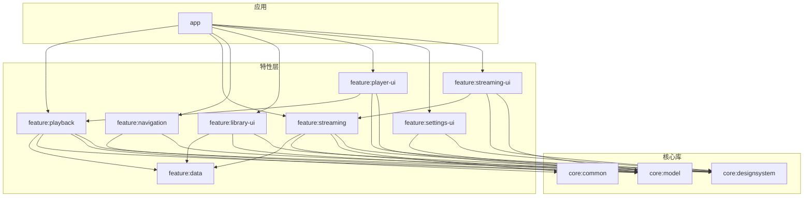
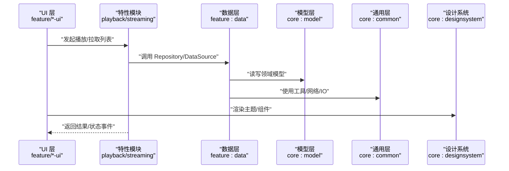
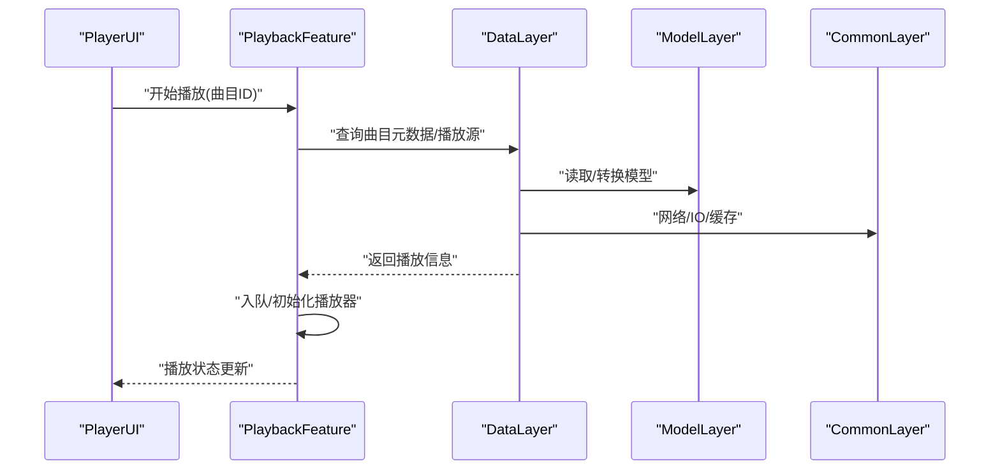
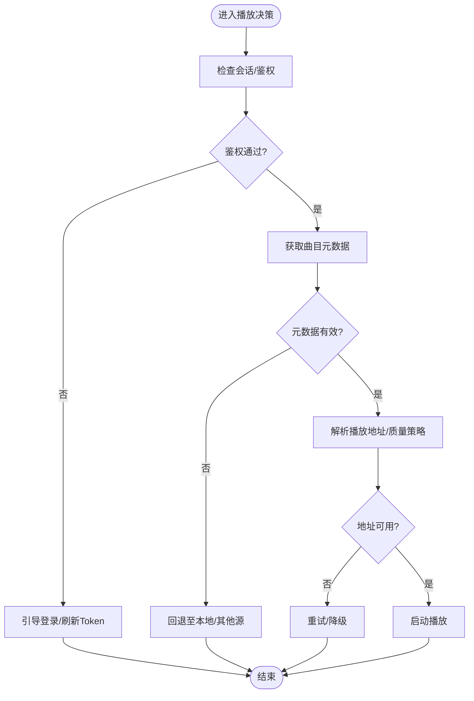
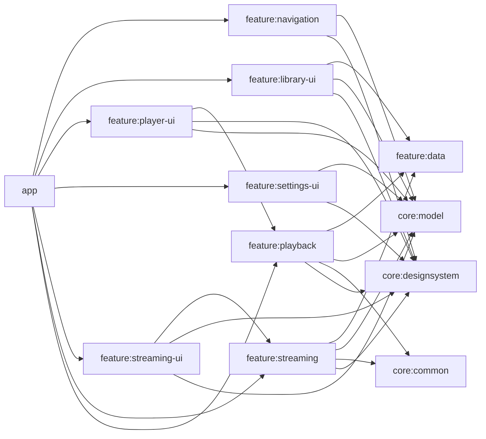

# 模块化设计

<cite>
**本文引用的文件**   
- [settings.gradle](file://settings.gradle)
- [build.gradle](file://build.gradle)
- [app/build.gradle](file://app/build.gradle)
- [core/common/build.gradle](file://core/common/build.gradle)
- [core/designsystem/build.gradle](file://core/designsystem/build.gradle)
- [core/model/build.gradle](file://core/model/build.gradle)
- [feature/data/build.gradle](file://feature/data/build.gradle)
- [feature/playback/build.gradle](file://feature/playback/build.gradle)
- [feature/streaming/build.gradle](file://feature/streaming/build.gradle)
- [feature/streaming-ui/build.gradle](file://feature/streaming-ui/build.gradle)
- [feature/library-ui/build.gradle](file://feature/library-ui/build.gradle)
- [feature/player-ui/build.gradle](file://feature/player-ui/build.gradle)
- [feature/settings-ui/build.gradle](file://feature/settings-ui/build.gradle)
- [feature/navigation/build.gradle](file://feature/navigation/build.gradle)
- [core/common/src/main/AndroidManifest.xml](file://core/common/src/main/AndroidManifest.xml)
- [core/designsystem/src/main/AndroidManifest.xml](file://core/designsystem/src/main/AndroidManifest.xml)
- [core/model/src/main/AndroidManifest.xml](file://core/model/src/main/AndroidManifest.xml)
- [feature/data/src/main/AndroidManifest.xml](file://feature/data/src/main/AndroidManifest.xml)
- [feature/playback/src/main/AndroidManifest.xml](file://feature/playback/src/main/AndroidManifest.xml)
- [feature/streaming/src/main/AndroidManifest.xml](file://feature/streaming/src/main/AndroidManifest.xml)
- [feature/streaming-ui/src/main/AndroidManifest.xml](file://feature/streaming-ui/src/main/AndroidManifest.xml)
- [feature/library-ui/src/main/AndroidManifest.xml](file://feature/library-ui/src/main/AndroidManifest.xml)
- [feature/player-ui/src/main/AndroidManifest.xml](file://feature/player-ui/src/main/AndroidManifest.xml)
- [feature/settings-ui/src/main/AndroidManifest.xml](file://feature/settings-ui/src/main/AndroidManifest.xml)
- [feature/navigation/src/main/AndroidManifest.xml](file://feature/navigation/src/main/AndroidManifest.xml)
- [app/src/main/AndroidManifest.xml](file://app/src/main/AndroidManifest.xml)
</cite>

## 目录
1. [简介](#简介)
2. [项目结构](#项目结构)
3. [核心模块](#核心模块)
4. [架构总览](#架构总览)
5. [详细组件分析](#详细组件分析)
6. [依赖关系分析](#依赖关系分析)
7. [性能与构建优化](#性能与构建优化)
8. [故障排查指南](#故障排查指南)
9. [结论](#结论)
10. [附录](#附录)

## 简介
本文件面向 Echo Android 应用的模块化设计与实现，系统阐述多模块架构的设计原则、模块职责边界、接口契约与通信机制，并给出模块依赖图与构建配置说明。目标是帮助开发者快速理解并高效参与模块化开发，提升编译速度、代码复用、职责分离与独立测试能力。

## 项目结构
仓库采用“应用 + 核心库 + 特性模块”的多模块组织方式：
- app：主应用模块，负责装配、启动、导航与平台集成
- core：通用基础库（common、designsystem、model）
- feature：按业务域划分的特性模块（data、playback、streaming、streaming-ui、library-ui、player-ui、settings-ui、navigation）



图表来源
- [settings.gradle](file://settings.gradle)
- [app/build.gradle](file://app/build.gradle)
- [core/model/build.gradle](file://core/model/build.gradle)
- [core/common/build.gradle](file://core/common/build.gradle)
- [core/designsystem/build.gradle](file://core/designsystem/build.gradle)
- [feature/data/build.gradle](file://feature/data/build.gradle)
- [feature/playback/build.gradle](file://feature/playback/build.gradle)
- [feature/streaming/build.gradle](file://feature/streaming/build.gradle)
- [feature/streaming-ui/build.gradle](file://feature/streaming-ui/build.gradle)
- [feature/library-ui/build.gradle](file://feature/library-ui/build.gradle)
- [feature/player-ui/build.gradle](file://feature/player-ui/build.gradle)
- [feature/settings-ui/build.gradle](file://feature/settings-ui/build.gradle)
- [feature/navigation/build.gradle](file://feature/navigation/build.gradle)

章节来源
- [settings.gradle](file://settings.gradle)
- [build.gradle](file://build.gradle)

## 核心模块
本节概述各模块的职责与边界，便于在跨模块协作时明确接口与数据流向。

- app 主应用模块
  - 职责：应用入口、生命周期管理、全局依赖注入装配、导航宿主、平台能力桥接、特性模块聚合
  - 典型产物：Application、Activity、Fragment、导航路由、Feature 绑定器
  - 依赖：所有 UI 特性模块、播放与流媒体特性模块、导航模块、核心库

- core/model 数据模型模块
  - 职责：领域实体、DTO、枚举、常量、不可变数据结构；不依赖任何业务或 UI 逻辑
  - 典型产物：Track、Playlist、Artist、Album、Source、PlaybackState 等模型
  - 依赖：无（纯 Kotlin/Java 库）

- core/common 通用工具模块
  - 职责：跨模块共享的工具类、扩展函数、网络/IO/时间/加密等基础能力封装
  - 典型产物：日志、序列化、线程调度、资源访问封装、URI/路径处理
  - 依赖：仅 Android API 与第三方库，不依赖业务模块

- core/designsystem 设计系统模块
  - 职责：统一主题、颜色、字体、图标、可复用 Compose/Jetpack 组件、样式资源
  - 典型产物：Theme、ColorScheme、Typography、IconSet、通用 UI 组件
  - 依赖：Android 资源与 Jetpack 组件，不依赖业务模块

- feature/data 数据层模块
  - 职责：数据源抽象与实现（本地 Room、远程 HTTP）、仓储接口与实现、缓存策略、迁移脚本
  - 典型产物：Repository 接口、DAO、Entity、DataSource、UseCase 的底层实现
  - 依赖：core:model、core:common、Room/HTTP 客户端等

- feature/playback 播放核心模块
  - 职责：播放引擎编排、队列管理、状态机、音频会话、通知、后台服务协调
  - 典型产物：PlaybackService、QueueManager、PlayerController、状态事件总线
  - 依赖：core:model、core:common、core:designsystem、feature:data

- feature/streaming 流媒体模块
  - 职责：流媒体协议适配、鉴权与会话维护、播放列表解析、质量策略、Cookie/Session 管理
  - 典型产物：StreamingProvider、SessionManager、PlaylistParser、QualityPolicy
  - 依赖：core:model、core:common、core:designsystem、feature:data

- feature/streaming-ui 流媒体 UI 模块
  - 职责：流媒体相关界面（登录、播放列表、搜索、设置）
  - 依赖：feature:streaming、core:designsystem、core:model

- feature/library-ui 本地库 UI 模块
  - 职责：本地音乐库浏览、导入、分组、收藏等界面
  - 依赖：feature:data、core:designsystem、core:model

- feature/player-ui 播放器 UI 模块
  - 职责：正在播放、歌词浮窗、迷你播放器等界面
  - 依赖：feature:playback、core:designsystem、core:model

- feature/settings-ui 设置 UI 模块
  - 职责：应用设置页、播放偏好、下载策略等界面
  - 依赖：core:designsystem、core:model

- feature/navigation 导航模块
  - 职责：路由定义、导航图、页面跳转契约
  - 依赖：core:model、core:designsystem

章节来源
- [app/src/main/AndroidManifest.xml](file://app/src/main/AndroidManifest.xml)
- [core/model/src/main/AndroidManifest.xml](file://core/model/src/main/AndroidManifest.xml)
- [core/common/src/main/AndroidManifest.xml](file://core/common/src/main/AndroidManifest.xml)
- [core/designsystem/src/main/AndroidManifest.xml](file://core/designsystem/src/main/AndroidManifest.xml)
- [feature/data/src/main/AndroidManifest.xml](file://feature/data/src/main/AndroidManifest.xml)
- [feature/playback/src/main/AndroidManifest.xml](file://feature/playback/src/main/AndroidManifest.xml)
- [feature/streaming/src/main/AndroidManifest.xml](file://feature/streaming/src/main/AndroidManifest.xml)
- [feature/streaming-ui/src/main/AndroidManifest.xml](file://feature/streaming-ui/src/main/AndroidManifest.xml)
- [feature/library-ui/src/main/AndroidManifest.xml](file://feature/library-ui/src/main/AndroidManifest.xml)
- [feature/player-ui/src/main/AndroidManifest.xml](file://feature/player-ui/src/main/AndroidManifest.xml)
- [feature/settings-ui/src/main/AndroidManifest.xml](file://feature/settings-ui/src/main/AndroidManifest.xml)
- [feature/navigation/src/main/AndroidManifest.xml](file://feature/navigation/src/main/AndroidManifest.xml)

## 架构总览
下图展示从 UI 到数据层的调用链路与模块边界。UI 层通过特性模块暴露的接口消费能力，特性模块再组合 core 层能力完成具体业务。



图表来源
- [feature/streaming-ui/build.gradle](file://feature/streaming-ui/build.gradle)
- [feature/streaming/build.gradle](file://feature/streaming/build.gradle)
- [feature/data/build.gradle](file://feature/data/build.gradle)
- [core/model/build.gradle](file://core/model/build.gradle)
- [core/common/build.gradle](file://core/common/build.gradle)
- [core/designsystem/build.gradle](file://core/designsystem/build.gradle)

## 详细组件分析

### 模块依赖与接口契约
- 依赖方向
  - UI 模块只依赖对应特性模块与 core 层，禁止反向依赖
  - 特性模块依赖 data 与 core 层，避免直接耦合平台细节
  - core 层保持最小依赖，确保高内聚低耦合
- 接口契约
  - 以接口/抽象类暴露能力，实现放在同模块或更低层
  - 数据模型在 core:model 中定义，作为跨模块稳定契约
  - UI 通过 ViewModel/UseCase 与特性模块交互，避免直连 Service/DB

```mermaid
classDiagram
class ModelLayer {
<<core : model>>
"领域实体/DTO/枚举"
}
class CommonLayer {
<<core : common>>
"工具/扩展/基础能力"
}
class DesignSystem {
<<core : designsystem>>
"主题/组件/资源"
}
class DataLayer {
<<feature : data>>
"Repository/DAO/DataSource"
}
class PlaybackFeature {
<<feature : playback>>
"播放引擎/队列/状态机"
}
class StreamingFeature {
<<feature : streaming>>
"流媒体适配/会话/解析"
}
class StreamingUI {
<<feature : streaming-ui>>
"流媒体界面"
}
class LibraryUI {
<<feature : library-ui>>
"本地库界面"
}
class PlayerUI {
<<feature : player-ui>>
"播放器界面"
}
class SettingsUI {
<<feature : settings-ui>>
"设置界面"
}
class Navigation {
<<feature : navigation>>
"路由/导航图"
}
DataLayer --> ModelLayer : "使用"
DataLayer --> CommonLayer : "使用"
PlaybackFeature --> DataLayer : "调用"
PlaybackFeature --> ModelLayer : "使用"
PlaybackFeature --> CommonLayer : "使用"
PlaybackFeature --> DesignSystem : "使用"
StreamingFeature --> DataLayer : "调用"
StreamingFeature --> ModelLayer : "使用"
StreamingFeature --> CommonLayer : "使用"
StreamingFeature --> DesignSystem : "使用"
StreamingUI --> StreamingFeature : "消费"
StreamingUI --> DesignSystem : "使用"
StreamingUI --> ModelLayer : "使用"
LibraryUI --> DataLayer : "消费"
LibraryUI --> DesignSystem : "使用"
LibraryUI --> ModelLayer : "使用"
PlayerUI --> PlaybackFeature : "消费"
PlayerUI --> DesignSystem : "使用"
PlayerUI --> ModelLayer : "使用"
SettingsUI --> DesignSystem : "使用"
SettingsUI --> ModelLayer : "使用"
Navigation --> ModelLayer : "使用"
Navigation --> DesignSystem : "使用"
```

图表来源
- [feature/streaming-ui/build.gradle](file://feature/streaming-ui/build.gradle)
- [feature/streaming/build.gradle](file://feature/streaming/build.gradle)
- [feature/data/build.gradle](file://feature/data/build.gradle)
- [feature/playback/build.gradle](file://feature/playback/build.gradle)
- [feature/library-ui/build.gradle](file://feature/library-ui/build.gradle)
- [feature/player-ui/build.gradle](file://feature/player-ui/build.gradle)
- [feature/settings-ui/build.gradle](file://feature/settings-ui/build.gradle)
- [feature/navigation/build.gradle](file://feature/navigation/build.gradle)
- [core/model/build.gradle](file://core/model/build.gradle)
- [core/common/build.gradle](file://core/common/build.gradle)
- [core/designsystem/build.gradle](file://core/designsystem/build.gradle)

章节来源
- [feature/streaming-ui/build.gradle](file://feature/streaming-ui/build.gradle)
- [feature/streaming/build.gradle](file://feature/streaming/build.gradle)
- [feature/data/build.gradle](file://feature/data/build.gradle)
- [feature/playback/build.gradle](file://feature/playback/build.gradle)
- [feature/library-ui/build.gradle](file://feature/library-ui/build.gradle)
- [feature/player-ui/build.gradle](file://feature/player-ui/build.gradle)
- [feature/settings-ui/build.gradle](file://feature/settings-ui/build.gradle)
- [feature/navigation/build.gradle](file://feature/navigation/build.gradle)
- [core/model/build.gradle](file://core/model/build.gradle)
- [core/common/build.gradle](file://core/common/build.gradle)
- [core/designsystem/build.gradle](file://core/designsystem/build.gradle)

### 关键流程时序（示例：播放请求）


图表来源
- [feature/player-ui/build.gradle](file://feature/player-ui/build.gradle)
- [feature/playback/build.gradle](file://feature/playback/build.gradle)
- [feature/data/build.gradle](file://feature/data/build.gradle)
- [core/model/build.gradle](file://core/model/build.gradle)
- [core/common/build.gradle](file://core/common/build.gradle)

### 复杂逻辑流程图（示例：流媒体播放决策）


图表来源
- [feature/streaming/build.gradle](file://feature/streaming/build.gradle)
- [feature/data/build.gradle](file://feature/data/build.gradle)
- [core/model/build.gradle](file://core/model/build.gradle)
- [core/common/build.gradle](file://core/common/build.gradle)

## 依赖关系分析
- 模块间依赖遵循单向依赖原则：上层依赖下层，禁止循环依赖
- 构建期可通过 Gradle 插件校验依赖方向，防止越界引用
- 建议为每个模块提供清晰的 public API 文档，限制对外暴露范围



图表来源
- [app/build.gradle](file://app/build.gradle)
- [feature/playback/build.gradle](file://feature/playback/build.gradle)
- [feature/streaming/build.gradle](file://feature/streaming/build.gradle)
- [feature/streaming-ui/build.gradle](file://feature/streaming-ui/build.gradle)
- [feature/library-ui/build.gradle](file://feature/library-ui/build.gradle)
- [feature/player-ui/build.gradle](file://feature/player-ui/build.gradle)
- [feature/settings-ui/build.gradle](file://feature/settings-ui/build.gradle)
- [feature/navigation/build.gradle](file://feature/navigation/build.gradle)
- [feature/data/build.gradle](file://feature/data/build.gradle)
- [core/model/build.gradle](file://core/model/build.gradle)
- [core/common/build.gradle](file://core/common/build.gradle)
- [core/designsystem/build.gradle](file://core/designsystem/build.gradle)

章节来源
- [app/build.gradle](file://app/build.gradle)
- [feature/playback/build.gradle](file://feature/playback/build.gradle)
- [feature/streaming/build.gradle](file://feature/streaming/build.gradle)
- [feature/streaming-ui/build.gradle](file://feature/streaming-ui/build.gradle)
- [feature/library-ui/build.gradle](file://feature/library-ui/build.gradle)
- [feature/player-ui/build.gradle](file://feature/player-ui/build.gradle)
- [feature/settings-ui/build.gradle](file://feature/settings-ui/build.gradle)
- [feature/navigation/build.gradle](file://feature/navigation/build.gradle)
- [feature/data/build.gradle](file://feature/data/build.gradle)
- [core/model/build.gradle](file://core/model/build.gradle)
- [core/common/build.gradle](file://core/common/build.gradle)
- [core/designsystem/build.gradle](file://core/designsystem/build.gradle)

## 性能与构建优化
- 增量编译与并行构建
  - 启用 Gradle 并行与守护进程，合理划分模块粒度，减少跨模块变更影响面
- 按需编译
  - 将 UI 与业务解耦，使非相关模块无需参与全量编译
- 依赖收敛
  - 严格限定模块对外 API，避免隐式传递依赖导致编译膨胀
- 资源与二进制体积
  - 设计系统集中管理资源，避免重复打包；按需引入第三方库
- 测试隔离
  - 单元测试聚焦单个模块，缩短反馈周期；UI 测试下沉到特性模块

[本节为通用指导，不涉及具体文件]

## 故障排查指南
- 常见构建问题
  - 循环依赖：使用 Gradle 插件检测并修复
  - 版本冲突：统一在根级版本目录管理，避免模块间版本不一致
  - 资源命名冲突：在设计系统模块统一管理资源前缀
- 运行时问题定位
  - 播放中断：检查播放状态机与通知通道、前台服务权限
  - 流媒体失败：核对鉴权会话、Cookie/Token 刷新、代理与网络策略
  - 数据异常：确认 Room 迁移脚本与 DAO 一致性

章节来源
- [feature/playback/src/main/AndroidManifest.xml](file://feature/playback/src/main/AndroidManifest.xml)
- [feature/streaming/src/main/AndroidManifest.xml](file://feature/streaming/src/main/AndroidManifest.xml)
- [feature/data/src/main/AndroidManifest.xml](file://feature/data/src/main/AndroidManifest.xml)

## 结论
通过清晰的分层与特性化拆分，Echo Android 实现了高内聚、低耦合的模块化架构。core 层提供稳定契约与通用能力，feature 层专注业务闭环，UI 层仅关注呈现与交互。该架构显著提升了编译效率、可维护性与可测试性，并为后续功能扩展与团队协作提供了坚实基础。

## 附录
- 构建配置要点
  - 根级 settings.gradle 声明子模块
  - 根级 build.gradle 统一插件与公共配置
  - 各模块 build.gradle 声明自身依赖与构建选项
- 清单文件
  - 各模块 AndroidManifest.xml 声明必要的组件与权限，避免在 app 中散落

章节来源
- [settings.gradle](file://settings.gradle)
- [build.gradle](file://build.gradle)
- [app/build.gradle](file://app/build.gradle)
- [core/common/build.gradle](file://core/common/build.gradle)
- [core/designsystem/build.gradle](file://core/designsystem/build.gradle)
- [core/model/build.gradle](file://core/model/build.gradle)
- [feature/data/build.gradle](file://feature/data/build.gradle)
- [feature/playback/build.gradle](file://feature/playback/build.gradle)
- [feature/streaming/build.gradle](file://feature/streaming/build.gradle)
- [feature/streaming-ui/build.gradle](file://feature/streaming-ui/build.gradle)
- [feature/library-ui/build.gradle](file://feature/library-ui/build.gradle)
- [feature/player-ui/build.gradle](file://feature/player-ui/build.gradle)
- [feature/settings-ui/build.gradle](file://feature/settings-ui/build.gradle)
- [feature/navigation/build.gradle](file://feature/navigation/build.gradle)
- [core/common/src/main/AndroidManifest.xml](file://core/common/src/main/AndroidManifest.xml)
- [core/designsystem/src/main/AndroidManifest.xml](file://core/designsystem/src/main/AndroidManifest.xml)
- [core/model/src/main/AndroidManifest.xml](file://core/model/src/main/AndroidManifest.xml)
- [feature/data/src/main/AndroidManifest.xml](file://feature/data/src/main/AndroidManifest.xml)
- [feature/playback/src/main/AndroidManifest.xml](file://feature/playback/src/main/AndroidManifest.xml)
- [feature/streaming/src/main/AndroidManifest.xml](file://feature/streaming/src/main/AndroidManifest.xml)
- [feature/streaming-ui/src/main/AndroidManifest.xml](file://feature/streaming-ui/src/main/AndroidManifest.xml)
- [feature/library-ui/src/main/AndroidManifest.xml](file://feature/library-ui/src/main/AndroidManifest.xml)
- [feature/player-ui/src/main/AndroidManifest.xml](file://feature/player-ui/src/main/AndroidManifest.xml)
- [feature/settings-ui/src/main/AndroidManifest.xml](file://feature/settings-ui/src/main/AndroidManifest.xml)
- [feature/navigation/src/main/AndroidManifest.xml](file://feature/navigation/src/main/AndroidManifest.xml)
- [app/src/main/AndroidManifest.xml](file://app/src/main/AndroidManifest.xml)