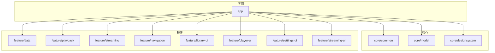
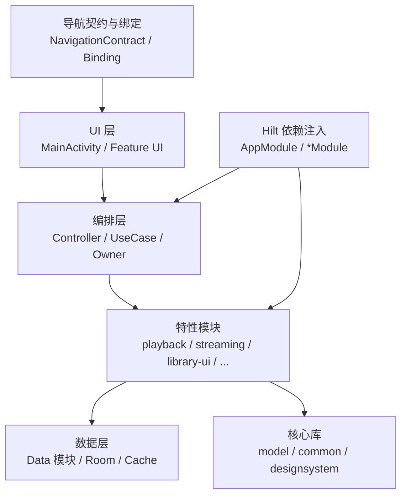
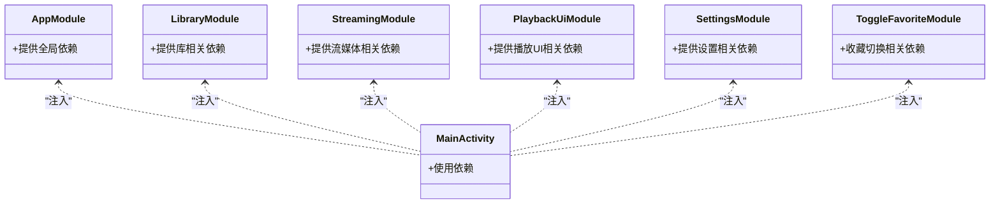
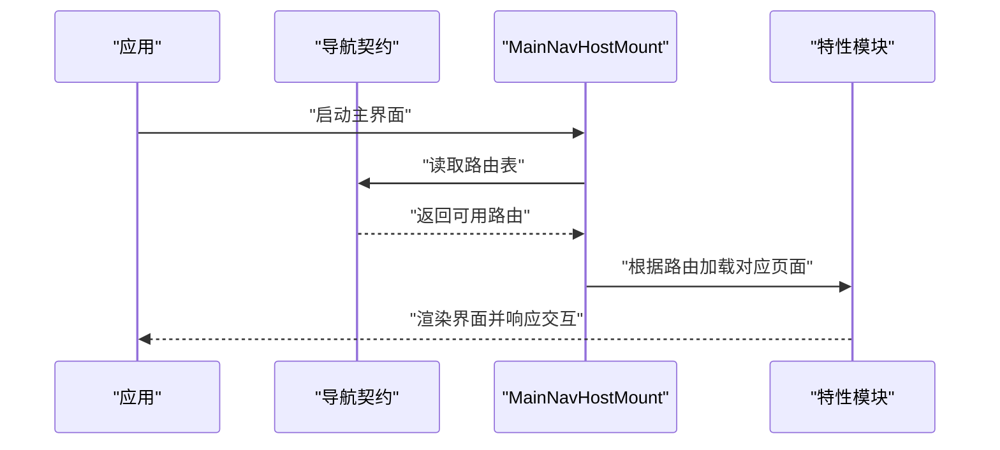
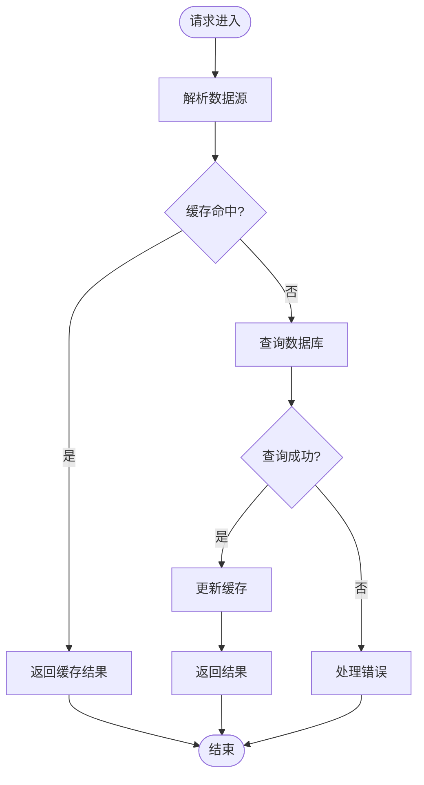
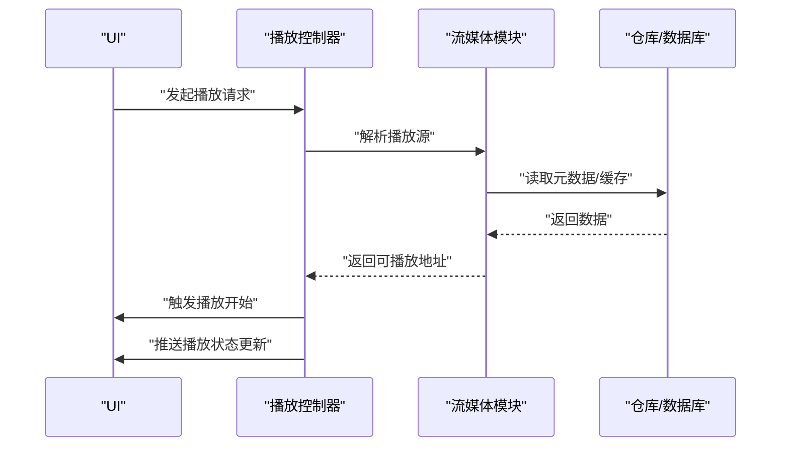
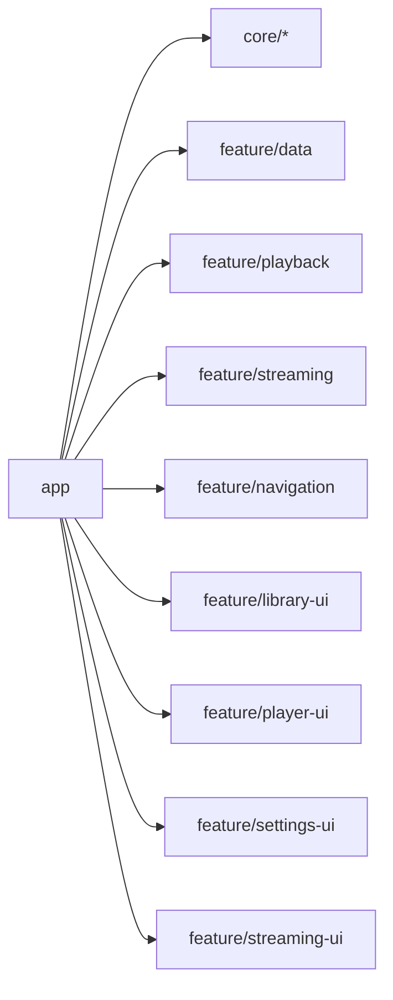

# 模块开发指南

<cite>
**本文引用的文件**
- [README.md](file://README.md)
- [build.gradle](file://build.gradle)
- [settings.gradle](file://settings.gradle)
- [gradle/libs.versions.toml](file://gradle/libs.versions.toml)
- [app/build.gradle](file://app/build.gradle)
- [core/common/build.gradle](file://core/common/build.gradle)
- [core/model/build.gradle](file://core/model/build.gradle)
- [feature/data/build.gradle](file://feature/data/build.gradle)
- [feature/playback/build.gradle](file://feature/playback/build.gradle)
- [feature/streaming/build.gradle](file://feature/streaming/build.gradle)
- [feature/navigation/build.gradle](file://feature/navigation/build.gradle)
- [feature/library-ui/build.gradle](file://feature/library-ui/build.gradle)
- [feature/player-ui/build.gradle](file://feature/player-ui/build.gradle)
- [feature/settings-ui/build.gradle](file://feature/settings-ui/build.gradle)
- [feature/streaming-ui/build.gradle](file://feature/streaming-ui/build.gradle)
- [core/designsystem/build.gradle](file://core/designsystem/build.gradle)
- [app/src/main/java/app/yukine/EchoApp.kt](file://app/src/main/java/app/yukine/EchoApp.kt)
- [app/src/main/java/app/yukine/di/AppModule.kt](file://app/src/main/java/app/yukine/di/AppModule.kt)
- [app/src/main/java/app/yukine/LibraryModule.kt](file://app/src/main/java/app/yukine/LibraryModule.kt)
- [app/src/main/java/app/yukine/StreamingModule.kt](file://app/src/main/java/app/yukine/StreamingModule.kt)
- [app/src/main/java/app/yukine/PlaybackUiModule.kt](file://app/src/main/java/app/yukine/PlaybackUiModule.kt)
- [app/src/main/java/app/yukine/SettingsModule.kt](file://app/src/main/java/app/yukine/SettingsModule.kt)
- [app/src/main/java/app/yukine/ToggleFavoriteModule.kt](file://app/src/main/java/app/yukine/ToggleFavoriteModule.kt)
- [app/src/main/java/app/yukine/MainNavHostMount.kt](file://app/src/main/java/app/yukine/MainNavHostMount.kt)
- [feature/navigation/src/main/java/app/yukine/navigation/NavigationContract.kt](file://feature/navigation/src/main/java/app/yukine/navigation/NavigationContract.kt)
- [feature/navigation/src/main/java/app/yukine/navigation/NavigationFeatureBinding.kt](file://feature/navigation/src/main/java/app/yukine/navigation/NavigationFeatureBinding.kt)
- [feature/streaming/src/main/java/app/yukine/streaming/StreamingRepositoryProvider.kt](file://feature/streaming/src/main/java/app/yukine/streaming/StreamingRepositoryProvider.kt)
- [feature/data/src/main/java/app/yukine/data/DataModule.kt](file://feature/data/src/main/java/app/yukine/data/DataModule.kt)
- [feature/data/src/main/java/app/yukine/data/room/YukineDatabase.kt](file://feature/data/src/main/java/app/yukine/data/room/YukineDatabase.kt)
- [feature/streaming/src/main/java/app/yukine/streaming/cache/StreamingCacheDatabase.kt](file://feature/streaming/src/main/java/app/yukine/streaming/cache/StreamingCacheDatabase.kt)
- [app/src/main/java/app/yukine/MainActivity.kt](file://app/src/main/java/app/yukine/MainActivity.kt)
- [app/src/main/java/app/yukine/MainActivityComposition.kt](file://app/src/main/java/app/yukine/MainActivityComposition.kt)
- [app/src/main/java/app/yukine/MainActivityDependencies.kt](file://app/src/main/java/app/yukine/MainActivityDependencies.kt)
- [app/src/main/java/app/yukine/MainActivityViewModels.kt](file://app/src/main/java/app/yukine/MainActivityViewModels.kt)
- [app/src/main/java/app/yukine/NetworkFeatureBinding.java](file://app/src/main/java/app/yukine/NetworkFeatureBinding.java)
- [app/src/main/java/app/yukine/OnboardingFeatureBinding.java](file://app/src/main/java/app/yukine/OnboardingFeatureBinding.java)
- [app/src/main/java/app/yukine/PlatformFeatureBinding.java](file://app/src/main/java/app/yukine/PlatformFeatureBinding.java)
- [app/src/main/java/app/yukine/SettingsFeatureBinding.java](file://app/src/main/java/app/yukine/SettingsFeatureBinding.java)
- [app/src/main/java/app/yukine/StreamingFeatureBinding.java](file://app/src/main/java/app/yukine/StreamingFeatureBinding.java)
- [app/src/main/java/app/yukine/PlaybackFeatureBinding.kt](file://app/src/main/java/app/yukine/PlaybackFeatureBinding.kt)
- [app/src/main/java/app/yukine/NavigationFeatureBinding.kt](file://app/src/main/java/app/yukine/NavigationFeatureBinding.kt)
- [app/src/main/java/app/yukine/NetworkStateBinding.kt](file://app/src/main/java/app/yukine/NetworkStateBinding.kt)
- [app/src/main/java/app/yukine/LibraryStateBinding.kt](file://app/src/main/java/app/yukine/LibraryStateBinding.kt)
- [app/src/main/java/app/yukine/NowPlayingStateBinding.kt](file://app/src/main/java/app/yukine/NowPlayingStateBinding.kt)
- [app/src/main/java/app/yukine/QueueActionContracts.kt](file://app/src/main/java/app/yukine/QueueActionContracts.kt)
- [app/src/main/java/app/yukine/StatusMessageContracts.kt](file://app/src/main/java/app/yukine/StatusMessageContracts.kt)
- [app/src/main/java/app/yukine/PlayHistoryActionController.kt](file://app/src/main/java/app/yukine/PlayHistoryActionController.kt)
- [app/src/main/java/app/yukine/PlaybackActionController.kt](file://app/src/main/java/app/yukine/PlaybackActionController.kt)
- [app/src/main/java/app/yukine/PlaybackServiceConnectionController.kt](file://app/src/main/java/app/yukine/PlaybackServiceConnectionController.kt)
- [app/src/main/java/app/yukine/PlaybackStartController.kt](file://app/src/main/java/app/yukine/PlaybackStartController.kt)
- [app/src/main/java/app/yukine/PlaybackStateUpdateController.kt](file://app/src/main/java/app/yukine/PlaybackStateUpdateController.kt)
- [app/src/main/java/app/yukine/PlaybackDomainReactionOwner.kt](file://app/src/main/java/app/yukine/PlaybackDomainReactionOwner.kt)
- [app/src/main/java/app/yukine/TrackListStatePublisher.kt](file://app/src/main/java/app/yukine/TrackListStatePublisher.kt)
- [app/src/main/java/app/yukine/PlaylistSourceResolver.kt](file://app/src/main/java/app/yukine/PlaylistSourceResolver.kt)
- [app/src/main/java/app/yukine/CanonicalPlaybackSourceResolver.kt](file://app/src/main/java/app/yukine/CanonicalPlaybackSourceResolver.kt)
- [app/src/main/java/app/yukine/StreamingPlaybackController.kt](file://app/src/main/java/app/yukine/StreamingPlaybackController.kt)
- [app/src/main/java/app/yukine/StreamingPlaylistController.kt](file://app/src/main/java/app/yukine/StreamingPlaylistController.kt)
- [app/src/main/java/app/yukine/StreamingSearchActionAdapter.kt](file://app/src/main/java/app/yukine/StreamingSearchActionAdapter.kt)
- [app/src/main/java/app/yukine/StreamingAuthCallbackController.kt](file://app/src/main/java/app/yukine/StreamingAuthCallbackController.kt)
- [app/src/main/java/app/yukine/StreamingManualCookieController.kt](file://app/src/main/java/app/yukine/StreamingManualCookieController.kt)
- [app/src/main/java/app/yukine/StreamingSessionMaintenanceWorker.kt](file://app/src/main/java/app/yukine/StreamingSessionMaintenanceWorker.kt)
- [app/src/main/java/app/yukine/FavoriteSyncCoordinator.kt](file://app/src/main/java/app/yukine/FavoriteSyncCoordinator.kt)
- [app/src/main/java/app/yukine/FavoriteSyncPersistence.kt](file://app/src/main/java/app/yukine/FavoriteSyncPersistence.kt)
- [app/src/main/java/app/yukine/FavoriteSyncWorker.kt](file://app/src/main/java/app/yukine/FavoriteSyncWorker.kt)
- [app/src/main/java/app/yukine/LibraryMultiSourceSync.kt](file://app/src/main/java/app/yukine/LibraryMultiSourceSync.kt)
- [app/src/main/java/app/yukine/LibraryWebDavSyncOwner.kt](file://app/src/main/java/app/yukine/LibraryWebDavSyncOwner.kt)
- [app/src/main/java/app/yukine/IdentityEnhancementWorker.kt](file://app/src/main/java/app/yukine/IdentityEnhancementWorker.kt)
- [app/src/main/java/app/yukine/IdentityBackfillWorker.kt](file://app/src/main/java/app/yukine/IdentityBackfillWorker.kt)
- [app/src/main/java/app/yukine/KugouPlaylistSyncWorker.kt](file://app/src/main/java/app/yukine/KugouPlaylistSyncWorker.kt)
- [app/src/main/java/app/yukine/DownloadRequestController.kt](file://app/src/main/java/app/yukine/DownloadRequestController.kt)
- [app/src/main/java/app/yukine/TrackDownloadManager.kt](file://app/src/main/java/app/yukine/TrackDownloadManager.kt)
- [app/src/main/java/app/yukine/DownloadsDestinationOwner.kt](file://app/src/main/java/app/yukine/DownloadsDestinationOwner.kt)
- [app/src/main/java/app/yukine/DownloadDirectoryOwner.kt](file://app/src/main/java/app/yukine/DownloadDirectoryOwner.kt)
- [app/src/main/java/app/yukine/DownloadQualityDialogController.kt](file://app/src/main/java/app/yukine/DownloadQualityDialogController.kt)
- [app/src/main/java/app/yukine/DownloadedAudioMetadataWriter.kt](file://app/src/main/java/app/yukine/DownloadedAudioMetadataWriter.kt)
- [app/src/main/java/app/yukine/ContentResolverLibraryDocumentGateway.kt](file://app/src/main/java/app/yukine/ContentResolverLibraryDocumentGateway.kt)
- [app/src/main/java/app/yukine/M3uDocumentHelper.java](file://app/src/main/java/app/yukine/M3uDocumentHelper.java)
- [app/src/main/java/app/yukine/LyricsImportCoordinator.kt](file://app/src/main/java/app/yukine/LyricsImportCoordinator.kt)
- [app/src/main/java/app/yukine/LoadLyricsSettingsUseCase.kt](file://app/src/main/java/app/yukine/LoadLyricsSettingsUseCase.kt)
- [app/src/main/java/app/yukine/LoadTrackLyricsUseCase.kt](file://app/src/main/java/app/yukine/LoadTrackLyricsUseCase.kt)
- [app/src/main/java/app/yukine/LoadPlaylistTracksUseCase.kt](file://app/src/main/java/app/yukine/LoadPlaylistTracksUseCase.kt)
- [app/src/main/java/app/yukine/ApplySettingsPreferenceUseCase.kt](file://app/src/main/java/app/yukine/ApplySettingsPreferenceUseCase.kt)
- [app/src/main/java/app/yukine/LoadSettingsPreferencesUseCase.kt](file://app/src/main/java/app/yukine/LoadSettingsPreferencesUseCase.kt)
- [app/src/main/java/app/yukine/EnsureStreamingLoginPlaylistUseCase.kt](file://app/src/main/java/app/yukine/EnsureStreamingLoginPlaylistUseCase.kt)
- [app/src/main/java/app/yukine/GetStreamingPlaylistLinkUseCase.kt](file://app/src/main/java/app/yukine/GetStreamingPlaylistLinkUseCase.kt)
- [app/src/main/java/app/yukine/ImportStreamingPlaylistUseCase.kt](file://app/src/main/java/app/yukine/ImportStreamingPlaylistUseCase.kt)
- [app/src/main/java/app/yukine/SyncStreamingPlaylistUseCase.kt](file://app/src/main/java/app/yukine/SyncStreamingPlaylistUseCase.kt)
- [app/src/main/java/app/yukine/StreamingTrackMatchUseCase.kt](file://app/src/main/java/app/yukine/StreamingTrackMatchUseCase.kt)
- [app/src/main/java/app/yukine/ToggleFavoriteUseCase.kt](file://app/src/main/java/app/yukine/ToggleFavoriteUseCase.kt)
- [app/src/main/java/app/yukine/LibraryCollectionUseCases.kt](file://app/src/main/java/app/yukine/LibraryCollectionUseCases.kt)
- [app/src/main/java/app/yukine/LibraryDeletionUseCase.kt](file://app/src/main/java/app/yukine/LibraryDeletionUseCase.kt)
- [app/src/main/java/app/yukine/LibraryImportUseCases.kt](file://app/src/main/java/app/yukine/LibraryImportUseCases.kt)
- [app/src/main/java/app/yukine/PlaylistActionUseCases.kt](file://app/src/main/java/app/yukine/PlaylistActionUseCases.kt)
- [app/src/main/java/app/yukine/ResolveStreamingPlaybackUseCase.kt](file://app/src/main/java/app/yukine/ResolveStreamingPlaybackUseCase.kt)
- [app/src/main/java/app/yukine/PersistentMetadataGatewayRequestQuota.kt](file://app/src/main/java/app/yukine/PersistentMetadataGatewayRequestQuota.kt)
- [app/src/main/java/app/yukine/PlaybackResolutionTelemetry.kt](file://app/src/main/java/app/yukine/PlaybackResolutionTelemetry.kt)
- [app/src/main/java/app/yukine/HeartbeatRecommendationController.kt](file://app/src/main/java/app/yukine/HeartbeatRecommendationController.kt)
- [app/src/main/java/app/yukine/HeartbeatRecommendationSeedBinder.kt](file://app/src/main/java/app/yukine/HeartbeatRecommendationSeedBinder.kt)
- [app/src/main/java/app/yukine/HeartbeatRecommendationSeedResolver.kt](file://app/src/main/java/app/yukine/HeartbeatRecommendationSeedResolver.kt)
- [app/src/main/java/app/yukine/MainHeartbeatRecommendationListener.kt](file://app/src/main/java/app/yukine/MainHeartbeatRecommendationListener.kt)
- [app/src/main/java/app/yukine/StreamingStatusTextFactory.kt](file://app/src/main/java/app/yukine/StreamingStatusTextFactory.kt)
- [app/src/main/java/app/yukine/MessageTextResolver.kt](file://app/src/main/java/app/yukine/MessageTextResolver.kt)
- [app/src/main/java/app/yukine/SettingsContextProvider.kt](file://app/src/main/java/app/yukine/SettingsContextProvider.kt)
- [app/src/main/java/app/yukine/SettingsRuntimeApplier.kt](file://app/src/main/java/app/yukine/SettingsRuntimeApplier.kt)
- [app/src/main/java/app/yukine/SettingsEffectOwner.kt](file://app/src/main/java/app/yukine/SettingsEffectOwner.kt)
- [app/src/main/java/app/yukine/SettingsPlaybackServiceControlsAdapter.kt](file://app/src/main/java/app/yukine/SettingsPlaybackServiceControlsAdapter.kt)
- [app/src/main/java/app/yukine/NetworkActionsViewModelTest.kt](file://app/src/main/java/app/yukine/test/java/app/yukine/NetworkActionsViewModelTest.kt)
- [app/src/main/java/app/yukine/PlaybackViewModelTest.kt](file://app/src/main/java/app/yukine/test/java/app/yukine/PlaybackViewModelTest.kt)
- [app/src/main/java/app/yukine/StreamingViewModelTest.kt](file://app/src/main/java/app/yukine/test/java/app/yukine/StreamingViewModelTest.kt)
- [app/src/main/java/app/yukine/MainActivityArchitectureContractTest.java](file://app/src/main/java/app/yukine/test/java/app/yukine/MainActivityArchitectureContractTest.java)
- [app/src/androidTest/java/app/yukine/data/MusicLibraryRepositoryInstrumentedTest.java](file://app/src/androidTest/java/app/yukine/data/MusicLibraryRepositoryInstrumentedTest.java)
- [app/src/androidTest/java/app/yukine/fingerprint/ChromaprintNativeInstrumentedTest.kt](file://app/src/androidTest/java/app/yukine/fingerprint/ChromaprintNativeInstrumentedTest.kt)
- [app/src/androidTest/java/app/yukine/security/SecureSecretStoreInstrumentedTest.kt](file://app/src/androidTest/java/app/yukine/security/SecureSecretStoreInstrumentedTest.kt)
- [app/src/androidTest/java/app/yukine/streaming/TxPlaybackResolutionInstrumentedTest.kt](file://app/src/androidTest/java/app/yukine/streaming/TxPlaybackResolutionInstrumentedTest.kt)
</cite>

## 目录
1. [简介](#简介)
2. [项目结构](#项目结构)
3. [核心组件](#核心组件)
4. [架构总览](#架构总览)
5. [详细组件分析](#详细组件分析)
6. [依赖分析](#依赖分析)
7. [性能考虑](#性能考虑)
8. [故障排查指南](#故障排查指南)
9. [结论](#结论)
10. [附录](#附录)

## 简介
本指南面向为 Echo Android 应用新增或重构功能模块的开发者，覆盖以下主题：
- 如何创建新模块：目录结构、配置文件与依赖声明
- 模块间通信最佳实践：接口设计、事件总线、依赖注入
- 测试策略：单元测试、集成测试与 Mock 策略
- 代码规范与命名约定、注释标准
- 模块重构与迁移原则，遵循模块化设计

## 项目结构
Echo Android 采用多模块分层组织方式：
- app：应用装配层，负责入口、导航挂载、特性绑定与依赖注入配置
- core：共享基础能力（模型、通用工具、设计系统）
- feature：按业务域划分的特性模块（数据、播放、流媒体、UI 等）
- gradle/libs.versions.toml：集中版本管理

图表来源
- [build.gradle](file://build.gradle)
- [settings.gradle](file://settings.gradle)
- [gradle/libs.versions.toml](file://gradle/libs.versions.toml)

章节来源
- [README.md](file://README.md)
- [build.gradle](file://build.gradle)
- [settings.gradle](file://settings.gradle)
- [gradle/libs.versions.toml](file://gradle/libs.versions.toml)

## 核心组件
- 应用装配与依赖注入
  - 应用入口与全局初始化位于应用模块，使用 Hilt 进行依赖注入配置
  - 通过多个 Module 将领域服务、仓库、数据库、网络等能力注入到 UI 层
- 导航与路由
  - 导航契约与特性绑定在导航模块与应用装配层协同工作
- 数据与缓存
  - 数据模块提供 Room 数据库与仓库实现；流媒体模块提供独立缓存数据库
- 播放与流媒体
  - 播放与流媒体模块对外暴露接口，供 UI 与编排逻辑调用

章节来源
- [app/src/main/java/app/yukine/EchoApp.kt](file://app/src/main/java/app/yukine/EchoApp.kt)
- [app/src/main/java/app/yukine/di/AppModule.kt](file://app/src/main/java/app/yukine/di/AppModule.kt)
- [app/src/main/java/app/yukine/LibraryModule.kt](file://app/src/main/java/app/yukine/LibraryModule.kt)
- [app/src/main/java/app/yukine/StreamingModule.kt](file://app/src/main/java/app/yukine/StreamingModule.kt)
- [app/src/main/java/app/yukine/PlaybackUiModule.kt](file://app/src/main/java/app/yukine/PlaybackUiModule.kt)
- [app/src/main/java/app/yukine/SettingsModule.kt](file://app/src/main/java/app/yukine/SettingsModule.kt)
- [app/src/main/java/app/yukine/ToggleFavoriteModule.kt](file://app/src/main/java/app/yukine/ToggleFavoriteModule.kt)
- [feature/navigation/src/main/java/app/yukine/navigation/NavigationContract.kt](file://feature/navigation/src/main/java/app/yukine/navigation/NavigationContract.kt)
- [feature/navigation/src/main/java/app/yukine/navigation/NavigationFeatureBinding.kt](file://feature/navigation/src/main/java/app/yukine/navigation/NavigationFeatureBinding.kt)
- [feature/data/src/main/java/app/yukine/data/DataModule.kt](file://feature/data/src/main/java/app/yukine/data/DataModule.kt)
- [feature/data/src/main/java/app/yukine/data/room/YukineDatabase.kt](file://feature/data/src/main/java/app/yukine/data/room/YukineDatabase.kt)
- [feature/streaming/src/main/java/app/yukine/streaming/cache/StreamingCacheDatabase.kt](file://feature/streaming/src/main/java/app/yukine/streaming/cache/StreamingCacheDatabase.kt)
- [feature/streaming/src/main/java/app/yukine/streaming/StreamingRepositoryProvider.kt](file://feature/streaming/src/main/java/app/yukine/streaming/StreamingRepositoryProvider.kt)

## 架构总览
整体架构遵循“应用装配 + 特性模块 + 核心库”的分层模式。UI 通过 UseCase/Controller 访问特性模块提供的接口，特性模块再组合数据层与外部依赖。

图表来源
- [app/src/main/java/app/yukine/MainActivity.kt](file://app/src/main/java/app/yukine/MainActivity.kt)
- [app/src/main/java/app/yukine/MainActivityComposition.kt](file://app/src/main/java/app/yukine/MainActivityComposition.kt)
- [app/src/main/java/app/yukine/MainActivityDependencies.kt](file://app/src/main/java/app/yukine/MainActivityDependencies.kt)
- [app/src/main/java/app/yukine/MainActivityViewModels.kt](file://app/src/main/java/app/yukine/MainActivityViewModels.kt)
- [app/src/main/java/app/yukine/MainNavHostMount.kt](file://app/src/main/java/app/yukine/MainNavHostMount.kt)
- [feature/navigation/src/main/java/app/yukine/navigation/NavigationContract.kt](file://feature/navigation/src/main/java/app/yukine/navigation/NavigationContract.kt)
- [feature/navigation/src/main/java/app/yukine/navigation/NavigationFeatureBinding.kt](file://feature/navigation/src/main/java/app/yukine/navigation/NavigationFeatureBinding.kt)
- [app/src/main/java/app/yukine/di/AppModule.kt](file://app/src/main/java/app/yukine/di/AppModule.kt)

## 详细组件分析

### 模块创建与目录结构
- 新建模块建议遵循以下结构
  - src/main/java/<包路径>：源码
  - src/main/res：资源
  - src/main/AndroidManifest.xml：清单
  - src/test：单元测试
  - src/androidTest：仪器化测试
  - build.gradle：模块构建脚本
- 依赖声明
  - 使用 gradle/libs.versions.toml 统一管理版本
  - 模块内 build.gradle 仅声明必要依赖，避免跨层反向依赖
- 示例参考
  - 核心模块：core/common、core/model、core/designsystem
  - 特性模块：feature/data、feature/playback、feature/streaming、feature/navigation、各 UI 模块

章节来源
- [core/common/build.gradle](file://core/common/build.gradle)
- [core/model/build.gradle](file://core/model/build.gradle)
- [core/designsystem/build.gradle](file://core/designsystem/build.gradle)
- [feature/data/build.gradle](file://feature/data/build.gradle)
- [feature/playback/build.gradle](file://feature/playback/build.gradle)
- [feature/streaming/build.gradle](file://feature/streaming/build.gradle)
- [feature/navigation/build.gradle](file://feature/navigation/build.gradle)
- [feature/library-ui/build.gradle](file://feature/library-ui/build.gradle)
- [feature/player-ui/build.gradle](file://feature/player-ui/build.gradle)
- [feature/settings-ui/build.gradle](file://feature/settings-ui/build.gradle)
- [feature/streaming-ui/build.gradle](file://feature/streaming-ui/build.gradle)
- [gradle/libs.versions.toml](file://gradle/libs.versions.toml)

### 依赖注入与装配
- 使用 Hilt 进行依赖注入
  - 应用级 Module：AppModule
  - 领域 Module：LibraryModule、StreamingModule、PlaybackUiModule、SettingsModule、ToggleFavoriteModule
- 在 Activity/Fragment 中通过 @Inject 获取依赖，或通过 ViewModel 工厂注入
- 特性绑定
  - 通过 NavigationFeatureBinding 与各 FeatureBinding 完成导航与特性注册

图表来源
- [app/src/main/java/app/yukine/di/AppModule.kt](file://app/src/main/java/app/yukine/di/AppModule.kt)
- [app/src/main/java/app/yukine/LibraryModule.kt](file://app/src/main/java/app/yukine/LibraryModule.kt)
- [app/src/main/java/app/yukine/StreamingModule.kt](file://app/src/main/java/app/yukine/StreamingModule.kt)
- [app/src/main/java/app/yukine/PlaybackUiModule.kt](file://app/src/main/java/app/yukine/PlaybackUiModule.kt)
- [app/src/main/java/app/yukine/SettingsModule.kt](file://app/src/main/java/app/yukine/SettingsModule.kt)
- [app/src/main/java/app/yukine/ToggleFavoriteModule.kt](file://app/src/main/java/app/yukine/ToggleFavoriteModule.kt)
- [app/src/main/java/app/yukine/MainActivity.kt](file://app/src/main/java/app/yukine/MainActivity.kt)

章节来源
- [app/src/main/java/app/yukine/di/AppModule.kt](file://app/src/main/java/app/yukine/di/AppModule.kt)
- [app/src/main/java/app/yukine/LibraryModule.kt](file://app/src/main/java/app/yukine/LibraryModule.kt)
- [app/src/main/java/app/yukine/StreamingModule.kt](file://app/src/main/java/app/yukine/StreamingModule.kt)
- [app/src/main/java/app/yukine/PlaybackUiModule.kt](file://app/src/main/java/app/yukine/PlaybackUiModule.kt)
- [app/src/main/java/app/yukine/SettingsModule.kt](file://app/src/main/java/app/yukine/SettingsModule.kt)
- [app/src/main/java/app/yukine/ToggleFavoriteModule.kt](file://app/src/main/java/app/yukine/ToggleFavoriteModule.kt)
- [app/src/main/java/app/yukine/MainActivity.kt](file://app/src/main/java/app/yukine/MainActivity.kt)

### 导航与路由
- 导航契约定义在导航模块，应用层通过 MainNavHostMount 挂载路由
- 特性模块通过各自的 Binding 类向导航系统注册页面与动作

图表来源
- [app/src/main/java/app/yukine/MainNavHostMount.kt](file://app/src/main/java/app/yukine/MainNavHostMount.kt)
- [feature/navigation/src/main/java/app/yukine/navigation/NavigationContract.kt](file://feature/navigation/src/main/java/app/yukine/navigation/NavigationContract.kt)
- [feature/navigation/src/main/java/app/yukine/navigation/NavigationFeatureBinding.kt](file://feature/navigation/src/main/java/app/yukine/navigation/NavigationFeatureBinding.kt)

章节来源
- [app/src/main/java/app/yukine/MainNavHostMount.kt](file://app/src/main/java/app/yukine/MainNavHostMount.kt)
- [feature/navigation/src/main/java/app/yukine/navigation/NavigationContract.kt](file://feature/navigation/src/main/java/app/yukine/navigation/NavigationContract.kt)
- [feature/navigation/src/main/java/app/yukine/navigation/NavigationFeatureBinding.kt](file://feature/navigation/src/main/java/app/yukine/navigation/NavigationFeatureBinding.kt)

### 数据与缓存
- 数据模块提供统一的数据仓库与 Room 数据库
- 流媒体模块提供独立的缓存数据库，用于播放体验优化
- 通过 RepositoryProvider 暴露仓库实例，便于测试替换

图表来源
- [feature/data/src/main/java/app/yukine/data/DataModule.kt](file://feature/data/src/main/java/app/yukine/data/DataModule.kt)
- [feature/data/src/main/java/app/yukine/data/room/YukineDatabase.kt](file://feature/data/src/main/java/app/yukine/data/room/YukineDatabase.kt)
- [feature/streaming/src/main/java/app/yukine/streaming/cache/StreamingCacheDatabase.kt](file://feature/streaming/src/main/java/app/yukine/streaming/cache/StreamingCacheDatabase.kt)
- [feature/streaming/src/main/java/app/yukine/streaming/StreamingRepositoryProvider.kt](file://feature/streaming/src/main/java/app/yukine/streaming/StreamingRepositoryProvider.kt)

章节来源
- [feature/data/src/main/java/app/yukine/data/DataModule.kt](file://feature/data/src/main/java/app/yukine/data/DataModule.kt)
- [feature/data/src/main/java/app/yukine/data/room/YukineDatabase.kt](file://feature/data/src/main/java/app/yukine/data/room/YukineDatabase.kt)
- [feature/streaming/src/main/java/app/yukine/streaming/cache/StreamingCacheDatabase.kt](file://feature/streaming/src/main/java/app/yukine/streaming/cache/StreamingCacheDatabase.kt)
- [feature/streaming/src/main/java/app/yukine/streaming/StreamingRepositoryProvider.kt](file://feature/streaming/src/main/java/app/yukine/streaming/StreamingRepositoryProvider.kt)

### 播放与流媒体编排
- 播放控制与状态更新由控制器协调，UI 通过状态发布订阅更新
- 流媒体模块提供播放解析、认证回调、手动 Cookie 管理等能力
- 下载与同步任务通过 Worker 执行，保证后台稳定性

图表来源
- [app/src/main/java/app/yukine/StreamingPlaybackController.kt](file://app/src/main/java/app/yukine/StreamingPlaybackController.kt)
- [app/src/main/java/app/yukine/PlaybackStateUpdateController.kt](file://app/src/main/java/app/yukine/PlaybackStateUpdateController.kt)
- [app/src/main/java/app/yukine/TrackListStatePublisher.kt](file://app/src/main/java/app/yukine/TrackListStatePublisher.kt)
- [feature/streaming/src/main/java/app/yukine/streaming/StreamingRepositoryProvider.kt](file://feature/streaming/src/main/java/app/yukine/streaming/StreamingRepositoryProvider.kt)

章节来源
- [app/src/main/java/app/yukine/StreamingPlaybackController.kt](file://app/src/main/java/app/yukine/StreamingPlaybackController.kt)
- [app/src/main/java/app/yukine/PlaybackStateUpdateController.kt](file://app/src/main/java/app/yukine/PlaybackStateUpdateController.kt)
- [app/src/main/java/app/yukine/TrackListStatePublisher.kt](file://app/src/main/java/app/yukine/TrackListStatePublisher.kt)
- [feature/streaming/src/main/java/app/yukine/streaming/StreamingRepositoryProvider.kt](file://feature/streaming/src/main/java/app/yukine/streaming/StreamingRepositoryProvider.kt)

### 模块间通信最佳实践
- 接口设计
  - 以 UseCase/Controller 作为对外边界，隐藏内部实现细节
  - 使用契约对象（如 QueueActionContracts、StatusMessageContracts）传递消息
- 事件总线
  - 基于状态发布与监听（如 TrackListStatePublisher）解耦 UI 与领域逻辑
- 依赖注入
  - 通过 Hilt 在各模块装配依赖，避免硬编码耦合
- 导航与特性绑定
  - 通过 NavigationContract 与各类 FeatureBinding 完成模块间的松耦合集成

章节来源
- [app/src/main/java/app/yukine/QueueActionContracts.kt](file://app/src/main/java/app/yukine/QueueActionContracts.kt)
- [app/src/main/java/app/yukine/StatusMessageContracts.kt](file://app/src/main/java/app/yukine/StatusMessageContracts.kt)
- [app/src/main/java/app/yukine/TrackListStatePublisher.kt](file://app/src/main/java/app/yukine/TrackListStatePublisher.kt)
- [feature/navigation/src/main/java/app/yukine/navigation/NavigationContract.kt](file://feature/navigation/src/main/java/app/yukine/navigation/NavigationContract.kt)
- [app/src/main/java/app/yukine/NavigationFeatureBinding.kt](file://app/src/main/java/app/yukine/NavigationFeatureBinding.kt)
- [app/src/main/java/app/yukine/NetworkFeatureBinding.java](file://app/src/main/java/app/yukine/NetworkFeatureBinding.java)
- [app/src/main/java/app/yukine/OnboardingFeatureBinding.java](file://app/src/main/java/app/yukine/OnboardingFeatureBinding.java)
- [app/src/main/java/app/yukine/PlatformFeatureBinding.java](file://app/src/main/java/app/yukine/PlatformFeatureBinding.java)
- [app/src/main/java/app/yukine/SettingsFeatureBinding.java](file://app/src/main/java/app/yukine/SettingsFeatureBinding.java)
- [app/src/main/java/app/yukine/StreamingFeatureBinding.java](file://app/src/main/java/app/yukine/StreamingFeatureBinding.java)
- [app/src/main/java/app/yukine/PlaybackFeatureBinding.kt](file://app/src/main/java/app/yukine/PlaybackFeatureBinding.kt)

### 测试策略
- 单元测试
  - 针对 UseCase、Controller、ViewModel 编写单测，验证业务逻辑与状态转换
  - 使用协程调度器规则与假数据构造器隔离外部依赖
- 集成测试
  - 对数据层与数据库进行仪器化测试，确保迁移与读写正确性
- Mock 策略
  - 通过 Hilt 测试模块替换真实依赖为 Fake/Mock
  - 对网络与文件系统使用记录回放或内存模拟

章节来源
- [app/src/main/java/app/yukine/test/java/app/yukine/NetworkActionsViewModelTest.kt](file://app/src/main/java/app/yukine/test/java/app/yukine/NetworkActionsViewModelTest.kt)
- [app/src/main/java/app/yukine/test/java/app/yukine/PlaybackViewModelTest.kt](file://app/src/main/java/app/yukine/test/java/app/yukine/PlaybackViewModelTest.kt)
- [app/src/main/java/app/yukine/test/java/app/yukine/StreamingViewModelTest.kt](file://app/src/main/java/app/yukine/test/java/app/yukine/StreamingViewModelTest.kt)
- [app/src/main/java/app/yukine/test/java/app/yukine/MainActivityArchitectureContractTest.java](file://app/src/main/java/app/yukine/test/java/app/yukine/MainActivityArchitectureContractTest.java)
- [app/src/androidTest/java/app/yukine/data/MusicLibraryRepositoryInstrumentedTest.java](file://app/src/androidTest/java/app/yukine/data/MusicLibraryRepositoryInstrumentedTest.java)
- [app/src/androidTest/java/app/yukine/fingerprint/ChromaprintNativeInstrumentedTest.kt](file://app/src/androidTest/java/app/yukine/fingerprint/ChromaprintNativeInstrumentedTest.kt)
- [app/src/androidTest/java/app/yukine/security/SecureSecretStoreInstrumentedTest.kt](file://app/src/androidTest/java/app/yukine/security/SecureSecretStoreInstrumentedTest.kt)
- [app/src/androidTest/java/app/yukine/streaming/TxPlaybackResolutionInstrumentedTest.kt](file://app/src/androidTest/java/app/yukine/streaming/TxPlaybackResolutionInstrumentedTest.kt)

### 代码规范与命名约定
- 包与类命名
  - 使用小写点分隔包名；类名使用大驼峰；方法名使用小驼峰
- 文件组织
  - 每个类一个文件；相关文件按功能聚合在同一目录
- 注释标准
  - 公共 API 需包含清晰说明；复杂逻辑添加行内注释解释意图
- 依赖与版本
  - 统一在 libs.versions.toml 声明版本；模块 build.gradle 只引入必要依赖

章节来源
- [gradle/libs.versions.toml](file://gradle/libs.versions.toml)
- [core/common/build.gradle](file://core/common/build.gradle)
- [core/model/build.gradle](file://core/model/build.gradle)
- [feature/data/build.gradle](file://feature/data/build.gradle)
- [feature/playback/build.gradle](file://feature/playback/build.gradle)
- [feature/streaming/build.gradle](file://feature/streaming/build.gradle)

### 重构与迁移指导原则
- 逐步拆分
  - 将大型模块拆分为更小的特性模块，明确职责边界
- 依赖方向
  - 保持从 UI 到领域再到数据的单向依赖，禁止反向引用
- 接口优先
  - 先定义稳定接口，再实现具体逻辑，便于替换与测试
- 渐进式迁移
  - 通过特性绑定与导航契约逐步接入新功能，降低风险

章节来源
- [feature/navigation/src/main/java/app/yukine/navigation/NavigationContract.kt](file://feature/navigation/src/main/java/app/yukine/navigation/NavigationContract.kt)
- [feature/navigation/src/main/java/app/yukine/navigation/NavigationFeatureBinding.kt](file://feature/navigation/src/main/java/app/yukine/navigation/NavigationFeatureBinding.kt)
- [app/src/main/java/app/yukine/MainNavHostMount.kt](file://app/src/main/java/app/yukine/MainNavHostMount.kt)

## 依赖分析
- 模块依赖关系
  - app 依赖所有特性模块与核心库
  - 特性模块之间尽量不直接互相依赖，必要时通过核心库或接口桥接
- 外部依赖
  - Room、Hilt、协程、Jetpack 组件等在 libs.versions.toml 中统一管理

图表来源
- [build.gradle](file://build.gradle)
- [settings.gradle](file://settings.gradle)

章节来源
- [build.gradle](file://build.gradle)
- [settings.gradle](file://settings.gradle)
- [gradle/libs.versions.toml](file://gradle/libs.versions.toml)

## 性能考虑
- 数据库与缓存
  - 合理使用 Room 索引与查询；利用流媒体缓存减少重复 IO
- 异步与并发
  - 使用协程与调度器避免阻塞主线程；合理设置超时与重试
- 资源管理
  - 图片与媒体资源按需加载；及时释放不再使用的资源
- 监控与遥测
  - 关键路径埋点与指标上报，辅助定位瓶颈

[本节为通用指导，无需特定文件来源]

## 故障排查指南
- 常见问题
  - 依赖注入失败：检查 Hilt Module 是否正确装配与作用域
  - 导航无法跳转：确认路由契约与特性绑定是否注册
  - 数据不一致：检查数据库迁移与缓存失效策略
- 调试技巧
  - 使用日志与断点定位问题；在单测中复现场景
  - 对网络与文件操作使用记录回放简化复现

章节来源
- [app/src/main/java/app/yukine/di/AppModule.kt](file://app/src/main/java/app/yukine/di/AppModule.kt)
- [feature/navigation/src/main/java/app/yukine/navigation/NavigationContract.kt](file://feature/navigation/src/main/java/app/yukine/navigation/NavigationContract.kt)
- [feature/data/src/main/java/app/yukine/data/room/YukineDatabase.kt](file://feature/data/src/main/java/app/yukine/data/room/YukineDatabase.kt)
- [feature/streaming/src/main/java/app/yukine/streaming/cache/StreamingCacheDatabase.kt](file://feature/streaming/src/main/java/app/yukine/streaming/cache/StreamingCacheDatabase.kt)

## 结论
通过清晰的模块划分、稳定的接口设计与完善的测试策略，Echo Android 能够持续演进并保持高可维护性。建议在新增功能时严格遵循本指南的目录结构、依赖管理与通信约定，并在重构过程中坚持渐进式迁移与接口优先原则。

[本节为总结性内容，无需特定文件来源]

## 附录
- 常用模块清单与职责
  - core/common：通用工具与扩展
  - core/model：领域模型与枚举
  - core/designsystem：设计系统与主题
  - feature/data：数据仓库与数据库
  - feature/playback：播放核心逻辑
  - feature/streaming：流媒体能力与缓存
  - feature/navigation：导航契约与绑定
  - feature/library-ui / player-ui / settings-ui / streaming-ui：各功能 UI

章节来源
- [core/common/build.gradle](file://core/common/build.gradle)
- [core/model/build.gradle](file://core/model/build.gradle)
- [core/designsystem/build.gradle](file://core/designsystem/build.gradle)
- [feature/data/build.gradle](file://feature/data/build.gradle)
- [feature/playback/build.gradle](file://feature/playback/build.gradle)
- [feature/streaming/build.gradle](file://feature/streaming/build.gradle)
- [feature/navigation/build.gradle](file://feature/navigation/build.gradle)
- [feature/library-ui/build.gradle](file://feature/library-ui/build.gradle)
- [feature/player-ui/build.gradle](file://feature/player-ui/build.gradle)
- [feature/settings-ui/build.gradle](file://feature/settings-ui/build.gradle)
- [feature/streaming-ui/build.gradle](file://feature/streaming-ui/build.gradle)