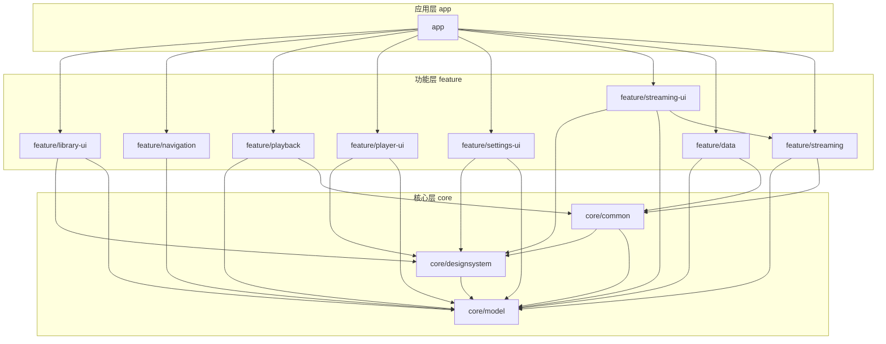
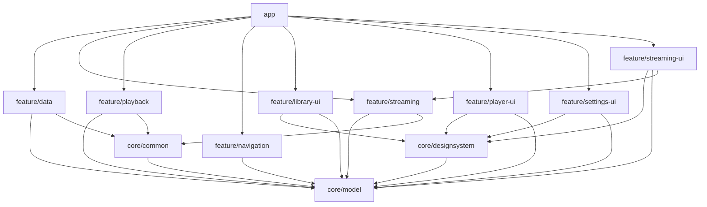
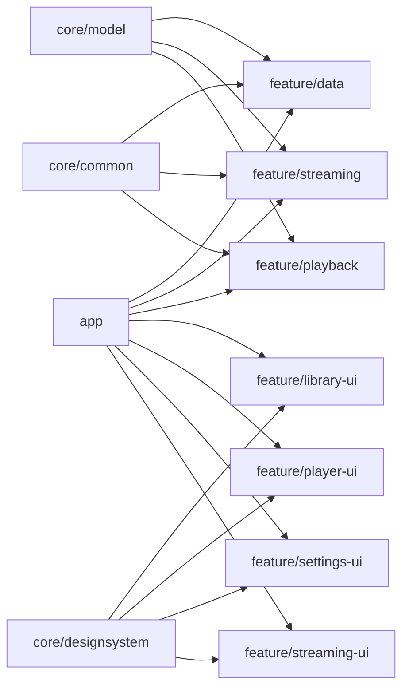

# 模块架构概览

<cite>
**本文引用的文件**   
- [settings.gradle](file://settings.gradle)
- [build.gradle](file://build.gradle)
- [app/build.gradle](file://app/build.gradle)
- [core/common/build.gradle](file://core/common/build.gradle)
- [core/designsystem/build.gradle](file://core/designsystem/build.gradle)
- [core/model/build.gradle](file://core/model/build.gradle)
- [feature/data/build.gradle](file://feature/data/build.gradle)
- [feature/library-ui/build.gradle](file://feature/library-ui/build.gradle)
- [feature/navigation/build.gradle](file://feature/navigation/build.gradle)
- [feature/playback/build.gradle](file://feature/playback/build.gradle)
- [feature/player-ui/build.gradle](file://feature/player-ui/build.gradle)
- [feature/settings-ui/build.gradle](file://feature/settings-ui/build.gradle)
- [feature/streaming/build.gradle](file://feature/streaming/build.gradle)
- [feature/streaming-ui/build.gradle](file://feature/streaming-ui/build.gradle)
</cite>

## 目录
1. [简介](#简介)
2. [项目结构](#项目结构)
3. [核心组件](#核心组件)
4. [架构总览](#架构总览)
5. [详细组件分析](#详细组件分析)
6. [依赖关系分析](#依赖关系分析)
7. [性能与构建优化](#性能与构建优化)
8. [故障排查指南](#故障排查指南)
9. [结论](#结论)

## 简介
本文件面向 Echo Android 应用的多模块架构，系统性阐述整体设计理念、分层职责、单向依赖规则以及模块化带来的收益。文档聚焦于三层划分：核心层（core）、功能层（feature）与应用层（app），并给出模块依赖图、关键构建配置要点与最佳实践建议，帮助团队在保持演进灵活性的同时提升编译速度、代码复用与可测试性。

## 项目结构
仓库采用多模块组织方式，顶层包含根构建脚本与设置脚本，按“core”、“feature”、“app”三大目录进行分层；此外还包含 metadata-gateway 等辅助工程与文档、脚本等资源。

图表来源
- [settings.gradle](file://settings.gradle)
- [app/build.gradle](file://app/build.gradle)
- [core/common/build.gradle](file://core/common/build.gradle)
- [core/designsystem/build.gradle](file://core/designsystem/build.gradle)
- [core/model/build.gradle](file://core/model/build.gradle)
- [feature/data/build.gradle](file://feature/data/build.gradle)
- [feature/library-ui/build.gradle](file://feature/library-ui/build.gradle)
- [feature/navigation/build.gradle](file://feature/navigation/build.gradle)
- [feature/playback/build.gradle](file://feature/playback/build.gradle)
- [feature/player-ui/build.gradle](file://feature/player-ui/build.gradle)
- [feature/settings-ui/build.gradle](file://feature/settings-ui/build.gradle)
- [feature/streaming/build.gradle](file://feature/streaming/build.gradle)
- [feature/streaming-ui/build.gradle](file://feature/streaming-ui/build.gradle)

章节来源
- [settings.gradle](file://settings.gradle)
- [build.gradle](file://build.gradle)

## 核心组件
- 核心层（core）
  - core/model：领域模型与数据契约的集中定义，供上层模块共享，避免重复建模。
  - core/common：通用工具、常量、基础类型与跨模块复用的公共能力。
  - core/designsystem：设计系统（主题、样式、基础 UI 组件），为各功能 UI 提供一致体验。
- 功能层（feature）
  - feature/data：数据访问与持久化实现，封装数据库、缓存、网络适配等细节。
  - feature/streaming：流媒体播放相关逻辑（如会话、策略、任务调度等）。
  - feature/playback：播放控制与状态编排，向上暴露稳定的播放域接口。
  - feature/library-ui / feature/player-ui / feature/settings-ui / feature/streaming-ui：对应业务场景的界面与交互。
  - feature/navigation：导航路由与页面跳转契约，解耦具体页面实现。
- 应用层（app）
  - 负责组装各功能模块、初始化依赖注入、声明入口 Activity/Service、集成平台能力与第三方 SDK。

章节来源
- [core/model/build.gradle](file://core/model/build.gradle)
- [core/common/build.gradle](file://core/common/build.gradle)
- [core/designsystem/build.gradle](file://core/designsystem/build.gradle)
- [feature/data/build.gradle](file://feature/data/build.gradle)
- [feature/streaming/build.gradle](file://feature/streaming/build.gradle)
- [feature/playback/build.gradle](file://feature/playback/build.gradle)
- [feature/library-ui/build.gradle](file://feature/library-ui/build.gradle)
- [feature/player-ui/build.gradle](file://feature/player-ui/build.gradle)
- [feature/settings-ui/build.gradle](file://feature/settings-ui/build.gradle)
- [feature/streaming-ui/build.gradle](file://feature/streaming-ui/build.gradle)
- [feature/navigation/build.gradle](file://feature/navigation/build.gradle)
- [app/build.gradle](file://app/build.gradle)

## 架构总览
Echo 采用“核心层 → 功能层 → 应用层”的分层与单向依赖原则：
- 核心层不依赖任何上层模块，仅暴露稳定契约（模型、工具、设计系统）。
- 功能层依赖核心层，彼此之间尽量通过核心层或明确定义的接口通信，避免循环依赖。
- 应用层聚合所有功能模块，完成装配与启动流程。

图表来源
- [settings.gradle](file://settings.gradle)
- [app/build.gradle](file://app/build.gradle)
- [core/model/build.gradle](file://core/model/build.gradle)
- [core/common/build.gradle](file://core/common/build.gradle)
- [core/designsystem/build.gradle](file://core/designsystem/build.gradle)
- [feature/data/build.gradle](file://feature/data/build.gradle)
- [feature/streaming/build.gradle](file://feature/streaming/build.gradle)
- [feature/playback/build.gradle](file://feature/playback/build.gradle)
- [feature/navigation/build.gradle](file://feature/navigation/build.gradle)
- [feature/library-ui/build.gradle](file://feature/library-ui/build.gradle)
- [feature/player-ui/build.gradle](file://feature/player-ui/build.gradle)
- [feature/settings-ui/build.gradle](file://feature/settings-ui/build.gradle)
- [feature/streaming-ui/build.gradle](file://feature/streaming-ui/build.gradle)

## 详细组件分析

### 核心层（core）
- 职责边界
  - core/model：领域实体、枚举、DTO、协议定义，确保跨模块数据一致性。
  - core/common：工具类、扩展函数、常量、错误码、线程/调度抽象等。
  - core/designsystem：主题、颜色、字体、图标、基础控件与布局规范。
- 依赖方向
  - 仅依赖 Android 框架与必要第三方库，不依赖任何 feature 或 app。
- 典型使用模式
  - 功能层通过引用 core 提供的 API 消费模型与工具，避免直接耦合底层实现。

章节来源
- [core/model/build.gradle](file://core/model/build.gradle)
- [core/common/build.gradle](file://core/common/build.gradle)
- [core/designsystem/build.gradle](file://core/designsystem/build.gradle)

### 功能层（feature）
- 职责边界
  - feature/data：数据源聚合、Room/缓存、网络客户端封装、Repository 实现。
  - feature/streaming：流式播放策略、会话管理、任务调度等。
  - feature/playback：播放状态机、队列、事件分发、与播放器引擎交互。
  - feature/*-ui：各自业务域的界面与交互逻辑，遵循 MVVM/MVI 风格（以模块内约定为准）。
  - feature/navigation：路由表、跳转参数契约、导航守卫。
- 依赖方向
  - 依赖 core 层；UI 模块依赖 designsystem；data/streaming/playback 依赖 model/common。
  - 功能模块间尽量避免直接依赖，必要时通过 core 层接口或应用层装配桥接。

章节来源
- [feature/data/build.gradle](file://feature/data/build.gradle)
- [feature/streaming/build.gradle](file://feature/streaming/build.gradle)
- [feature/playback/build.gradle](file://feature/playback/build.gradle)
- [feature/library-ui/build.gradle](file://feature/library-ui/build.gradle)
- [feature/player-ui/build.gradle](file://feature/player-ui/build.gradle)
- [feature/settings-ui/build.gradle](file://feature/settings-ui/build.gradle)
- [feature/streaming-ui/build.gradle](file://feature/streaming-ui/build.gradle)
- [feature/navigation/build.gradle](file://feature/navigation/build.gradle)

### 应用层（app）
- 职责边界
  - 作为最终产物，聚合所有功能模块，完成依赖注入、初始化流程、权限与平台能力接入。
  - 声明入口点（Activity/Service/Receiver），组合导航与功能模块。
- 依赖方向
  - 依赖所有需要使用的 feature 模块与必要的 core 模块。
  - 不向低层暴露应用级实现细节，避免反向依赖。

章节来源
- [app/build.gradle](file://app/build.gradle)

## 依赖关系分析
- 单向依赖规则
  - core 不依赖 feature 与 app。
  - feature 可依赖 core，但应避免互相强耦合；UI 模块依赖 designsystem。
  - app 依赖多个 feature 模块，承担装配职责。
- 潜在风险与治理
  - 若出现 feature 之间的直接依赖，应评估是否可通过 core 层抽象或应用层装配来解耦。
  - 对新增模块，优先放入 feature 并按职责拆分，避免将平台/业务细节下沉到 core。

图表来源
- [settings.gradle](file://settings.gradle)
- [app/build.gradle](file://app/build.gradle)
- [core/model/build.gradle](file://core/model/build.gradle)
- [core/common/build.gradle](file://core/common/build.gradle)
- [core/designsystem/build.gradle](file://core/designsystem/build.gradle)
- [feature/data/build.gradle](file://feature/data/build.gradle)
- [feature/streaming/build.gradle](file://feature/streaming/build.gradle)
- [feature/playback/build.gradle](file://feature/playback/build.gradle)
- [feature/library-ui/build.gradle](file://feature/library-ui/build.gradle)
- [feature/player-ui/build.gradle](file://feature/player-ui/build.gradle)
- [feature/settings-ui/build.gradle](file://feature/settings-ui/build.gradle)
- [feature/streaming-ui/build.gradle](file://feature/streaming-ui/build.gradle)

## 性能与构建优化
- 并行与增量编译
  - 启用 Gradle 并行构建与守护进程，缩短冷/热编译时间。
  - 合理拆分模块粒度，使无关变更影响范围最小化。
- 依赖收敛
  - 仅在需要的模块引入依赖，避免全量传递依赖膨胀。
  - 使用版本目录统一管理三方库版本，减少冲突与重建。
- 资源与产物优化
  - 按需开启 R8/ProGuard 混淆与压缩，减小 APK 体积。
  - 合理使用 buildTypes/flavors，避免不必要的变体组合。
- 缓存与 CI
  - 利用 Gradle 构建缓存与远程缓存，加速 CI 流水线。
  - 针对大模块（如 data、playback）单独缓存，提高并发效率。

章节来源
- [build.gradle](file://build.gradle)
- [gradle.properties](file://gradle.properties)
- [app/build.gradle](file://app/build.gradle)

## 故障排查指南
- 循环依赖检测
  - 若构建时报循环依赖错误，检查 feature 模块间是否存在直接依赖，必要时通过 core 层抽象或应用层装配解耦。
- 依赖缺失或版本冲突
  - 统一使用版本目录，核对模块 build.gradle 中的依赖声明，避免遗漏或版本不一致。
- 资源命名冲突
  - 当不同模块存在同名资源时，确认是否属于同一设计系统（designsystem）或需加前缀隔离。
- 构建缓慢
  - 定位耗时模块，尝试独立运行该模块构建；检查是否引入了过多传递依赖或大型库。

章节来源
- [settings.gradle](file://settings.gradle)
- [app/build.gradle](file://app/build.gradle)
- [core/common/build.gradle](file://core/common/build.gradle)
- [core/designsystem/build.gradle](file://core/designsystem/build.gradle)
- [core/model/build.gradle](file://core/model/build.gradle)
- [feature/*/build.gradle](file://feature/data/build.gradle)

## 结论
Echo 的多模块架构通过清晰的层次划分与严格的单向依赖规则，实现了高内聚、低耦合与良好的可维护性。核心层沉淀稳定契约，功能层专注业务能力，应用层负责装配与集成。配合合理的构建优化与依赖治理，可在保证开发体验的同时显著提升编译速度与团队协作效率。