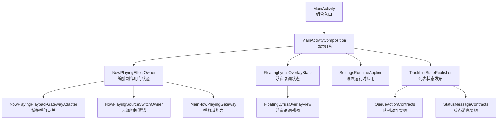
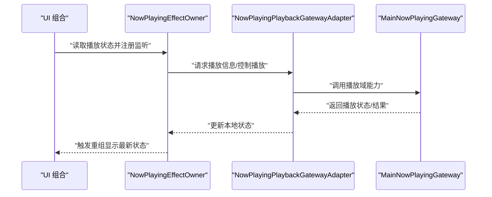
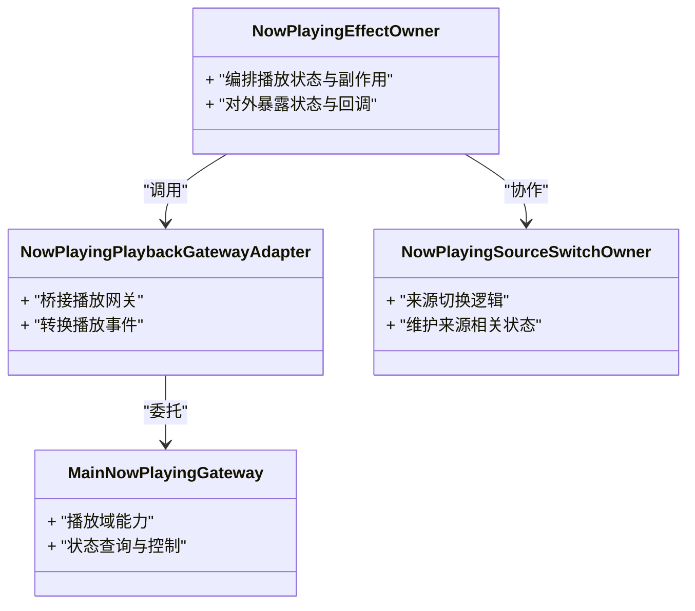
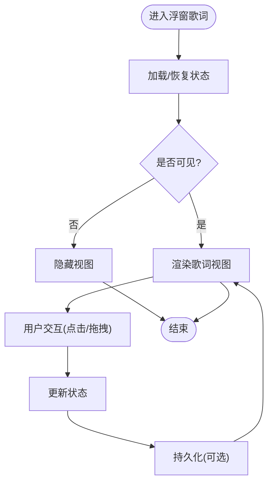
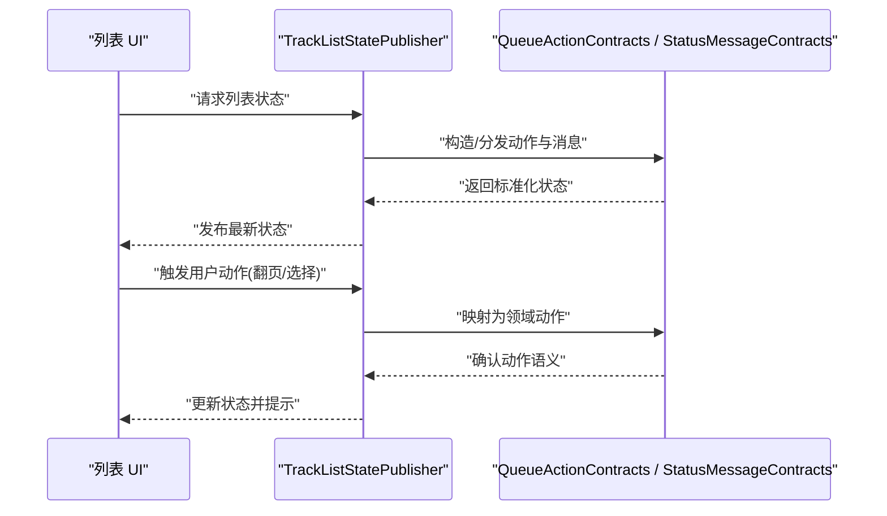
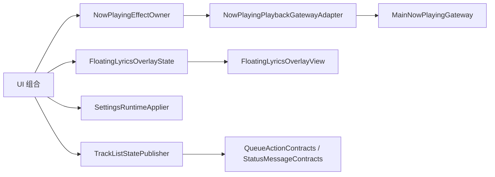

# Compose 状态管理

<cite>
**本文引用的文件**   
- [MainActivity.kt](file://app/src/main/java/app/yukine/MainActivity.kt)
- [MainActivityComposition.kt](file://app/src/main/java/app/yukine/MainActivityComposition.kt)
- [NowPlayingEffectOwner.kt](file://app/src/main/java/app/yukine/NowPlayingEffectOwner.kt)
- [NowPlayingPlaybackGatewayAdapter.kt](file://app/src/main/java/app/yukine/NowPlayingPlaybackGatewayAdapter.kt)
- [NowPlayingSourceSwitchOwner.kt](file://app/src/main/java/app/yukine/NowPlayingSourceSwitchOwner.kt)
- [MainNowPlayingGateway.kt](file://app/src/main/java/app/yukine/MainNowPlayingGateway.kt)
- [FloatingLyricsOverlayState.kt](file://app/src/main/java/app/yukine/FloatingLyricsOverlayState.kt)
- [FloatingLyricsOverlayView.kt](file://app/src/main/java/app/yukine/FloatingLyricsOverlayView.kt)
- [SettingsRuntimeApplier.kt](file://app/src/main/java/app/yukine/SettingsRuntimeApplier.kt)
- [TrackListStatePublisher.kt](file://app/src/main/java/app/yukine/TrackListStatePublisher.kt)
- [QueueActionContracts.kt](file://app/src/main/java/app/yukine/QueueActionContracts.kt)
- [StatusMessageContracts.kt](file://app/src/main/java/app/yukine/StatusMessageContracts.kt)
</cite>

## 目录
1. [简介](#简介)
2. [项目结构](#项目结构)
3. [核心组件](#核心组件)
4. [架构总览](#架构总览)
5. [详细组件分析](#详细组件分析)
6. [依赖分析](#依赖分析)
7. [性能考虑](#性能考虑)
8. [故障排查指南](#故障排查指南)
9. [结论](#结论)
10. [附录](#附录)

## 简介
本文件面向 Echo Android 应用中的 Jetpack Compose 状态管理，聚焦以下目标：
- 解释 Compose 中的状态概念与核心 API（State、MutableState、remember 等）的使用方式与最佳实践。
- 文档化 NowBarState、NowPlayingContracts 等状态定义的最佳实践（以仓库中实际存在的状态契约与实现为依据）。
- 说明组合式状态提升（State Hoisting）的原则与落地方式。
- 解释在 Compose 中如何管理复杂的状态层次结构，包括状态共享、持久化与恢复。
- 提供具体代码示例路径，展示如何创建响应式 UI 组件和处理用户交互状态。

## 项目结构
Echo 的 Compose 状态管理主要分布在 app 模块的入口与“正在播放”相关组件中，并通过 Gateway/Owner 模式将 UI 状态与底层播放服务解耦。关键位置如下：
- 主界面与组合入口：MainActivity、MainActivityComposition
- “正在播放”UI 与效果编排：NowPlayingEffectOwner、NowPlayingPlaybackGatewayAdapter、NowPlayingSourceSwitchOwner、MainNowPlayingGateway
- 浮窗歌词覆盖层状态与视图：FloatingLyricsOverlayState、FloatingLyricsOverlayView
- 设置运行时应用：SettingsRuntimeApplier
- 列表状态发布与契约：TrackListStatePublisher、QueueActionContracts、StatusMessageContracts

图表来源
- [MainActivity.kt](file://app/src/main/java/app/yukine/MainActivity.kt)
- [MainActivityComposition.kt](file://app/src/main/java/app/yukine/MainActivityComposition.kt)
- [NowPlayingEffectOwner.kt](file://app/src/main/java/app/yukine/NowPlayingEffectOwner.kt)
- [NowPlayingPlaybackGatewayAdapter.kt](file://app/src/main/java/app/yukine/NowPlayingPlaybackGatewayAdapter.kt)
- [NowPlayingSourceSwitchOwner.kt](file://app/src/main/java/app/yukine/NowPlayingSourceSwitchOwner.kt)
- [MainNowPlayingGateway.kt](file://app/src/main/java/app/yukine/MainNowPlayingGateway.kt)
- [FloatingLyricsOverlayState.kt](file://app/src/main/java/app/yukine/FloatingLyricsOverlayState.kt)
- [FloatingLyricsOverlayView.kt](file://app/src/main/java/app/yukine/FloatingLyricsOverlayView.kt)
- [SettingsRuntimeApplier.kt](file://app/src/main/java/app/yukine/SettingsRuntimeApplier.kt)
- [TrackListStatePublisher.kt](file://app/src/main/java/app/yukine/TrackListStatePublisher.kt)
- [QueueActionContracts.kt](file://app/src/main/java/app/yukine/QueueActionContracts.kt)
- [StatusMessageContracts.kt](file://app/src/main/java/app/yukine/StatusMessageContracts.kt)

章节来源
- [MainActivity.kt](file://app/src/main/java/app/yukine/MainActivity.kt)
- [MainActivityComposition.kt](file://app/src/main/java/app/yukine/MainActivityComposition.kt)

## 核心组件
本节聚焦 Compose 状态管理的核心概念与实践要点，并结合仓库中的实际实现进行说明。

- State 与 MutableState
  - 使用 remember 缓存状态对象，避免重组时重建导致状态丢失。
  - 对可变状态使用 MutableState，通过 .value 读写触发重组。
  - 对于不可变数据，优先使用普通数据类或 sealed class，配合上层状态提升。

- remember 与 rememberSaveable
  - remember 用于组合生命周期内的状态缓存。
  - rememberSaveable 用于进程重启后的状态恢复（如输入框文本、展开折叠状态等）。

- 状态提升（State Hoisting）
  - 将状态提升到尽可能高的可复用层级，使组件成为纯函数式呈现。
  - 通过回调将用户操作向上传递，由父级负责状态变更与副作用。

- 副作用与状态同步
  - 使用 LaunchedEffect/DisposableEffect 处理与外部系统（如播放服务）的同步。
  - 通过 EffectOwner/Gateway 模式隔离副作用，保持 UI 层的简洁与可测试性。

- 复杂状态层次结构
  - 使用 sealed class 表达状态机（加载中、成功、失败等），结合 remember 管理当前分支。
  - 跨屏共享状态可通过 ViewModel 或单例 Store 暴露为 StateFlow/MutableState，并在 Compose 侧订阅。

章节来源
- [NowPlayingEffectOwner.kt](file://app/src/main/java/app/yukine/NowPlayingEffectOwner.kt)
- [FloatingLyricsOverlayState.kt](file://app/src/main/java/app/yukine/FloatingLyricsOverlayState.kt)
- [TrackListStatePublisher.kt](file://app/src/main/java/app/yukine/TrackListStatePublisher.kt)

## 架构总览
下图展示了“正在播放”相关的状态流与组件协作关系，体现状态提升与副作用编排。

图表来源
- [NowPlayingEffectOwner.kt](file://app/src/main/java/app/yukine/NowPlayingEffectOwner.kt)
- [NowPlayingPlaybackGatewayAdapter.kt](file://app/src/main/java/app/yukine/NowPlayingPlaybackGatewayAdapter.kt)
- [MainNowPlayingGateway.kt](file://app/src/main/java/app/yukine/MainNowPlayingGateway.kt)

## 详细组件分析

### 正在播放（Now Playing）状态编排
- 职责划分
  - NowPlayingEffectOwner：编排播放状态的副作用、监听与更新，向上暴露给 UI。
  - NowPlayingPlaybackGatewayAdapter：封装对播放服务的访问，屏蔽底层差异。
  - MainNowPlayingGateway：提供播放域的统一能力接口。
  - NowPlayingSourceSwitchOwner：处理不同播放来源的切换逻辑。

- 状态流
  - UI 从 Owner 读取状态；当用户交互触发时，Owner 通过 Adapter 调用 Gateway 执行动作；Gateway 返回新状态后，Owner 更新本地状态并触发重组。

图表来源
- [NowPlayingEffectOwner.kt](file://app/src/main/java/app/yukine/NowPlayingEffectOwner.kt)
- [NowPlayingPlaybackGatewayAdapter.kt](file://app/src/main/java/app/yukine/NowPlayingPlaybackGatewayAdapter.kt)
- [MainNowPlayingGateway.kt](file://app/src/main/java/app/yukine/MainNowPlayingGateway.kt)
- [NowPlayingSourceSwitchOwner.kt](file://app/src/main/java/app/yukine/NowPlayingSourceSwitchOwner.kt)

章节来源
- [NowPlayingEffectOwner.kt](file://app/src/main/java/app/yukine/NowPlayingEffectOwner.kt)
- [NowPlayingPlaybackGatewayAdapter.kt](file://app/src/main/java/app/yukine/NowPlayingPlaybackGatewayAdapter.kt)
- [NowPlayingSourceSwitchOwner.kt](file://app/src/main/java/app/yukine/NowPlayingSourceSwitchOwner.kt)
- [MainNowPlayingGateway.kt](file://app/src/main/java/app/yukine/MainNowPlayingGateway.kt)

### 浮窗歌词覆盖层（Floating Lyrics Overlay）
- 状态与视图分离
  - FloatingLyricsOverlayState：集中管理浮窗歌词的状态（可见性、内容、位置等）。
  - FloatingLyricsOverlayView：根据状态渲染 UI，并将用户交互回调给上层。

- 状态持久化与恢复
  - 使用 rememberSaveable 保存需要跨配置变更或进程重启保留的状态。
  - 对于更复杂的持久化需求，可将状态序列化到本地存储，并在启动时恢复。

图表来源
- [FloatingLyricsOverlayState.kt](file://app/src/main/java/app/yukine/FloatingLyricsOverlayState.kt)
- [FloatingLyricsOverlayView.kt](file://app/src/main/java/app/yukine/FloatingLyricsOverlayView.kt)

章节来源
- [FloatingLyricsOverlayState.kt](file://app/src/main/java/app/yukine/FloatingLyricsOverlayState.kt)
- [FloatingLyricsOverlayView.kt](file://app/src/main/java/app/yukine/FloatingLyricsOverlayView.kt)

### 设置运行时应用（Settings Runtime Applier）
- 职责
  - 将设置项应用到运行时环境，确保 UI 行为与用户偏好一致。
- 状态管理
  - 通过 remember 缓存运行时设置，避免重复计算。
  - 在设置变更时触发必要的副作用（如主题、字体大小、播放控件布局等）。

章节来源
- [SettingsRuntimeApplier.kt](file://app/src/main/java/app/yukine/SettingsRuntimeApplier.kt)

### 列表状态发布（Track List State Publisher）
- 职责
  - 将播放列表的状态发布给 UI，支持分页、加载态、错误态等。
- 契约与动作
  - 通过 QueueActionContracts 定义队列动作类型，保证 UI 与业务逻辑之间的清晰边界。
  - 通过 StatusMessageContracts 定义状态消息类型，便于统一提示与反馈。

图表来源
- [TrackListStatePublisher.kt](file://app/src/main/java/app/yukine/TrackListStatePublisher.kt)
- [QueueActionContracts.kt](file://app/src/main/java/app/yukine/QueueActionContracts.kt)
- [StatusMessageContracts.kt](file://app/src/main/java/app/yukine/StatusMessageContracts.kt)

章节来源
- [TrackListStatePublisher.kt](file://app/src/main/java/app/yukine/TrackListStatePublisher.kt)
- [QueueActionContracts.kt](file://app/src/main/java/app/yukine/QueueActionContracts.kt)
- [StatusMessageContracts.kt](file://app/src/main/java/app/yukine/StatusMessageContracts.kt)

### 组合入口（MainActivity & MainActivityComposition）
- 职责
  - 作为 Compose 的组合入口，组织顶层状态与导航。
  - 注入各功能模块的状态提供者与控制器。
- 状态管理
  - 使用 remember/rememberSaveable 管理页面级状态。
  - 通过状态提升将子组件的状态上移至组合入口，便于跨屏共享与恢复。

章节来源
- [MainActivity.kt](file://app/src/main/java/app/yukine/MainActivity.kt)
- [MainActivityComposition.kt](file://app/src/main/java/app/yukine/MainActivityComposition.kt)

## 依赖分析
- 耦合与内聚
  - NowPlayingEffectOwner 与 Gateway/Adapter 之间通过明确接口解耦，提高可测试性与可替换性。
  - 浮窗歌词状态与视图分离，增强复用与可维护性。
- 外部依赖
  - 播放服务与网络层通过 Gateway 抽象，避免 UI 直接依赖底层实现。
- 潜在循环依赖
  - 通过 Owner/Gateway 模式降低循环风险，确保单向数据流。

图表来源
- [NowPlayingEffectOwner.kt](file://app/src/main/java/app/yukine/NowPlayingEffectOwner.kt)
- [NowPlayingPlaybackGatewayAdapter.kt](file://app/src/main/java/app/yukine/NowPlayingPlaybackGatewayAdapter.kt)
- [MainNowPlayingGateway.kt](file://app/src/main/java/app/yukine/MainNowPlayingGateway.kt)
- [FloatingLyricsOverlayState.kt](file://app/src/main/java/app/yukine/FloatingLyricsOverlayState.kt)
- [FloatingLyricsOverlayView.kt](file://app/src/main/java/app/yukine/FloatingLyricsOverlayView.kt)
- [SettingsRuntimeApplier.kt](file://app/src/main/java/app/yukine/SettingsRuntimeApplier.kt)
- [TrackListStatePublisher.kt](file://app/src/main/java/app/yukine/TrackListStatePublisher.kt)
- [QueueActionContracts.kt](file://app/src/main/java/app/yukine/QueueActionContracts.kt)
- [StatusMessageContracts.kt](file://app/src/main/java/app/yukine/StatusMessageContracts.kt)

章节来源
- [NowPlayingEffectOwner.kt](file://app/src/main/java/app/yukine/NowPlayingEffectOwner.kt)
- [NowPlayingPlaybackGatewayAdapter.kt](file://app/src/main/java/app/yukine/NowPlayingPlaybackGatewayAdapter.kt)
- [MainNowPlayingGateway.kt](file://app/src/main/java/app/yukine/MainNowPlayingGateway.kt)
- [FloatingLyricsOverlayState.kt](file://app/src/main/java/app/yukine/FloatingLyricsOverlayState.kt)
- [FloatingLyricsOverlayView.kt](file://app/src/main/java/app/yukine/FloatingLyricsOverlayView.kt)
- [SettingsRuntimeApplier.kt](file://app/src/main/java/app/yukine/SettingsRuntimeApplier.kt)
- [TrackListStatePublisher.kt](file://app/src/main/java/app/yukine/TrackListStatePublisher.kt)
- [QueueActionContracts.kt](file://app/src/main/java/app/yukine/QueueActionContracts.kt)
- [StatusMessageContracts.kt](file://app/src/main/java/app/yukine/StatusMessageContracts.kt)

## 性能考虑
- 减少不必要的重组
  - 使用 remember 缓存昂贵计算结果与状态对象。
  - 将大对象拆分为小状态，按需重组。
- 优化副作用
  - 仅在必要参数变化时触发 LaunchedEffect/DisposableEffect。
  - 避免在 effect 中执行重计算，必要时引入去抖与节流。
- 列表性能
  - 使用稳定的 key 与分页策略，避免全量刷新。
  - 将列表项状态下沉至行级，减少整体列表重组范围。

[本节为通用指导，不直接分析具体文件]

## 故障排查指南
- 常见问题
  - 状态未更新：检查是否正确使用 remember 与 MutableState，并确保在正确的组合作用域内读写。
  - 副作用重复执行：核对 effect 的依赖参数，避免空引用或频繁变化的对象导致重复触发。
  - 状态丢失：确认是否需要使用 rememberSaveable 或将状态提升至更高层级。
- 定位方法
  - 在 EffectOwner 中打印状态变更日志，观察状态流转是否符合预期。
  - 使用契约（Contracts）验证动作与消息的语义一致性，确保 UI 与业务逻辑对齐。

章节来源
- [NowPlayingEffectOwner.kt](file://app/src/main/java/app/yukine/NowPlayingEffectOwner.kt)
- [QueueActionContracts.kt](file://app/src/main/java/app/yukine/QueueActionContracts.kt)
- [StatusMessageContracts.kt](file://app/src/main/java/app/yukine/StatusMessageContracts.kt)

## 结论
Echo 的 Compose 状态管理遵循清晰的单向数据流与状态提升原则，通过 Owner/Gateway 模式有效隔离副作用与业务逻辑，提升了可维护性与可测试性。浮窗歌词与列表状态等场景展示了状态分层、持久化与恢复的实践。建议继续完善契约与状态机的定义，进一步降低耦合度并提升用户体验。

[本节为总结，不直接分析具体文件]

## 附录
- 术语
  - 状态提升（State Hoisting）：将状态上移到更高层级，使组件更纯粹、更易复用。
  - 副作用（Side Effects）：与外部系统交互的操作，如网络请求、持久化、动画等。
  - 契约（Contracts）：定义 UI 与业务之间的动作与消息类型，确保一致的语义。

[本节为概念说明，不直接分析具体文件]